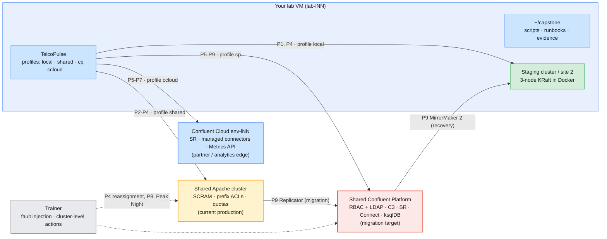

# Capstone — Running TelcoPulse: Operate, Secure, Migrate and Recover a Telecom Usage Platform

> **Course:** Apache Kafka & Confluent Kafka Administration
> **Format:** Individual project, built in nine phases alongside Modules 1–10
> **Part A:** [Apache Kafka](part-a-apache-kafka.md) — Phases 1–4 (Modules 1–5)
> **Part B:** [Confluent Kafka](part-b-confluent-kafka.md) — Phases 5–9 (Modules 6–10)
> **Submission template:** [`submission-template.md`](submission-template.md)
> **Trainer guide:** [`trainer-guide.md`](trainer-guide.md) (readiness checks, answer key, fault-injection kit, Peak Night run sheet, marking guide)

This document is the **specification**. It says *what* the platform must do,
*what you must prove* and *how it is judged*. It does not give you the
commands or the answers: the configuration values, the runbooks and the
decisions are yours to make and defend. Every decision should trace to a
requirement ID (`BR-…`, `NFR-…`, `SLO-…`) in this document.

> The operator, volumes and tariffs are invented for the exercise. They are
> realistic in shape, not any real operator's figures.

---

## 1. The scenario

**TelcoPulse** is a mobile operator. Every voice call, text and data session
produces a usage record (CDR) that must be **billed correctly**, **checked for
fraud** and **counted for analytics**, without the three systems slowing each
other down. Cell towers also stream radio telemetry. A development team has
already built the application: the
[TelcoPulse case study](../casestudies/telecom-usage-platform/README.md)
(billing, fraud detection, analytics, plan table, audit trail).

You are **not** the developers. You are the **platform operations team** that
must run that application on Kafka in production. Today it runs on
self-managed **Apache Kafka**. Management has decided to move the core
platform to **Confluent** and has set four problems for you:

| Problem today | Business impact | What you must deliver |
| ------------- | --------------- | --------------------- |
| Nobody can say what happens to a billing record when a broker dies | Lost revenue, regulator questions | Written, **tested** durability contracts per topic, and proof (Phases 2, 4) |
| Capacity was guessed. The last New Year's Eve peak filled a disk and lagged billing for hours | Late invoices, support calls | A capacity plan, a load test at 4× and alerts that fire **before** the SLO breaks (Phases 4, 7) |
| Every application uses one shared super-user credential | Any bug or leak reaches all data, including audit | Least-privilege access per application and per human role, with allow **and deny** tests (Phase 6) |
| Incidents are solved from memory, and the post-mortem never gets written | The same outage repeats | Runbooks, a message-loss prevention checklist and incident reports (Phase 8) |
| The Confluent move has no plan | Risk of lost CDRs and a long billing pause | A rehearsed Apache → Confluent migration with rollback, plus a second-site copy for recovery (Phase 9) |

The capstone ends with **Peak Night**: a timed, live exercise on the Confluent
cluster in which you operate the platform under load while the trainer injects
faults you have not seen before (*Peak Night* in [Part B](part-b-confluent-kafka.md#peak-night)).

### What is different from the labs

| Labs | Capstone |
| ---- | -------- |
| One concept per lab, steps given | One platform, outcomes given, **steps are yours** |
| Run a command and read the output | Decide, write it down as code, test it, defend it |
| Each module stands alone | Each phase **builds on the previous**: you never throw work away, you harden it |
| The trainer designs the fault | You write the runbook first, then the trainer breaks something |

---

## 2. Alignment with the course outline

Every topic of the
[course outline](../courseOutline/Kafka_Administration_CourseOutline.pdf) is
exercised at least once. The phase gives the topic a business reason.

| Module | Outline topics (abridged) | Capstone phase and task |
| ------ | ------------------------- | ----------------------- |
| **1** Messaging & Kafka fundamentals | Queues vs pub-sub, ecosystem, architecture, offsets, replicas, retention and compaction, ZooKeeper vs KRaft | **P1** design review of TelcoPulse topics, KRaft decision note (T1.1–T1.4) |
| **2** Installation, setup & CLI | Install options, KRaft, CLI tools, topic CRUD, produce and consume | **P1** staging cluster and a repeatable health check (T1.5–T1.7) |
| **3** Configuration, storage & retention | Broker and topic configs, segments, retention, cleanup policies, `min.insync.replicas`, `acks`, storage optimisation | **P2** topic contracts as code, durability matrix, storage sizing (T2.1–T2.6) |
| **4** Producing & consuming | Producer tuning, consumer groups, offsets, delivery semantics, error handling | **P3** client configuration standard, group operations, delivery-semantics audit (T3.1–T3.5) |
| **5** Cluster operations, replication & HA | Reassignment, ISR and leader election, broker failure, rolling restart, capacity planning | **P4** capacity plan, reassignment, failure drills, rolling-restart runbook (T4.1–T4.7) |
| **6** Introducing Confluent | Platform architecture, Confluent vs Apache, Cloud vs Platform, Confluent CLI, Control Center, topic management | **P5** deployment decision record, mapping Apache settings to Confluent, smoke runs (T5.1–T5.6) |
| **7** Security | RBAC, API keys and secrets, authentication and authorisation, encryption, comparison with ACLs/SASL/SSL | **P6** access matrix, role bindings as code, allow/deny tests, key rotation (T6.1–T6.7) |
| **8** Monitoring & tuning | Control Center, Metrics API, load metrics, scaling, JMX/Prometheus comparison | **P7** SLO dashboard, lag alert, tuning experiment, 4× load test (T7.1–T7.7) |
| **9** Troubleshooting & message loss | Errors and logs, root causes of loss, connectivity, consumer lag, support model, prevention checklist | **P8** game day: four trainer-injected incidents, reports, checklist (T8.0–T8.5) |
| **10** Ecosystem, migration, DR | Managed connectors, Schema Registry, ksqlDB, Replicator and multi-datacenter, migration (data, cutover, dual-write) | **P9** schemas, connectors, ksqlDB, **Apache → Confluent migration**, second-site recovery, Peak Night (T9.1–T9.11) |

---

## 3. Environments: everything already exists

**Nothing new is built for learners.** The capstone runs on the course
infrastructure and the TelcoPulse application you already used in the labs.

| Environment | What it is | Access | Used for |
| ----------- | ---------- | ------ | -------- |
| **Own VM** (`lab-lNN`) | Docker, Kafka 4.x CLI, Confluent CLI, Java, Maven, `jq` | Browser VS Code | All your work, scripts and evidence. Runs the app |
| **Staging cluster** | Your own 3-node KRaft Docker cluster ([`labs/module-02`](../labs/module-02/docker-compose.yml)) | Full control | Everything destructive: broker kills, rolling restarts, durability tests. Doubles as **site 2** for recovery in Phase 9 |
| **Shared Apache cluster** | Kafka 4.3.1, 3 controllers, 4 brokers (11–14), SASL/SCRAM, prefix ACLs, per-user quotas | `apache-kafka.lab.internal:9092`, `~/kafka/apache.properties` | The **current production** platform. Configure and test within your `lNN.` prefix. Cluster-level changes are the trainer's |
| **Shared Confluent Platform** | CP 8.3.x, 3 controllers, 3 brokers, MDS + LDAP RBAC, Control Center, Schema Registry, Connect (with Replicator), ksqlDB | `cp-kafka.lab.internal:9092`, `~/kafka/cp.properties`, `$C3_URL` | The **migration target** for the core platform |
| **Confluent Cloud** | Your environment `env-lNN` with Basic cluster `lNN-basic`, Schema Registry, managed connectors, Metrics API | Confluent CLI and Console | The **partner and analytics edge**, plus Cloud-only features |
| **TelcoPulse app** | Spring Boot application with four connection profiles: `local`, `shared`, `cp`, `ccloud` | [`casestudies/telecom-usage-platform`](../casestudies/telecom-usage-platform/README.md) | The **workload**. You configure and observe it; you do not change its code |



Course lab setup behind these environments:
[`infra/LAB-SETUP.md`](../infra/LAB-SETUP.md),
[`infra/confluent/README.md`](../infra/confluent/README.md),
[`infra/cluster/PLAN.md`](../infra/cluster/PLAN.md).

---

## 4. Requirements

### 4.1 Business requirements

| ID | Requirement |
| -- | ----------- |
| **BR-1** | No **acknowledged** usage record or charge is lost when one broker fails (RPO = 0 for acknowledged business records). |
| **BR-2** | Billing can be down for **72 hours** and catch up without data loss. Every usage topic keeps data at least as long as the longest tolerated consumer outage, with a 100 % margin. |
| **BR-3** | Fraud alerts stay fresh: `fraud-detection` lags by less than **60 seconds** of traffic, at normal load and at 4× peak. |
| **BR-4** | Regulation: charges are kept **30 days**, audit events **90 days**. Every change to a business topic and every access-control change can be traced to **who, when, what**. |
| **BR-5** | The platform runs a **4× peak for two hours** without breaching a lag SLO, without any broker disk above 70 %, and without throttling business traffic. |
| **BR-6** | **Least privilege.** Each application and each human role gets only the access it needs. No shared credentials. Secrets rotate with **no downtime**. |
| **BR-7** | The Apache → Confluent move pauses billing for at most **5 minutes**, loses **no** CDR, makes any duplicate **detectable**, and can be **rolled back within 15 minutes**. |
| **BR-8** | A **second-site copy** of the core topics exists with an RPO of at most **5 minutes**. A failover to it has been rehearsed and timed (RTO target 30 minutes). |
| **BR-9** | Every alert has a runbook. Every incident gets a written, blameless review with a prevention action. |

### 4.2 Non-functional requirements (how you must work)

| ID | Requirement |
| -- | ----------- |
| **NFR-1** | **Reproducible.** Every change to a cluster is made by a script or committed CLI command in `~/capstone`, so a colleague can repeat it. A UI-only action needs a screenshot and the equivalent CLI command where one exists. |
| **NFR-2** | **Isolation.** Every topic, group, connector, subject, service account and key you create starts with `lNN.` (or `lNN-` where `.` is not allowed). You never touch another learner's resources. |
| **NFR-3** | **Etiquette and cost.** Stay inside the load caps in §8. Delete Confluent Cloud connectors in the same session you create them. Clean up each phase. |
| **NFR-4** | **No secrets in the submission.** Passwords, API secrets and keys never appear in a script, evidence file or screenshot (§7 gives the scan you must pass). |
| **NFR-5** | **Evidence, not claims.** Every acceptance check has raw command output (or a screenshot) with a timestamp and one or two sentences of interpretation. |

### 4.3 Service-level objectives you will measure against

| ID | Objective | Measured in |
| -- | --------- | ----------- |
| **SLO-1** | Business topics (`cdr.*`, `billing.charges`, `audit.events`, `subscriber.plan`) lose **no acknowledged record** when one broker fails | P2, P4 |
| **SLO-2** | `billing` consumer-group lag stays below **30 seconds of traffic** (about 1,500 records at normal load, 6,000 at peak) for 99 % of samples | P7, Peak Night |
| **SLO-3** | Produce latency p99 at `acks=all` is at most **200 ms** at normal load on the target cluster | P7 |
| **SLO-4** | **Zero failed sends** on business topics during a rolling restart (idempotent producer, retries on) | P4 |
| **SLO-5** | After an unplanned broker loss, leaders are re-elected and produce resumes within **30 seconds** | P4 |
| **SLO-6** | `fraud-detection` lag below **60 seconds** of traffic (BR-3) | P7, Peak Night |

### 4.4 Workload profiles

You will see these numbers in several phases. Use the **lab-scale** profiles for
real tests and the **production-scale** inputs for paper calculations. Your
capacity plan must show how the lab test extrapolates.

| Profile | Value | Used for |
| ------- | ----- | -------- |
| **Normal (lab)** | 50 CDR/s (`start?rate=50`) plus a steady telemetry trickle | Baselines, SLO measurement |
| **Peak (lab)** | 200 CDR/s (4×) for 10 minutes | Load test, Peak Night |
| **Production inputs** | 20 million subscribers; 25 CDRs per subscriber per day on average; average CDR 400 bytes as JSON before compression; peak is 4× the average rate; the busy hour carries 10 % of the day | Capacity plan (P4), sizing (P2) |
| **Telemetry inputs** | 30,000 cell sites, one 150-byte sample per second each, 1 hour retention, RF 2 | Capacity plan (P4) |
| **Retention targets** | From the [topic design](../casestudies/telecom-usage-platform/README.md#4-topic-design-module-3-section-41) (`cdr.voice` 7 d, `cdr.sms` and `cdr.data` 3 d, `billing.charges` 30 d, `audit.events` 90 d, telemetry 1 h) as **version 1**. You review it against BR-2 and BR-4 in Phase 2 | P2 |

---

## 5. Phases and effort

Each phase opens after the module it depends on and ends with a **gate**: the
acceptance checks listed in its section. You may start the next phase before
a gate is signed off, but you cannot be marked on a phase whose gate you have
not run.

| Phase | Opens after | Where | Focus | Effort |
| ----- | ----------- | ----- | ----- | ------ |
| **P1** Design & staging | Module 2 | Own VM, staging cluster | Topic catalog review, KRaft note, health check, CLI kit | 1.5 h |
| **P2** Contracts & durability | Module 3 | Shared Apache + staging | Topics as code, retention and compaction proof, `acks` × min-ISR matrix, storage sizing | 2 h |
| **P3** Client operations | Module 4 | Shared Apache | Client config standard, consumer-group operations, delivery-semantics audit | 1.5 h |
| **P4** Operations & HA | Module 5 | Shared Apache (read-only) + staging | Capacity plan, reassignment, failure drills, rolling-restart runbook | 2.5 h |
| **P5** Move to Confluent | Module 6 | Confluent Cloud + Platform | Deployment decision record, setting map, smoke runs | 1 h |
| **P6** Secure the platform | Module 7 | Cloud + Platform | Access matrix, role bindings as code, allow/deny tests, key rotation | 2 h |
| **P7** Monitor & tune | Module 8 | Platform + Cloud Metrics API | SLO dashboard, lag alert, tuning experiment, 4× load test | 2 h |
| **P8** Game day | Module 9 | Platform + shared Apache | Four injected incidents, reports, prevention checklist | 2.5 h |
| **P9** Ecosystem, migration, recovery | Module 10 | Platform + Cloud + staging | Schema Registry, connectors, ksqlDB, migration, second site, **Peak Night** | 6 h |
| | | | **Total** | **about 21 h** |

Most of the effort is homework between sessions. P8 and the Peak Night part of
P9 are **in class**, because the trainer injects the faults.

```mermaid
flowchart LR
    P1["P1<br/>Design &<br/>staging"] --> P2["P2<br/>Contracts &<br/>durability"] --> P3["P3<br/>Client<br/>operations"] --> P4["P4<br/>Operations<br/>& HA"]
    P4 --> P5["P5<br/>Move to<br/>Confluent"] --> P6["P6<br/>Secure"] --> P7["P7<br/>Monitor<br/>& tune"] --> P8["P8<br/>Game day"] --> P9["P9<br/>Migrate, recover,<br/>Peak Night"]

    style P1 fill:#fff3cd,stroke:#ff9800,color:#1a1a1a
    style P2 fill:#fff3cd,stroke:#ff9800,color:#1a1a1a
    style P3 fill:#fff3cd,stroke:#ff9800,color:#1a1a1a
    style P4 fill:#fff3cd,stroke:#ff9800,color:#1a1a1a
    style P5 fill:#fce8e6,stroke:#ea4335,color:#1a1a1a
    style P6 fill:#fce8e6,stroke:#ea4335,color:#1a1a1a
    style P7 fill:#fce8e6,stroke:#ea4335,color:#1a1a1a
    style P8 fill:#fce8e6,stroke:#ea4335,color:#1a1a1a
    style P9 fill:#fce8e6,stroke:#ea4335,color:#1a1a1a
```



> **Status.** Phases 1–4 can open as soon as Modules 1–5 are taught.
> Part B opens with Module 6. Phases 8 and 9 need the trainer's fault-injection
> kit and several infrastructure checks, listed in
> [`trainer-guide.md`](trainer-guide.md) §1 and §4.

---

## 6. What you write: no application code

You do **not** change TelcoPulse. You run it with different profiles and
settings, and you write:

| Kind | Examples | Where |
| ---- | -------- | ----- |
| **Scripts** (bash, CLI, `curl`) | Topic catalog applier, health check, role-binding script, test matrix, rolling restart, migration verification | `~/capstone/scripts/` |
| **Declarative files** | `topics.yaml` (or `.csv`), role matrix, connector and Replicator JSON, schema files | `~/capstone/config/` |
| **Documents** | Design notes, capacity plan, decision records, runbooks, incident reports, checklist | `~/capstone/docs/` |
| **Evidence** | Command output, screenshots, timings | `~/capstone/evidence/phase-N/` |

If you want to override a TelcoPulse setting, use its configuration
properties or environment variables (see the case-study README §5,
*Configuration*). If a requirement cannot be met without a code change,
**write it up as a finding** with the change you would ask the development
team for. That is a valid and often the correct answer.

---

## 7. Deliverables and submission

One folder per learner, delivered as a Git repository or a zip, laid out as in
[`submission-template.md`](submission-template.md):

```
capstone-lNN/
├── README.md                 submission report (from submission-template.md)
├── scripts/                  everything you ran
├── config/                   everything you applied
├── docs/                     notes, plans, runbooks, decision records, incident reports
└── evidence/phase-1 … phase-9/
```

Before you submit, pass this self-scan. It must print nothing:

```bash
# (VM) - from capstone-lNN
grep -rIE "password *=|secret *=|api[_-]?secret|PRIVATE KEY|sasl\.jaas\.config=.*password=\"[^\"]+\"" . \
  | grep -v "<redacted>" | grep -v "README.md:.*example"
```

Redact with `<redacted>`. A submission that contains a live secret is **not
accepted** until it is rotated and re-submitted (a 10-point deduction applies
even if rotated, because rotation is an incident).

---

## 8. Rules of engagement on shared infrastructure

The clusters are shared by 18 learners. These limits keep everyone working.

| Rule | Limit |
| ---- | ----- |
| Names | Only `lNN.` resources. No wildcard deletes outside your prefix |
| Load on the shared Apache cluster | Inside the 1 MB/s per-broker producer quota. Do not try to defeat it |
| Load on the shared Confluent Platform cluster | At most **1 MB/s sustained**, at most **10 minutes** per run, never during another learner's announced test. The trainer staggers P7 and Peak Night |
| Retention experiments | Only on topics you created for the experiment, restored or deleted afterwards |
| Cluster-level changes (reassignment execution, broker stop, quotas, role bindings outside your prefix) | **Trainer only.** Prepare the plan and hand it over |
| Confluent Cloud | Delete managed connectors **in the same session**. Do not add clusters or change billing settings |
| Replicator | One connector, `tasks.max=1`, only your `lNN.` topics, in the slot the trainer assigns |
| ksqlDB | One persistent query at a time. Terminate and drop it when done |
| Cleanup | End each phase with its clean-up step. At the end, run your own `cleanup.sh` and keep the output as evidence |

---

## 9. Assessment

### 9.1 Marks by phase (100 points)

| Phase | Marks | Mostly judged on |
| ----- | ----- | ---------------- |
| P1 Design & staging | 8 | Quality of the design review and a reusable health check |
| P2 Contracts & durability | 10 | Correct, tested contracts; the durability matrix; sizing accuracy |
| P3 Client operations | 8 | Justified client standard; safe offset operations; honest semantics audit |
| P4 Operations & HA | 12 | Capacity reasoning; reassignment safety; failure-drill measurements; runbook |
| P5 Move to Confluent | 6 | Decision record quality; accuracy of the setting map |
| P6 Secure the platform | 12 | Least privilege proven by **deny** tests; rotation without downtime |
| P7 Monitor & tune | 10 | SLO evidence; alert works; one controlled tuning experiment |
| P8 Game day | 14 | Diagnosis speed and correctness; report quality; checklist |
| P9 Ecosystem, migration, recovery, Peak Night | 20 | Migration rehearsal numbers; recovery drill; Peak Night operation |
| **Total** | **100** | |

### 9.2 How each phase is marked

Every phase is marked the same way:

| Component | Share | What the marker looks at |
| --------- | ----- | ------------------------ |
| **It works** | 50 % | The acceptance checks pass when the marker re-runs your script, or when the trainer verifies the live state |
| **Evidence and reproducibility** | 25 % | Raw output with timestamps; scripts that run from a clean shell; no manual-only steps (NFR-1, NFR-5) |
| **Reasoning** | 25 % | Decisions traced to BR/SLO IDs, trade-offs stated, limits and risks named honestly |

### 9.3 Grade bands and gates

| Result | Total | Also required |
| ------ | ----- | ------------- |
| Distinction | 85–100 | Every phase gate run; Peak Night completed within the time box |
| Pass | 70–84 | Phases 2, 4, 6 and 8 each at least 60 % of their marks |
| Resubmit | below 70 | Trainer names the phases to redo |

**Deductions:** live secret in the submission (−10); touching another
learner's resources (−10 and reported); an unannounced load beyond the caps in
§8 (−5); evidence that cannot be traced to a command (that item scores 0).

---

## 10. How to use this specification

1. Read this file and [Part A](part-a-apache-kafka.md) now. Create `~/capstone`
   with the folder layout from §6 and commit often.
2. Open each phase after its module. Read the phase top to bottom first:
   **Tasks** say what to achieve, **Acceptance** says how it is checked,
   **Evidence** says what to keep.
3. The lab for each module is your toolbox. The phase tells you which lab to
   reread. Do not copy a lab: the capstone asks for a different outcome.
4. Ask the trainer when a phase needs an action you are not allowed to do
   (§8). Hand over a precise request: the plan, the target, the rollback.

Next: [Part A — Apache Kafka](part-a-apache-kafka.md).
