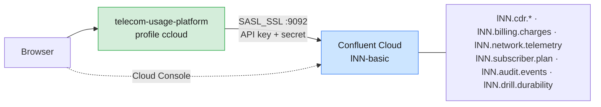

# Run the telco case study on Confluent Cloud

The same application, unchanged in its business logic, runs against a Confluent Cloud
cluster. The `ccloud` profile in
[`src/main/resources/application-ccloud.yml`](src/main/resources/application-ccloud.yml)
switches the connection to `SASL_SSL` with an API key, and turns on `telco.confluent-cloud`,
which adapts the few topic contracts that Confluent Cloud does not accept.

| Item | Value |
| ---- | ----- |
| Cluster | Your Confluent Cloud cluster. In the course: `lNN-basic` in environment `env-lNN` ([`infra/confluent/README.md`](../../infra/confluent/README.md) A.4) |
| Where to run | A lab VM **or** your laptop. Confluent Cloud is reachable over the internet on port 9092 |
| Authentication | `SASL_SSL` + `PLAIN`, an API key and secret for the cluster |
| Name prefix | Your learner prefix (`l07.`), the same as the Module 6 labs. Optional on a cluster of your own |
| Dashboard | `http://localhost:8090/` on a laptop, `https://<vm-host>/proxy/8090/` on a lab VM |
| Topics created | 8 topics, 29 partitions in total |

Related guides: local cluster in [`README.md`](README.md) §5, shared Apache cluster in
[`SHARED-CLUSTER.md`](SHARED-CLUSTER.md), Confluent Cloud basics in
[Module 6 Lab 01](../../labs/module-06/lab-01-confluent-cli-environments-authentication.md) and
[Lab 02](../../labs/module-06/lab-02-managing-topics-confluent-cloud.md).



---

## 0. What changes on Confluent Cloud, and why

Confluent runs the brokers and controllers for you. A few things the case study does on a
self-managed cluster are not available, and Cloud enforces limits on topic settings. A topic
declared outside those limits makes the application stop at startup with
`PolicyViolationException`, because `spring.kafka.admin.fail-fast` is on. With
`telco.confluent-cloud=true` the catalog adapts these contracts:

| Topic / feature | Self-managed design | On Confluent Cloud | Reason |
| --------------- | ------------------- | ------------------ | ------ |
| `network.telemetry` | RF 2, `compression.type=producer` | **RF 3**, `compression.type` not set | RF is fixed at 3; `compression.type` is fixed at `producer` by Confluent, the value we wanted anyway |
| `subscriber.plan` (lab mode) | `segment.ms=30s`, `min.cleanable.dirty.ratio=0.01`, `max.compaction.lag.ms=60s` | `segment.ms=10 min`, `max.compaction.lag.ms=6 h`, no dirty ratio | `segment.ms` minimum is 10 minutes; `min.cleanable.dirty.ratio` cannot be set; compaction runs on Confluent's schedule |
| Every other topic | | **Unchanged** | RF 3, `min.insync.replicas` 1 or 2, retention and segment sizes inside Cloud's limits |
| Header: controller | Active KRaft controller id | "controllers managed by Confluent" | The metadata quorum is not exposed to clients |
| Storage panel | Bytes per broker from `DescribeLogDirs` | Explanatory note | Storage is managed and not exposed per broker |
| Durability drill (DEMO-SCRIPT part 7) | Stop a broker, watch the ISR shrink | Writes work; you cannot stop a broker | Brokers are Confluent's responsibility |

The unit test `TopicCatalogTest.confluentCloudCatalogStaysInsideCloudRules` guards these
limits, so a later edit to the catalog that Cloud would reject fails the build first.

> The limits come from Confluent's *topic configuration* documentation for Basic and Standard
> clusters. If Confluent changes them, the cluster's `PolicyViolationException` message names
> the setting and the allowed range.

---

## 1. Prerequisites

| Need | Check |
| ---- | ----- |
| Confluent CLI v4+ | `confluent version` |
| Java 17+ and Maven | `java -version`, `mvn -v` |
| A Confluent Cloud cluster in state `UP` | Course: created by the trainer. On your own: [`infra/confluent/README.md`](../../infra/confluent/README.md) Part C |
| Outbound TCP 9092 and 443 to `*.confluent.cloud` | Corporate networks sometimes block 9092; the lab VMs allow it |

## 2. Log in and select your cluster

```bash
confluent login --save
confluent environment list                    # course: one row, env-lNN
confluent environment use <env-id>
confluent kafka cluster list                  # course: lNN-basic
confluent kafka cluster use <lkc-id>
LKC=<lkc-id>
confluent kafka cluster describe              # note the Endpoint (SASL_SSL://pkc-....confluent.cloud:9092)
```

## 3. Get an API key for the cluster

**If you did Module 6 Lab 01**, you already have `~/kafka/ccloud.properties` with a key for
this cluster. Skip to step 4.

Otherwise create a key and the same properties file:

```bash
confluent api-key create --resource $LKC --description "telco case study"
# Save the key and secret now. The secret is shown only once.
API_KEY=<key>; API_SECRET='<secret>'
confluent api-key use $API_KEY --resource $LKC

mkdir -p ~/kafka
confluent kafka client-config create java --api-key $API_KEY --api-secret "$API_SECRET" 2>/dev/null \
  > ~/kafka/ccloud.properties
chmod 600 ~/kafka/ccloud.properties
```

A new key can take a minute or two before the cluster accepts it.

> **Whose key is this?** A key created by you belongs to your user account, so the application
> acts with your `EnvironmentAdmin` rights. For a production-style setup, run it as the service
> account instead: see [§9](#9-optional-run-as-a-service-account-with-acls).

## 4. Set the connection from `ccloud.properties`

```bash
CC_CFG=~/kafka/ccloud.properties
export CCLOUD_BOOTSTRAP=$(sed -n 's/^bootstrap.servers=//p' $CC_CFG)
export CCLOUD_API_KEY=$(sed -n "s/.*username=[\"']\([^\"']*\)[\"'].*/\1/p" $CC_CFG)
export CCLOUD_API_SECRET=$(sed -n "s/.*password=[\"']\([^\"']*\)[\"'].*/\1/p" $CC_CFG)
export TELCO_PREFIX=l07.          # your learner prefix; leave empty on a cluster of your own
echo "$CCLOUD_BOOTSTRAP key=$CCLOUD_API_KEY prefix=$TELCO_PREFIX"
```

The `sed` lines accept both quote styles: Confluent's generated file uses `'…'`, files written
by hand often use `"…"`.

## 5. Build and run

```bash
cd casestudies/telecom-usage-platform
mvn -q package -DskipTests
java -jar target/telecom-usage-platform-1.0.0.jar --spring.profiles.active=ccloud
```

At startup `KafkaAdmin` creates the 8 topics and the application starts the consumer groups
`billing`, `fraud-detection`, `usage-analytics` and `plan-cache`, all with your prefix.

If Module 6 Lab 01 already created `lNN.cdr.voice`, the application reuses it and applies the
catalog's settings to it. The lab's test record (`call-start`) is not a JSON CDR: billing
counts it as unreadable and skips it.

## 6. Verify

Open the dashboard: `http://localhost:8090/` on a laptop, or `https://<vm-host>/proxy/8090/`
on a lab VM (keep the trailing slash). The header shows the Cloud cluster ID (`lkc-…`),
"controllers managed by Confluent", and the brokers Cloud advertises.

From the CLI:

```bash
confluent kafka topic list | grep "$TELCO_PREFIX"
confluent kafka topic describe ${TELCO_PREFIX}network.telemetry | grep -E "min.insync|compression|retention"
confluent kafka consumer group list | grep "$TELCO_PREFIX"     # after the first CDRs
```

The Apache CLI works too, with the same file:

```bash
kafka-topics.sh --bootstrap-server $CCLOUD_BOOTSTRAP --command-config $CC_CFG \
  --describe --topic ${TELCO_PREFIX}network.telemetry
```

In the **Cloud Console** open `env-lNN` → `lNN-basic` → **Topics**: the same 8 topics,
and under **Clients / Consumers** the lag of each group.

## 7. Demo on Confluent Cloud

Follow [`DEMO-SCRIPT.md`](DEMO-SCRIPT.md) with these notes:

| Part | On Confluent Cloud |
| ---- | ------------------ |
| Seed plans, send CDRs, fraud burst | Works as on the local cluster |
| Slow billing, lag | Works. Compare the dashboard's lag with the Console's consumer lag view |
| Change a setting live (panel 3) | `retention.ms`, `retention.bytes`, `min.insync.replicas`, `segment.ms` work. Try `compression.type` or `min.cleanable.dirty.ratio`: Cloud answers `PolicyViolationException`. That refusal is the lesson: on Cloud, Confluent owns some settings |
| Topic designs / "why these settings" | Read the telemetry and plan rows: their "why" text explains what Cloud changed |
| Compaction (`subscriber.plan` churn) | Records are written and replay works, but old versions are not cleaned within the class. Show compaction on the local cluster |
| Storage panel | Shows a note instead of bytes per broker. Use the Console's topic overview for size |
| Durability drill | `acks=all` / `1` / `0` writes all succeed. Stopping a broker is not possible: run that part on the local cluster |

## 8. Clean up

Stop the application (Ctrl+C), then remove the topics and, if it was only for this, the key:

```bash
for t in cdr.voice cdr.sms cdr.data subscriber.plan billing.charges network.telemetry audit.events drill.durability; do
  confluent kafka topic delete "${TELCO_PREFIX}$t" --force
done
confluent api-key delete $CCLOUD_API_KEY --force      # skip if it is your Module 6 key
```

Topics on Cloud are billed for storage while they exist. Basic clusters bill partitions
above the included count, so do not leave unused topics behind.

## 9. Optional: run as a service account with ACLs

The course pre-creates `sa-lNN-app` for Module 7. Running the case study as that service account
shows the least privilege an application of this kind needs:

```bash
SA=$(confluent iam service-account list -o json | jq -r '.[] | select(.name=="sa-l07-app") | .id')
P=${TELCO_PREFIX:?set the prefix}

# Topics: create them at startup, change configs from the dashboard, produce and consume
confluent kafka acl create --allow --service-account $SA --prefix --topic "$P" \
  --operations create,describe,describe-configs,alter-configs,read,write
# Consumer groups
confluent kafka acl create --allow --service-account $SA --prefix --consumer-group "$P" \
  --operations read,describe
# Cluster: describe for the header, idempotent-write for the acks=all producers
confluent kafka acl create --allow --service-account $SA --cluster-scope \
  --operations describe,idempotent-write

confluent api-key create --resource $LKC --service-account $SA --description "telco case study app"
```

Export the new key and secret as `CCLOUD_API_KEY` / `CCLOUD_API_SECRET` and start the
application again. Remove one ACL at a time (for example `alter-configs`) to see which
dashboard action fails, and with which exception.

---

## Troubleshooting

| Symptom | Cause / fix |
| ------- | ----------- |
| Startup stops with `Confluent Cloud rejected these topic settings` | The startup check lists each refused `topic: key=value`. Change that value in the Cloud branch of `TopicCatalog` (and the limit in `confluentCloudCatalogStaysInsideCloudRules`), rebuild. Check a value by hand with `confluent kafka topic create <topic> --partitions 1 --config key=value --dry-run` |
| Startup stops with a bare `PolicyViolationException: Request parameters do not satisfy the configured policy` | The `ccloud` profile is not active (check `--spring.profiles.active=ccloud`), so the self-managed designs (RF 2 telemetry, lab compaction values) were sent to Cloud |
| `SaslAuthenticationException: Authentication failed` | Wrong key or secret, a key for another cluster, or a key less than about 2 minutes old |
| `TimeoutException` / `Timed out waiting for a node assignment` | 9092 is blocked on the way to Confluent Cloud, or `CCLOUD_BOOTSTRAP` is empty. Test with `confluent kafka topic list` and `nc -vz <host> 9092` |
| `TopicAuthorizationException` / `GroupAuthorizationException` | Running as a service account without the ACLs in §9, or `TELCO_PREFIX` does not match the ACL prefix |
| `ClusterAuthorizationException` on produce | The service account lacks `idempotent-write` on the cluster (§9) |
| Dashboard "cluster unreachable" but the app log is clean | Old jar without the relative-URL fix, or the `/proxy/8090` URL is missing its trailing `/` |
| `Could not resolve placeholder 'CCLOUD_BOOTSTRAP'` | Step 4 was run in another shell. Export the variables in the shell that runs `java` |
