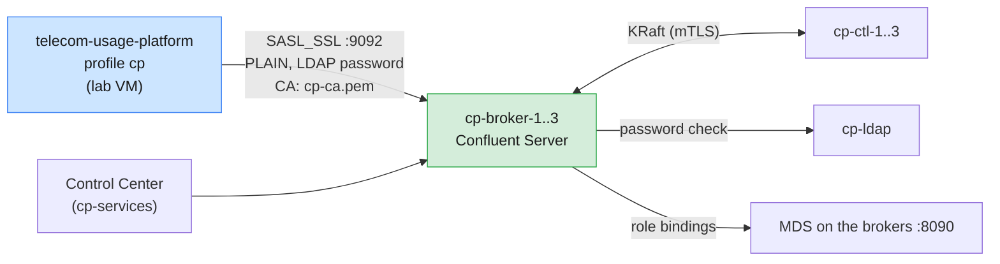

# Run the telco case study on the shared Confluent Platform cluster

The application runs unchanged against the course's self-managed Confluent Platform cluster on
AWS (Confluent Server 8.x in KRaft mode, TLS on every listener, RBAC with LDAP users). The `cp`
profile in [`src/main/resources/application-cp.yml`](src/main/resources/application-cp.yml)
switches the connection; the topic designs, the consumer groups and the dashboard stay the same.

| Item | Value |
| ---- | ----- |
| Cluster | 3 KRaft controllers `cp-ctl-1..3`, 3 brokers `cp-broker-1..3`, in the lab VPC's private subnets ([`infra/confluent/README.md`](../../infra/confluent/README.md) Part B) |
| Where to run | A **lab VM**. Only the lab VMs can reach the cluster; your laptop cannot |
| Bootstrap | `cp-kafka.lab.internal:9092` (multi-value DNS over the three brokers) |
| Authentication | `SASL_SSL` + `PLAIN`. The broker checks your password against LDAP; TLS uses the course CA in `~/kafka/cp-ca.pem` |
| Authorization | RBAC: `ResourceOwner` on `Topic:lNN.` and `Group:lNN.` (prefixed), plus ACL `Describe`, `DescribeConfigs` on the cluster. The trainer is `SystemAdmin` |
| Name prefix | Your LDAP username plus a dot: `l07.` for a learner, `trainer.` for the trainer |
| Dashboard | `https://<vm-host>/proxy/8090/` (keep the trailing slash) |
| Control Center | `$C3_URL` from `~/kafka/confluent.env` (`https://c3.kafka.supercloudlabs.com`) |

Related guides: local cluster in [`README.md`](README.md) §5, shared Apache cluster in
[`SHARED-CLUSTER.md`](SHARED-CLUSTER.md), Confluent Cloud in
[`CONF-CLOUD-CLUSTER.md`](CONF-CLOUD-CLUSTER.md), Confluent Platform basics in
[Module 6 Lab 03](../../labs/module-06/lab-03-control-center-topic-management-platform.md).



---

## 0. What is the same, and what differs from the other clusters

Confluent Platform is self-managed, like the shared Apache cluster. It has no Cloud-style topic
policies, so the case study's **original topic designs apply unchanged**: RF 2 telemetry with
`compression.type=producer`, and the lab-mode compaction timings on `subscriber.plan`
(`telco.confluent-cloud` stays `false`).

| Area | Shared Apache cluster | Confluent Platform | Confluent Cloud |
| ---- | --------------------- | ------------------ | --------------- |
| Profile | `shared` | **`cp`** | `ccloud` |
| Security | `SASL_PLAINTEXT`, SCRAM-SHA-512 | **`SASL_SSL`, PLAIN + LDAP, course CA** | `SASL_SSL`, PLAIN, API key |
| Authorization | Prefix ACLs | **RBAC role bindings** (prefix) + cluster `Describe` ACL | Your `EnvironmentAdmin` role, or service-account ACLs |
| Topic designs | Original | **Original** | Adapted (RF 3 telemetry, no dirty ratio, …) |
| Header: controller, brokers | Yes | **Yes** (KRaft quorum visible) | Managed by Confluent |
| Storage panel | Yes | **Yes** | Not exposed |
| Compaction visible in class | Yes | **Yes** | No |
| Stop a broker (drill) | Trainer, via SSM | **Trainer, via SSM** | Not possible |
| Extra UI | Kafka UI | **Control Center** | Cloud Console |
| Broker extras | — | Self-Balancing on: replicas may move after a broker change | — |

---

## 1. Check the files on your VM

The trainer distributes three files to every lab VM (`infra/confluent/distribute-confluent-config.sh`):

```bash
ls -l ~/kafka/
# cp.properties   (600)  your LDAP user, SASL_SSL/PLAIN, truststore path
# cp-ca.pem       (644)  the course CA
# confluent.env   (644)  endpoints only: CP, MDS_URL, CP_REST, CP_CA, C3_URL

source ~/kafka/confluent.env
echo "$CP  $CP_CA"
```

Check that you can authenticate and see the three brokers:

```bash
kafka-broker-api-versions.sh --bootstrap-server $CP --command-config ~/kafka/cp.properties | grep -c "(id:"
# 3
```

| Result | Meaning |
| ------ | ------- |
| `3` | Ready |
| `SaslAuthenticationException` | Wrong LDAP password in `cp.properties`, or LDAP is down. Ask the trainer |
| `SSLHandshakeException … PKIX path building failed` | `cp-ca.pem` is missing or is not the course CA |
| Timeout | The CP hosts are stopped. The trainer starts them (controllers, then brokers, then `cp-services`) |

## 2. Build

```bash
cd casestudies/telecom-usage-platform
mvn -q package -DskipTests
```

## 3. Set the connection from `cp.properties`

```bash
source ~/kafka/confluent.env                  # exports CP (bootstrap) and CP_CA (CA path)
CFG=~/kafka/cp.properties
export CP_KAFKA_USER=$(sed -n 's/.*username="\([^"]*\)".*/\1/p' $CFG)
export CP_KAFKA_PASSWORD=$(sed -n 's/.*password="\([^"]*\)".*/\1/p' $CFG)
export TELCO_PREFIX="${CP_KAFKA_USER}."
echo "$CP as $CP_KAFKA_USER, CA $CP_CA, prefix $TELCO_PREFIX"
```

The profile reads:

| Variable | Default | Source |
| -------- | ------- | ------ |
| `CP_BOOTSTRAP`, else `CP` | `cp-kafka.lab.internal:9092` | `confluent.env` |
| `CP_CA` | `~/kafka/cp-ca.pem` | `confluent.env` |
| `CP_KAFKA_USER`, `CP_KAFKA_PASSWORD` | none | `cp.properties` |
| `TELCO_PREFIX` | none | Your username plus `.` |

Why the prefix matters: your `ResourceOwner` role bindings cover only topics and groups that start
with `lNN.`. Without the prefix, startup fails with `TopicAuthorizationException`. The trainer is
`SystemAdmin`, so any prefix works; use `trainer.`.

## 4. Run

```bash
java -jar target/telecom-usage-platform-1.0.0.jar --spring.profiles.active=cp
```

The log shows `The following 1 profile is active: "cp"`. At startup the application creates
8 topics (29 partitions) with your prefix and starts the consumer groups `billing`,
`fraud-detection`, `usage-analytics` and `plan-cache`, also prefixed.

## 5. Verify

### 5.1 Dashboard

Open `https://<vm-host>/proxy/8090/`, for example
`https://lab-l07.kafka.supercloudlabs.com/proxy/8090/`. The header shows the cluster ID, the
active KRaft controller and `broker N up` for each of the three brokers. Then follow
[`DEMO-SCRIPT.md`](DEMO-SCRIPT.md): **Seed subscriber plans** first, then **Send 100 CDRs**.

### 5.2 Apache CLI

```bash
kafka-topics.sh --bootstrap-server $CP --command-config $CFG --list | grep "^$TELCO_PREFIX"
kafka-topics.sh --bootstrap-server $CP --command-config $CFG --describe --topic ${TELCO_PREFIX}network.telemetry
kafka-consumer-groups.sh --bootstrap-server $CP --command-config $CFG --list | grep "^$TELCO_PREFIX"
kafka-metadata-quorum.sh --bootstrap-server $CP --command-config $CFG describe --status
```

### 5.3 Confluent CLI and Admin REST (through MDS)

```bash
confluent login --url $MDS_URL --certificate-authority-path $CP_CA      # your LDAP user
confluent kafka topic list --url $CP_REST --certificate-authority-path $CP_CA | grep "$TELCO_PREFIX"
CP_ID=$(confluent cluster describe --url $MDS_URL --certificate-authority-path $CP_CA -o json \
        | jq -r '.scope[] | select(.type=="kafka-cluster") | .id')
confluent iam rbac role-binding list --principal User:$CP_KAFKA_USER --kafka-cluster $CP_ID
```

The last command shows the two `ResourceOwner` bindings that let the application create and use
its topics and groups.

### 5.4 Control Center

Open `$C3_URL` and log in with the same LDAP user. Under the cluster, **Topics** lists your
8 prefixed topics with their throughput, and **Consumers** shows the lag of the three CDR groups.
Learners see only their own topics.

## 6. Demo on Confluent Platform

Every part of [`DEMO-SCRIPT.md`](DEMO-SCRIPT.md) works as on the local cluster, with these notes:

| Part | On Confluent Platform |
| ---- | --------------------- |
| Seed plans, send CDRs, fraud burst, slow billing | Same as local. Compare the dashboard's lag with Control Center's **Consumers** view |
| Change a setting live (panel 3) | Works on your own topics (`ResourceOwner` includes `AlterConfigs`). Cluster-wide broker changes are refused for learners: you have `Describe` and `DescribeConfigs` on the cluster, no `Alter` |
| Effective config sources ("why these settings?") | You see more `STATIC_BROKER_CONFIG` and `DYNAMIC_DEFAULT_BROKER_CONFIG` entries than on local: `min.insync.replicas=2` is set both in the broker files and as a cluster-wide dynamic default (`cp-rbac-learners.sh`) |
| Compaction (`subscriber.plan` churn) | Lab-mode values apply, so compaction is visible within about a minute, as on local |
| Storage panel | Shows bytes per broker. With Self-Balancing on, replicas can move between brokers after a broker change |
| Durability drill | Learners: the writes work, but you cannot stop a broker. Trainer: see below |

### Durability drill as the trainer

From the admin laptop, stop Kafka on one broker through SSM. Announce it first: every learner is
on this cluster.

```bash
export AWS_PROFILE=kafka-training AWS_REGION=ap-south-1
IID=$(aws ec2 describe-instances --filters Name=tag:Name,Values=cp-broker-2 Name=instance-state-name,Values=running \
      --query 'Reservations[0].Instances[0].InstanceId' --output text)
aws ssm send-command --instance-ids "$IID" --document-name AWS-RunShellScript \
  --parameters 'commands=["systemctl stop confluent-server && systemctl is-active confluent-server || true"]'
```

In the dashboard the broker shows **DOWN**, the drill topic's ISR drops to 2 (writes with
`acks=all` still succeed), and the telemetry topic (RF 2) may lose a replica. Start it again
with `systemctl start confluent-server`. The controller unit is `confluent-kcontroller`; check
the names on a host with `systemctl list-units 'confluent*'`.

## 7. Optional: see RBAC refuse a name outside your prefix

```bash
TELCO_PREFIX=other. java -jar target/telecom-usage-platform-1.0.0.jar --spring.profiles.active=cp
```

Startup stops with `TopicAuthorizationException`: your role bindings cover `Topic:lNN.` only.
This is the same rule as Module 6 Lab 03 Part 5, enforced on an application rather than a CLI.

## 8. Clean up

Stop the application (Ctrl+C), then delete your topics. They stay on the shared cluster otherwise.

```bash
kafka-topics.sh --bootstrap-server $CP --command-config $CFG --delete --topic "${TELCO_PREFIX}.*"
```

The application recreates them at the next start.

---

## Troubleshooting

| Symptom | Cause / fix |
| ------- | ----------- |
| `SSLHandshakeException: PKIX path building failed` | `CP_CA` points to a missing file or another CA. `source ~/kafka/confluent.env` and check `ls -l $CP_CA` |
| `SSLHandshakeException: No subject alternative names matching …` | You bootstrapped with an IP address. Use `cp-kafka.lab.internal:9092` or a broker's DNS name |
| `SaslAuthenticationException` | Wrong LDAP password or username, or LDAP (`cp-ldap`) is down |
| `TopicAuthorizationException` / `GroupAuthorizationException` | `TELCO_PREFIX` does not match your username (it needs the trailing `.`), or the trainer has not run `cp-rbac-learners.sh` for your ID |
| `ClusterAuthorizationException` at startup or in the header | The cluster `Describe` ACL is missing for your user. The trainer re-runs `cp-rbac-learners.sh` |
| `Could not resolve placeholder 'CP_KAFKA_USER'` | Step 3 was run in another shell. Export the variables in the shell that runs `java` |
| App exits with `TimeoutException` | The CP hosts are stopped, or you are not on a lab VM |
| Dashboard "cluster unreachable" but the app log is clean | Old jar without the relative-URL fix, or the `/proxy/8090` URL is missing its trailing `/` |
