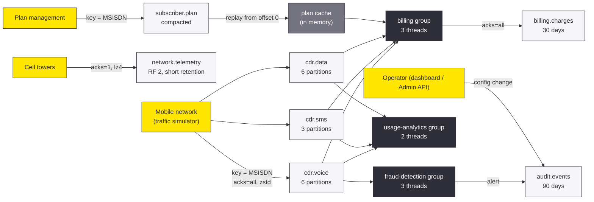

# Case Study — TelcoPulse: Real-Time Usage, Billing & Fraud on Kafka

> **Course:** Apache Kafka & Confluent Kafka Administration
> **Covers:** Module 1 (fundamentals), Module 2 (cluster, CLI, Admin API), Module 3 (configuration, storage, retention)
> **Format:** Facilitator-led demo (60–75 min) or self-paced exploration (~2 h)
> **Facilitator script:** [`DEMO-SCRIPT.md`](DEMO-SCRIPT.md)

A mobile operator produces millions of usage records a day. Every voice call,
text message and data session must be **billed correctly**, **checked for
fraud** and **counted for analytics**, and none of these systems may slow down
the others.

This case study builds that platform as one Spring Boot application on a
3-broker Kafka cluster. Each Kafka feature from Modules 1–3 is there because
the business needs it, and each one can be seen live in a dashboard and
checked with the same CLI tools used in the labs.

---

## 1. The business problem

| Business need | What goes wrong without Kafka | What Kafka gives |
| ------------- | ----------------------------- | ---------------- |
| Bill every call exactly once per subscriber, in order | Point-to-point links between network and billing break when billing is slow or down | A durable log: billing catches up from its last offset |
| Add fraud detection later | The network team must change its export to feed a second system | A new consumer group reads the same topic, no producer change |
| Keep each subscriber's events in order | Load balancers scatter one subscriber's records across workers | Key = MSISDN: one subscriber, one partition, one ordered stream |
| Look up each subscriber's current plan | A shared database becomes a bottleneck and a single point of failure | A compacted topic that every service replays into memory |
| Keep money data safe, but telemetry cheap | One-size-fits-all settings waste disk or lose bills | Per-topic contracts: retention, replicas, `min.insync.replicas`, compression |
| Prove what changed and when (regulator) | Config changes made by hand leave no trace | Every change is an event on `audit.events` with 90-day retention |

---

## 2. Architecture



One application plays every role so a class sees the whole data flow in one
log and one dashboard. In production these would be separate services owned by
separate teams, and Kafka is what lets them stay separate.

---

## 3. What each module teaches, and where you see it

| Module | Kafka feature | Where it is in the code | Where you see it in the demo |
| ------ | ------------- | ----------------------- | ---------------------------- |
| **1** | Producers and **keys** decide the partition | [`Cdr`](src/main/java/com/training/kafka/telco/model/Cdr.java), [`TrafficSimulator`](src/main/java/com/training/kafka/telco/simulator/TrafficSimulator.java) | *Send 100 CDRs*: per-partition counts; fraud burst lands in one partition |
| **1** | **Ordering** per key | [`FraudDetector`](src/main/java/com/training/kafka/telco/fraud/FraudDetector.java) | Fraud alert fires after the 5th call in a burst |
| **1** | **Consumer groups**: publish/subscribe between groups, load sharing inside | [`BillingConsumer`](src/main/java/com/training/kafka/telco/billing/BillingConsumer.java), [`FraudConsumer`](src/main/java/com/training/kafka/telco/fraud/FraudConsumer.java), [`AnalyticsConsumer`](src/main/java/com/training/kafka/telco/analytics/AnalyticsConsumer.java) | *Consumer groups* panel: three groups, members and their partitions |
| **1** | **Offsets and lag**, replay | `BillingLedger` slow mode, `ListenerControl` | Slow or stop billing: only billing's lag grows; restart drains it |
| **1** | **Compaction**, tombstones | [`PlanService`](src/main/java/com/training/kafka/telco/plans/PlanService.java), [`PlanCacheConsumer`](src/main/java/com/training/kafka/telco/plans/PlanCacheConsumer.java) | *Rewrite every plan 5×*, wait, count again |
| **1** | **KRaft** cluster, replicas, ISR | [`OpsService`](src/main/java/com/training/kafka/telco/ops/OpsService.java) `cluster()` | Header shows controller and brokers; partition leaders and ISR |
| **2** | **Topics as code**, `KafkaAdmin` | [`TopicCatalog`](src/main/java/com/training/kafka/telco/topics/TopicCatalog.java), [`TopicsConfig`](src/main/java/com/training/kafka/telco/topics/TopicsConfig.java) | Topics exist at startup with the declared settings |
| **2** | **Admin API** behind the CLI | [`OpsService`](src/main/java/com/training/kafka/telco/ops/OpsService.java) | Every dashboard panel; each method names its CLI equivalent |
| **2** | `KafkaTemplate`, `@KafkaListener` | All producers and consumers | The application log |
| **3** | **Per-topic overrides** by workload class | `TopicCatalog.specs()` | *Topic designs* table and *Why these settings?* |
| **3** | **Config precedence** and sources | `OpsService.toView()` | Source label per setting: `DYNAMIC_TOPIC_CONFIG` vs `DEFAULT_CONFIG` |
| **3** | **Dynamic config**, no restart | `OpsService.setConfig()` | *Change a setting, live* |
| **3** | **Retention** by time and size, segments | `network.telemetry` design | *Retention on telemetry*: log start offset moves forward |
| **3** | **Compaction tuning** | `subscriber.plan` design (`segment.ms`, dirty ratio) | *State on a compacted topic*: record count drops |
| **3** | **`acks` + `min.insync.replicas`**, strict min ISR | [`DurabilityDrill`](src/main/java/com/training/kafka/telco/ops/DurabilityDrill.java) | *Durability drill* with `kafka-2` stopped |
| **3** | **Compression and batching** at the producer | [`KafkaClientsConfig`](src/main/java/com/training/kafka/telco/common/KafkaClientsConfig.java), `application.yml` | *Storage on the brokers* panel; `compression.type=producer` on topics |
| **3** | **Storage measurement** | `OpsService.storage()` | *Storage on the brokers*: bytes per topic per broker |

---

## 4. Topic design (Module 3, section 4.1)

This is the core of the case study: **one contract per class of data**, written
down in code. Every non-default value has a reason.

| Topic | Class | Partitions / RF | Key settings | Why |
| ----- | ----- | --------------- | ------------ | --- |
| `cdr.voice` | High-volume events | 6 / 3 | `retention.ms` 7 d, `segment.bytes` 256 MiB, `min.insync.replicas` 2 | An acknowledged CDR must survive a broker failure; 7 days covers the longest billing outage |
| `cdr.sms` | High-volume events | 3 / 3 | `retention.ms` 3 d, `min.insync.replicas` 2 | Lower volume, shorter window |
| `cdr.data` | High-volume events | 6 / 3 | `retention.ms` 3 d, `retention.bytes` 5 GiB **per partition**, `min.insync.replicas` 2 | Size cap bounds the biggest stream: 6 × 5 GiB = 30 GiB |
| `subscriber.plan` | State | 3 / 3 | `cleanup.policy=compact`, tuned `segment.ms` and dirty ratio | Latest plan per MSISDN forever; a `null` value removes a subscriber |
| `billing.charges` | Financial | 6 / 3 | `retention.ms` 30 d, `min.insync.replicas` 2 | Invoicing can replay a full billing cycle |
| `network.telemetry` | Telemetry | 3 / **2** | `retention.ms` 1 h, `retention.bytes` 1 GiB, `min.insync.replicas` **1**, `compression.type=producer` | Losing a data point is acceptable; speed and disk matter more |
| `audit.events` | Audit | 1 / 3 | `retention.ms` 90 d, `min.insync.replicas` 2 | Regulator retention; one partition gives one total order |
| `drill.durability` | Drill | 1 / 3 | `min.insync.replicas` 2 | Scratch topic for the `acks` experiment |

Two producers carry two contracts, because durability is decided by **both**
sides, the producer's `acks` and the topic's `min.insync.replicas`:

| Producer | `acks` | Idempotence | Compression | Used for |
| -------- | ------ | ----------- | ----------- | -------- |
| `kafkaTemplate` (default) | `all` | on | `zstd` | CDRs, plans, charges, audit |
| `telemetryTemplate` | `1` | off | `lz4` | Network telemetry |

> **Lab mode.** `telco.lab-mode=true` (the default) shortens `subscriber.plan`'s
> `segment.ms` to 30 s, its dirty ratio to 0.01 and `max.compaction.lag.ms` to
> 60 s so compaction is visible within a minute. Production values are hours.
> Set `telco.lab-mode=false` to see them. Never ship lab-mode values.

---

## 5. Run it

### Prerequisites

| Requirement | Check with | Notes |
| ----------- | ---------- | ----- |
| Docker Desktop (running) and Compose v2 | `docker version` | ~3 GB RAM for three brokers |
| Java 17+ and Maven 3.9+ | `java -version` · `mvn -v` | Pre-installed on the course VMs |
| Ports **9092, 9094, 9096, 8090** free | `lsof -i :9092 -i :9094 -i :9096 -i :8090` | Stop the Module 1 cluster first |

### Start

```bash
# (host) - from casestudies/telecom-usage-platform
./scripts/cluster.sh up            # 3-node KRaft cluster; waits until healthy
mvn -q package                     # builds and runs the 17 unit tests
java -jar target/telecom-usage-platform-1.0.0.jar
```

Then open <http://localhost:8090/>. The application log is part of the demo: it
shows which consumer thread owns which partitions.

```
... billing: partitions assigned: [cdr.data-0, cdr.data-1, cdr.sms-0, cdr.voice-0, cdr.voice-1]
... fraud-detection: partitions assigned: [cdr.voice-0, cdr.voice-1]
```

`cluster.sh` reuses the Module 2 Compose file plus the Module 3 override
(retention check every 15 s instead of 5 min), under the same Compose project
name as the labs. If your Module 2 cluster is already running, it is reused.

```bash
./scripts/cluster.sh cli           # shell in kafka-1 with the Kafka tools; $BS is set
./scripts/cluster.sh down          # stop, keep data
./scripts/cluster.sh reset         # stop and DELETE all data
```

### On the shared AWS cluster

The application can also run against the course's shared cluster, using your
learner prefix so it stays inside your ACLs:

```bash
# (VM) - copy the values from ~/kafka/apache.properties
export TELCO_KAFKA_BOOTSTRAP=apache-kafka.lab.internal:9092
export TELCO_KAFKA_USER=l07  TELCO_KAFKA_PASSWORD='...'  TELCO_PREFIX=l07.
java -jar target/telecom-usage-platform-1.0.0.jar --spring.profiles.active=shared
```

Every topic and group then starts with `l07.`. The broker-failure drill needs
the local cluster: you cannot stop brokers on the shared one. Full steps, quotas
and troubleshooting: [`SHARED-CLUSTER.md`](SHARED-CLUSTER.md).

### On Confluent Cloud

Profile `ccloud` connects with an API key over `SASL_SSL` and adapts the topic
contracts Cloud does not accept (RF fixed at 3, no `compression.type`,
`segment.ms` of at least 10 minutes). Step-by-step guide:
[`CONF-CLOUD-CLUSTER.md`](CONF-CLOUD-CLUSTER.md).

### On the shared Confluent Platform cluster

Profile `cp` connects to the course's Confluent Platform cluster on AWS over
`SASL_SSL` (PLAIN, LDAP passwords, course CA) and uses your RBAC prefix. The
topic designs are unchanged. Step-by-step guide:
[`CONF-PLATFORM-CLUSTER.md`](CONF-PLATFORM-CLUSTER.md).

### Configuration

| Property | Default | Meaning |
| -------- | ------- | ------- |
| `telco.prefix` | *(empty)* | Prepended to every topic and consumer-group name |
| `telco.lab-mode` | `true` | Short compaction timings for class use |
| `telco.confluent-cloud` | `false` | Adapt topic contracts to Confluent Cloud's limits (set by profile `ccloud`) |
| `telco.simulator.subscribers` | `20` | MSISDNs `966500000001` … |
| `telco.simulator.international-share` | `0.12` | Share of calls and texts that go abroad |
| `telco.fraud.threshold` / `window-seconds` | `5` / `60` | International calls inside the window that raise an alert |
| `spring.kafka.admin.modify-topic-configs` | `true` | Restore declared topic settings at startup |
| `server.port` | `8090` | Dashboard and API |

---

## 6. API reference

Everything the dashboard does is a plain REST call, so the demo works from
`curl` too. Kafka errors are returned as JSON with the exception class as
`title` and the broker's message as `detail`.

| Call | What it does | CLI equivalent |
| ---- | ------------ | -------------- |
| `POST /api/simulate/cdr?count=N` | N random CDRs; returns records per partition | `kafka-console-producer.sh` with `parse.key=true` |
| `POST /api/simulate/start?rate=N` · `stop` | Continuous traffic at about N CDRs/s | — |
| `POST /api/simulate/fraud-burst?msisdn=&calls=` | One subscriber, many international calls | — |
| `POST /api/simulate/telemetry?count=N` | Radio measurements via the `acks=1` / `lz4` producer | — |
| `POST /api/plans/seed` · `POST /api/plans/churn?rounds=N` | Initial plans / N rewrites of every plan | — |
| `PUT /api/plans/{msisdn}?plan=` · `DELETE /api/plans/{msisdn}` | Change a plan / write a tombstone | `kafka-console-producer.sh` (`key:value` / `key:` with null value) |
| `GET /api/ops/topics` | Every topic: partitions, ISR, effective configs with source | `kafka-topics.sh --describe` + `kafka-configs.sh --describe` |
| `PUT /api/ops/topics/{t}/configs/{key}?value=` · `DELETE …` | Set / remove a topic override (whitelisted keys, audited) | `kafka-configs.sh --alter --add-config / --delete-config` |
| `GET /api/ops/groups` | Group state, members and their partitions, lag | `kafka-consumer-groups.sh --describe` |
| `GET /api/ops/storage` | Bytes per topic and per broker | `kafka-log-dirs.sh --describe` |
| `GET /api/ops/topics/{t}/offsets` | Log start / end offset per partition | `kafka-get-offsets.sh` |
| `GET /api/ops/topics/{t}/replay` | Reads the topic from the start: records, distinct keys, tombstones | `kafka-console-consumer.sh --from-beginning \| wc -l` |
| `POST /api/listeners/{billing\|fraud-detection\|usage-analytics}/stop\|start` | Leave / rejoin the group | stop the consumer process |
| `POST /api/billing/delay?ms=N` | Make billing slow to build lag | — |
| `POST /api/drill/write?acks=all\|1\|0` · `GET /api/drill/state` | The durability experiment | `kafka-console-producer.sh --producer-property acks=…` |
| `GET /api/insights/billing\|fraud\|analytics` | What the consumers computed | — |

---

## 7. Project layout

```
casestudies/telecom-usage-platform/
├── README.md                  this file
├── DEMO-SCRIPT.md             facilitator script: 8 parts, with talk track and expected results
├── pom.xml                    Spring Boot 4.1, Spring for Apache Kafka, Java 17+
├── scripts/cluster.sh         start / stop / reset the 3-node cluster
└── src/main
    ├── java/com/training/kafka/telco
    │   ├── topics/            TopicCatalog (all designs), TopicsConfig (KafkaAdmin, Admin client)
    │   ├── model/             Cdr, Plan, PlanEvent, Charge, FraudAlert, TelemetryPoint, AuditEvent
    │   ├── common/            producers (two contracts), JSON codec, audit publisher
    │   ├── simulator/         traffic generator and its REST endpoints
    │   ├── billing/           RatingService (pure logic), BillingConsumer, ledger
    │   ├── fraud/             FraudDetector (pure logic), FraudConsumer
    │   ├── analytics/         AnalyticsConsumer, counters
    │   ├── plans/             compacted-topic writer, replaying cache, REST
    │   └── ops/               Admin API views, durability drill, replay reader, listener control
    └── resources
        ├── application.yml            defaults (local cluster)
        ├── application-shared.yml     profile for the shared AWS cluster
        ├── application-ccloud.yml     profile for Confluent Cloud
        ├── application-cp.yml         profile for the shared Confluent Platform cluster
        └── static/index.html          the demo dashboard
```

The business logic (`RatingService`, `FraudDetector`) has no Kafka code and is
unit tested. The tests also guard the design rules: a careless edit that drops
`min.insync.replicas=2` from a business topic fails the build.

---

## 8. Design decisions worth discussing

| Decision | Alternative | Why this one |
| -------- | ----------- | ------------ |
| Key = MSISDN on every CDR | Random or no key | Per-subscriber order and single-owner state. Cost: a very busy subscriber makes a hot partition |
| Separate group per consumer application | One shared group | Each application gets every record, with its own offsets and lag |
| Plan cache assigns itself all partitions and reads from offset 0 | Join a shared group | Every instance needs the whole table, so this is not work to be shared |
| Telemetry at `acks=1`, RF 2, `min.insync.replicas=1` | Same contract as billing | A lost point costs nothing; the saved disk and latency do matter |
| Compression in the producer, `compression.type=producer` on topics | Broker-side codec | Brokers store batches as sent, with no recompression CPU |
| JSON as text | Avro with Schema Registry | Every topic is readable with the console consumer. Schemas belong to a later module |
| `chargeId` = `topic-partition-offset` | Random id | A duplicate charge after a rebalance is detectable downstream |

---

## 9. Boundaries and what comes next

This case study stays inside Modules 1–3. Deliberately **not** covered:

| Topic | Where it belongs |
| ----- | ---------------- |
| Producer retries, batching trade-offs, transactions, exactly-once | Module 4. The billing consumer is **at-least-once**: after a crash or rebalance a CDR can be rated twice, which is why `chargeId` exists |
| Dead-letter topics for unreadable records | Module 9. Billing here counts and skips them |
| Adding brokers, reassigning partitions, capacity planning | Module 5 |
| Monitoring lag and disk trends over time | Module 8 |
| Security (SASL, ACLs) | Module 7. The `shared` profile only uses credentials issued to you |

---

## 10. Troubleshooting

| Symptom | Likely cause | Fix |
| ------- | ------------ | --- |
| App exits at start with `TimeoutException` / `Could not configure topics` | Cluster is not running | `./scripts/cluster.sh up` |
| `Web server failed to start. Port 8090 was already in use` | Another process | `--server.port=8091` |
| A topic shows a red **drift** or **override not in catalog** badge | Someone changed it by hand | Restart: the app restores declared values. It **never removes** overrides the catalog does not declare, so delete those with *Remove override* |
| `cdr.*` consumers show lag 0 but the dashboard shows nothing | Simulator is off | Press *Send 100 CDRs* or *Start 50 CDR/s* |
| Plan records are not compacted after a minute | Only the **closed** segments are cleaned, and a segment rolls only when a new record arrives after `segment.ms` | Write again (for example *Rewrite every plan 5×* once more), then wait 30–60 s |
| `ratedWithoutPlan` is above 0 | CDRs arrived before *Seed subscriber plans* | Seed first. Records on different topics have no cross-topic order |
| Telemetry retention "does nothing" | Retention deletes whole closed segments, checked every 15 s in the lab cluster | Use the *Shorten retention* button, wait about 90 s |
| `TopicExistsException` or authorisation errors on the shared cluster | Missing or wrong `TELCO_PREFIX` | Set the prefix to your learner id followed by a dot |
