# Module 1 — Messaging & Kafka Fundamentals

> **Course:** Apache Kafka & Confluent Kafka Administration
> **Module objective:** Understand messaging concepts and core Apache Kafka
> architecture, components, and distributed design principles.

---

## Table of contents

1. [Why this module matters](#1-why-this-module-matters)
2. [Messaging concepts recap](#2-messaging-concepts-recap)
3. [Kafka vs IBM MQ and traditional messaging](#3-kafka-vs-ibm-mq-and-traditional-messaging)
4. [Kafka overview and use cases](#4-kafka-overview-and-use-cases)
5. [The Kafka ecosystem: producers, consumers, brokers, topics, partitions](#5-the-kafka-ecosystem-producers-consumers-brokers-topics-partitions)
6. [Kafka architecture: cluster design, offsets, replicas](#6-kafka-architecture-cluster-design-offsets-replicas)
7. [Message retention and compaction](#7-message-retention-and-compaction)
8. [ZooKeeper vs KRaft mode](#8-zookeeper-vs-kraft-mode)
9. [Hands-on preview: local environment and CLI tools](#9-hands-on-preview-local-environment-and-cli-tools)
10. [Bridging to the rest of the course](#10-bridging-to-the-rest-of-the-course)
11. [Key takeaways](#11-key-takeaways)
12. [Glossary](#12-glossary)
13. [References](#13-references)

> **How to read the diagrams:** Diagrams are written in [Mermaid](https://mermaid.js.org/),
> which renders automatically in GitHub, VS Code (with a Mermaid extension), and most
> modern Markdown viewers. If a diagram appears as code, install/enable a Mermaid
> preview to see the rendered version.

---

## 1. Why this module matters

Most people in this course already know messaging from **IBM MQ** or a similar
broker. Kafka looks familiar at first (there are producers, consumers and
"topics"), but underneath it works on a different model: a **distributed,
replicated, append-only log**. Many operational surprises come from applying
queue-manager intuition to a log-based system. Examples:

- "Why is the message still there after it was consumed?"
- "Why can't I add more consumers to go faster?"
- "Why did ordering break?"

This module sets up the mental model that every later module relies on:

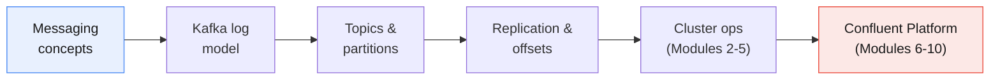

Confluent Platform and Confluent Cloud run **Apache Kafka at their core**.
Security, monitoring, Schema Registry and connectors are built on top of the
concepts covered here. If you understand the log, partitions, offsets and
replication, the Confluent features become extensions of something you already
know.

---

## 2. Messaging concepts recap

### 2.1 Why messaging at all?

Messaging **decouples** systems. The sender does not need the receiver to be
online, fast, or even known.

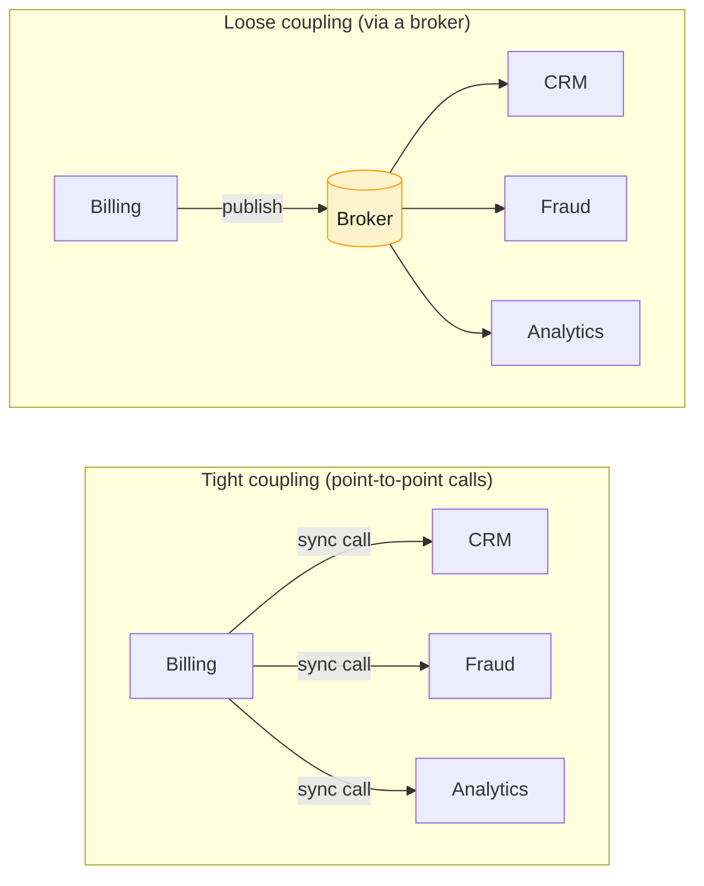

| Decoupling type | Meaning |
| --------------- | ------- |
| **Time** | Producer and consumer do not need to be running at the same time |
| **Space** | Producer does not know where, or how many, consumers exist |
| **Rate** | A slow consumer does not slow the producer; the broker buffers |
| **Technology** | Java, Python, .NET and mainframe apps exchange data through a common protocol |

### 2.2 The two classic messaging models

#### Point-to-point (queue)

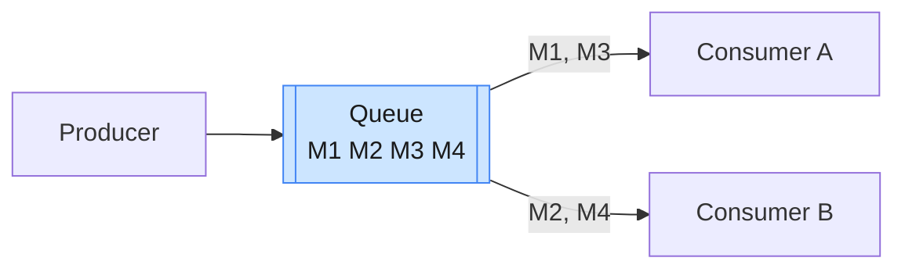

- Each message is delivered to **exactly one** consumer. Consumers **compete**
  for messages.
- Once a message is consumed and acknowledged, it is **removed** from the queue
  (destructive read).
- Adding consumers adds **parallel work** (a work queue).

#### Publish–subscribe (topic)

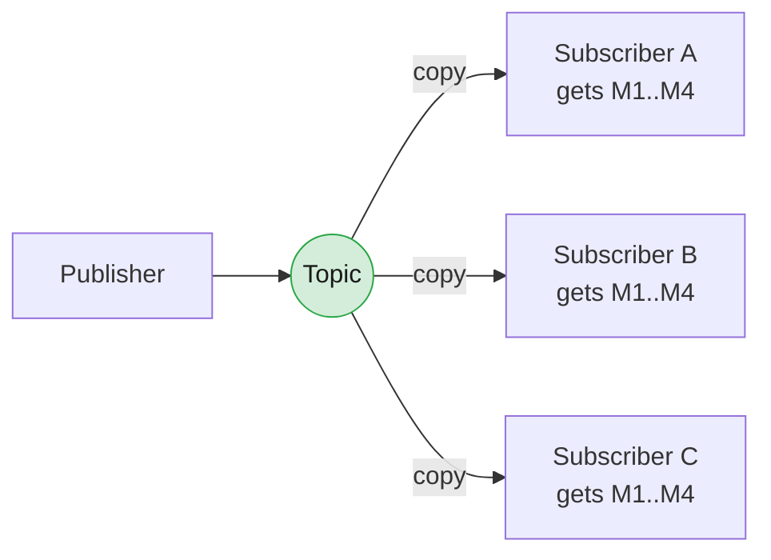

- Every **subscriber** receives **its own copy** of every message.
- Classic pub/sub is usually **"fire and forget"** for subscribers that are
  offline, unless they hold a **durable subscription**.

| Aspect | Queue (point-to-point) | Pub/Sub (topic) |
| ------ | ---------------------- | --------------- |
| Receivers per message | One | All subscribers |
| Scaling pattern | Add consumers to share load | Add subscribers to fan out |
| After consumption | Message removed | Message removed once all durable subscribers have it |
| Typical use | Work distribution, commands | Event notification, broadcast |

### 2.3 Kafka unifies both models

Kafka has a single abstraction, the **topic**, and uses **consumer groups** to
provide both behaviours:

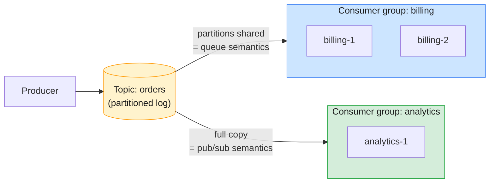

- **Within** a group, partitions are divided among members: **queue semantics**
  (load sharing).
- **Across** groups, each group independently reads everything: **pub/sub
  semantics** (fan-out).

> **The key idea:** in Kafka, consuming a message **does not delete it**. The
> message stays in the log until **retention** removes it. Each consumer group
> only tracks **how far it has read** (its *offset*). That is why many
> independent groups can read the same data, and why a group can rewind and
> **replay** history.

> **Newer option, share groups:** Kafka 4.x adds *share groups*
> ([KIP-932, "Queues for Kafka"](https://cwiki.apache.org/confluence/display/KAFKA/KIP-932%3A+Queues+for+Kafka)).
> They let many consumers cooperatively read the *same* partition with
> per-message acknowledgement, which is closer to a traditional queue. Check
> the release notes for its maturity in the version you run. Classic consumer
> groups remain the default model and the focus of this course.

---

## 3. Kafka vs IBM MQ and traditional messaging

### 3.1 Architectural difference: queue manager vs distributed log

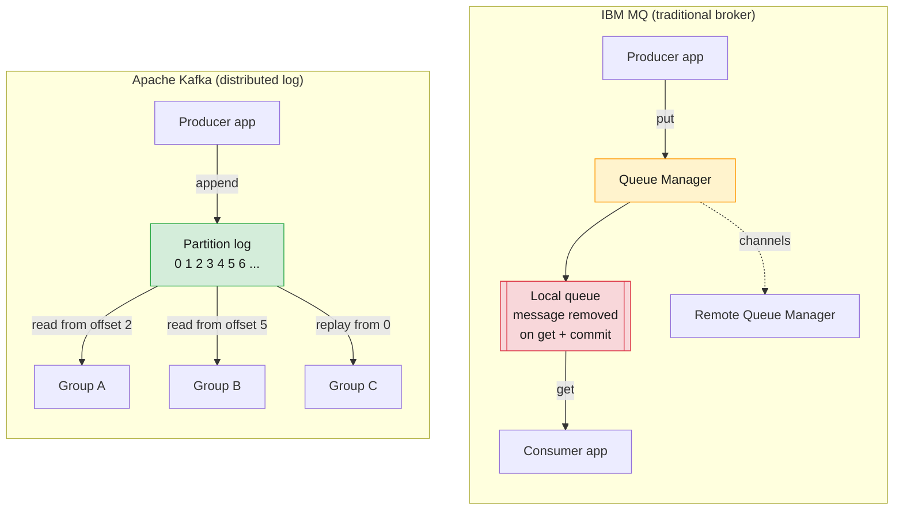

The main difference is **where state lives**:

- **IBM MQ:** the **broker** tracks each message's delivery state. It pushes or
  hands out messages, and removes them once they are acknowledged. The broker is
  "smart" and consumers are "simple".
- **Kafka:** the **broker** stores an immutable, ordered log and does little
  per-message bookkeeping. **Consumers pull** and track their own position
  (offset). The broker is "simple" and consumers are "smart". This design is a
  big part of why Kafka scales to very high throughput.

### 3.2 Side-by-side comparison

| Dimension | IBM MQ / traditional MQ (JMS, RabbitMQ, ActiveMQ) | Apache Kafka |
| --------- | ------------------------------------------------- | ------------ |
| **Core abstraction** | Queue / topic of individual messages | Partitioned, append-only **log** |
| **Consumption** | Destructive: message removed after ack | Non-destructive: message kept until retention |
| **Delivery model** | Broker **pushes** (or hands out on `get`) | Consumer **pulls** in batches |
| **Who tracks position** | Broker (per message) | Consumer group (one offset per partition) |
| **Replay** | Not native (message gone once consumed) | Native: reset offsets and re-read |
| **Ordering** | Per queue, weakened by competing consumers | Guaranteed **per partition** |
| **Scaling** | Scale queue manager vertically; clusters distribute queues | Horizontal: add partitions and brokers |
| **Throughput** | Thousands to tens of thousands msgs/sec per QM (typical) | Hundreds of thousands to millions msgs/sec per cluster |
| **Message size** | Can be large (MBs+) | Optimised for small (KBs); default max ~1 MB |
| **Transactions** | Rich XA / two-phase commit with databases | Kafka transactions for exactly-once *within* Kafka; no XA |
| **Per-message features** | Priority, selectors, TTL, request/reply, DLQ built in | Mostly application patterns (DLQ topics, headers) |
| **Retention** | Short-lived; queue depth should stay near zero | Days, weeks or forever; the log is a data store |
| **High availability** | Multi-instance QM, RDQM, Native HA | Built-in partition replication across brokers |
| **Best fit** | Transactional integration, commands, guaranteed once-only delivery to one app | Event streaming, high-volume pipelines, fan-out, replay, stream processing |

### 3.3 Mapping IBM MQ terms to Kafka terms

| IBM MQ concept | Closest Kafka concept | Note |
| -------------- | --------------------- | ---- |
| Queue manager | Broker (and the cluster as a whole) | A Kafka cluster behaves like one logical system |
| Local queue | Topic consumed by **one** consumer group | Messages are not removed on read |
| Topic + durable subscription | Topic + a dedicated consumer group | Each group is effectively a durable subscription |
| Queue depth | **Consumer lag** | The key health metric in Kafka (Module 8) |
| Channel / MCA | Client and inter-broker network listeners | |
| Dead-letter queue | A DLQ **topic** (application or Connect pattern) | Not automatic for plain consumers |
| Syncpoint / unit of work | Producer transactions / offset commits | Exactly-once semantics covered in Module 4 |
| Message expiry | Topic retention (whole segments, not per message) | Kafka has no per-message TTL |
| Message persistence | Always persistent to disk and replicated | No "non-persistent" mode |

> **Common trap for MQ administrators:** in MQ, a growing queue depth means
> "consumers are behind **and** data is piling up". In Kafka, the log **always**
> grows up to retention, so disk usage alone says nothing about consumer health.
> Watch **consumer lag** instead: the gap between the latest offset and the
> group's committed offset.

### 3.4 When to use which?

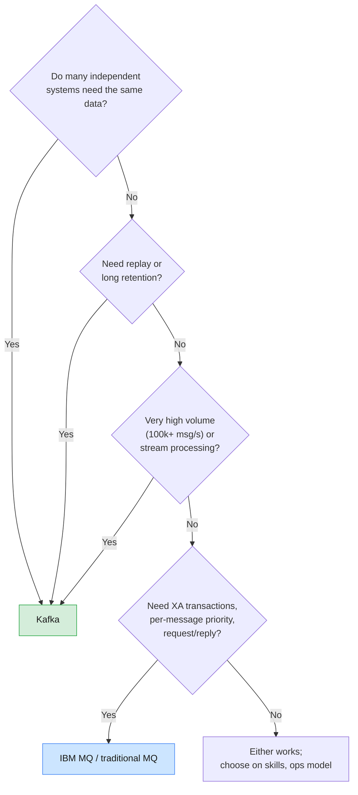

> **Real-world framing:** many enterprises, telcos included, run **both**.
> IBM MQ carries transactional core-system integration, and Kafka carries
> high-volume event streams. They are often bridged with the
> **IBM MQ Source/Sink connectors** for Kafka Connect (Module 10).

---

## 4. Kafka overview and use cases

### 4.1 What Kafka is

Apache Kafka is an open-source **distributed event streaming platform**. It
provides three capabilities:

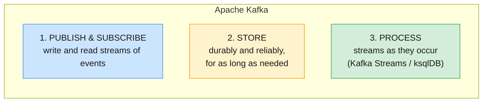

A short history:

| Year | Milestone |
| ---- | --------- |
| 2010–2011 | Built at **LinkedIn** to handle activity and log data at scale; open-sourced in 2011 |
| 2012 | Graduates as an **Apache top-level project** |
| 2014 | Kafka's creators found **Confluent** |
| 2017 | Kafka 0.11/1.0: idempotent producer, **exactly-once** transactions |
| 2022 | Kafka 3.3: **KRaft** (no ZooKeeper) declared production-ready |
| 2025 | Kafka 4.0: **ZooKeeper removed**; KRaft-only |

### 4.2 What an "event" looks like

Every Kafka record (message) has the same structure:

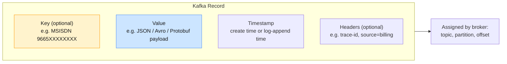

- The **key** decides which partition the record goes to, and therefore which
  records are **ordered relative to each other**.
- The **value** is opaque bytes to Kafka. Kafka never inspects it; serialization
  is the client's job (Schema Registry, Module 10).
- Once written, a record is **immutable**. It cannot be edited; you can only
  append newer records.

### 4.3 Common use cases

| Use case | Description | Telecom example |
| -------- | ----------- | --------------- |
| **Messaging** | High-throughput replacement or complement for traditional MQ | Order and provisioning events between OSS/BSS systems |
| **Activity tracking** | Capture user/device actions as events | App clicks, self-care portal journeys |
| **Log aggregation** | Centralise logs from thousands of servers | Network element and application logs into SIEM |
| **Metrics & monitoring** | Stream operational metrics | Cell-site KPIs, network probe data |
| **Stream processing** | Transform, enrich and aggregate in real time | Real-time usage aggregation, fraud detection |
| **Event sourcing** | Store state changes as an ordered log | Subscriber lifecycle (activate, suspend, port-out) |
| **Change data capture (CDC)** | Stream database changes to other systems | Billing DB changes into a data lake via Debezium |
| **Data integration hub** | Decouple many sources from many sinks | CDRs/xDRs into mediation, billing, analytics and DWH |

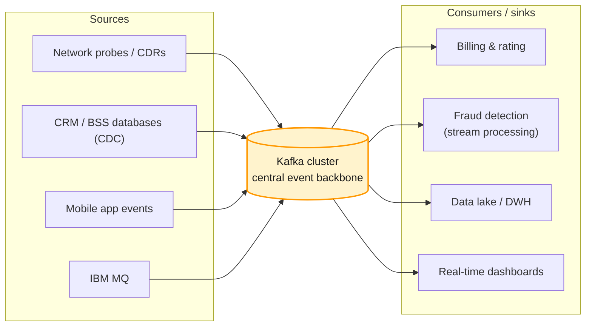

> **Why the hub pattern matters:** with *N* sources and *M* targets,
> point-to-point integration needs up to *N × M* connections. With Kafka as the
> hub, it needs *N + M*, and a new consumer can be added without touching any
> producer.

---

## 5. The Kafka ecosystem: producers, consumers, brokers, topics, partitions

### 5.1 The big picture

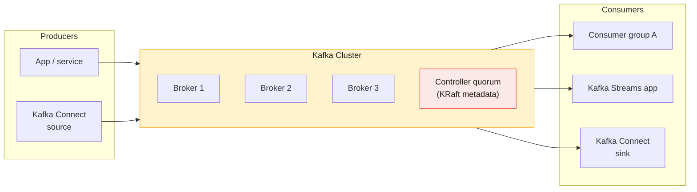

| Component | Role |
| --------- | ---- |
| **Producer** | Client that **writes** records to topics. Chooses the partition (via key), batches, compresses, retries |
| **Consumer** | Client that **reads** records by pulling from partitions and tracking offsets |
| **Consumer group** | Set of consumers sharing a `group.id` that divide a topic's partitions between them |
| **Broker** | A Kafka server. Stores partition data on disk and serves reads and writes |
| **Cluster** | A group of brokers working together, with a **controller** managing metadata |
| **Topic** | A named, logical stream of records (for example `cdr.voice`) |
| **Partition** | An ordered, append-only log; the unit of parallelism, ordering and replication |
| **Kafka Connect** | Framework for moving data between Kafka and external systems without writing code |
| **Kafka Streams / ksqlDB** | Libraries and engines for processing streams (ksqlDB in Module 10) |

### 5.2 Topics and partitions

A **topic** is split into one or more **partitions**. Each partition is an
independent, ordered log. New records are always **appended to the end**, and
each gets a sequential **offset**.

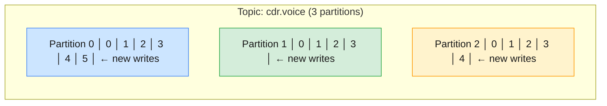

Key properties:

- **Ordering is guaranteed only within a partition**, not across a topic.
- **Offsets are per partition.** Offset 3 in partition 0 and offset 3 in
  partition 1 are unrelated records.
- **Partitions are the unit of parallelism.** A topic with 12 partitions can be
  read by at most 12 consumers in one group at the same time.
- **Partitions are spread across brokers**, which lets a topic grow beyond a
  single machine's disk and throughput.

### 5.3 How a producer chooses a partition

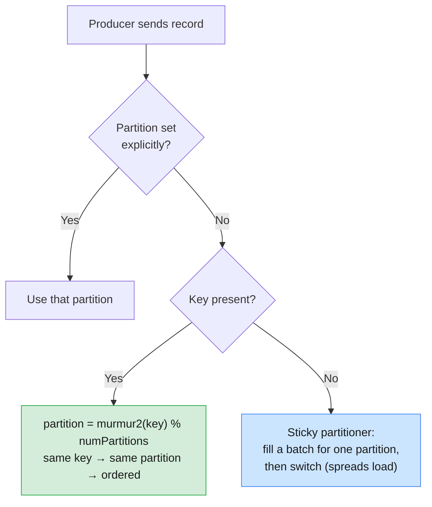

> **Practical rule:** choose the **key** as the entity whose events must stay in
> order, such as subscriber ID, account number or order ID. All events for one
> subscriber then land in the same partition, in order.
>
> ⚠️ **Increasing partitions changes the key-to-partition mapping** for new
> records (`hash % N` changes). Existing keyed data does not move. Plan
> partition counts up front for keyed topics (Module 5, capacity planning).

### 5.4 Consumers and consumer groups

Consumers **pull** records. Within a group, **each partition is assigned to
exactly one consumer**:

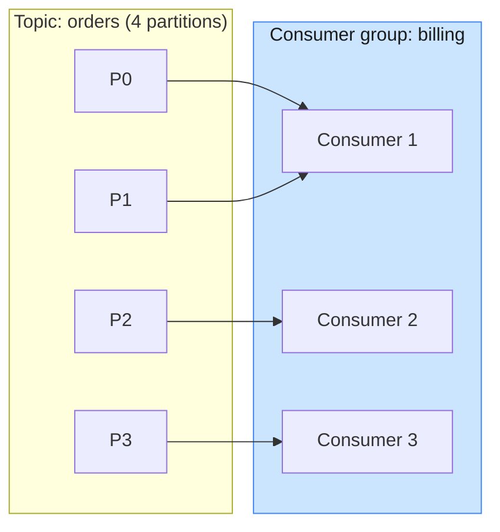

| Consumers in group vs partitions | Result |
| -------------------------------- | ------ |
| Consumers **<** partitions | Some consumers handle several partitions |
| Consumers **=** partitions | Ideal: one partition each |
| Consumers **>** partitions | Extra consumers sit **idle** (useful only as hot standby) |

When a consumer joins, leaves or crashes, the group **rebalances**: partitions
are redistributed among the remaining members.

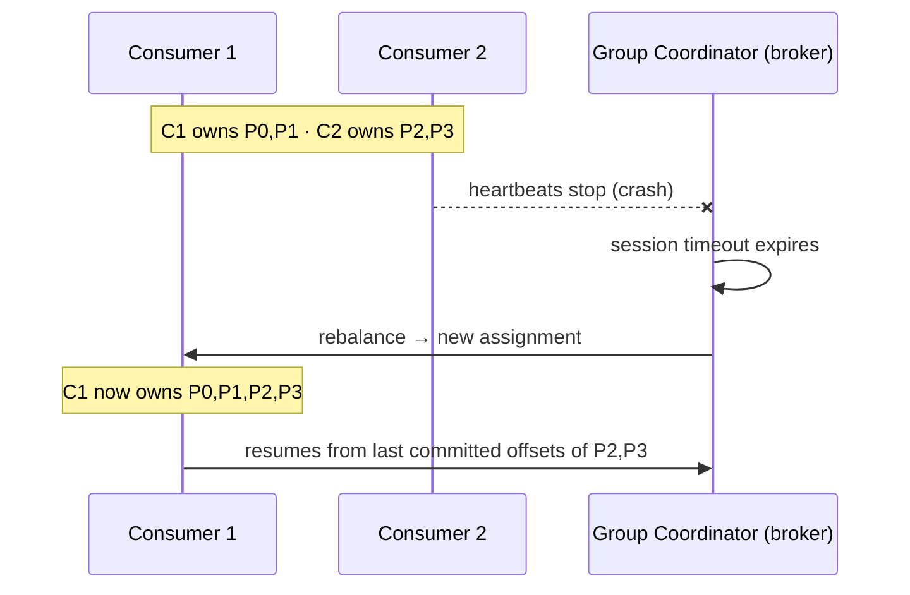

> Kafka 4.0 made the **next-generation consumer rebalance protocol**
> ([KIP-848](https://cwiki.apache.org/confluence/display/KAFKA/KIP-848%3A+The+Next+Generation+of+the+Consumer+Rebalance+Protocol))
> generally available. It moves assignment logic to the broker and avoids
> "stop-the-world" rebalances. Offset management, commit strategies and
> rebalancing are covered in depth in **Module 4**.

### 5.5 Brokers

A **broker** is a single Kafka server process (JVM). Brokers:

- Store partition replicas as **log segment files** on local disk.
- Serve **produce** and **fetch** requests for the partitions they lead.
- Replicate data from leaders to followers.
- Answer **metadata** requests, so any broker can tell a client where each
  partition leader is.

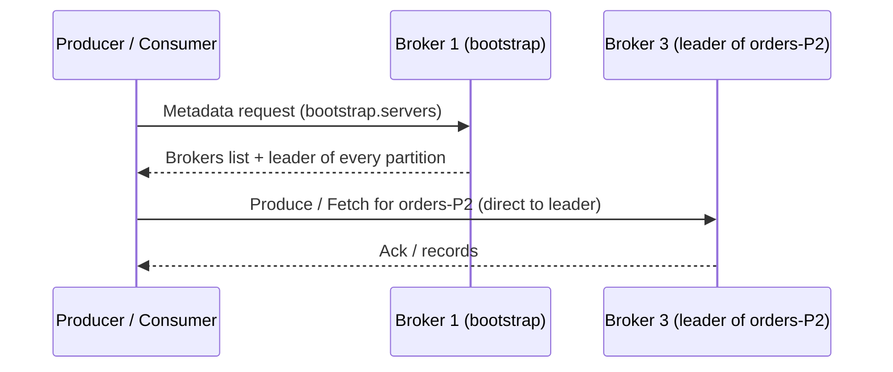

> **`bootstrap.servers` is only an entry point.** The client needs just one
> reachable broker to discover the whole cluster, and then talks **directly** to
> each partition's leader. For this to work, every broker's **advertised
> listener** address must be reachable from the client. This is one of the most
> common connectivity issues (Modules 2 and 9).

---

## 6. Kafka architecture: cluster design, offsets, replicas

### 6.1 Cluster design

A production cluster separates two roles:

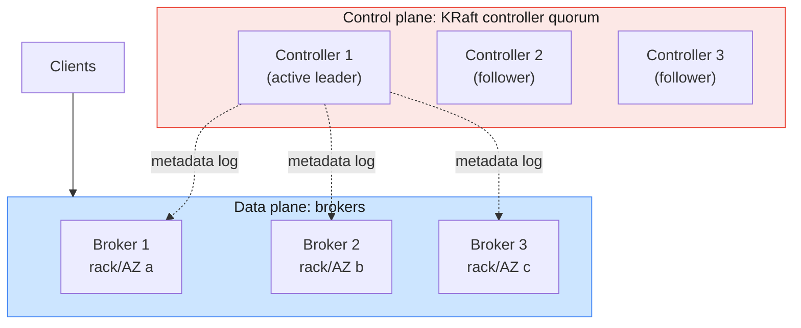

| Design principle | Why |
| ---------------- | --- |
| **Odd number of controllers (3 or 5)** | Majority quorum: 3 tolerates 1 failure, 5 tolerates 2 |
| **At least 3 brokers** | Allows replication factor 3 with one broker down |
| **Spread across racks / AZs** (`broker.rack`) | Replicas land in different failure domains |
| **Dedicated controllers in production** | Isolates metadata management from data-plane load |
| **Horizontal scaling** | Add brokers and move partitions to them (Module 5) |

### 6.2 Offsets in detail

An **offset** is a record's position within a partition. There are several
offsets that matter to an administrator:

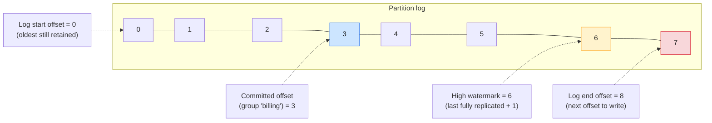

| Offset | Meaning |
| ------ | ------- |
| **Log start offset** | Earliest offset still on disk; moves forward as retention deletes old segments |
| **Committed offset** | Where a consumer group will resume: the *next* record it has not yet processed |
| **High watermark (HW)** | Records **below** this are replicated to all in-sync replicas and are visible to consumers |
| **Log end offset (LEO)** | Offset the next produced record will receive |
| **Consumer lag** | `HW − committed offset` for a group, per partition. The main health signal |

- Committed offsets are stored in the internal, compacted topic
  **`__consumer_offsets`**.
- Consumers only ever see records up to the **high watermark**. Records that are
  written but not yet fully replicated are not exposed, so consumers never read
  data that could disappear after a leader failover.
- If a group's committed offset has already been deleted by retention, the
  consumer falls back to `auto.offset.reset` (`earliest` or `latest`).

### 6.3 Replication: leaders, followers and ISR

Every partition has a **replication factor** (RF). With RF = 3, three brokers
each hold a copy (**replica**). One replica is the **leader** and the others are
**followers**.

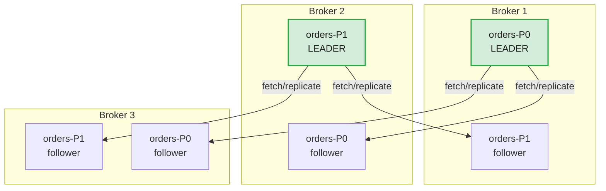

- **All writes go to the leader.** By default all reads do too. Consumers can
  read from a nearby follower with rack-aware fetching (KIP-392).
- **Followers pull** from the leader, just like consumers.
- Leadership is **spread across brokers** so that load is balanced.
- The **In-Sync Replica set (ISR)** is the leader plus every follower that is
  fully caught up (within `replica.lag.time.max.ms`, default 30 s).

### 6.4 The write path and durability

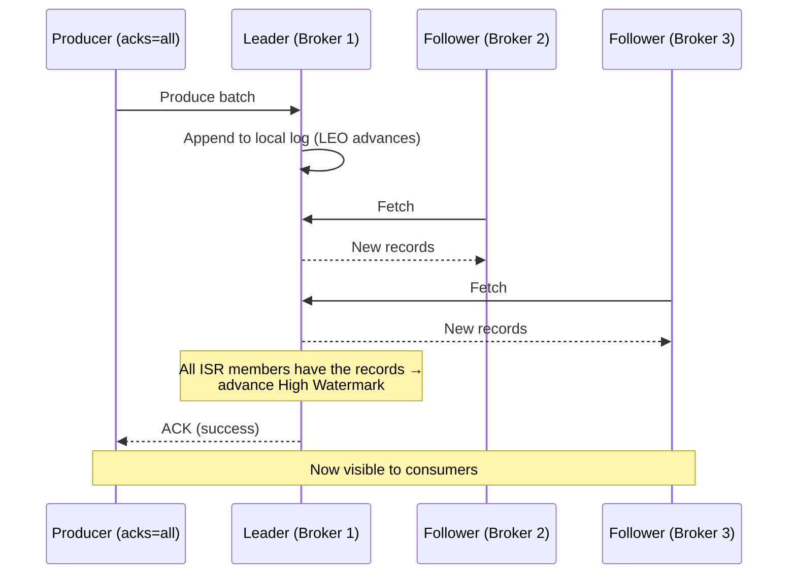

The producer's **`acks`** setting controls when a write counts as successful:

| `acks` | Producer waits for | Durability | Latency |
| ------ | ------------------ | ---------- | ------- |
| `0` | Nothing (fire and forget) | Lowest: loss possible | Lowest |
| `1` | Leader wrote it locally | Medium: lost if leader dies before replication | Low |
| `all` (`-1`) | All **in-sync** replicas have it | Highest | Higher |

`acks=all` works together with the topic/broker setting
**`min.insync.replicas`**:

```mermaid
flowchart LR
    A["RF = 3<br/>min.insync.replicas = 2<br/>acks = all"] --> B{"How many<br/>replicas in ISR?"}
    B -->|3| OK1["✅ Writes succeed"]
    B -->|2| OK2["✅ Writes succeed<br/>(tolerates 1 broker down)"]
    B -->|1| ERR["❌ Writes rejected<br/>NotEnoughReplicas<br/>(prevents silent data loss)"]
    style OK1 fill:#d4edda,stroke:#28a745,stroke-width:1px,color:#1a1a1a
    style OK2 fill:#d4edda,stroke:#28a745,stroke-width:1px,color:#1a1a1a
    style ERR fill:#f8d7da,stroke:#dc3545,stroke-width:1px,color:#1a1a1a
```

> **The production baseline:** **RF = 3, `min.insync.replicas = 2`,
> `acks = all`**, with idempotence enabled. Since Kafka 3.0 the producer
> defaults are already `acks=all` and `enable.idempotence=true`. The broker
> default for `min.insync.replicas` is still **1**, so it must be set
> explicitly. Deep dive in Modules 3 and 9 (preventing message loss).

### 6.5 Leader failover

```mermaid
sequenceDiagram
    participant C as Controller
    participant B1 as Broker 1 (leader P0)
    participant B2 as Broker 2 (ISR)
    participant B3 as Broker 3 (ISR)
    B1--xC: Broker 1 fails (no heartbeat)
    C->>C: Pick new leader from ISR
    C->>B2: You are leader of P0 (new leader epoch)
    C->>B3: Follow Broker 2 for P0
    Note over B2,B3: Clients refresh metadata and move to Broker 2
    B1->>C: Broker 1 returns
    C->>B1: Rejoin as follower, catch up, re-enter ISR
```

- A new leader is normally chosen **only from the ISR**, so no acknowledged data
  is lost.
- **Unclean leader election** (`unclean.leader.election.enable`, default
  `false`) lets an out-of-sync replica become leader. It favours availability
  over consistency and **can lose data**.
- **Preferred leader election** later moves leadership back to its original
  broker to rebalance load (Module 5).

---

## 7. Message retention and compaction

Kafka is a **storage system**, not only a pipe. What stays on disk, and for how
long, is set by the **cleanup policy**.

### 7.1 How a partition is stored on disk

Each partition is a directory of **segment** files. Only the newest **active
segment** is written to; older segments are closed and read-only.

```mermaid
flowchart LR
    subgraph DIR["/var/lib/kafka/data/orders-0/"]
        direction LR
        S1["00000000000000000000.log<br/>.index · .timeindex<br/>(closed)"]
        S2["00000000000000052314.log<br/>.index · .timeindex<br/>(closed)"]
        S3["00000000000000104877.log<br/>.index · .timeindex<br/>ACTIVE ← appends"]
    end
    S1 --> S2 --> S3
    style S1 fill:#e8eaed,stroke:#5f6368,stroke-width:1px,color:#1a1a1a
    style S2 fill:#e8eaed,stroke:#5f6368,stroke-width:1px,color:#1a1a1a
    style S3 fill:#d4edda,stroke:#28a745,stroke-width:2px,color:#1a1a1a
```

| File | Purpose |
| ---- | ------- |
| `.log` | The record batches themselves. The file name is the segment's **base offset** |
| `.index` | Sparse map of offset → byte position, for fast seeks |
| `.timeindex` | Sparse map of timestamp → offset, for time-based lookups and retention |

- A segment **rolls** (closes, and a new one starts) when it reaches
  `segment.bytes` (default 1 GiB) or `segment.ms` (default 7 days).
- **Retention and compaction act on closed segments only.** The active segment
  is never deleted or compacted. This explains why "retention didn't delete my
  data yet" on low-traffic topics.

### 7.2 Cleanup policy: `delete` (retention)

Whole old segments are removed once they exceed a time **or** size limit:

```mermaid
flowchart LR
    subgraph BEFORE["Before cleanup"]
        direction LR
        A1["Seg 1<br/>9 days old"] --- A2["Seg 2<br/>5 days old"] --- A3["Seg 3<br/>active"]
    end
    subgraph AFTER["After cleanup (retention.ms = 7 days)"]
        direction LR
        B2["Seg 2<br/>5 days old"] --- B3["Seg 3<br/>active"]
    end
    BEFORE -->|log cleaner thread| AFTER
    style A1 fill:#f8d7da,stroke:#dc3545,stroke-width:1px,color:#1a1a1a
```

| Setting (topic / broker) | Default | Meaning |
| ------------------------ | ------- | ------- |
| `retention.ms` / `log.retention.hours` | 7 days (168 h) | Delete segments whose newest record is older than this |
| `retention.bytes` / `log.retention.bytes` | `-1` (unlimited) | Max size **per partition** before oldest segments are deleted |
| `segment.bytes` | 1 GiB | Segment roll size (affects how precisely retention applies) |
| `log.retention.check.interval.ms` | 5 min | How often the broker checks for deletable segments |

> **Retention is independent of consumption.** Data is deleted when it is old or
> big enough, **whether or not anyone has read it**. A consumer that is offline
> longer than the retention period will **miss data**. Set retention to cover
> your worst-case consumer outage plus a safety margin.

### 7.3 Cleanup policy: `compact` (log compaction)

Compaction keeps **at least the latest value for every key** and discards older
values for the same key. The topic becomes a **snapshot of current state**.

```mermaid
flowchart TB
    subgraph BEFORE["Before compaction"]
        direction LR
        R0["0<br/>K1=A"] --- R1["1<br/>K2=B"] --- R2["2<br/>K1=C"] --- R3["3<br/>K3=D"] --- R4["4<br/>K2=null<br/>(tombstone)"] --- R5["5<br/>K1=E"]
    end
    subgraph AFTER["After compaction"]
        direction LR
        X3["3<br/>K3=D"] --- X4["4<br/>K2=null<br/>(tombstone, removed<br/>after delete.retention.ms)"] --- X5["5<br/>K1=E"]
    end
    BEFORE -->|log cleaner| AFTER
    style R0 fill:#f8d7da,stroke:#dc3545,stroke-width:1px,color:#1a1a1a
    style R1 fill:#f8d7da,stroke:#dc3545,stroke-width:1px,color:#1a1a1a
    style R2 fill:#f8d7da,stroke:#dc3545,stroke-width:1px,color:#1a1a1a
    style X5 fill:#d4edda,stroke:#28a745,stroke-width:1px,color:#1a1a1a
    style X3 fill:#d4edda,stroke:#28a745,stroke-width:1px,color:#1a1a1a
```

- **Offsets never change.** Compaction leaves gaps (3, 4, 5 above); it does not
  renumber records.
- **Order is preserved** for the records that remain.
- A record with a **`null` value** is a **tombstone**. It marks the key for
  deletion, and after `delete.retention.ms` (default 24 h) the tombstone itself
  is removed.
- **Keys are required.** Compaction without keys makes no sense.
- `min.cleanable.dirty.ratio` (default 0.5) controls how "dirty" a log must be
  before the cleaner runs.

| Use `compact` for | Example |
| ----------------- | ------- |
| Latest state per entity | Subscriber profile, tariff plan per MSISDN |
| Rebuilding caches / tables | Kafka Streams state stores, ksqlDB tables |
| Kafka internals | `__consumer_offsets`, Connect config/offset/status topics |

### 7.4 Comparing the policies

| | `delete` | `compact` | `compact,delete` |
| --- | --- | --- | --- |
| **Keeps** | Everything within time/size window | Latest record per key (forever) | Latest per key, but also drops anything past retention |
| **Good for** | Event streams (CDRs, logs, clicks) | Current-state / changelog topics | Bounded state (for example "latest per key, last 30 days") |
| **Needs keys?** | No | Yes | Yes |

> **Beyond local disk: tiered storage.** Since Kafka 3.9, tiered storage
> ([KIP-405](https://cwiki.apache.org/confluence/display/KAFKA/KIP-405%3A+Kafka+Tiered+Storage))
> is production-ready. It offloads closed segments to object storage (for
> example Amazon S3), so retention can be long while broker disks stay small.
> Confluent offers the equivalent as *Tiered Storage* / *Infinite Storage*.
> Storage optimisation is covered in Module 3.

---

## 8. ZooKeeper vs KRaft mode

Every Kafka cluster needs **metadata management**: which brokers are alive,
which topics and partitions exist, who leads each partition, what the ISR is,
configs, ACLs and quotas. Historically this lived in **Apache ZooKeeper**. Now
it lives in Kafka itself via **KRaft** (Kafka Raft).

### 8.1 Legacy architecture: ZooKeeper mode

```mermaid
flowchart TB
    subgraph ZK["ZooKeeper ensemble (separate system)"]
        direction LR
        Z1["ZK 1"] --- Z2["ZK 2 (leader)"] --- Z3["ZK 3"]
    end
    subgraph KB["Kafka brokers"]
        direction LR
        B1["Broker 1<br/>★ Controller"]
        B2["Broker 2"]
        B3["Broker 3"]
    end
    B1 <-->|read/write metadata,<br/>watches| ZK
    B2 <-->|session, watches| ZK
    B3 <-->|session, watches| ZK
    B1 -->|RPC: LeaderAndIsr,<br/>UpdateMetadata| B2
    B1 -->|RPC| B3
    style ZK fill:#fff3cd,stroke:#ff9800,stroke-width:1px,color:#1a1a1a
    style B1 fill:#fce8e6,stroke:#ea4335,stroke-width:1px,color:#1a1a1a
```

- One broker is elected **controller** (via a ZooKeeper ephemeral node).
- Metadata's source of truth is **in ZooKeeper**. On failover, a new controller
  must **reload all metadata from ZooKeeper**, which is slow for large clusters.
- Two distributed systems to deploy, secure, monitor and upgrade.

### 8.2 Modern architecture: KRaft mode

```mermaid
flowchart TB
    subgraph QUORUM["KRaft controller quorum (Raft consensus)"]
        direction LR
        C1["Controller 1<br/>★ Active leader"]
        C2["Controller 2<br/>hot standby"]
        C3["Controller 3<br/>hot standby"]
        C1 -->|replicate| C2
        C1 -->|replicate| C3
    end
    ML[("__cluster_metadata<br/>event log")]
    C1 --- ML
    subgraph KB["Brokers"]
        direction LR
        B1["Broker 1<br/>metadata cache"]
        B2["Broker 2<br/>metadata cache"]
        B3["Broker 3<br/>metadata cache"]
    end
    B1 -->|fetch metadata log| C1
    B2 -->|fetch metadata log| C1
    B3 -->|fetch metadata log| C1
    style QUORUM fill:#fce8e6,stroke:#ea4335,stroke-width:1px,color:#1a1a1a
    style ML fill:#d4edda,stroke:#28a745,stroke-width:1px,color:#1a1a1a
```

- Metadata is stored as an **event log** in the internal topic
  **`__cluster_metadata`**. It uses the same log model as your data.
- The controllers form a **Raft quorum**. The active controller writes metadata
  changes, and the others replicate them and stay **hot standbys** with the full
  state in memory.
- Brokers **fetch** the metadata log (pull), just as followers fetch data.
  Failover is near-instant because standbys already have everything.
- Each node's role is set with **`process.roles`**:

| `process.roles` | Node type | Use |
| --------------- | --------- | --- |
| `broker` | Data-plane broker only | Production brokers |
| `controller` | Controller only | Production controller quorum (dedicated) |
| `broker,controller` | Combined mode | Local dev / small test clusters (as in this module's lab) |

### 8.3 Comparison

| Aspect | ZooKeeper mode | KRaft mode |
| ------ | -------------- | ---------- |
| **Systems to operate** | Two (Kafka + ZooKeeper) | One (Kafka only) |
| **Metadata store** | ZooKeeper znodes | `__cluster_metadata` log in Kafka |
| **Controller** | One broker, elected via ZK | Raft quorum of controllers |
| **Controller failover** | Slow: reload all metadata from ZK | Fast: standbys are already up to date |
| **Partition scalability** | Practical limit around 200k partitions per cluster | Designed for millions of partitions |
| **Security model** | Kafka + separate ZK security (SASL, TLS, ACLs) | Single security model |
| **Admin tooling** | Some tools used `--zookeeper` | All tools use `--bootstrap-server` / `--bootstrap-controller` |
| **Status** | Deprecated in 3.5, **removed in 4.0** | Production-ready since 3.3; **only mode in 4.x** |

### 8.4 Timeline and what it means for you

```mermaid
timeline
    title From ZooKeeper to KRaft
    2019 : KIP-500 proposed (replace ZooKeeper)
    2021 : Kafka 2.8 - KRaft early access
    2022 : Kafka 3.3 - KRaft production-ready (new clusters)
    2023 : Kafka 3.5 - ZooKeeper deprecated, migration preview
    2024 : Kafka 3.9 - last release with ZooKeeper, final bridge release for migration
    2025 : Kafka 4.0 - ZooKeeper removed, KRaft only
```

> **Administrator takeaways:**
>
> - **New clusters are KRaft.** Apache Kafka 4.x and Confluent Platform 8.x no
>   longer support ZooKeeper.
> - **Existing ZooKeeper clusters must migrate on 3.x** (ideally 3.9) **before**
>   upgrading to 4.x. Migration runs ZK and KRaft in dual-write mode, then
>   finalises to KRaft.
> - `--zookeeper` flags in older tutorials and scripts **no longer work**. Use
>   `--bootstrap-server`.
> - A new operational object: the **controller quorum**. Inspect it with
>   `kafka-metadata-quorum.sh` (see Section 9).

---

## 9. Hands-on preview: local environment and CLI tools

The Module 1 labs set up a local, single-node KRaft cluster in Docker and
introduce the CLI tools. This section shows the target setup and the commands
you will meet. Multi-broker clusters come in Module 2.

### 9.1 Lab environment layout

```mermaid
flowchart LR
    subgraph LAPTOP["Your laptop"]
        direction TB
        DD["Docker Desktop"]
        subgraph CTR["Container: kafka (apache/kafka)"]
            direction TB
            KN["Kafka node<br/>process.roles=broker,controller<br/>listener :9092"]
            CLI["/opt/kafka/bin/*.sh<br/>CLI tools"]
        end
        DD --> CTR
        HOST["Terminal / VS Code"] -->|localhost:9092| KN
        HOST -->|docker exec| CLI
    end
    style KN fill:#fff3cd,stroke:#ff9800,stroke-width:1px,color:#1a1a1a
    style CLI fill:#cce5ff,stroke:#4285f4,stroke-width:1px,color:#1a1a1a
```

### 9.2 Start a single-node KRaft broker

```bash
# Official Apache Kafka image: starts a combined broker+controller in KRaft mode
docker run -d --name kafka -p 9092:9092 apache/kafka:4.0.0

# Verify it is running
docker ps
docker logs kafka | grep -i "Kafka Server started"
```

> Any 4.x image tag works for these labs. Use the version pinned in the lab
> instructions so everyone's output matches.

### 9.3 Explore the CLI tools

The CLI tools are shell scripts in `/opt/kafka/bin` inside the container. Open a
shell there:

```bash
docker exec -it kafka bash
cd /opt/kafka/bin
ls *.sh
```

| Tool | What it does | Covered further in |
| ---- | ------------ | ------------------ |
| `kafka-topics.sh` | Create, list, describe, alter, delete topics | Module 2 |
| `kafka-console-producer.sh` | Produce records from stdin | Modules 2, 4 |
| `kafka-console-consumer.sh` | Consume records to stdout | Modules 2, 4 |
| `kafka-consumer-groups.sh` | Inspect groups, lag; reset offsets | Modules 4, 8 |
| `kafka-configs.sh` | View/alter broker and topic configs | Module 3 |
| `kafka-metadata-quorum.sh` | Inspect the KRaft controller quorum | Module 5 |
| `kafka-log-dirs.sh` | Show partition sizes per log directory | Module 3 |
| `kafka-dump-log.sh` | Decode segment files on disk | Module 3 |
| `kafka-reassign-partitions.sh` | Move partitions between brokers | Module 5 |
| `kafka-storage.sh` | Format storage / generate cluster ID (KRaft) | Module 2 |

### 9.4 A first end-to-end flow

```bash
BS=localhost:9092

# 1. Create a topic with 3 partitions
./kafka-topics.sh --bootstrap-server $BS --create \
  --topic cdr.voice --partitions 3 --replication-factor 1

# 2. Describe it: partitions, leader, replicas, ISR
./kafka-topics.sh --bootstrap-server $BS --describe --topic cdr.voice

# 3. Produce keyed messages (type key:value, Ctrl+C to exit)
./kafka-console-producer.sh --bootstrap-server $BS --topic cdr.voice \
  --property parse.key=true --property key.separator=:
#   966500000001:call-start
#   966500000002:call-start
#   966500000001:call-end

# 4. Consume from the beginning as group "billing", showing partition/offset/key
./kafka-console-consumer.sh --bootstrap-server $BS --topic cdr.voice \
  --group billing --from-beginning \
  --property print.partition=true --property print.offset=true --property print.key=true

# 5. Inspect the group's offsets and lag
./kafka-consumer-groups.sh --bootstrap-server $BS --describe --group billing

# 6. Inspect the KRaft controller quorum
./kafka-metadata-quorum.sh --bootstrap-server $BS describe --status
```

What to observe, and how it links back to this guide:

| Observation | Concept |
| ----------- | ------- |
| Both records for `966500000001` land in the **same partition**, in order | Key-based partitioning (5.3) |
| Re-running the consumer with a **new** `--group` re-reads everything | Non-destructive, per-group offsets (2.3, 6.2) |
| Re-running with the **same** group reads nothing new | Committed offsets in `__consumer_offsets` |
| `--describe` shows `Leader`, `Replicas`, `Isr` | Replication model (6.3) |
| `describe --status` shows `LeaderId`, voters, `HighWatermark` | KRaft quorum (8.2) |

Optional: look at the actual segment files on disk.

```bash
ls -l /tmp/kraft-combined-logs/cdr.voice-0/
./kafka-dump-log.sh --print-data-log \
  --files /tmp/kraft-combined-logs/cdr.voice-0/00000000000000000000.log
```

Clean up when finished:

```bash
exit                  # leave the container shell
docker rm -f kafka
```

---

## 10. Bridging to the rest of the course

This module gave you the **model**. The remaining modules turn it into
**operations**:

| Question this module raises | Answered in |
| --------------------------- | ----------- |
| How do I install and run a multi-broker KRaft cluster? | Module 2 |
| Which broker/topic configs control storage, retention and `min.insync.replicas`? | Module 3 |
| How do producers and consumers achieve at-least-once / exactly-once? | Module 4 |
| How do I add brokers, reassign partitions and survive broker failures? | Module 5 |
| What does Confluent add on top of Apache Kafka? | Module 6 |
| How do I secure access (RBAC, API keys, SASL/TLS, ACLs)? | Module 7 |
| How do I monitor consumer lag, throughput and latency? | Module 8 |
| Why do messages get lost, and how do I prevent it? | Module 9 |
| How do I integrate, govern schemas and replicate for DR? | Module 10 |

```mermaid
flowchart LR
    F["Fundamentals<br/>(Module 1)"] --> A["Apache Kafka admin<br/>(Modules 2-5)"]
    A --> C["Confluent Platform / Cloud<br/>(Modules 6-9)"]
    C --> E["Ecosystem, DR, migration<br/>(Module 10)"]
    style F fill:#cce5ff,stroke:#4285f4,stroke-width:1px,color:#1a1a1a
    style A fill:#fff3cd,stroke:#ff9800,stroke-width:1px,color:#1a1a1a
    style C fill:#fce8e6,stroke:#ea4335,stroke-width:1px,color:#1a1a1a
    style E fill:#d4edda,stroke:#28a745,stroke-width:1px,color:#1a1a1a
```

---

## 11. Key takeaways

1. **Messaging decouples systems** in time, space, rate and technology. The two
   classic models are **queues** (one receiver) and **pub/sub** (all
   subscribers).
2. **Kafka is a distributed, replicated, append-only log.** Consuming does
   **not** delete data; retention does. Consumer groups give **queue semantics
   within a group** and **pub/sub semantics across groups**.
3. **Compared with IBM MQ,** Kafka keeps brokers simple and moves position
   tracking to consumers. That gives replay, fan-out and very high throughput,
   at the cost of MQ-style per-message features such as XA, priority and
   selectors.
4. **Topics are split into partitions**, the unit of **ordering, parallelism and
   replication**. Ordering is only guaranteed **per partition**, and the
   **key** decides the partition.
5. **Within a group, one partition goes to at most one consumer.** More
   consumers than partitions means idle consumers.
6. **Offsets** track position. Know the log start offset, committed offset,
   **high watermark** and log end offset. **Consumer lag** is the main health
   metric.
7. **Replication** (leader + followers, **ISR**) with **RF = 3,
   `min.insync.replicas = 2`, `acks = all`** is the durability baseline.
8. **Retention (`delete`)** removes whole old segments by time or size,
   regardless of consumption. **Compaction (`compact`)** keeps the latest value
   per key and uses tombstones for deletes.
9. **KRaft replaced ZooKeeper.** Metadata lives in the `__cluster_metadata` log,
   managed by a Raft controller quorum. Kafka 4.x and Confluent Platform 8.x are
   **KRaft-only**.

---

## 12. Glossary

| Term | Definition |
| ---- | ---------- |
| **Event / record / message** | A key, value, timestamp and headers written to a topic |
| **Topic** | Named logical stream of records, split into partitions |
| **Partition** | Ordered, immutable, append-only log; the unit of parallelism and replication |
| **Offset** | Sequential position of a record within a partition |
| **Producer** | Client that writes records to topics |
| **Consumer** | Client that pulls records from partitions |
| **Consumer group** | Consumers sharing a `group.id` that divide partitions among themselves |
| **Rebalance** | Redistribution of partitions among group members when membership changes |
| **Broker** | A Kafka server that stores partitions and serves client requests |
| **Controller** | Node managing cluster metadata (leaders, ISR, topics, configs) |
| **KRaft** | Kafka's built-in Raft-based metadata mode that replaced ZooKeeper |
| **ZooKeeper** | External coordination service used by Kafka before 4.0 |
| **Replication factor (RF)** | Number of copies of each partition |
| **Leader / follower** | The replica serving reads and writes / replicas copying from it |
| **ISR** | In-Sync Replicas: replicas fully caught up with the leader |
| **High watermark (HW)** | Offset up to which records are fully replicated and visible to consumers |
| **Log end offset (LEO)** | Offset the next appended record will receive |
| **Consumer lag** | Difference between the latest offset and a group's committed offset |
| **`acks`** | Producer setting for how many replicas must confirm a write (`0`, `1`, `all`) |
| **`min.insync.replicas`** | Minimum ISR size required to accept `acks=all` writes |
| **Segment** | A file chunk of a partition's log (`.log`, `.index`, `.timeindex`) |
| **Retention** | Time/size-based deletion of old segments (`cleanup.policy=delete`) |
| **Log compaction** | Keeping only the latest record per key (`cleanup.policy=compact`) |
| **Tombstone** | Record with a `null` value that deletes a key in a compacted topic |
| **`__consumer_offsets`** | Internal compacted topic storing committed group offsets |
| **`__cluster_metadata`** | Internal KRaft metadata log |
| **Bootstrap servers** | Initial broker addresses a client uses to discover the cluster |
| **Advertised listener** | Address a broker tells clients to use to reach it |
| **Share group** | Newer consumer type with queue-like, per-record acknowledgement (KIP-932) |

---

## 13. References

**Apache Kafka (official)**

- Apache Kafka documentation — <https://kafka.apache.org/documentation/>
- Introduction and core concepts — <https://kafka.apache.org/intro>
- Use cases — <https://kafka.apache.org/uses>
- Design (log, replication, compaction) — <https://kafka.apache.org/documentation/#design>
- KRaft operations — <https://kafka.apache.org/documentation/#kraft>
- ZooKeeper → KRaft migration — <https://kafka.apache.org/documentation/#kraft_zk_migration>
- Kafka quickstart (Docker) — <https://kafka.apache.org/quickstart>
- Official Docker image — <https://hub.docker.com/r/apache/kafka>

**Kafka Improvement Proposals (KIPs)**

- KIP-500: Replace ZooKeeper with a self-managed metadata quorum — <https://cwiki.apache.org/confluence/display/KAFKA/KIP-500%3A+Replace+ZooKeeper+with+a+Self-Managed+Metadata+Quorum>
- KIP-848: Next-generation consumer rebalance protocol — <https://cwiki.apache.org/confluence/display/KAFKA/KIP-848%3A+The+Next+Generation+of+the+Consumer+Rebalance+Protocol>
- KIP-932: Queues for Kafka (share groups) — <https://cwiki.apache.org/confluence/display/KAFKA/KIP-932%3A+Queues+for+Kafka>
- KIP-405: Tiered storage — <https://cwiki.apache.org/confluence/display/KAFKA/KIP-405%3A+Kafka+Tiered+Storage>

**Confluent**

- Confluent Developer: Apache Kafka 101 course — <https://developer.confluent.io/courses/apache-kafka/events/>
- Kafka internals (architecture) course — <https://developer.confluent.io/courses/architecture/get-started/>
- KRaft overview — <https://docs.confluent.io/platform/current/kafka-metadata/kraft.html>
- Log compaction — <https://docs.confluent.io/kafka/design/log_compaction.html>
- Kafka vs traditional messaging (blog/resources) — <https://www.confluent.io/learn/kafka-vs-rabbitmq/>

**IBM MQ and Kafka**

- IBM MQ documentation — <https://www.ibm.com/docs/en/ibm-mq>
- IBM MQ ↔ Kafka connectors — <https://github.com/ibm-messaging/kafka-connect-mq-source> · <https://github.com/ibm-messaging/kafka-connect-mq-sink>

**Books**

- *Kafka: The Definitive Guide*, 2nd ed. (Shapira, Palino, Sivaram, Petty; O'Reilly)
- Jay Kreps, "The Log: What every software engineer should know about real-time data's unifying abstraction" — <https://engineering.linkedin.com/distributed-systems/log-what-every-software-engineer-should-know-about-real-time-datas-unifying>

---

> **Next module:** _Module 2 — Kafka Installation, Setup & CLI Operations_,
> where we move from a single node to a **multi-broker KRaft cluster**, cover
> installation options (Linux, Docker), and use the CLI to create, describe and
> delete topics and to produce and consume messages.
