# Module 2 — Kafka Installation, Setup & CLI Operations

> **Course:** Apache Kafka & Confluent Kafka Administration
> **Module objective:** Install, configure, and perform core administration on
> Apache Kafka clusters — from a single laptop node to a multi-broker KRaft
> cluster, using the full Kafka CLI toolkit.

---

## Table of contents

1. [Why this module matters](#1-why-this-module-matters)
2. [System requirements and installation options](#2-system-requirements-and-installation-options)
3. [Installing Kafka on Linux (binary distribution)](#3-installing-kafka-on-linux-binary-distribution)
4. [Installing Kafka with Docker](#4-installing-kafka-with-docker)
5. [KRaft mode setup: cluster ID, storage formatting, controller quorum](#5-kraft-mode-setup-cluster-id-storage-formatting-controller-quorum)
6. [Multi-broker cluster architecture (the lab topology)](#6-multi-broker-cluster-architecture-the-lab-topology)
7. [Kafka CLI tools overview](#7-kafka-cli-tools-overview)
8. [Topic management: create, list, describe, alter, delete](#8-topic-management-create-list-describe-alter-delete)
9. [Producing and consuming via CLI](#9-producing-and-consuming-via-cli)
10. [Hands-on lab: end-to-end multi-broker walkthrough](#10-hands-on-lab-end-to-end-multi-broker-walkthrough)
11. [Troubleshooting common installation & connectivity issues](#11-troubleshooting-common-installation--connectivity-issues)
12. [Bridging to the rest of the course](#12-bridging-to-the-rest-of-the-course)
13. [Key takeaways](#13-key-takeaways)
14. [Glossary](#14-glossary)
15. [References](#15-references)

> **How to read the diagrams:** Diagrams are written in [Mermaid](https://mermaid.js.org/),
> which renders automatically in GitHub, VS Code (with a Mermaid extension), and most
> modern Markdown viewers. If a diagram appears as code, install/enable a Mermaid
> preview to see the rendered version.

> **Builds on:** [Module 1 — Messaging & Kafka Fundamentals](./module-01-messaging-kafka-fundamentals.md).
> This module assumes you already know topics, partitions, offsets, replicas
> and KRaft at the concept level (Module 1 §5–§8) and focuses on **standing up
> a real cluster and operating it from the CLI**.

---

## 1. Why this module matters

Module 1 ran **one** combined broker+controller container and touched the CLI
just enough to see the concepts in action. Real clusters — including the
shared AWS cluster used later in this course — are **multi-broker**, are
**installed and configured deliberately**, and are administered almost
entirely through the **CLI toolkit** shipped in `bin/`.

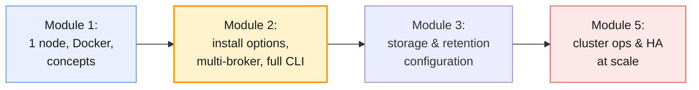

By the end of this module you will be able to:

- Choose and justify an **installation method** (Linux binary, Docker/Compose,
  or managed) for a given situation.
- Stand up a **3-node KRaft cluster** from scratch, including formatting
  storage with a shared cluster ID.
- Use `kafka-topics.sh`, `kafka-console-producer.sh`,
  `kafka-console-consumer.sh`, `kafka-consumer-groups.sh` and
  `kafka-metadata-quorum.sh` confidently.
- Diagnose the most common **install-time and connectivity** errors.

---

## 2. System requirements and installation options

### 2.1 Sizing a broker host

There is no universal "right" size — it depends on throughput, retention and
replication factor (capacity planning is covered in depth in Module 5) — but
every install starts from the same baseline questions:

| Resource | Minimum (dev/lab) | Typical production starting point | Why it matters |
| -------- | ------------------ | ---------------------------------- | --------------- |
| **CPU** | 2 vCPU | 8–16 vCPU | Compression, TLS, request handling |
| **RAM** | 2–4 GB | 32–64 GB | Kafka relies on the **OS page cache**, not JVM heap, to serve reads fast |
| **JVM heap** | 512 MB–1 GB | 6 GB (rarely more) | Oversized heaps hurt GC pauses; leave the rest of RAM for page cache |
| **Disk** | Any local disk | Multiple **dedicated** SSD/NVMe volumes, not shared with OS | Sequential-write heavy; disk I/O is usually the first bottleneck |
| **Network** | 1 Gbps | 10 Gbps+ | Replication traffic multiplies with replication factor |
| **File descriptors** | OS default | `ulimit -n` ≥ 100,000 | One per log segment file/index, plus one per socket |

> **Counter-intuitive but important:** Kafka's performance depends more on
> **page cache and sequential disk I/O** than on JVM heap size. A broker with a
> tiny heap and lots of free RAM for page cache regularly outperforms one with
> a huge heap. This is why the official guidance caps heap around 6 GB even on
> large machines.

### 2.2 Software prerequisites

| Requirement | Detail |
| ----------- | ------ |
| **Operating system** | Linux (production standard); macOS/Windows fine for local dev via Docker |
| **Java (JVM)** | Kafka is written in Scala/Java and runs on the JVM. **Kafka 4.x brokers require Java 17+.** Clients (producers/consumers) can generally use Java 11+; always check the release notes for your exact version |
| **DNS / hostname resolution** | Every broker's **advertised listener** hostname must resolve from every client and every other broker |
| **Disk filesystem** | XFS or ext4 recommended in production; avoid network filesystems (NFS) for log directories |
| **Clock sync** | NTP/chrony running — timestamps and some protocol timeouts assume reasonably synced clocks |

### 2.3 Installation options at a glance

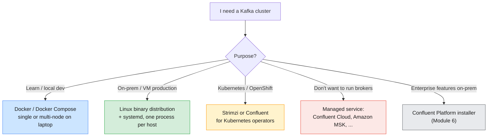

| Method | What you manage | This course uses it for |
| ------ | ---------------- | ------------------------ |
| **Linux binary (tarball)** | Everything: OS, JVM, service, disks, upgrades | Understanding how a broker *really* starts (§3); reference for the shared AWS cluster |
| **Docker / Docker Compose** | Container images, compose topology, volumes | All hands-on labs in Modules 1–5 (§4, §6, §10) |
| **Kubernetes operator (Strimzi / Confluent for Kubernetes)** | CRDs; the operator manages pods/PVCs | Mentioned only — out of scope for this course |
| **Managed (Confluent Cloud, Amazon MSK)** | Nothing infrastructure-level; API/console only | Confluent Cloud used from Module 6 onward |
| **Confluent Platform installer (RPM/DEB/tar/Ansible)** | Kafka + Confluent's extra services (Control Center, Schema Registry, RBAC) | Introduced in Module 6 |

> **Why this module uses Docker Compose for the labs:** it reproduces a real
> multi-broker topology (separate processes, separate ports, independent
> failure) on a single laptop, without needing three separate VMs. Every
> concept — listeners, `advertised.listeners`, storage formatting, the
> controller quorum — is identical to the Linux binary install in §3; only the
> packaging differs.

---

## 3. Installing Kafka on Linux (binary distribution)

This is how the shared AWS Kafka cluster, and most real production clusters,
are actually installed. Understanding it also demystifies what the Docker
image is doing under the hood.

### 3.1 Directory layout

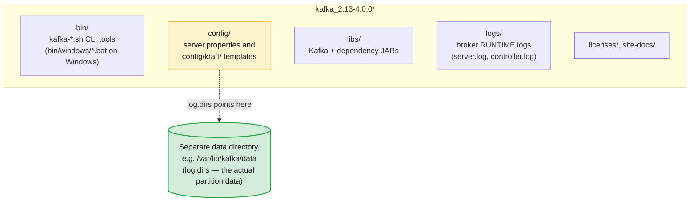

> ⚠️ **Don't confuse the two "logs".** `logs/` under the install directory is
> the broker's own **application log** (what a sysadmin would call `stdout`/
> `stderr` diagnostics). Partition **data** — the segment files from Module 1
> §7.1 — lives wherever **`log.dirs`** in `server.properties` points, which
> should always be a separate, dedicated volume.

### 3.2 Install steps

```bash
# 1. Prerequisite: Java 17+
java -version

# 2. Download and extract (use the version pinned for this course)
curl -O https://downloads.apache.org/kafka/4.0.0/kafka_2.13-4.0.0.tgz
tar -xzf kafka_2.13-4.0.0.tgz
cd kafka_2.13-4.0.0

# 3. Create a dedicated, non-root service user and data directory (production practice)
sudo useradd --system --no-create-home kafka
sudo mkdir -p /var/lib/kafka/data
sudo chown -R kafka:kafka /var/lib/kafka/data
```

> **Never run Kafka as root.** A dedicated service account limits the blast
> radius of any compromise or misconfiguration. This is revisited with SCC/ACL
> style controls in Module 7.

### 3.3 The key `server.properties` settings

Every install — Linux, Docker, or otherwise — is configured through the same
properties, whether they arrive as a file or as environment variables.

| Property | Example | Meaning |
| -------- | ------- | ------- |
| `process.roles` | `broker,controller` | This node's role(s) — see Module 1 §8.2 |
| `node.id` | `1` | Unique integer ID for this node in the cluster |
| `controller.quorum.voters` | `1@host1:9093,2@host2:9093,3@host3:9093` | The fixed controller quorum membership |
| `listeners` | `PLAINTEXT://0.0.0.0:9092,CONTROLLER://0.0.0.0:9093` | Sockets this node binds to |
| `advertised.listeners` | `PLAINTEXT://broker1.internal:9092` | Address **clients** should use — must be reachable from them |
| `controller.listener.names` | `CONTROLLER` | Which listener carries controller (Raft) traffic |
| `inter.broker.listener.name` | `PLAINTEXT` | Which listener brokers use to talk to each other |
| `log.dirs` | `/var/lib/kafka/data` | Where partition segment files are stored (can be a comma-separated list — JBOD, Module 3) |
| `num.partitions` | `3` | Default partition count for auto-created topics |
| `default.replication.factor` | `3` | Default RF for auto-created topics |

> `advertised.listeners` is the single most common source of "it works from
> the broker's own host but not from anywhere else." Revisited in §11.

### 3.4 Running as a systemd service

Production installs run Kafka under **systemd** rather than a foreground shell,
so it restarts on crash and starts on boot.

```ini
# /etc/systemd/system/kafka.service
[Unit]
Description=Apache Kafka Broker
After=network.target

[Service]
Type=simple
User=kafka
Group=kafka
Environment="JAVA_HOME=/usr/lib/jvm/java-17-openjdk"
ExecStart=/opt/kafka_2.13-4.0.0/bin/kafka-server-start.sh /opt/kafka_2.13-4.0.0/config/kraft/server.properties
ExecStop=/opt/kafka_2.13-4.0.0/bin/kafka-server-stop.sh
Restart=on-failure
LimitNOFILE=100000

[Install]
WantedBy=multi-user.target
```

```bash
sudo systemctl daemon-reload
sudo systemctl enable --now kafka
sudo systemctl status kafka
journalctl -u kafka -f
```

> Storage must be **formatted** before the very first start — covered in §5.
> Skipping this step is the most common reason a freshly installed broker
> refuses to start.

---

## 4. Installing Kafka with Docker

Docker packages the same binary distribution shown above into an image and
lets you configure it with **environment variables** instead of hand-editing
`server.properties`. This is what every lab in this course uses.

### 4.1 Single node (recap from Module 1)

```bash
docker run -d --name kafka -p 9092:9092 apache/kafka:4.0.0
```

### 4.2 Multi-broker with Docker Compose

Docker Compose lets one file describe an entire multi-node topology —
exactly what §6 and §10 use.

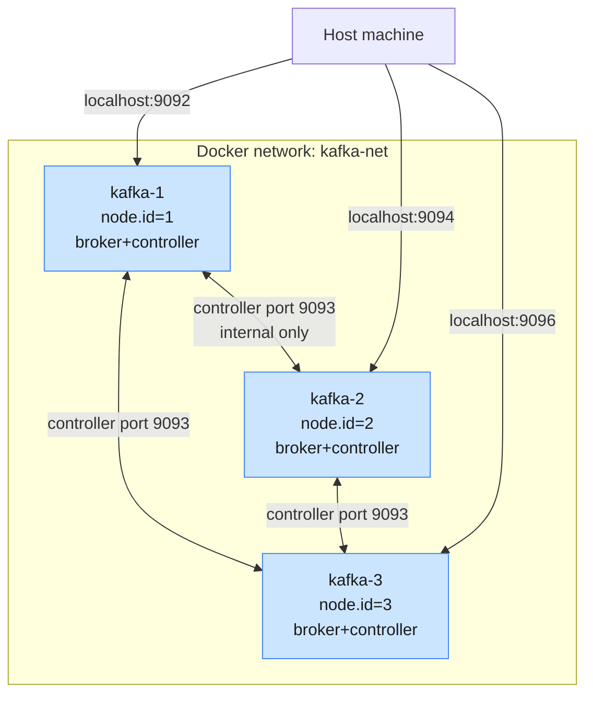

```yaml
# docker-compose.yml
services:
  kafka-1:
    image: apache/kafka:4.0.0
    container_name: kafka-1
    ports:
      - "9092:9092"
    environment:
      KAFKA_NODE_ID: 1
      KAFKA_PROCESS_ROLES: broker,controller
      KAFKA_LISTENERS: PLAINTEXT://0.0.0.0:29092,CONTROLLER://0.0.0.0:9093,EXTERNAL://0.0.0.0:9092
      KAFKA_ADVERTISED_LISTENERS: PLAINTEXT://kafka-1:29092,EXTERNAL://localhost:9092
      KAFKA_LISTENER_SECURITY_PROTOCOL_MAP: CONTROLLER:PLAINTEXT,PLAINTEXT:PLAINTEXT,EXTERNAL:PLAINTEXT
      KAFKA_CONTROLLER_LISTENER_NAMES: CONTROLLER
      KAFKA_INTER_BROKER_LISTENER_NAME: PLAINTEXT
      KAFKA_CONTROLLER_QUORUM_VOTERS: 1@kafka-1:9093,2@kafka-2:9093,3@kafka-3:9093
      KAFKA_CLUSTER_ID: ${CLUSTER_ID}
      KAFKA_OFFSETS_TOPIC_REPLICATION_FACTOR: 3
    volumes:
      - kafka-1-data:/var/lib/kafka/data
    networks: [kafka-net]

  kafka-2:
    image: apache/kafka:4.0.0
    container_name: kafka-2
    ports:
      - "9094:9092"
    environment:
      KAFKA_NODE_ID: 2
      KAFKA_PROCESS_ROLES: broker,controller
      KAFKA_LISTENERS: PLAINTEXT://0.0.0.0:29092,CONTROLLER://0.0.0.0:9093,EXTERNAL://0.0.0.0:9092
      KAFKA_ADVERTISED_LISTENERS: PLAINTEXT://kafka-2:29092,EXTERNAL://localhost:9094
      KAFKA_LISTENER_SECURITY_PROTOCOL_MAP: CONTROLLER:PLAINTEXT,PLAINTEXT:PLAINTEXT,EXTERNAL:PLAINTEXT
      KAFKA_CONTROLLER_LISTENER_NAMES: CONTROLLER
      KAFKA_INTER_BROKER_LISTENER_NAME: PLAINTEXT
      KAFKA_CONTROLLER_QUORUM_VOTERS: 1@kafka-1:9093,2@kafka-2:9093,3@kafka-3:9093
      KAFKA_CLUSTER_ID: ${CLUSTER_ID}
      KAFKA_OFFSETS_TOPIC_REPLICATION_FACTOR: 3
    volumes:
      - kafka-2-data:/var/lib/kafka/data
    networks: [kafka-net]

  kafka-3:
    image: apache/kafka:4.0.0
    container_name: kafka-3
    ports:
      - "9096:9092"
    environment:
      KAFKA_NODE_ID: 3
      KAFKA_PROCESS_ROLES: broker,controller
      KAFKA_LISTENERS: PLAINTEXT://0.0.0.0:29092,CONTROLLER://0.0.0.0:9093,EXTERNAL://0.0.0.0:9092
      KAFKA_ADVERTISED_LISTENERS: PLAINTEXT://kafka-3:29092,EXTERNAL://localhost:9096
      KAFKA_LISTENER_SECURITY_PROTOCOL_MAP: CONTROLLER:PLAINTEXT,PLAINTEXT:PLAINTEXT,EXTERNAL:PLAINTEXT
      KAFKA_CONTROLLER_LISTENER_NAMES: CONTROLLER
      KAFKA_INTER_BROKER_LISTENER_NAME: PLAINTEXT
      KAFKA_CONTROLLER_QUORUM_VOTERS: 1@kafka-1:9093,2@kafka-2:9093,3@kafka-3:9093
      KAFKA_CLUSTER_ID: ${CLUSTER_ID}
      KAFKA_OFFSETS_TOPIC_REPLICATION_FACTOR: 3
    volumes:
      - kafka-3-data:/var/lib/kafka/data
    networks: [kafka-net]

networks:
  kafka-net:

volumes:
  kafka-1-data:
  kafka-2-data:
  kafka-3-data:
```

> **Two listeners per node, on purpose:** `PLAINTEXT` (port `29092`) is how
> brokers reach each other **inside** the Docker network, using container
> names as hostnames. `EXTERNAL` (port `9092`/`9094`/`9096`) is how **your
> host machine** reaches each broker, using `localhost` and the **mapped**
> port. Get these mixed up and the classic symptom is: the console producer
> connects to `localhost:9092` fine, gets metadata back, then hangs or fails
> trying to reach `kafka-2:29092` for the actual write (§11).

> This uses the official `apache/kafka` image's environment-variable
> convention. Confluent's `confluentinc/cp-kafka` image (used from Module 6)
> follows the same `KAFKA_*` pattern with a couple of Confluent-specific
> additions. Always check the image's own documentation for the exact
> variable names and current defaults before relying on this in production.

---

## 5. KRaft mode setup: cluster ID, storage formatting, controller quorum

Module 1 §8 covered **what** KRaft is. This section covers what an
administrator actually has to **do** to bring a KRaft cluster to life.

### 5.1 The bootstrap sequence

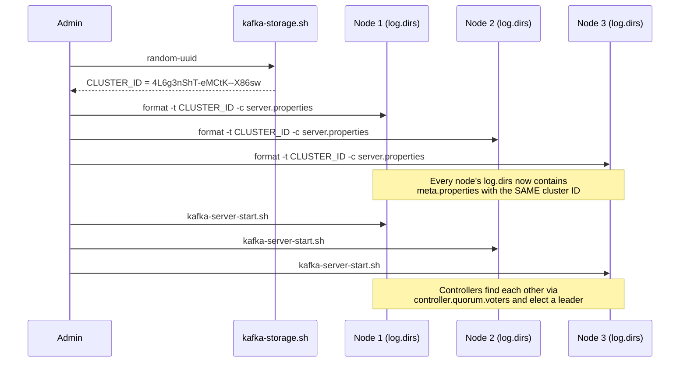

```bash
# Run once — this ID is shared by every node in the cluster
CLUSTER_ID=$(bin/kafka-storage.sh random-uuid)
echo $CLUSTER_ID

# Run on EVERY node, using that same ID, before the first start
bin/kafka-storage.sh format -t $CLUSTER_ID -c config/kraft/server.properties
```

| Concept | Meaning |
| ------- | ------- |
| **Cluster ID** | A UUID identifying the cluster as a whole. Generated once, stamped into every node's storage |
| **`format`** | Initialises `log.dirs` with `meta.properties` (cluster ID, node ID) and creates the initial metadata log |
| **`meta.properties`** | Small file inside `log.dirs` recording which cluster and node ID this storage belongs to |

> ⚠️ **`InconsistentClusterIdException`** is what you get when a node's
> storage was formatted with a **different** cluster ID than the quorum it is
> trying to join — for example, after accidentally re-running `format` with a
> fresh UUID on one node only. The fix is almost always to wipe that node's
> `log.dirs` and re-format with the cluster's real ID (data loss on that node,
> which replication should be able to repair — see Module 5).

### 5.2 The controller quorum in practice

`controller.quorum.voters` must list **every** controller node, in the exact
same form, on **every** node in the cluster (brokers included, even though
brokers aren't voters themselves — they still need to know how to reach the
quorum):

```
controller.quorum.voters=1@kafka-1:9093,2@kafka-2:9093,3@kafka-3:9093
```

| Field | Meaning |
| ----- | ------- |
| `1`, `2`, `3` | Each controller's `node.id` |
| `kafka-1:9093` | Host and **controller listener** port for that node |

> Because this list is fixed at format/start time, **adding or removing a
> controller node later is a deliberate, careful operation** (`kafka-metadata-
> quorum.sh` supports adding/removing voters on recent versions) — not
> something to do casually. Dedicated production controller sizing and change
> procedures are covered in Module 5.

### 5.3 Verifying the quorum

```bash
bin/kafka-metadata-quorum.sh --bootstrap-server localhost:9092 describe --status
```

```
ClusterId:              4L6g3nShT-eMCtK--X86sw
LeaderId:               1
LeaderEpoch:            3
HighWatermark:          182
MaxFollowerLag:         0
MaxFollowerLagTimeMs:   50
CurrentVoters:          [1,2,3]
CurrentObservers:       []
```

| Field | What it tells you |
| ----- | ------------------ |
| `LeaderId` | Which node is the **active controller** right now |
| `HighWatermark` | Position in the `__cluster_metadata` log (Module 1 §8.2) — growing means metadata changes are being written |
| `MaxFollowerLag` | How far behind the slowest standby controller is — should stay near 0 |
| `CurrentVoters` | The nodes actually participating in the Raft quorum — compare against `controller.quorum.voters` |

---

## 6. Multi-broker cluster architecture (the lab topology)

This is the target shape for this module's hands-on lab (§10): three
**combined** broker+controller nodes, matching real small-cluster deployments,
built from everything in §3–§5.

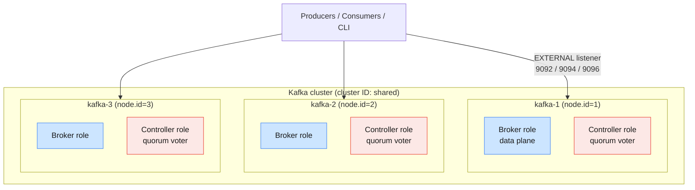

| Property | This lab | Larger production cluster |
| -------- | -------- | --------------------------- |
| Node roles | Combined (`broker,controller`) on all 3 nodes | Separate: dedicated controller-only quorum (3–5 nodes) + many broker-only nodes |
| Replication factor achievable | Up to 3 | Up to broker count |
| Rack/AZ awareness | Not modelled (all on one Docker host) | `broker.rack` set per AZ (Module 5) |
| Fits course lab hardware | Yes — runs on a 16 GB laptop | N/A |

> **Why combined mode here, dedicated mode in production:** combined mode
> (§4.2) is simpler to run and is exactly what the official Kafka quickstart
> uses for small/dev clusters. At production scale, controller traffic
> (metadata changes) and broker traffic (data) are isolated onto **separate**
> nodes so a burst of one never starves the other. This distinction is
> revisited in Module 5's capacity planning section.

---

## 7. Kafka CLI tools overview

Every `kafka-*.sh` script lives in `bin/` (or is run via `docker exec` against
a container, as in Module 1 §9.3) and is a thin wrapper around a Java class.
On Windows, the equivalent `.bat` files live in `bin\windows\`.

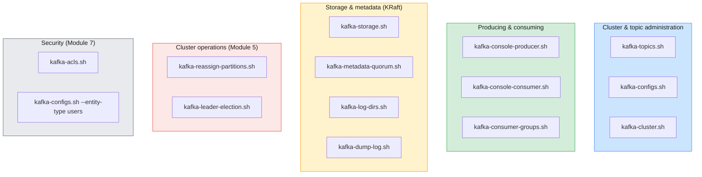

| Tool | Purpose | Deep dive |
| ---- | ------- | --------- |
| `kafka-topics.sh` | Create, list, describe, alter, delete topics | §8 (this module) |
| `kafka-console-producer.sh` | Produce records from stdin | §9 (this module) |
| `kafka-console-consumer.sh` | Consume records to stdout | §9 (this module) |
| `kafka-consumer-groups.sh` | List/describe groups, lag, reset offsets | §9 here; deep dive Module 4, 8 |
| `kafka-configs.sh` | View/alter dynamic broker, topic, client and user configs | Module 3 |
| `kafka-storage.sh` | Generate cluster ID, format storage for KRaft | §5 (this module) |
| `kafka-metadata-quorum.sh` | Inspect/manage the KRaft controller quorum | §5 (this module); Module 5 |
| `kafka-log-dirs.sh` | Report partition size per log directory | Module 3 |
| `kafka-dump-log.sh` | Decode segment file contents | Module 3 |
| `kafka-reassign-partitions.sh` | Move partitions between brokers | Module 5 |
| `kafka-leader-election.sh` | Trigger preferred/unclean leader election | Module 5 |
| `kafka-acls.sh` | Manage access control lists | Module 7 |
| `kafka-broker-api-versions.sh` | Show which protocol API versions a broker supports | Troubleshooting compatibility |

### 7.1 Flags nearly every tool shares

| Flag | Meaning |
| ---- | ------- |
| `--bootstrap-server host:port[,host:port...]` | The **only** connection method in Kafka 4.x — a legacy `--zookeeper` flag existed in older tools and no longer works (Module 1 §8.4) |
| `--command-config <file>` | Client properties file — used to pass security settings (SASL/TLS) to admin tools (Module 7) |
| `--version` | Print the client library version |

> **One reachable broker is enough.** As in Module 1 §5.5, `--bootstrap-
> server` just needs to reach **any one** broker; that broker returns cluster
> metadata and the tool proceeds from there.

---

## 8. Topic management: create, list, describe, alter, delete

### 8.1 The topic lifecycle

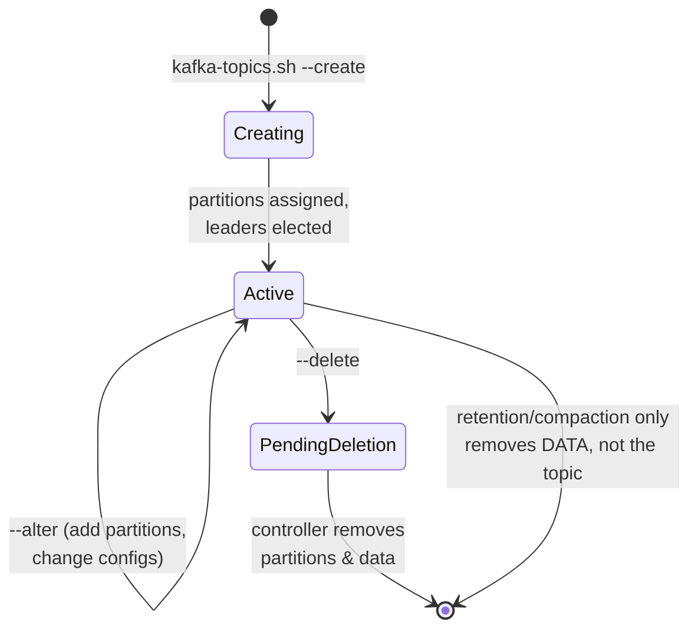

- **Create** is synchronous from the client's point of view but partition
  assignment and leader election happen on the controller.
- **Alter** can **increase** partitions but **cannot decrease** them (doing so
  would break the key → partition mapping from Module 1 §5.3 in ways that
  can't be safely undone).
- **Delete** is asynchronous: the topic is marked for deletion and the
  controller removes its partitions and on-disk data in the background.

### 8.2 Create

```bash
bin/kafka-topics.sh --bootstrap-server localhost:9092 --create \
  --topic cdr.voice \
  --partitions 6 \
  --replication-factor 3 \
  --config retention.ms=604800000 \
  --config min.insync.replicas=2 \
  --config cleanup.policy=delete
```

| Flag | Meaning |
| ---- | ------- |
| `--partitions` | Initial partition count — see Module 1 §5.2–5.3 for how this affects ordering and parallelism |
| `--replication-factor` | Must be **≤ number of brokers**; 3 is the production baseline (Module 1 §6.4) |
| `--config key=value` | Topic-level overrides of broker defaults — full list in Module 3 |

> ⚠️ **`replication-factor` larger than the broker count** fails immediately
> with `InvalidReplicationFactorException`. This is one of the most common
> first mistakes when a lab cluster has fewer brokers than the exercise
> assumes.

### 8.3 List and describe

```bash
# All topics (internal topics like __consumer_offsets are hidden by default in some versions)
bin/kafka-topics.sh --bootstrap-server localhost:9092 --list

# One topic in full detail
bin/kafka-topics.sh --bootstrap-server localhost:9092 --describe --topic cdr.voice
```

```
Topic: cdr.voice   TopicId: 8f3d...   PartitionCount: 6   ReplicationFactor: 3
  Configs: retention.ms=604800000,min.insync.replicas=2,cleanup.policy=delete
  Topic: cdr.voice  Partition: 0  Leader: 2  Replicas: 2,1,3  Isr: 2,1,3
  Topic: cdr.voice  Partition: 1  Leader: 3  Replicas: 3,2,1  Isr: 3,2,1
  Topic: cdr.voice  Partition: 2  Leader: 1  Replicas: 1,3,2  Isr: 1,3,2
  ...
```

| Column | Meaning | Cross-reference |
| ------ | ------- | ---------------- |
| `Leader` | Broker currently serving reads/writes for that partition | Module 1 §6.3 |
| `Replicas` | All brokers holding a copy, leader first | Module 1 §6.3 |
| `Isr` | In-sync replicas right now | Module 1 §6.3 |

Useful health-focused describe filters:

```bash
# Partitions with fewer in-sync replicas than assigned replicas
bin/kafka-topics.sh --bootstrap-server localhost:9092 --describe --under-replicated-partitions

# Partitions that have dropped below min.insync.replicas (writes at risk of rejection)
bin/kafka-topics.sh --bootstrap-server localhost:9092 --describe --under-min-isr-partitions

# Partitions with no reachable leader
bin/kafka-topics.sh --bootstrap-server localhost:9092 --describe --unavailable-partitions
```

> These three flags are exactly the kind of check an administrator runs first
> when paged about a Kafka incident — expanded into a full monitoring
> workflow in Module 8.

### 8.4 Alter

```bash
# Add partitions (one-way — cannot be undone)
bin/kafka-topics.sh --bootstrap-server localhost:9092 --alter \
  --topic cdr.voice --partitions 12

# Change a topic config (equivalently done via kafka-configs.sh — Module 3)
bin/kafka-topics.sh --bootstrap-server localhost:9092 --alter \
  --topic cdr.voice --config retention.ms=259200000
```

### 8.5 Delete

```bash
bin/kafka-topics.sh --bootstrap-server localhost:9092 --delete --topic cdr.voice
```

- Topic deletion has been **enabled by default since Kafka 1.0.1**
  (`delete.topic.enable=true`); older tutorials warning that "delete does
  nothing unless you flip a flag" describe versions long out of use.
- Deletion is **irreversible** and removes all data for the topic — there is
  no recycle bin. Confirm the topic name carefully, especially in shared
  clusters.

---

## 9. Producing and consuming via CLI

The console producer/consumer are thin CLI wrappers around the same Java
producer/consumer clients used by real applications (Module 4). They are
invaluable for testing, but every setting they expose is a real client
setting.

### 9.1 The request path

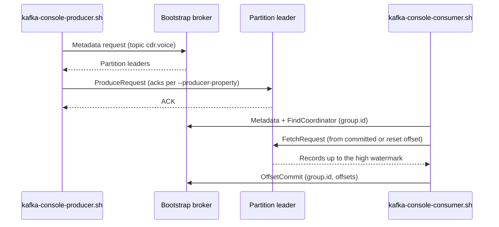

### 9.2 Producing

```bash
bin/kafka-console-producer.sh --bootstrap-server localhost:9092 \
  --topic cdr.voice \
  --property parse.key=true \
  --property key.separator=: \
  --producer-property acks=all \
  --producer-property compression.type=snappy
# 966500000001:call-start
# 966500000002:call-start
```

| Flag | Category | Effect |
| ---- | -------- | ------ |
| `--property parse.key=true` / `key.separator=:` | CLI parsing | Splits each input line into key/value on the first `:` |
| `--producer-property acks=all` | Real producer config | Same `acks` covered in Module 1 §6.4 |
| `--producer.config <file>` | Real producer config | Point at a `.properties` file instead of repeating `--producer-property` |

A minimal `producer.properties` file, handy for repeatable lab commands or for
pointing at security settings later:

```properties
bootstrap.servers=localhost:9092,localhost:9094,localhost:9096
acks=all
enable.idempotence=true
compression.type=snappy
```

```bash
bin/kafka-console-producer.sh --topic cdr.voice --producer.config producer.properties
```

### 9.3 Consuming

```bash
bin/kafka-console-consumer.sh --bootstrap-server localhost:9092 \
  --topic cdr.voice \
  --group billing \
  --from-beginning \
  --property print.partition=true \
  --property print.offset=true \
  --property print.key=true \
  --property print.timestamp=true \
  --consumer-property auto.offset.reset=earliest
```

| Flag | Effect |
| ---- | ------ |
| `--group <id>` | Joins/creates a real consumer group — commits offsets like any application (Module 1 §5.4) |
| `--from-beginning` | Only affects behaviour **the first time** this group has no committed offset; equivalent to `auto.offset.reset=earliest` |
| `--property print.*` | Cosmetic: shows partition/offset/key/timestamp alongside each value, invaluable for teaching and debugging |
| (no `--group`) | Uses a random, throwaway group each run — always reads fresh, commits nothing durable |

### 9.4 Inspecting what you just did

```bash
# Where is this group now, and how far behind is it?
bin/kafka-consumer-groups.sh --bootstrap-server localhost:9092 --describe --group billing
```

```
GROUP    TOPIC       PARTITION  CURRENT-OFFSET  LOG-END-OFFSET  LAG  CONSUMER-ID
billing  cdr.voice   0          145             145             0    console-consumer-...
billing  cdr.voice   1          98              101             3    console-consumer-...
```

| Column | Meaning | Cross-reference |
| ------ | ------- | ---------------- |
| `CURRENT-OFFSET` | The group's committed offset | Module 1 §6.2 |
| `LOG-END-OFFSET` | The partition's LEO | Module 1 §6.2 |
| `LAG` | `LOG-END-OFFSET − CURRENT-OFFSET` | Module 1 §6.2 — the metric Module 8's monitoring is built around |

```bash
# List all groups on the cluster
bin/kafka-consumer-groups.sh --bootstrap-server localhost:9092 --list

# Reset a group back to the beginning (group must have no active members)
bin/kafka-consumer-groups.sh --bootstrap-server localhost:9092 \
  --group billing --topic cdr.voice --reset-offsets --to-earliest --execute
```

> Offset reset strategies, rebalancing behaviour and delivery semantics
> (at-least-once / exactly-once) get a full treatment in **Module 4**. Here,
> the goal is just to be fluent with the commands.

---

## 10. Hands-on lab: end-to-end multi-broker walkthrough

This walks through §4–§9 as one continuous exercise on the 3-node Compose
topology from §6.

```bash
# 1. Generate a shared cluster ID and bring the cluster up
export CLUSTER_ID=$(docker run --rm apache/kafka:4.0.0 \
  /opt/kafka/bin/kafka-storage.sh random-uuid)
docker compose up -d
docker compose ps

# 2. Confirm the controller quorum formed
docker exec -it kafka-1 /opt/kafka/bin/kafka-metadata-quorum.sh \
  --bootstrap-server localhost:9092 describe --status

# 3. Create a replicated, multi-partition topic
docker exec -it kafka-1 /opt/kafka/bin/kafka-topics.sh \
  --bootstrap-server localhost:9092 --create \
  --topic cdr.voice --partitions 6 --replication-factor 3 \
  --config min.insync.replicas=2

# 4. Describe it — note leaders spread across all 3 brokers
docker exec -it kafka-1 /opt/kafka/bin/kafka-topics.sh \
  --bootstrap-server localhost:9092 --describe --topic cdr.voice

# 5. Produce keyed test messages with acks=all
docker exec -it kafka-1 /opt/kafka/bin/kafka-console-producer.sh \
  --bootstrap-server localhost:9092 --topic cdr.voice \
  --property parse.key=true --property key.separator=: \
  --producer-property acks=all
#   966500000001:call-start
#   966500000002:call-start

# 6. Consume as a named group
docker exec -it kafka-1 /opt/kafka/bin/kafka-console-consumer.sh \
  --bootstrap-server localhost:9092 --topic cdr.voice \
  --group billing --from-beginning \
  --property print.partition=true --property print.offset=true

# 7. Check lag
docker exec -it kafka-1 /opt/kafka/bin/kafka-consumer-groups.sh \
  --bootstrap-server localhost:9092 --describe --group billing

# 8. Simulate a broker failure — stop whichever broker leads partition 0
docker stop kafka-2   # adjust to whichever node --describe showed as Leader

# 9. Describe again — a new leader was elected from the ISR
docker exec -it kafka-1 /opt/kafka/bin/kafka-topics.sh \
  --bootstrap-server localhost:9092 --describe --topic cdr.voice

# 10. Produce/consume again — the cluster kept serving despite the outage
docker exec -it kafka-1 /opt/kafka/bin/kafka-console-producer.sh \
  --bootstrap-server localhost:9092 --topic cdr.voice \
  --property parse.key=true --property key.separator=:

# 11. Bring the broker back and watch it rejoin the ISR
docker start kafka-2
docker exec -it kafka-1 /opt/kafka/bin/kafka-topics.sh \
  --bootstrap-server localhost:9092 --describe --topic cdr.voice
```

| Observation | Concept | Where it's covered |
| ----------- | ------- | -------------------- |
| Quorum `describe --status` shows one `LeaderId` and 3 `CurrentVoters` | KRaft controller quorum | §5, Module 1 §8.2 |
| Partition leaders are spread across kafka-1/2/3 | Load balancing of leadership | Module 1 §6.3 |
| After `docker stop`, a partition's `Leader` changes but `Isr` shrinks | Leader failover from the ISR | Module 1 §6.5 |
| Produce/consume keep working during the outage (with RF=3, min.insync.replicas=2) | Durability baseline in action | Module 1 §6.4 |
| After `docker start kafka-2`, its replicas re-enter `Isr` | Follower catch-up | Module 1 §6.3; deep dive Module 5 |

Full teardown:

```bash
docker compose down -v   # -v also removes the named volumes (all data)
```

> This lab is a hands-on preview of **Module 5** (cluster operations, ISR,
> failover, capacity planning) — here the goal is operational fluency with the
> CLI; Module 5 explains the failover mechanics and recovery tuning in depth.

---

## 11. Troubleshooting common installation & connectivity issues

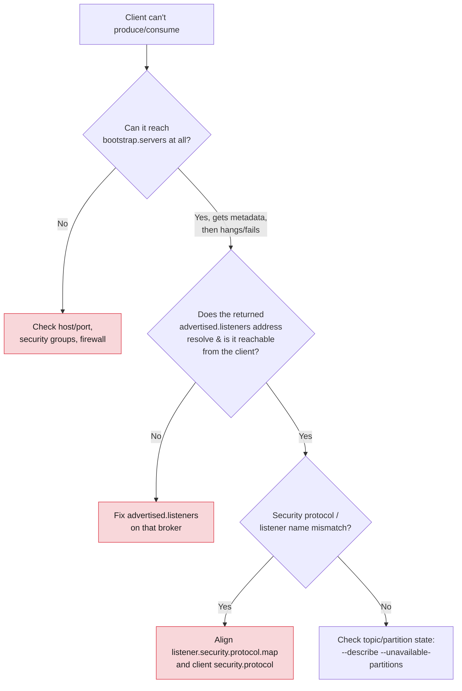

| Symptom | Likely cause | Fix |
| ------- | ------------ | --- |
| `Connection to node -1 could not be established` | Client can't reach any bootstrap broker | Check host/port reachability, security groups/firewall |
| Metadata succeeds, then `Connection to node <id> could not be established` for produce/fetch | `advertised.listeners` on that broker points to an address the client can't resolve or reach (§4.2) | Fix `advertised.listeners`; in Docker Compose, verify internal vs external listener split |
| `InconsistentClusterIdException` at startup | Node's `log.dirs` was formatted with a different cluster ID than the rest of the quorum (§5.1) | Re-format that node's storage with the correct cluster ID (data on that node is lost; replication should repair it) |
| Broker exits immediately with `NodeExistsException` or refuses to start with no formatted storage | `kafka-storage.sh format` was never run for this `log.dirs` | Run `format` before the first start (§5.1) |
| `UnsupportedClassVersionError` / broker won't start | JVM too old for this Kafka version (§2.2) | Install Java 17+ for Kafka 4.x brokers |
| `--zookeeper` flag rejected / "unrecognized option" | Using ZooKeeper-era tool syntax against a KRaft (4.x) cluster | Use `--bootstrap-server` (Module 1 §8.4) |
| `InvalidReplicationFactorException` on topic create | `--replication-factor` greater than the number of brokers | Lower RF or add brokers first |
| `NOT_ENOUGH_REPLICAS` on produce | ISR has shrunk below `min.insync.replicas` | Investigate broker health; see Module 9 (preventing message loss) |
| `Address already in use` starting a local broker/container | Port already bound by a previous run | `docker compose down` / stop the stale process, or change the port mapping |
| Consumer reads nothing even with data present | Wrong `--group` (fresh group defaults per `auto.offset.reset`), or reading from a partition with no data for that key | Check `--describe --group`; verify with `--from-beginning` on a new group name |

> **First troubleshooting command, every time:**
> `kafka-topics.sh --bootstrap-server <any-broker> --describe --topic <name>`.
> It tells you in one shot whether the topic exists, who the leader is, and
> whether the ISR is healthy — the same instinct MQ administrators already
> have for "check the queue" (Module 1 §3.3).

---

## 12. Bridging to the rest of the course

| Question this module raises | Answered in |
| ---------------------------- | ----------- |
| What do all these topic-level `--config` overrides actually control? | Module 3 |
| How do I tune producers/consumers beyond the CLI defaults, and in Java? | Module 4 |
| How do I add/remove brokers and reassign partitions on a live cluster? | Module 5 |
| How does this map to Confluent CLI and Control Center? | Module 6 |
| How do I secure `--bootstrap-server` access (SASL/TLS/ACLs, RBAC)? | Module 7 |
| How do I monitor the health signals seen here (ISR, lag) continuously? | Module 8 |

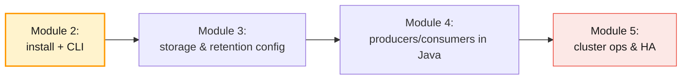

---

## 13. Key takeaways

1. **Sizing and prerequisites come first:** page cache-friendly RAM, dedicated
   disks, high file-descriptor limits, and **Java 17+ for Kafka 4.x brokers**.
2. **Docker Compose and the Linux binary install configure the exact same
   properties** — one via environment variables, one via `server.properties` —
   so skills transfer directly to the shared AWS cluster.
3. **Every KRaft node's storage must be formatted with the same cluster ID**
   before its first start (`kafka-storage.sh random-uuid` then `format`).
   Mismatches cause `InconsistentClusterIdException`.
4. **`controller.quorum.voters` is fixed cluster membership** — verify it with
   `kafka-metadata-quorum.sh describe --status`.
5. **Separate internal vs external listeners** when running multi-broker in
   Docker; `advertised.listeners` is the #1 source of "works locally, fails
   from outside" connectivity issues.
6. **`kafka-topics.sh` is the primary topic administration tool:** create,
   list, describe (including health filters like
   `--under-min-isr-partitions`), alter (partitions only increase), delete
   (irreversible, async).
7. **Console producer/consumer wrap the real client libraries** — every
   `--producer-property` / `--consumer-property` is a genuine client config,
   and `--group` creates a genuine, durable consumer group.
8. **`kafka-consumer-groups.sh --describe`** surfaces `LAG` directly — the
   same metric Module 8's monitoring is built around.
9. **Diagnose connectivity top-down:** can the client reach a bootstrap
   broker → does it then reach the *advertised* address of the actual leader
   → do security protocols match → is the partition itself healthy.

---

## 14. Glossary

| Term | Definition |
| ---- | ---------- |
| **Cluster ID** | UUID identifying an entire KRaft cluster; stamped into every node's storage at format time |
| **`meta.properties`** | File inside `log.dirs` recording a node's cluster ID and node ID |
| **`kafka-storage.sh format`** | CLI command that initialises a node's storage before its first start |
| **Listener** | A named network endpoint (protocol, host, port) a broker binds to |
| **`advertised.listeners`** | The address(es) a broker tells clients to use — must be reachable from them |
| **`inter.broker.listener.name`** | Which listener brokers use to talk to each other |
| **`controller.listener.names`** | Which listener carries KRaft controller (Raft) traffic |
| **Combined mode** | A KRaft node running both `broker` and `controller` roles |
| **Dedicated controller** | A KRaft node running the `controller` role only |
| **JBOD** | "Just a Bunch Of Disks" — multiple `log.dirs` on one broker (Module 3) |
| **Systemd unit** | Linux service definition used to run Kafka as a managed background process |
| **Console producer/consumer** | CLI tools (`kafka-console-producer.sh`/`-consumer.sh`) wrapping the real Kafka clients |
| **Consumer lag** | `LOG-END-OFFSET − CURRENT-OFFSET` for a group/partition, shown by `kafka-consumer-groups.sh` |
| **Under-replicated partition** | A partition whose ISR is smaller than its replica count |
| **Under-min-ISR partition** | A partition whose ISR has dropped below `min.insync.replicas` — writes at risk |

---

## 15. References

**Apache Kafka (official)**

- Kafka Quickstart — <https://kafka.apache.org/quickstart>
- Operations guide (full CLI reference, KRaft ops) — <https://kafka.apache.org/documentation/#operations>
- Broker configuration reference — <https://kafka.apache.org/documentation/#brokerconfigs>
- KRaft documentation — <https://kafka.apache.org/documentation/#kraft>
- Kafka downloads — <https://kafka.apache.org/downloads>

**Docker**

- Official Apache Kafka Docker image — <https://hub.docker.com/r/apache/kafka>
- Docker Compose file reference — <https://docs.docker.com/reference/compose-file/>
- Confluent `cp-kafka` image (used from Module 6) — <https://hub.docker.com/r/confluentinc/cp-kafka>

**Systemd**

- systemd.service reference — <https://www.freedesktop.org/software/systemd/man/latest/systemd.service.html>

**Confluent**

- Confluent Developer: Kafka CLI tutorials — <https://developer.confluent.io/confluent-tools/kafka-cli/>
- Confluent Platform on-prem installation — <https://docs.confluent.io/platform/current/installation/overview.html>

---

> **Next module:** _Module 3 — Cluster Configuration, Storage & Retention_,
> where we go deeper into the broker and topic configuration surface touched
> briefly here — log directories, segment management, retention/cleanup
> policies, `min.insync.replicas`/`acks` in depth, and storage optimisation —
> and apply it against the shared Apache Kafka cluster on AWS.
