# Module 3 — Cluster Configuration, Storage & Retention

> **Course:** Apache Kafka & Confluent Kafka Administration
> **Module objective:** Administer storage, retention, and configuration on
> Apache Kafka clusters.

---

## Table of contents

1. [Why this module matters](#1-why-this-module-matters)
2. [Broker configuration parameters](#2-broker-configuration-parameters)
3. [Log directories and segment management](#3-log-directories-and-segment-management)
4. [Topic-level configuration overrides](#4-topic-level-configuration-overrides)
5. [Retention and cleanup policies: delete vs. compact](#5-retention-and-cleanup-policies-delete-vs-compact)
6. [min.insync.replicas and acknowledgments (acks)](#6-mininsyncreplicas-and-acknowledgments-acks)
7. [Storage optimization techniques](#7-storage-optimization-techniques)
8. [Hands-on lab: retention, replication and durability](#8-hands-on-lab-retention-replication-and-durability)
9. [Troubleshooting configuration & storage issues](#9-troubleshooting-configuration--storage-issues)
10. [Bridging to the rest of the course](#10-bridging-to-the-rest-of-the-course)
11. [Key takeaways](#11-key-takeaways)
12. [Glossary](#12-glossary)
13. [References](#13-references)

> **How to read the diagrams:** Diagrams are written in [Mermaid](https://mermaid.js.org/),
> which renders automatically in GitHub, VS Code (with a Mermaid extension), and most
> modern Markdown viewers. If a diagram appears as code, install/enable a Mermaid
> preview to see the rendered version.

> **Builds on:** [Module 2 — Kafka Installation, Setup & CLI Operations](./module-02-installation-setup-cli-operations.md).
> This module assumes you can stand up a multi-broker KRaft cluster and drive the
> CLI toolkit (Module 2 §5–§9), and that you know the log, segment, offset and
> replication model from Module 1 §5–§7. It focuses on the **configuration and
> storage decisions** that determine how long data lives, how much disk it consumes,
> and how durable it really is.

---

## 1. Why this module matters

Module 2 gave you a cluster that **runs**. This module makes it a cluster that
**stores your business data the way the business needs it stored**: for the
right amount of time, at the right size, with the right durability guarantees.

Storage is where Kafka administrators spend most of their working life — and
where most production incidents start. A retention value copied from a blog can
delete billing records a day too early. A `min.insync.replicas` left at the
default of 1 can turn a broker failure into silent data loss. A topic with
1 GB segments and 100 ms of traffic can hold data for weeks after "retention
expired". None of these are exotic bugs; all of them are **configuration**.

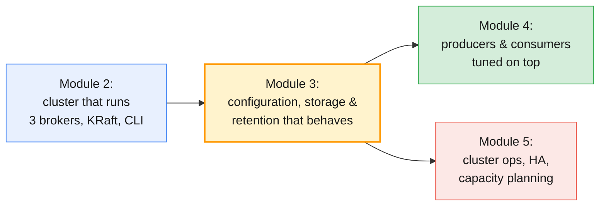

By the end of this module you will be able to:

- Navigate the full **broker configuration surface** and know which settings
  are static, which are dynamic, and how values are resolved.
- Manage **log directories and segments** — rolling, indexes, JBOD — and
  predict when data becomes eligible for deletion.
- Apply and inspect **topic-level overrides** with `kafka-configs.sh` and read
  where every effective value comes from.
- Design **retention** (time-based and size-based) and **cleanup policies**
  (`delete` vs `compact`) per topic class.
- Prove **durability** behaviour under different `acks` and
  `min.insync.replicas` settings — including deliberate failure drills.
- Apply practical **storage optimization** techniques: compression, batching,
  segment sizing, compaction tuning and tiered storage.

---

## 2. Broker configuration parameters

### 2.1 Where a broker's configuration comes from

Every Kafka setting has a **default**, can be set **statically** in
`server.properties`, and — for many settings — can be changed **dynamically**
at runtime without a restart. When several of those exist for the same
property, Kafka resolves them in a fixed precedence order.

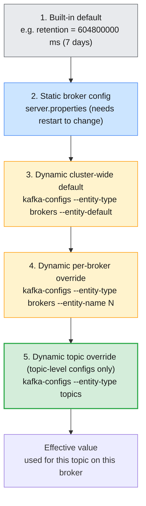

The layers stack: a **topic override wins over everything** for that topic; a
dynamic broker config wins over the static file; and anything unset falls back
down the chain to the built-in default. The same property can therefore have
different effective values on different brokers if you use per-broker dynamic
configs — which is exactly why cluster-wide topic defaults should be set with
`--entity-default`, not per broker.

| Scope | Set with | Applies to | Needs restart? |
| ----- | -------- | ---------- | -------------- |
| **Built-in default** | Nothing — it is the fallback | All topics/brokers | No |
| **Static broker** | `server.properties` | One broker | Yes |
| **Dynamic cluster-wide default** | `--entity-type brokers --entity-default` | All brokers (default for topics) | No |
| **Dynamic per-broker** | `--entity-type brokers --entity-name N` | One broker | No |
| **Dynamic topic override** | `--entity-type topics --entity-name T` | One topic | No |
| **Client config** | Producer/consumer properties | One application | No |

### 2.2 Static vs dynamic configuration

Not every property can be changed at runtime. **Topology and identity settings
are static** — changing them means editing `server.properties` and restarting
the broker (a rolling restart in production, Module 5):

| Static (restart required) | Dynamic (no restart) |
| ------------------------- | -------------------- |
| `log.dirs` | `log.retention.ms` / `log.retention.bytes` |
| `node.id` | `log.segment.bytes` / `log.roll.ms` |
| `process.roles` | `min.insync.replicas` |
| `controller.quorum.voters` | `message.max.bytes` |
| `log.cleaner.enable` | `log.cleaner.threads` |
| — | `num.io.threads`, `num.network.threads` |

Dynamic changes are made with the same `kafka-configs.sh` tool you met in
Module 2, but with **broker** entities:

```bash
# A cluster-wide default: every topic without an override gets 3 days of retention
kafka-configs.sh --bootstrap-server $BS --alter \
  --entity-type brokers --entity-default \
  --add-config log.retention.ms=259200000

# A per-broker setting: only broker 1 gets more I/O threads
kafka-configs.sh --bootstrap-server $BS --alter \
  --entity-type brokers --entity-name 1 \
  --add-config num.io.threads=16

# Inspect what is set and where it comes from
kafka-configs.sh --bootstrap-server $BS --describe --entity-type brokers --entity-name 1
```

The describe output labels each value with its **source** (a *synonym*). This
is the single most useful habit when debugging "why is this value like that?":

```
Dynamic configs for broker 1 are:
  num.io.threads=16 sensitive=false synonyms={DYNAMIC_BROKER_CONFIG:num.io.threads=16}
  log.retention.ms=259200000 sensitive=false synonyms={DYNAMIC_DEFAULT_BROKER_CONFIG:log.retention.ms=259200000, STATIC_BROKER_CONFIG:log.retention.hours=168, DEFAULT_CONFIG:log.retention.ms=604800000}
```

| Synonym label | Meaning |
| ------------- | ------- |
| `DYNAMIC_TOPIC_CONFIG` | Set explicitly on the topic — highest precedence |
| `DYNAMIC_BROKER_CONFIG` | Set on this specific broker |
| `DYNAMIC_DEFAULT_BROKER_CONFIG` | Cluster-wide dynamic default |
| `STATIC_BROKER_CONFIG` | From `server.properties` |
| `DEFAULT_CONFIG` | Kafka's built-in default |

> ⚠️ **Common trap for MQ administrators:** in MQ you often think in terms of
> one queue manager's properties. In Kafka, the same topic is spread across
> brokers, so a **per-broker** dynamic default can silently give partitions of
> the same topic different behaviour depending on which broker leads them. Set
> cluster-wide defaults with `--entity-default` and reserve per-broker dynamic
> configs for genuinely node-specific resources (threads, network buffers).

### 2.3 The storage-relevant broker parameters

The broker `log.*` properties are defaults; most have a topic-level equivalent
**without the `log.` prefix** (covered in §4). Learn the pairs — using the
wrong name at the wrong scope is the most common configuration error.

| Broker property | Default | What it controls | Topic equivalent |
| --------------- | ------- | ---------------- | ---------------- |
| `log.dirs` | `/tmp/kafka-logs` | Where partition data lives; comma-separated for JBOD | — (broker only) |
| `log.segment.bytes` | `1073741824` (1 GiB) | Segment roll size | `segment.bytes` |
| `log.roll.ms` / `log.roll.hours` | `null` / `168` | Segment roll age | `segment.ms` |
| `log.roll.jitter.ms` | `null` / `0` | Random jitter subtracted from roll time | `segment.jitter.ms` |
| `log.retention.ms` / `.hours` | `604800000` (7 days) | Time-based retention | `retention.ms` |
| `log.retention.bytes` | `-1` (unlimited) | Size-based retention **per partition** | `retention.bytes` |
| `log.retention.check.interval.ms` | `300000` (5 min) | How often retention is evaluated | — (broker only) |
| `log.segment.delete.delay.ms` | `60000` | Delay between "marked deleted" and file removal | `file.delete.delay.ms` |
| `log.cleanup.policy` | `delete` | Default cleanup policy | `cleanup.policy` |
| `log.cleaner.enable` | `true` | Whether the log cleaner runs at all | — (broker only) |
| `log.cleaner.threads` | `1` | Cleaner parallelism per broker | — (broker only) |
| `log.cleaner.min.cleanable.ratio` | `0.5` | Dirty ratio that triggers compaction | `min.cleanable.dirty.ratio` |
| `log.cleaner.delete.retention.ms` | `86400000` (24 h) | Tombstone lifetime | `delete.retention.ms` |
| `log.cleaner.dedupe.buffer.size` | `134217728` (128 MB) | Cleaner dedupe memory | — (broker only) |
| `min.insync.replicas` | `1` | Minimum ISR for `acks=all` writes | `min.insync.replicas` |
| `unclean.leader.election.enable` | `false` | Allow out-of-sync replicas to become leader | `unclean.leader.election.enable` |
| `message.max.bytes` | `1048588` (~1 MB) | Largest record batch the broker accepts | `max.message.bytes` |
| `replica.fetch.max.bytes` | `1048576` (1 MB) | Largest batch a follower fetches | — (broker only) |
| `compression.type` | `producer` | Broker-side recompression policy | `compression.type` |
| `num.recovery.threads.per.data.dir` | `1` | Parallel log recovery at startup | — (broker only) |
| `log.index.interval.bytes` | `4096` | Index density (bytes between entries) | `index.interval.bytes` |
| `log.index.size.max.bytes` | `10485760` (10 MiB) | Max size of one index file | `segment.index.bytes` |

> ⚠️ **The `message.max.bytes` pairing trap.** If you raise `max.message.bytes`
> on a topic but leave broker `replica.fetch.max.bytes` at 1 MB, followers can
> fail to fetch the larger batches and replicas fall out of the ISR under load.
> Raise them together (and check `replica.fetch.response.max.bytes` too), or
> keep records comfortably below 1 MB.

> **A note on `log.flush.*`:** the `log.flush.interval.messages` and
> `log.flush.interval.ms` settings default to "effectively never", and that is
> intentional. Durability in Kafka comes from **replication**, not from forcing
> `fsync` per message; fsync-per-message would destroy throughput and still not
> protect you from a disk failure. Leave these alone and configure `acks` and
> `min.insync.replicas` instead (§6).

### 2.4 Changing broker configuration safely

For **dynamic** configs the sequence is fast and does not restart anything. In
KRaft mode the change becomes a metadata event that brokers apply to their
caches (details in §4.3):

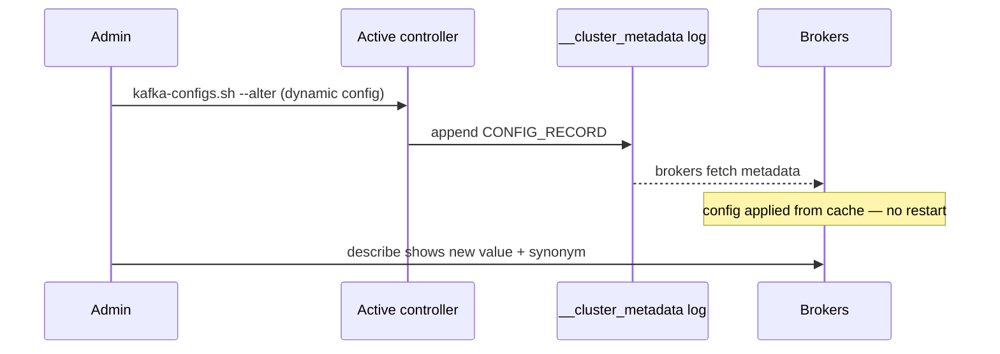

For **static** configs, plan a restart window; content changes are applied via
a rolling restart, one broker at a time, watching ISR between steps (a full
procedure is in Module 5). Two rules for either case:

- **Change one thing at a time** and describe before/after, so the effect is
  attributable.
- **Roll out storage changes during low traffic.** A retention increase does
  not add load, but a retention *decrease* triggers a wave of deletions, and
  segment-size changes reshape future file layout.

> **Administrator takeaways:** (1) know whether the property you are touching
> is static or dynamic before you schedule anything; (2) always read the
> `synonyms` in `kafka-configs.sh --describe` — it tells you which layer won;
> (3) prefer cluster-wide dynamic defaults over per-broker ones unless the
> resource really is node-specific.

---

## 3. Log directories and segment management

### 3.1 One directory per partition

Everything lives under **`log.dirs`**. Each partition gets its own directory
named `<topic>-<partition>`, and the log inside it is split into **segments**
(Module 1 §7.1).

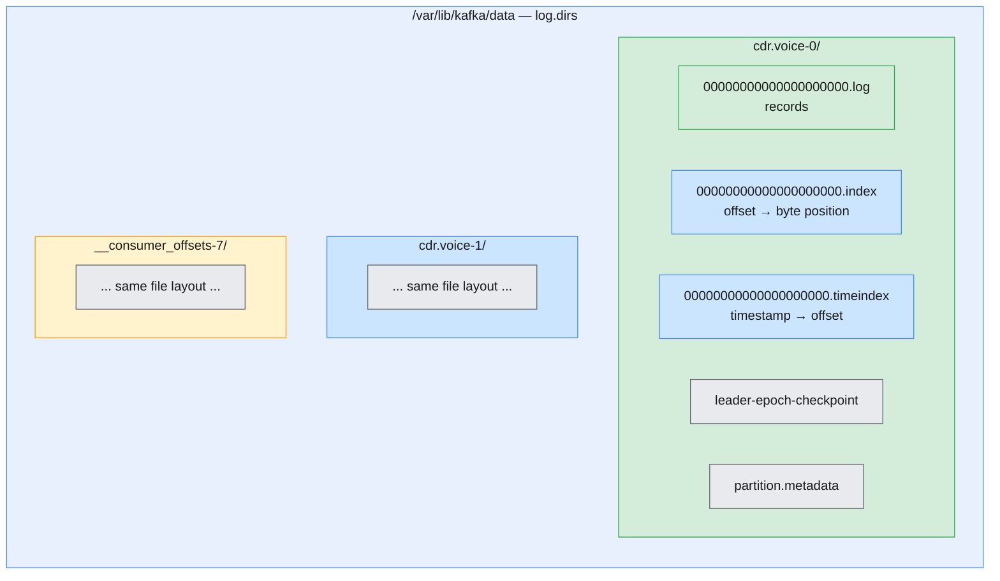

| File | Purpose |
| ---- | ------- |
| `*.log` | Record batches. The file name is the segment's **base offset** |
| `*.index` | Sparse offset → byte-position map for fast seeks |
| `*.timeindex` | Sparse timestamp → offset map, used by time-based lookups and retention |
| `leader-epoch-checkpoint` | Leader history, used to truncate correctly after leader changes |
| `partition.metadata` | The partition's topic ID |

> If you did **Module 1 Lab 03** (Part 2), you have already opened these files
> with `kafka-dump-log.sh`. This module adds the operational side: how they
> roll, how they are recovered, and how they are deleted.

### 3.2 Segment rolling

Only the newest segment — the **active segment** — accepts appends. It is
"sealed" (rolled) when any roll trigger fires, and from that moment retention
and compaction are allowed to act on it.

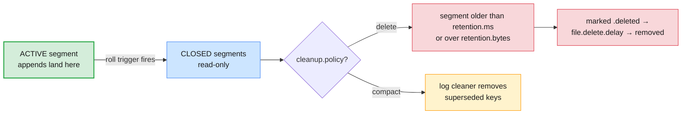

| Roll trigger | Broker property | Topic property | Default |
| ------------ | --------------- | -------------- | ------- |
| Segment size reached | `log.segment.bytes` | `segment.bytes` | 1 GiB |
| Segment age reached | `log.roll.ms` / `log.roll.hours` | `segment.ms` | 7 days |
| Index file full | `log.index.size.max.bytes` | `segment.index.bytes` | 10 MiB |
| Randomised roll spread | `log.roll.jitter.ms` | `segment.jitter.ms` | 0 |

> **Why the active segment matters to you:** retention and compaction **never**
> touch the active segment. A low-traffic topic can keep a segment open for
> days or weeks, so "retention.ms is 1 day but I still see month-old data" is
> almost always an active segment that has not rolled. Lower `segment.ms`
> (time) or `segment.bytes` (size) on such topics if deletion precision
> matters — at the cost of more, smaller files.

Roll jitter exists for a subtle reason worth knowing: without it, topics that
were created together with the same `segment.ms` roll at the same instant,
creating periodic write bursts. Leave it at 0 unless you have measured a
thundering-herd pattern.

### 3.3 Indexes, checkpoints and recovery

- `log.index.interval.bytes` (default 4096) controls how dense the offset
  index is. Smaller values make seeks faster at the cost of larger index
  files; the default is right for almost everyone.
- Index files for the **active** segment are pre-allocated (10 MiB by default)
  and trimmed when the segment closes. Seeing a 10 MB `.index` for a small
  active segment is normal — it is not leaked space.
- On an **unclean shutdown**, a broker replays the tail of each log on
  startup, rebuilding indexes and truncating any uncommitted data. The
  `leader-epoch-checkpoint` file tells it where the safe truncation point is;
  the presence of a **clean shutdown file** lets a cleanly stopped broker
  skip most of this work.
- `num.recovery.threads.per.data.dir` (default 1) controls recovery
  parallelism. On a broker with many partitions, raising this shortens
  restart time — one of the simplest availability wins in Kafka.

### 3.4 JBOD: multiple log directories per broker

`log.dirs` accepts a comma-separated list. Kafka then treats the disks as
**JBOD** ("Just a Bunch Of Disks"): replicas are distributed across the
directories, and the broker uses the aggregate capacity and I/O of all of
them.

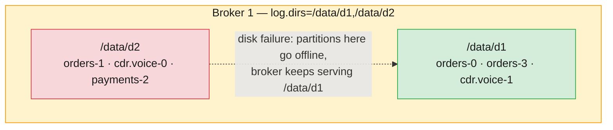

| JBOD behaviour | Detail |
| -------------- | ------ |
| **Placement** | New partitions go to the log directory with the **fewest partitions** |
| **No rebalancing** | Adding a disk does not move existing data; Kafka has no built-in partition-to-disk reassignment |
| **Disk failure** | Since [KIP-112](https://cwiki.apache.org/confluence/display/KAFKA/KIP-112%3A+Handle+disk+failure+for+JBOD), only the partitions on the failed disk go offline; the broker keeps serving the other disks |
| **Recovery** | Partitions on the failed disk must be repaired by reassigning replicas to healthy brokers (Module 5), then moving them back |
| **Monitoring** | Watch the `OfflineLogDirectoryCount` metric; a non-zero value means a disk is down |
| **Tiered storage** | Confluent Tiered Storage **does not support JBOD** — it requires a single log directory |

> **Planning note:** because Kafka never rebalances partitions between disks,
> `log.dirs` should be chosen at install time with growth in mind. If you add
> a disk later, new topics will land there, but the old disks stay hot until
> you deliberately reassign partitions between brokers (Module 5).

---

## 4. Topic-level configuration overrides

### 4.1 Why topic overrides exist

One cluster serves many kinds of data. A `cdr.voice` topic carrying millions
of call records per day should keep data for 7 days; a `subscriber.plan`
topic that holds the *current* plan of every subscriber must keep the latest
record per key forever; an audit topic may need 90 days for compliance. Broker
defaults are a **cluster-wide baseline**; topic overrides express the
**per-topic contract**.

| Workload class | Typical overrides | Why |
| -------------- | ----------------- | --- |
| High-volume events (CDRs, telemetry) | `retention.ms`, `segment.bytes`, `compression.type` | Bound disk, speed up writes |
| State/changelog topics | `cleanup.policy=compact` | Keep the latest value per key |
| Audit / compliance | `retention.ms` long, `min.insync.replicas=2` | Legal retention + durability |
| Command/integration topics | `cleanup.policy=delete`, modest retention | Short-lived request/response traffic |
| Large-payload topics | `max.message.bytes` (with broker fetch sizes raised) | Allow bigger records |

### 4.2 Setting and inspecting overrides

Overrides can be set at creation or changed later; both write **dynamic topic
configs**, applied without a restart. Module 2 §8 showed `--config` on
`kafka-topics.sh`; the dedicated tool is `kafka-configs.sh`:

```bash
# Create-time overrides
kafka-topics.sh --bootstrap-server $BS --create \
  --topic cdr.voice --partitions 6 --replication-factor 3 \
  --config retention.ms=604800000 \
  --config segment.bytes=268435456 \
  --config min.insync.replicas=2

# Change one value later — no restart, no topic downtime
kafka-configs.sh --bootstrap-server $BS --alter \
  --entity-type topics --entity-name cdr.voice \
  --add-config retention.ms=86400000

# Remove an override and fall back to the broker default
kafka-configs.sh --bootstrap-server $BS --alter \
  --entity-type topics --entity-name cdr.voice \
  --delete-config retention.ms

# See every effective value and its source
kafka-configs.sh --bootstrap-server $BS --describe \
  --entity-type topics --entity-name cdr.voice
```

A describe output with synonyms reads like a paper trail:

```
Dynamic configs for topic cdr.voice are:
  retention.ms=86400000 sensitive=false synonyms={DYNAMIC_TOPIC_CONFIG:retention.ms=86400000, DYNAMIC_DEFAULT_BROKER_CONFIG:log.retention.ms=604800000, STATIC_BROKER_CONFIG:log.retention.hours=168, DEFAULT_CONFIG:retention.ms=604800000}
  segment.bytes=268435456 sensitive=false synonyms={DYNAMIC_TOPIC_CONFIG:segment.bytes=268435456, DEFAULT_CONFIG:segment.bytes=1073741824}
  min.insync.replicas=2 sensitive=false synonyms={DYNAMIC_TOPIC_CONFIG:min.insync.replicas=2, DEFAULT_CONFIG:min.insync.replicas=1}
```

> ⚠️ **Exact-name trap.** Topic-level properties never carry the `log.` prefix.
> At topic level it is `retention.ms`, `segment.bytes`, `cleanup.policy`;
> `log.retention.ms` only exists at broker level. Passing the broker name to
> `--entity-type topics` fails with `InvalidConfigException` — or worse, a
> typo that Kafka accepts as a harmless unknown-of-unknown is rejected, so
> **always confirm with `--describe`** that the value actually landed.

### 4.3 How a config change propagates in KRaft

There is no ZooKeeper and no broker restart. The change is an **event in the
metadata log** — exactly the mechanism you saw in Module 1 Lab 03 Part 5.

```mermaid
sequenceDiagram
    participant Admin as kafka-configs.sh
    participant Ctrl as Active controller
    participant Meta as __cluster_metadata
    participant B1 as Broker 1
    participant B2 as Broker 2
    Admin->>Ctrl: AlterConfigs(topics, cdr.voice, retention.ms)
    Ctrl->>Meta: CONFIG_RECORD (retention.ms=86400000)
    Ctrl-->>Admin: success
    B1->>Meta: fetch
    B2->>Meta: fetch
    Note over B1,B2: caches updated; next produce/fetch uses the new value
    Note over Admin,B2: same value on every broker — no rolling restart
```

Descriptions and partition state come from the same metadata log, which is
why `kafka-topics.sh --describe` and `kafka-configs.sh --describe` reflect the
change immediately.

### 4.4 The topic-configuration playbook

Decide the values **per topic class**, write them into the topic-creation
pipeline (Module 2's Spring Boot `KafkaTopicsConfig` is a good place), and
treat ad-hoc changes as incidents with an owner.

| Config | Recommendation | Rationale |
| ------ | -------------- | --------- |
| `cleanup.policy` | `delete` for events, `compact` for state | The topic's meaning decides |
| `retention.ms` | Cover worst-case consumer outage + margin | Retention does not wait for consumers (§5) |
| `retention.bytes` | Set when volume is unpredictable | Bounds per-partition disk per topic |
| `segment.ms` / `segment.bytes` | Defaults for busy topics; lower on low-traffic topics needing precise expiry | Deletion works on whole segments |
| `min.insync.replicas` | `2` for anything that must not lose data | Only meaningful with `acks=all` (§6) |
| `compression.type` | Producer-side (`zstd` or `lz4`); leave broker as `producer` | Avoid broker recompression CPU (§7.2) |
| `max.message.bytes` | Raise only together with broker fetch sizes | Otherwise ISR churn |
| `message.timestamp.type` | `CreateTime` (default); `LogAppendTime` if event time is untrusted | Retention is based on timestamps (§5.1) |

> **Administrator takeaway:** topic configs are the durable record of intent.
> If a topic matters to the business, its retention and durability settings
> should be reviewable in one command — `kafka-configs.sh --describe` — not
> discovered after an incident.

---

## 5. Retention and cleanup policies: delete vs. compact

Module 1 §7 introduced the two cleanup policies conceptually. This section is
the operational deep-dive: **when exactly** segments die, which knob decides,
and what to watch out for.

### 5.1 How deletion actually happens

The retention loop on each broker periodically checks every partition. A
closed segment is deleted when it breaches **either** the time limit **or**
the size limit; the active segment is never a candidate.

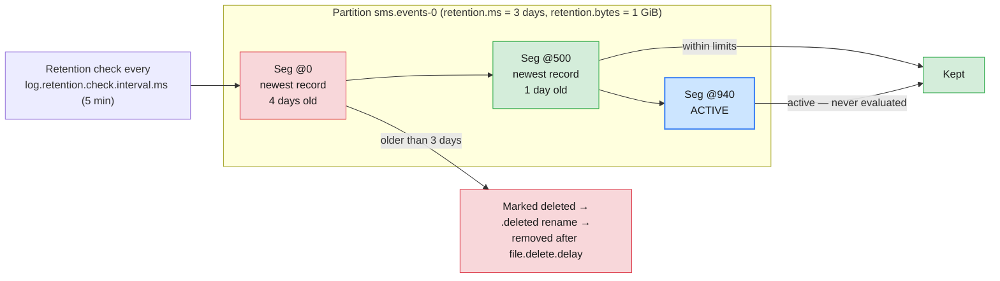

Key details that are easy to get wrong:

- **Age is based on the newest record in the segment** — one old record at
  the start of a segment does not expire it; one *new* record keeps the whole
  segment alive.
- With `message.timestamp.type=CreateTime` (the default), the producer's
  timestamp counts. Replaying historical data with old timestamps can make
  segments immediately eligible for deletion; use `LogAppendTime` when the
  broker should stamp time itself.
- Deletion removes **whole segments**. Precision is therefore a function of
  segment size and roll frequency (§3.2), not of `retention.ms` alone.
- The **log start offset moves forward** as segments are deleted. Offsets are
  never reused. A consumer whose committed offset is now before the log start
  offset gets an out-of-range error and falls back to `auto.offset.reset`
  (Module 1 §6.2).

### 5.2 Time-based retention

The most common configuration. It can be set at any layer; the effective
value follows the precedence chain from §2.1.

| Scope | Property | Example | Default |
| ----- | -------- | ------- | ------- |
| Topic | `retention.ms` | `86400000` (1 day) | Falls through to broker |
| Broker (dynamic) | `log.retention.ms` | `259200000` (3 days) | Falls through |
| Broker (static) | `log.retention.hours` / `.minutes` | `168` (7 days) | 7 days |
| Special value | `-1` | Never delete by age | — |

```bash
# 30 days of retention for an audit topic
kafka-configs.sh --bootstrap-server $BS --alter \
  --entity-type topics --entity-name audit.events \
  --add-config retention.ms=2592000000

# Confirm the effective value and its source
kafka-configs.sh --bootstrap-server $BS --describe \
  --entity-type topics --entity-name audit.events
```

> **Production baseline:** most event topics run with **3–7 days** of
> retention; compliance topics get explicit, documented values. Whatever the
> number, it must exceed your **worst-case consumer outage** — a group that
> is down longer than `retention.ms` will miss data permanently (this is one
> of the message-loss scenarios in Module 9).

### 5.3 Size-based retention

`retention.bytes` caps disk usage **per partition** — not per topic, not per
broker. Kafka deletes the oldest closed segments until the partition is under
the limit. When both time and size limits are set, **whichever is breached
first wins**.

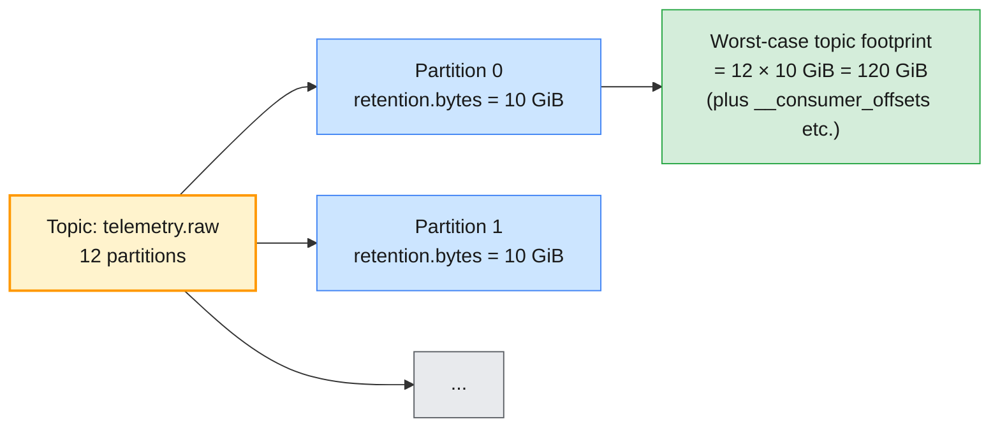

```bash
# Cap each partition at 10 GiB, keeping at most 7 days
kafka-configs.sh --bootstrap-server $BS --alter \
  --entity-type topics --entity-name telemetry.raw \
  --add-config retention.bytes=10737418240
```

| Trap | Why it bites |
| ---- | ------------ |
| Reading `retention.bytes` as a **topic** limit | It is per partition. Multiply by partition count when sizing disks |
| Expecting smooth deletion | Orders of magnitude are removed in whole-segment chunks, so usage drops in steps |
| Forgetting compaction topics | A compacted topic's size is driven by key count and dirty ratio, not retention alone (§5.5) |

### 5.4 The delete lifecycle in detail

Deletion is not one step. Between the decision and the disk space coming back,
several configured delays apply — useful to know when watching a disk fill up:

| Stage | Config | Default | Meaning |
| ----- | ------ | ------- | ------- |
| Evaluation | `log.retention.check.interval.ms` | 5 min | How often the broker looks for expired segments |
| Decision | `retention.ms` / `retention.bytes` | 7 days / unlimited | The threshold itself |
| Rename | — | — | Segment files are renamed `*.deleted` |
| Removal | `log.segment.delete.delay.ms` (`file.delete.delay.ms` at topic level) | 60 s | Delay before files are unlinked — files can still be recovered if retention is extended in the gap |

> **Administrator takeaway:** when a disk alert fires, do the arithmetic
> top-down: which topic consumes the most space (`kafka-log-dirs.sh`,
> §7.1) → what is its retention configuration → is its oldest closed segment
> old enough → is it an active-segment problem? This sequence resolves most
> "retention is broken" tickets.

### 5.5 Compaction: keeping the latest value per key

With `cleanup.policy=compact`, the **log cleaner** rewrites logs so that only
the latest record per key survives. Older values for the same key are
discarded; offsets are preserved (gaps remain), and order is preserved for
surviving records. Module 1 §7.3 covers the concept; here is the machinery.

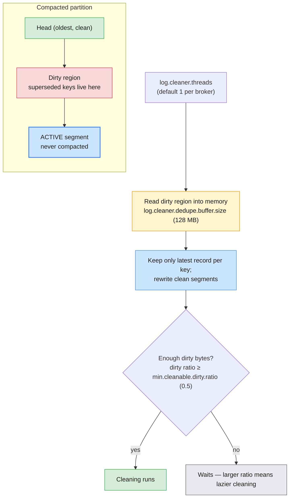

| Compaction config | Broker name | Topic name | Default | Effect |
| ----------------- | ----------- | ---------- | ------- | ------ |
| Cleanup policy | `log.cleanup.policy` | `cleanup.policy` | `delete` | `compact` enables the cleaner for the topic |
| Dirty ratio | `log.cleaner.min.cleanable.ratio` | `min.cleanable.dirty.ratio` | `0.5` | Trigger threshold — lower = more aggressive |
| Tombstone retention | `log.cleaner.delete.retention.ms` | `delete.retention.ms` | 24 h | How long `key=null` tombstones stay visible |
| Minimum lag | `log.cleaner.min.compaction.lag.ms` | `min.compaction.lag.ms` | `0` | Protect recent records from compaction |
| Maximum lag | `log.cleaner.max.compaction.lag.ms` | `max.compaction.lag.ms` | unlimited | Force compaction after this time |
| Cleaner threads | `log.cleaner.threads` | — | 1 | Parallelism per broker |

- **Keys are mandatory in practice.** Records without a key can never be
  deduplicated, so they accumulate forever in an otherwise-compacted topic.
- **Tombstones cost space** until `delete.retention.ms` passes — a deleted
  entity is represented by a `null` value for one full tombstone lifetime so
  that every consumer (including lagging ones) learns about the deletion.
- **Compaction is lazy and not guaranteed to run on a schedule.** If you need
  a bound on how long old values linger, set `max.compaction.lag.ms`.
- **The cleaner needs room to work:** it rewrites segments, temporarily using
  extra disk, and on a busy broker one cleaner thread may fall behind — check
  the cleaner metrics in Module 8.

### 5.6 Choosing a cleanup policy

| | `delete` | `compact` | `compact,delete` |
| --- | --- | --- | --- |
| **Keeps** | Everything within the time/size window | Latest record per key (indefinitely) | Latest per key, expiring past `retention.ms` |
| **Keys required** | No | Effectively yes | Effectively yes |
| **Disk behaviour** | Predictable, segment-granular | Driven by key count and dirty ratio | Bounded state with a time horizon |
| **Consumers see** | An event history | A replayable "table" of current state | A windowed table |
| **Telecom example** | `cdr.voice`, `sms.events` | `subscriber.plan`, `device.config` | `tariff.changes` (latest per MSISDN, 30 days) |

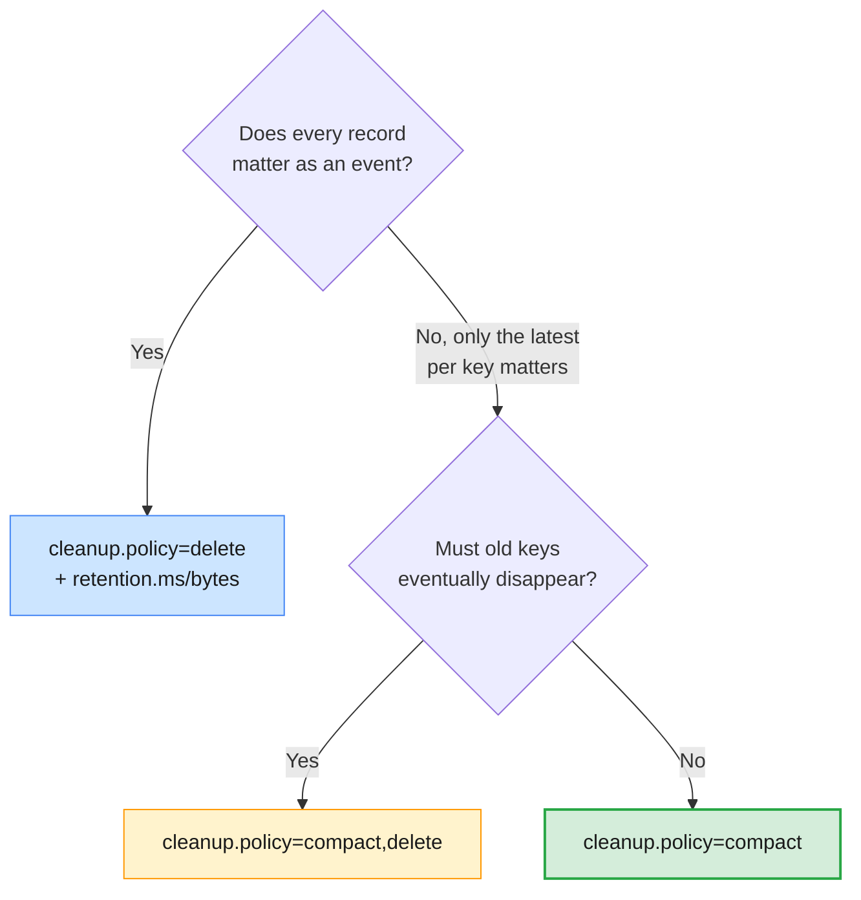

> **The cardinal rule, restated because it causes real data loss:** retention
> is **independent of consumption**. Kafka deletes old data whether or not
> any consumer has read it. If a downstream batch job runs weekly, its
> topics need more than a week of retention plus margin. Direct consumers to
> Module 9 for the full message-loss playbook.

---

## 6. min.insync.replicas and acknowledgments (acks)

### 6.1 The durability contract

Module 1 §6.4 introduced `acks` and `min.insync.replicas` as the durability
baseline. This section makes you fluent in what happens in **failure** —
which is the only time they matter.

The contract has two sides:

- **Producer side (`acks`)** — when the client counts a write as successful.
- **Broker side (`min.insync.replicas`)** — how many in-sync replicas must
  exist for an `acks=all` write to be accepted at all.

### 6.2 How an acks=all write succeeds

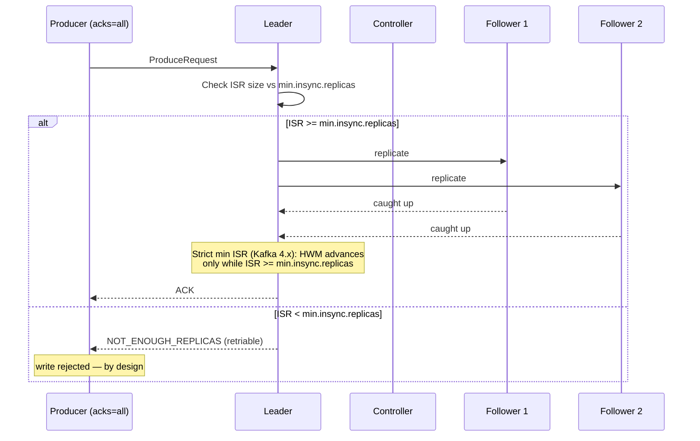

Two Kafka 4.x behaviours worth writing down:

- The **strict min ISR rule** ([KIP-966](https://cwiki.apache.org/confluence/display/KAFKA/KIP-966%3A+Eligible+Leader+Replicas))
  is in force: when the ISR drops below `min.insync.replicas`, the high
  watermark **stops advancing**. Even `acks=0/1` records written during that
  window are not visible to consumers until replication recovers — and would
  be lost if the unlucky replica were promoted.
- Recent 4.x versions (4.1 and later by default) also track **Eligible Leader
  Replicas (ELR)** — replicas that are out of ISR but known to contain
  committed data — so controller elections can avoid the "last replica
  standing" data-loss corner case. You may see an `Elr` column in
  `kafka-topics.sh --describe` on 4.x clusters.

### 6.3 The settings

| Setting | Scope | Default | Values / meaning |
| ------- | ----- | ------- | ---------------- |
| `acks` | Producer | `all` (since Kafka 3.0) | `0`, `1`, `all` |
| `min.insync.replicas` | Broker or topic | **`1`** | Minimum ISR size for `acks=all` writes |
| `unclean.leader.election.enable` | Broker or topic | `false` | Allow out-of-sync replicas to be elected leader |
| `enable.idempotence` | Producer | `true` (since 3.0) | Discards duplicates from retries (Module 4) |

```bash
# Raise the durability floor for one topic
kafka-configs.sh --bootstrap-server $BS --alter \
  --entity-type topics --entity-name payments.events \
  --add-config min.insync.replicas=2

# Or raise the cluster-wide default (broker default of 1 is a known footgun)
kafka-configs.sh --bootstrap-server $BS --alter \
  --entity-type brokers --entity-default \
  --add-config min.insync.replicas=2
```

> ⚠️ **`acks` defaults differ between producers and CLI demos.** Since
> Kafka 3.0 the Java producer defaults to `acks=all`; older console-producer
> examples and many tutorials still assume `acks=1`. When testing durability,
> set `--producer-property acks=...` explicitly so you know which contract
> you are demonstrating.

### 6.4 Durability scenarios: killing brokers on paper

For a topic with **RF = 3, `min.insync.replicas = 2`**, an `acks=all`
producer, and a healthy ISR of `[1,2,3]`:

| Scenario | ISR | `acks=all` write | `acks=1` write | What can be lost |
| -------- | --- | ---------------- | -------------- | ----------------- |
| All brokers up | 3 | ✅ Accepted | ✅ Accepted | Nothing |
| One broker down | 2 | ✅ Accepted (tolerates 1 failure) | ✅ Accepted | Nothing yet |
| Two brokers down | 1 | ❌ `NOT_ENOUGH_REPLICAS` — cluster refuses | ✅ Accepted locally, but **not visible** until ISR recovers | Everything written at `acks=1` if the last replica dies |
| Two down, unclean election enabled | 1 → out-of-sync promoted | n/a | n/a | Acknowledged data can silently disappear |

Three rules extracted from the table:

1. **`acks=all` is only as strong as `min.insync.replicas`.** With the
   default of 1, `acks=all` can be acknowledged by a single replica — the
   "last replica standing" problem. Always pair them.
2. **`min.insync.replicas` does nothing for `acks=0` or `acks=1`.** The
   broker only consults it for `acks=all` writes. A producer using `acks=1`
   on a "durable" topic defeats the entire design.
3. **`unclean.leader.election.enable=true` trades correctness for
   availability.** It lets an out-of-sync replica become leader, which
   *can* lose acknowledged data. Keep it `false` for anything that matters
   and accept a short unavailability instead.

> **The production baseline:** **RF = 3, `min.insync.replicas = 2` on the
> topic, `acks = all`, idempotence on.** For multi-AZ clusters, combine with
> `broker.rack` so replicas land in different failure domains (Module 5).
> This is the combination the hands-on lab proves under failure.

### 6.5 Choosing settings per topic class

| Topic class | `acks` | `min.insync.replicas` | Notes |
| ----------- | ------ | --------------------- | ----- |
| Metrics / debug telemetry | `1` | `1` | Losing a few points is acceptable; latency matters |
| Application logs | `1` | `1` | Same; keep `unclean.leader.election.enable=false` |
| Standard business events | `all` | `2` | The default posture for the course |
| Billing / CDR / financial | `all` | `2` (on topic) | Plus idempotence, retries and alerting (Module 9) |
| State/changelog topics | `all` | `2` | Losing a state update corrupts derived state |

> **Administrator takeaway:** durability is a **per-topic decision recorded
> in configuration**, not a client habit. Bake `min.insync.replicas=2` into
> your topic-creation templates and let producers opt *down* explicitly when
> they can tolerate loss.

---

## 7. Storage optimization techniques

### 7.1 Measure first

Optimization without measurement is guessing. Three commands answer most
storage questions:

```bash
# 1. Per-partition sizes across log directories (JSON — pipe to jq)
kafka-log-dirs.sh --bootstrap-server $BS --describe --topic-list cdr.voice

# 2. Effective retention/cleanup settings for a topic
kafka-configs.sh --bootstrap-server $BS --describe \
  --entity-type topics --entity-name cdr.voice

# 3. Inspect actual segment files on the broker
ls -lh /var/lib/kafka/data/cdr.voice-0/
```

| What you see | What it suggests |
| ------------ | ---------------- |
| Thousands of tiny `.log` files | `segment.ms`/`segment.bytes` too small (or a low-traffic topic needs a larger roll interval) |
| One huge active segment on a low-traffic topic | Retention cannot act; lower `segment.ms` (§3.2) |
| Disk full on one broker but not others | Partition/leadership imbalance — capacity planning, Module 5 |
| Topic with retention but no sibling data growth | Fine — check consumer lag instead (Module 8) |
| Compacted topic that keeps growing | Keyless records or dirty ratio too high (§5.5) |

### 7.2 Compression

Compression is the single highest-leverage storage knob: it shrinks both
broker disk and network replication traffic. Records are written in the v2
batch format — Kafka 4.0 **removed** the legacy v0/v1 formats entirely — and
compression applies to the **whole batch**, so compression efficiency
improves automatically as batches get bigger.

| Codec | Ratio | CPU cost | Typical use |
| ----- | ----- | -------- | ----------- |
| `none` | 1× | None | Almost never in production |
| `lz4` | Moderate | Very low | Latency-sensitive topics |
| `snappy` | Moderate | Low | Legacy default in many shops |
| `gzip` | High | High | Archival; rarely worth the CPU today |
| `zstd` | High | Moderate | The modern default recommendation for most topics |

```bash
# Producer-side (preferred): the client compresses, broker stores as-is
kafka-console-producer.sh --bootstrap-server $BS --topic cdr.voice \
  --producer-property compression.type=zstd

# Topic-level default: brokers do NOT recompress when compression.type=producer
kafka-configs.sh --bootstrap-server $BS --alter \
  --entity-type topics --entity-name cdr.voice \
  --add-config compression.type=producer
```

> ⚠️ **Never set the topic's `compression.type` to a codec unless you mean
> it.** A topic-level `compression.type=gzip` tells brokers to
> **decompress and recompress** every batch that arrives with a different
> codec — a large CPU tax on the data path. Set the codec in producers, or
> via a cluster-wide dynamic default that matches the producer codec.

### 7.3 Batching

Kafka's storage efficiency is inseparable from batching. Each record batch
shares an offset, timestamp, header and CRC overhead, and is the unit of
compression and replication. Tuning `batch.size` and `linger.ms` to
accumulate real batches (rather than 1-record batches) multiplies the effect
of compression and reduces index and disk overhead. The trade-off — a little
latency for a lot of throughput and space — is producer tuning territory
(Module 4).

### 7.4 Segment sizing

Segment size is the main trade-off between **operational precision** and
**file overhead**:

| Situation | Recommendation | Why |
| --------- | -------------- | --- |
| High-volume topics (CDRs, telemetry) | Keep the 1 GiB default | Fewer files, fewer open handles, efficient sequential I/O |
| Low-volume topics with tight retention | Lower `segment.ms` (hours/days) and/or `segment.bytes` (e.g. 128–256 MiB) | Make segments roll so retention can act |
| Compacted topics | A moderate `segment.ms` (hours) | Only closed segments can be cleaned; the cleaner must be able to keep up |
| Very short-lived topics (dev/test) | Can go small, but never in production | Thousands of files degrade startup and file-handle counts |

### 7.5 Compaction tuning as space reclaim

For state topics, space is governed by the cleaner, not retention:

- Lower `min.cleanable.dirty.ratio` (e.g. `0.2`) to clean sooner and reclaim
  space faster, at the cost of more cleaner I/O.
- Set `max.compaction.lag.ms` to bound how long superseded values linger if
  the dirty ratio is rarely reached.
- Remember the tombstone window: `delete.retention.ms` (24 h default) is dead
  weight by design.
- If one cleaner thread cannot keep up with many compacted partitions, raise
  `log.cleaner.threads` (dynamic) and watch cleaner metrics in Module 8.

### 7.6 Tiered storage: cold data out of the broker

**Tiered storage** separates *how long data must exist* from *how much data
sits on broker disks*: closed segments are uploaded to object storage (S3 and
compatible systems), and only a small **local** window stays on the brokers.

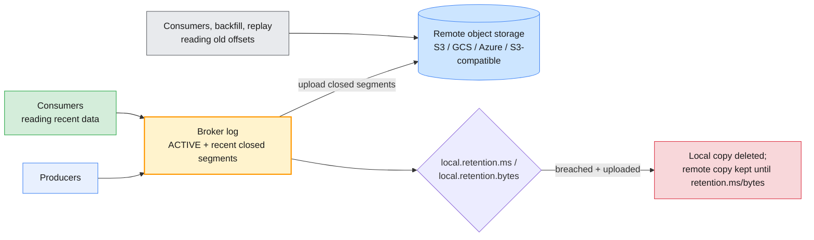

Apache Kafka's implementation ([KIP-405](https://cwiki.apache.org/confluence/display/KAFKA/KIP-405%3A+Kafka+Tiered+Storage))
is production-ready since 3.9:

| Layer | Setting | Meaning |
| ----- | ------- | ------- |
| Broker | `remote.log.storage.system.enable=true` | Turns on tiered storage services on the broker |
| Broker | `remote.log.storage.manager.class.name` (+ classpath) | Plugs in the `RemoteStorageManager` implementation |
| Topic | `remote.storage.enable=true` | Opt this topic in |
| Topic | `local.retention.ms` / `local.retention.bytes` | How long the **local** copy survives after upload |
| Topic | `retention.ms` / `retention.bytes` | How long the **remote** copy survives |

```bash
# Opt a topic into tiered storage (broker side already enabled by the operator)
kafka-topics.sh --bootstrap-server $BS --create \
  --topic cdr.archive --partitions 6 --replication-factor 3 \
  --config remote.storage.enable=true \
  --config local.retention.ms=86400000 \
  --config retention.ms=31536000000
```

> **Confluent note, for Modules 6–10:** Confluent ships its **own** Tiered
> Storage implementation (`confluent.tier.*` broker settings such as
> `confluent.tier.feature=true` and backend/bucket configuration), which is
> **not** the same feature as Apache's KIP-405. It does not support JBOD.
> See the Confluent Tiered Storage documentation for the exact properties.

### 7.7 The optimization checklist

| Technique | Saves | Costs | Use when |
| --------- | ----- | ----- | -------- |
| **Compression** (`zstd`/`lz4` at producer) | 40–80 % typical disk/network | Small client CPU | Always, for text/JSON payloads |
| **Batching** (`linger.ms`, `batch.size`) | Overhead per record | Slightly higher latency | Throughput-sensitive producers |
| **Segment sizing** (tuned per topic) | File-handle pressure, deletion precision | Managerial attention | Low-volume or precision-retention topics |
| **Compaction tuning** (dirty ratio, lag) | Steady-state size of state topics | Extra cleaner I/O | State/changelog topics |
| **Tiered storage** | Broker disk at long retention | Object-store dependency, config complexity | Audit/compliance retention, replay-heavy workloads |
| **JBOD** | Capacity and I/O from existing disks | No disk-to-disk rebalancing; failure scope | Physical hosts with multiple empty disks |
| **Page-cache-friendly broker** (small heap, lots of RAM) | Disk reads almost eliminated | RAM budget | Everywhere (Module 2 §2.1) |
| **Consumer-side housekeeping** | Nothing on the broker | Discipline | Never treat Kafka as the only archive; export to a DWH |

> **The one habit that prevents storage incidents:** alert on **disk usage
> trend per broker** and **log-start-offset movement per critical topic**,
> not on static thresholds alone. A 70 %-full disk that grows 5 % per day is
> a two-week outage in progress; a 90 %-full disk with flat retention is
> normal. Monitoring mechanics live in Module 8.

---

## 8. Hands-on lab: retention, replication and durability

> **Runtime companion:** the module's hands-on exercises run against the
> **shared Apache Kafka cluster on AWS** (retention and replication), with the
> broker-failure half of the durability test on your **local Module 2
> cluster**, where breaking a broker affects nobody else. This section
> mirrors that flow end to end.

### 8.1 Part A — Retention and replication on the shared cluster

Every learner has a prefix (`lNN`, e.g. `l07`) and a prepared client config
(`~/kafka/apache.properties`) with the cluster's SASL credentials
(`infra/LAB-SETUP.md`). Admin commands take `--command-config`; console
clients take `--producer.config` / `--consumer.config`.

```bash
# (VM) — coordinates for the shared cluster
APACHE=apache-kafka.lab.internal:9092
CFG=~/kafka/apache.properties
ME=lNN                     # your learner prefix: l01 … l18

# 1. Create a topic whose storage and durability are designed, not defaulted
kafka-topics.sh --bootstrap-server $APACHE --command-config $CFG --create \
  --topic $ME.cdr.voice \
  --partitions 6 --replication-factor 3 \
  --config retention.ms=604800000 \
  --config segment.bytes=268435456 \
  --config min.insync.replicas=2 \
  --config cleanup.policy=delete

# 2. See every effective configuration and where it comes from
kafka-configs.sh --bootstrap-server $APACHE --command-config $CFG \
  --describe --entity-type topics --entity-name $ME.cdr.voice

# 3. A comparison topic left entirely on broker defaults
kafka-topics.sh --bootstrap-server $APACHE --command-config $CFG --create \
  --topic $ME.metrics.raw --partitions 3 --replication-factor 3

kafka-configs.sh --bootstrap-server $APACHE --command-config $CFG \
  --describe --entity-type topics --entity-name $ME.metrics.raw

# 4. Shorten retention dynamically — no restart, no topic downtime
kafka-configs.sh --bootstrap-server $APACHE --command-config $CFG --alter \
  --entity-type topics --entity-name $ME.cdr.voice \
  --add-config retention.ms=86400000

# 5. Confirm the new value, then remove the override entirely
kafka-configs.sh --bootstrap-server $APACHE --command-config $CFG \
  --describe --entity-type topics --entity-name $ME.cdr.voice

kafka-configs.sh --bootstrap-server $APACHE --command-config $CFG --alter \
  --entity-type topics --entity-name $ME.cdr.voice \
  --delete-config retention.ms

# 6. Produce with the durable contract, consume as a group
kafka-console-producer.sh --producer.config $CFG --topic $ME.cdr.voice \
  --property parse.key=true --property key.separator=: \
  --producer-property acks=all
#   966500000001:call-start
#   966500000002:call-start
#   966500000001:call-end

kafka-console-consumer.sh --consumer.config $CFG --topic $ME.cdr.voice \
  --group $ME.billing --from-beginning \
  --property print.partition=true --property print.offset=true

# 7. Disk footprint per partition of your topic
kafka-log-dirs.sh --bootstrap-server $APACHE --command-config $CFG \
  --describe --topic-list $ME.cdr.voice
```

| Observation | Concept | Where it's covered |
| ----------- | ------- | ------------------ |
| `--describe` shows the override first, with broker/default as lower synonyms | Config precedence | §2.1, §4.2 |
| `--delete-config` makes the value snap back to the broker default | Overrides are the only thing removed | §4.2 |
| The change applies with no restart and no consumer impact | KRaft dynamic config propagation | §4.3, Module 1 §8.2 |
| `kafka-log-dirs.sh` size differs per partition | Partition placement and skew | §3.4, §7.1 |
| `min.insync.replicas=2` appears in `--describe` for your topic | Durability contract persisted per topic | §6.3 |

### 8.2 Part B — Durability under different acks (local cluster)

On the shared cluster you cannot kill brokers; on your own Module 2 cluster
you can. Three terminals: one inside the container, one on the host for
compose commands, one spare.

```bash
# (host) from labs/module-02 — 3-node KRaft cluster
docker compose up -d
docker exec -it kafka-1 bash        # all commands below run here

BS=kafka-1:29092,kafka-2:29092,kafka-3:29092   # preset in the container
ME=lNN

# 1. A topic built for durability: 3 copies, at least 2 in sync to accept writes
kafka-topics.sh --bootstrap-server $BS --create \
  --topic $ME.durability.test \
  --partitions 1 --replication-factor 3 \
  --config min.insync.replicas=2

# 2. Produce with acks=all (leave this terminal open; type lines as you go)
kafka-console-producer.sh --bootstrap-server $BS \
  --topic $ME.durability.test --producer-property acks=all
#   before-failure-1
#   before-failure-2

# 3. (host terminal) stop one broker — the controller quorum survives (2 of 3)
docker compose stop kafka-2

# 4. (container) the partition's leader has moved; ISR now has 2 members
kafka-topics.sh --bootstrap-server $BS --describe --topic $ME.durability.test

# 5. (container) acks=all still succeeds: ISR=2 >= min.insync.replicas=2
#    ... type more lines into the open producer ...

# 6. (container) raise the bar while the broker is down — dynamic, instant
kafka-configs.sh --bootstrap-server $BS --alter \
  --entity-type topics --entity-name $ME.durability.test \
  --add-config min.insync.replicas=3

# 7. (container) now acks=all is REJECTED: NotEnoughReplicas / NOT_ENOUGH_REPLICAS
#    Start a fresh producer to watch the error (the step-2 producer also starts
#    failing). Ctrl+C when you have seen it.
kafka-console-producer.sh --bootstrap-server $BS \
  --topic $ME.durability.test --producer-property acks=all
#   rejected-1

# 8. (container) acks=1 "succeeds" — but the cluster is protecting you from it:
kafka-console-producer.sh --bootstrap-server $BS \
  --topic $ME.durability.test --producer-property acks=1
#   unreliable-1

# 9. (container) consume from the beginning in a NEW group:
#    the acks=1 record is NOT visible — the strict min ISR rule
#    (Kafka 4.x) holds the high watermark until ISR >= min.insync.replicas
kafka-console-consumer.sh --bootstrap-server $BS \
  --topic $ME.durability.test --group $ME.misr-check \
  --from-beginning --timeout-ms 5000

# 10. (container) restore the topic's durability setting
kafka-configs.sh --bootstrap-server $BS --alter \
  --entity-type topics --entity-name $ME.durability.test \
  --add-config min.insync.replicas=2

# 11. (host) bring the broker back; (container) watch ISR recover to 3
docker compose start kafka-2
kafka-topics.sh --bootstrap-server $BS --describe --topic $ME.durability.test

# 12. (container) consume again — once min.insync.replicas is back at 2 (and
#     the broker returns), the high watermark advances and the acks=1 record
#     becomes visible
kafka-console-consumer.sh --bootstrap-server $BS \
  --topic $ME.durability.test --group $ME.misr-check-2 \
  --from-beginning --timeout-ms 5000
```

> **Why change `min.insync.replicas` instead of killing two brokers?** On a
> combined broker+controller laptop cluster, stopping two of three nodes
> breaks the controller **quorum** as well as the ISR. Raising the minimum
> while one broker is down exercises the exact same write-rejection path and
> lets you watch dynamic config take effect — a double lesson.

### 8.3 Part C — Segments and log directories on disk

```bash
# (container) the partition directory named <topic>-<partition>
ls -lh /var/lib/kafka/data/$ME.durability.test-0/

# Per-partition sizes for your topic, as JSON (pipe to jq if you like)
kafka-log-dirs.sh --bootstrap-server $BS --describe \
  --topic-list $ME.durability.test

# Optional: decode the segment you just wrote (format recap from Module 1 Lab 03)
kafka-dump-log.sh --print-data-log \
  --files /var/lib/kafka/data/$ME.durability.test-0/00000000000000000000.log
```

| Observation | Concept | Where it's covered |
| ----------- | ------- | ------------------ |
| Leader changes and `Isr` shrinks after `docker compose stop` | Leader election from ISR | §6.2, Module 2 §10 |
| `acks=all` rejected only when ISR < `min.insync.replicas` | The durability contract | §6.4 |
| `acks=1` accepted while `acks=all` is rejected | `min.insync.replicas` only gates `acks=all` | §6.4 |
| The `acks=1` record is invisible until ISR recovers | Strict min ISR / high watermark | §6.2, Module 1 §6.2 |
| `--delete-config`/restore returns the topic to the baseline | Dynamic topic overrides | §4.2 |
| Segment file names are base offsets; `.index` pre-allocated at 10 MB | Segment management | §3.1, Module 1 Lab 03 |

Teardown (keep the image):

```bash
# (container)
exit
# (host) from labs/module-02
docker compose down
```

---

## 9. Troubleshooting configuration & storage issues

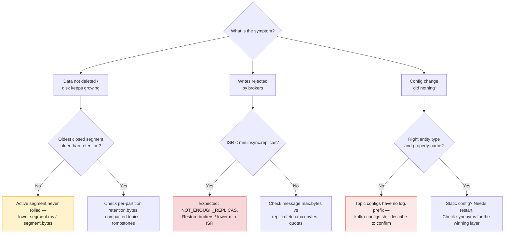

| Symptom | Likely cause | Fix |
| ------- | ------------ | --- |
| Retention ignores old data | Active segment has not rolled (low traffic, default 7-day roll) | Lower `segment.ms` / `segment.bytes` on that topic |
| Disk full on every broker | Retention longer than disk capacity; no `retention.bytes`; no compression | Size retention to disk; set `retention.bytes`; enable compression; consider tiered storage |
| Disk full on one broker | Partition/leadership skew (capacity planning) | Reassign partitions (Module 5); add a broker |
| `NOT_ENOUGH_REPLICAS` on produce | ISR below `min.insync.replicas` | Restore brokers; check for unhealthy disks; reduce min ISR only deliberately |
| Producers "succeed" but consumers see nothing | HWM held by strict min ISR rule, or `read_committed` consumer with no committed transaction | Check ISR vs `min.insync.replicas`; check transactional settings (Module 4) |
| `InvalidConfigException` on alter | Wrong property name/scope (`log.retention.ms` on a topic) | Use `retention.ms` at topic level; confirm with `--describe` |
| Config change appears to do nothing | Change applied at wrong scope; static config awaiting restart; per-broker value shadowed by topic override | Read the `synonyms`; check `--entity-type brokers --entity-name` |
| Compacted topic never shrinks | No keys on records; dirty ratio rarely reached; active segment; cleaner starved | Ensure keys; lower `min.cleanable.dirty.ratio`; set `max.compaction.lag.ms`; raise cleaner threads |
| Broker slow to restart | Log recovery scanning many segments/partitions | Raise `num.recovery.threads.per.data.dir`; reduce segment explosion |
| Consumer suddenly "resets" and skips data | Its committed offset fell before the log start offset (data aged out) | It was offline longer than retention; longer retention or fix the consumer (Module 9) |
| `kafka-log-dirs.sh` output looks wrong | Reading it as one line; it is JSON | Pipe to `jq` or format it |

> **First three commands, every storage incident:** `kafka-log-dirs.sh
> --describe --topic-list <topic>` (size), `kafka-configs.sh --describe
> --entity-type topics --entity-name <topic>` (intent), and
> `kafka-topics.sh --describe --topic <topic>` (ISR/leaders). Together they
> answer "how much, how long, and is anything broken right now".

---

## 10. Bridging to the rest of the course

| Question this module raises | Answered in |
| --------------------------- | ----------- |
| How do `batch.size`, `linger.ms`, `retries` and idempotence interact with `acks`? | Module 4 |
| How do I add brokers, reassign partitions and plan capacity from these numbers? | Module 5 |
| How does Confluent expose all of this (Control Center, Cloud topic configs, tiered storage)? | Module 6 |
| How do I monitor disk trends, ISR and cleaner lag continuously? | Module 8 |
| Why do messages get lost despite retention and `acks=all`? | Module 9 |
| How do I replicate data to another cluster for DR and migration? | Module 10 |

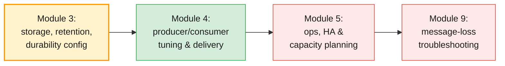

---

## 11. Key takeaways

1. **Every effective setting has a source.** Read the `synonyms` in
   `kafka-configs.sh --describe` — topic override, broker dynamic default,
   static file or built-in — before you change or debug anything.
2. **Static vs dynamic is a scheduling decision.** `log.dirs`, `node.id` and
   roles need a restart; retention, segments, `min.insync.replicas` and most
   storage knobs change live via KRaft metadata events.
3. **A partition is a directory of segments.** Rolling is driven by size,
   time and index limits, and retention/compaction only ever touch **closed**
   segments — the active segment explains most "retention is broken" tickets.
4. **`retention.bytes` is per partition.** Multiply by partition count to get
   the topic's worst-case footprint, and remember time/size limits interact
   with "whichever breaches first".
5. **Compaction keeps the latest value per key.** It needs keys, preserves
   offsets, keeps tombstones for `delete.retention.ms`, and runs lazily based
   on the dirty ratio — bound it with `max.compaction.lag.ms` when needed.
6. **Durability is `acks=all` + `min.insync.replicas=2` + RF=3.** Either
   half alone is a false sense of safety; `min.insync.replicas` only affects
   `acks=all` writes.
7. **Kafka 4.x enforces strict min ISR.** When the ISR drops below
   `min.insync.replicas`, the high watermark stops advancing, so even
   `acks=0/1` data can be invisible until replication recovers — and ELR
   (KIP-966) then protects leader elections.
8. **Compress, batch and size segments deliberately.** Producer-side `zstd`
   or `lz4`, real batches, and segment sizing tuned per topic class deliver
   most of the storage efficiency available.
9. **Tiered storage changes the retention math.** Keep a short local window
   (`local.retention.*`) and long remote retention for replay and
   compliance; note that Confluent's implementation is its own feature.
10. **Retention never waits for consumers.** Size it to survive your
    worst-case consumer outage, and monitor disk **trends**, not just
    thresholds.

---

## 12. Glossary

| Term | Definition |
| ---- | ---------- |
| **Static broker config** | A property set in `server.properties`; changing it needs a broker restart |
| **Dynamic config** | A property changed at runtime via `kafka-configs.sh`; stored in the KRaft metadata log |
| **Cluster-wide default** | A dynamic broker config set with `--entity-default`, used as the default for all topics/brokers |
| **Topic override** | A dynamic topic config that wins over every broker-level value for that topic |
| **Synonym** | The labeled source of an effective config value (`DYNAMIC_TOPIC_CONFIG`, `DEFAULT_CONFIG`, …) |
| **`log.dirs`** | The directory (or directories) where partition data is stored; multiple entries mean JBOD |
| **JBOD** | Using several independent disks as one broker's storage pool, without RAID |
| **Segment** | One file chunk of a partition log (`.log` plus `.index`, `.timeindex`) |
| **Active segment** | The newest segment; the only one written to, never deleted or compacted |
| **Roll** | Closing the active segment and starting a new one (size, time or index trigger) |
| **Base offset** | The offset of the first record in a segment; used as its file name |
| **Log start offset** | The earliest offset still retained on disk; advances as segments are deleted |
| **`retention.ms`** | Time a closed segment survives after its newest record |
| **`retention.bytes`** | Size cap **per partition**; oldest segments are deleted when exceeded |
| **`log.retention.check.interval.ms`** | How often the broker evaluates retention (default 5 min) |
| **`cleanup.policy`** | `delete`, `compact` or `compact,delete` |
| **Log cleaner** | The broker thread(s) that compact logs by removing superseded keys |
| **Tombstone** | A `key=null` record marking a deletion in a compacted topic |
| **`delete.retention.ms`** | How long tombstones remain visible after compaction (default 24 h) |
| **Dirty ratio** | Fraction of a compacted log that is eligible for cleaning; triggers the cleaner |
| **`min.insync.replicas`** | Minimum ISR size required to accept `acks=all` writes (default 1) |
| **Strict min ISR rule** | Kafka 4.x behaviour: the high watermark does not advance while ISR < `min.insync.replicas` |
| **ELR (Eligible Leader Replicas)** | Replicas outside the ISR that still hold committed data and are safe to elect (KIP-966) |
| **`unclean.leader.election.enable`** | Allows out-of-sync replicas to become leader; trades durability for availability |
| **Tiered storage** | Moving closed segments to object storage while keeping a local hot window |
| **`remote.storage.enable`** | Topic-level switch for Apache Kafka tiered storage (KIP-405) |
| **`local.retention.ms`** | How long the local copy survives in a tiered topic after upload |
| **`compression.type`** | Batch compression codec; `producer` means the broker stores batches as sent |

---

## 13. References

**Apache Kafka (official)**

- Broker configuration reference — <https://kafka.apache.org/documentation/#brokerconfigs>
- Topic-level configuration reference — <https://kafka.apache.org/documentation/#topicconfigs>
- Design: log compaction — <https://kafka.apache.org/documentation/#compaction>
- Design: the log, replication and retention — <https://kafka.apache.org/documentation/#design>
- Operations guide (CLI, log management) — <https://kafka.apache.org/documentation/#operations>
- Tiered storage operations (Kafka 4.x) — <https://kafka.apache.org/43/operations/tiered-storage/>

**Kafka Improvement Proposals (KIPs)**

- KIP-112: Handle disk failure for JBOD — <https://cwiki.apache.org/confluence/display/KAFKA/KIP-112%3A+Handle+disk+failure+for+JBOD>
- KIP-405: Kafka Tiered Storage — <https://cwiki.apache.org/confluence/display/KAFKA/KIP-405%3A+Kafka+Tiered+Storage>
- KIP-966: Eligible Leader Replicas — <https://cwiki.apache.org/confluence/display/KAFKA/KIP-966%3A+Eligible+Leader+Replicas>

**Confluent**

- Tiered Storage in Confluent Platform — <https://docs.confluent.io/platform/current/kafka/tiered-storage.html>
- Log compaction (design) — <https://docs.confluent.io/kafka/design/log_compaction.html>
- Kafka internals course (retention and storage) — <https://developer.confluent.io/courses/architecture/get-started/>

**Books**

- *Kafka: The Definitive Guide*, 2nd ed. (Shapira, Palino, Sivaram, Petty; O'Reilly)

---

> **Next module:** _Module 4 — Producing & Consuming Messages_, where the
> storage and durability decisions from this module meet the client side:
> producer tuning (`batch.size`, `linger.ms`, retries, idempotence), consumer
> groups and offset management, delivery semantics (at-most-once,
> at-least-once, exactly-once), and Java producer/consumer applications.
