# Module 4 — Producing & Consuming Messages

> **Course:** Apache Kafka & Confluent Kafka Administration
> **Module objective:** Administer and validate message flow by producing and
> consuming via CLI and Java applications on Apache Kafka.

---

## Table of contents

1. [Why this module matters](#1-why-this-module-matters)
2. [Inside the producer: from send() to the broker](#2-inside-the-producer-from-send-to-the-broker)
3. [Producer configuration tuning](#3-producer-configuration-tuning)
4. [Consumer groups and the poll loop](#4-consumer-groups-and-the-poll-loop)
5. [Offset management and commit strategies](#5-offset-management-and-commit-strategies)
6. [Rebalancing](#6-rebalancing)
7. [Delivery semantics: at-most-once, at-least-once, exactly-once](#7-delivery-semantics-at-most-once-at-least-once-exactly-once)
8. [Writing Kafka producer and consumer applications in Java](#8-writing-kafka-producer-and-consumer-applications-in-java)
9. [Error handling and retry patterns](#9-error-handling-and-retry-patterns)
10. [Hands-on lab: Java clients on the shared cluster](#10-hands-on-lab-java-clients-on-the-shared-cluster)
11. [Troubleshooting producer & consumer issues](#11-troubleshooting-producer--consumer-issues)
12. [Bridging to the rest of the course](#12-bridging-to-the-rest-of-the-course)
13. [Key takeaways](#13-key-takeaways)
14. [Glossary](#14-glossary)
15. [References](#15-references)

> **How to read the diagrams:** Diagrams are written in [Mermaid](https://mermaid.js.org/),
> which renders automatically in GitHub, VS Code (with a Mermaid extension), and most
> modern Markdown viewers. If a diagram appears as code, install/enable a Mermaid
> preview to see the rendered version.

> **Builds on:** [Module 3 — Cluster Configuration, Storage & Retention](./module-03-cluster-configuration-storage-retention.md).
> This module assumes you know partitions, offsets, consumer groups and the
> high watermark (Module 1 §5–§6), can drive the console clients and
> `kafka-consumer-groups.sh` (Module 2 §9), and understand the broker side of
> durability — `acks`, `min.insync.replicas`, compression and batching
> (Module 3 §6–§7). It focuses on the **client side**: how producers and
> consumers behave, how to tune them, and how to prove that messages flow the
> way the business expects.

---

## 1. Why this module matters

Modules 2 and 3 were about the cluster. But nobody buys a Kafka cluster for
its own sake — the value is in the **messages that flow through it**, and
that flow is controlled as much by client configuration as by broker
configuration. A perfectly configured topic with `min.insync.replicas=2` is
still unsafe if a producer sends with `acks=1`; a healthy cluster still
"loses" CDRs if a consumer commits offsets before it writes them to the
billing database.

As an administrator you will rarely write the production applications
yourself, but you will be the person asked **why** a group keeps
rebalancing, **why** lag is growing, **why** there are duplicates in the
rating engine, and **whether** a new service's client settings are safe to
go live. To answer those questions you must be able to read client code,
recognise dangerous settings, and reproduce behaviour with the CLI and a
small Java program of your own.

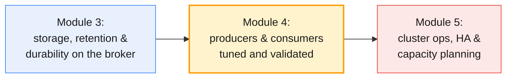

By the end of this module you will be able to:

- Explain the **producer pipeline** — serializer, partitioner, record
  accumulator, sender — and tune `batch.size`, `linger.ms`, compression,
  `retries`, `delivery.timeout.ms`, `acks` and idempotence for a given
  workload.
- Operate **consumer groups**: read their state, manage and reset offsets,
  choose a commit strategy, and diagnose **rebalances** (classic, cooperative,
  static membership and the Kafka 4.x consumer protocol).
- Choose and prove a **delivery semantic** — at-most-once, at-least-once or
  exactly-once — and know what each costs.
- Build, configure and run **Java producer and consumer applications** in
  VS Code (with GitHub Copilot) against the **shared Apache Kafka cluster on
  AWS**.
- Apply **error-handling and retry patterns**: retriable vs fatal errors,
  poison pills, retry topics and dead-letter topics.

> **For the MQ administrator:** in IBM MQ, the queue manager tracks which
> message each application has consumed and the "delivery contract" lives
> largely in the server (syncpoint, backout queues, persistent messages). In
> Kafka, **the client owns much more of the contract**: the producer decides
> durability (`acks`), idempotence and retries; the consumer decides when a
> message counts as "done" by committing an offset. Reviewing client
> configuration is therefore part of the Kafka administrator's job, not an
> afterthought.

---

## 2. Inside the producer: from send() to the broker

### 2.1 The producer pipeline

`producer.send()` does **not** send anything over the network. It hands the
record to a pipeline inside the client, which batches records per partition
and lets a background I/O thread ship them.

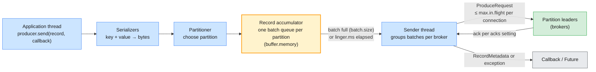

| Stage | What happens | Key configs |
| ----- | ------------ | ----------- |
| **Serialize** | Key and value become byte arrays | `key.serializer`, `value.serializer` |
| **Partition** | Keyed records hash to a partition; keyless records use sticky batching | `partitioner.class` (default `null` = built-in) |
| **Accumulate** | Records join the open batch for their partition | `batch.size`, `linger.ms`, `buffer.memory`, `compression.type` |
| **Send** | Sender thread drains ready batches, one request per broker | `max.in.flight.requests.per.connection`, `max.request.size`, `request.timeout.ms` |
| **Acknowledge** | Broker replies per `acks`; failures are retried or surfaced | `acks`, `retries`, `retry.backoff.ms`, `delivery.timeout.ms` |

Two consequences you should internalise:

- **`send()` is asynchronous.** An exception during send surfaces in the
  callback (or when you call `future.get()`), not at the call site. Code that
  ignores the callback **cannot know** whether the record was written.
- **Records sit in memory before they are sent.** If the process is killed
  (`kill -9`, OOM, container eviction) before the sender thread drains the
  accumulator, those records are gone. `producer.flush()` and a clean
  `producer.close()` at shutdown are not optional.

### 2.2 How the partition is chosen

Module 1 §5.3 introduced partitioning conceptually. In Kafka 4.x the built-in
partitioner behaves like this:

| Record | Partition choice | Ordering guarantee |
| ------ | ---------------- | ------------------ |
| Has a key (e.g. MSISDN) | `murmur2(key) % numPartitions` | All records for one key stay in order on one partition |
| No key (`null`) | **Sticky**: fill a batch for one partition, then switch (weighted towards less-loaded brokers) | None across records |
| Explicit partition in `ProducerRecord` | That partition, no hashing | Up to the application |

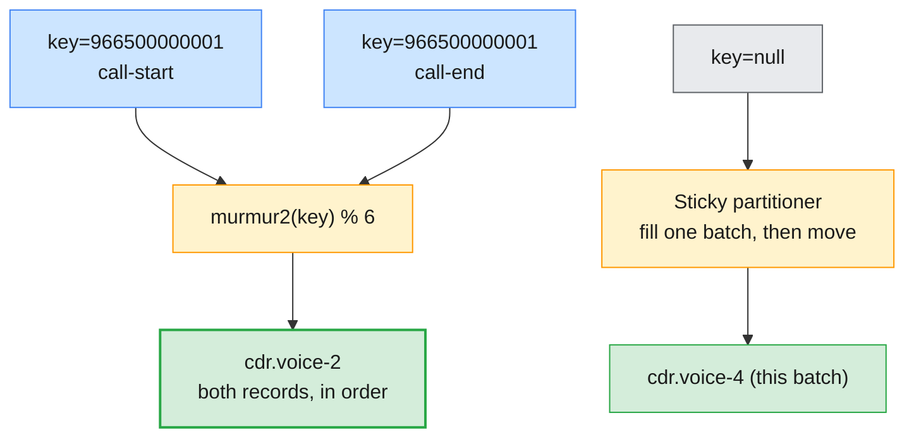

> ⚠️ **Common trap: random keys.** The Spring Boot producer you will reuse in
> the lab (`labs/module-03/spring-boot-kafka-producer`) sends with
> `String.valueOf(new Random().nextInt())` as the key. That spreads load, but
> it also **destroys per-entity ordering**: the `call-start` and `call-end` of
> one call can land on different partitions and be processed in either order.
> Use the business key (MSISDN, account ID, IMSI) whenever order per entity
> matters — and leave the key `null` if it does not.

> **Administrator note:** adding partitions to an existing topic changes
> `numPartitions`, so keyed records **move** to different partitions from that
> moment on. Per-key ordering across the change is broken. Treat partition
> increases on keyed topics as a change requiring application sign-off
> (Module 2 §8.4, Module 5).

### 2.3 Idempotence and sequence numbers

Since Kafka 3.0 the producer is **idempotent by default**
(`enable.idempotence=true`). On startup it obtains a **producer ID (PID)**; every
batch carries the PID and a per-partition **sequence number**. If a retry
resends a batch the leader already wrote, the broker recognises the sequence
and discards the duplicate while still acknowledging success.

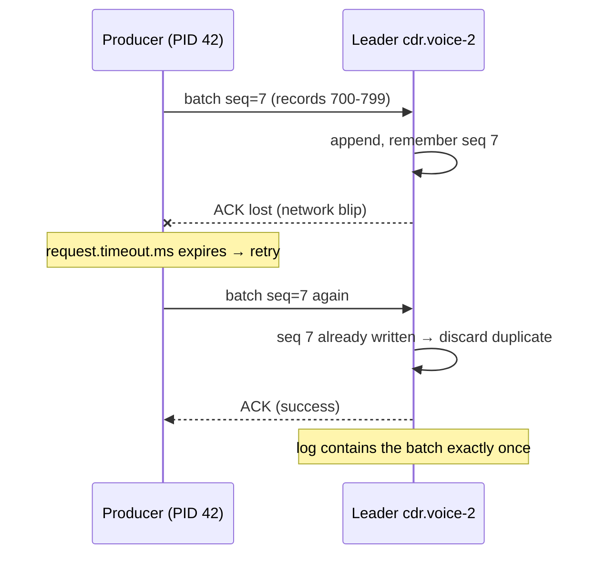

| Idempotence requires | Why |
| -------------------- | --- |
| `acks=all` | The broker must have committed the batch before sequence state is trusted |
| `retries > 0` | Idempotence exists to make retries safe |
| `max.in.flight.requests.per.connection ≤ 5` | The broker tracks the last 5 sequences per partition; up to 5 in flight **preserves ordering** even across retries |

If you explicitly set a conflicting value (e.g. `acks=1` together with
`enable.idempotence=true`), the producer fails at startup with a
`ConfigException`. If you set `acks=1` and leave idempotence unset, the client
silently disables idempotence — a frequent surprise in reviews.

> **Scope of the guarantee:** idempotence removes duplicates caused by
> **producer retries within one producer session, per partition**. It does
> not deduplicate an application that calls `send()` twice with the same
> business event, nor a producer that restarts and resends. Those cases need
> transactions (§7.4) or an idempotent consumer (§7.5).

---

## 3. Producer configuration tuning

### 3.1 The configs that matter

Most producers only need a dozen settings reviewed. Defaults below are for
the Kafka 4.x Java client.

| Config | Default (4.x) | What it controls | Tuning direction |
| ------ | ------------- | ---------------- | ---------------- |
| `acks` | `all` | How many replicas must confirm a write | Keep `all` for business data (Module 3 §6) |
| `enable.idempotence` | `true` | Duplicate-free retries, ordering with in-flight > 1 | Keep `true` |
| `batch.size` | `16384` (16 KB) | Upper bound of one partition batch | Raise to 64–256 KB for throughput |
| `linger.ms` | `5` (was `0` before 4.0) | How long to wait for a batch to fill | 5–50 ms for throughput; `0` only for strict latency |
| `compression.type` | `none` | Batch compression codec | `zstd` or `lz4` (Module 3 §7.2) |
| `buffer.memory` | `33554432` (32 MB) | Total memory for unsent batches | Raise for bursty high-volume producers |
| `max.block.ms` | `60000` | How long `send()` blocks when the buffer is full or metadata is missing | Lower for request/response services |
| `retries` | `2147483647` | Max retry attempts | Leave; bound retries with `delivery.timeout.ms` instead |
| `retry.backoff.ms` / `retry.backoff.max.ms` | `100` / `1000` | Exponential backoff between retries | Usually leave |
| `delivery.timeout.ms` | `120000` (2 min) | Total time budget per record, including retries | Align with how long the app can wait |
| `request.timeout.ms` | `30000` | Wait for one broker response | Usually leave |
| `max.in.flight.requests.per.connection` | `5` | Pipelining per broker | Keep ≤ 5 with idempotence |
| `max.request.size` | `1048576` (1 MB) | Largest request (and record) the producer sends | Raise only with broker `message.max.bytes` (Module 3 §2.3) |

> **Kafka 4.0 changed `linger.ms` from 0 to 5 ms** ([KIP-1030](https://cwiki.apache.org/confluence/display/KAFKA/KIP-1030%3A+Change+constraints+and+default+values+for+various+configurations)).
> The larger batches usually give equal or *lower* end-to-end latency under
> load, because fewer, bigger requests reach the broker. If you are comparing
> numbers with a 3.x benchmark, remember the baseline moved.

### 3.2 Batching: batch.size and linger.ms

A batch is sent when **either** it reaches `batch.size` **or** it has waited
`linger.ms` — whichever comes first. Under heavy load `batch.size` is the
trigger; under light load `linger.ms` is.

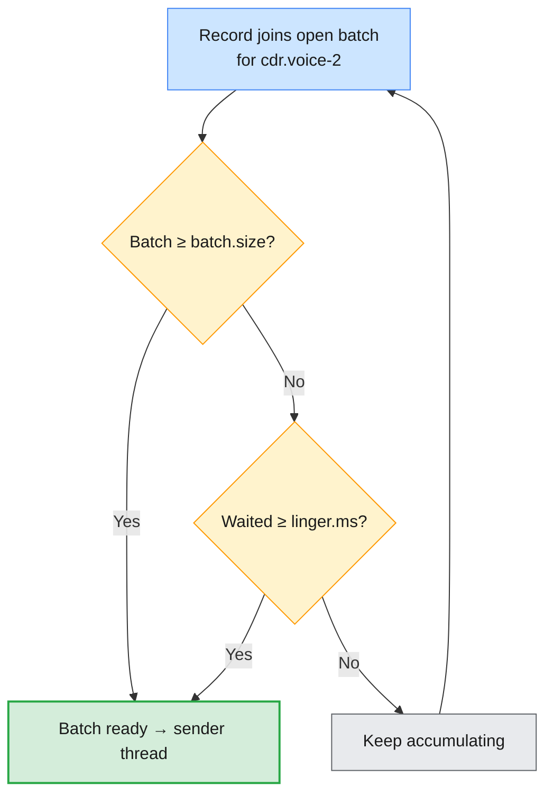

Bigger batches improve **everything downstream**: compression ratio, request
count, broker CPU, replication traffic and disk index overhead (Module 3
§7.3). The cost is up to `linger.ms` of added latency per record and more
client memory.

| Symptom | Likely batching issue | Adjustment |
| ------- | --------------------- | ---------- |
| Very high broker request rate, low throughput | Tiny batches (`linger.ms=0`, many partitions) | Raise `linger.ms` to 10–20 ms |
| `batch-size-avg` metric pinned at `batch.size` | Batches always full | Raise `batch.size` (e.g. 131072) |
| `send()` blocking, `BufferExhaustedException` | Accumulator full — broker or network too slow | Raise `buffer.memory`, fix broker throughput, or apply back-pressure |
| Poor compression ratio | Batches too small to compress well | Increase batch size/linger first, then compare codecs |

### 3.3 Retries and the delivery timeout

Retries are **automatic** for retriable errors (leader change,
`NOT_ENOUGH_REPLICAS`, request timeout). You should not bound them with
`retries`; bound them with **time**.

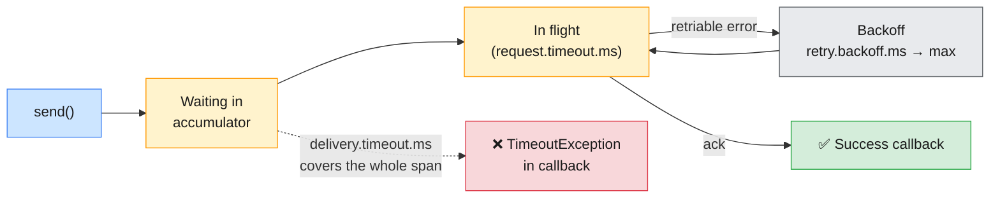

The rule the client enforces: **`delivery.timeout.ms ≥ linger.ms +
request.timeout.ms`**. After `delivery.timeout.ms` the record fails with a
`TimeoutException` in its callback — and **it is then the application's
problem**. A producer that logs and drops at that point has silently lost
data (a Module 9 scenario).

> ⚠️ **Common trap for MQ administrators:** MQ applications are used to an
> immediate, synchronous `MQPUT` return code. A Kafka producer returns from
> `send()` *before* the write happens, and it may keep retrying for two
> minutes. Applications must handle the callback outcome explicitly and must
> surface producer error metrics (`record-error-rate`, `record-retry-rate`)
> in monitoring (Module 8).

### 3.4 acks, revisited from the client side

Module 3 §6 covered what the broker does with each `acks` value. From the
client side:

| `acks` | Producer waits for | Latency | Loss risk | Idempotence possible |
| ------ | ------------------ | ------- | --------- | -------------------- |
| `0` | Nothing — fire and forget | Lowest | High: no error is ever seen | No |
| `1` | Leader write | Low | Leader dies before followers copy | No |
| `all` (`-1`) | All ISR, and ISR ≥ `min.insync.replicas` | Highest (one replication round trip) | Only if > RF − `min.insync.replicas` replicas fail at once | Yes |

> **The production baseline:** `acks=all`, `enable.idempotence=true`,
> `compression.type=zstd` (or `lz4`), `linger.ms` 5–20 ms, default retries with
> a deliberately chosen `delivery.timeout.ms` — on topics with RF = 3 and
> `min.insync.replicas=2` (Module 3 §6.4). Any producer that deviates should
> have a written reason.

### 3.5 Tuning profiles

| Profile | Example workload | Key settings |
| ------- | ---------------- | ------------ |
| **Durable (default)** | `cdr.voice`, `payments.events` | `acks=all`, idempotence on, `linger.ms=5–10`, `compression.type=zstd` |
| **High throughput** | `network.telemetry`, bulk CDR loads | `acks=all`, `linger.ms=20–50`, `batch.size=131072–262144`, `compression.type=lz4`/`zstd`, larger `buffer.memory` |
| **Low latency** | Real-time fraud signals, USSD sessions | `acks=all` (or `1` if loss is tolerable), `linger.ms=0–1`, small `batch.size`, `lz4` |
| **Loss-tolerant metrics** | Debug metrics | `acks=1`, `linger.ms=50`, `compression.type=zstd` |

### 3.6 Measuring with kafka-producer-perf-test.sh

Never tune from intuition. The perf-test tool drives the real Java producer
with any configuration you pass:

```bash
# Baseline: 1 KB records, as fast as possible, durable settings
kafka-producer-perf-test.sh --topic $ME.perf \
  --num-records 200000 --record-size 1024 --throughput -1 \
  --producer.config $CFG \
  --producer-props acks=all linger.ms=0 batch.size=16384

# Same load, batched and compressed
kafka-producer-perf-test.sh --topic $ME.perf \
  --num-records 200000 --record-size 1024 --throughput -1 \
  --producer.config $CFG \
  --producer-props acks=all linger.ms=20 batch.size=131072 compression.type=lz4
```

```
200000 records sent, 41322.3 records/sec (40.35 MB/sec), 612.4 ms avg latency, 1190.0 ms max latency, 580 ms 50th, 1050 ms 95th, 1150 ms 99th, 1185 ms 99.9th.
```

| Output field | Read it as |
| ------------ | ---------- |
| `records/sec`, `MB/sec` | Throughput achieved for this config |
| `avg latency`, percentiles | Time from `send()` to acknowledgement, including time in the accumulator |
| Rising latency with flat throughput | Buffer is saturated — you are measuring queueing, not the broker |

> **Shared-cluster etiquette:** on the shared AWS cluster, keep perf runs
> short (≤ 200,000 records) and on your own `$ME.perf` topic. Eighteen
> learners running unlimited `--throughput -1` loops at once is itself a
> capacity-planning exercise (Module 5).

---

## 4. Consumer groups and the poll loop

### 4.1 Group anatomy

Module 1 §5.4 introduced consumer groups: partitions of a topic are divided
among the members of a group, and each group keeps its own position. The
machinery behind that is the **group coordinator** — a broker chosen by
hashing the `group.id` onto a partition of `__consumer_offsets`.

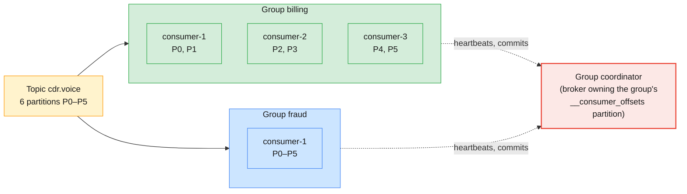

| Rule | Consequence |
| ---- | ----------- |
| One partition → at most one consumer per group | Parallelism is capped by **partition count** |
| Members > partitions | Extra members sit idle (useful only as hot standbys) |
| Different groups are independent | Billing and fraud each read every record at their own pace |
| Group state lives in `__consumer_offsets` | Committed offsets survive consumer restarts and broker failures |

### 4.2 The poll loop

A Kafka consumer is a **pull** client. Everything — fetching, heartbeating
(classic protocol), committing with auto-commit, and taking part in
rebalances — happens inside or alongside `poll()`.

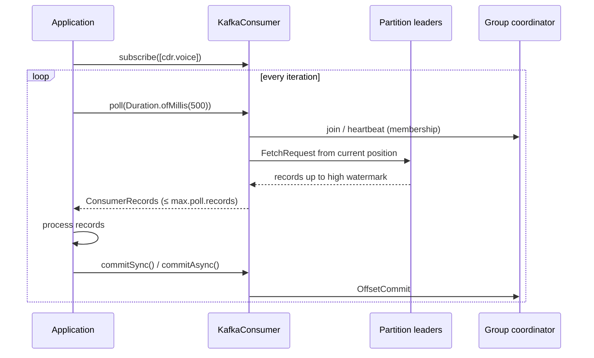

The consumer fetches only up to the **high watermark** (Module 1 §6.2), so it
never sees records that are not yet replicated to the ISR — the reason the
`acks=1` record was invisible in Module 3 §8.2.

### 4.3 Consumer configs that matter

| Config | Default (4.x) | What it controls |
| ------ | ------------- | ---------------- |
| `group.id` | none | Group membership; required for `subscribe()` and offset commits |
| `group.protocol` | `classic` | `classic` or `consumer` (the new KIP-848 protocol, §6.4) |
| `auto.offset.reset` | `latest` | Where to start when there is no valid committed offset (§5.4) |
| `enable.auto.commit` | `true` | Background commit of the last polled positions |
| `auto.commit.interval.ms` | `5000` | Auto-commit frequency |
| `max.poll.records` | `500` | Upper bound of records returned by one `poll()` |
| `max.poll.interval.ms` | `300000` (5 min) | Max time between `poll()` calls before the member is evicted |
| `session.timeout.ms` | `45000` | Heartbeat silence before the member is considered dead (classic) |
| `heartbeat.interval.ms` | `3000` | Heartbeat frequency (classic) |
| `fetch.min.bytes` / `fetch.max.wait.ms` | `1` / `500` | Batch-up fetches: wait for N bytes or the time limit |
| `max.partition.fetch.bytes` | `1048576` | Max data per partition per fetch |
| `isolation.level` | `read_uncommitted` | `read_committed` hides aborted/open transactions (§7.4) |
| `group.instance.id` | none | Static membership (§6.3) |
| `partition.assignment.strategy` | `RangeAssignor, CooperativeStickyAssignor` | Client-side assignor (classic protocol only) |

### 4.4 Two different liveness checks

The single most common consumer-group incident comes from confusing the two
timeouts:

| Check | Detects | Config | What happens when it fires |
| ----- | ------- | ------ | -------------------------- |
| **Session timeout** | The **process** is dead or partitioned (no heartbeats) | `session.timeout.ms` | Member removed, rebalance |
| **Poll interval** | The process is alive but **stuck processing** | `max.poll.interval.ms` | Member leaves the group; its next commit fails with `CommitFailedException`; rebalance |

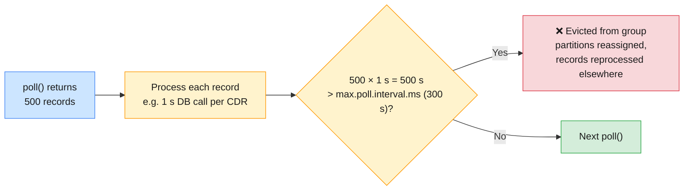

> ⚠️ **Rebalance storm recipe:** slow processing × large `max.poll.records`
> > `max.poll.interval.ms`. The member is evicted, its partitions go to another
> member that is equally slow, it is evicted too — and the group never makes
> progress while lag climbs. The fix is to **lower `max.poll.records`** (or
> speed up processing), not to raise timeouts indefinitely.

### 4.5 Inspecting groups from the CLI

```bash
# All groups you can see (the shared cluster filters by your prefix ACLs)
kafka-consumer-groups.sh --bootstrap-server $APACHE --command-config $CFG --list

# Offsets and lag per partition
kafka-consumer-groups.sh --bootstrap-server $APACHE --command-config $CFG \
  --describe --group $ME.billing

# Who is in the group and what they own
kafka-consumer-groups.sh --bootstrap-server $APACHE --command-config $CFG \
  --describe --group $ME.billing --members --verbose

# Group state and coordinator
kafka-consumer-groups.sh --bootstrap-server $APACHE --command-config $CFG \
  --describe --group $ME.billing --state
```

| Group state | Meaning |
| ----------- | ------- |
| `Stable` | Members joined, partitions assigned, consuming |
| `PreparingRebalance` / `CompletingRebalance` | Classic protocol rebalance in progress |
| `Reconciling` / `Assigning` | New consumer protocol (§6.4) is moving partitions |
| `Empty` | No active members, committed offsets retained |
| `Dead` | Group metadata removed (offsets expired or group deleted) |

---

## 5. Offset management and commit strategies

### 5.1 Positions vs committed offsets

A consumer tracks two numbers per partition, and the gap between them is
where duplicates and losses come from.

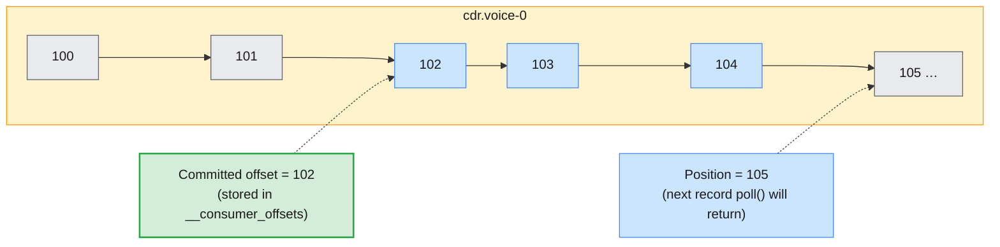

- The **committed offset** is the offset of the **next record to read** — not
  the last one processed. Committing `102` means "records up to 101 are done".
- If this consumer crashes now, the next owner of the partition starts at
  **102** and records 102–104 are delivered **again**.
- If the consumer had committed `105` before processing 102–104 and then
  crashed, those three records would **never** be processed.

### 5.2 Commit strategies

| Strategy | How | Delivery outcome | Use when |
| -------- | --- | ---------------- | -------- |
| **Auto-commit** | `enable.auto.commit=true`; commits the last *polled* positions every `auto.commit.interval.ms`, during `poll()` | At-least-once *if* processing is synchronous inside the loop; loss if records are handed to other threads | Simple, synchronous consumers; dashboards |
| **Sync commit after batch** | `commitSync()` after processing the whole poll | At-least-once; blocks until the coordinator confirms | Default choice for business consumers |
| **Async commit + sync on close** | `commitAsync()` each loop, `commitSync()` in `finally` / on revoke | At-least-once with lower latency | High-throughput consumers |
| **Per-record / explicit offsets** | `commitSync(Map<TopicPartition, OffsetAndMetadata>)` with `offset + 1` | Smallest duplicate window; more commit traffic | Expensive, non-idempotent processing |
| **Commit before processing** | Commit first, then process | At-most-once | Loss-tolerant, duplicate-intolerant data |
| **Transactional** | `sendOffsetsToTransaction()` | Exactly-once for Kafka → Kafka | Stream processing pipelines (§7.4) |

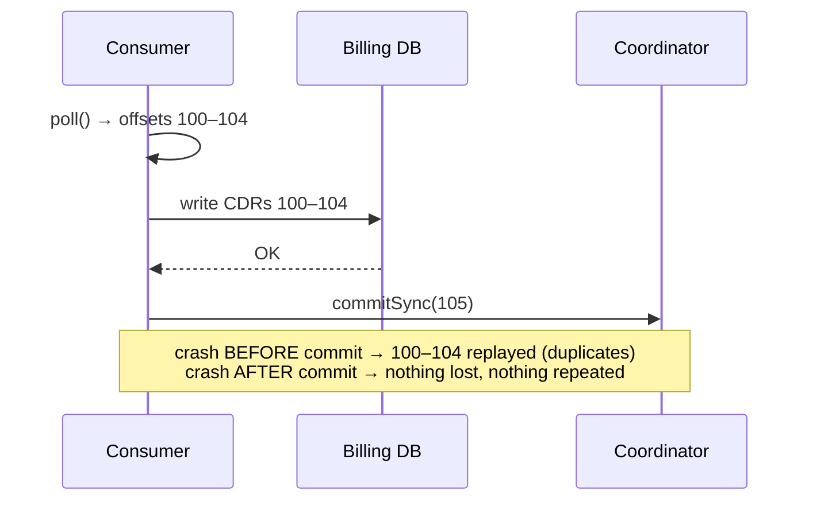

> **Why `commitAsync()` is not retried:** an async commit that fails is not
> retried by the client, because a later commit with a higher offset may
> already have succeeded — retrying the old one would move the group
> **backwards**. That is why the pattern is "async in the loop, sync on
> shutdown and on partition revocation".

> ⚠️ **Auto-commit + threads = loss.** If the poll loop hands records to a
> worker pool and immediately polls again, auto-commit commits positions for
> records the workers have not finished. A crash then silently skips them.
> Disable auto-commit whenever processing is asynchronous.

### 5.3 Where offsets live

Commits are written to the compacted internal topic **`__consumer_offsets`**
(50 partitions by default), keyed by *(group, topic, partition)*.

| Property | Where | Default | Why it matters |
| -------- | ----- | ------- | -------------- |
| `offsets.topic.replication.factor` | Broker | `3` | Offsets are as important as the data — never 1 in production |
| `offsets.retention.minutes` | Broker | `10080` (7 days) | Committed offsets of an **empty** group expire after this |
| `offsets.topic.num.partitions` | Broker | `50` | Spreads coordinator load; set before first use |

> ⚠️ **Offset expiry trap:** a group that has been `Empty` (no running
> members) for longer than `offsets.retention.minutes` loses its committed
> offsets. When it restarts it falls back to `auto.offset.reset` — with the
> default `latest` it **skips everything produced while it was down**. Seasonal
> or weekly batch consumers need either a longer offset retention or
> `auto.offset.reset=earliest` plus idempotent processing.

### 5.4 auto.offset.reset

`auto.offset.reset` is consulted **only** when the group has no committed
offset for a partition, or the committed offset is out of range (older than
the log start offset after retention, Module 3 §5.1).

| Value | Behaviour | Risk |
| ----- | --------- | ---- |
| `latest` (default) | Start at the log end | New or expired groups skip existing data |
| `earliest` | Start at the log start offset | Large replay on first start |
| `none` | Throw `NoOffsetForPartitionException` | Forces an explicit operator decision — safest for critical consumers |
| `by_duration:<ISO-8601>` | Start at records newer than the duration (e.g. `by_duration:PT6H`) | Available in recent 4.x clients |

### 5.5 Resetting offsets as an administrator

Reprocessing after a bug fix, skipping a poison record, or starting a new
consumer from a point in time are routine administrator tasks. The group
**must have no active members** (stop the application first).

```bash
# Always dry-run first: prints the plan, changes nothing
kafka-consumer-groups.sh --bootstrap-server $APACHE --command-config $CFG \
  --group $ME.billing --topic $ME.cdr.voice \
  --reset-offsets --to-earliest --dry-run

# Replay the last 6 hours
kafka-consumer-groups.sh --bootstrap-server $APACHE --command-config $CFG \
  --group $ME.billing --topic $ME.cdr.voice \
  --reset-offsets --by-duration PT6H --execute

# From a wall-clock time
kafka-consumer-groups.sh --bootstrap-server $APACHE --command-config $CFG \
  --group $ME.billing --topic $ME.cdr.voice \
  --reset-offsets --to-datetime 2026-09-30T08:00:00.000 --execute

# Skip one poison record on partition 2
kafka-consumer-groups.sh --bootstrap-server $APACHE --command-config $CFG \
  --group $ME.billing --topic $ME.cdr.voice:2 \
  --reset-offsets --shift-by 1 --execute
```

| Option | Moves the group to |
| ------ | ------------------ |
| `--to-earliest` / `--to-latest` | Log start / log end |
| `--to-offset N` | A specific offset |
| `--shift-by ±N` | Relative to the current committed offset |
| `--to-datetime` / `--by-duration` | The first offset at or after that time (uses the time index, Module 3 §3.1) |
| `--to-current` | The current committed offset (useful to materialise commits for a new topic) |
| `--from-file` | A CSV plan — reproducible, reviewable resets |

> **Administrator takeaway:** an offset reset is a **data operation**. It can
> replay millions of CDRs into billing or skip them entirely. Dry-run, capture
> the plan output in the change ticket, and confirm the downstream system is
> idempotent before replaying.

---

## 6. Rebalancing

### 6.1 What triggers a rebalance

A rebalance redistributes partitions among group members. It is the price
Kafka pays for elastic, self-healing consumer groups.

| Trigger | Typical cause |
| ------- | ------------- |
| Member joins | Scale-out, deployment, restart |
| Member leaves cleanly | `consumer.close()`, scale-in |
| Member times out | Crash, GC pause, network partition (`session.timeout.ms`) |
| Member evicted | Processing slower than `max.poll.interval.ms` |
| Subscription changes | New partitions added; regex subscription matches a new topic |

### 6.2 Eager vs cooperative (classic protocol)

```mermaid
sequenceDiagram
    participant C1 as consumer-1 (P0,P1,P2)
    participant C2 as consumer-2 (P3,P4,P5)
    participant GC as Coordinator
    participant C3 as consumer-3 (new)
    C3->>GC: JoinGroup
    Note over C1,C2: EAGER (Range/RoundRobin/Sticky)
    GC-->>C1: revoke ALL partitions
    GC-->>C2: revoke ALL partitions
    Note over C1,C3: whole group stops consuming
    GC-->>C1: assign P0,P1
    GC-->>C2: assign P3,P4
    GC-->>C3: assign P2,P5
    Note over C1,C2: COOPERATIVE (CooperativeSticky)
    Note over C1,C3: only P2 and P5 are revoked and moved;<br/>other partitions keep flowing
```

| | Eager | Cooperative (incremental) |
| --- | --- | --- |
| **Assignors** | `RangeAssignor`, `RoundRobinAssignor`, `StickyAssignor` | `CooperativeStickyAssignor` |
| **During rebalance** | Every member stops, revokes everything | Only moved partitions pause |
| **Rounds** | One | Usually two |
| **Impact on lag** | Spike across all partitions | Localised |

The client default `[RangeAssignor, CooperativeStickyAssignor]` exists to let
you **migrate** a running group: roll out the list, then roll out
`CooperativeStickyAssignor` alone.

### 6.3 Static membership

Every deployment restarts consumers; every restart normally means two
rebalances (leave + join). **Static membership** gives each instance a stable
identity so a quick restart does not rebalance at all.

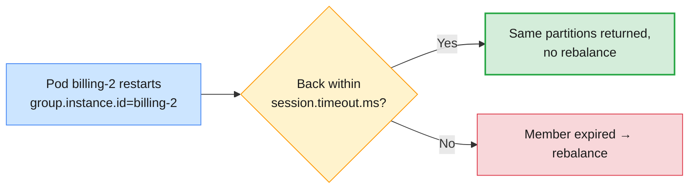

| Setting | Recommendation |
| ------- | -------------- |
| `group.instance.id` | A stable, unique ID per instance (pod name in a StatefulSet, host name on VMs) |
| `session.timeout.ms` | Longer than a normal restart (e.g. 60–120 s) — but that also delays detection of real crashes |

> ⚠️ **Duplicate `group.instance.id`:** two running instances with the same
> static ID fence each other (`FencedInstanceIdException`). Generate IDs from
> something unique per instance, never hard-code them in a shared config.

### 6.4 The Kafka 4.x consumer rebalance protocol (KIP-848)

Kafka 4.0 made the **next-generation consumer rebalance protocol** generally
available. It moves assignment from the group leader client to the
**broker-side group coordinator**, and it is fully incremental: no global
"stop the world" synchronisation barrier.

```mermaid
flowchart TB
    subgraph CLASSIC["group.protocol=classic (default)"]
        direction LR
        A1["Clients JoinGroup/SyncGroup"] --> A2["Leader CLIENT computes<br/>assignment (client assignor)"]
        A2 --> A3["Barrier: all members wait"]
    end
    subgraph NEW["group.protocol=consumer (KIP-848)"]
        direction LR
        B1["Clients send ConsumerGroupHeartbeat"] --> B2["COORDINATOR computes target<br/>(uniform / range assignor)"]
        B2 --> B3["Each member reconciles<br/>independently"]
    end
    style CLASSIC fill:#e8eaed,stroke:#5f6368,stroke-width:1px,color:#1a1a1a
    style NEW fill:#d4edda,stroke:#28a745,stroke-width:2px,color:#1a1a1a
    style A1 fill:#e8eaed,stroke:#5f6368,stroke-width:1px,color:#1a1a1a
    style A2 fill:#e8eaed,stroke:#5f6368,stroke-width:1px,color:#1a1a1a
    style A3 fill:#f8d7da,stroke:#dc3545,stroke-width:1px,color:#1a1a1a
    style B1 fill:#cce5ff,stroke:#4285f4,stroke-width:1px,color:#1a1a1a
    style B2 fill:#fff3cd,stroke:#ff9800,stroke-width:1px,color:#1a1a1a
    style B3 fill:#d4edda,stroke:#28a745,stroke-width:1px,color:#1a1a1a
```

| Aspect | Classic | Consumer (KIP-848) |
| ------ | ------- | ------------------ |
| Opt in | Default | Client sets `group.protocol=consumer` (server side enabled by default since 4.0) |
| Assignment computed by | Group leader client | Broker group coordinator |
| Assignor config | `partition.assignment.strategy` (client) | `group.remote.assignor` (client) / `group.consumer.assignors` (broker): `uniform` (default), `range` |
| Session / heartbeat | `session.timeout.ms`, `heartbeat.interval.ms` (client) | `group.consumer.session.timeout.ms`, `group.consumer.heartbeat.interval.ms` (broker) |
| Not supported | — | Client `session.timeout.ms`, `heartbeat.interval.ms`, `partition.assignment.strategy`, `enforceRebalance()` |
| Rebalance impact | Barrier, even when cooperative | Per-member reconciliation, no global pause |

> **Administrator takeaway:** with the new protocol, rebalance timing is a
> **broker** setting you own, not something each application team picks. When
> you review a 4.x consumer, check `group.protocol` first — the rest of the
> group-tuning advice depends on it.

### 6.5 Reacting to rebalances in code

Applications that keep per-partition state (open DB transactions, in-memory
aggregates, pending commits) register a `ConsumerRebalanceListener`:

| Callback | Called when | Typical action |
| -------- | ----------- | -------------- |
| `onPartitionsRevoked` | Before partitions are taken away | Flush work and `commitSync()` offsets for those partitions |
| `onPartitionsAssigned` | After new partitions are given | Load state, optionally `seek()` to an external offset |
| `onPartitionsLost` | Partitions were lost without a clean revoke (e.g. session expired) | Discard state — **do not** commit, another member already owns them |

---

## 7. Delivery semantics: at-most-once, at-least-once, exactly-once

### 7.1 Where messages can be lost or duplicated

Every semantic is a statement about **three hops**: producer → broker, broker
storage, broker → consumer processing. Modules 1 and 3 covered the middle
hop; this module covers the two ends.

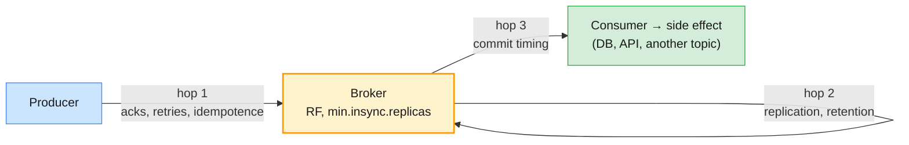

### 7.2 The three semantics side by side

| | At-most-once | At-least-once | Exactly-once |
| --- | --- | --- | --- |
| **Guarantee** | Never duplicated, may be lost | Never lost, may be duplicated | Processed once, effects visible once |
| **Producer** | `acks=0` or `1`, no retries | `acks=all`, retries, idempotence | Idempotent + **transactional** producer |
| **Consumer** | Commit **before** processing | Commit **after** processing | `read_committed` + offsets committed in the transaction |
| **Cost** | Lowest latency | Duplicates must be tolerated downstream | Latency and throughput overhead; Kafka-to-Kafka only |
| **Telecom example** | Debug telemetry | CDR ingestion into billing (with idempotent writes) | Rating pipeline `cdr.voice` → `cdr.rated` |

```mermaid
flowchart TB
    subgraph AMO["At-most-once"]
        direction LR
        a1["poll"] --> a2["commit"] --> a3["process"]
        a3 -.->|"crash here = LOST"| a4["❌"]
    end
    subgraph ALO["At-least-once"]
        direction LR
        b1["poll"] --> b2["process"] --> b3["commit"]
        b2 -.->|"crash here = REPEATED"| b4["⚠️"]
    end
    subgraph EOS["Exactly-once (Kafka → Kafka)"]
        direction LR
        c1["poll"] --> c2["produce results<br/>+ offsets in ONE transaction"] --> c3["commit transaction"]
        c2 -.->|"crash = abort, nothing visible"| c4["✅"]
    end
    style AMO fill:#f8d7da,stroke:#dc3545,stroke-width:1px,color:#1a1a1a
    style ALO fill:#fff3cd,stroke:#ff9800,stroke-width:1px,color:#1a1a1a
    style EOS fill:#d4edda,stroke:#28a745,stroke-width:2px,color:#1a1a1a
    style a1 fill:#e8eaed,stroke:#5f6368,stroke-width:1px,color:#1a1a1a
    style a2 fill:#e8eaed,stroke:#5f6368,stroke-width:1px,color:#1a1a1a
    style a3 fill:#e8eaed,stroke:#5f6368,stroke-width:1px,color:#1a1a1a
    style a4 fill:#f8d7da,stroke:#dc3545,stroke-width:1px,color:#1a1a1a
    style b1 fill:#e8eaed,stroke:#5f6368,stroke-width:1px,color:#1a1a1a
    style b2 fill:#e8eaed,stroke:#5f6368,stroke-width:1px,color:#1a1a1a
    style b3 fill:#e8eaed,stroke:#5f6368,stroke-width:1px,color:#1a1a1a
    style b4 fill:#fff3cd,stroke:#ff9800,stroke-width:1px,color:#1a1a1a
    style c1 fill:#e8eaed,stroke:#5f6368,stroke-width:1px,color:#1a1a1a
    style c2 fill:#e8eaed,stroke:#5f6368,stroke-width:1px,color:#1a1a1a
    style c3 fill:#e8eaed,stroke:#5f6368,stroke-width:1px,color:#1a1a1a
    style c4 fill:#d4edda,stroke:#28a745,stroke-width:1px,color:#1a1a1a
```

### 7.3 At-least-once: the practical default

Almost every production Kafka consumer is **at-least-once** by design:
durable producer (§3.4), commit after processing (§5.2). Duplicates appear
only on failure — a crash between processing and commit, or a rebalance that
revokes partitions mid-batch — and are made harmless downstream (§7.5).

### 7.4 Exactly-once with transactions

Kafka transactions ([KIP-98](https://cwiki.apache.org/confluence/display/KAFKA/KIP-98+-+Exactly+Once+Delivery+and+Transactional+Messaging))
let a producer write to **several partitions and commit consumer offsets
atomically**. Either all of it becomes visible to `read_committed` consumers,
or none of it does.

```mermaid
sequenceDiagram
    participant App as Rating app
    participant TP as Transactional producer<br/>transactional.id=lNN.rater-0
    participant TC as Transaction coordinator
    participant OUT as cdr.rated
    participant OFF as __consumer_offsets
    App->>TP: initTransactions() (fences older instances)
    loop per poll batch
        App->>TP: beginTransaction()
        App->>TP: send(cdr.rated, …) × N
        TP->>OUT: records (uncommitted)
        App->>TP: sendOffsetsToTransaction(offsets, groupMetadata)
        TP->>OFF: offsets (uncommitted)
        App->>TP: commitTransaction()
        TP->>TC: EndTxn(COMMIT)
        TC->>OUT: commit marker
        TC->>OFF: commit marker
    end
    Note over OUT: read_committed consumers see results only after the marker
```

| Config | Side | Purpose |
| ------ | ---- | ------- |
| `transactional.id` | Producer | Stable ID per logical producer; enables fencing of zombie instances |
| `transaction.timeout.ms` | Producer | Coordinator aborts a transaction open longer than this (default 60 s) |
| `isolation.level=read_committed` | Consumer | Read only committed transactional data (and all non-transactional data) |
| `transaction.state.log.replication.factor` / `.min.isr` | Broker | Durability of the `__transaction_state` internal topic (3 / 2) |
| `transactional.id.expiration.ms` | Broker | How long an idle transactional ID is remembered (7 days) |

What `read_committed` changes for the consumer:

- It reads up to the **last stable offset (LSO)** instead of the high
  watermark. An open transaction holds back everything after its first record
  — a long-running or hung transaction shows up as **consumer lag that will
  not drain**.
- Records from aborted transactions are skipped; commit/abort markers occupy
  offsets, so offsets have gaps.

> ⚠️ **Exactly-once stops at the Kafka boundary.** Transactions cover Kafka
> topics and Kafka offsets. Writing to Oracle, calling a charging API or
> sending an SMS is **outside** the transaction. For those side effects you
> need an idempotent consumer (§7.5) — no Kafka setting will make an external
> system exactly-once.

Kafka Streams applications get all of this with one setting,
`processing.guarantee=exactly_once_v2`; Confluent's managed stream
processing uses the same mechanism (Module 10).

### 7.5 Idempotent consumers

The pattern that turns at-least-once into **effectively-once** for external
systems: make processing the same record twice produce the same result.

| Technique | How | Example |
| --------- | --- | ------- |
| **Natural key upsert** | `MERGE`/`INSERT … ON CONFLICT DO NOTHING` on a business ID | CDR ID as primary key in the billing DB |
| **Processed-offset table** | Store *(topic, partition, offset)* in the same DB transaction as the result; seek to it on assignment | Rating results in PostgreSQL |
| **Dedup cache** | Keep recently seen event IDs (TTL ≥ max replay window) | Notification service suppresses repeat SMS |
| **Idempotent downstream API** | Pass an idempotency key | Charging gateway with request IDs |

> **The production baseline:** at-least-once delivery **plus** idempotent
> consumers, with transactions reserved for Kafka → Kafka processing. That
> combination is what "exactly-once" means in most real architectures.

---

## 8. Writing Kafka producer and consumer applications in Java

### 8.1 Project setup

The lab VMs ship with Temurin **Java 21** and Maven (`infra/LAB-SETUP.md`).
Use the plain `kafka-clients` library first — it is exactly what Spring,
Kafka Streams and the console tools use underneath — then compare with
Spring Boot (§8.5).

```bash
# (VM) create a Maven project in VS Code's terminal
mvn archetype:generate -DgroupId=com.examples.kafka -DartifactId=cdr-clients \
  -DarchetypeArtifactId=maven-archetype-quickstart -DinteractiveMode=false
cd cdr-clients
```

```xml
<properties>
  <maven.compiler.release>21</maven.compiler.release>
  <kafka.version>4.3.1</kafka.version> <!-- match the cluster's 4.x minor -->
</properties>

<dependencies>
  <dependency>
    <groupId>org.apache.kafka</groupId>
    <artifactId>kafka-clients</artifactId>
    <version>${kafka.version}</version>
  </dependency>
  <dependency>
    <groupId>org.slf4j</groupId>
    <artifactId>slf4j-simple</artifactId>
    <version>2.0.16</version>
  </dependency>
</dependencies>
```

| Compatibility rule | Detail |
| ------------------ | ------ |
| Clients and brokers are version-tolerant | Clients negotiate API versions; a 4.x client talks to any supported 4.x broker |
| Kafka 4.x clients need Java 11+ | Brokers and tools need Java 17+ |
| 4.x clients do not talk to very old brokers | Brokers older than 2.1 are unsupported (KIP-896) — relevant in migrations (Module 10) |

### 8.2 Loading the shared-cluster configuration

Never hard-code bootstrap servers or credentials. On the lab VM the prepared
`~/kafka/apache.properties` already contains the bootstrap servers and your
SASL/SCRAM settings — the same file `--command-config` uses. Load it and add
client-specific settings on top:

```java
static Properties baseConfig() throws IOException {
    Properties props = new Properties();
    Path cfg = Path.of(System.getProperty("user.home"), "kafka", "apache.properties");
    try (InputStream in = Files.newInputStream(cfg)) {
        props.load(in);            // bootstrap.servers + security settings
    }
    return props;
}
```

> **Administrator note:** this is the same separation you apply to CLI tools —
> connection and security in one reviewed file, behaviour in code. In
> Module 7 the security half changes (API keys, RBAC) without touching the
> application logic.

### 8.3 A durable CDR producer

```java
public class CdrProducer {
    private static final Logger log = LoggerFactory.getLogger(CdrProducer.class);

    public static void main(String[] args) throws Exception {
        String topic = args[0];                          // e.g. l07.cdr.voice
        int count = Integer.parseInt(args[1]);

        Properties props = baseConfig();
        props.put(ProducerConfig.KEY_SERIALIZER_CLASS_CONFIG, StringSerializer.class.getName());
        props.put(ProducerConfig.VALUE_SERIALIZER_CLASS_CONFIG, StringSerializer.class.getName());
        props.put(ProducerConfig.ACKS_CONFIG, "all");
        props.put(ProducerConfig.ENABLE_IDEMPOTENCE_CONFIG, true);
        props.put(ProducerConfig.LINGER_MS_CONFIG, 10);
        props.put(ProducerConfig.BATCH_SIZE_CONFIG, 65536);
        props.put(ProducerConfig.COMPRESSION_TYPE_CONFIG, "zstd");
        props.put(ProducerConfig.DELIVERY_TIMEOUT_MS_CONFIG, 120000);
        props.put(ProducerConfig.CLIENT_ID_CONFIG, "cdr-producer");

        try (KafkaProducer<String, String> producer = new KafkaProducer<>(props)) {
            for (int i = 0; i < count; i++) {
                String msisdn = "9665000000" + String.format("%02d", i % 20);
                String cdr = "{\"cdrId\":\"" + UUID.randomUUID() + "\",\"msisdn\":\"" + msisdn
                        + "\",\"durationSec\":" + (30 + i % 300) + "}";
                producer.send(new ProducerRecord<>(topic, msisdn, cdr), (md, ex) -> {
                    if (ex != null) {
                        log.error("Delivery failed for {}", msisdn, ex);   // alert, DLQ or stop
                    } else {
                        log.info("key={} -> partition={} offset={}", msisdn, md.partition(), md.offset());
                    }
                });
            }
            producer.flush();                            // drain the accumulator before close
        }
    }
}
```

| Line | Why it is there |
| ---- | --------------- |
| Key = MSISDN | All records of one subscriber go to one partition, in order (§2.2) |
| Callback with error branch | `send()` is asynchronous; this is the only place a failure is seen (§3.3) |
| `flush()` + try-with-resources `close()` | Records in the accumulator are sent before exit (§2.1) |
| `client.id` | Appears in broker logs, quotas and metrics — make it meaningful |

### 8.4 An at-least-once consumer with graceful shutdown

```java
public class CdrConsumer {
    private static final Logger log = LoggerFactory.getLogger(CdrConsumer.class);

    public static void main(String[] args) throws Exception {
        String topic = args[0];                          // e.g. l07.cdr.voice
        String group = args[1];                          // e.g. l07.billing

        Properties props = baseConfig();
        props.put(ConsumerConfig.GROUP_ID_CONFIG, group);
        props.put(ConsumerConfig.KEY_DESERIALIZER_CLASS_CONFIG, StringDeserializer.class.getName());
        props.put(ConsumerConfig.VALUE_DESERIALIZER_CLASS_CONFIG, StringDeserializer.class.getName());
        props.put(ConsumerConfig.ENABLE_AUTO_COMMIT_CONFIG, false);
        props.put(ConsumerConfig.AUTO_OFFSET_RESET_CONFIG, "earliest");
        props.put(ConsumerConfig.MAX_POLL_RECORDS_CONFIG, 200);

        KafkaConsumer<String, String> consumer = new KafkaConsumer<>(props);
        Thread main = Thread.currentThread();
        Runtime.getRuntime().addShutdownHook(new Thread(() -> {
            consumer.wakeup();                           // makes poll() throw WakeupException
            try { main.join(); } catch (InterruptedException ignored) { }
        }));

        try {
            consumer.subscribe(List.of(topic), new ConsumerRebalanceListener() {
                public void onPartitionsRevoked(Collection<TopicPartition> parts) {
                    log.info("Revoked {}", parts);
                    consumer.commitSync();               // don't lose finished work
                }
                public void onPartitionsAssigned(Collection<TopicPartition> parts) {
                    log.info("Assigned {}", parts);
                }
            });
            while (true) {
                ConsumerRecords<String, String> records = consumer.poll(Duration.ofMillis(500));
                for (ConsumerRecord<String, String> r : records) {
                    log.info("p={} off={} key={} value={}", r.partition(), r.offset(), r.key(), r.value());
                    // process(r) — must be idempotent (§7.5)
                }
                if (!records.isEmpty()) {
                    consumer.commitAsync();              // fast path
                }
            }
        } catch (WakeupException e) {
            // expected on shutdown
        } finally {
            try {
                consumer.commitSync();                   // final, reliable commit
            } finally {
                consumer.close();                        // leave group cleanly → fast rebalance
            }
        }
    }
}
```

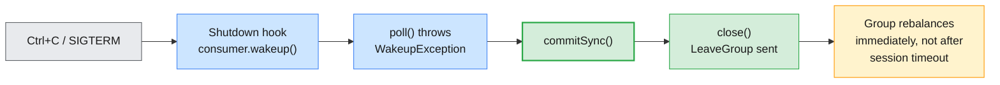

> ⚠️ **`KafkaConsumer` is not thread-safe.** Only `wakeup()` may be called
> from another thread. If you need parallel processing, either run more
> consumer instances (up to the partition count) or hand records to workers
> and commit only offsets whose records are finished — never auto-commit in
> that design (§5.2).

### 8.5 The same clients in Spring Boot

The Spring Boot apps you already have in `labs/module-03/spring-boot-kafka-producer`
and `spring-boot-kafka-consumer` wrap the same clients: `KafkaTemplate` is a
producer, and each `@KafkaListener` method is a consumer in a listener
container.

| Plain client | Spring for Apache Kafka | Note |
| ------------ | ----------------------- | ---- |
| `KafkaProducer.send()` | `KafkaTemplate.send()` → `CompletableFuture<SendResult>` | Handle the future's failure just like the callback |
| `KafkaConsumer.poll()` loop | `@KafkaListener` + `ConcurrentKafkaListenerContainerFactory` | Container runs the poll loop for you |
| `enable.auto.commit` | Container sets `enable.auto.commit=false` and commits itself | `AckMode.BATCH` by default; `RECORD`, `MANUAL`, `MANUAL_IMMEDIATE` available |
| Several consumer instances | Several `@KafkaListener` methods with the same `groupId`, or `concurrency` | The lab app's three `demo-group` listeners are three group members |
| Error handling | `DefaultErrorHandler` + `DeadLetterPublishingRecoverer` | §9.4 |

> **Config trap in the lab code:** both lab apps build their client
> properties in a `@Bean` map (`KafkaProducerConfig`, `KafkaConsumerConfig`),
> so `spring.kafka.producer.*` / `spring.kafka.consumer.*` entries in
> `application.properties` are **ignored** for those factories. Put `acks`,
> `linger.ms`, SASL settings etc. into the map (or switch to Boot's
> auto-configured factories). Their `bootstrap-servers` also points at a
> local cluster; the lab points them at the shared one.

### 8.6 Using GitHub Copilot effectively

Copilot in VS Code (it works over Remote-SSH) is good at boilerplate —
imports, POJOs, JSON serializers, `pom.xml` fragments. It is **not** a
reviewer of delivery guarantees. Treat suggestions as a junior developer's
draft and check them against this module.

| Ask Copilot for | Then verify yourself |
| --------------- | -------------------- |
| "A KafkaProducer that sends JSON CDRs keyed by MSISDN" | `acks`, idempotence, callback error branch, `flush()`/`close()` |
| "A consumer loop with manual commits" | Commit **after** processing; `commitSync` on revoke and in `finally` |
| "Add a dead-letter topic to this listener" | DLT exists with enough partitions; retries bounded; poison records not retried forever |
| "Explain this config" | Compare with the official config reference — suggestions may reflect pre-4.0 defaults (e.g. `linger.ms=0`) |

> ⚠️ **Common Copilot regressions** seen in class: `enable.auto.commit=true`
> with a thread pool, `acks=1` "for performance", random keys, ignoring the
> `send()` result, and the removed `DefaultPartitioner` class. Every one of
> them compiles and runs — and every one of them is a Module 9 incident.

---

## 9. Error handling and retry patterns

### 9.1 Classify the error first

Retrying is only correct for errors that can succeed on a later attempt.

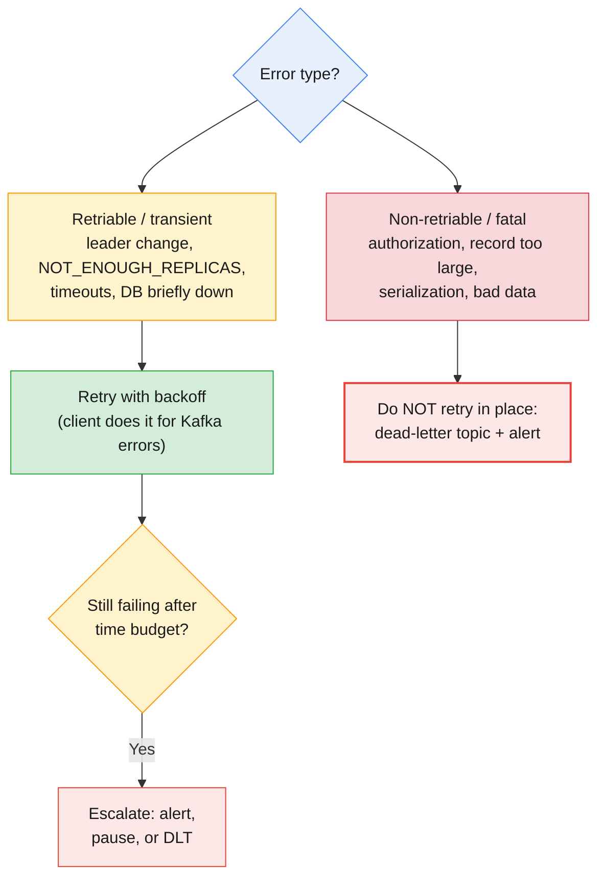

### 9.2 Producer errors

| Exception (in callback) | Retriable? | Typical cause | Action |
| ----------------------- | ---------- | ------------- | ------ |
| `NotEnoughReplicasException` | Yes (auto) | ISR < `min.insync.replicas` (Module 3 §6.4) | Client retries; check broker health |
| `NotLeaderOrFollowerException` | Yes (auto) | Leader moved; metadata refresh | None — transient |
| `TimeoutException` | Final after `delivery.timeout.ms` | Broker unreachable, ISR down too long, buffer full | Application decides: persist locally, alert, stop |
| `RecordTooLargeException` | No | Record > `max.request.size` or topic `max.message.bytes` | Fix payload or raise limits together (Module 3 §2.3) |
| `TopicAuthorizationException` | No | ACL missing / wrong prefix on the shared cluster | Fix ACL or topic name (Module 7) |
| `SerializationException` | No (thrown at `send()`) | Bad object for the serializer | Fix code / schema (Module 10) |
| `ProducerFencedException` | No | Another instance with the same `transactional.id` | Close this producer; it is a zombie |
| `OutOfOrderSequenceException` | No | Idempotence state broken (e.g. data loss on broker) | Close and recreate producer; investigate |

> **The rule for producers:** let the client retry transient errors
> automatically, bound the total time with `delivery.timeout.ms`, and write
> **explicit code** for what happens when a record finally fails. "Log and
> continue" is a decision to lose data — make it consciously.

### 9.3 Consumer errors and the poison pill

A **poison pill** is a record that can never be processed — malformed JSON, an
unknown schema version, a value that violates a business rule. With a naive
"retry until success" loop, one poison pill **blocks its partition forever**:
the consumer never commits past it, lag climbs, and every record behind it
waits.

| Failure | Where it surfaces | Pattern |
| ------- | ----------------- | ------- |
| Deserialization error | Inside `poll()` (plain client: `RecordDeserializationException` with partition/offset) | Skip + DLT: `seek(offset + 1)` after recording it; Spring: `ErrorHandlingDeserializer` |
| Transient processing error (DB timeout) | Your processing code | Bounded in-place retry with backoff, then retry topic |
| Permanent processing error (bad data) | Your processing code | Straight to DLT, no retries |
| `CommitFailedException` | `commitSync()` | Member was evicted (§4.4); fix processing time / `max.poll.records` |
| `WakeupException` | `poll()` | Expected on shutdown (§8.4) |

### 9.4 Retry topics and dead-letter topics

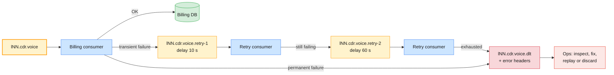

| Pattern | How it works | Trade-off |
| ------- | ------------ | --------- |
| **Blocking in-place retry** | Retry the same record N times with backoff, then DLT | Preserves order; blocks the partition while retrying |
| **Non-blocking retry topics** | Publish failures to delayed retry topics; main flow continues | Keeps throughput; **breaks per-key ordering** |
| **Dead-letter topic (DLT)** | Final parking place with the original record and error headers | Needs an owner, monitoring and a replay procedure |
| **Pause the partition** | `consumer.pause()` until a dependency recovers, then `resume()` | Right for "the DB is down" — retrying each record would be pointless |

In Spring for Apache Kafka, blocking retry plus DLT is a few lines — the
`DefaultErrorHandler` retries (by default 9 retries with no delay), then hands
the record to a recoverer:

```java
@Bean
public DefaultErrorHandler errorHandler(KafkaTemplate<String, String> template) {
    DeadLetterPublishingRecoverer recoverer = new DeadLetterPublishingRecoverer(template,
        (rec, ex) -> new TopicPartition(rec.topic() + ".dlt", rec.partition()));
    DefaultErrorHandler handler = new DefaultErrorHandler(recoverer, new FixedBackOff(1000L, 3L));
    handler.addNotRetryableExceptions(IllegalArgumentException.class);   // bad data: DLT at once
    return handler;
}
// factory.setCommonErrorHandler(errorHandler);
```

> **Administrator checklist for DLTs:** (1) create the DLT with **at least as
> many partitions** as the source topic — the recoverer above keeps the
> original partition number; (2) give it longer retention than the source so
> ops has time to act; (3) alert on **any** growth in DLT offsets (Module 8);
> (4) document the replay procedure (re-produce to the main topic, or reset a
> dedicated group) before the first incident, not during it.

### 9.5 Ordering vs retries — pick deliberately

| Requirement | Choose |
| ----------- | ------ |
| Strict per-key order (account balance, subscriber state) | Blocking retry, then DLT **and** pause/park later records of that key |
| Throughput matters more than order (notifications, analytics) | Non-blocking retry topics |
| Dependency outage (DB, charging API) | Pause/resume, not per-record retry |
| Malformed data | DLT immediately, never retry |

---

## 10. Hands-on lab: Java clients on the shared cluster

> **Runtime companion:** the step-by-step labs for this module live in
> `labs/module-04/` (in preparation). This section previews the flow using
> the same conventions as the Module 3 labs: you work on your **lab VM** in
> VS Code (Remote-SSH, with GitHub Copilot), against the **shared Apache
> Kafka cluster on AWS**, inside your own `lNN` prefix.

```mermaid
flowchart LR
    subgraph VM["Your lab VM (lab-lNN) — VS Code Remote-SSH + Copilot"]
        CLI["Kafka 4.x CLI<br/>$CFG"]
        JP["CdrProducer.java"]
        JC["CdrConsumer.java × 2–3"]
    end
    SH["Shared Apache Kafka cluster (AWS)<br/>3 KRaft controllers + 4 brokers<br/>SASL/SCRAM, prefix ACLs"]
    CLI --> SH
    JP -->|"$ME.cdr.voice"| SH
    SH -->|"group $ME.billing"| JC
    style SH fill:#fff3cd,stroke:#ff9800,stroke-width:2px,color:#1a1a1a
    style VM fill:#e8f0fe,stroke:#4285f4,stroke-width:1px,color:#1a1a1a
    style CLI fill:#cce5ff,stroke:#4285f4,stroke-width:1px,color:#1a1a1a
    style JP fill:#cce5ff,stroke:#4285f4,stroke-width:1px,color:#1a1a1a
    style JC fill:#d4edda,stroke:#28a745,stroke-width:1px,color:#1a1a1a
```

### 10.1 Part A — Validate message flow with the CLI

```bash
# (VM) — coordinates for the shared cluster
APACHE=apache-kafka.lab.internal:9092
CFG=~/kafka/apache.properties
ME=lNN                     # your learner prefix: l01 … l18

# 1. The topic the Java apps will use: 6 partitions, durable contract
kafka-topics.sh --bootstrap-server $APACHE --command-config $CFG --create \
  --topic $ME.cdr.voice --partitions 6 --replication-factor 3 \
  --config min.insync.replicas=2

# 2. Produce keyed records from the console with explicit durability settings
kafka-console-producer.sh --producer.config $CFG --topic $ME.cdr.voice \
  --property parse.key=true --property key.separator=: \
  --producer-property acks=all --producer-property linger.ms=10
#   966500000001:call-start
#   966500000002:call-start
#   966500000001:call-end

# 3. Consume as a group and see partitions/keys: same key → same partition
kafka-console-consumer.sh --consumer.config $CFG --topic $ME.cdr.voice \
  --group $ME.cli-check --from-beginning \
  --property print.key=true --property print.partition=true --property print.offset=true

# 4. Measure: default-like vs batched+compressed producer settings
kafka-topics.sh --bootstrap-server $APACHE --command-config $CFG --create \
  --topic $ME.perf --partitions 6 --replication-factor 3
kafka-producer-perf-test.sh --topic $ME.perf --num-records 100000 --record-size 1024 \
  --throughput -1 --producer.config $CFG --producer-props acks=all linger.ms=0
kafka-producer-perf-test.sh --topic $ME.perf --num-records 100000 --record-size 1024 \
  --throughput -1 --producer.config $CFG \
  --producer-props acks=all linger.ms=20 batch.size=131072 compression.type=lz4

# 5. And the consumer side
kafka-consumer-perf-test.sh --bootstrap-server $APACHE --consumer.config $CFG \
  --topic $ME.perf --messages 100000 --group $ME.perf-reader
```

### 10.2 Part B — Build and run the Java producer and consumer

```bash
# 6. Create the Maven project (§8.1), add kafka-clients + slf4j-simple to pom.xml,
#    then write CdrProducer.java and CdrConsumer.java (§8.3–§8.4) — use Copilot
#    for boilerplate, then review the settings against §3.4 and §5.2
mvn -q compile

# 7. Terminal 1: start a consumer in group $ME.billing
mvn -q exec:java -Dexec.mainClass=com.examples.kafka.CdrConsumer \
  -Dexec.args="$ME.cdr.voice $ME.billing"

# 8. Terminal 2: produce 200 CDRs keyed by 20 MSISDNs
mvn -q exec:java -Dexec.mainClass=com.examples.kafka.CdrProducer \
  -Dexec.args="$ME.cdr.voice 200"

# 9. Terminal 3: inspect the group — offsets, lag, members
kafka-consumer-groups.sh --bootstrap-server $APACHE --command-config $CFG \
  --describe --group $ME.billing --members --verbose
```

### 10.3 Part C — Rebalancing, offsets and delivery semantics

```bash
# 10. Start a SECOND consumer in the same group (terminal 4) and watch the
#     "Revoked … / Assigned …" log lines in both consumers
mvn -q exec:java -Dexec.mainClass=com.examples.kafka.CdrConsumer \
  -Dexec.args="$ME.cdr.voice $ME.billing"

# 11. Repeat with the KIP-848 protocol: add
#       props.put(ConsumerConfig.GROUP_PROTOCOL_CONFIG, "consumer");
#     to CdrConsumer, use a new group ($ME.billing-v2), and compare the
#     rebalance logs and --state output
kafka-consumer-groups.sh --bootstrap-server $APACHE --command-config $CFG \
  --describe --group $ME.billing-v2 --state

# 12. At-least-once proof: add Thread.sleep(…) in the loop, produce 50 records,
#     kill a consumer with Ctrl+\ (no clean shutdown) mid-batch, restart it,
#     and find the re-delivered offsets in the log

# 13. Stop all consumers, then replay the group from the beginning
kafka-consumer-groups.sh --bootstrap-server $APACHE --command-config $CFG \
  --group $ME.billing --topic $ME.cdr.voice --reset-offsets --to-earliest --dry-run
kafka-consumer-groups.sh --bootstrap-server $APACHE --command-config $CFG \
  --group $ME.billing --topic $ME.cdr.voice --reset-offsets --to-earliest --execute

# 14. Poison pill: produce a non-JSON value, make the consumer parse JSON,
#     and implement "skip + publish to $ME.cdr.voice.dlt" (§9.3–§9.4)
kafka-topics.sh --bootstrap-server $APACHE --command-config $CFG --create \
  --topic $ME.cdr.voice.dlt --partitions 6 --replication-factor 3

# 15. Optional — exactly-once: a transactional producer with
#     transactional.id=$ME.tx-demo; read with and without read_committed
kafka-console-consumer.sh --consumer.config $CFG --topic $ME.cdr.rated \
  --from-beginning --isolation-level read_committed
```

> **Transactions on the shared cluster:** transactional producers also need
> permission on their `transactional.id`. If step 15 fails with
> `TransactionalIdAuthorizationException`, your prefix ACLs do not cover
> transactional IDs — run that step against your local Module 2 cluster
> instead (`labs/module-02/docker-compose.yml`), exactly as Module 3 did for
> its broker-failure exercise.

### 10.4 Part D — Optional: the Spring Boot apps against the shared cluster

Point `labs/module-03/spring-boot-kafka-producer` and `…-consumer` at
`apache-kafka.lab.internal:9092`, add the SASL settings from `$CFG` to their
config maps (§8.5), change the listener topics/groups to your `$ME.` prefix,
and replace the random key with a business key. Post a message to
`http://localhost:7071/publish?topic=$ME.demo` and watch the three
`demo-group` listeners split the partitions.

| Observation | Concept | Where it's covered |
| ----------- | ------- | ------------------ |
| Same MSISDN always printed with the same partition | Key-hash partitioning, per-key order | §2.2, Module 1 §5.3 |
| `linger.ms=20` + `lz4` gives higher records/sec than `linger.ms=0` | Batching and compression | §3.2, §3.6, Module 3 §7.2 |
| Second consumer triggers "Revoked/Assigned" logs; partitions split 3 + 3 | Rebalancing, parallelism = partitions | §4.1, §6.1 |
| `--members --verbose` shows each member's partitions | Group coordinator and assignment | §4.5 |
| `group.protocol=consumer` group moves partitions without a global pause | KIP-848 consumer protocol | §6.4 |
| Records re-delivered after `Ctrl+\` | At-least-once, commit after processing | §5.1, §7.3 |
| `--dry-run` shows the new offsets; `--execute` replays the topic | Administrative offset reset | §5.5 |
| Poison record lands in `.dlt`, partition keeps flowing | Dead-letter pattern | §9.3, §9.4 |
| `read_committed` hides aborted transactional records | Transactions, LSO | §7.4 |
| `TopicAuthorizationException` for a non-prefixed topic | Shared-cluster ACL guardrails | §9.2, Module 7 |

Clean-up (your prefix only):

```bash
for t in cdr.voice cdr.voice.dlt perf; do
  kafka-topics.sh --bootstrap-server $APACHE --command-config $CFG --delete --topic $ME.$t
done
```

---

## 11. Troubleshooting producer & consumer issues

```mermaid
flowchart TD
    A{"What is the symptom?"} --> B["Producer: send fails<br/>or blocks"]
    A --> C["Consumer: lag grows"]
    A --> D["Duplicates or<br/>missing records"]
    B --> B1{"Exception type?"}
    B1 -->|"TimeoutException"| B2["Broker reachable? ISR ≥ min ISR?<br/>buffer.memory exhausted?"]
    B1 -->|"Authorization / TooLarge"| B3["Non-retriable: fix ACL,<br/>topic name or size limits"]
    C --> C1{"Group state?"}
    C1 -->|"Rebalancing repeatedly"| C2["max.poll.interval.ms exceeded:<br/>lower max.poll.records"]
    C1 -->|"Stable"| C3["Too few consumers/partitions,<br/>slow sink, or poison pill"]
    D --> D1{"Where?"}
    D1 -->|"Duplicates"| D2["Crash/rebalance before commit:<br/>make consumer idempotent"]
    D1 -->|"Missing"| D3["acks<all, auto-commit with threads,<br/>latest reset, retention (Module 9)"]
    style A fill:#e8f0fe,stroke:#4285f4,stroke-width:1px,color:#1a1a1a
    style B fill:#cce5ff,stroke:#4285f4,stroke-width:1px,color:#1a1a1a
    style C fill:#d4edda,stroke:#28a745,stroke-width:1px,color:#1a1a1a
    style D fill:#fce8e6,stroke:#ea4335,stroke-width:1px,color:#1a1a1a
    style B1 fill:#e8f0fe,stroke:#4285f4,stroke-width:1px,color:#1a1a1a
    style C1 fill:#e8f0fe,stroke:#4285f4,stroke-width:1px,color:#1a1a1a
    style D1 fill:#e8f0fe,stroke:#4285f4,stroke-width:1px,color:#1a1a1a
    style B2 fill:#fff3cd,stroke:#ff9800,stroke-width:1px,color:#1a1a1a
    style B3 fill:#f8d7da,stroke:#dc3545,stroke-width:1px,color:#1a1a1a
    style C2 fill:#fce8e6,stroke:#ea4335,stroke-width:1px,color:#1a1a1a
    style C3 fill:#fff3cd,stroke:#ff9800,stroke-width:1px,color:#1a1a1a
    style D2 fill:#fff3cd,stroke:#ff9800,stroke-width:1px,color:#1a1a1a
    style D3 fill:#f8d7da,stroke:#dc3545,stroke-width:1px,color:#1a1a1a
```

| Symptom | Likely cause | Fix |
| ------- | ------------ | --- |
| `TimeoutException: Expiring N record(s)` | Records waited longer than `delivery.timeout.ms` — broker unreachable, ISR too small, or throughput too low | Check `kafka-topics.sh --describe` ISR, connectivity and broker load; do not just raise the timeout |
| `send()` blocks for 60 s | Buffer full or metadata unavailable (`max.block.ms`) | Check topic exists/authorised; raise `buffer.memory` or fix downstream throughput |
| `ConfigException` at producer start | Conflicting idempotence settings (e.g. `acks=1` with `enable.idempotence=true`) | Use `acks=all` or drop the idempotence line deliberately |
| Group constantly rebalancing | Processing time per poll > `max.poll.interval.ms`; crash-looping pod; duplicate static IDs | Lower `max.poll.records`; fix the crash; unique `group.instance.id` |
| `CommitFailedException` | The member was already evicted when it committed | Same as above; the records will be reprocessed by the new owner |
| Lag grows on one partition only | Poison pill, hot key, or slow record on that partition | Check the stuck offset; DLT the record; review key distribution |
| Lag grows on all partitions | Not enough consumers, or slow sink | Add consumers (≤ partitions), batch sink writes, or add partitions (Module 5) |
| Lag never drains with `read_committed` | Open or hung transaction holding the LSO | `kafka-transactions.sh --bootstrap-server … list` / `describe`; fix or abort the producer |
| New group reads nothing | `auto.offset.reset=latest` and no new data | Use `--from-beginning`/`earliest` or reset offsets (§5.5) |
| Restarted group skipped data | Offsets expired after `offsets.retention.minutes`, then `latest` | Longer offset retention or `earliest` + idempotence |
| `--reset-offsets` fails: group is active | Members still running | Stop all instances; confirm with `--describe --state` shows `Empty` |
| `RecordTooLargeException` | Payload > `max.request.size` / `max.message.bytes` | Shrink payload, compress, or raise producer, topic and broker fetch limits together |
| `SaslAuthenticationException` / `TopicAuthorizationException` | Wrong config file or prefix on the shared cluster | Load `apache.properties`; prefix every topic, group and transactional ID with `$ME.` |
| Consumer reads nothing after `acks=1` writes | Strict min ISR holding the high watermark (Module 3 §6.2) | Restore ISR ≥ `min.insync.replicas` |

> **First three commands, every client incident:**
> `kafka-consumer-groups.sh --describe --group <g> --members --verbose` (who
> owns what, and lag), `kafka-topics.sh --describe --topic <t>` (leaders and
> ISR), and the application's own logs for callback/commit exceptions.
> Together they tell you whether the problem is the cluster, the group or the
> code.

---

## 12. Bridging to the rest of the course

| Question this module raises | Answered in |
| --------------------------- | ----------- |
| What happens to producers and consumers during partition reassignment, broker failure and rolling restarts? | Module 5 |
| How many partitions (and consumers) does a topic need for a target throughput? | Module 5 |
| How do the same clients connect to Confluent Platform and Confluent Cloud? | Module 6 |
| How do client credentials, API keys, ACLs and RBAC (including transactional IDs) work? | Module 7 |
| How do I monitor consumer lag, producer error rates and rebalances continuously, and tune clients from metrics? | Module 8 |
| How do I diagnose and prevent message loss end to end — producer, broker and consumer? | Module 9 |
| How do Schema Registry, Kafka Connect and stream processing build on these clients? | Module 10 |

```mermaid
flowchart LR
    M4["Module 4:<br/>producers, consumers,<br/>delivery semantics"] --> M5["Module 5:<br/>ops, HA &<br/>capacity planning"]
    M5 --> M8["Module 8:<br/>lag, metrics &<br/>client tuning"]
    M8 --> M9["Module 9:<br/>message-loss<br/>troubleshooting"]
    style M4 fill:#fff3cd,stroke:#ff9800,stroke-width:2px,color:#1a1a1a
    style M5 fill:#d4edda,stroke:#28a745,stroke-width:1px,color:#1a1a1a
    style M8 fill:#fce8e6,stroke:#ea4335,stroke-width:1px,color:#1a1a1a
    style M9 fill:#fce8e6,stroke:#ea4335,stroke-width:1px,color:#1a1a1a
```

---

## 13. Key takeaways

1. **`send()` is asynchronous.** Records are batched in client memory and the
   outcome arrives in a callback; code that ignores the callback, or exits
   without `flush()`/`close()`, can lose data without an error.
2. **Batching is the throughput lever.** `batch.size` and `linger.ms`
   (default 5 ms since Kafka 4.0) plus `zstd`/`lz4` compression improve
   throughput, broker load and storage — measure with
   `kafka-producer-perf-test.sh`, don't guess.
3. **Bound retries with time, not counts.** Leave `retries` at its maximum,
   choose `delivery.timeout.ms`, and write explicit code for what happens
   when a record finally fails.
4. **The durable producer baseline is `acks=all` + idempotence.** Paired with
   RF = 3 and `min.insync.replicas=2`, it gives duplicate-free retries and
   preserved ordering with up to 5 requests in flight.
5. **Keys decide ordering.** Records with the same key go to the same
   partition; random keys and partition increases break per-entity order.
6. **Consumer parallelism is capped by partitions.** A group divides
   partitions among members; `max.poll.interval.ms` (processing liveness)
   and the session timeout (process liveness) are two different checks.
7. **Commit timing defines the semantic.** Commit after processing for
   at-least-once, before for at-most-once; commit on revoke and on
   shutdown, and never auto-commit with asynchronous processing.
8. **Rebalances are manageable.** Use cooperative assignment, static
   membership, or the Kafka 4.x consumer protocol (`group.protocol=consumer`,
   broker-side assignment) to keep them short and local.
9. **Exactly-once is Kafka → Kafka.** Transactions plus `read_committed`
   make consume-transform-produce atomic; external side effects still need
   idempotent consumers.
10. **Classify errors before retrying.** Retry transient errors with backoff,
    send poison pills and permanent failures to a monitored dead-letter topic,
    and choose blocking vs non-blocking retries based on ordering needs.

---

## 14. Glossary

| Term | Definition |
| ---- | ---------- |
| **Record accumulator** | The producer's in-memory buffer of per-partition batches, bounded by `buffer.memory` |
| **Sender thread** | The producer's background I/O thread that ships ready batches to partition leaders |
| **Partitioner** | Chooses a record's partition: key hash for keyed records, sticky batching for keyless ones |
| **`batch.size`** | Maximum size in bytes of one per-partition batch |
| **`linger.ms`** | How long the producer waits for more records before sending a non-full batch (default 5 ms in 4.x) |
| **`delivery.timeout.ms`** | Total time budget for a record from `send()` to success or final failure, including retries |
| **Idempotent producer** | A producer whose retries cannot create duplicates, using a producer ID and per-partition sequence numbers |
| **Producer ID (PID)** | Broker-assigned identity of a producer session, used for idempotence and transactions |
| **Consumer group** | A set of consumers sharing a `group.id` that divide a topic's partitions and share committed offsets |
| **Group coordinator** | The broker that manages a group's membership and stores its offsets in `__consumer_offsets` |
| **Poll loop** | The consumer's main loop: `poll()`, process, commit |
| **Position** | The offset of the next record a consumer will fetch from a partition |
| **Committed offset** | The offset stored for a group — the next record to read after a restart or rebalance |
| **Auto-commit** | Periodic background commit of polled positions (`enable.auto.commit=true`) |
| **`auto.offset.reset`** | Where a group starts when no valid committed offset exists: `latest`, `earliest`, `none`, `by_duration` |
| **Offset reset** | An administrative change of a group's committed offsets with `kafka-consumer-groups.sh --reset-offsets` |
| **Rebalance** | Redistribution of partitions among the members of a group |
| **Eager rebalance** | All members revoke all partitions before reassignment |
| **Cooperative rebalance** | Only partitions that move are revoked (`CooperativeStickyAssignor`) |
| **Static membership** | Stable member identity (`group.instance.id`) so quick restarts do not rebalance |
| **Consumer rebalance protocol (KIP-848)** | Kafka 4.x group protocol (`group.protocol=consumer`) with broker-side, incremental assignment |
| **`max.poll.interval.ms`** | Maximum time between `poll()` calls before a member is evicted from its group |
| **At-most-once** | Messages may be lost but are never redelivered |
| **At-least-once** | Messages are never lost but may be redelivered |
| **Exactly-once** | Each message's effects are visible once — in Kafka, via idempotence plus transactions |
| **`transactional.id`** | Stable identity of a transactional producer, used to fence zombie instances |
| **`read_committed`** | Consumer isolation level that returns only committed transactional data |
| **Last stable offset (LSO)** | The offset below which all transactions are resolved; the read limit for `read_committed` consumers |
| **Idempotent consumer** | A consumer whose processing gives the same result if a record is delivered twice |
| **Poison pill** | A record that can never be processed successfully and blocks its partition if retried forever |
| **Dead-letter topic (DLT)** | A topic where unprocessable records are parked with error metadata for later inspection |
| **Retry topic** | A delayed topic used for non-blocking retries outside the main flow |

---

## 15. References

**Apache Kafka (official)**

- Producer configuration reference (4.3) — <https://kafka.apache.org/43/configuration/producer-configs/>
- Consumer configuration reference (4.3) — <https://kafka.apache.org/43/configuration/consumer-configs/>
- Design: message delivery semantics, idempotence and transactions — <https://kafka.apache.org/43/design/design/>
- Consumer rebalance protocol (KIP-848 operations) — <https://kafka.apache.org/43/operations/consumer-rebalance-protocol/>
- Transaction protocol — <https://kafka.apache.org/43/operations/transaction-protocol/>
- Client APIs (producer, consumer, admin) — <https://kafka.apache.org/43/apis/>

**Kafka Improvement Proposals (KIPs)**

- KIP-98: Exactly Once Delivery and Transactional Messaging — <https://cwiki.apache.org/confluence/display/KAFKA/KIP-98+-+Exactly+Once+Delivery+and+Transactional+Messaging>
- KIP-848: The Next Generation of the Consumer Rebalance Protocol — <https://cwiki.apache.org/confluence/display/KAFKA/KIP-848%3A+The+Next+Generation+of+the+Consumer+Rebalance+Protocol>
- KIP-1030: Change constraints and default values for various configurations (`linger.ms` = 5) — <https://cwiki.apache.org/confluence/display/KAFKA/KIP-1030%3A+Change+constraints+and+default+values+for+various+configurations>
- KIP-966: Eligible Leader Replicas — <https://cwiki.apache.org/confluence/display/KAFKA/KIP-966%3A+Eligible+Leader+Replicas>

**Confluent**

- Kafka producer configuration reference — <https://docs.confluent.io/platform/current/installation/configuration/producer-configs.html>
- Kafka consumer configuration reference — <https://docs.confluent.io/platform/current/installation/configuration/consumer-configs.html>
- Kafka internals course (producer, consumer group protocol, transactions) — <https://developer.confluent.io/courses/architecture/get-started/>

**Spring for Apache Kafka**

- Handling exceptions (`DefaultErrorHandler`, `DeadLetterPublishingRecoverer`, `ErrorHandlingDeserializer`) — <https://docs.spring.io/spring-kafka/reference/kafka/annotation-error-handling.html>

**Books**

- *Kafka: The Definitive Guide*, 2nd ed. (Shapira, Palino, Sivaram, Petty; O'Reilly)

---

> **Next module:** _Module 5 — Cluster Operations, Replication & High Availability_,
> where the cluster your producers and consumers depend on is changed under
> load: adding and removing brokers, partition reassignment with
> `kafka-reassign-partitions.sh`, ISR and leader election during broker
> failures, rolling restarts and upgrades, and capacity planning.
