# Module 5 — Cluster Operations, Replication & High Availability

> **Course:** Apache Kafka & Confluent Kafka Administration
> **Module objective:** Complete core Apache Kafka administration: cluster
> operations and high availability.

---

## Table of contents

1. [Why this module matters](#1-why-this-module-matters)
2. [Replication and the ISR in depth](#2-replication-and-the-isr-in-depth)
3. [Leader election and handling broker failures](#3-leader-election-and-handling-broker-failures)
4. [Adding and removing brokers](#4-adding-and-removing-brokers)
5. [Partition reassignment and cluster balancing](#5-partition-reassignment-and-cluster-balancing)
6. [Rolling restarts and upgrade considerations](#6-rolling-restarts-and-upgrade-considerations)
7. [Cluster capacity planning](#7-cluster-capacity-planning)
8. [Hands-on lab: reassignment and broker failure](#8-hands-on-lab-reassignment-and-broker-failure)
9. [Troubleshooting cluster operations](#9-troubleshooting-cluster-operations)
10. [Bridging to the rest of the course](#10-bridging-to-the-rest-of-the-course)
11. [Key takeaways](#11-key-takeaways)
12. [Glossary](#12-glossary)
13. [References](#13-references)

> **How to read the diagrams:** Diagrams are written in [Mermaid](https://mermaid.js.org/),
> which renders automatically in GitHub, VS Code (with a Mermaid extension), and most
> modern Markdown viewers. If a diagram appears as code, install/enable a Mermaid
> preview to see the rendered version.

> **Builds on:** [Module 4 — Producing & Consuming Messages](./module-04-producing-consuming-messages.md).
> This module assumes the replication model from Module 1 §6.3–§6.5, the
> durability contract (`acks=all` + `min.insync.replicas=2` + RF 3) from
> Module 3 §6, and producers and consumers that retry and rebalance correctly
> (Module 4 §3 and §6). It focuses on **changing the cluster underneath those
> clients without losing data or availability**: moving partitions, losing
> brokers, restarting and upgrading them, and sizing the whole thing.

---

## 1. Why this module matters

Modules 2–4 treated the cluster as a fixed thing: three or four brokers that
were simply *there*. In production the cluster is never fixed. Disks fill up,
brokers die at 3 a.m., a new Kafka release fixes a security issue, the
marketing team launches a data plan that doubles CDR volume. Every one of these
events is an **operation on a live cluster** that billing, mediation and fraud
systems are writing to at that moment.

For an IBM MQ administrator the mental shift is significant. A queue manager
owns its queues; moving a queue means draining it and re-creating it somewhere
else, usually in a change window. A Kafka partition is **replicated and
movable**: you can add a broker, move partition replicas onto it while
producers keep writing, restart every broker in turn for an upgrade, and lose
a whole availability zone — all without a single client reconnect being
visible to the business. That only works if you understand the machinery:
ISR, leader election, reassignment and throttling.

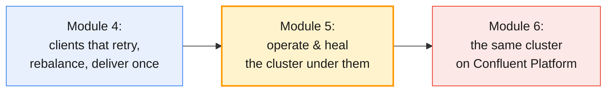

This module completes the **core Apache Kafka administration** half of the
course. From Module 6 onwards you do the same work through Confluent's tools —
and you will recognise every operation underneath them.

By the end of this module you will be able to:

- Explain how followers stay in the **ISR**, what shrinks and expands it, and
  read partition health states (under-replicated, at/under min ISR, offline).
- Predict what happens during a **broker failure** — leader election, ISR
  changes, producer and consumer impact — and use **rack awareness** and
  **preferred leader election** to keep the cluster balanced.
- **Add and decommission brokers**, and move data with
  `kafka-reassign-partitions.sh` (`--generate`, `--execute`, `--verify`) using
  **throttles** so production traffic is not starved.
- Run a **rolling restart** and a **rolling upgrade** of a KRaft cluster,
  including the `kafka-features.sh` finalisation step.
- **Size a cluster** for throughput, storage, partitions and failure headroom.

---

## 2. Replication and the ISR in depth

Module 1 §6.3 introduced leaders, followers and the ISR; Module 3 §6 showed
how `acks` and `min.insync.replicas` turn them into a durability contract.
This section looks at the **mechanics** you need to operate the cluster: what
the replicas are actually doing, and how to read their state.

### 2.1 How followers replicate

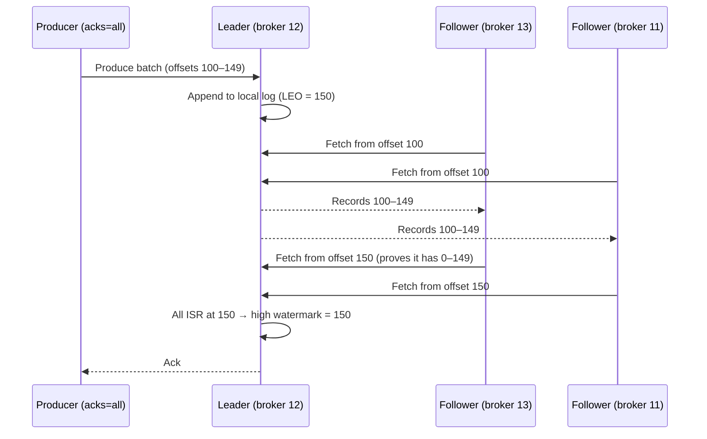

Followers are just **consumers of the leader**: they send fetch requests with
the next offset they need. That fetch offset is also the follower's proof of
progress — when a follower asks for offset 150, the leader knows it holds
everything below 150. When every ISR member has reached an offset, the leader
advances the **high watermark** and the record becomes visible to consumers
(Module 1 §6.4).

| Term | Where it lives | Meaning |
| ---- | -------------- | ------- |
| **LEO (log end offset)** | Every replica | Next offset that replica will write |
| **High watermark (HW)** | Leader (propagated to followers) | Offsets below it are committed: replicated to the whole ISR |
| **Replicas** | KRaft metadata | The assigned replica list, in **preference order** |
| **ISR** | KRaft metadata | Replicas currently caught up with the leader |
| **Leader epoch** | KRaft metadata, log | Increments on every leader change; fences stale leaders and drives log truncation |

### 2.2 What shrinks and expands the ISR

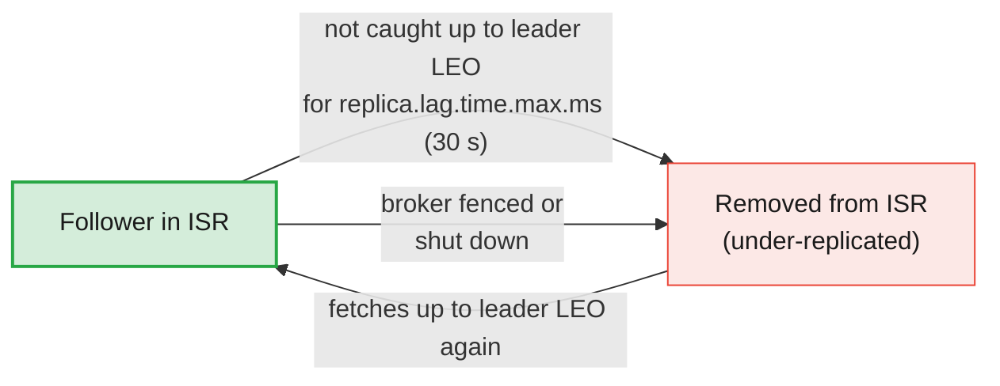

The rule is **time-based**, not message-based: a follower that has not caught
up to the leader's log end within `replica.lag.time.max.ms` (default 30 s) is
removed from the ISR. Typical causes:

| Cause | What you see | Fix |
| ----- | ------------ | --- |
| **Broker down or fenced** | All its replicas leave every ISR at once | Restart it (§3) |
| **Slow disk on the follower** | One broker's replicas flap in and out of ISR | Check disk latency; move partitions away (§5) |
| **Network saturation** | Many followers lag during peaks or reassignment | Throttle reassignment (§5.4); add capacity (§7) |
| **Too few replica fetcher threads** | Lag grows with partition count | Raise `num.replica.fetchers` (cluster-wide dynamic) |
| **Huge batches / message size** | Lag spikes on specific topics | Align `replica.fetch.max.bytes` with `message.max.bytes` |

Expansion is automatic: once the follower's fetch offset reaches the leader's
LEO, the leader asks the controller to add it back.

> **Common trap for MQ administrators:** "Under-replicated" is not an error
> state that someone must acknowledge — it is Kafka telling you that your
> safety margin is smaller *right now*. With RF 3 and `min.insync.replicas=2`
> the topic still accepts `acks=all` writes with one replica missing. The
> alarm that matters is the next one: **under min ISR**.

### 2.3 Partition health states

`kafka-topics.sh --describe` has filters that turn the ISR rules into a health
report. They are the first commands you run during any operation.

```bash
# Partitions whose ISR is smaller than the replica list
kafka-topics.sh --bootstrap-server $APACHE --command-config $CFG --describe --under-replicated-partitions
# ISR == min.insync.replicas: one more failure stops acks=all writes
kafka-topics.sh --bootstrap-server $APACHE --command-config $CFG --describe --at-min-isr-partitions
# ISR <  min.insync.replicas: acks=all writes are failing NOW
kafka-topics.sh --bootstrap-server $APACHE --command-config $CFG --describe --under-min-isr-partitions
# No leader at all: neither reads nor writes
kafka-topics.sh --bootstrap-server $APACHE --command-config $CFG --describe --unavailable-partitions
```

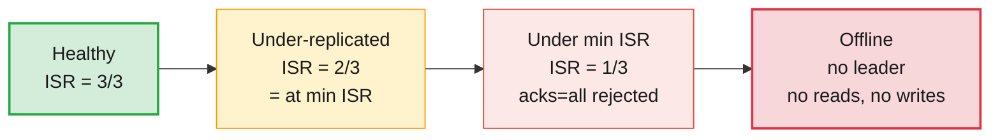

| State (RF 3, min ISR 2) | Producers `acks=all` | Producers `acks=1` | Consumers | Urgency |
| ----------------------- | -------------------- | ------------------ | --------- | ------- |
| **Healthy** | ✅ | ✅ | ✅ | — |
| **Under-replicated / at min ISR** | ✅ | ✅ | ✅ | Fix within hours; no second failure margin |
| **Under min ISR** | ❌ `NotEnoughReplicas` | Appends, but HW frozen (Module 3 §6.2) | Read up to HW only | Page someone |
| **Offline** | ❌ | ❌ | ❌ | Outage |

### 2.4 Eligible Leader Replicas (ELR)

From Kafka 4.1, new clusters also track **Eligible Leader Replicas**
([KIP-966](https://cwiki.apache.org/confluence/display/KAFKA/KIP-966%3A+Eligible+Leader+Replicas)):
replicas that dropped out of the ISR *while the ISR was below
`min.insync.replicas`*, and therefore still hold every committed record. You
have seen the empty `Elr:` and `LastKnownElr:` columns in every describe output
since Module 1. When the ISR collapses, ELR lets the controller elect a replica
that is known to be safe instead of waiting for — or being tempted into —
unclean election (§3.3).

> **Administrator takeaway:** ISR describes *who is caught up now*; ELR
> describes *who is still safe to lead*. A non-empty `Elr` during an incident
> is good news: recovery without data loss is still possible.

---

## 3. Leader election and handling broker failures

### 3.1 Who decides: the KRaft controller

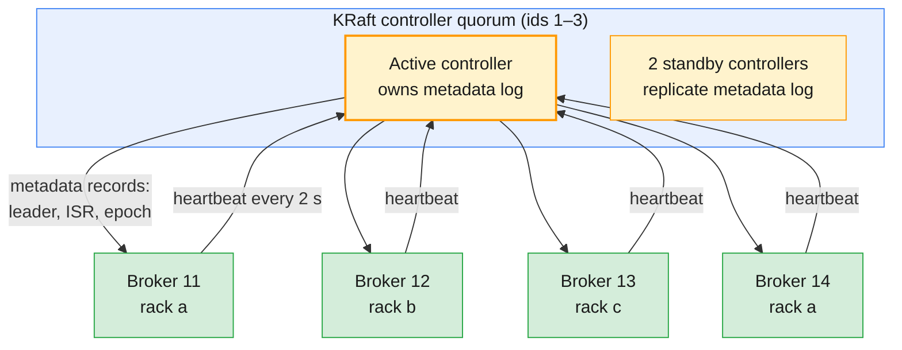

Every leader and ISR change is a record in the KRaft metadata log (Module 2
§5, Module 3 §4.3). The **active controller** decides; brokers learn the result
by replaying the log. Brokers prove they are alive by heartbeating to the
active controller every `broker.heartbeat.interval.ms` (default 2 s). A broker
that misses heartbeats for `broker.session.timeout.ms` (default 9 s) is
**fenced**: the controller removes it from every ISR and moves its leaderships.

The diagram is the shared course cluster: 3 dedicated controllers and 4
brokers (ids 11–14) on racks `ap-south-1a/b/c/a`. Dedicated controllers mean
a broker failure never touches the quorum — unlike your local Module 2 cluster,
where every node is broker **and** controller (Module 2 §6).

### 3.2 Anatomy of a broker failure

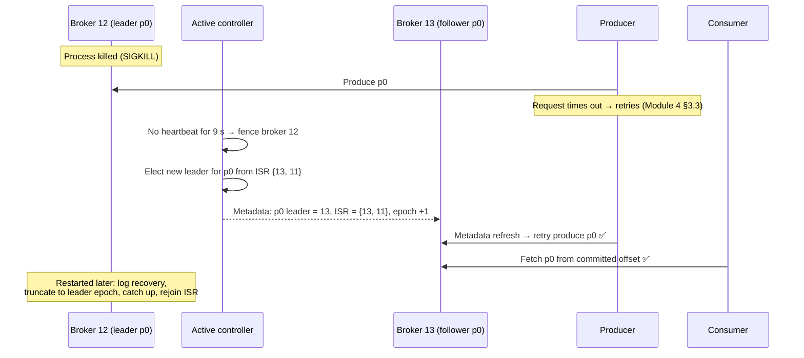

| Phase | Graceful stop (`SIGTERM`) | Hard failure (`SIGKILL`, power, network) |
| ----- | ------------------------- | ---------------------------------------- |
| **Detection** | Broker tells the controller it is leaving | Missed heartbeats: up to `broker.session.timeout.ms` (9 s) |
| **Leadership move** | *Before* shutdown (controlled shutdown) — clients barely notice | *After* fencing — clients retry for seconds |
| **Restart** | Clean logs, fast start | Log recovery on unflushed segments; can take minutes on big brokers |
| **Data** | No loss | No committed data lost with RF 3 + min ISR 2 + `acks=all` |

**Controlled shutdown** (`controlled.shutdown.enable`, default `true`) is why
you always stop brokers with `systemctl stop kafka` or `docker stop` (both
send `SIGTERM`) and never with `kill -9`. On restart the returning broker
truncates any records beyond what the current leader has (using the leader
epoch), fetches the rest and rejoins the ISR.

> **The production baseline:** with RF 3, `min.insync.replicas=2`,
> `acks=all`, idempotent producers and `unclean.leader.election.enable=false`,
> a single broker failure costs **seconds of retries and zero records**. If a
> broker failure ever loses data in your cluster, one of these five settings
> is wrong — Module 9 is about finding which.

### 3.3 Clean vs unclean leader election

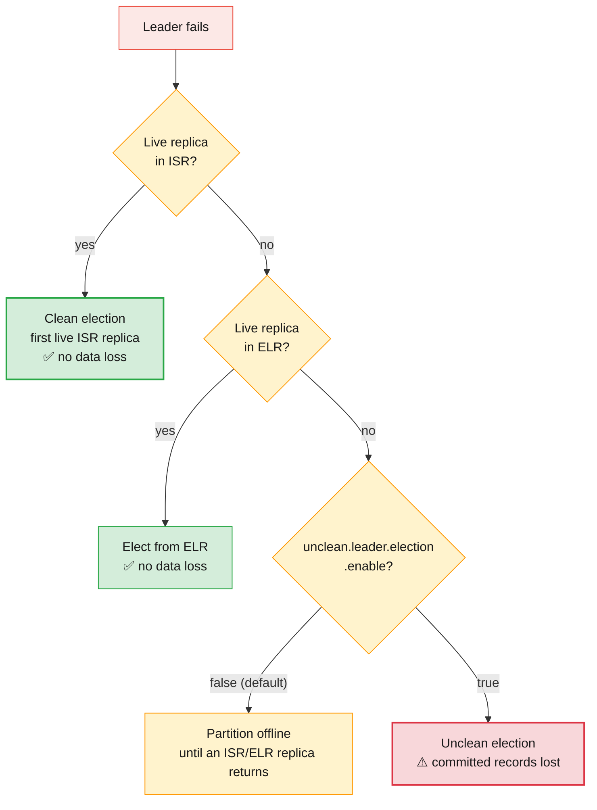

`unclean.leader.election.enable` (default `false`, settable cluster-wide or per
topic) is the classic availability-versus-durability switch. For CDRs that
become invoices, the answer is always `false`: an hour of outage is a
post-mortem; a lost hour of billing records is a regulatory finding.

As a last resort an administrator can force an unclean election on one
partition — a deliberate, documented data-loss decision:

```bash
kafka-leader-election.sh --bootstrap-server $BS --election-type unclean \
  --topic lNN.cdr.voice --partition 3
```

> **Common trap:** enabling `unclean.leader.election.enable` cluster-wide
> "temporarily" during an incident and forgetting to remove it. Use the
> per-partition command above instead, write it in the incident log, and
> leave the config alone.

### 3.4 Preferred leaders and leader balance

```mermaid
flowchart LR
    subgraph BEFORE["After broker 12 restarts"]
        A1["Broker 11: 3 leaders"]
        A2["Broker 12: 0 leaders"]
        A3["Broker 13: 3 leaders"]
    end
    subgraph AFTER["After preferred election"]
        B1["Broker 11: 2 leaders"]
        B2["Broker 12: 2 leaders"]
        B3["Broker 13: 2 leaders"]
    end
    BEFORE -->|"auto.leader.rebalance<br/>or kafka-leader-election.sh"| AFTER

    style BEFORE fill:#e8f0fe,stroke:#4285f4,stroke-width:1px,color:#1a1a1a
    style AFTER fill:#e8f0fe,stroke:#4285f4,stroke-width:1px,color:#1a1a1a
    style A2 fill:#fce8e6,stroke:#ea4335,stroke-width:1px,color:#1a1a1a
    style A1 fill:#fff3cd,stroke:#ff9800,stroke-width:1px,color:#1a1a1a
    style A3 fill:#fff3cd,stroke:#ff9800,stroke-width:1px,color:#1a1a1a
    style B1 fill:#d4edda,stroke:#28a745,stroke-width:1px,color:#1a1a1a
    style B2 fill:#d4edda,stroke:#28a745,stroke-width:1px,color:#1a1a1a
    style B3 fill:#d4edda,stroke:#28a745,stroke-width:1px,color:#1a1a1a
```

When a broker comes back it rejoins the ISRs as a **follower** — its old
leaderships stay where failover put them. Leaders do all the produce and
most of the fetch work, so an unbalanced cluster runs hot on some brokers.

The **preferred leader** is the first broker in a partition's replica list
(`Replicas: 12,13,11` → 12). Kafka moves leadership back to it in two ways:

| Mechanism | Setting / command | Notes |
| --------- | ----------------- | ----- |
| **Automatic** | `auto.leader.rebalance.enable=true` (default) | Checked every `leader.imbalance.check.interval.seconds` (300); acts when a broker's non-preferred share exceeds `leader.imbalance.per.broker.percentage` (10) |
| **Manual** | `kafka-leader-election.sh --election-type preferred` | Immediate; use after a restart or reassignment |

```bash
# Move every partition's leadership back to its preferred replica
kafka-leader-election.sh --bootstrap-server $BS --election-type preferred --all-topic-partitions
# Or just one topic partition
kafka-leader-election.sh --bootstrap-server $BS --election-type preferred --topic lNN.cdr.voice --partition 0
```

Preferred election only balances **leaders across existing replicas**. If the
replicas themselves are on the wrong brokers, you need a reassignment (§5).

### 3.5 Rack awareness: surviving a zone

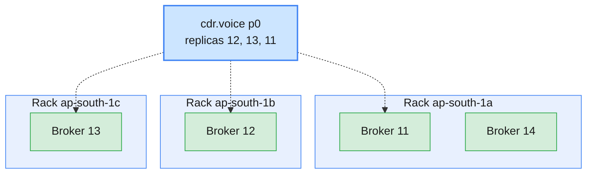

Set `broker.rack` (static, per broker) to the failure domain — an AWS
availability zone, a data-centre hall, a rack. Topic creation and
`kafka-reassign-partitions.sh --generate` then spread each partition across
`min(#racks, RF)` racks. With RF 3 on three racks, losing an entire zone takes
**one** replica from every partition: every topic stays at min ISR and keeps
accepting `acks=all` writes.

> **Design note:** the course cluster has two brokers in rack `a` and one each
> in `b` and `c`. Rack-aware placement still gives one replica per rack, which
> means brokers 11 and 14 *share* rack `a`'s replicas and carry fewer each.
> The Kafka docs recommend the same number of brokers per rack for exactly
> this reason — remember it when you plan the next expansion (§7.6).

### 3.6 Failure scenarios at a glance

| Failure (RF 3, min ISR 2, 3 racks) | Partitions affected | Writes (`acks=all`) | What you do |
| ---------------------------------- | ------------------- | ------------------- | ----------- |
| **One broker** | Its replicas → under-replicated | ✅ | Restart; preferred election |
| **One rack / AZ** | One replica of every partition | ✅ | Restore the zone; check client timeouts |
| **Two brokers in different racks** | Partitions with replicas on both → under min ISR | ❌ for those partitions | Restore one broker fast |
| **All replicas of a partition** | That partition offline | ❌ | Restore a replica; unclean election only as a documented decision |
| **One controller (of 3)** | None — standby takes over | ✅ | Replace the node |
| **Two controllers (of 3)** | Quorum lost: no metadata changes (no elections, no topic or config changes) | Risky | Restore quorum immediately |
| **One disk in a JBOD broker** | Replicas on that log dir go offline; broker keeps serving others | ✅ (other replicas) | Replace disk (Module 3 §3.4) |

---

## 4. Adding and removing brokers

### 4.1 Adding a broker moves nothing

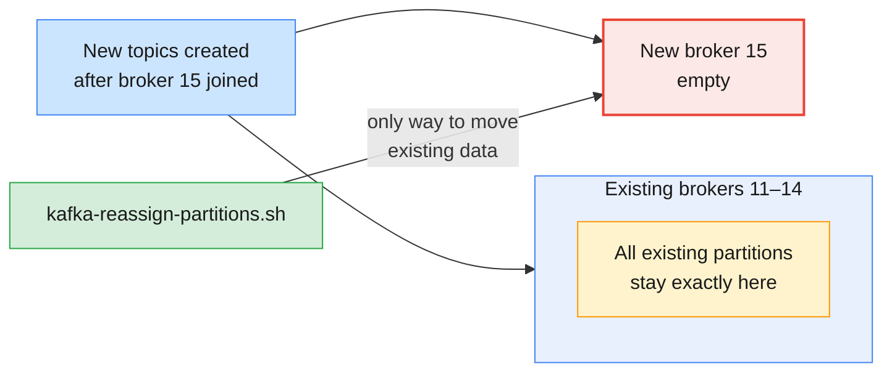

A new broker registers with the controller and is immediately available — for
**new** partitions. Kafka never moves existing partitions on its own. Until you
reassign, the "expanded" cluster has the same hot brokers it had before.

Steps to add a broker to a KRaft cluster:

| # | Step | Tool / setting |
| - | ---- | -------------- |
| 1 | Provision the host: same Kafka version, Java 17+, disks, OS limits (§7.5) | Module 2 §2–§3 |
| 2 | Write `server.properties`: unique `node.id`, `process.roles=broker`, same `controller.quorum.voters` (or bootstrap controllers), listeners, `broker.rack` | Module 2 §3.3 |
| 3 | Format storage with the **existing cluster ID** — never a new one | `kafka-storage.sh format -t <cluster-id> -c server.properties` |
| 4 | Start the broker and check it registered | `kafka-broker-api-versions.sh` lists the new id |
| 5 | Move partitions onto it, with a throttle | §5 |
| 6 | Run a preferred leader election and check balance | §3.4 |

> **Common trap:** formatting the new broker with `kafka-storage.sh random-uuid`
> output (a new cluster ID). The broker will refuse to join the existing
> cluster. Get the real ID with `kafka-cluster.sh cluster-id --bootstrap-server ...`.

### 4.2 Decommissioning a broker

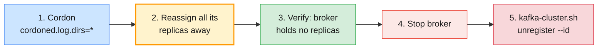

Removing a broker is the reverse, with one safety step at the front.
**Cordoning** (Kafka 4.x,
[KIP-1066](https://cwiki.apache.org/confluence/display/KAFKA/KIP-1066%3A+Mechanism+to+cordon+brokers+and+log+directories))
tells the controller not to place any *new* partitions on a broker or log
directory, so you are not chasing topics created during the drain:

```bash
# 1. Cordon every log directory on broker 14 (per-broker dynamic config)
kafka-configs.sh --bootstrap-server $BS --command-config $ADMIN --alter \
  --entity-type brokers --entity-name 14 --add-config cordoned.log.dirs="*"

# 2–3. Generate a plan that uses only the remaining brokers, execute with a throttle, verify (§5)
kafka-reassign-partitions.sh --bootstrap-server $BS --command-config $ADMIN \
  --topics-to-move-json-file all-topics.json --broker-list "11,12,13" --generate

# 5. After the broker is stopped and holds nothing, remove its registration
kafka-cluster.sh unregister --bootstrap-server $BS --command-config $ADMIN --id 14
```

(`$ADMIN` stands for an administrator's client config; learners on the shared
cluster do not have the cluster `Alter` permission these commands need.)

> **Common trap:** stopping a broker *before* draining it. Every partition it
> hosted is under-replicated until it returns — and it never will. Drain first,
> stop second. The same applies to removing a whole rack: drain onto the
> remaining racks and check the plan keeps one replica per rack.

### 4.3 What about controllers?

Controllers are not brokers: they hold no partition data, so there is nothing
to reassign. Kafka 4.x supports **dynamic quorum membership**
([KIP-853](https://cwiki.apache.org/confluence/display/KAFKA/KIP-853%3A+KRaft+Controller+Membership+Changes)):
`kafka-metadata-quorum.sh add-controller` and `remove-controller` change the
voter set without a cluster-wide restart, provided the cluster was formatted
for a dynamic quorum. Keep 3 controllers for small and medium clusters, 5 when
you need to survive two controller failures; always an odd number, spread
across racks.

```bash
# Read-only health of the quorum: leader, epoch, voters, observers and their lag
kafka-metadata-quorum.sh --bootstrap-server $APACHE --command-config $CFG describe --status
kafka-metadata-quorum.sh --bootstrap-server $APACHE --command-config $CFG describe --replication
```

---

## 5. Partition reassignment and cluster balancing

### 5.1 What a reassignment does inside the cluster

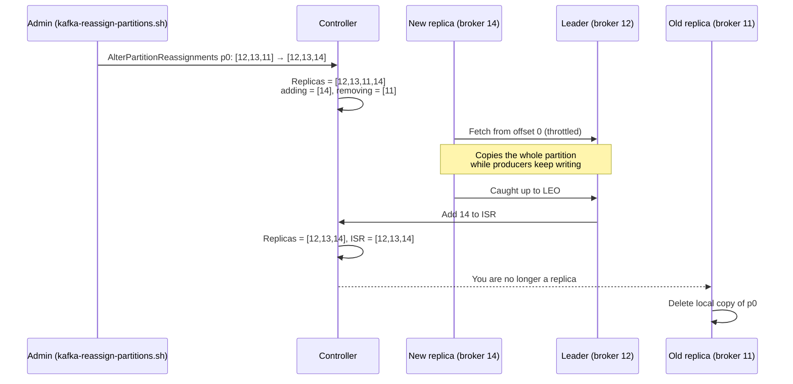

A reassignment ([KIP-455](https://cwiki.apache.org/confluence/display/KAFKA/KIP-455%3A+Create+an+Administrative+API+for+Replica+Reassignment))
**adds before it removes**. For the duration of the move the partition has
*more* replicas than its replication factor, so durability never drops. The
cost is time and bandwidth: the new replica copies the entire partition,
including every retained day of CDRs, while live traffic continues.

| Use case | What changes in the JSON |
| -------- | ------------------------ |
| **Spread onto a new broker** | Some replica lists now include the new id |
| **Drain a broker** | No replica list contains the old id |
| **Increase replication factor** | Longer replica lists (e.g. `[12,13]` → `[12,13,14]`) — the only way to change RF |
| **Change preferred leader** | Same brokers, different order (`[13,12,11]`); then preferred election |
| **Move between log dirs on one broker** | `"log_dirs"` entries; throttle with `--replica-alter-log-dirs-throttle` |

### 5.2 The three-step workflow

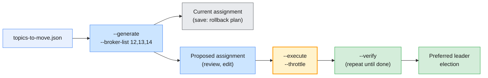

**Step 1 — generate.** You list the topics; the tool proposes a balanced,
rack-aware layout over the brokers you name. It changes nothing.

```bash
cat > topics-to-move.json <<EOF
{"topics": [{"topic": "lNN.cdr.voice"}], "version": 1}
EOF

kafka-reassign-partitions.sh --bootstrap-server $APACHE --command-config $CFG \
  --topics-to-move-json-file topics-to-move.json --broker-list "12,13,14" --generate
```

The output has two JSON documents, each on one line, under the headings
**Current partition replica assignment** and **Proposed partition
reassignment configuration**. Save both: the current one is your rollback
plan.

```json
{"version":1,"partitions":[
  {"topic":"lNN.cdr.voice","partition":0,"replicas":[13,12,14],"log_dirs":["any","any","any"]},
  {"topic":"lNN.cdr.voice","partition":1,"replicas":[14,13,12],"log_dirs":["any","any","any"]}
]}
```

(Pretty-printed for reading; the tool prints one line.) You may edit the
proposal — or write the whole file by hand — as long as each partition keeps
distinct broker ids and the order reflects the preferred leader you want.

**Step 2 — execute, with a throttle.**

```bash
kafka-reassign-partitions.sh --bootstrap-server $BS --command-config $ADMIN \
  --reassignment-json-file reassign.json --execute --throttle 50000000   # 50 MB/s
```

**Step 3 — verify until complete.** `--verify` reports each partition as
completed or still in progress and, once everything is complete, **removes
the throttle**. Running it is not optional: a forgotten throttle silently
slows normal follower catch-up for months.

```bash
kafka-reassign-partitions.sh --bootstrap-server $BS --command-config $ADMIN \
  --reassignment-json-file reassign.json --verify
# What is moving right now, cluster-wide
kafka-reassign-partitions.sh --bootstrap-server $BS --command-config $ADMIN --list
```

| Flag | Purpose |
| ---- | ------- |
| `--generate` + `--topics-to-move-json-file` + `--broker-list` | Propose a plan (read-only) |
| `--disable-rack-aware` | Ignore `broker.rack` when generating (rarely what you want) |
| `--execute` + `--reassignment-json-file` | Start the moves |
| `--throttle <bytes/s>` | Cap inter-broker replication traffic for the moving replicas |
| `--additional` | Start a reassignment while another runs, or **change the throttle** of a running one (resubmit with a new `--throttle`) |
| `--disallow-replication-factor-change` | Reject plans that would change RF by accident |
| `--verify` | Check completion; clears throttles when done |
| `--preserve-throttles` | With `--verify`: report only, leave throttle configs alone |
| `--list` | Show all active reassignments |
| `--cancel` + `--reassignment-json-file` | Stop the moves and roll back to the original replicas |

> **On the course cluster:** the shared cluster is **managed by the
> trainer**. `--execute`, `--cancel` and the throttle cleanup need the cluster
> `Alter` permission that learners never get. You run `--generate`, `--list`
> and `--verify --preserve-throttles` on your own `lNN.*` topics; the trainer
> executes your plan. On your own Docker cluster you run every step yourself
> (§8.3).

### 5.3 Reading the plan before you press Enter

Review checklist for every plan, generated or hand-written:

| Check | Why |
| ----- | --- |
| **One replica per rack** | A careless plan can put two replicas in one AZ |
| **Leader distribution** | The first id per partition becomes preferred leader; spread them |
| **Data volume** | `kafka-log-dirs.sh --describe --topic-list ...` gives bytes per partition: estimate duration = bytes ÷ throttle |
| **RF unchanged (unless intended)** | Use `--disallow-replication-factor-change` as a guard |
| **Batch size of the plan** | Move a few topics per run; a plan with thousands of partitions is hard to monitor and cancel |
| **Rollback saved** | The "current" JSON from `--generate` |

### 5.4 Throttling: protecting production traffic

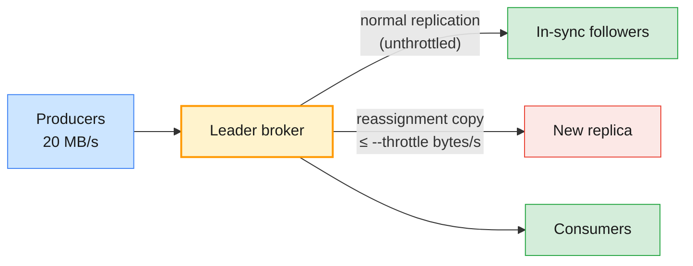

`--throttle` ([KIP-73](https://cwiki.apache.org/confluence/display/KAFKA/KIP-73+Replication+Quotas))
sets two kinds of dynamic config, which you can inspect while a move runs:

| Config | Entity | Set to |
| ------ | ------ | ------ |
| `leader.replication.throttled.rate` | Brokers involved | The `--throttle` value (bytes/s) |
| `follower.replication.throttled.rate` | Brokers involved | The `--throttle` value |
| `leader.replication.throttled.replicas` | Topic | The partition:broker pairs being copied *from* |
| `follower.replication.throttled.replicas` | Topic | The partition:broker pairs being copied *to* |

```bash
kafka-configs.sh --bootstrap-server $BS --describe --entity-type brokers --entity-name 14
kafka-configs.sh --bootstrap-server $BS --describe --entity-type topics --entity-name lNN.cdr.voice
```

Choosing the value: start with the spare network and disk capacity of the
busiest broker involved (§7.3), minus a safety margin. Then watch two things:
the new replicas must make progress (the docs suggest the follower
`ConsumerLag` metric; Module 8 builds the dashboards), and producer latency
and existing ISR must stay healthy. Too low and the move never finishes —
a partition receiving 10 MB/s cannot catch up with a 5 MB/s throttle.

> **Common trap:** a throttle lower than the partition's own write rate. The
> new replica falls further behind every second and the reassignment runs
> forever. Raise the throttle with `--execute --additional --throttle <new>`
> rather than cancelling.

### 5.5 Cluster balancing beyond one reassignment

"Balanced" has several dimensions, and the tools only handle some of them:

| Dimension | Built-in tool | Gap |
| --------- | ------------- | --- |
| **Leaders per broker** | Preferred election (§3.4), auto rebalance | Only across existing replicas |
| **Replicas per broker** | `--generate` | Counts partitions, ignores their size and traffic |
| **Bytes on disk per broker** | Manual plans from `kafka-log-dirs.sh` | Manual and slow |
| **Network / CPU load** | None in Apache Kafka | Needs metrics-driven tooling |

For large clusters, metrics-driven balancers do the arithmetic: the open-source
**Cruise Control** generates and executes throttled plans from broker load
metrics, and Confluent Platform's **Self-Balancing Clusters** does the same
inside the brokers (Module 6). Both still issue ordinary reassignments
underneath — which is why you learn the manual workflow first.

> **Administrator takeaways:** `--generate` balances partition *counts*, not
> bytes. One 2 TB billing topic and one 2 MB test topic count the same. Look at
> `kafka-log-dirs.sh` output before trusting a "balanced" plan.

---

## 6. Rolling restarts and upgrade considerations

### 6.1 The rolling restart loop

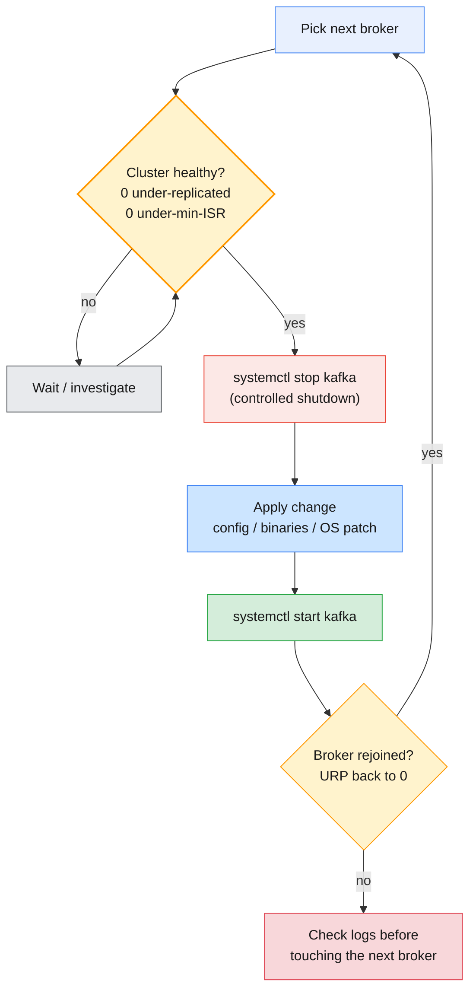

A rolling restart takes **one broker at a time** out of service. With RF 3 and
min ISR 2, every partition keeps a leader and enough ISR members while one
broker is down — *as long as the cluster was fully healthy when you started*.
The health gate is the whole technique:

```bash
# Health gate between brokers (run from an admin host)
until [ -z "$(kafka-topics.sh --bootstrap-server $BS --command-config $ADMIN \
               --describe --under-replicated-partitions)" ]; do
  echo "waiting for under-replicated partitions to clear..."; sleep 10
done
```

Practical rules:

| Rule | Reason |
| ---- | ------ |
| **Never restart two brokers at once** | Partitions with replicas on both drop under min ISR |
| **Active controller's host last** (combined mode) | Avoid repeated controller elections; dedicated controllers are rolled separately, one at a time |
| **Wait for URP = 0, not just "process up"** | A started broker may still be recovering logs or catching up |
| **Preferred election at the end** | Restarts leave leaders skewed (§3.4) |
| **Check client error rates during the roll** | Retries should absorb it; errors mean timeouts are too short (Module 4 §3.3) |

Remember Module 3 §2.2: most configuration changes are **dynamic** and need no
restart at all. A rolling restart is for static settings (`log.dirs`,
listeners, `broker.rack`, `node.id`), JVM or OS changes, and upgrades.

### 6.2 Upgrading a KRaft cluster

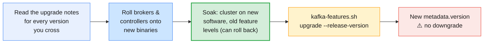

A KRaft upgrade has **two separate steps**:

1. **Software.** Roll the new binaries onto the nodes one at a time (§6.1).
   The cluster keeps running at its old **feature levels** —
   `metadata.version` and friends — so a node can still be rolled back to the
   previous binaries.
2. **Finalise.** Once you are satisfied, raise the feature levels for the
   whole cluster in one command. From this point new metadata formats are in
   use.

```bash
# What the cluster runs at now (supported range vs finalized level)
kafka-features.sh --bootstrap-server $BS describe
# Finalise after the soak period (--dry-run first shows what would change)
kafka-features.sh --bootstrap-server $BS --command-config $ADMIN upgrade --release-version 4.3 --dry-run
kafka-features.sh --bootstrap-server $BS --command-config $ADMIN upgrade --release-version 4.3
```

| Consideration | Kafka 4.x fact |
| ------------- | -------------- |
| **Upgrade path into 4.x** | Brokers must already run **KRaft** with software and metadata version ≥ 3.3; older KRaft clusters go via 3.9 first |
| **ZooKeeper clusters** | Must migrate to KRaft on 3.x *before* upgrading to 4.x (Module 1 §8.4) |
| **Java** | Brokers, Connect and tools need **Java 17+**; clients and Streams need Java 11+ |
| **Metadata downgrade** | Not supported for 4.3 — finalising is a one-way door |
| **New defaults** | Read the "notable changes" of every version crossed (e.g. 4.0's client defaults, Module 4 §3.1) |
| **Clients** | Upgrade brokers first; Kafka clients are compatible across broker versions via API version negotiation, but test the oldest clients you still run |

> **The production baseline:** upgrade a **staging** cluster with production
> configs first, roll production in a change window with the health gate
> between every node, soak for days, and only then run
> `kafka-features.sh upgrade`. Skipping the soak removes your rollback option.

### 6.3 Upgrade and restart checklist

| Before | During | After |
| ------ | ------ | ----- |
| Upgrade notes read; staging done | One node at a time; health gate between nodes | URP = 0, under-min-ISR = 0 |
| Cluster healthy; no reassignment running (`--list` empty) | Watch client error rates and request latency | Preferred leader election |
| Backups of configs; rollback binaries on the hosts | Controllers one at a time, quorum checked with `kafka-metadata-quorum.sh` | Soak, then `kafka-features.sh upgrade` |
| Change announced to client teams | Stop if any node fails to rejoin | Document versions and feature levels |

---

## 7. Cluster capacity planning

### 7.1 The dimensions

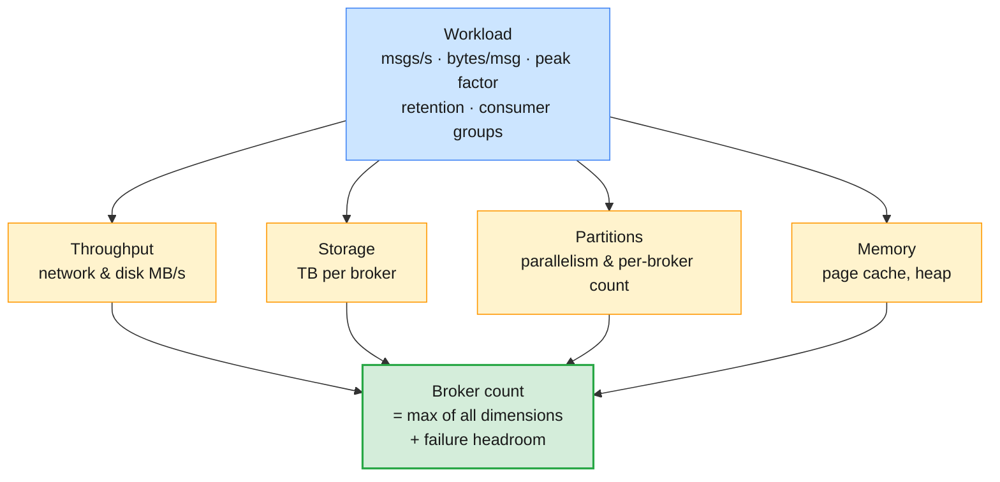

Capacity planning is arithmetic on a few workload numbers, done per
dimension. The broker count is the **largest** answer across dimensions, plus
headroom so the cluster survives a failure (and a reassignment) at peak.

| Input | Telecom example | Where it comes from |
| ----- | --------------- | ------------------- |
| **Peak write rate** | 25,000 CDRs/s | Mediation platform peak hour × growth |
| **Average record size (as stored)** | 800 bytes after compression | Measure with `kafka-log-dirs.sh` (Module 3 §7.1) |
| **Replication factor** | 3 | Durability baseline |
| **Retention** | 7 days | Business / replay requirement (Module 3 §5) |
| **Consumer groups reading everything** | 3 (billing, fraud, archive) | Application inventory |

Peak ingress = 25,000 × 800 B = **20 MB/s**.

### 7.2 Storage

```text
daily volume      = 20 MB/s × 86,400 s            ≈ 1.73 TB/day
retained volume   = 1.73 TB × 7 days              ≈ 12.1 TB
with RF 3         = 12.1 TB × 3                   ≈ 36.3 TB
at 60 % target    = 36.3 TB ÷ 0.6                 ≈ 60 TB of raw broker disk
```

The 60 % target leaves room for traffic growth, retention mistakes, the
extra replicas during a reassignment (§5.1), and one broker's data landing on
the survivors after a failure. With 12 TB of data disk per broker that is
**5–6 brokers** for storage alone. Use the average of the busiest day, not the
whole month — and if older data is rarely read, tiered storage (Module 3 §7.6)
changes this arithmetic more than any other lever.

### 7.3 Network and disk throughput

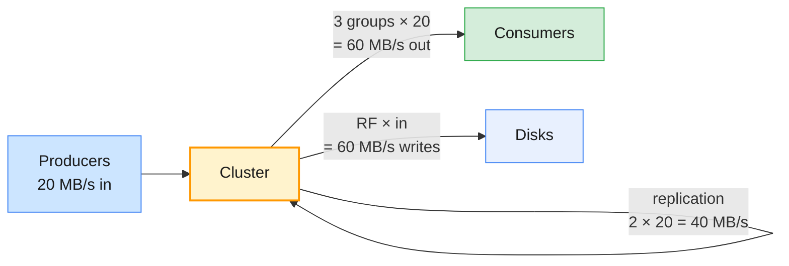

| Flow | Formula | Example |
| ---- | ------- | ------- |
| **Network in** | ingress × RF (client writes + replica fetches) | 20 × 3 = 60 MB/s |
| **Network out** | ingress × (RF − 1) + ingress × consumer groups | 40 + 60 = 100 MB/s |
| **Disk writes** | ingress × RF | 60 MB/s |
| **Disk reads** | Only for lagging consumers and reassignments (others read from page cache) | Plan for a replay at full speed |

Divide by the broker count and compare with what one broker can sustain on
your hardware — measured with `kafka-producer-perf-test.sh` and
`kafka-consumer-perf-test.sh` (Module 4 §3.6), not taken from a datasheet. Then
keep roughly **half** of each broker's capacity free: that headroom is your
reassignment throttle budget (§5.4) and your catch-up speed after a failure.

### 7.4 Partitions

Partition count per topic is a **parallelism** decision (Module 4 §4.1): the
maximum number of active consumers in a group equals the partition count.

```text
partitions ≥ max( target throughput ÷ throughput per producer partition,
                  target throughput ÷ throughput one consumer can process )
```

If one billing consumer instance processes 2 MB/s, 20 MB/s needs at least
10 partitions; choose **12** (growth, divides evenly over 3 or 6 brokers).
Adding partitions later is possible but changes key → partition mapping
(Module 4 §2.2), so size for 1–2 years.

Per broker, count **replicas**, not partitions: 12 partitions × RF 3 = 36
replicas. Every replica costs open files, memory-mapped index files and
replica-fetcher work, and every leader adds failover work. KRaft raised the
cluster-wide ceiling dramatically compared with ZooKeeper, but per broker a
few thousand replicas is a comfortable range on modest hardware; go beyond it
only with measurements.

### 7.5 Memory and OS limits

| Resource | Guidance (Apache Kafka "Hardware and OS") |
| -------- | ----------------------------------------- |
| **Page cache** | Enough free RAM to buffer about 30 s of writes: `write throughput × 30`. More lets lagging consumers read from memory |
| **JVM heap** | Modest (a few GB); Kafka relies on the page cache, not the heap |
| **File descriptors** | At least 100,000; roughly `partitions × (partition size ÷ segment size) + connections` |
| **`vm.max_map_count`** | Each segment needs 2 map areas; the Linux default (~65,535) is too low for many partitions |
| **Filesystem** | XFS recommended; separate data disks from OS and application logs |
| **Disks** | Throughput is usually the first bottleneck; several drives (JBOD) or RAID by policy (Module 3 §3.4) |

### 7.6 Failure headroom and the final answer

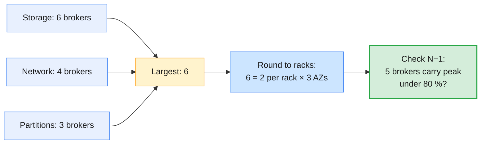

Three final adjustments turn the arithmetic into a design:

1. **Round to the rack layout.** Equal brokers per rack (§3.5): 6 brokers
   = 2 per AZ.
2. **Check N−1 (or N−rack).** With one broker down — or a whole AZ — can the
   remaining brokers carry peak traffic *and* re-replicate the missing data?
3. **Plan the next step.** Know which dimension runs out first and the lead
   time to add brokers plus the reassignment time to use them (§5.3).

> **The course cluster, sized the same way:** 4 brokers × 50 GB, shared by
> about 19 learners, each limited by a per-user produce quota per broker.
> It is deliberately small: a single unthrottled perf test could fill it,
> which is exactly why quotas (Module 3 lab) and reassignment throttles exist.

> **Common trap:** planning for the average. CDR traffic peaks in the evening
> and around festivals; month-end billing replays read 30 days at once.
> Capacity plans use **peak** rates, and test the replay as a scenario.

---

## 8. Hands-on lab: reassignment and broker failure

The Module 5 labs (`labs/module-05/`) are the runtime companion to this guide
and are still being written. This section previews them using the same
environment and conventions as the Module 3 and Module 4 labs. Two
environments are used, for a reason the course lab setup spells out:

| Part | Where | Why |
| ---- | ----- | --- |
| **A, B** — inspect and plan a reassignment | **Shared Apache cluster**, own `lNN.*` topics | Real 4-broker, 3-rack cluster; the trainer executes plans |
| **C** — execute a throttled reassignment; fail and recover brokers | **Own VM**: the Module 2 three-node Docker cluster | Killing a shared broker would disrupt every learner |
| **D** — real broker failure | **Shared cluster**, trainer demo | Announced in advance; you watch from your VM |

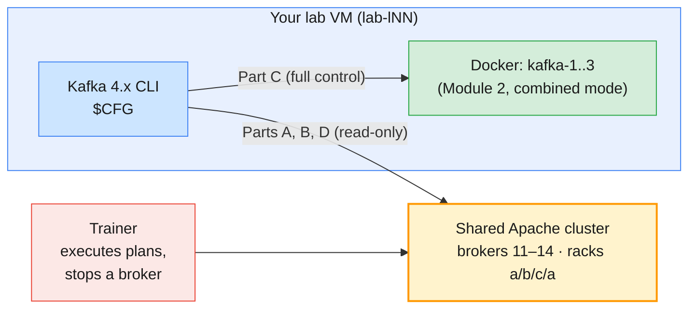

### 8.1 Part A — Read the shared cluster's topology

```bash
# (VM) the usual variables from Modules 3–4
APACHE=apache-kafka.lab.internal:9092
CFG=~/kafka/apache.properties
ME=lNN                          # your learner prefix

# 1. Brokers and their racks: one line per broker with "(id: NN rack: ...)"
kafka-broker-api-versions.sh --bootstrap-server $APACHE --command-config $CFG | grep "(id:"

# 2. The controller quorum: leader id, epoch, voters (1–3) and observers (the brokers)
kafka-metadata-quorum.sh --bootstrap-server $APACHE --command-config $CFG describe --status

# 3. Your Module 4 topic: 6 partitions, RF 3, which brokers, which leaders
kafka-topics.sh --bootstrap-server $APACHE --command-config $CFG --describe --topic $ME.cdr.voice

# 4. Health filters (you only see topics your ACLs allow)
kafka-topics.sh --bootstrap-server $APACHE --command-config $CFG --describe --under-replicated-partitions
kafka-topics.sh --bootstrap-server $APACHE --command-config $CFG --describe --under-min-isr-partitions

# 5. Feature levels the cluster is finalized at (§6.2)
kafka-features.sh --bootstrap-server $APACHE --command-config $CFG describe

# 6. Bytes per partition — the input for estimating a move's duration (§5.3)
kafka-log-dirs.sh --bootstrap-server $APACHE --command-config $CFG --describe --topic-list $ME.cdr.voice
```

Write down, for each partition of `$ME.cdr.voice`: the replica list, the
preferred leader, and the racks those brokers sit in. Is every partition on
three different racks? Which brokers carry the most of your leaders?

### 8.2 Part B — Prepare a reassignment plan for the trainer

You will move `$ME.cdr.voice` off broker 11 onto brokers 12, 13 and 14 — the
same steps as draining broker 11 (§4.2), limited to your own topic.

```bash
# (VM)
mkdir -p ~/m5 && cd ~/m5
cat > topics-to-move.json <<EOF
{"topics": [{"topic": "$ME.cdr.voice"}], "version": 1}
EOF

# 1. Generate (read-only)
kafka-reassign-partitions.sh --bootstrap-server $APACHE --command-config $CFG \
  --topics-to-move-json-file topics-to-move.json --broker-list "12,13,14" --generate | tee generate.out

# 2. Split the output: the line after each heading is the JSON
sed -n '/^Current partition replica assignment/{n;p;}' generate.out > $ME-rollback.json
sed -n '/^Proposed partition reassignment configuration/{n;p;}' generate.out > $ME-reassign.json
jq . $ME-reassign.json
```

Review `$ME-reassign.json` against the checklist in §5.3: is broker 11 gone,
is there one replica per rack (12 = b, 13 = c, 14 = a), are the preferred
leaders spread across 12, 13 and 14? Then hand the file to the trainer as
instructed in class. While the trainer executes it with a throttle, watch:

```bash
# 3. Is anything moving? (cluster-wide list, filtered by what you can describe)
kafka-reassign-partitions.sh --bootstrap-server $APACHE --command-config $CFG --list

# 4. Progress of YOUR plan; --preserve-throttles because clearing them needs cluster Alter
kafka-reassign-partitions.sh --bootstrap-server $APACHE --command-config $CFG \
  --reassignment-json-file $ME-reassign.json --verify --preserve-throttles

# 5. During the move: replica lists longer than RF (adding before removing, §5.1)
kafka-topics.sh --bootstrap-server $APACHE --command-config $CFG --describe --topic $ME.cdr.voice
```

**Checkpoint:** after completion, `Replicas` no longer contains 11 and
`ReplicationFactor` is still 3. Keep `$ME-rollback.json` — the trainer can
move you back with it.

### 8.3 Part C — Throttled reassignment and broker failure on your own cluster

Here you have full control, so you run `--execute` yourself and break
brokers on purpose. Remember the difference from the shared cluster: each of
your three containers is a broker **and** a controller.

```bash
# (VM) from the repo root: start the Module 2 cluster
docker compose -p kafka-m2 -f labs/module-02/docker-compose.yml up -d
docker exec -it kafka-1 bash
```

**C1 — Create a lopsided topic and fill it.**

```bash
# (container) $BS is already set to kafka-1:29092,kafka-2:29092,kafka-3:29092
ME=lNN
# 3 partitions, RF 2, all replicas on brokers 1 and 2 (broker 3 is empty)
kafka-topics.sh --bootstrap-server $BS --create --topic $ME.move.test \
  --replica-assignment 1:2,2:1,1:2
kafka-producer-perf-test.sh --topic $ME.move.test --num-records 150000 \
  --record-size 1000 --throughput -1 --producer-props bootstrap.servers=$BS acks=all
kafka-topics.sh --bootstrap-server $BS --describe --topic $ME.move.test
```

**C2 — Raise RF to 3 and spread leaders, with a throttle.**

```bash
# (container)
cat > /tmp/reassign.json <<EOF
{"version": 1, "partitions": [
  {"topic": "$ME.move.test", "partition": 0, "replicas": [1, 2, 3]},
  {"topic": "$ME.move.test", "partition": 1, "replicas": [2, 3, 1]},
  {"topic": "$ME.move.test", "partition": 2, "replicas": [3, 1, 2]}
]}
EOF
kafka-reassign-partitions.sh --bootstrap-server $BS \
  --reassignment-json-file /tmp/reassign.json --execute --throttle 5000000     # 5 MB/s

# While it runs: the throttle configs on broker and topic (§5.4)
kafka-configs.sh --bootstrap-server $BS --describe --entity-type brokers --entity-name 3
kafka-configs.sh --bootstrap-server $BS --describe --entity-type topics --entity-name $ME.move.test

# Repeat until every partition reports completed; the last run removes the throttle
kafka-reassign-partitions.sh --bootstrap-server $BS --reassignment-json-file /tmp/reassign.json --verify

# Leadership follows the new preferred leaders only after an election
kafka-leader-election.sh --bootstrap-server $BS --election-type preferred --all-topic-partitions
kafka-topics.sh --bootstrap-server $BS --describe --topic $ME.move.test
```

About 50 MB per partition at 5 MB/s: the move takes tens of seconds, long
enough to catch it in progress. Describe again after `--verify` reports
completion: RF 3, and the broker configs no longer show a throttle.

**C3 — Graceful broker stop.** Open a second terminal on the VM.

```bash
# (VM) terminal 2 — SIGTERM: controlled shutdown
docker compose -p kafka-m2 -f labs/module-02/docker-compose.yml stop kafka-3
```

```bash
# (container) terminal 1 — the damage report (2>/dev/null hides kafka-3 DNS warnings)
kafka-topics.sh --bootstrap-server $BS --describe --topic $ME.move.test 2>/dev/null
kafka-topics.sh --bootstrap-server $BS --describe --under-replicated-partitions 2>/dev/null
kafka-topics.sh --bootstrap-server $BS --describe --at-min-isr-partitions 2>/dev/null
# acks=all still works with ISR 2
echo "still-writable" | kafka-console-producer.sh --bootstrap-server $BS \
  --topic $ME.move.test --producer-property acks=all 2>/dev/null
# In combined mode the quorum also lost a voter: 2 of 3 remain
kafka-metadata-quorum.sh --bootstrap-server $BS describe --status 2>/dev/null
```

**C4 — Recover and rebalance leadership.**

```bash
# (VM) terminal 2
docker compose -p kafka-m2 -f labs/module-02/docker-compose.yml start kafka-3
```

```bash
# (container) after ~20 s: ISR back to 3, but broker 3 leads nothing
kafka-topics.sh --bootstrap-server $BS --describe --topic $ME.move.test
kafka-leader-election.sh --bootstrap-server $BS --election-type preferred --all-topic-partitions
kafka-topics.sh --bootstrap-server $BS --describe --topic $ME.move.test
```

**C5 — Hard failure.** Repeat C3 with a kill instead of a stop, and time how
long the old leaderships stay on the dead broker:

```bash
# (VM) terminal 2 — SIGKILL: no controlled shutdown
docker kill kafka-2
```

Describe the topic immediately and again after ~10 seconds. With `stop`, the
leaders moved *before* the broker went away; with `kill`, they move only once
the controller fences the broker after `broker.session.timeout.ms`. Restart
with `docker compose -p kafka-m2 -f labs/module-02/docker-compose.yml start kafka-2`
and read `docker logs kafka-2` for the log recovery that a clean shutdown
avoids.

> **Do not stop a second node** on this cluster: with combined mode, two
> nodes down means two of three controllers down — the quorum is lost and no
> leader elections can happen at all (§3.6). On the shared cluster, with
> dedicated controllers, the same experiment would "only" push partitions
> under min ISR.

```bash
# (container) clean up
kafka-topics.sh --bootstrap-server $BS --delete --topic $ME.move.test
```

### 8.4 Part D — Watch the trainer's broker failure on the shared cluster

At an announced time the trainer stops one broker of the shared cluster with
a controlled shutdown, then starts it again. Run these from your VM in a
loop and narrate what you see:

```bash
# (VM) every few seconds while the demo runs
kafka-topics.sh --bootstrap-server $APACHE --command-config $CFG --describe --topic $ME.cdr.voice
kafka-topics.sh --bootstrap-server $APACHE --command-config $CFG --describe --under-replicated-partitions
```

If your Module 4 producer is running with `acks=all` during the demo, it
should log retries at most — no failed sends. Afterwards, compare leader
placement before, during and after; the trainer's preferred election (or the
5-minute automatic one) moves leadership back.

| Observation | Concept | Where it's covered |
| ----------- | ------- | ------------------ |
| Every partition of `$ME.cdr.voice` has replicas on three different racks | Rack-aware placement | §3.5 |
| `--generate` prints a current and a proposed plan and changes nothing | Generate is read-only; current = rollback | §5.2 |
| During the move a partition lists four replicas | Reassignment adds before it removes | §5.1 |
| `--verify` without `--preserve-throttles` fails on the shared cluster | Throttle cleanup needs cluster `Alter`; trainer-managed cluster | §5.2 |
| Broker and topic show `*.replication.throttled.*` configs during C2 | Replication quotas | §5.4 |
| After a stop, ISR shrinks and `--at-min-isr-partitions` lists partitions | ISR and health states | §2.2, §2.3 |
| `acks=all` still succeeds with one broker down | min ISR 2 with RF 3 | §3.2, Module 3 §6 |
| Restarted broker rejoins ISR but leads nothing until an election | Preferred leader election | §3.4 |
| With `docker kill`, leaders stay on the dead broker for several seconds | Fencing after `broker.session.timeout.ms` | §3.1, §3.2 |
| The quorum shows a missing voter on the local cluster only | Combined vs dedicated controllers | §3.1, §4.3 |

---

## 9. Troubleshooting cluster operations

```mermaid
flowchart TB
    S["Symptom"] --> URP{"Under-replicated<br/>partitions?"}
    URP -->|"all on one broker"| B["Broker down or slow:<br/>process, disk, GC, network"]
    URP -->|"spread, during a move"| T["Reassignment traffic:<br/>check throttle and progress"]
    URP -->|none| L{"Leader skew<br/>or hot broker?"}
    L -->|yes| PE["Preferred election;<br/>then replica balance"]
    L -->|no| CL["Look at clients<br/>(Module 4 §11)"]

    style S fill:#cce5ff,stroke:#4285f4,stroke-width:1px,color:#1a1a1a
    style URP fill:#fff3cd,stroke:#ff9800,stroke-width:2px,color:#1a1a1a
    style B fill:#fce8e6,stroke:#ea4335,stroke-width:1px,color:#1a1a1a
    style T fill:#fce8e6,stroke:#ea4335,stroke-width:1px,color:#1a1a1a
    style L fill:#fff3cd,stroke:#ff9800,stroke-width:1px,color:#1a1a1a
    style PE fill:#d4edda,stroke:#28a745,stroke-width:1px,color:#1a1a1a
    style CL fill:#e8eaed,stroke:#5f6368,stroke-width:1px,color:#1a1a1a
```

| Symptom | Likely cause | Check / fix |
| ------- | ------------ | ----------- |
| **Reassignment never completes** | Throttle below the partition's write rate; target broker slow or full | `--verify`, `--list`; raise with `--execute --additional --throttle`; check disk |
| **`--execute` says a reassignment is already in progress** | Previous plan still running | `--list`; wait, or add `--additional` deliberately |
| **Followers slow everywhere after a move finished** | Throttle never removed (no `--verify` run) | `kafka-configs.sh --describe` on brokers/topics; run `--verify` |
| **One broker holds most leaders** | Restarts without preferred election; auto rebalance disabled | `kafka-leader-election.sh --election-type preferred` |
| **New broker idle after "expansion"** | Kafka does not move existing data | Reassign onto it (§4.1) |
| **New broker refuses to start / join** | Formatted with a new cluster ID; wrong quorum config | `meta.properties` cluster ID; `kafka-cluster.sh cluster-id` |
| **Partition offline after two failures** | All ISR replicas down; unclean election disabled | Restore a replica; unclean election only as a documented decision (§3.3) |
| **Producers get `NotEnoughReplicasException`** | ISR below `min.insync.replicas` | `--under-min-isr-partitions`; recover brokers |
| **Restarted broker takes minutes to come up** | Log recovery after an unclean shutdown | Use controlled shutdown; tune `num.recovery.threads.per.data.dir` |
| **Clients error out during a rolling restart** | Client timeouts shorter than failover; two brokers down | Module 4 §3.3 timeouts; enforce the health gate (§6.1) |
| **`kafka-features.sh upgrade` refused** | Some node still on old software | Finish the roll; check every node's version |
| **`ClusterAuthorizationException` on `--execute` (course cluster)** | Expected: learners cannot alter the cluster | Hand the plan to the trainer (§8.2) |

---

## 10. Bridging to the rest of the course

| Question this module raises | Answered in |
| --------------------------- | ----------- |
| How do Confluent's tools (Control Center, Self-Balancing Clusters) do these operations? | Module 6 |
| Who is allowed to run reassignments and alter cluster configs — and how is that enforced? | Module 7 |
| How do I watch URP, ISR shrink rate, reassignment progress and capacity trends continuously? | Module 8 |
| Which operational mistakes actually lose messages, and how do I prove it? | Module 9 |
| How do I survive losing a whole cluster or region, and migrate between clusters? | Module 10 |

```mermaid
flowchart LR
    M5["Module 5:<br/>ops, replication & HA<br/>(Apache Kafka)"] --> M6["Module 6:<br/>Confluent Platform<br/>architecture & admin"]
    M6 --> M8["Module 8:<br/>monitoring &<br/>performance tuning"]
    M8 --> M10["Module 10:<br/>backup, DR<br/>& migration"]
    style M5 fill:#fff3cd,stroke:#ff9800,stroke-width:2px,color:#1a1a1a
    style M6 fill:#fce8e6,stroke:#ea4335,stroke-width:1px,color:#1a1a1a
    style M8 fill:#fce8e6,stroke:#ea4335,stroke-width:1px,color:#1a1a1a
    style M10 fill:#fce8e6,stroke:#ea4335,stroke-width:1px,color:#1a1a1a
```

Previous guides: [Module 3](./module-03-cluster-configuration-storage-retention.md)
for `min.insync.replicas` and storage, and
[Module 4](./module-04-producing-consuming-messages.md) for the client
behaviour that makes failovers invisible.

---

## 11. Key takeaways

1. **The ISR is time-based.** A follower stays in it by catching up to the
   leader within `replica.lag.time.max.ms`; under-replicated is a warning,
   under min ISR is an outage for `acks=all` producers.
2. **The KRaft controller decides leadership.** Brokers heartbeat to it and
   are fenced after `broker.session.timeout.ms`; every leader and ISR change
   is a metadata record.
3. **Stop brokers gracefully.** Controlled shutdown moves leaders before the
   broker leaves; `kill -9` costs seconds of unavailability and log recovery.
4. **Unclean election trades data for availability.** Keep it `false`; use a
   one-off `kafka-leader-election.sh --election-type unclean` only as a
   documented decision. ELR makes safe recovery more likely.
5. **Rack awareness turns zones into failure domains.** `broker.rack` plus
   RF 3 over three racks survives the loss of an entire AZ; keep brokers per
   rack equal.
6. **New brokers get no data by themselves.** Expansion and decommissioning
   are reassignments; cordon a broker before draining it.
7. **Reassignment is generate → execute (throttled) → verify.** It adds
   replicas before removing them, and `--verify` is what removes the
   throttle.
8. **Rolling means one broker at a time behind a health gate.** Wait for
   URP = 0 between nodes and finish with a preferred leader election.
9. **KRaft upgrades are two steps.** Roll the software first, soak, then
   `kafka-features.sh upgrade` — a one-way door for `metadata.version`.
10. **Capacity is the maximum of several calculations plus headroom.**
    Storage, network, partitions and memory each give a broker count; size
    for peak and for N−1.

---

## 12. Glossary

| Term | Definition |
| ---- | ---------- |
| **Replica list** | The ordered list of brokers assigned to a partition; the first is the preferred leader |
| **ISR (in-sync replicas)** | Replicas caught up with the leader within `replica.lag.time.max.ms` |
| **`replica.lag.time.max.ms`** | How long a follower may lag before it is removed from the ISR (default 30 s) |
| **LEO (log end offset)** | The next offset a replica will write |
| **High watermark** | Highest offset replicated to the whole ISR; consumers read up to it |
| **Leader epoch** | Counter incremented on each leader change; used to fence old leaders and truncate logs |
| **Under-replicated partition (URP)** | A partition whose ISR is smaller than its replica list |
| **Under min ISR** | ISR smaller than `min.insync.replicas`; `acks=all` writes fail |
| **Offline partition** | A partition with no leader; no reads or writes |
| **ELR (Eligible Leader Replicas)** | Replicas outside the ISR that still hold all committed data (KIP-966) |
| **Active controller** | The KRaft quorum leader that makes all metadata decisions |
| **Fencing** | The controller excluding a broker that stopped heartbeating, after `broker.session.timeout.ms` |
| **Controlled shutdown** | Graceful stop in which the broker hands over its leaderships first |
| **Unclean leader election** | Electing an out-of-sync replica; loses committed data |
| **Preferred leader** | The first replica in the replica list; the target of preferred election |
| **Leader imbalance** | Share of a broker's partitions not led by their preferred leader |
| **`broker.rack`** | Static broker setting naming its failure domain for rack-aware placement |
| **Partition reassignment** | Changing a partition's replica list; data is copied to new replicas while traffic continues |
| **Adding / removing replicas** | The temporary extra and departing replicas during a reassignment |
| **Replication throttle** | Bytes/s cap on reassignment traffic (`*.replication.throttled.rate`, KIP-73) |
| **Cordon** | Marking a broker or log directory so no new partitions are placed on it (`cordoned.log.dirs`) |
| **Unregister** | Removing a decommissioned broker's registration (`kafka-cluster.sh unregister`) |
| **Rolling restart** | Restarting brokers one at a time with a health check between each |
| **Feature level / `metadata.version`** | Cluster-wide version of metadata formats, raised with `kafka-features.sh` |
| **Dynamic quorum** | KRaft controller set that can change with `add-controller` / `remove-controller` (KIP-853) |
| **Headroom** | Spare capacity reserved for failures, reassignments and growth |
| **N−1 planning** | Sizing so the cluster carries peak load with one broker (or rack) lost |

---

## 13. References

**Apache Kafka (official)**

- Basic Kafka operations (graceful shutdown, leadership balancing, racks, expanding, decommissioning, throttling) — <https://kafka.apache.org/43/operations/basic-kafka-operations/>
- Design: replication — <https://kafka.apache.org/43/design/design/>
- Broker configuration reference — <https://kafka.apache.org/43/configuration/broker-configs/>
- KRaft operations — <https://kafka.apache.org/43/operations/kraft/>
- Upgrading to 4.3 — <https://kafka.apache.org/43/getting-started/upgrade/>
- Hardware and OS — <https://kafka.apache.org/43/operations/hardware-and-os/>
- Monitoring — <https://kafka.apache.org/43/operations/monitoring/>
- Multi-datacenter deployments — <https://kafka.apache.org/43/operations/datacenters/>

**Kafka Improvement Proposals (KIPs)**

- KIP-36: Rack aware replica assignment — <https://cwiki.apache.org/confluence/display/KAFKA/KIP-36+Rack+aware+replica+assignment>
- KIP-73: Replication Quotas — <https://cwiki.apache.org/confluence/display/KAFKA/KIP-73+Replication+Quotas>
- KIP-455: Create an Administrative API for Replica Reassignment — <https://cwiki.apache.org/confluence/display/KAFKA/KIP-455%3A+Create+an+Administrative+API+for+Replica+Reassignment>
- KIP-853: KRaft Controller Membership Changes — <https://cwiki.apache.org/confluence/display/KAFKA/KIP-853%3A+KRaft+Controller+Membership+Changes>
- KIP-966: Eligible Leader Replicas — <https://cwiki.apache.org/confluence/display/KAFKA/KIP-966%3A+Eligible+Leader+Replicas>
- KIP-1066: Mechanism to cordon brokers and log directories — <https://cwiki.apache.org/confluence/display/KAFKA/KIP-1066%3A+Mechanism+to+cordon+brokers+and+log+directories>

**Confluent**

- Kafka replication and committed messages — <https://docs.confluent.io/kafka/design/replication.html>
- Running Kafka in production — <https://docs.confluent.io/platform/current/kafka/deployment.html>
- Best practices for Kafka production deployments (post-deployment operations) — <https://docs.confluent.io/platform/current/kafka/post-deployment.html>
- Self-Balancing Clusters — <https://docs.confluent.io/platform/current/clusters/sbc/index.html>
- Upgrade Confluent Platform — <https://docs.confluent.io/platform/current/installation/upgrade.html>
- Kafka internals course — <https://developer.confluent.io/courses/architecture/get-started/>

**Ecosystem**

- Cruise Control (automated rebalancing and self-healing) — <https://github.com/cruise-control-for-kafka/cruise-control>

**Books**

- *Kafka: The Definitive Guide*, 2nd ed. (Shapira, Palino, Sivaram, Petty; O'Reilly)

---

> **Next module:** _Module 6 — Introducing Confluent Kafka: Platform, Architecture & Administration Basics_,
> where you carry these core administration skills onto Confluent Platform and
> Confluent Cloud: the platform architecture, Confluent vs Apache Kafka
> features and licensing, deployment models, the Confluent CLI, and topic
> management through Control Center.
