# Module 6 — Introducing Confluent Kafka: Platform, Architecture & Administration Basics

> **Course:** Apache Kafka & Confluent Kafka Administration
> **Module objective:** Transition core Kafka administration skills to the
> Confluent Kafka platform.

---

## Table of contents

1. [Why this module matters](#1-why-this-module-matters)
2. [Confluent Platform overview and architecture](#2-confluent-platform-overview-and-architecture)
3. [Confluent vs. Apache Kafka: features and licensing](#3-confluent-vs-apache-kafka-features-and-licensing)
4. [Deployment models: Confluent Cloud vs. self-managed Confluent Platform](#4-deployment-models-confluent-cloud-vs-self-managed-confluent-platform)
5. [Confluent CLI overview and authentication](#5-confluent-cli-overview-and-authentication)
6. [Confluent Control Center walkthrough](#6-confluent-control-center-walkthrough)
7. [Topic management via Confluent CLI and Control Center](#7-topic-management-via-confluent-cli-and-control-center)
8. [Hands-on lab: exploring Confluent and managing topics](#8-hands-on-lab-exploring-confluent-and-managing-topics)
9. [Troubleshooting common Confluent access issues](#9-troubleshooting-common-confluent-access-issues)
10. [Bridging to the rest of the course](#10-bridging-to-the-rest-of-the-course)
11. [Key takeaways](#11-key-takeaways)
12. [Glossary](#12-glossary)
13. [References](#13-references)

> **How to read the diagrams:** Diagrams are written in [Mermaid](https://mermaid.js.org/),
> which renders automatically in GitHub, VS Code (with a Mermaid extension), and most
> modern Markdown viewers. If a diagram appears as code, install/enable a Mermaid
> preview to see the rendered version.

> **Builds on:** [Module 5 — Cluster Operations, Replication & High Availability](./module-05-cluster-operations-replication-ha.md).
> This module assumes the KRaft architecture from Module 2 §5, topic
> management with `kafka-topics.sh` and `kafka-configs.sh` (Module 2 §8,
> Module 3 §4), and the operations toolkit from Module 5 — ISR, reassignment,
> rolling upgrades. It focuses on **doing the same administration on Confluent**:
> what the platform adds, how it is licensed and deployed, and how the Confluent
> CLI and Control Center replace (and wrap) the tools you already know.

---

## 1. Why this module matters

Modules 1–5 taught you Apache Kafka from the inside: logs, partitions, ISR,
controllers, reassignments. Every one of those concepts survives unchanged
on Confluent. What changes is **the layer around the broker**: who runs it,
which tools you use to talk to it, which extra features exist, and which
licence makes them legal to run in production.

For an IBM MQ administrator this is a familiar shape. IBM MQ has a core queue
manager and then a family of products and consoles around it — MQ Explorer,
the MQ Console, MQ Appliance, IBM MQ on Cloud. Confluent plays the same role
for Kafka: **Confluent Platform** is the self-managed distribution with an
enterprise broker and management tools; **Confluent Cloud** is the fully
managed service. The telecom shop running `cdr.voice` for billing typically
ends up with one or both, so you need to be fluent in each.

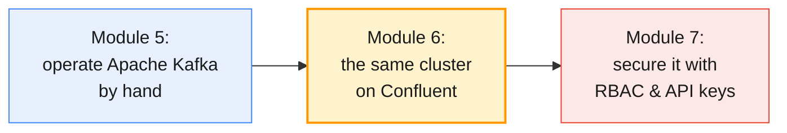

This module opens the **Confluent half** of the course (Modules 6–10). It is
deliberately broad: you meet every major piece once, then later modules go
deep on security, monitoring, troubleshooting and the ecosystem.

By the end of this module you will be able to:

- Draw the **Confluent Platform architecture** and name what each component
  adds on top of Apache Kafka.
- Explain the **feature and licensing differences** between Apache Kafka,
  community-licensed Confluent components and enterprise-licensed features.
- Choose between **Confluent Cloud** and **self-managed Confluent Platform**
  and state what the administrator still owns in each.
- **Log in** with the Confluent CLI to both Confluent Cloud and Confluent
  Platform, and manage environments, clusters, contexts and API keys.
- **Create, list, describe, update and delete topics** with the Confluent CLI,
  Control Center and — where it still fits — the Apache Kafka CLI.

---

## 2. Confluent Platform overview and architecture

### 2.1 What Confluent adds on top of Apache Kafka

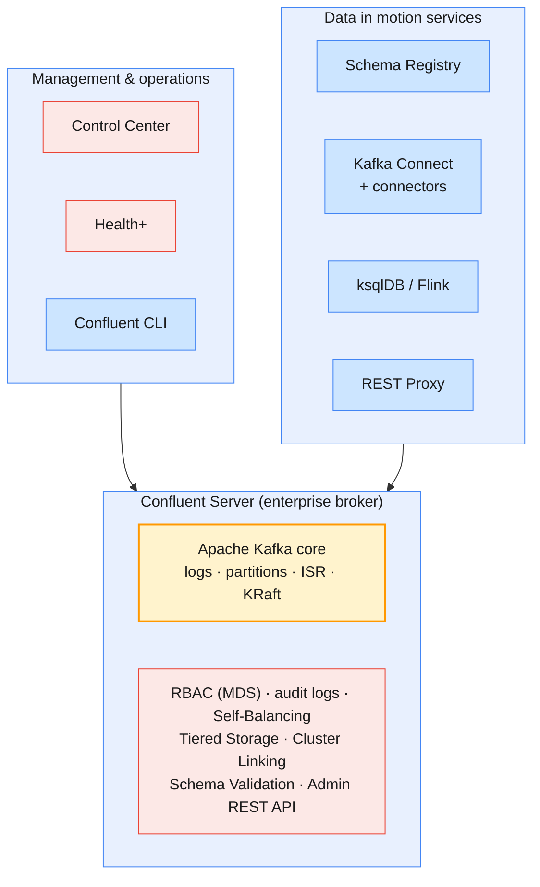

Confluent describes Confluent Platform as *a specialized distribution of
Kafka that includes additional features and APIs*. Read the diagram from the
bottom up:

1. **The core is still Apache Kafka.** Confluent Platform 8.3 ships Apache
   Kafka 4.3 — the same version as your Module 2 Docker cluster. Partitions,
   ISR, KRaft controllers and `acks` behave exactly as in Modules 1–5.
2. **Confluent Server** wraps that core with enterprise features that run
   *inside the broker process*: role-based access control via the Metadata
   Service (MDS), audit logs, Self-Balancing Clusters, Tiered Storage, Cluster
   Linking, broker-side Schema Validation, and an embedded Admin REST API.
3. **Services** around the cluster turn it into a platform: Schema Registry,
   Kafka Connect, ksqlDB and Flink, REST Proxy.
4. **Management tools** — Control Center, Health+, the Confluent CLI — give
   administrators a single view of all of it.

> **Administrator takeaway:** nothing you learned in Modules 1–5 is thrown
> away. Confluent adds layers; it does not replace the log. When Control Center
> shows an under-replicated partition, it is the same ISR state you read with
> `kafka-topics.sh --describe --under-replicated-partitions` (Module 5 §2.3).

### 2.2 Component map

| Component | Role | Default port | Licence | Covered in depth |
| --------- | ---- | ------------ | ------- | ---------------- |
| **Confluent Server** (`cp-server`) | Enterprise broker = Apache Kafka + enterprise features | 9092 (clients), 8090 (MDS / Admin REST) | Enterprise | §2.3 |
| **KRaft controllers** | Metadata quorum, exactly as in Module 2 §5 | 9093 | Enterprise (as part of Confluent Server) | Module 5 §3.1 |
| **Schema Registry** | Central store of Avro / JSON Schema / Protobuf schemas | 8081 | Community | Module 10 |
| **Kafka Connect** | Run source and sink connectors | 8083 | Apache 2.0 (framework) | Module 10 |
| **ksqlDB** | Streaming SQL over topics | 8088 | Community | Module 10 |
| **REST Proxy** | Produce, consume and admin over HTTP | 8082 | Community | §7 |
| **Control Center** | Web UI for management and monitoring | 9021 | Enterprise | §6, Module 8 |
| **Health+** | Cloud-hosted alerting and diagnostics for self-managed clusters | (outbound HTTPS only) | Enterprise | Module 8 |
| **Confluent CLI** (`confluent`) | One CLI for Cloud and Platform | — | Community | §5 |
| **Replicator** | Copy topics between clusters (Connect-based) | runs in Connect | Enterprise | Module 10 |

> **Port trap:** 8088 is ksqlDB in Confluent's defaults — and also the host
> port the course's Kafka UI container uses in `labs/setup/`. On a shared
> host, check `ss -ltn` before blaming the component.

### 2.3 Confluent Server vs the Apache Kafka broker

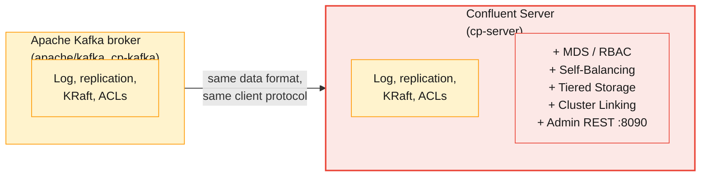

Confluent publishes two broker images and packages, and the difference
matters when you read a `docker-compose.yml` or an install inventory:

| | `confluentinc/cp-kafka` | `confluentinc/cp-server` |
| - | ----------------------- | ------------------------ |
| **What it is** | Confluent's packaging of Apache Kafka | Confluent Server: Kafka + enterprise features |
| **Licence** | Apache 2.0 / Community | Enterprise (trial, developer or paid) |
| **RBAC, audit logs, Self-Balancing, Tiered Storage, Cluster Linking** | ❌ | ✅ |
| **Embedded Admin REST API (`:8090/kafka`)** | ❌ | ✅ |
| **Wire protocol and on-disk format** | Apache Kafka | Apache Kafka (clients cannot tell the difference) |
| **Course use** | `labs/setup/confluent-kafka-kraft-*-docker-compose.yml` | Shared Confluent Platform cluster (§2.4) |

The `cp-kafka` compose files in `labs/setup/` run Confluent's *image* but not
Confluent *Server*: you get Confluent's packaging and Docker conventions
(`KAFKA_*` environment variables become `server.properties` entries) with
none of the enterprise features. That is a useful local playground, not a
substitute for the shared cluster.

> **Common trap for MQ administrators:** assuming "Confluent Kafka" is a
> different messaging engine. It is the same Kafka, and a client built for
> Apache Kafka in Module 4 connects to Confluent Server or Confluent Cloud by
> changing only `bootstrap.servers` and the security settings.

Two packaging details trip up administrators moving from Apache Kafka:

| Detail | Apache Kafka tarball | Confluent Platform packages |
| ------ | -------------------- | --------------------------- |
| **CLI tool names** | `kafka-topics.sh` | `kafka-topics` (no `.sh`, installed in `/usr/bin` or `$CONFLUENT_HOME/bin`) |
| **Config file location** | `config/server.properties` | `/etc/kafka/server.properties` (package install); `cp-ansible` renders it for you |
| **Service names** | Your own systemd unit (Module 2 §3.4) | `confluent-server`, `confluent-kcontroller`, `confluent-schema-registry`, … |

### 2.4 The course's Confluent environments

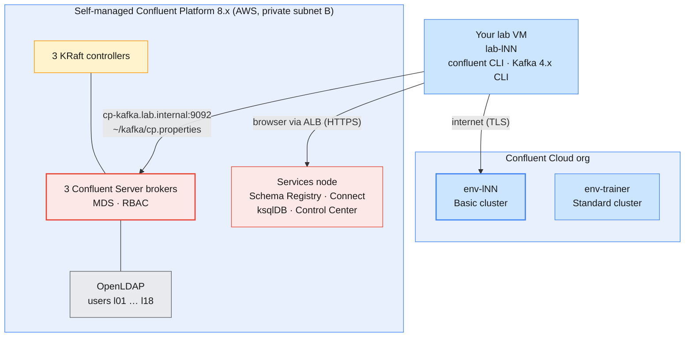

From Module 6 onwards you work against **two Confluent targets**, as laid out
in the course lab setup (`infra/LAB-SETUP.md` §5–§6):

| Target | What you get | Your rights |
| ------ | ------------ | ----------- |
| **Shared Confluent Platform 8.x** | 3 controllers + 3 Confluent Server brokers, a services node with Control Center, LDAP users `l01`…`l18` | Your own `lNN.*` topics and groups via RBAC; cluster read-only |
| **Confluent Cloud `env-lNN`** | Your own environment with a Basic cluster | **EnvironmentAdmin**: create clusters' topics, API keys and role bindings in that environment |

The Apache Kafka cluster from Modules 3–5 stays up as a comparison point for
Modules 7 and 8.

---

## 3. Confluent vs. Apache Kafka: features and licensing

### 3.1 Feature comparison

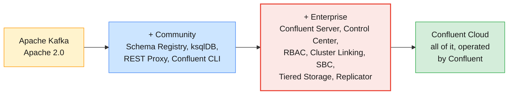

The table below maps each Confluent feature to the Apache Kafka technique you
already know — that is the question your architecture board will ask.

| Need | Apache Kafka 4.x (Modules 1–5) | Confluent Platform | Confluent Cloud |
| ---- | ------------------------------ | ------------------ | --------------- |
| **Topic and config admin** | `kafka-topics.sh`, `kafka-configs.sh`, Admin API | Same + Confluent CLI, Control Center, Admin REST API | Confluent CLI, Cloud Console, REST API, Terraform |
| **Authorization** | ACLs per principal (Module 7) | **RBAC** via MDS + LDAP, plus ACLs | **RBAC** + ACLs, API keys, service accounts |
| **Audit** | Broker logs only | Structured **audit logs** to a topic | Audit logs (org-level) |
| **Balancing** | Manual reassignment (Module 5 §5); Cruise Control | **Self-Balancing Clusters** (`confluent.balancer.enable`) | Automatic; invisible to you |
| **Cold storage** | Tiered storage with your own plugin (Module 3 §7.6) | **Tiered Storage** to S3/GCS/Azure | Infinite storage (built in) |
| **Cross-cluster** | MirrorMaker 2 | **Cluster Linking**, Replicator | **Cluster Linking** |
| **Schemas** | None in core | **Schema Registry**; broker-side **Schema Validation** | Schema Registry (Stream Governance) |
| **Monitoring** | JMX → Prometheus/Grafana | **Control Center**, Health+ | Cloud Console, **Metrics API** |
| **Operations** | Rolling restarts, upgrades by hand (Module 5 §6) | cp-ansible / Confluent for Kubernetes automate them | Confluent does them |

> **Self-Balancing in one sentence:** with `confluent.balancer.enable=true`,
> Confluent Server watches broker load and runs throttled reassignments for
> you when brokers are added, removed, or the load becomes uneven — the
> `--generate` / `--execute` / `--verify` loop of Module 5 §5.2, automated.
> It still moves data over the network, so it still needs headroom
> (Module 5 §7.3).

### 3.2 Licensing tiers

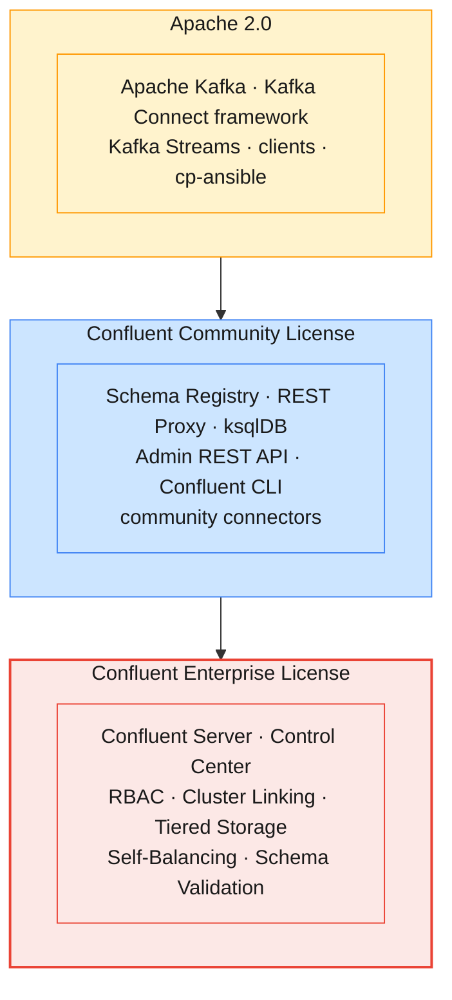

| Licence | Who can use it for what | Commercial features | Expiry |
| ------- | ----------------------- | ------------------- | ------ |
| **Apache 2.0** | Anyone, any purpose, including selling a service | — | Never |
| **Confluent Community License** | Free to use and modify in your own products and services; **not** to offer the component itself as a competing SaaS | — | Never |
| **Enterprise — trial** | Evaluate commercial features, even in production | ✅ | **30 days**; the software stops working when it expires |
| **Enterprise — developer** | Non-production use of all features | ✅ | Never, but limited to **a single broker per cluster** |
| **Enterprise — subscription** | Production, with support | ✅ | Subscription term; enterprise features stop after expiry |

The licence key is set with `confluent.license` on Confluent Server and the
services, and stored in the cluster itself. With no key, the enterprise
components run on the 30-day trial.

> **Common trap:** building a production cluster on the trial without
> noticing the clock. The course cluster is installed no more than about ten
> days before day 1 for exactly this reason (`infra/LAB-SETUP.md` §12). In
> production, put the licence expiry date in the same calendar as your TLS
> certificate expiries.

> **Common trap for MQ administrators:** "Community" does not mean
> "unsupported open source like Apache". It is a source-available licence
> written by Confluent. Ask your legal team before you embed a
> Community-licensed component in a product you sell; using it internally for
> billing pipelines is the ordinary case.

### 3.3 Version mapping

| Confluent Platform | Apache Kafka | Notes |
| ------------------ | ------------ | ----- |
| **7.9** | 3.9 | Last line with ZooKeeper; bundles the legacy Control Center |
| **8.0** | 4.0 | **KRaft only**; Control Center becomes a separately released product (2.x) |
| **8.3** | 4.3 | Current at the time of writing; Java 17, 21 and 25 |

Two consequences for you as an administrator:

- **Everything in Module 5 §6 applies.** A Confluent Platform upgrade is a
  rolling upgrade of Kafka 4.x underneath, including the
  `kafka-features.sh` / `metadata.version` finalisation step. ZooKeeper-based
  7.x clusters must migrate to KRaft before moving to 8.x (Module 1 §8.4).
- **Control Center has its own version and upgrade cycle** since 8.0 (§6.1).
  Check its compatibility matrix separately from the brokers'.

### 3.4 Choosing: a decision table

| If your organisation… | Lean towards |
| --------------------- | ------------ |
| Has strong Kafka skills, wants zero licence cost, and accepts building its own tooling | **Apache Kafka** (+ Cruise Control, Prometheus, MirrorMaker 2) |
| Needs LDAP-integrated RBAC, audit logs, a supported UI and 24×7 vendor support on its own hardware | **Confluent Platform** (subscription) |
| Must keep CDRs in its own data centre for regulatory reasons | **Confluent Platform** or Apache Kafka (self-managed) |
| Wants to stop operating brokers and pay per usage | **Confluent Cloud** |
| Runs both: on-prem mediation, cloud analytics | **Confluent Platform + Confluent Cloud** joined by Cluster Linking (Module 10) |

---

## 4. Deployment models: Confluent Cloud vs. self-managed Confluent Platform

### 4.1 Who operates what

```mermaid
flowchart TB
    subgraph SM["Self-managed Confluent Platform"]
        direction TB
        S1["Hardware / VMs / Kubernetes"]
        S2["OS, disks, network, TLS"]
        S3["Install, upgrade, rolling restart"]
        S4["Brokers, controllers, balancing"]
        S5["Topics, RBAC, quotas, monitoring"]
    end
    subgraph CL["Confluent Cloud"]
        direction TB
        C1["Hardware, OS, brokers,<br/>upgrades, balancing"]
        C5["Topics, RBAC, API keys,<br/>networking choice, cost"]
    end

    style S1 fill:#fce8e6,stroke:#ea4335,stroke-width:1px,color:#1a1a1a
    style S2 fill:#fce8e6,stroke:#ea4335,stroke-width:1px,color:#1a1a1a
    style S3 fill:#fce8e6,stroke:#ea4335,stroke-width:1px,color:#1a1a1a
    style S4 fill:#fce8e6,stroke:#ea4335,stroke-width:1px,color:#1a1a1a
    style S5 fill:#fce8e6,stroke:#ea4335,stroke-width:2px,color:#1a1a1a
    style C1 fill:#e8eaed,stroke:#5f6368,stroke-width:1px,color:#1a1a1a
    style C5 fill:#fce8e6,stroke:#ea4335,stroke-width:2px,color:#1a1a1a
    style SM fill:#e8f0fe,stroke:#4285f4,stroke-width:1px,color:#1a1a1a
    style CL fill:#e8f0fe,stroke:#4285f4,stroke-width:1px,color:#1a1a1a
```

Red boxes are **your** job; the grey box is Confluent's. The line moves, but
it never disappears: even on Confluent Cloud you own topic design, access
control, client configuration and cost.

| Concern | Self-managed Confluent Platform | Confluent Cloud |
| ------- | ------------------------------- | --------------- |
| **Broker access** | Full: `server.properties`, logs, JMX, SSH | None: no broker config files, no SSH, no `kafka-reassign-partitions.sh` |
| **Upgrades** | You roll them (Module 5 §6) | Confluent rolls them; you read the change log |
| **Scaling** | Add brokers, reassign or let Self-Balancing move data | Change eCKU/CKU capacity; elastic types scale automatically |
| **Durability defaults** | You set RF and `min.insync.replicas` | RF **3** (not editable); `min.insync.replicas` default 2 (1 or 2 only) |
| **Authentication** | SASL/SCRAM, mTLS, LDAP, OAuth — your choice | API keys, OAuth; Confluent Cloud identities |
| **Networking** | Your VPC / data centre | Public internet, or private networking on Enterprise/Dedicated |
| **Billing** | Hardware + subscription | Usage: capacity units, throughput, storage, connectors |
| **Data residency** | Wherever you put it | The cloud provider and region you choose |

### 4.2 The Confluent Cloud resource hierarchy

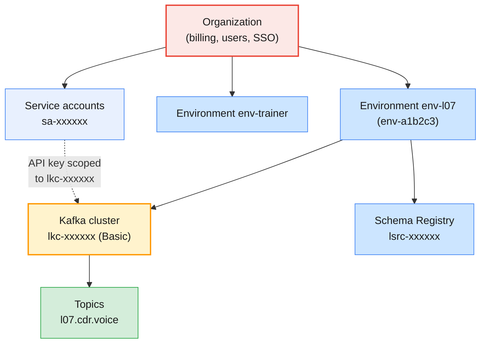

| Level | ID prefix | What lives here | MQ analogy |
| ----- | --------- | --------------- | ---------- |
| **Organization** | (UUID) | Users, billing, SSO, service accounts, org-wide RBAC | The enterprise MQ estate |
| **Environment** | `env-` | Clusters and one Schema Registry that belong together (dev / test / prod, or one per learner) | A set of queue managers for one stage |
| **Kafka cluster** | `lkc-` | Topics, consumer groups, cluster-scoped API keys | A queue manager |
| **Schema Registry** | `lsrc-` | Schemas for the environment | — |
| **Service account** | `sa-` | Non-human identity for an application | An MQ channel's MCAUSER |
| **API key** | (16 characters) | Credential for one identity on one resource | Channel credentials |

The names you see in class (`env-l07`) are **display names**; every CLI
command wants the **ID** (`env-a1b2c3`). Keep both in your notes.

### 4.3 Confluent Cloud cluster types

| Type | Intended for | Scaling unit | SLA | Networking |
| ---- | ------------ | ------------ | --- | ---------- |
| **Basic** | Development and testing (the course's `env-lNN`) | eCKU, elastic | 99.5 % | Public |
| **Standard** | Production on public networking (`env-trainer`) | eCKU, elastic | 99.9 % | Public |
| **Enterprise** | Production with private networking | eCKU, elastic, fast scaling | 99.9 % | Private |
| **Dedicated** | Very high throughput, manual control, single-tenant | CKU, manual | 99.95 % single-zone (higher multi-zone) | Public or private |
| **Freight** | Cost-optimised, high-throughput, latency-tolerant (logs, CDR archive) | eCKU | 99.99 % | Private |

eCKUs scale up and down with load; CKUs are capacity you size and change
yourself — the cloud version of the broker-count arithmetic in Module 5 §7.
Each type also caps partitions per unit, which is the Cloud form of the
partition limits in Module 5 §7.4.

> **Design note:** a CDR pipeline that bills customers belongs on Standard or
> above; Basic's SLA and limits make it a development tier. A cold CDR
> archive feeding a data lake is the textbook Freight workload.

### 4.4 Self-managed install options

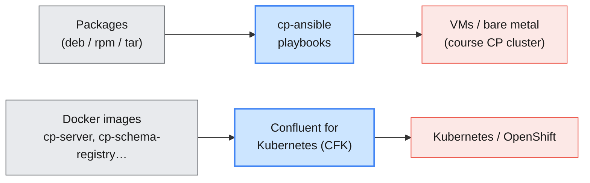

| Option | Best for | What it automates |
| ------ | -------- | ----------------- |
| **Packages / tarball** | Learning, small estates, custom automation | Nothing — you write the configs (like Module 2 §3) |
| **Docker images** | Local labs, CI | Config from `KAFKA_*` env vars; still hand-wired |
| **cp-ansible** | VMs and bare metal at scale | Install, TLS, RBAC + LDAP, rolling upgrades — the course CP cluster is built this way |
| **Confluent for Kubernetes (CFK)** | Kubernetes and **OpenShift** | Custom resources (`Kafka`, `KafkaTopic`, `ConfluentRolebinding`); the operator does rolling restarts |

> **For the OpenShift administrators in the room:** CFK is the Confluent
> equivalent of the Strimzi operator. Topics declared as `KafkaTopic`
> resources are reconciled by the operator — a topic deleted with the CLI
> comes back if its custom resource still exists. Decide early whether topics
> are owned by GitOps or by humans.

### 4.5 What Module 5's operations become

| Module 5 operation | Self-managed Confluent Platform | Confluent Cloud |
| ------------------ | ------------------------------- | --------------- |
| **Check URP / min ISR** (§2.3) | `kafka-topics --describe --under-replicated-partitions`; Control Center Brokers page | Not exposed; Confluent's SRE responsibility |
| **Add / remove a broker** (§4) | Add broker; Self-Balancing moves data, or `kafka-remove-brokers` drains one | Change capacity; no brokers to name |
| **Reassign partitions** (§5) | Manual tools still work; Self-Balancing does it continuously | Not available, not needed |
| **Rolling restart / upgrade** (§6) | cp-ansible or CFK roll it with health checks | Confluent's job |
| **Capacity planning** (§7) | Same arithmetic | Translate to eCKU/CKU and cost |

---

## 5. Confluent CLI overview and authentication

### 5.1 One CLI, two targets

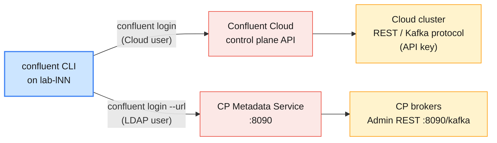

The `confluent` binary is a single CLI for both deployment models. Commands
look the same, but **which flags exist depends on where you are logged in**:
the help text of every command is split into *Cloud* and *On-Premises*
sections. Two things differ fundamentally from the Apache Kafka CLI:

| | Apache Kafka CLI (Modules 2–5) | Confluent CLI |
| - | ------------------------------ | ------------- |
| **Talks to** | Brokers, over the Kafka protocol | Control-plane and REST APIs (plus the Kafka protocol for produce/consume) |
| **Credentials** | `--command-config` file per command | `confluent login` once; credentials kept in a **context** |
| **Scope** | One cluster per command | Organization → environment → cluster, selected with `use` |
| **Beyond Kafka** | Topics, groups, configs, ACLs | Also API keys, service accounts, RBAC, connectors, Schema Registry, Flink, billing |

```bash
# Version and the full command tree
confluent version
confluent --help
confluent kafka topic --help
```

### 5.2 Logging in to Confluent Cloud

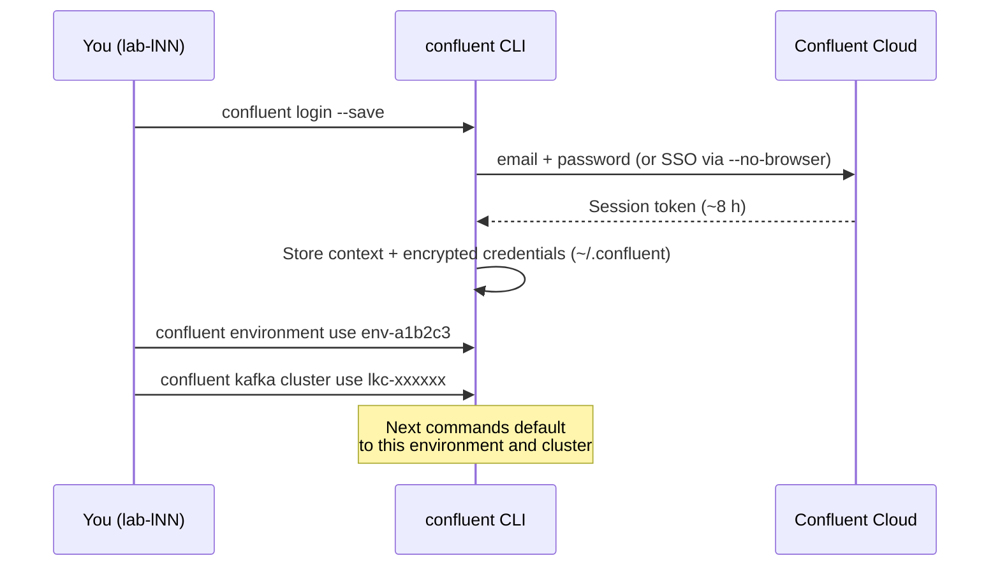

```bash
# Interactive; --save re-authenticates automatically when the 8 h token expires
confluent login --save
# On a VM without a browser, for SSO users
confluent login --no-browser
# Non-interactive (CI): CONFLUENT_CLOUD_EMAIL and CONFLUENT_CLOUD_PASSWORD
```

| Flag / variable | Purpose |
| --------------- | ------- |
| `--save` | Store encrypted credentials so the CLI can refresh the token itself |
| `--organization <id>` | Choose an organization when your user belongs to several |
| `--no-browser` | SSO login on a headless VM: copy the URL to your laptop's browser |
| `CONFLUENT_CLOUD_EMAIL` / `CONFLUENT_CLOUD_PASSWORD` | Non-interactive login |
| `confluent logout` | End the session and drop the stored token |

### 5.3 Contexts, environments and clusters

A **context** is the CLI's equivalent of a kubeconfig context: one login
(Cloud user or Platform URL + user) plus the current environment, cluster
and API key. You can hold a Cloud context and a Platform context side by side.

```bash
confluent context list                     # * marks the current one
confluent context use <context-name>       # switch between Cloud and Platform

confluent environment list                 # IDs and display names
confluent environment use env-a1b2c3
confluent kafka cluster list
confluent kafka cluster use lkc-xxxxxx
confluent kafka cluster describe           # endpoint, type, region, availability
```

> **Common trap:** running a destructive command in the wrong context. Make
> `confluent context list` and `confluent kafka cluster describe` a reflex
> before `delete`, exactly as you would check `$BS` before a
> `kafka-topics.sh --delete` (Module 2 §8.5).

### 5.4 API keys: credentials for data-plane access

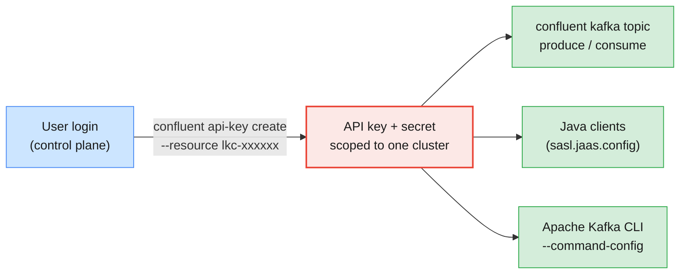

Your Cloud login manages resources (the **control plane**). Talking to the
Kafka cluster itself — producing, consuming, or using any Kafka client — needs
an **API key and secret** scoped to that cluster (the **data plane**).

```bash
# Create a key for your cluster, owned by your user
confluent api-key create --resource lkc-xxxxxx --description "lNN module 6 CLI"
# The secret is shown ONCE. Make it the key the CLI uses for this cluster
confluent api-key use <API_KEY>
# A key created elsewhere (e.g. in the Console) can be stored for CLI use
confluent api-key store <API_KEY> <API_SECRET> --resource lkc-xxxxxx
confluent api-key list
```

| Key type | `--resource` | Used for |
| -------- | ------------ | -------- |
| **Cluster API key** | `lkc-…` | Kafka clients and the CLI's produce/consume |
| **Schema Registry key** | `lsrc-…` | Schema Registry clients (Module 10) |
| **Cloud API key** | `cloud` | Org-level management APIs: Terraform, Metrics API (Module 8) |
| **Service-account key** | any + `--service-account sa-…` | Applications in production (Module 7) |

> **The production baseline:** applications never use API keys owned by a
> human user. Create a **service account** per application (billing, fraud,
> mediation), give it the narrowest role binding, and create its keys with
> `--service-account`. Module 7 builds this end to end.

### 5.5 Logging in to Confluent Platform (MDS)

```bash
# Platform login goes to the Metadata Service (MDS) on the brokers
confluent login --url https://<mds-host>:8090 \
  --certificate-authority-path /path/to/ca.pem
# Username and password are your LDAP credentials (lNN / password from the credentials e-mail)

# Non-interactive alternative
export CONFLUENT_PLATFORM_MDS_URL=https://<mds-host>:8090
export CONFLUENT_PLATFORM_USERNAME=lNN
export CONFLUENT_PLATFORM_PASSWORD='...'
confluent login
```

On Platform, topic commands go to a **REST endpoint** given with `--url`:
either the Admin REST API embedded in Confluent Server
(`https://<broker>:8090/kafka`) or a standalone REST Proxy
(`http://<rest-proxy>:8082`).

| | Confluent Cloud | Confluent Platform |
| - | --------------- | ------------------ |
| **Login** | `confluent login` (Cloud user, SSO) | `confluent login --url <mds>` (LDAP user via MDS) |
| **Select the cluster** | `confluent kafka cluster use lkc-…` | `--url https://<broker>:8090/kafka` on each command |
| **Data-plane credential** | Cluster API key | The same LDAP login (token from MDS) |
| **Authorization** | Cloud RBAC + ACLs | MDS RBAC + ACLs (Module 7) |

### 5.6 The Apache Kafka CLI still works

Every tool from Modules 2–5 speaks the Kafka protocol, so it works against
Confluent Server and Confluent Cloud with the right client config — no
Confluent CLI required. This is often the fastest way for an Apache Kafka
administrator to feel at home, and the only option for tools the Confluent
CLI does not wrap (`kafka-consumer-groups.sh --reset-offsets`,
`kafka-log-dirs.sh`).

```properties
# ~/kafka/ccloud.properties — Confluent Cloud, from your cluster API key
bootstrap.servers=pkc-xxxxx.<region>.<cloud>.confluent.cloud:9092
security.protocol=SASL_SSL
sasl.mechanism=PLAIN
sasl.jaas.config=org.apache.kafka.common.security.plain.PlainLoginModule required username="<API_KEY>" password="<API_SECRET>";
```

```bash
# Same commands as Module 2, different target
kafka-topics.sh --bootstrap-server pkc-xxxxx.<region>.<cloud>.confluent.cloud:9092 \
  --command-config ~/kafka/ccloud.properties --list
# Shared Confluent Platform cluster, with the config prepared on your VM
kafka-topics.sh --bootstrap-server cp-kafka.lab.internal:9092 \
  --command-config ~/kafka/cp.properties --list
```

> **Common trap:** expecting Cloud to accept everything the Apache CLI can
> send. Broker-level administration — altering broker configs,
> `kafka-reassign-partitions.sh`, controller and quorum tools — is not
> available to you on Confluent Cloud: at best you see a read-only, curated
> view. Those operations are Confluent's responsibility (§4.1).

---

## 6. Confluent Control Center walkthrough

### 6.1 Control Center architecture (Confluent Platform 8.x)

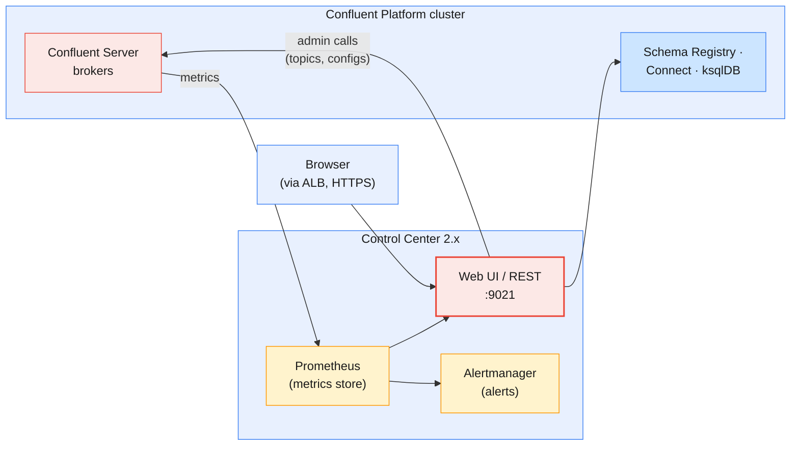

Control Center is Confluent Platform's web console for **management and
monitoring**. Since Confluent Platform 8.0 it is a separately released product
(versions 2.x, package `confluent-control-center-next-gen`) built on an
embedded **Prometheus** for metrics and **Alertmanager** for alerts. The
version bundled with 7.9 and earlier is now called *Control Center (Legacy)*;
it stored metrics in Kafka topics and Kafka Streams, so older runbooks may
mention internal `_confluent-controlcenter-*` topics that a 2.x install does
not depend on in the same way.

| Item | Value |
| ---- | ----- |
| **Default URL** | `http://<host>:9021` (course: HTTPS via the ALB, URL in your credentials e-mail) |
| **Authentication** | With RBAC: your LDAP user via MDS; you see only what your role bindings allow |
| **Licence** | Enterprise (trial / subscription) |
| **Read vs write** | Monitoring pages are read-only; topic, connector and ksqlDB pages make admin calls with **your** identity |

### 6.2 A guided tour

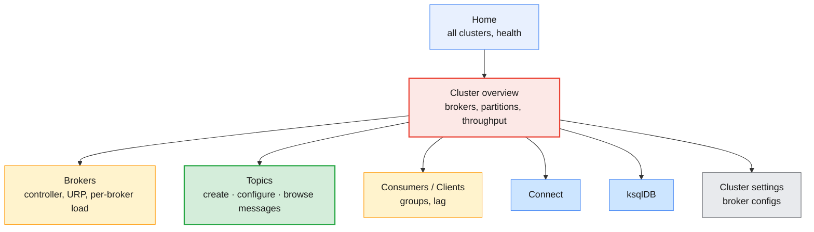

Walk through Control Center in this order the first time — it mirrors the
order in which you investigated a cluster in Modules 2–5:

| Page | What you look at | CLI equivalent you already know |
| ---- | ---------------- | ------------------------------- |
| **Home** | Every connected cluster, healthy or not | — |
| **Cluster overview** | Broker count, partitions, under-replicated / offline partitions, throughput in and out | `kafka-topics.sh --describe --under-replicated-partitions` (Module 5 §2.3) |
| **Brokers** | Active controller, per-broker throughput, partition and leader counts, disk usage | `kafka-metadata-quorum.sh describe --status`, `kafka-log-dirs.sh` (Module 5 §8.1) |
| **Topics** | List, per-topic throughput, partitions, replica placement, **configuration**, **messages** | `kafka-topics.sh`, `kafka-configs.sh`, `kafka-console-consumer.sh` |
| **Consumers / Clients** | Consumer groups, members, **consumer lag** per partition | `kafka-consumer-groups.sh --describe` (Module 4 §4.5) |
| **Connect / ksqlDB** | Connectors and queries running against this cluster | Module 10 |
| **Cluster settings** | Broker configuration (static and dynamic) | `kafka-configs.sh --entity-type brokers --describe` (Module 3 §2.2) |

> **Administrator takeaway:** a UI makes the cluster *visible*; it does not
> make it *auditable*. Changes made by clicking leave no script behind. For
> production, use Control Center to investigate and the CLI, cp-ansible, CFK
> or Terraform to change things — and keep those changes in git.

### 6.3 The Confluent Cloud Console

Confluent Cloud has no Control Center: its equivalent is the **Cloud Console**
at `https://confluent.cloud`, with the same hierarchy as the CLI (§4.2).

| Task | Control Center (Platform) | Cloud Console |
| ---- | ------------------------- | ------------- |
| **Topics** | Cluster → Topics | Environment → Cluster → Topics |
| **Consumer lag** | Consumers | Clients → Consumer lag |
| **Broker health** | Brokers page | Not exposed; cluster-level metrics only |
| **Keys and accounts** | — (LDAP users, MDS) | API keys, Accounts & access |
| **Metrics for external tools** | Prometheus inside Control Center | **Metrics API** (Module 8) |

---

## 7. Topic management via Confluent CLI and Control Center

### 7.1 One lifecycle, three tools

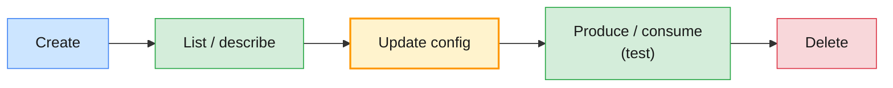

The topic lifecycle from Module 2 §8.1 is unchanged. Only the tool changes:

| Step | Apache Kafka CLI | Confluent CLI (Cloud) | Confluent CLI (Platform) | Control Center / Cloud Console |
| ---- | ---------------- | --------------------- | ------------------------ | ------------------------------ |
| **Create** | `kafka-topics.sh --create` | `confluent kafka topic create` | `... create --url <rest>` | Topics → **Add a topic** |
| **List** | `kafka-topics.sh --list` | `confluent kafka topic list` | `... list --url <rest>` | Topics page |
| **Describe** | `kafka-topics.sh --describe` + `kafka-configs.sh --describe` | `confluent kafka topic describe` | `... describe --url <rest>` | Topic → Overview / Configuration |
| **Update config** | `kafka-configs.sh --alter` | `confluent kafka topic update --config` | `... update --url <rest> --config` | Topic → Configuration → **Edit settings** |
| **Add partitions** | `kafka-topics.sh --alter --partitions` | Apache CLI with `ccloud.properties` (§5.6) | Apache CLI | Not editable after creation in Control Center |
| **Produce / consume** | Console producer / consumer | `confluent kafka topic produce / consume` | Same with `--url` / bootstrap | Topic → **Messages** |
| **Delete** | `kafka-topics.sh --delete` | `confluent kafka topic delete` | `... delete --url <rest>` | Topic → Configuration → **Delete topic** |

### 7.2 Create

```bash
# Confluent Cloud (current environment and cluster from §5.3)
confluent kafka topic create lNN.cdr.voice --partitions 6 \
  --config retention.ms=604800000,cleanup.policy=delete

# Confluent Platform, through the embedded Admin REST API
confluent kafka topic create lNN.cdr.voice --url https://<broker>:8090/kafka \
  --partitions 6 --replication-factor 3 --config min.insync.replicas=2

# Safe in scripts: no error if it already exists
confluent kafka topic create lNN.cdr.sms --partitions 3 --if-not-exists
```

| Flag | Cloud | Platform | Notes |
| ---- | ----- | -------- | ----- |
| `--partitions` | ✅ | ✅ | Default 6 on Cloud |
| `--replication-factor` | ❌ | ✅ | Cloud is always RF 3 |
| `--config k=v,k=v` | ✅ | ✅ | Or a file of `k=v` lines |
| `--if-not-exists` | ✅ | ✅ | Idempotent scripts |
| `--dry-run` | ✅ | — | Validate without creating |

In **Control Center**: *Topics → Add a topic*, enter the name and partition
count, then *Customize settings* to set retention, cleanup policy,
`min.insync.replicas` and the rest before *Save & create*. The *Create with
defaults* button uses the broker defaults — fine for a test, rarely right for
a billing topic (Module 3 §4.4).

> **Common trap:** Control Center's quick-create path hides the settings that
> matter. A CDR topic created "with defaults" on a cluster whose default
> `min.insync.replicas` is 1 silently loses the durability contract from
> Module 3 §6. Always open *Customize settings*.

### 7.3 List and describe

```bash
confluent kafka topic list
confluent kafka topic describe lNN.cdr.voice            # partitions + configs
confluent kafka topic describe lNN.cdr.voice -o json | jq .
# Platform
confluent kafka topic list --url https://<broker>:8090/kafka
```

The Confluent CLI's `describe` shows the topic's **configuration** in one
place — what needed both `kafka-topics.sh --describe` and
`kafka-configs.sh --describe --all` in Module 3 §4.2. It does not show
per-partition leaders and ISR the way `kafka-topics.sh --describe` does; on
Platform use the Apache tool or Control Center's partition view for that.

### 7.4 Update configuration

```bash
# Shorten retention to 3 days (Cloud)
confluent kafka topic update lNN.cdr.voice --config retention.ms=259200000
# Validate first
confluent kafka topic update lNN.cdr.voice --config retention.ms=259200000 --dry-run
# Platform
confluent kafka topic update lNN.cdr.voice --url https://<broker>:8090/kafka \
  --config retention.ms=259200000
```

Topic-config updates are **dynamic** exactly as in Module 3 §4.3: the change
is a metadata record and takes effect without a restart. In Control Center:
*Topic → Configuration → Edit settings → Switch to expert mode* exposes every
topic config.

**Confluent Cloud topic rules** you must design around:

| Setting | Cloud behaviour |
| ------- | --------------- |
| **`replication.factor`** | 3, not editable |
| **`min.insync.replicas`** | Default 2; only 1 or 2 allowed |
| **`retention.ms`** | Default 7 days; `-1` = infinite storage |
| **Broker configs** | Not editable; a curated set of topic configs is |
| **Partitions** | Capped per cluster type and capacity unit (§4.3) |

> **The production baseline:** keep `min.insync.replicas=2` on Cloud and
> `acks=all` on your producers — the same contract as Module 3 §6. Cloud gives
> you RF 3 for free; it cannot give you `acks=all` from the client side.

### 7.5 Produce and consume to test

```bash
# Produce keyed CDR events (key:value, Ctrl+D to finish) — uses the API key from §5.4
confluent kafka topic produce lNN.cdr.voice --parse-key
#   966500000001:{"type":"call-start","cell":"RUH-0412"}
#   966500000001:{"type":"call-end","duration":184}

# Consume from the beginning in a named group, showing keys and offsets
confluent kafka topic consume lNN.cdr.voice --from-beginning \
  --group lNN.billing --print-key --print-offset
```

These are smoke-test tools, not applications: the same caveat as the console
producer in Module 2 §9.2. The *Messages* tab of a topic in Control Center or
the Cloud Console lets you browse and produce single messages from the UI.

### 7.6 Delete

```bash
confluent kafka topic delete lNN.cdr.sms            # asks for confirmation
confluent kafka topic delete lNN.cdr.sms --force    # scripts only
# Platform
confluent kafka topic delete lNN.cdr.sms --url https://<broker>:8090/kafka
```

Deletion is asynchronous and irreversible in every tool (Module 2 §8.5). On
Cloud there is no `delete.topic.enable` to fall back on and no broker disk to
recover from.

> **Administrator takeaways:** the guardrails that protected the shared
> Apache cluster — the `lNN.` prefix, no cluster-level rights — come from
> RBAC on Confluent. A delete that returns `not authorized` on someone else's
> topic is the system working, not a bug (Module 7).

---

## 8. Hands-on lab: exploring Confluent and managing topics

The Module 6 labs (`labs/module-06/`) are the runtime companion to this guide
and are still being written. This section previews them using the course
environment (`infra/LAB-SETUP.md` §5–§7) and the conventions of the Module 3–5
labs. All commands run on **your lab VM**.

| Part | Where | What |
| ---- | ----- | ---- |
| **A** — explore Confluent Cloud | `env-lNN` (Basic cluster) via CLI and Cloud Console | Log in, navigate org → environment → cluster, create an API key |
| **B** — topic lifecycle on Cloud | `env-lNN` | Create / list / describe / update / produce / consume / delete with the Confluent CLI |
| **C** — explore Control Center | Shared Confluent Platform | Tour the cluster, brokers, topics and consumers pages |
| **D** — topic lifecycle on Platform | Shared Confluent Platform | Same lifecycle via Control Center and via the CLI, with your `lNN.` prefix |

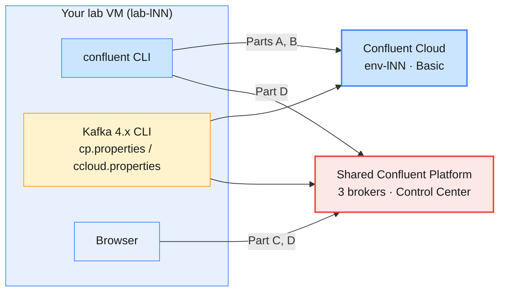

### 8.1 Part A — Access and explore Confluent Cloud

Accept the Confluent Cloud invitation e-mail first (the T-3 connectivity check
already asked you to).

```bash
# (VM)
ME=lNN                                   # your learner prefix
confluent version

# 1. Log in and keep the credentials so the token refreshes itself
confluent login --save
confluent context list

# 2. Find your environment: display name env-lNN, ID env-xxxxxx
confluent environment list
confluent environment use <env-id>

# 3. Your Basic cluster
confluent kafka cluster list
confluent kafka cluster use <lkc-id>
confluent kafka cluster describe         # note the endpoint, type, cloud and region

# 4. A cluster API key for the data plane (copy the secret NOW)
confluent api-key create --resource <lkc-id> --description "$ME module 6 CLI"
confluent api-key use <API_KEY>
```

Then open `https://confluent.cloud` in the browser and find the same objects:
*Environments → env-lNN → your cluster*. Compare the cluster settings page
with `confluent kafka cluster describe`.

**Checkpoint:** you can name your environment ID, cluster ID, cluster type and
bootstrap endpoint, and `confluent api-key list` shows the key you created.

### 8.2 Part B — Topic create / list / describe / delete on Confluent Cloud

```bash
# (VM) 1. Create a CDR topic with explicit settings
confluent kafka topic create $ME.cdr.voice --partitions 6 \
  --config retention.ms=604800000,min.insync.replicas=2

# 2. Try what Cloud does not allow — note how it responds
confluent kafka topic create $ME.cdr.rf2 --partitions 3 --config replication.factor=2

# 3. List and describe
confluent kafka topic list
confluent kafka topic describe $ME.cdr.voice

# 4. Change retention to 3 days, dry run first
confluent kafka topic update $ME.cdr.voice --config retention.ms=259200000 --dry-run
confluent kafka topic update $ME.cdr.voice --config retention.ms=259200000
confluent kafka topic describe $ME.cdr.voice | grep retention.ms

# 5. Smoke test: produce three keyed CDRs, consume them back (Ctrl+C to stop)
confluent kafka topic produce $ME.cdr.voice --parse-key
#   966500000001:call-start
#   966500000002:call-start
#   966500000001:call-end
confluent kafka topic consume $ME.cdr.voice --from-beginning \
  --group $ME.billing --print-key --print-offset
```

Now the same cluster through the **Apache Kafka CLI**, to prove it is just
Kafka:

```bash
# (VM) Build a client config from the key you created in Part A
cat > ~/kafka/ccloud.properties <<EOF
bootstrap.servers=<bootstrap endpoint from cluster describe, host:9092>
security.protocol=SASL_SSL
sasl.mechanism=PLAIN
sasl.jaas.config=org.apache.kafka.common.security.plain.PlainLoginModule required username="<API_KEY>" password="<API_SECRET>";
EOF
chmod 600 ~/kafka/ccloud.properties
CCLOUD=<bootstrap endpoint, host:9092>

kafka-topics.sh --bootstrap-server $CCLOUD --command-config ~/kafka/ccloud.properties \
  --describe --topic $ME.cdr.voice
kafka-consumer-groups.sh --bootstrap-server $CCLOUD --command-config ~/kafka/ccloud.properties \
  --describe --group $ME.billing

# Broker-level changes are not yours on Cloud (§5.6) — note how it responds
kafka-configs.sh --bootstrap-server $CCLOUD --command-config ~/kafka/ccloud.properties \
  --alter --entity-type brokers --entity-default --add-config log.retention.hours=1
```

Finish with a delete, in both tools:

```bash
confluent kafka topic create $ME.cdr.sms --partitions 3
confluent kafka topic delete $ME.cdr.sms                    # confirm with the topic name
confluent kafka topic list
```

**Checkpoint:** `kafka-topics.sh --describe` shows `ReplicationFactor: 3` and
leaders on broker IDs you did not choose; you created the topic without ever
naming a broker.

### 8.3 Part C — Walk through Control Center

Open the Control Center URL from your credentials e-mail and log in as
`lNN` with your LDAP password. Visit, in order (§6.2):

1. **Home** — how many clusters are connected, and are they healthy?
2. **Cluster overview** — brokers, partitions, under-replicated and offline
   partitions, throughput.
3. **Brokers** — which broker is the active controller? How are partitions
   and leaders spread across the three brokers?
4. **Topics** — which topics can you see? (Only those your role bindings
   allow.)
5. **Consumers** — find a consumer group and its lag.
6. **Cluster settings** — read a broker setting such as
   `min.insync.replicas` or `log.retention.hours`, and compare it with:

```bash
# (VM) the same facts from the Apache Kafka CLI
CP=cp-kafka.lab.internal:9092
kafka-broker-api-versions.sh --bootstrap-server $CP --command-config ~/kafka/cp.properties | grep "(id:"
kafka-topics.sh --bootstrap-server $CP --command-config ~/kafka/cp.properties \
  --describe --under-replicated-partitions
```

### 8.4 Part D — Topic create / list / describe / delete on Confluent Platform

**In Control Center:**

1. *Topics → Add a topic*: name `lNN.cdr.data`, 6 partitions,
   *Customize settings*: `min.insync.replicas=2`, retention 7 days.
   *Save & create*.
2. Open the topic: check partitions and replica placement on the
   *Overview*, and every setting on *Configuration*.
3. *Messages → Produce a new message*: key `966500000001`, a small JSON value.
   Watch it appear in the message browser.
4. *Configuration → Edit settings*: change retention to 3 days. Save.

**With the CLIs** — verify what the UI did, then manage a second topic:

```bash
# (VM) Apache Kafka CLI: the authoritative partition view
kafka-topics.sh --bootstrap-server $CP --command-config ~/kafka/cp.properties \
  --describe --topic $ME.cdr.data
kafka-configs.sh --bootstrap-server $CP --command-config ~/kafka/cp.properties \
  --describe --entity-type topics --entity-name $ME.cdr.data

# Confluent CLI against Platform: log in to MDS, then use the Admin REST URL
confluent login --url <MDS URL from the credentials e-mail>
confluent kafka topic create $ME.cdr.roaming --url <Admin REST URL>/kafka \
  --partitions 3 --replication-factor 3 --config min.insync.replicas=2
confluent kafka topic list --url <Admin REST URL>/kafka
confluent kafka topic describe $ME.cdr.roaming --url <Admin REST URL>/kafka

# A topic outside your prefix is refused by RBAC
confluent kafka topic create other.topic --url <Admin REST URL>/kafka --partitions 1
```

Then delete `$ME.cdr.roaming` with the CLI and `$ME.cdr.data` from Control
Center (*Configuration → Delete topic*), and confirm both are gone with
`kafka-topics.sh --list`.

```bash
confluent kafka topic delete $ME.cdr.roaming --url <Admin REST URL>/kafka
kafka-topics.sh --bootstrap-server $CP --command-config ~/kafka/cp.properties --list | grep "^$ME\."
```

| Observation | Concept | Where it's covered |
| ----------- | ------- | ------------------ |
| `confluent environment list` shows `env-lNN` with a different ID | Display names vs IDs in the resource hierarchy | §4.2 |
| Produce needs an API key; `topic list` does not | Control plane vs data plane | §5.4 |
| Creating a topic with `replication.factor=2` on Cloud fails | Cloud fixes RF at 3 | §7.4 |
| `kafka-topics.sh` works against Cloud with `ccloud.properties` | Confluent Cloud speaks the Kafka protocol | §5.6 |
| Altering broker defaults with `kafka-configs.sh` is refused on Cloud | Shared responsibility: brokers are Confluent's | §4.1 |
| Control Center's Brokers page shows the same controller and URP as the CLI | Control Center visualises the same metadata | §6.2, Module 5 §2.3 |
| You only see your own `lNN.*` topics in Control Center | RBAC filters the UI | §6.1, Module 7 |
| A topic made in Control Center appears in `kafka-topics.sh --list` | One cluster, many tools | §7.1 |
| Platform topic commands need `--url .../kafka` | Confluent CLI uses the Admin REST API on Platform | §5.5 |
| `other.topic` creation is denied | Prefix-scoped RBAC role bindings | §7.6, Module 7 |

---

## 9. Troubleshooting common Confluent access issues

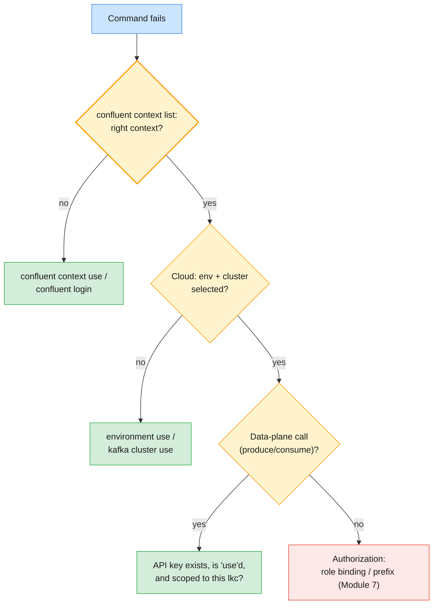

| Symptom | Likely cause | Check / fix |
| ------- | ------------ | ----------- |
| **"You must log in to run that command"** | Token expired (≈ 8 h) or never saved | `confluent login --save` |
| **"No Kafka cluster selected"** | Environment or cluster not chosen in this context | `confluent environment use`, `confluent kafka cluster use` |
| **Produce/consume asks for an API key** | No key stored or selected for this cluster | `confluent api-key create --resource lkc-…`, then `api-key use` |
| **API key "not found" right after creation** | Keys take a short time to propagate | Wait a minute; retry |
| **Lost the API secret** | Secrets are shown once | Create a new key; delete the old one |
| **`SaslAuthenticationException` from `kafka-topics.sh` on Cloud** | Wrong key/secret, key for another cluster, or `PLAIN` vs other mechanism | Check `sasl.jaas.config` and the `lkc` the key belongs to |
| **Platform topic command fails without `--url`** | On-prem commands need the REST endpoint | Add `--url https://<broker>:8090/kafka` |
| **TLS errors logging in to MDS** | Self-signed CA not trusted | `--certificate-authority-path ca.pem` |
| **Control Center shows no topics** | Your role bindings cover only `lNN.*`, and you have none yet | Create one; Module 7 explains RBAC |
| **Control Center or brokers stop working one day** | Trial licence expired | Check `confluent.license`; install a real or developer key |
| **Cloud rejects a topic config** | Not in Cloud's editable set, or out of range | Check the Cloud topic configuration reference (§7.4) |
| **Topic "deleted" comes back** | Re-created by an operator (CFK `KafkaTopic`), Terraform or a client with auto-create | Delete the owning resource, not just the topic |

---

## 10. Bridging to the rest of the course

| Question this module raises | Answered in |
| --------------------------- | ----------- |
| How do RBAC roles, role bindings, API keys and service accounts actually control access? | Module 7 |
| How do Apache ACLs and SASL users compare with Confluent RBAC? | Module 7 |
| What should I watch in Control Center and the Metrics API, and when should it alert? | Module 8 |
| How do I tune producers, consumers and clusters on Confluent? | Module 8 |
| How do I diagnose message loss and connectivity problems on Confluent? | Module 9 |
| How do Connect, Schema Registry, ksqlDB, Cluster Linking and Replicator fit in — and how do I migrate from Apache Kafka? | Module 10 |

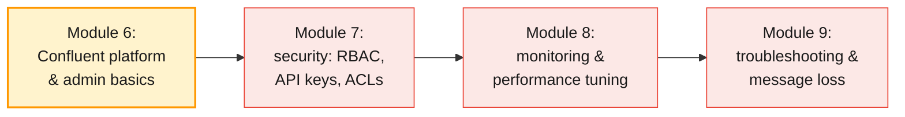

Previous guides: [Module 2](./module-02-installation-setup-cli-operations.md)
for the Apache Kafka topic lifecycle,
[Module 3](./module-03-cluster-configuration-storage-retention.md) for the
topic configs you now set through new tools, and
[Module 5](./module-05-cluster-operations-replication-ha.md) for the
operations that Self-Balancing and Confluent Cloud automate.

---

## 11. Key takeaways

1. **Confluent is Kafka plus layers.** Confluent Platform 8.3 runs Apache
   Kafka 4.3; partitions, ISR, KRaft and `acks` behave exactly as in
   Modules 1–5.
2. **Confluent Server is the enterprise broker.** It adds RBAC (MDS), audit
   logs, Self-Balancing, Tiered Storage, Cluster Linking and an Admin REST API
   inside the broker; `cp-kafka` does not.
3. **Three licence tiers.** Apache 2.0 for Kafka, Confluent Community for
   Schema Registry, REST Proxy, ksqlDB and the CLI, Enterprise for Confluent
   Server, Control Center and the commercial features — with a 30-day trial
   and a single-broker developer licence.
4. **Deployment model moves the responsibility line.** Self-managed means you
   run brokers, upgrades and balancing; on Confluent Cloud you still own
   topics, access, clients and cost.
5. **Cloud has a hierarchy and fixed rules.** Organization → environment →
   cluster; RF 3 is fixed, `min.insync.replicas` is 1 or 2, broker configs
   are not yours.
6. **One CLI, two targets.** `confluent login` for Cloud, `confluent login
   --url <mds>` for Platform; contexts hold the login and current resources.
7. **API keys are data-plane credentials.** Your login manages resources; a
   cluster-scoped key (owned by a service account in production) talks to
   Kafka.
8. **The Apache Kafka CLI still works.** With the right client config,
   `kafka-topics.sh` and `kafka-consumer-groups.sh` work against both
   Confluent Platform and Confluent Cloud.
9. **Control Center visualises; scripts change.** Use it to investigate
   brokers, topics and lag; since 8.0 it is released separately and built on
   Prometheus and Alertmanager.
10. **The topic lifecycle is the same in every tool.** Create, describe,
    update, test, delete — always with explicit durability settings and
    checked in the right context.

---

## 12. Glossary

| Term | Definition |
| ---- | ---------- |
| **Confluent Platform (CP)** | Confluent's self-managed distribution of Kafka with enterprise broker, services and tools |
| **Confluent Cloud** | Confluent's fully managed Kafka service on AWS, Azure and Google Cloud |
| **Confluent Server** | The enterprise broker (`cp-server`): Apache Kafka plus RBAC, Self-Balancing, Tiered Storage, Cluster Linking and more |
| **`cp-kafka`** | Confluent's packaging of the Apache Kafka broker without enterprise features |
| **Confluent Community License** | Source-available licence for components like Schema Registry, REST Proxy, ksqlDB and the Confluent CLI |
| **Enterprise licence** | Commercial licence for Confluent Server, Control Center and commercial features; trial (30 days), developer (single broker) or subscription |
| **Metadata Service (MDS)** | Confluent Server component providing authentication tokens and RBAC for Confluent Platform |
| **Admin REST API** | REST interface for topics and configs, embedded in Confluent Server at `:8090/kafka` |
| **Control Center** | Confluent Platform's web UI for management and monitoring; separate 2.x releases since CP 8.0 |
| **Cloud Console** | Confluent Cloud's web UI at `confluent.cloud` |
| **Self-Balancing Clusters (SBC)** | Confluent Server feature that runs throttled reassignments automatically |
| **Organization** | Top-level Confluent Cloud account: users, billing, SSO |
| **Environment** | Confluent Cloud grouping of clusters and a Schema Registry (`env-…`) |
| **Cluster ID** | Confluent Cloud Kafka cluster identifier (`lkc-…`) |
| **eCKU / CKU** | Elastic and fixed Confluent capacity units used to size and bill Cloud clusters |
| **Service account** | Non-human Confluent Cloud identity for an application (`sa-…`) |
| **API key / secret** | Credential pair for one identity on one resource; the secret is shown once |
| **Control plane / data plane** | Managing resources (login, CLI admin) vs reading and writing data (API keys, Kafka protocol) |
| **CLI context** | Saved Confluent CLI login plus current environment, cluster and key |
| **cp-ansible** | Confluent's Ansible playbooks for installing and upgrading Confluent Platform on VMs |
| **Confluent for Kubernetes (CFK)** | Confluent's Kubernetes operator, including OpenShift support |
| **Health+** | Confluent-hosted monitoring and alerting service for self-managed clusters |

---

## 13. References

**Apache Kafka (official)**

- Apache Kafka documentation (4.3) — <https://kafka.apache.org/43/>
- Basic Kafka operations — <https://kafka.apache.org/43/operations/basic-kafka-operations/>
- Topic configuration reference — <https://kafka.apache.org/43/configuration/topic-configs/>

**Confluent Platform**

- Confluent Platform overview and components — <https://docs.confluent.io/platform/current/get-started/platform.html>
- Confluent Platform release notes — <https://docs.confluent.io/platform/current/release-notes/index.html>
- Confluent Platform licenses — <https://docs.confluent.io/platform/current/installation/license.html>
- Self-Balancing Clusters — <https://docs.confluent.io/platform/current/clusters/sbc/index.html>
- Manage topics in Confluent Platform — <https://docs.confluent.io/platform/current/kafka/manage-topics.html>
- Control Center overview — <https://docs.confluent.io/control-center/current/overview.html>
- Configure topics using Control Center — <https://docs.confluent.io/control-center/current/topics/edit.html>
- Ansible playbooks for Confluent Platform — <https://docs.confluent.io/ansible/current/overview.html>
- Confluent for Kubernetes — <https://docs.confluent.io/operator/current/overview.html>

**Confluent Cloud**

- Confluent Cloud cluster types — <https://docs.confluent.io/cloud/current/clusters/cluster-types.html>
- Topic configuration reference for Confluent Cloud — <https://docs.confluent.io/cloud/current/topics/manage.html>

**Confluent CLI**

- `confluent login` — <https://docs.confluent.io/confluent-cli/current/command-reference/confluent_login.html>
- `confluent kafka topic` commands — <https://docs.confluent.io/confluent-cli/current/command-reference/kafka/topic/index.html>
- `confluent kafka topic create` — <https://docs.confluent.io/confluent-cli/current/command-reference/kafka/topic/confluent_kafka_topic_create.html>
- `confluent api-key create` — <https://docs.confluent.io/confluent-cli/current/command-reference/api-key/confluent_api-key_create.html>

**Course environment**

- Lab environment setup — [`infra/LAB-SETUP.md`](../infra/LAB-SETUP.md)

**Books**

- *Kafka: The Definitive Guide*, 2nd ed. (Shapira, Palino, Sivaram, Petty; O'Reilly)

---

> **Next module:** _Module 7 — Administering Kafka Security_, where you secure
> both worlds: SASL, SSL and ACLs on Apache Kafka compared with Confluent RBAC,
> role bindings, API keys and service accounts, validated end to end with
> real client applications.
