# Module 7 — Administering Kafka Security

> **Course:** Apache Kafka & Confluent Kafka Administration
> **Module objective:** Secure Confluent Kafka clusters using Confluent's
> administration and access-control model.

---

## Table of contents

1. [Why this module matters](#1-why-this-module-matters)
2. [The Apache Kafka security baseline: SSL, SASL and ACLs](#2-the-apache-kafka-security-baseline-ssl-sasl-and-acls)
3. [Confluent Platform authentication and authorization overview](#3-confluent-platform-authentication-and-authorization-overview)
4. [Confluent RBAC (Role-Based Access Control)](#4-confluent-rbac-role-based-access-control)
5. [API keys and secrets management (Confluent Cloud)](#5-api-keys-and-secrets-management-confluent-cloud)
6. [Encryption and network security in Confluent-managed environments](#6-encryption-and-network-security-in-confluent-managed-environments)
7. [Comparing the Confluent security model to Apache Kafka ACLs, SASL and SSL](#7-comparing-the-confluent-security-model-to-apache-kafka-acls-sasl-and-ssl)
8. [Hands-on lab: RBAC roles, API keys and access validation](#8-hands-on-lab-rbac-roles-api-keys-and-access-validation)
9. [Troubleshooting security errors](#9-troubleshooting-security-errors)
10. [Bridging to the rest of the course](#10-bridging-to-the-rest-of-the-course)
11. [Key takeaways](#11-key-takeaways)
12. [Glossary](#12-glossary)
13. [References](#13-references)

> **How to read the diagrams:** Diagrams are written in [Mermaid](https://mermaid.js.org/),
> which renders automatically in GitHub, VS Code (with a Mermaid extension), and most
> modern Markdown viewers. If a diagram appears as code, install/enable a Mermaid
> preview to see the rendered version.

> **Builds on:** [Module 6 — Introducing Confluent Kafka: Platform, Architecture & Administration Basics](./module-06-introducing-confluent-kafka.md).
> This module assumes the two Confluent targets from Module 6 §2.4, the
> Confluent CLI logins to Cloud and to MDS (Module 6 §5.2, §5.5), and cluster
> API keys (Module 6 §5.4). It also uses the SASL client config you have
> loaded since Module 4 §8.2. It focuses on **who may do what**: how identities
> are authenticated, how RBAC role bindings and ACLs authorize them, how API
> keys and secrets are managed, and how traffic is encrypted.

---

## 1. Why this module matters

Since Module 3 every command you ran carried a user name and password —
`~/kafka/apache.properties`, then `cp.properties` and `ccloud.properties` in
Module 6 — and every time you touched a topic outside your `lNN.` prefix the
cluster said no. You have been *using* security for four modules. This module
makes you the person who *administers* it.

For an IBM MQ administrator the shape is familiar. MQ has channel
authentication records (who may connect), TLS on channels (encryption), and
`setmqaut` / OAM authority records (who may put to or get from which queue).
Kafka has the same three layers: **encryption** with TLS, **authentication**
with SASL or mutual TLS, and **authorization** with ACLs. Confluent keeps all
three and adds a fourth idea: **roles**. Instead of writing one ACL per
operation, you bind a principal to a predefined role on a resource, and the
role expands into the right permissions.

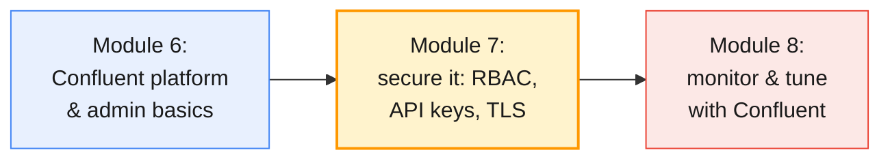

The telecom stakes are concrete. `cdr.voice` carries MSISDNs, call times and
cell IDs: personal data under any privacy regime. The mediation system must be
able to write it, billing must be able to read it, and the fraud team's
experimental consumer must not be able to delete it. Getting that right — and
proving it — is the administrator's job.

By the end of this module you will be able to:

- Explain the Apache Kafka security baseline — **listeners, SSL/TLS, SASL
  mechanisms and ACLs** — and read it in a real broker config.
- Describe how **Confluent Platform** authenticates users (LDAP, mTLS, MDS
  tokens) and authorizes them with the **Confluent Server Authorizer**.
- Grant and audit **RBAC role bindings** on Confluent Cloud and Confluent
  Platform, choosing the narrowest predefined role.
- Run the **API key lifecycle** for service accounts on Confluent Cloud —
  create, distribute, rotate, revoke — and keep secrets out of files and git.
- Explain **encryption in transit, at rest and network isolation** in each
  deployment model, and **validate access** with test identities.

---

## 2. The Apache Kafka security baseline: SSL, SASL and ACLs

Confluent's model is built *on top of* Apache Kafka security, not instead of
it. Everything in this section still runs inside Confluent Server and
Confluent Cloud, so learn it first.

### 2.1 Three questions every request must answer

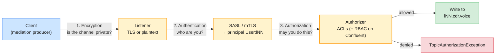

| Layer | Question | Apache Kafka mechanism | IBM MQ analogue |
| ----- | -------- | ---------------------- | --------------- |
| **Encryption** | Can anyone on the network read or alter the bytes? | TLS on the listener (`SSL`, `SASL_SSL`) | TLS `SSLCIPH` on channels |
| **Authentication** | Who is this client? | SASL (PLAIN, SCRAM, GSSAPI, OAUTHBEARER) or mutual TLS certificates | Channel authentication (`CHLAUTH`), `CONNAUTH` |
| **Authorization** | May this principal perform this operation on this resource? | Authorizer + ACLs | OAM authority records (`setmqaut`) |

The output of authentication is a **principal**, for example `User:l07`.
Authorization never sees passwords or certificates — only the principal. That
separation is why one set of ACLs works no matter which SASL mechanism or
certificate produced the identity.

> **Common trap for MQ administrators:** assuming a fresh Kafka cluster is
> locked down. Out of the box, Apache Kafka (and Confluent Platform) listens
> in `PLAINTEXT` with no authentication and no authorizer: anyone who can
> reach port 9092 can read, write and delete every topic. Security is
> something you turn on, listener by listener.

### 2.2 Listeners and security protocols

A broker can expose several **listeners**, each with its own security
protocol. You met `listeners` and `advertised.listeners` in Module 2 §3.3;
here is the security half.

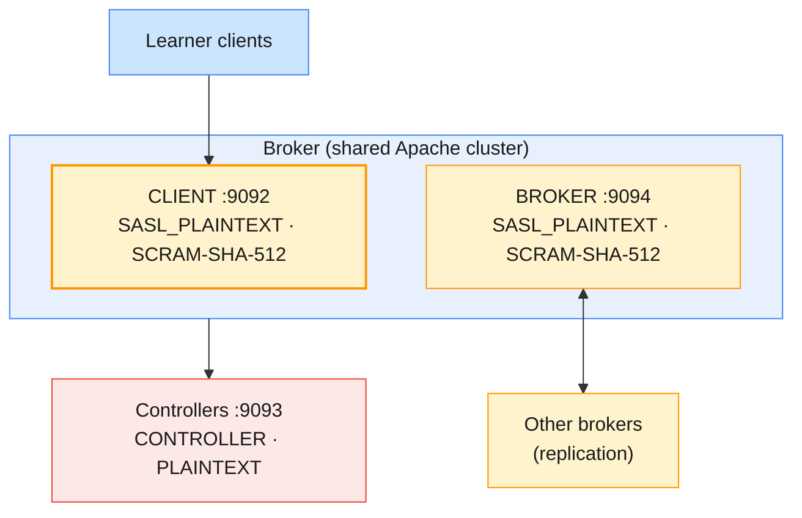

| `security.protocol` | Encrypted? | Authenticated? | Typical use |
| ------------------- | ---------- | -------------- | ----------- |
| **`PLAINTEXT`** | ❌ | ❌ (principal `ANONYMOUS`) | Local labs (Modules 1–2) only |
| **`SSL`** | ✅ | Optional: mutual TLS if `ssl.client.auth=required` | Certificate-based identities |
| **`SASL_PLAINTEXT`** | ❌ | ✅ SASL | Isolated private networks; never across untrusted links |
| **`SASL_SSL`** | ✅ | ✅ SASL | The production default; Confluent Cloud and the course CP cluster |

The listener name is mapped to a protocol with
`listener.security.protocol.map`, and per-listener settings use the prefix
`listener.name.<listener>.<mechanism>.` — for example
`listener.name.client.scram-sha-512.sasl.jaas.config`.

> **Administrator takeaway:** the course's shared Apache cluster runs
> `SASL_PLAINTEXT` because it lives in private subnets reachable only from the
> lab VMs' security group (`infra/LAB-SETUP.md` §8). Passwords are protected
> by SCRAM's challenge–response, but the CDR payloads are not encrypted. That
> is a deliberate lab trade-off, not a production baseline.

### 2.3 SASL mechanisms

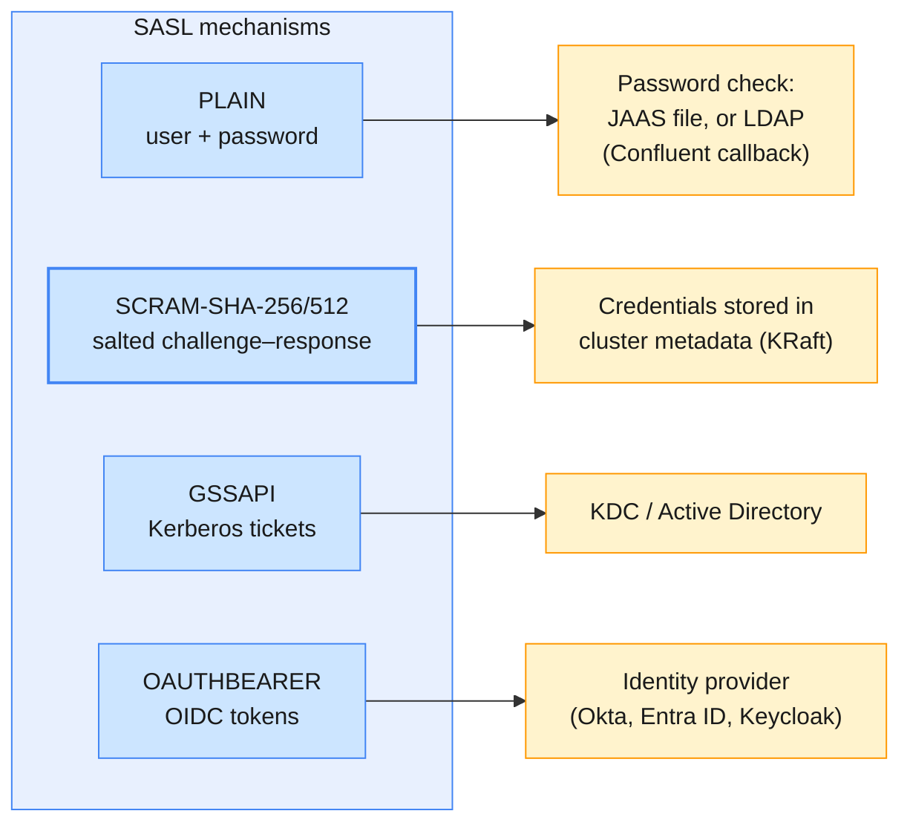

| Mechanism | Password on the wire? | Where identities live | Course use |
| --------- | --------------------- | --------------------- | ---------- |
| **PLAIN** | Yes — only safe inside TLS (`SASL_SSL`) | JAAS config, or LDAP via Confluent's `LdapAuthenticateCallbackHandler` | Confluent Cloud API keys; the CP cluster's LDAP users |
| **SCRAM-SHA-512** | No (challenge–response) | Salted hashes in the cluster metadata, managed with `kafka-configs.sh` | Shared Apache cluster users `l01`…`l18` |
| **GSSAPI** | No (Kerberos tickets) | KDC / Active Directory | Common in banks and telcos with AD; not used in the labs |
| **OAUTHBEARER** | No (signed tokens) | External OIDC identity provider | Enterprise SSO for applications; not used in the labs |

In KRaft mode SCRAM credentials are written through the Admin API
(KIP-554) and stored in the cluster metadata, so you manage them with the
same tool you use for configs. The course's `bootstrap-security.sh` does
exactly this for every learner:

```bash
# Create or update a SCRAM user (from infra/cluster/scripts/bootstrap-security.sh)
kafka-configs.sh --bootstrap-server $BS --command-config admin.properties --alter \
  --entity-type users --entity-name l07 --add-config 'SCRAM-SHA-512=[password=...]'
# What exists (the password is never shown)
kafka-configs.sh --bootstrap-server $BS --command-config admin.properties --describe \
  --entity-type users --entity-name l07
```

> **Common trap:** using `PLAIN` over `SASL_PLAINTEXT`. The password crosses
> the network in clear text. `PLAIN` is perfectly safe — it is what Confluent
> Cloud uses — but only inside TLS.

### 2.4 ACLs and the StandardAuthorizer

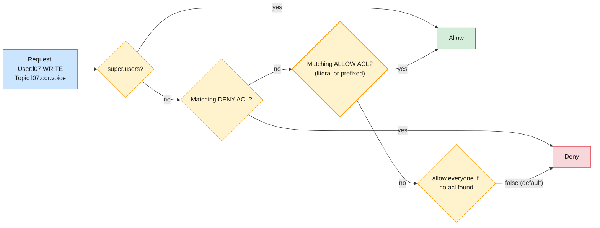

In KRaft clusters the authorizer is
`org.apache.kafka.metadata.authorizer.StandardAuthorizer` (KIP-801). It stores
ACLs in the `__cluster_metadata` log, so they replicate with the rest of the
metadata (Module 2 §5).

An ACL has six parts:

| Part | Example | Notes |
| ---- | ------- | ----- |
| **Principal** | `User:l07` | Output of authentication |
| **Permission** | `Allow` / `Deny` | Deny always wins over allow |
| **Operation** | `Read`, `Write`, `Create`, `Delete`, `Describe`, `DescribeConfigs`, `Alter`, `AlterConfigs`, `All`, … | Each API call needs specific operations |
| **Resource** | `Topic`, `Group`, `Cluster`, `TransactionalId` | `Cluster` covers broker-wide actions |
| **Pattern type** | `literal` or `prefixed` | `prefixed` matches every name starting with the value |
| **Host** | `*` (default) | Rarely used; IPs change |

The broker settings that turn it on (from the course's
`infra/cluster/config/broker.properties.tmpl`):

```properties
authorizer.class.name=org.apache.kafka.metadata.authorizer.StandardAuthorizer
allow.everyone.if.no.acl.found=false
super.users=User:ANONYMOUS;User:admin;User:broker;User:trainer
```

> **Why is `User:ANONYMOUS` a super user?** The controllers on the shared
> Apache cluster talk to the brokers over a `PLAINTEXT` `CONTROLLER`
> listener, and plaintext connections authenticate as `ANONYMOUS`. Without the
> entry, the brokers' own metadata requests would be denied. The listener is
> reachable only inside the cluster's subnets; in production you would put
> the controller listener on TLS with certificates instead. Note that
> `super.users` is separated by **semicolons**, because certificate
> distinguished names contain commas.

The prefix ACLs every learner received on the Apache cluster:

```bash
# From infra/cluster/scripts/bootstrap-security.sh
kafka-acls.sh --bootstrap-server $BS --command-config admin.properties --add \
  --allow-principal User:l07 --operation All --topic l07. --resource-pattern-type prefixed
kafka-acls.sh --bootstrap-server $BS --command-config admin.properties --add \
  --allow-principal User:l07 --operation All --group l07. --resource-pattern-type prefixed
kafka-acls.sh --bootstrap-server $BS --command-config admin.properties --add \
  --allow-principal User:l07 --operation All --transactional-id l07. --resource-pattern-type prefixed
kafka-acls.sh --bootstrap-server $BS --command-config admin.properties --add \
  --allow-principal User:l07 --operation Describe --operation DescribeConfigs --cluster
```

`kafka-acls.sh` also has convenience flags, `--producer` and `--consumer`,
that expand into the usual set of operations for each client type — the
first, small step towards roles.

### 2.5 Mutual TLS as authentication

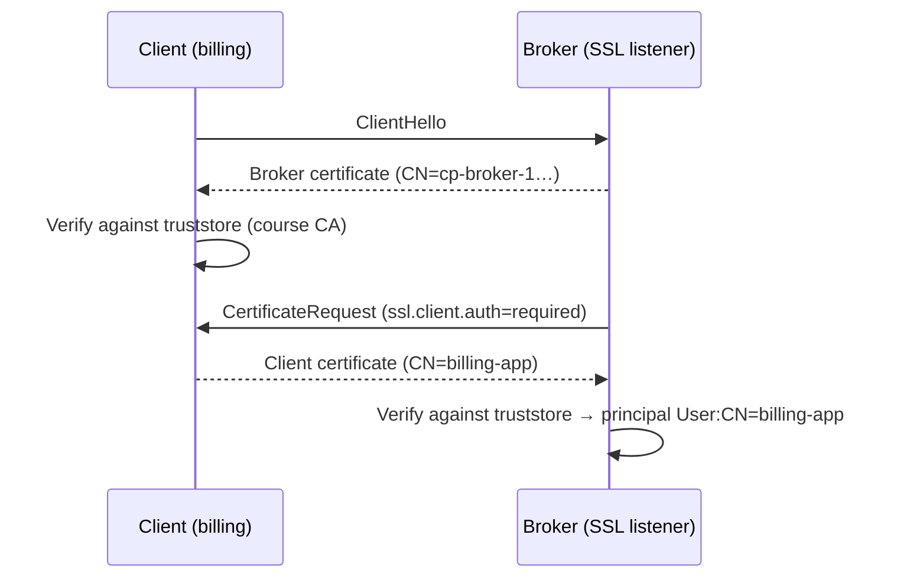

With `ssl.client.auth=required` the client's certificate *is* its identity,
and the principal is derived from the certificate's distinguished name
(shortened with `ssl.principal.mapping.rules`). The course CP cluster uses
mTLS between controllers and brokers, so that their internal traffic has an
authenticated principal for RBAC (`infra/confluent/README.md` §B.5).

| Store | Holds | Who needs it |
| ----- | ----- | ------------ |
| **Keystore** | Your own certificate + private key | Brokers always; clients only for mTLS |
| **Truststore** | CA certificates you trust | Everyone who verifies the other side |
| **PEM truststore** (`ssl.truststore.type=PEM`) | The CA as a plain `.pem` file | The course's `cp.properties` — no Java keystore needed |

> **The production baseline:** `SASL_SSL` (or `SSL` with mTLS) on every client
> listener, TLS on the inter-broker and controller listeners,
> `allow.everyone.if.no.acl.found=false`, a short `super.users` list, and
> prefix ACLs that follow your topic naming convention.

---

## 3. Confluent Platform authentication and authorization overview

### 3.1 The security architecture

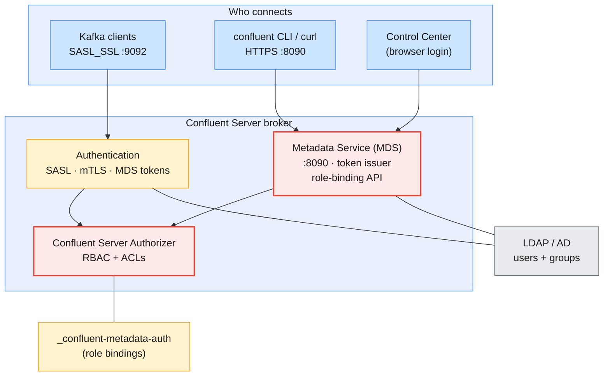

Confluent Platform keeps the Apache layers from §2 and adds three pieces,
all inside Confluent Server:

1. **LDAP integration.** Users and groups come from your directory instead of
   per-cluster SCRAM entries. One password works for Kafka clients, the
   Confluent CLI and Control Center.
2. **The Metadata Service (MDS).** It listens on port **8090**, authenticates
   users against LDAP (or an OIDC provider), issues **tokens** that the CLI,
   Control Center and the other components use, and exposes the API for
   managing role bindings. It persists authorization data in the internal
   topic `_confluent-metadata-auth`.
3. **The Confluent Server Authorizer.** It replaces `StandardAuthorizer` and
   evaluates **RBAC role bindings and ACLs** together.

> **Common trap:** expecting security to be on because you installed
> Confluent Platform. Like Apache Kafka, Confluent Platform installs without
> authentication. RBAC, LDAP and TLS are turned on by your installer —
> in this course, the cp-ansible inventory in `infra/confluent/cp-ansible/hosts.yml`.

### 3.2 Authentication methods

| Client type | Methods on Confluent Platform | Course CP cluster |
| ----------- | ----------------------------- | ----------------- |
| **Kafka clients** (Java apps, `kafka-*.sh`) | mTLS, SASL/PLAIN, SASL/PLAIN with LDAP, SASL/SCRAM, SASL/GSSAPI, SASL/OAUTHBEARER, delegation tokens | `SASL_SSL` + `PLAIN`, passwords checked against LDAP |
| **Admin REST API, MDS** (CLI, `curl`) | HTTP Basic authentication, MDS tokens, mTLS, OAuth/OIDC | LDAP user + password over HTTPS |
| **Control Center** | Login through MDS; SSO with an OIDC identity provider (Entra ID, Okta, Keycloak, …) | LDAP user + password |
| **Platform components** (Schema Registry, Connect, ksqlDB, Control Center) | Their own LDAP service users, tokens from MDS | `schema_registry`, `connect_worker`, `ksql`, `control_center` |
| **Brokers ↔ controllers** | mTLS | Host certificates, client auth `required` |

The course cluster's client listener shows how PLAIN is checked against LDAP:

```properties
# From infra/confluent/cp-ansible/hosts.yml (broker custom listener "client", :9092)
listener.name.client.plain.sasl.server.callback.handler.class=io.confluent.security.auth.provider.ldap.LdapAuthenticateCallbackHandler
ldap.java.naming.provider.url=ldap://cp-ldap.lab.internal:389
ldap.user.search.base=ou=people,dc=lab,dc=internal
ldap.user.name.attribute=uid
ldap.group.search.base=ou=groups,dc=lab,dc=internal
ldap.group.member.attribute=member
```

And the matching client side — the file you used in Module 6:

```properties
# ~/kafka/cp.properties
bootstrap.servers=cp-kafka.lab.internal:9092
security.protocol=SASL_SSL
sasl.mechanism=PLAIN
sasl.jaas.config=org.apache.kafka.common.security.plain.PlainLoginModule required username="l07" password="...";
ssl.truststore.type=PEM
ssl.truststore.location=/home/learner/kafka/cp-ca.pem
```

### 3.3 MDS: login, tokens and role bindings

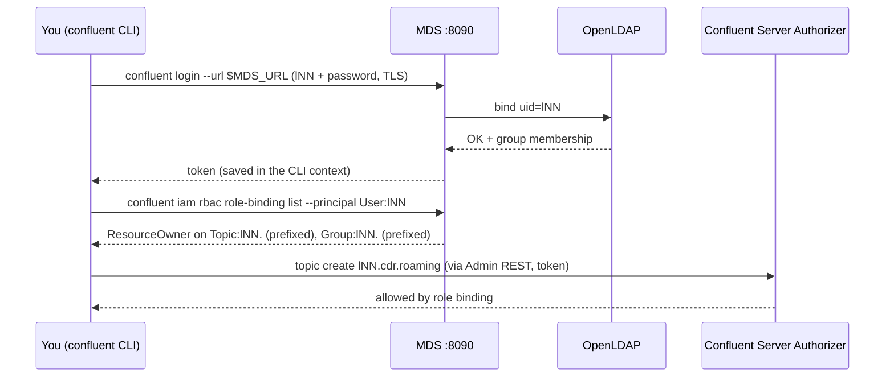

You already did the first half of this flow in Module 6 Lab 03. The new part
is that MDS is also the **system of record for role bindings**: you create,
list and delete them through MDS with `confluent iam rbac role-binding …`,
and every broker's authorizer reads them from `_confluent-metadata-auth`.

> **Administrator takeaway:** the MDS super user (`mds` in the course) is the
> break-glass account for RBAC — it can grant anything. Treat its password
> like the MQ `mqm` group: few people, stored in a vault, used only to
> bootstrap bindings such as `SystemAdmin` for the real administrators.

### 3.4 The Confluent Server Authorizer: RBAC and ACLs together

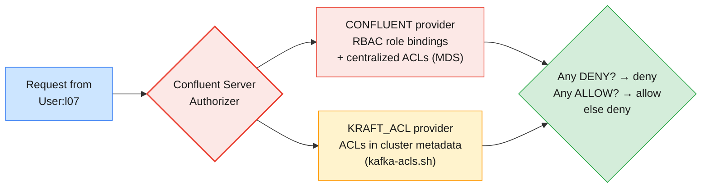

| Setting | Value | Meaning |
| ------- | ----- | ------- |
| `authorizer.class.name` | `io.confluent.kafka.security.authorizer.ConfluentServerAuthorizer` | Enables RBAC (and keeps ACL support) |
| `confluent.authorizer.access.rule.providers` | `CONFLUENT,KRAFT_ACL` (KRaft) | `CONFLUENT` = role bindings and centralized ACLs from MDS; `KRAFT_ACL` = ordinary ACLs in the cluster metadata |

Confluent describes RBAC as *an additional authorization layer on top of
ACLs*: existing ACLs keep working unchanged. The course CP cluster uses both
on purpose — role bindings for each learner's topics and groups, and a plain
ACL for cluster `Describe`:

```bash
# From infra/confluent/scripts/cp-rbac-learners.sh
confluent iam rbac role-binding create --principal User:l07 --role ResourceOwner \
  --kafka-cluster $CP_ID --resource Topic:l07. --prefix
confluent iam rbac role-binding create --principal User:l07 --role ResourceOwner \
  --kafka-cluster $CP_ID --resource Group:l07. --prefix
kafka-acls.sh --bootstrap-server $BS --command-config mds-admin.properties --add \
  --allow-principal User:l07 --operation Describe --operation DescribeConfigs --cluster
```

> **When to keep an ACL:** use role bindings for normal access, and ACLs for
> what roles cannot express — an explicit **deny**, or a single operation
> (cluster `Describe`) that no predefined role grants without granting more.

### 3.5 The course's Confluent Platform cluster, as configured

| Concern | Setting (from `hosts.yml` / setup scripts) | Section |
| ------- | ------------------------------------------ | ------- |
| **TLS** | `ssl_enabled: true` with the course CA (`make-certs.sh`); broker certs include `cp-kafka.lab.internal` | §6.1 |
| **Client authentication** | Listener `client` on 9092: `SASL_SSL` + PLAIN, LDAP callback handler | §3.2 |
| **Internal authentication** | mTLS between controllers and brokers (`ssl_client_authentication: required`) | §2.5 |
| **RBAC** | `rbac_enabled: true`, `mds_super_user: mds` | §3.3 |
| **Identity store** | OpenLDAP: `l01`…`l19`, `trainer`, groups `learners` and `trainers`, service users | §3.2 |
| **Learner rights** | `ResourceOwner` on `Topic:lNN.` and `Group:lNN.` (prefixed) + ACL cluster `Describe`, `DescribeConfigs` | §4.4 |
| **Trainer rights** | `SystemAdmin` on the Kafka cluster | §4.2 |

---

## 4. Confluent RBAC (Role-Based Access Control)

### 4.1 Anatomy of a role binding

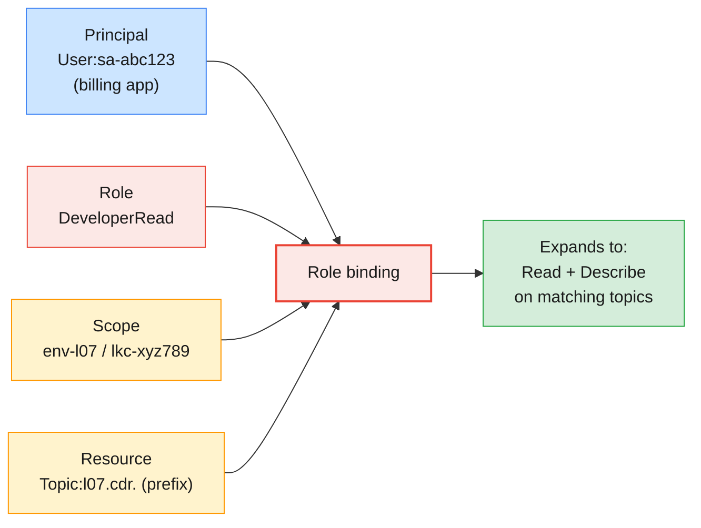

| Part | Confluent Platform | Confluent Cloud |
| ---- | ------------------ | --------------- |
| **Principal** | `User:<ldap uid>` or `Group:<ldap group>` | `User:u-…` (person), `User:sa-…` (service account), identity pools, group mappings |
| **Role** | Predefined only (§4.2) | Predefined only (§4.3) |
| **Scope** | Cluster ID: `--kafka-cluster`, `--schema-registry-cluster`, `--connect-cluster`, `--ksql-cluster` | Organization, `--environment`, `--cloud-cluster`, plus `--kafka-cluster` for Kafka resources |
| **Resource** (resource-level roles only) | `Topic:`, `Group:`, `TransactionalId:`, `Subject:`, `Connector:` … with optional `--prefix` | Same idea |

Roles come in two kinds. **Cluster- or scope-level roles** (`SystemAdmin`,
`EnvironmentAdmin`, `Operator`) apply to everything in the scope and take no
`--resource`. **Resource-level roles** (`ResourceOwner`, `DeveloperRead`,
`DeveloperWrite`, `DeveloperManage`) need a resource, literal or prefixed.

> **Common trap for MQ administrators:** looking for custom roles. Both
> Confluent Platform and Confluent Cloud use a fixed set of **predefined**
> roles. You cannot define "billing-reader"; you bind `DeveloperRead` on the
> billing topics. When no role fits exactly, combine a narrower role with an
> ACL (§3.4).

### 4.2 Predefined roles on Confluent Platform

| Role | Scope | What it can do | Manages role bindings? |
| ---- | ----- | -------------- | ---------------------- |
| **super.user** | Cluster (MDS) | Bootstrap user with full access; used to create the first bindings | ✅ |
| **SystemAdmin** | Cluster | Full access to all resources in the cluster | ✅ |
| **UserAdmin** | Cluster | Manages role bindings for users and groups | ✅ |
| **ClusterAdmin** | Cluster | Provisions and maintains clusters; restricted access to topic data | ❌ |
| **SecurityAdmin** | Cluster | Sets up security features such as audit logs | ❌ |
| **AuditAdmin** | Cluster | Manages audit-log configuration | ❌ |
| **Operator** | Cluster | Monitors health and scales applications | ❌ |
| **ResourceOwner** | Resource | Full access to the resource, including granting others access to it | ✅ (on that resource) |
| **DeveloperManage** | Resource | Create, delete and manage the lifecycle of resources | ❌ |
| **DeveloperRead** | Resource | Read and describe | ❌ |
| **DeveloperWrite** | Resource | Write and describe | ❌ |

Note the split between **ClusterAdmin** and **SystemAdmin**: a ClusterAdmin
can run the cluster but is not meant to read CDRs. That is the
separation-of-duties story your auditors want to hear.

### 4.3 Predefined roles on Confluent Cloud

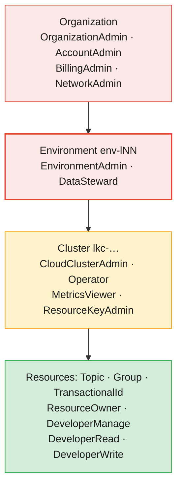

| Role | Scope | Summary |
| ---- | ----- | ------- |
| **OrganizationAdmin** | Organization | Full access to every resource in the organization |
| **AccountAdmin** | Organization | Create, describe, delete and invite user accounts and service accounts |
| **BillingAdmin** | Organization | Billing, invoices and payment details |
| **NetworkAdmin** | Organization | Confluent Cloud networks for private networking |
| **EnvironmentAdmin** | Environment | Full access to all resources in the environment — **your role in the labs** |
| **CloudClusterAdmin** | Cluster | Full management of one cluster, including ACLs |
| **ResourceKeyAdmin** | Cluster / registry | Manage API keys for Kafka, Schema Registry and ksqlDB clusters |
| **Operator** | Org / env / cluster | Describe resources and monitor health and metrics, no data access |
| **MetricsViewer** | Org / env / cluster | Read the Metrics API (Module 8) |
| **ResourceOwner** | Resource | Read and write the resource, with full management of it |
| **DeveloperManage** | Resource | Create and delete the resource; manage consumer groups |
| **DeveloperRead** | Resource | Read-only access (topics, consumer groups) |
| **DeveloperWrite** | Resource | Produce to the resource |

Cloud also has roles for Flink, ksqlDB, connectors and Stream Governance
(`FlinkAdmin`, `FlinkDeveloper`, `KsqlAdmin`, `ConnectManager`,
`DataSteward`, `DataDiscovery`, `Assigner`); they come back in Module 10.

### 4.4 Managing role bindings with the Confluent CLI

The same command family works on both targets; only the scope flags differ.

```bash
# --- Confluent Cloud: billing service account may read all lNN.cdr.* topics ---
confluent iam rbac role-binding create --principal User:sa-abc123 --role DeveloperRead \
  --environment env-xxxxx --cloud-cluster lkc-xxxxx --kafka-cluster lkc-xxxxx \
  --resource Topic:l07.cdr. --prefix
# ... and use its consumer group
confluent iam rbac role-binding create --principal User:sa-abc123 --role DeveloperRead \
  --environment env-xxxxx --cloud-cluster lkc-xxxxx --kafka-cluster lkc-xxxxx \
  --resource Group:l07.billing
# Audit one principal across nested scopes
confluent iam rbac role-binding list --principal User:sa-abc123 --inclusive

# --- Confluent Platform: same idea, scoped by the Kafka cluster ID from MDS ---
confluent cluster describe --url $MDS_URL --certificate-authority-path $CP_CA   # → kafka-cluster ID
confluent iam rbac role-binding create --principal User:l07 --role DeveloperRead \
  --kafka-cluster $CP_ID --resource Topic:l07.cdr.data
confluent iam rbac role-binding list --principal User:l07 --kafka-cluster $CP_ID
```

| Task | Command |
| ---- | ------- |
| **Grant** | `confluent iam rbac role-binding create --principal … --role … <scope> [--resource … --prefix]` |
| **Revoke** | `confluent iam rbac role-binding delete` with the *same* flags as the create |
| **Audit a principal** | `confluent iam rbac role-binding list --principal User:…` (`--inclusive` on Cloud for nested scopes) |
| **Audit yourself** | `confluent iam rbac role-binding list --current-user` (Cloud) |
| **Who has a role** | `confluent iam rbac role-binding list --role CloudClusterAdmin --current-environment --cloud-cluster lkc-…` |

> **Common trap:** a role binding on `Topic:l07.cdr.` *without* `--prefix`
> is a literal binding on a topic that is literally named `l07.cdr.` — which
> does not exist. The command succeeds, and access is still denied. Always
> check the `Pattern Type` column in `role-binding list`.

### 4.5 Designing least-privilege access for applications

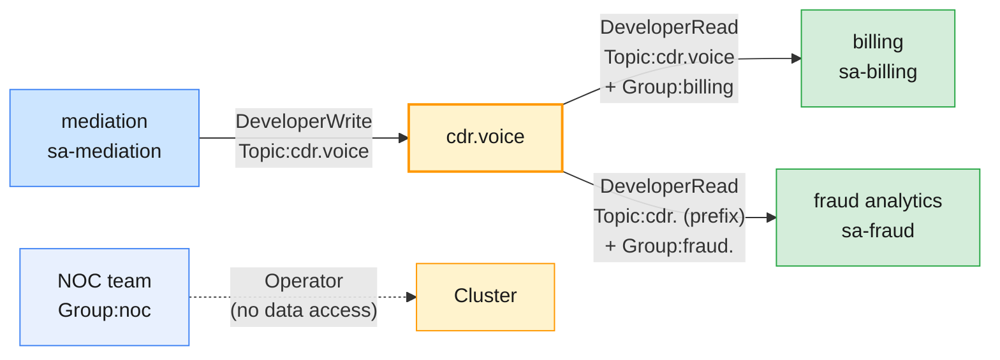

| Application / team | Principal | Role bindings | Never give |
| ------------------ | --------- | ------------- | ---------- |
| **Mediation (producer)** | One service account | `DeveloperWrite` on `Topic:cdr.voice` | Read, Delete, `ResourceOwner` |
| **Billing (consumer)** | One service account | `DeveloperRead` on `Topic:cdr.voice` + `Group:billing` | Write |
| **Fraud analytics** | One service account | `DeveloperRead` on `Topic:cdr.` (prefix) + `Group:fraud.` (prefix) | Anything on `cdr.voice` write path |
| **Platform team** | LDAP group / Cloud group mapping | `SystemAdmin` (CP) or `CloudClusterAdmin` | Shared personal accounts |
| **NOC / monitoring** | LDAP group | `Operator`, `MetricsViewer` (Cloud) | Developer roles |
| **App team lead** | User | `ResourceOwner` on the team's topic prefix | Cluster-level roles |

> **The production baseline:** one identity per application, roles on the
> narrowest prefix that matches your naming convention, groups (not
> individuals) for human teams, and a quarterly
> `role-binding list` review exported to your audit trail. Naming
> conventions are security controls: `lNN.` in this course, `<domain>.<app>.`
> in production.

---

## 5. API keys and secrets management (Confluent Cloud)

### 5.1 Identities: user accounts and service accounts

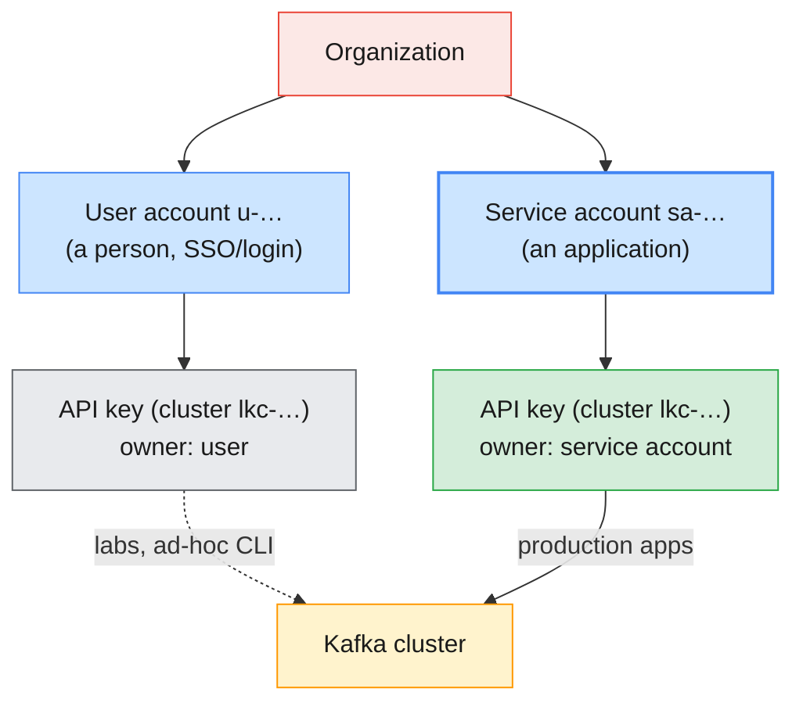

In Module 6 you created an API key owned by **your user**. That was fine for a
lab, and wrong for production, for a simple reason: **an API key has the
permissions of its owner.** If a person leaves and their account is deleted,
Confluent revokes all access by that account, *including every API key it
owns* — and the billing pipeline stops at 02:00.

| Identity | Created with | Represents | Gets permissions from |
| -------- | ------------ | ---------- | --------------------- |
| **User account** (`u-…`) | Invitation / SSO | A person | Role bindings on `User:u-…` |
| **Service account** (`sa-…`) | `confluent iam service-account create <name> --description "…"` | One application or use case | Role bindings or ACLs on `User:sa-…` |
| **Identity pool** | OAuth configuration | Workloads that present OIDC tokens instead of API keys | Role bindings on the pool |

```bash
# Create a service account per application (needs AccountAdmin or OrganizationAdmin;
# in the course they are pre-created as sa-lNN-app by infra/confluent/scripts/cc-provision.sh)
confluent iam service-account create sa-l07-billing --description "Billing CDR consumer"
confluent iam service-account list
```

### 5.2 API key types and scope

| Key type | `--resource` | Use | Owned by (production) |
| -------- | ------------ | --- | --------------------- |
| **Cluster API key** | `lkc-…` | Kafka clients: produce, consume, admin client | Service account |
| **Schema Registry key** | `lsrc-…` | Schema Registry clients (Module 10) | Service account |
| **Cloud resource management key** | `cloud` | Management APIs: Terraform, Metrics API (Module 8) | Dedicated automation service account |

A key **authenticates**; it does not **authorize**. The key identifies its
owner, and the owner's role bindings and ACLs decide what the key can do. A
cluster API key for a service account with no role bindings connects
successfully and is then denied on every topic — a scenario you will
deliberately reproduce in the lab (§8.2).

> **Common trap:** "the key is for lkc-abc, so it can do anything on lkc-abc".
> No: the `--resource` only says *which cluster accepts the key*. Permissions
> come from the owner's bindings. The opposite trap also exists: a key for
> cluster A is rejected by cluster B with a `SaslAuthenticationException`
> even if the owner has bindings on B.

### 5.3 The API key lifecycle: create, distribute, rotate, revoke

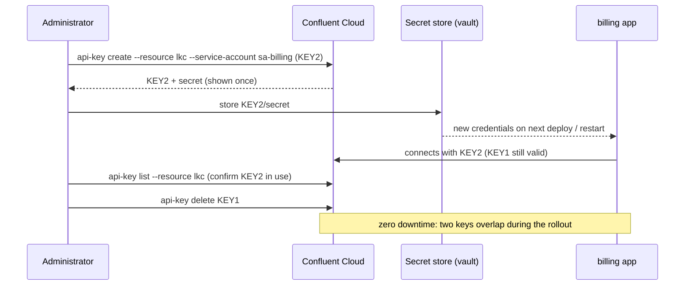

```bash
# Create a key for a service account (the secret is printed ONCE)
confluent api-key create --resource lkc-xxxxx --service-account sa-abc123 \
  --description "billing prod 2026-Q4"
# Inventory
confluent api-key list --resource lkc-xxxxx
# Revoke the old key after the rollout
confluent api-key delete KEY1OLDXXXXXXXXX
```

| Stage | Rule |
| ----- | ---- |
| **Create** | Owned by a service account; one key per application *and* environment; a description that says who and when |
| **Distribute** | Straight into a secret store (Vault, AWS Secrets Manager, Kubernetes Secret); never e-mail, chat or a ticket |
| **Rotate** | Create the new key, roll it out, confirm, then delete the old one — two keys overlap, so there is no outage |
| **Revoke** | `confluent api-key delete` on suspicion of leak; deleting the service account revokes all of its keys at once |
| **Lose the secret** | It cannot be retrieved: create a new key, delete the old one |

> **Administrator takeaway:** rotating an API key is not like changing a
> password in place. It is *create new → deploy → delete old*. Keep
> descriptions dated so that `api-key list` tells you which key is overdue.

### 5.4 Storing secrets safely

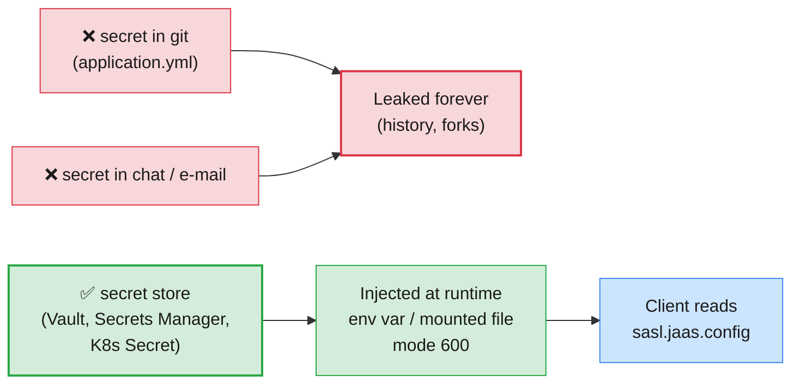

The course already follows the small-scale version of these rules:

| Practice | Where you saw it |
| -------- | ---------------- |
| `read -rsp` keeps the secret out of shell history | Module 6 Lab 01 Part 5 |
| `umask 077` → client config files are mode `600` | `ccloud.properties`, `cp.properties`, `apache.properties` |
| Masking with `sed 's/password=.*/password=<hidden>;/'` before showing a file | Module 6 Labs 01 and 03 |
| Secrets folder git-ignored; only IDs in inventories | `infra/confluent/secrets/`, `cc-inventory.csv` |
| Each learner receives only their own credentials | `infra/LAB-SETUP.md` §9 |

> **Common trap:** `--unsafe-trace` (or `-vvvv`) on the Confluent CLI logs
> full HTTP requests and responses, which can contain secrets in clear text.
> Never paste that output into a ticket without redacting it.

### 5.5 Secrets protection on Confluent Platform

Self-managed clusters have their own secrets problem: `server.properties`,
Connect worker configs and Control Center configs contain keystore passwords
and LDAP bind passwords. Confluent Platform **secrets protection** encrypts
those values in place with envelope encryption (AES/GCM), using a master key
derived from a passphrase.

```bash
# Generate the master key (prints it once) and export it for the service
confluent secret master-key generate --local-secrets-file /path/to/security.properties \
  --passphrase @passphrase.txt
export CONFLUENT_SECURITY_MASTER_KEY=<generated key>
# Encrypt one parameter in a component's config file
confluent secret file encrypt --config-file /etc/kafka/server.properties \
  --local-secrets-file /path/to/security.properties \
  --remote-secrets-file /path/to/security.properties \
  --config ssl.keystore.password
```

cp-ansible wires the same mechanism into every service through the
`CONFLUENT_SECURITY_MASTER_KEY` environment variable when
`*_secrets_protection_enabled` is set — you can see the hooks in the course
`hosts.yml`. The course cluster does not enable it; production clusters
should.

---

## 6. Encryption and network security in Confluent-managed environments

### 6.1 Encryption in transit

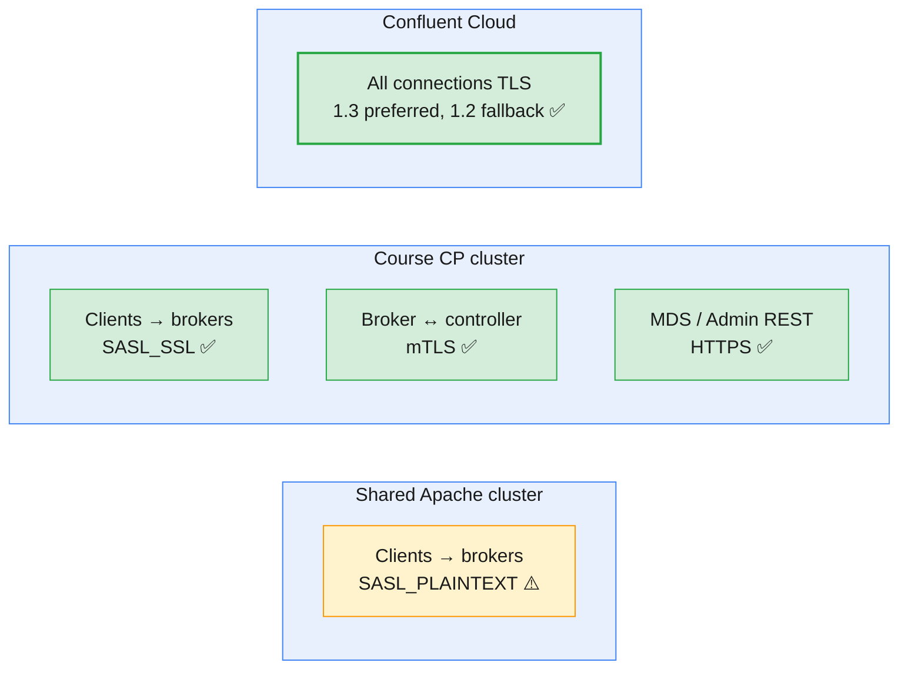

| | Apache Kafka / self-managed CP | Confluent Cloud |
| - | ----------------------------- | --------------- |
| **Who turns TLS on** | You, per listener (`SSL` / `SASL_SSL`) | Always on; plaintext is not accepted |
| **Versions and ciphers** | `ssl.enabled.protocols`, `ssl.cipher.suites` on the broker | TLS 1.3 preferred, 1.2 fallback; only Dedicated clusters can restrict cipher suites |
| **Certificates** | Your CA, your renewal process (course certificates default to 120 days) | Managed by Confluent; clients use public CAs |
| **Inter-broker / controller** | You configure `inter.broker.listener.name` and the controller listener | Confluent's responsibility |
| **HTTP components** | HTTPS on MDS, Admin REST, Schema Registry, Connect, Control Center | Managed |

> **Common trap:** certificate expiry. A self-managed cluster with TLS on
> every listener stops accepting connections the day its certificates
> expire, and every client fails at once with SSL handshake errors. Put the
> expiry date (`openssl x509 -enddate -noout -in cert.pem`) in your monitoring
> (Module 8), and rehearse renewal as a rolling restart (Module 5 §6).

### 6.2 Encryption at rest

| | Apache Kafka / self-managed CP | Confluent Cloud |
| - | ----------------------------- | --------------- |
| **Default** | None in Kafka itself: segments are plain files (Module 3 §3) | Basic encryption at rest for all clusters, by the cloud provider |
| **Your options** | Encrypted disks or volumes (LUKS, encrypted EBS), file-system permissions | **Self-managed keys (BYOK)** on Dedicated, Enterprise and Freight clusters, with AWS KMS, Azure Key Vault or Google Cloud KMS; chosen at cluster creation and not changeable afterwards |
| **Payload-level** | Encrypt fields in the client | **Client-side field-level encryption** (CSFLE) with Schema Registry rules (Module 10) |

> **Administrator takeaway:** TLS protects the wire, disk encryption protects
> a stolen volume, and neither protects an MSISDN from a principal who is
> *allowed* to read the topic. That last protection is authorization (§4) —
> or field-level encryption when even administrators must not see the value.

### 6.3 Network security

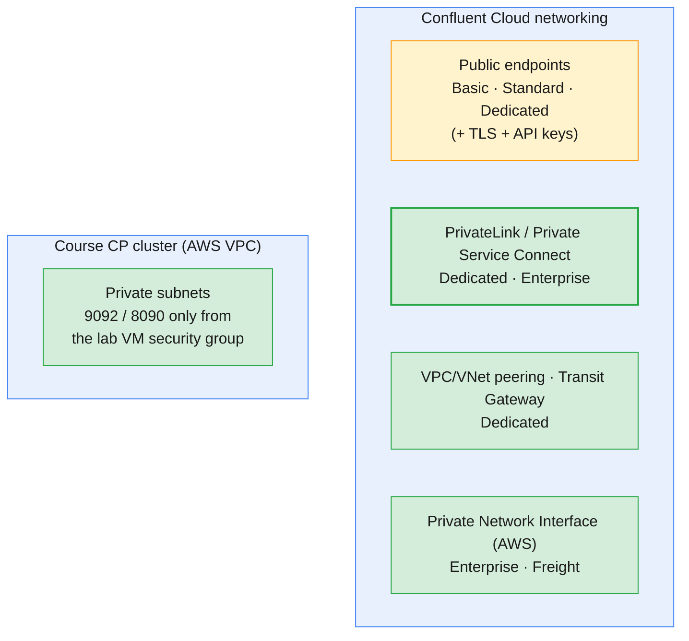

| Control | Self-managed (course CP cluster) | Confluent Cloud |
| ------- | -------------------------------- | --------------- |
| **Reachability** | Private subnets; security groups allow 9092 and 8090 only from the lab VMs; never open to the internet (`infra/confluent/README.md` §B.2) | Public endpoints, or private networking on the cluster types above |
| **Choice is permanent?** | No — change security groups any time | Yes: public vs private cannot be changed after the cluster is provisioned |
| **Admin endpoints** | MDS / Admin REST on 8090 inside the VPC; Control Center published through a reverse proxy with its own login | Cloud Console and APIs over HTTPS with your login / Cloud API key |
| **Course Cloud clusters** | — | Basic clusters: public endpoints only, protected by TLS + API keys |

> **The production baseline for a telco:** private connectivity (PrivateLink
> or equivalent) for Confluent Cloud clusters that carry subscriber data, and
> private subnets plus security groups for self-managed clusters. A public
> endpoint is protected only by its credentials — which is why §5's key
> hygiene matters so much on Basic and Standard clusters.

---

## 7. Comparing the Confluent security model to Apache Kafka ACLs, SASL and SSL

### 7.1 Side by side

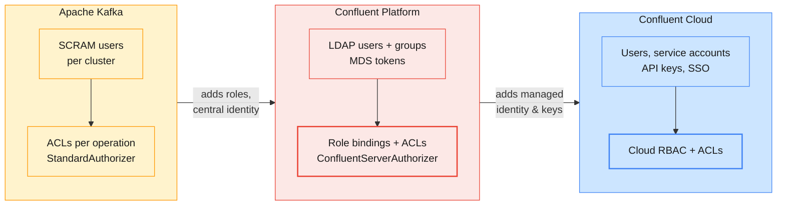

| Aspect | Apache Kafka | Confluent Platform | Confluent Cloud |
| ------ | ------------ | ------------------ | --------------- |
| **Identity store** | SCRAM in cluster metadata, Kerberos, certificates, OIDC | LDAP/AD or OIDC via MDS (plus everything Apache supports) | Confluent user accounts, SSO, service accounts, identity pools |
| **Application credential** | SCRAM user/password or certificate | LDAP service user or certificate | API key + secret (owned by a service account), or OAuth |
| **Wire security** | Your choice per listener | Your choice; course: `SASL_SSL` everywhere | Always TLS, `SASL_SSL` + `PLAIN` for API keys |
| **Authorization model** | ACLs only | RBAC role bindings + ACLs | RBAC role bindings + ACLs |
| **Granularity unit** | One operation on one resource pattern | A role on a resource pattern, scoped to a cluster | A role on an org / environment / cluster / resource |
| **Who can grant** | Anyone with `Alter` on the cluster | `SystemAdmin`, `UserAdmin`, `ResourceOwner` (own resources) | Role bindings: `OrganizationAdmin`, `EnvironmentAdmin`, `ResourceOwner` …; ACLs: also `CloudClusterAdmin` |
| **Covers Schema Registry, Connect, ksqlDB?** | No — each has its own security | Yes, one RBAC model across components | Yes |
| **Groups** | No native group principals | LDAP groups (`Group:…`) | Group mappings via SSO |
| **Tooling** | `kafka-acls.sh`, `kafka-configs.sh` | `confluent iam rbac …`, `kafka-acls.sh` | `confluent iam …`, `confluent api-key …`, `confluent kafka acl …`, Cloud Console |
| **Audit** | Authorizer log4j logger | Confluent audit logs (`SecurityAdmin`/`AuditAdmin`) | Confluent Cloud audit logs |

### 7.2 Translating ACLs into role bindings

The course environment contains a ready-made translation: the Apache cluster
and the CP cluster grant learners *the same rights* in two models.

| Apache cluster (ACLs, `bootstrap-security.sh`) | CP cluster (RBAC, `cp-rbac-learners.sh`) |
| ---------------------------------------------- | ---------------------------------------- |
| `--allow-principal User:l07 --operation All --topic l07. --resource-pattern-type prefixed` | `--principal User:l07 --role ResourceOwner --resource Topic:l07. --prefix` |
| `--allow-principal User:l07 --operation All --group l07. --resource-pattern-type prefixed` | `--principal User:l07 --role ResourceOwner --resource Group:l07. --prefix` |
| `--operation Describe --operation DescribeConfigs --cluster` | Same ACL, kept as an ACL (§3.4) |
| `super.users=…;User:trainer` | `User:trainer` → `SystemAdmin` |

Typical application patterns translate like this:

| Need | Apache ACLs | Confluent role binding |
| ---- | ----------- | ---------------------- |
| **Producer** on `cdr.voice` | `--producer --topic cdr.voice` (Write, Describe, Create) | `DeveloperWrite` on `Topic:cdr.voice` |
| **Consumer** in group `billing` | `--consumer --topic cdr.voice --group billing` (Read, Describe) | `DeveloperRead` on `Topic:cdr.voice` + `DeveloperRead` on `Group:billing` |
| **Topic owner** for a team | `All` on a prefixed topic pattern | `ResourceOwner` on `Topic:<prefix>` with `--prefix` |
| **Explicit block** | `--deny-principal …` | No deny roles — keep an ACL |

> **Common trap for Apache Kafka administrators:** granting `ResourceOwner`
> because "it is like `All`". It is more than `All`: a `ResourceOwner` can
> **grant other principals access** to the resource. Give it to accountable
> humans who own a topic prefix, not to applications.

### 7.3 Choosing: a decision table

| Situation | Use |
| --------- | --- |
| Pure Apache Kafka, a few applications | SASL/SCRAM over `SASL_SSL` + prefix ACLs |
| Self-managed Confluent with an enterprise directory | LDAP + RBAC role bindings for groups; ACLs only for denies and single operations |
| Confluent Cloud | One service account per app, role bindings, API keys in a vault, rotation schedule; SSO for people |
| Data must stay private from administrators | Add field-level encryption on top of any of the above |
| Regulated data on Cloud | Private networking, BYOK on Dedicated/Enterprise, audit logs exported |

---

## 8. Hands-on lab: RBAC roles, API keys and access validation

> **Lab status:** `labs/module-07/` is not written yet. This section is a
> **preview** of the hands-on, built from the Module 6 labs and the course
> environment (`infra/LAB-SETUP.md` §6–§7: *"Confluent Cloud: RBAC + API keys.
> CP: LDAP users + RBAC. Compare with Apache SASL/ACLs"*). The Module 7 labs
> will be the runtime companion; when they exist, their commands and expected
> outputs take precedence over this preview.

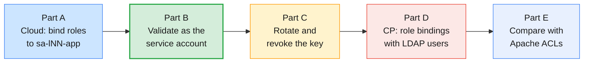

Variables, as in Module 6:

```bash
# (VM)
source ~/kafka/confluent.env            # CP, MDS_URL, CP_REST, CP_CA, C3_URL
ME=lNN                                  # your prefix
CFG=~/kafka/cp.properties               # your LDAP user on the shared Confluent Platform
APACHE=apache-kafka.lab.internal:9092
APACHE_CFG=~/kafka/apache.properties
confluent context list                  # start in your Cloud context
```

### 8.1 Part A — Bind roles to your service account on Confluent Cloud

```bash
# (VM) 1. Your environment, cluster and pre-created service account sa-lNN-app
confluent environment list
ENV_ID=env-xxxxx                        # ← your env-lNN ID
confluent environment use $ENV_ID
confluent kafka cluster list
LKC=lkc-xxxxx                           # ← your lNN-basic cluster
confluent kafka cluster use $LKC
confluent iam service-account list | grep "sa-$ME-app"
SA=sa-xxxxxx                            # ← its ID

# 2. Topics the application will use (management calls run with your Cloud login)
confluent kafka topic create $ME.cdr.voice --partitions 6 --if-not-exists
confluent kafka topic create $ME.cdr.secret --partitions 1 --if-not-exists

# 3. Before any binding: what can the service account do?
confluent iam rbac role-binding list --principal User:$SA --inclusive

# 4. Least privilege: write and read cdr.voice, use one consumer group
SCOPE="--environment $ENV_ID --cloud-cluster $LKC --kafka-cluster $LKC"
confluent iam rbac role-binding create --principal User:$SA --role DeveloperWrite $SCOPE --resource Topic:$ME.cdr.voice
confluent iam rbac role-binding create --principal User:$SA --role DeveloperRead  $SCOPE --resource Topic:$ME.cdr.voice
confluent iam rbac role-binding create --principal User:$SA --role DeveloperRead  $SCOPE --resource Group:$ME.billing
confluent iam rbac role-binding list --principal User:$SA --inclusive

# 5. An API key owned by the service account, not by you
confluent api-key create --resource $LKC --service-account $SA --description "$ME billing app $(date +%F)"
SA_KEY=XXXXXXXXXXXXXXXX                 # ← the key printed above
read -rsp "SA API secret: " SA_SECRET; echo
umask 077
confluent kafka client-config create java --api-key $SA_KEY --api-secret "$SA_SECRET" 2>/dev/null \
  | grep -E '^(bootstrap.servers|security.protocol|sasl.mechanism|sasl.jaas.config)=' \
  > ~/kafka/sa-app.properties
unset SA_SECRET
SA_CFG=~/kafka/sa-app.properties
CCLOUD=$(grep bootstrap.servers $SA_CFG | cut -d= -f2)
```

### 8.2 Part B — Validate access as the service account

```bash
# (VM) 6. Allowed: produce and consume cdr.voice in group lNN.billing
printf '%s\n' '971501234567:{"dur":42}' '971509876543:{"dur":7}' | \
  kafka-console-producer.sh --bootstrap-server $CCLOUD --command-config $SA_CFG \
  --topic $ME.cdr.voice --property parse.key=true --property key.separator=:
kafka-console-consumer.sh --bootstrap-server $CCLOUD --command-config $SA_CFG \
  --topic $ME.cdr.voice --group $ME.billing --from-beginning --max-messages 2

# 7. Denied: a topic without a binding, a group without a binding, an admin operation
kafka-console-consumer.sh --bootstrap-server $CCLOUD --command-config $SA_CFG \
  --topic $ME.cdr.secret --group $ME.billing --from-beginning --max-messages 1 --timeout-ms 15000
kafka-console-consumer.sh --bootstrap-server $CCLOUD --command-config $SA_CFG \
  --topic $ME.cdr.voice --group $ME.fraud --from-beginning --max-messages 1 --timeout-ms 15000
kafka-topics.sh --bootstrap-server $CCLOUD --command-config $SA_CFG \
  --delete --topic $ME.cdr.voice

# 8. What the service account can see
kafka-topics.sh --bootstrap-server $CCLOUD --command-config $SA_CFG --list
```

Note how each denial is reported: a topic authorization error, a **group**
authorization error, and a refused delete. `--list` shows only the topic the
account has a binding on — authorization also filters what you can *see*.

### 8.3 Part C — Rotate and revoke

```bash
# (VM) 9. Rotate: second key, switch the app, delete the first
confluent api-key create --resource $LKC --service-account $SA --description "$ME billing app rotated $(date +%F)"
confluent api-key list --resource $LKC                    # two keys for one owner
# ... rebuild sa-app.properties with the new key as in step 5, re-run step 6 ...
confluent api-key delete $SA_KEY --force

# 10. Revoke by role: remove the write binding, then try to produce again
confluent iam rbac role-binding delete --principal User:$SA --role DeveloperWrite $SCOPE --resource Topic:$ME.cdr.voice
```

The produce attempt after step 10 must be refused while consumption still
works. Role-binding changes can take a short time to propagate; retry once
before you conclude anything.

### 8.4 Part D — Role bindings on the shared Confluent Platform cluster

```bash
# (VM) 11. Log in to MDS and read your own bindings (Module 6 Lab 03 Part 4)
confluent login --url $MDS_URL --certificate-authority-path $CP_CA --save
confluent cluster describe --url $MDS_URL --certificate-authority-path $CP_CA
CP_ID=xxxxxxxxxxxxxxxxxxxxxx            # ← kafka-cluster ID
confluent iam rbac role-binding list --principal User:$ME --kafka-cluster $CP_ID

# 12. ResourceOwner can grant: give your neighbour (lMM, agreed with the trainer) read access to one topic
confluent kafka topic create $ME.cdr.shared --url $CP_REST --certificate-authority-path $CP_CA \
  --partitions 1 --replication-factor 3
confluent iam rbac role-binding create --principal User:lMM --role DeveloperRead \
  --kafka-cluster $CP_ID --resource Topic:$ME.cdr.shared
confluent iam rbac role-binding list --principal User:lMM --kafka-cluster $CP_ID

# 13. ...but only on what you own
confluent iam rbac role-binding create --principal User:lMM --role DeveloperRead \
  --kafka-cluster $CP_ID --resource Topic:other.topic
```

Your neighbour validates from their VM with their own `cp.properties`:
`kafka-console-consumer.sh --bootstrap-server $CP --command-config $CFG --topic lNN.cdr.shared --group lMM.reader --from-beginning --max-messages 1`
(their own `lMM.` group: a console consumer without `--group` invents a group
name they have no rights on). Reading works; producing to it does not. Then log in to Control Center as
yourself and find the new binding on the topic.

### 8.5 Part E — The same rights as Apache ACLs

```bash
# (VM) 14. Your ACLs on the shared Apache cluster (listing needs cluster Describe, which you have)
kafka-acls.sh --bootstrap-server $APACHE --command-config $APACHE_CFG --list --principal User:$ME
# 15. You cannot grant on the Apache cluster: no Alter on the cluster
kafka-acls.sh --bootstrap-server $APACHE --command-config $APACHE_CFG --add \
  --allow-principal User:lMM --operation Read --topic $ME.cdr.voice
```

Compare step 15 with step 12: on Apache Kafka only cluster administrators can
grant, so a topic owner must open a ticket. With Confluent RBAC, the
`ResourceOwner` of a prefix can delegate access to it — and nothing else.

**Clean up:**

```bash
# (VM)
confluent iam rbac role-binding delete --principal User:lMM --role DeveloperRead \
  --kafka-cluster $CP_ID --resource Topic:$ME.cdr.shared
confluent kafka topic delete $ME.cdr.shared --url $CP_REST --certificate-authority-path $CP_CA --force
confluent context use <your Cloud context name>
confluent api-key list --resource $LKC                    # delete leftover service-account keys
confluent kafka topic delete $ME.cdr.secret --force
rm -f ~/kafka/sa-app.properties
```

| Observation | Concept | Where it's covered |
| ----------- | ------- | ------------------ |
| A new service account connects but is denied on every topic | Keys authenticate; role bindings authorize | §5.2 |
| `--list` as the service account shows only bound topics | Authorization filters metadata visibility | §2.4 |
| Consuming in an unbound group fails even though the topic is readable | Consumers need `DeveloperRead` on the group too | §7.2 |
| Two API keys for one service account during rotation | Overlapping keys give zero-downtime rotation | §5.3 |
| Removing `DeveloperWrite` blocks produce but not consume | Roles are additive and independent | §4.1 |
| `ResourceOwner` can grant on `lNN.*` but not on `other.topic` | Delegated administration bounded by ownership | §4.2, §7.2 |
| `kafka-acls.sh --add` refused on the Apache cluster | Only `Alter` on the cluster grants ACLs | §2.4, §7.1 |
| `cp.properties` uses `SASL_SSL`, `apache.properties` uses `SASL_PLAINTEXT` | Encryption in transit is a per-listener choice | §2.2, §6.1 |

---

## 9. Troubleshooting security errors

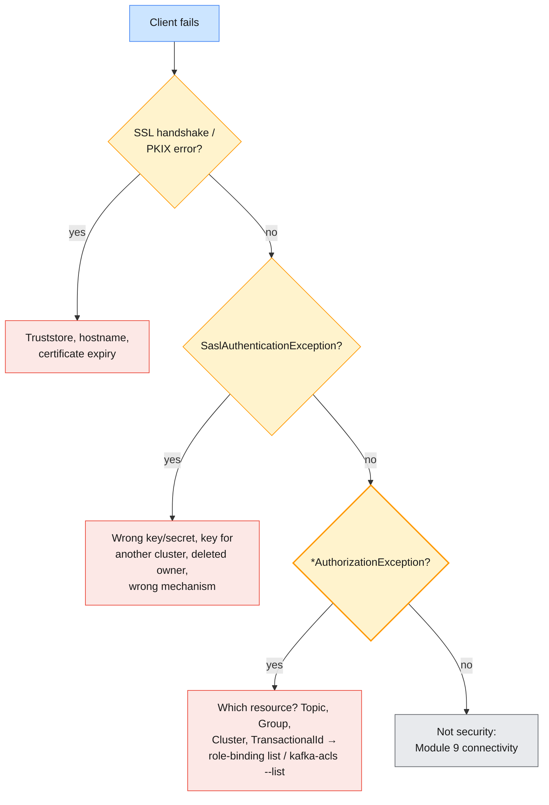

| Symptom | Likely cause | Check / fix |
| ------- | ------------ | ----------- |
| **`SSLHandshakeException`, PKIX path building failed** | Client does not trust the broker's CA | `ssl.truststore.location` / `--certificate-authority-path`; course CA is `~/kafka/cp-ca.pem` |
| **`No subject alternative names matching …`** | Bootstrap or advertised host not in the certificate | Use the hostname in the certificate (`cp-kafka.lab.internal`), not an IP |
| **Everything fails with SSL errors on one date** | Certificates expired | `openssl x509 -enddate`; renew and roll brokers (Module 5 §6) |
| **`SaslAuthenticationException` on Cloud** | Wrong key/secret, key for another `lkc`, key deleted, owner deleted | `confluent api-key list --resource lkc-…`; create a new key |
| **`SaslAuthenticationException` on CP** | Wrong LDAP password, user not in `ou=people`, LDAP unreachable | Try the same user with `confluent login --url $MDS_URL` |
| **Client hangs, then disconnects** | `security.protocol` does not match the listener (e.g. `SASL_PLAINTEXT` against a `SASL_SSL` port) | Compare the client file with the listener map |
| **`TopicAuthorizationException`** | No binding/ACL on the topic, or a literal binding where a prefix was intended | `role-binding list` → check `Pattern Type`; `kafka-acls.sh --list` |
| **`GroupAuthorizationException`** | Topic is readable but the consumer group is not | `DeveloperRead` on `Group:<group>` |
| **`ClusterAuthorizationException`** | Admin operation (alter configs, ACLs, reassignment) without cluster rights | Expected for applications and learners; ask a cluster admin |
| **`TransactionalIdAuthorizationException`** | Transactional producer (Module 4 §7.4) without rights on its `transactional.id` | Binding or ACL on `TransactionalId:<prefix>` |
| **`role-binding create` succeeds, access still denied** | Wrong scope flags, missing `--prefix`, or propagation delay | List with the same scope; wait and retry once |
| **Cannot create role bindings on CP** | You are not `ResourceOwner` of that resource (or `UserAdmin`/`SystemAdmin`) | Ask the owner; this is the design |
| **App stopped after an employee left** | API key was owned by that user, revoked with the account | Re-issue the key under a service account (§5.1) |

---

## 10. Bridging to the rest of the course

| Question this module raises | Answered in |
| --------------------------- | ----------- |
| How do I see who is connecting, failing to authenticate, or being throttled? | Module 8 |
| Which Control Center and Metrics API views need `Operator` or `MetricsViewer` only? | Module 8 |
| How do authorization errors and quotas show up when messages go missing? | Module 9 |
| How do I diagnose TLS and SASL connectivity failures end to end? | Module 9 |
| How are Schema Registry, Connect and ksqlDB secured with the same RBAC model? | Module 10 |
| How do I carry ACLs and identities across when migrating from Apache Kafka to Confluent? | Module 10 |

```mermaid
flowchart LR
    M7["Module 7:<br/>security: RBAC,<br/>API keys, TLS"] --> M8["Module 8:<br/>monitoring &<br/>performance tuning"]
    M8 --> M9["Module 9:<br/>troubleshooting &<br/>message loss"]
    M9 --> M10["Module 10:<br/>ecosystem, migration,<br/>DR & capstone"]
    style M7 fill:#fff3cd,stroke:#ff9800,stroke-width:2px,color:#1a1a1a
    style M8 fill:#fce8e6,stroke:#ea4335,stroke-width:1px,color:#1a1a1a
    style M9 fill:#fce8e6,stroke:#ea4335,stroke-width:1px,color:#1a1a1a
    style M10 fill:#fce8e6,stroke:#ea4335,stroke-width:1px,color:#1a1a1a
```

Previous guides: [Module 4](./module-04-producing-consuming-messages.md) for
the client configuration and transactional producers whose permissions you
now grant, [Module 5](./module-05-cluster-operations-replication-ha.md) for
the rolling restarts that certificate renewal needs, and
[Module 6](./module-06-introducing-confluent-kafka.md) for the Confluent CLI
logins, contexts and API keys this module builds on.

---

## 11. Key takeaways

1. **Three layers, every request.** Encryption (TLS), authentication (SASL
   or mTLS → a principal) and authorization (ACLs, plus RBAC on Confluent);
   none of them is on by default.
2. **`PLAIN` needs TLS.** `SASL_SSL` is the production baseline;
   `SASL_PLAINTEXT` is acceptable only on isolated networks, as in the
   course's Apache cluster.
3. **ACLs are the foundation.** `StandardAuthorizer` on Apache Kafka, deny
   beats allow, `allow.everyone.if.no.acl.found=false`, prefix ACLs that
   follow the naming convention.
4. **Confluent Platform centralizes identity and authorization.** LDAP users
   and groups, MDS on port 8090 issuing tokens and storing role bindings, and
   the Confluent Server Authorizer evaluating RBAC and ACLs together.
5. **RBAC = principal + predefined role + scope + resource.** Use
   `DeveloperRead`/`DeveloperWrite` for applications, `ResourceOwner` for
   accountable owners, and cluster roles for administrators.
6. **Mind the prefix.** Without `--prefix` a binding is literal; check the
   pattern type in `role-binding list`.
7. **API keys authenticate; bindings authorize.** A key is accepted by one
   resource and has exactly its owner's permissions.
8. **Service accounts own production keys.** One per application; deleting
   a user revokes every key it owns.
9. **Rotate by overlap.** Create a new key, deploy, confirm, delete the old
   one; secrets live in a vault, never in git, chat or `-vvvv` output.
10. **Encryption and networking differ by model.** Self-managed: your
    listeners, your certificates, your disks and subnets. Confluent Cloud:
    TLS always, encryption at rest by default, BYOK and private networking on
    the larger cluster types.

---

## 12. Glossary

| Term | Definition |
| ---- | ---------- |
| **Principal** | The authenticated identity a request runs as, e.g. `User:l07`, `User:sa-abc123`, `Group:trainers` |
| **Listener** | A broker endpoint with its own port and security protocol |
| **Security protocol** | `PLAINTEXT`, `SSL`, `SASL_PLAINTEXT` or `SASL_SSL` for a listener or client |
| **SASL** | Pluggable authentication framework; Kafka supports PLAIN, SCRAM, GSSAPI and OAUTHBEARER |
| **SCRAM** | Salted challenge–response password mechanism; credentials stored in the KRaft metadata |
| **Mutual TLS (mTLS)** | TLS where the client also presents a certificate, which becomes its identity |
| **Truststore / keystore** | Trusted CA certificates / your own certificate and private key |
| **ACL** | Access control list entry: principal, allow/deny, operation, resource, pattern type, host |
| **StandardAuthorizer** | Apache Kafka's KRaft authorizer, storing ACLs in `__cluster_metadata` |
| **super.users** | Principals that bypass all authorization checks |
| **Metadata Service (MDS)** | Confluent Server service on port 8090 for login, tokens and role-binding management |
| **Confluent Server Authorizer** | Confluent's authorizer evaluating RBAC role bindings and ACLs |
| **RBAC** | Role-based access control: predefined roles bound to principals on scopes and resources |
| **Role binding** | The assignment of one role to one principal on one scope (and optionally a resource) |
| **ResourceOwner** | Resource-level role with full access to a resource and the right to grant access to it |
| **DeveloperRead / DeveloperWrite / DeveloperManage** | Resource-level roles for reading, producing, and creating/deleting resources |
| **SystemAdmin / EnvironmentAdmin / CloudClusterAdmin** | Full-control administrative roles at CP cluster, Cloud environment and Cloud cluster scope |
| **Service account** | Non-human Confluent Cloud identity (`sa-…`) for one application |
| **API key / secret** | Credential pair accepted by one resource, carrying its owner's permissions; secret shown once |
| **Key rotation** | Replacing a credential by overlapping a new key with the old one before deleting it |
| **Secrets protection** | Confluent Platform envelope encryption of passwords in component config files |
| **BYOK** | Bring your own key: self-managed encryption keys for data at rest on Dedicated, Enterprise and Freight clusters |
| **PrivateLink** | Private connectivity from your cloud account to a Confluent Cloud cluster without public endpoints |

---

## 13. References

**Apache Kafka (official)**

- Security overview (4.3) — <https://kafka.apache.org/43/security/security-overview/>
- Listener configuration — <https://kafka.apache.org/43/security/listener-configuration/>
- Encryption and authentication using SSL — <https://kafka.apache.org/43/security/encryption-and-authentication-using-ssl/>
- Authentication using SASL — <https://kafka.apache.org/43/security/authentication-using-sasl/>
- Authorization and ACLs — <https://kafka.apache.org/43/security/authorization-and-acls/>
- Incorporating security features in a running cluster — <https://kafka.apache.org/43/security/incorporating-security-features-in-a-running-cluster/>

**Kafka Improvement Proposals (KIPs)**

- KIP-801: Implement an Authorizer that stores metadata in __cluster_metadata — <https://cwiki.apache.org/confluence/display/KAFKA/KIP-801%3A+Implement+an+Authorizer+that+stores+metadata+in+__cluster_metadata>
- KIP-554: Add Broker-side SCRAM Config API — <https://cwiki.apache.org/confluence/display/KAFKA/KIP-554%3A+Add+Broker-side+SCRAM+Config+API>

**Confluent Platform**

- Authentication methods overview — <https://docs.confluent.io/platform/current/security/authentication/overview.html>
- Role-based access control overview — <https://docs.confluent.io/platform/current/security/authorization/rbac/overview.html>
- Predefined RBAC roles — <https://docs.confluent.io/platform/current/security/rbac/rbac-predefined-roles.html>
- Confluent Server Authorizer — <https://docs.confluent.io/platform/current/security/csa-introduction.html>
- Configure the Metadata Service (MDS) — <https://docs.confluent.io/platform/current/kafka/configure-mds/index.html>
- Secrets protection — <https://docs.confluent.io/platform/current/security/compliance/secrets/overview.html>

**Confluent Cloud**

- RBAC on Confluent Cloud — <https://docs.confluent.io/cloud/current/security/access-control/rbac/overview.html>
- Predefined RBAC roles on Confluent Cloud — <https://docs.confluent.io/cloud/current/security/access-control/rbac/predefined-rbac-roles.html>
- ACL overview on Confluent Cloud — <https://docs.confluent.io/cloud/current/security/access-control/acls/overview.html>
- API keys overview — <https://docs.confluent.io/cloud/current/security/authenticate/workload-identities/service-accounts/api-keys/overview.html>
- Data in transit with TLS — <https://docs.confluent.io/cloud/current/security/encrypt/tls.html>
- Self-managed encryption keys (BYOK) — <https://docs.confluent.io/cloud/current/security/encrypt/byok/overview.html>
- Client-side field-level encryption — <https://docs.confluent.io/cloud/current/security/encrypt/csfle/overview.html>
- Networking overview — <https://docs.confluent.io/cloud/current/networking/overview.html>

**Confluent CLI**

- `confluent iam rbac role-binding create` — <https://docs.confluent.io/confluent-cli/current/command-reference/iam/rbac/role-binding/confluent_iam_rbac_role-binding_create.html>
- `confluent iam rbac role-binding list` — <https://docs.confluent.io/confluent-cli/current/command-reference/iam/rbac/role-binding/confluent_iam_rbac_role-binding_list.html>
- `confluent iam service-account create` — <https://docs.confluent.io/confluent-cli/current/command-reference/iam/service-account/confluent_iam_service-account_create.html>
- `confluent api-key create` — <https://docs.confluent.io/confluent-cli/current/command-reference/api-key/confluent_api-key_create.html>
- `confluent api-key delete` — <https://docs.confluent.io/confluent-cli/current/command-reference/api-key/confluent_api-key_delete.html>
- `confluent kafka acl create` — <https://docs.confluent.io/confluent-cli/current/command-reference/kafka/acl/confluent_kafka_acl_create.html>

**Course environment**

- Lab environment setup — [`infra/LAB-SETUP.md`](../infra/LAB-SETUP.md)
- Confluent environment kit (RBAC, LDAP, certificates) — [`infra/confluent/README.md`](../infra/confluent/README.md)

**Books**

- *Kafka: The Definitive Guide*, 2nd ed. (Shapira, Palino, Sivaram, Petty; O'Reilly)

---

> **Next module:** _Module 8 — Monitoring & Performance Tuning with Confluent Kafka_,
> where you watch the clusters you have just secured: Control Center
> monitoring and alerting, the Metrics API and Health+, throughput and latency
> indicators, and how they compare with the JMX and Prometheus stack on the
> Apache cluster.
