# Module 8 — Monitoring & Performance Tuning with Confluent Kafka

> **Course:** Apache Kafka & Confluent Kafka Administration
> **Module objective:** Monitor and tune Confluent Kafka clusters for
> performance using Confluent's administration tooling.

---

## Table of contents

1. [Why this module matters](#1-why-this-module-matters)
2. [What to watch: throughput, latency and health indicators](#2-what-to-watch-throughput-latency-and-health-indicators)
3. [Confluent Control Center monitoring and alerting](#3-confluent-control-center-monitoring-and-alerting)
4. [Confluent Metrics API and Health+ overview](#4-confluent-metrics-api-and-health-overview)
5. [Performance considerations and scaling in Confluent-managed clusters](#5-performance-considerations-and-scaling-in-confluent-managed-clusters)
6. [Comparing to Apache Kafka JMX / Prometheus-based monitoring](#6-comparing-to-apache-kafka-jmx--prometheus-based-monitoring)
7. [Hands-on lab: monitoring, alerting and consumer lag](#7-hands-on-lab-monitoring-alerting-and-consumer-lag)
8. [Troubleshooting monitoring and performance issues](#8-troubleshooting-monitoring-and-performance-issues)
9. [Bridging to the rest of the course](#9-bridging-to-the-rest-of-the-course)
10. [Key takeaways](#10-key-takeaways)
11. [Glossary](#11-glossary)
12. [References](#12-references)

> **How to read the diagrams:** Diagrams are written in [Mermaid](https://mermaid.js.org/),
> which renders automatically in GitHub, VS Code (with a Mermaid extension), and most
> modern Markdown viewers. If a diagram appears as code, install/enable a Mermaid
> preview to see the rendered version.

> **Builds on:** [Module 7 — Administering Kafka Security](./module-07-administering-kafka-security.md).
> This module assumes the producer and consumer tuning knobs from Module 4
> §3–§4, the ISR and capacity-planning vocabulary from Module 5 §2 and §7,
> the Control Center architecture from Module 6 §6.1, and the role bindings
> and Cloud API keys from Module 7 §4–§5. It focuses on **seeing and
> improving** cluster behaviour: which indicators matter, where Confluent
> shows them, how to alert on them, and how to scale when they turn red.

---

## 1. Why this module matters

You can now install, configure, operate and secure Kafka on two platforms.
What you cannot yet do is answer the questions the operations centre asks at
03:00: *Is the cluster healthy? Is billing keeping up with `cdr.voice`? Why is
produce latency up since the last release? Do we need a bigger cluster?*

For an IBM MQ administrator the instincts carry over. You watched queue
depth, channel status and the dead-letter queue; you alerted on
`QDEPTHHI` events and long-running channels. In Kafka, **consumer lag** plays
the role of queue depth, **under-replicated partitions** play the role of a
channel in retry, and **request latency** and **throughput** tell you whether
the queue manager — here the broker — is the bottleneck. The difference is
that Kafka never deletes a message because it was consumed, so a lagging
consumer does not fill a disk the way a full queue does; it falls behind until
retention deletes data it never read (Module 3 §5).

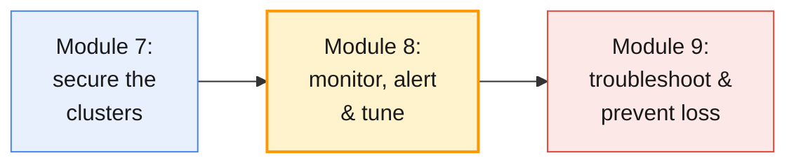

This module works across the three monitoring stacks the course runs:
**Control Center** on the shared Confluent Platform cluster, the **Metrics
API** on Confluent Cloud, and **JMX + Prometheus + Grafana** on the shared
Apache Kafka cluster (`infra/LAB-SETUP.md` §4–§7).

By the end of this module you will be able to:

- Name the **throughput, latency, saturation and availability indicators**
  that tell you whether a Kafka cluster is healthy, and read them in each
  tool.
- Monitor a Confluent Platform cluster in **Control Center**, including
  consumer lag, and create **alert triggers and actions**.
- Query Confluent Cloud with the **Metrics API**, and explain the role of
  **Health+** and its successor, Unified Stream Manager.
- Apply **performance and scaling** levers on Confluent Cloud (elastic
  eCKUs, Dedicated CKUs) and Confluent Platform (Self-Balancing, quotas).
- Compare Confluent's tooling with **Apache Kafka JMX / Prometheus**
  monitoring and map metrics between them.

---

## 2. What to watch: throughput, latency and health indicators

### 2.1 Four questions, four families of metrics

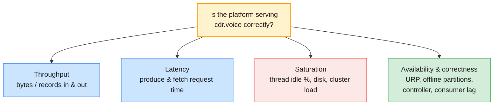

Every monitoring tool in this module — Control Center, the Metrics API,
Grafana — answers the same four questions. Learn the questions once and the
tools become different windows onto the same numbers.

| Family | Question | Typical indicators | Healthy looks like |
| ------ | -------- | ------------------ | ------------------ |
| **Throughput** | How much work is the cluster doing? | Bytes in/out, records in, request rate | Follows the business curve (daytime peaks, night batch) |
| **Latency** | How long does each request take? | Produce and fetch request total time (avg, p99) | Stable; spikes correlate with a known event |
| **Saturation** | How close to the limit are we? | Request handler and network thread idle %, disk usage, CPU, cluster load % | Idle % comfortably above 30 %; disk below your retention plan |
| **Availability** | Is every partition safe and served? | Under-replicated, under-min-ISR and offline partitions, active controller count, consumer lag | URP 0, offline 0, exactly one active controller, lag bounded |

> **Administrator takeaway:** throughput on its own is never an alert. A
> drop in bytes in might be an outage or might be 02:00. Alert on
> **availability** and **saturation**, and use throughput and latency to
> explain what you see.

### 2.2 Throughput indicators

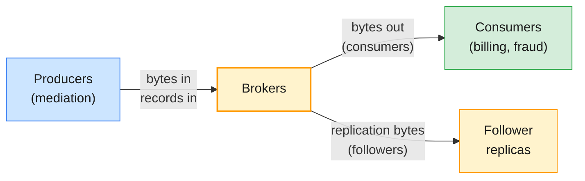

| Indicator | Apache Kafka JMX | Control Center | Metrics API (Cloud) |
| --------- | ---------------- | -------------- | ------------------- |
| **Bytes in** | `kafka.server:type=BrokerTopicMetrics,name=BytesInPerSec` | Cluster / broker / topic *Production* charts | `io.confluent.kafka.server/received_bytes` |
| **Bytes out** | `kafka.server:type=BrokerTopicMetrics,name=BytesOutPerSec` | *Consumption* charts | `io.confluent.kafka.server/sent_bytes` |
| **Records in** | `kafka.server:type=BrokerTopicMetrics,name=MessagesInPerSec` | Topic production | `io.confluent.kafka.server/received_records` |
| **Stored data** | `kafka.log:type=Log,name=Size` (per partition) | Topic storage | `io.confluent.kafka.server/retained_bytes` |

Remember the multiplier from Module 5 §7: with replication factor 3, each
byte produced is written three times and fetched by followers twice. Bytes
out from the brokers' network cards is therefore *consumer egress plus
replication*, which is why the capacity maths in Module 5 starts from
ingress × RF.

### 2.3 Latency indicators: where does the time go?

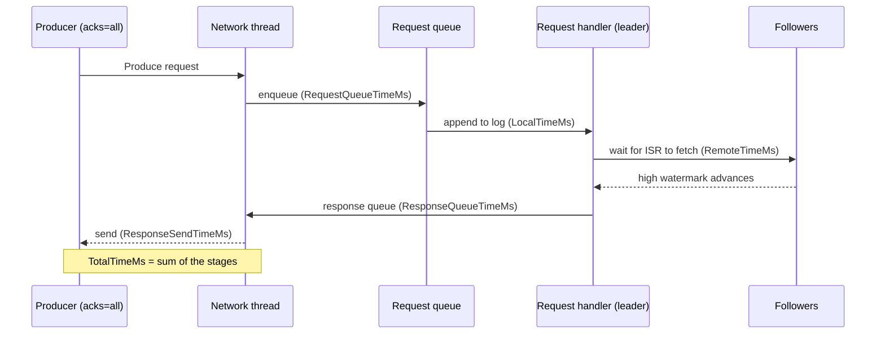

Kafka breaks every request's time into stages, exposed as
`kafka.network:type=RequestMetrics,name=<stage>,request=<Produce|FetchConsumer|FetchFollower>`.
Reading the stages tells you *which* resource is the bottleneck:

| Stage that grows | Meaning | Usual cause | Fix |
| ---------------- | ------- | ----------- | --- |
| **RequestQueueTimeMs** | Requests wait for a handler thread | Handler threads saturated | More `num.io.threads`, more brokers, fewer tiny requests (batching, Module 4 §3.2) |
| **LocalTimeMs** | Leader slow to write | Slow disk, page-cache pressure | Faster disks, check I/O wait (Module 3 §7) |
| **RemoteTimeMs** (Produce) | Waiting for followers with `acks=all` | Slow follower, cross-AZ latency, ISR shrinking | Check ISR churn; this is the price of durability (Module 3 §6) |
| **ResponseQueueTimeMs / ResponseSendTimeMs** | Network threads busy | Many connections, large fetches | More `num.network.threads`, fewer connections |

> **Common trap for MQ administrators:** reading a high **FetchConsumer**
> total time as "the broker is slow". Consumers send long-poll fetches that
> wait up to `fetch.max.wait.ms` (500 ms by default) when there is no new
> data. A quiet topic shows ~500 ms fetch latency by design. Watch
> **Produce** latency for broker health; watch consumer lag for consumer
> health.

### 2.4 Saturation indicators

| Indicator | Source | Rule of thumb |
| --------- | ------ | ------------- |
| **Request handler idle %** | `kafka.server:type=KafkaRequestHandlerPool,name=RequestHandlerAvgIdlePercent` | Investigate below 0.3 (30 %) |
| **Network processor idle %** | `kafka.network:type=SocketServer,name=NetworkProcessorAvgIdlePercent` | Investigate below 0.3 |
| **Disk usage** | Host metrics (node_exporter) / Control Center broker page | Below the threshold your retention plan assumes (Module 5 §7) |
| **Cluster load** | `io.confluent.kafka.server/cluster_load_percent` (Confluent Cloud Dedicated) | Above 80 % expect higher latency and throttling |
| **Throttle time** | Client `produce-throttle-time-avg`; Cloud `io.confluent.kafka.server/client_limit_milliseconds` | Any sustained non-zero value means a quota or cluster limit is biting |

### 2.5 Availability and replication health

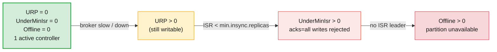

| Metric (JMX) | Normal | Alert severity |
| ------------ | ------ | -------------- |
| `kafka.server:type=ReplicaManager,name=UnderReplicatedPartitions` | 0 | Warning (sustained > a few minutes) |
| `kafka.server:type=ReplicaManager,name=UnderMinIsrPartitionCount` | 0 | Critical: `acks=all` producers are failing |
| `kafka.controller:type=KafkaController,name=OfflinePartitionsCount` | 0 | Critical: data unavailable |
| `kafka.controller:type=KafkaController,name=ActiveControllerCount` | 1 across the controllers | Critical if 0 |
| `kafka.server:type=ReplicaManager,name=IsrShrinksPerSec` / `IsrExpandsPerSec` | Near 0 | Warning if flapping |

You met each of these states in Module 5 §2–§3. Monitoring turns them from
something you discover with `kafka-topics.sh --describe
--under-replicated-partitions` into something that pages you.

### 2.6 Consumer lag: the queue depth of Kafka

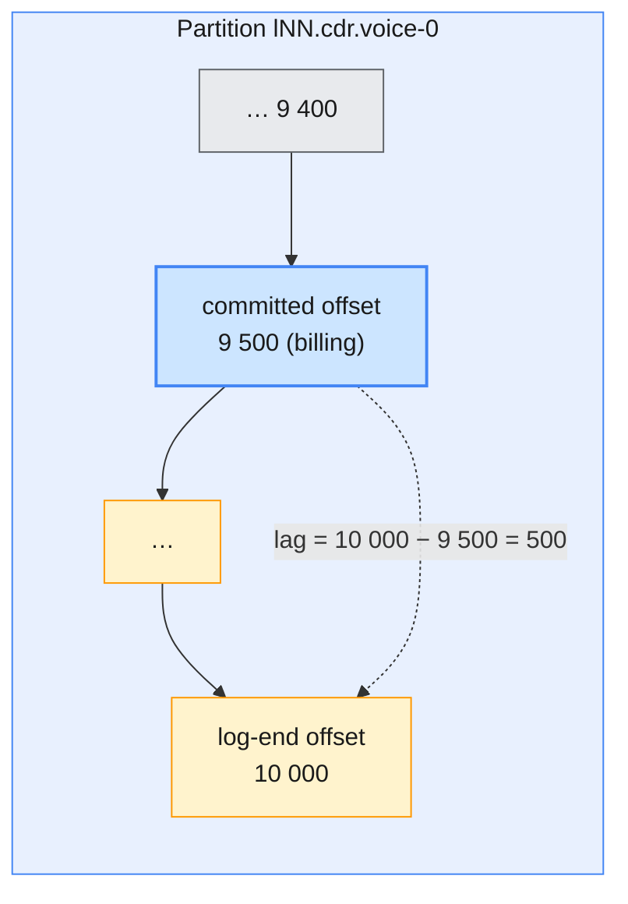

Lag is *log-end offset minus committed offset*, per partition, per consumer
group (Module 4 §5.1). It is measured in **messages**, not seconds — 500
messages behind on a topic that receives 10 per second is a 50-second delay;
on one that receives 10 000 per second it is nothing.

| Lag pattern | Diagnosis | Look at |
| ----------- | --------- | ------- |
| **Flat and low** | Healthy | — |
| **Saw-tooth** | Normal batching / commit interval | Commit strategy (Module 4 §5.2) |
| **Steadily growing** | Consumers slower than producers | Processing time, partitions vs consumers, `max.poll.records` |
| **Growing on one partition only** | Hot key or one stuck consumer | Key distribution, consumer logs |
| **Lag stops being reported** | Group empty for a long time, or consumers using `assign()` | Group state (Module 4 §4.5) |

> **The production baseline:** alert on consumer lag *per critical group*
> (billing, fraud), with a buffer of several minutes so that a rebalance or a
> deployment does not page anyone, and translate the threshold into time
> using the topic's normal message rate.

---

## 3. Confluent Control Center monitoring and alerting

### 3.1 How metrics reach Control Center 2.x

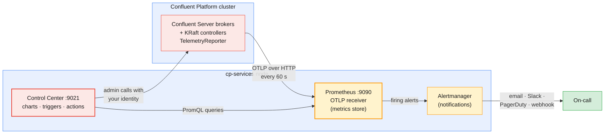

Module 6 §6.1 introduced Control Center 2.x as a UI on top of an embedded
Prometheus and Alertmanager. This is how the data gets there: every broker
and controller runs Confluent's **Telemetry Reporter**, which pushes metrics
to Prometheus's OTLP endpoint. The broker settings that make it work
(cp-ansible renders them for the course cluster when Control Center is in the
inventory):

```properties
# Broker and controller properties for Control Center 2.x (from Confluent's single-node install guide)
metric.reporters=io.confluent.telemetry.reporter.TelemetryReporter
confluent.telemetry.exporter._c3.type=http
confluent.telemetry.exporter._c3.enabled=true
confluent.telemetry.exporter._c3.client.base.url=http://<c3-host>:9090/api/v1/otlp
confluent.telemetry.metrics.collector.interval.ms=60000
confluent.consumer.lag.emitter.enabled=true
```

| Setting | Why it matters to you |
| ------- | --------------------- |
| **`metric.reporters=…TelemetryReporter`** | Without it, Control Center shows topics but no charts |
| **`…_c3.client.base.url`** | Points at Control Center's Prometheus; a wrong host means empty charts, not an error in the UI |
| **`…collector.interval.ms=60000`** | Data points are one minute apart: Control Center is not a sub-second tool |
| **`confluent.consumer.lag.emitter.enabled=true`** | The **broker** computes consumer lag and emits it as a metric — no client instrumentation needed |

On the course cluster the pieces live on `cp-services`: Control Center on
9021, Prometheus on 9090 and Alertmanager on 9093/9094, all managed by the
`cp-control-center` user (`infra/guides/confluent-platform-cluster-connect.md`).

> **Common trap:** debugging empty Control Center charts in the UI. The UI
> only queries Prometheus. Check, in order: is the broker's Telemetry
> Reporter enabled, can the brokers reach port 9090 on the Control Center
> host, and is Prometheus running with its OTLP receiver. The logs are
> `/var/log/confluent/control-center/prometheus.log` and `control-center.log`.

### 3.2 The monitoring pages

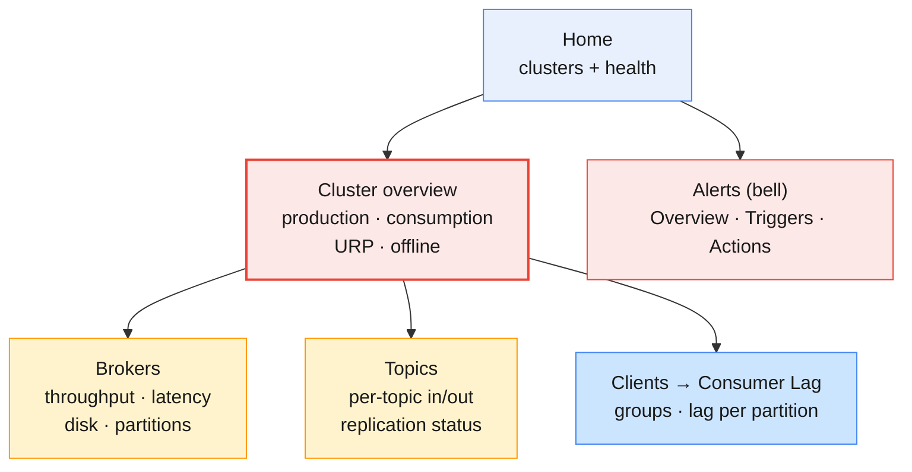

| Page | Use it to answer | Indicator family (§2) |
| ---- | ---------------- | --------------------- |
| **Cluster overview** | Is anything red right now? How much traffic? | Availability, throughput |
| **Brokers** | Is one broker hotter, slower or fuller than the others? | Latency, saturation |
| **Topics → topic → metrics** | Is `cdr.voice` receiving data? Are its replicas in sync? | Throughput, availability |
| **Clients → Consumer Lag** | Is billing keeping up? Which partition is behind? | Consumer lag |
| **Alerts** | What has fired, and who was told? | All |

What you see is filtered by RBAC (Module 7 §4): a learner with
`ResourceOwner` on `lNN.*` sees their own topics and groups, while the
trainer's `SystemAdmin` sees the whole cluster. Cluster-wide pages may be
empty or partial for learners — that is the security model working.

> **Administrator takeaway:** use Control Center for the *shape* of a
> problem (which broker, which topic, which group, since when) and the CLI
> for the *exact* numbers. `kafka-consumer-groups.sh --describe` and the lag
> page read the same offsets, but the CLI shows them at this second, and the
> chart shows them at one-minute resolution.

### 3.3 Consumer lag in Control Center

Path: **cluster → Clients → Consumer Lag**. The list shows each group with
its total lag and the number of consumers, topics and partitions; selecting
a group shows lag per partition with current and end offsets. Because lag is
computed by the brokers (§3.1), it is shown even for groups whose consumers
are currently stopped — exactly the case you care about at 03:00.

| Column you see | Same number in the CLI (`kafka-consumer-groups.sh --describe`) |
| -------------- | ---------------------------------------------------------------- |
| **Current offset** | `CURRENT-OFFSET` |
| **End offset** | `LOG-END-OFFSET` |
| **Lag** | `LAG` |
| **Consumer / client** | `CONSUMER-ID`, `CLIENT-ID` (only while members are connected) |

### 3.4 Alerts: triggers and actions

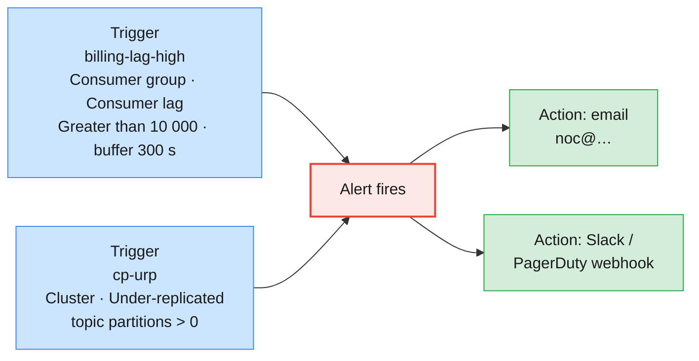

Control Center separates **what to watch** (a *trigger*) from **what to do**
(an *action*); one trigger can run any number of actions. Open the **Alerts**
bell in the top banner, then the **Triggers** tab and **+ New trigger**:

| Trigger field | Meaning |
| ------------- | ------- |
| **Trigger name** | Unique, descriptive (`billing-lag-high`) |
| **Component type** | Broker, Cluster, Consumer group or Topic |
| **Cluster id** | The cluster to evaluate |
| **Metric** | Depends on the component type (table below) |
| **Condition** | Greater than, Less than, Equal to, Not equal to |
| **Value** | The threshold |
| **Buffer (seconds)** | How long the condition must stay true before the trigger fires |

| Component type | Metrics you can trigger on |
| -------------- | -------------------------- |
| **Broker** | Bytes in / out, fetch request latency, production request count and latency |
| **Cluster** | Cluster down, leader election rate, offline topic partitions, unclean election count, under-replicated topic partitions |
| **Consumer group** | Consumer lag (total across all partitions of the group's topics) |
| **Topic** | Bytes in / out, out-of-sync replica count, production request count, under-replicated topic partitions |

The quickest route to a lag alert is from the lag page itself: **Clients →
Consumer Lag → group → Set up an alert** pre-fills the consumer-group trigger.
Actions (**Alerts → Actions**) send email, a Slack webhook or a PagerDuty
webhook; email and webhook delivery must be enabled in the Control Center
properties (`confluent.controlcenter.mail.enabled`,
`confluent.controlcenter.webhook.enabled`).

> **Common trap:** a trigger with a 0-second buffer on consumer lag. Every
> deployment and rebalance produces a short lag spike, so the alert fires on
> every release and the on-call team learns to ignore it. Use a buffer of
> several minutes for lag and URP, and none for *offline partitions* or
> *cluster down*.

### 3.5 A starter alert set for the CDR platform

| Alert | Component · metric | Condition | Buffer | Severity |
| ----- | ------------------ | --------- | ------ | -------- |
| **Cluster down** | Cluster · Cluster down | — | 0 s | Page |
| **Offline partitions** | Cluster · Offline topic partitions | > 0 | 0 s | Page |
| **Under-replicated** | Cluster · Under-replicated topic partitions | > 0 | 300 s | Ticket, page if > 30 min |
| **Unclean election** | Cluster · Unclean election count | > 0 | 0 s | Page (possible data loss, Module 9) |
| **Billing behind** | Consumer group `billing` · Consumer lag | > *rate × 5 min* | 300 s | Page in business hours |
| **No CDRs arriving** | Topic `cdr.voice` · Bytes in | < expected night minimum | 900 s | Ticket |
| **Produce latency** | Broker · Production request latency | > your p99 baseline × 3 | 300 s | Ticket |

> **The production baseline:** a handful of alerts that always mean action,
> each with a runbook link, rather than dozens that mean "have a look". If an
> alert fires and nobody needs to do anything, change or delete it.

---

## 4. Confluent Metrics API and Health+ overview

### 4.1 The Metrics API

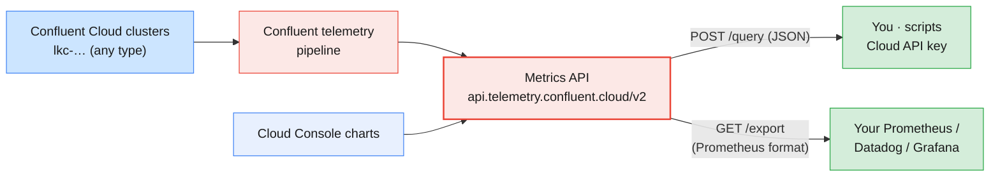

On Confluent Cloud you cannot attach a JMX agent to a broker — the brokers
are Confluent's (Module 6 §4.1). Instead, Confluent publishes server-side
metrics through the **Metrics API**, a REST API at
`https://api.telemetry.confluent.cloud/v2/metrics/cloud/`.

| Endpoint | Use |
| -------- | --- |
| **`POST /query`** | Ad-hoc and scripted queries: one metric, aggregated, filtered, grouped, over an interval |
| **`GET /export`** | Current values in Prometheus / OpenMetrics format, for a scraper |
| **`GET /descriptors/metrics?resource_type=kafka`** | Discover the metrics and labels available |
| **`GET /discovery`** | Resource discovery for monitoring tools |

| Property | Value |
| -------- | ----- |
| **Authentication** | HTTP Basic with a **Cloud resource-management API key** (`confluent api-key create --resource cloud`), *not* a cluster key |
| **Authorization** | The key's owner needs the **MetricsViewer** role (or a broader admin role) on the organization, environment or cluster |
| **Freshness** | Data points typically queryable within about 3 minutes |
| **Rate limits** | 300 requests per minute per IP address; `/export` 160 requests per hour per resource per principal |
| **Granularity** | e.g. `PT1M` (queries up to 6 hours), `PT1H` (any interval) |

> **Common trap:** using the cluster API key from Module 6 for the Metrics
> API. It is rejected — cluster keys authenticate to Kafka, not to Confluent
> Cloud's management APIs. Create a `--resource cloud` key, ideally for a
> monitoring service account bound to `MetricsViewer` (Module 7 §5).

### 4.2 Anatomy of a query

```bash
# Bytes produced per topic over the last 30 minutes, one point per minute
cat > received_bytes.json <<EOF
{
  "aggregations": [{"metric": "io.confluent.kafka.server/received_bytes"}],
  "filter": {"field": "resource.kafka.id", "op": "EQ", "value": "lkc-xxxxx"},
  "granularity": "PT1M",
  "group_by": ["metric.topic"],
  "intervals": ["$(date -u -d '-30 min' +%FT%TZ)/$(date -u +%FT%TZ)"],
  "limit": 25
}
EOF
curl -s -X POST 'https://api.telemetry.confluent.cloud/v2/metrics/cloud/query' \
  -u "$CLOUD_KEY:$CLOUD_SECRET" -H 'Content-Type: application/json' \
  -d @received_bytes.json | jq .
```

| Field | Meaning |
| ----- | ------- |
| **`aggregations`** | The metric (and optionally `agg`, e.g. `SUM`) |
| **`filter`** | Restrict to a resource: `resource.kafka.id` = your `lkc-…`, optionally combined with `metric.topic` etc. |
| **`group_by`** | Split the series by a label: `metric.topic`, `metric.consumer_group_id`, `metric.partition` |
| **`granularity`** | Bucket size (ISO-8601 duration) |
| **`intervals`** | `start/end` in ISO-8601 |

### 4.3 The metrics an administrator uses most

| Metric (`io.confluent.kafka.server/…`) | Indicator | Typical use |
| -------------------------------------- | --------- | ----------- |
| **`received_bytes`** | Ingress throughput | Capacity vs cluster-type limits (§5.2) |
| **`sent_bytes`** | Egress throughput | Consumer fan-out, egress cost |
| **`received_records`** | Records in | Business volume (CDRs per minute) |
| **`retained_bytes`** | Storage | Retention planning, storage cost |
| **`active_connection_count`** | Connections | Connection limits per eCKU (§5.2) |
| **`consumer_lag_offsets`** | Consumer lag per group / topic / partition | Lag dashboards and alerts |
| **`client_limit_milliseconds`** | Throttling applied | Proof that you are hitting a limit |
| **`producer_latency_avg_milliseconds`** | Produce latency | Client-visible latency trend |
| **`cluster_load_percent`** | Saturation (Dedicated) | When to add CKUs (§5.3) |
| **`hot_partition_ingress` / `hot_partition_egress`** | Skew (Dedicated) | Key distribution problems |

`consumer_lag_offsets` carries the labels `metric.consumer_group_id`,
`metric.topic` and `metric.partition`. It is emitted for stable groups and
for groups that have been empty for less than a day; consumers that use
`assign()` instead of `subscribe()` report no lag.

### 4.4 Feeding your own monitoring stack

```bash
# Prometheus-format snapshot of one cluster (what a Prometheus scrape job would fetch)
curl -s -u "$CLOUD_KEY:$CLOUD_SECRET" \
  "https://api.telemetry.confluent.cloud/v2/metrics/cloud/export?resource.kafka.id=lkc-xxxxx" \
  | grep -E '^confluent_kafka_server_(received_bytes|consumer_lag_offsets)' | head
```

The `/export` endpoint lets the **same Prometheus and Grafana** that watch
your self-managed clusters (§6) scrape Confluent Cloud too, so the NOC has
one dashboard for both. Respect the export rate limit: scrape once a minute,
not every few seconds.

> **Administrator takeaway:** on Confluent Cloud the Metrics API *is* your
> JMX. Everything you would have scraped from brokers yourself — throughput,
> storage, connections, lag, throttling — comes from this API, already
> aggregated across Confluent's brokers.

### 4.5 Health+ — and its successor, Unified Stream Manager

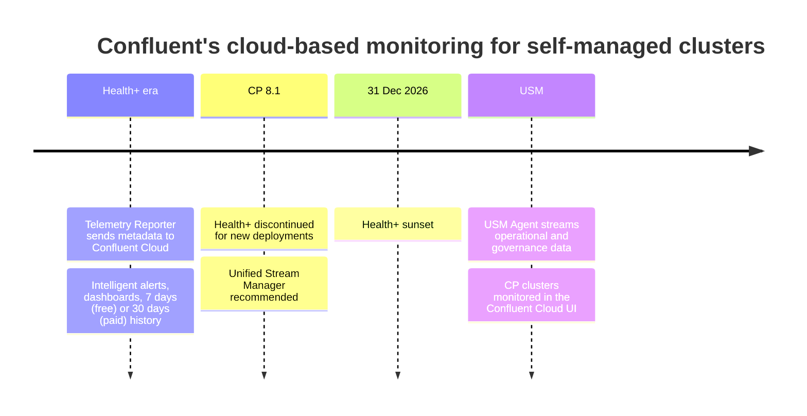

**Health+** is a Confluent-hosted service for *self-managed* Confluent
Platform clusters. The same Telemetry Reporter that feeds Control Center
(`confluent.telemetry.enabled`, `confluent.telemetry.api.key`) sends
operational metadata over an encrypted connection to Confluent Cloud, which
provides dashboards, the Metrics API and **intelligent alerts** delivered to
Slack, Microsoft Teams, email or webhooks.

| Tier | Alerts | History |
| ---- | ------ | ------- |
| **Free** | Pre-configured health alerts, e.g. active controller count, offline partitions, unclean leader elections, under-replicated and under-min-ISR partitions, connector and ksqlDB failures | Up to 7 days |
| **Paid** | Free alerts plus performance alerts: disk usage, fetch/produce request latency, network and request handler pool usage | Up to 30 days |

> **Status in 2026 — read before you plan:** Confluent has **deprecated
> Health+**. Starting with Confluent Platform **8.1** it is discontinued for
> new deployments, and it sunsets on **31 December 2026**. The recommended
> replacement is **Unified Stream Manager (USM)**: a USM Agent in your
> environment streams operational and governance data to Confluent Cloud, so
> self-managed clusters appear next to Cloud clusters in one Cloud UI. USM
> needs Confluent Platform 7.9.6+ (7.9.x) or 8.1+, a Confluent Cloud
> organization, and private networking (AWS PrivateLink or Azure Private
> Link). The course's Confluent Platform 8.3 cluster is therefore a *new
> deployment* in Health+ terms: treat Health+ as an overview topic, and the
> trainer may demonstrate USM where the environment allows.

| | Control Center | Health+ (legacy) | USM |
| - | -------------- | ---------------- | --- |
| **Runs where** | Your infrastructure | Confluent Cloud | Agent on-prem, UI in Confluent Cloud |
| **Data leaves your network** | No | Telemetry metadata | Operational and governance data |
| **Covers Confluent Cloud too** | No | No | Yes — one view for hybrid estates |
| **Alerting** | Triggers + actions (Alertmanager) | Intelligent alerts | Cloud console alerts |

---

## 5. Performance considerations and scaling in Confluent-managed clusters

### 5.1 The tuning levers, by layer

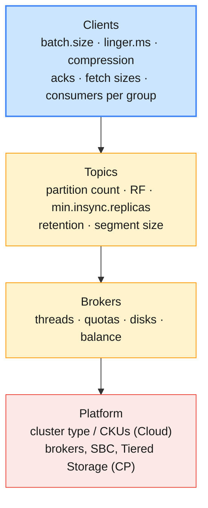

Tune from the top. Most "Kafka is slow" tickets are fixed in the client, and
on Confluent Cloud the client and topic layers are the only ones you own.

| Layer | Lever | Effect | Covered in |
| ----- | ----- | ------ | ---------- |
| **Producer** | `linger.ms`, `batch.size`, `compression.type` | Fewer, larger requests → more throughput, less broker CPU | Module 4 §3.2, §3.5 |
| **Producer** | `acks`, `enable.idempotence` | Durability vs latency | Module 4 §3.4, Module 3 §6 |
| **Consumer** | Consumers per group ≤ partitions; `max.poll.records`; fetch sizes | Parallelism and per-poll work | Module 4 §4.3 |
| **Topic** | Partition count | Upper bound on consumer parallelism; more partitions = more overhead | Module 5 §7 |
| **Topic** | Retention, segment size, compaction | Storage and recovery time | Module 3 §3–§5 |
| **Broker (self-managed)** | `num.io.threads`, `num.network.threads` | Fix queue-time and network-idle saturation (§2.3) | Module 3 §2 |
| **Broker (self-managed)** | Quotas per user / client | Protect the cluster from one tenant | §5.4 |
| **Platform** | Cluster type, CKUs, brokers, rebalancing | Raw capacity | §5.2–§5.4 |

> **Common trap for MQ administrators:** adding brokers or CKUs to fix
> consumer lag. If a group has 6 consumers on a 6-partition topic and each
> consumer spends 50 ms per record calling the rating engine, the cluster is
> idle and the bottleneck is the application. Check the broker indicators
> (§2) *before* you scale the platform.

### 5.2 Confluent Cloud: elastic clusters and their limits

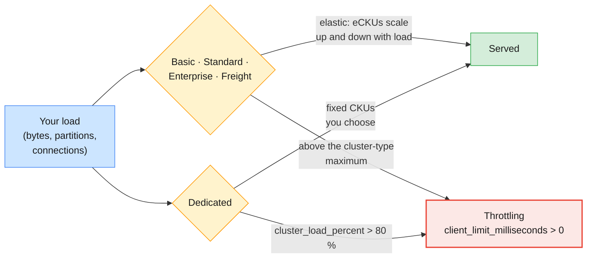

Module 6 §4.3 introduced the cluster types. For performance, the numbers
that matter are the per-unit and per-cluster limits (Confluent's cluster-types
page; check it for your region, the values change):

| | Basic | Standard | Enterprise | Dedicated |
| - | ----- | -------- | ---------- | --------- |
| **Scaling** | Elastic (eCKU) | Elastic (eCKU) | Elastic (eCKU) | Manual (CKU) |
| **Ingress per unit** | 5 MBps | 25 MBps | 60 MBps | 60 MBps |
| **Egress per unit** | 15 MBps | 75 MBps | 180 MBps | 180 MBps |
| **Partitions per unit** | 30 | 250 | 3,000 | 4,500 |
| **Max ingress per cluster** | 250 MBps | 250 MBps | 1,920 MBps | 9,120 MBps |
| **Max partitions per cluster** | 1,500 | 2,500 | 96,000 | 100,000+ |

Limits on requests and connections are not strictly enforced, but exceeding
them can cause throttling, delayed connections or unpredictable performance.
When Confluent throttles a client, the broker delays its responses; the
client sees it as `produce-throttle-time-avg` (Module 4) and the Metrics API
as `client_limit_milliseconds`.

> **Administrator takeaway:** on elastic clusters you do not "add brokers".
> Your levers are partition count (a billed dimension), client efficiency
> (batching and compression cut both bytes and requests) and, when you
> outgrow the type, moving to a larger cluster type or Dedicated.

### 5.3 Dedicated clusters: cluster load and CKUs

| Indicator | Meaning | Action |
| --------- | ------- | ------ |
| **Average `cluster_load_percent` high** | The whole cluster is saturated; above 80 % expect latency and throttling | Expand: add CKUs |
| **Maximum high, average low** | Skew: a few brokers or partitions carry the traffic | Fix keys / partitioning before buying capacity |
| **`hot_partition_ingress` or `hot_partition_egress` = 1** | One partition's load exceeds what self-balancing can manage | Re-assess the key (e.g. a test MSISDN flooding one partition), add partitions, spread traffic |

Expanding a Dedicated cluster adds CKUs and often improves performance; if
it does not, you can shrink back. Confluent rebalances partitions onto the
new capacity for you — the cloud equivalent of the reassignment work you did
by hand in Module 5 §5.

### 5.4 Self-managed Confluent Platform: Self-Balancing, quotas and storage

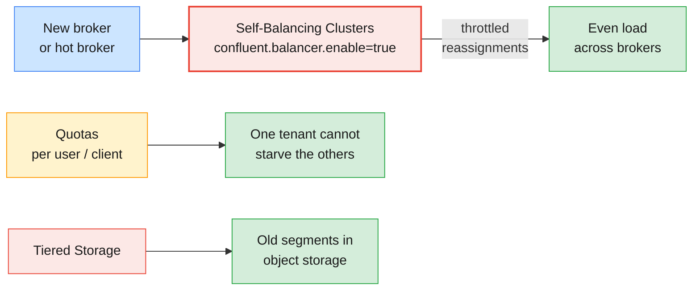

| Lever | What it does | When to use it |
| ----- | ------------ | -------------- |
| **Self-Balancing Clusters** (`confluent.balancer.enable=true`, on in the course cluster) | Moves partitions automatically when brokers are added or removed, or load is uneven (Module 6 §2.1) | Instead of hand-written reassignment plans (Module 5 §5) |
| **Client quotas** (`producer_byte_rate`, `consumer_byte_rate`, `request_percentage`) | Broker delays responses to clients over their quota | Multi-tenant clusters — the shared Apache cluster sets them per learner (`bootstrap-security.sh`) |
| **Tiered Storage** | Keeps recent segments on local disk, older ones in object storage | Long retention (CDR audit) without huge broker disks |
| **More brokers** | Adds CPU, network, disk; SBC spreads the load | Saturation indicators (§2.4) high on all brokers |
| **Thread pools** | `num.io.threads`, `num.network.threads` | Queue-time and idle-% indicators (§2.3–§2.4) |

```bash
# Inspect the quota defaults on the shared Apache cluster (read-only for learners)
kafka-configs.sh --bootstrap-server $APACHE --command-config $APACHE_CFG \
  --describe --entity-type users --entity-default
```

### 5.5 A tuning method that survives an audit

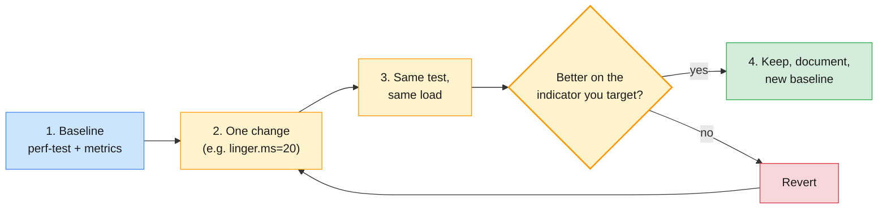

Measure with `kafka-producer-perf-test.sh` (Module 4 §3.6) while watching the
server-side view in Control Center or the Metrics API. Change one thing at a
time, keep the load identical, and record the before/after numbers: the
client view (records/sec, p99 latency) *and* the server view (bytes in,
produce latency, throttle time).

> **Shared-cluster etiquette:** performance tests on the shared clusters
> affect everyone. Keep runs short and rate-limited (`--throughput`), on your
> own `lNN.perf` topic, and announce larger tests to the trainer.

---

## 6. Comparing to Apache Kafka JMX / Prometheus-based monitoring

### 6.1 The Apache Kafka monitoring stack in the course

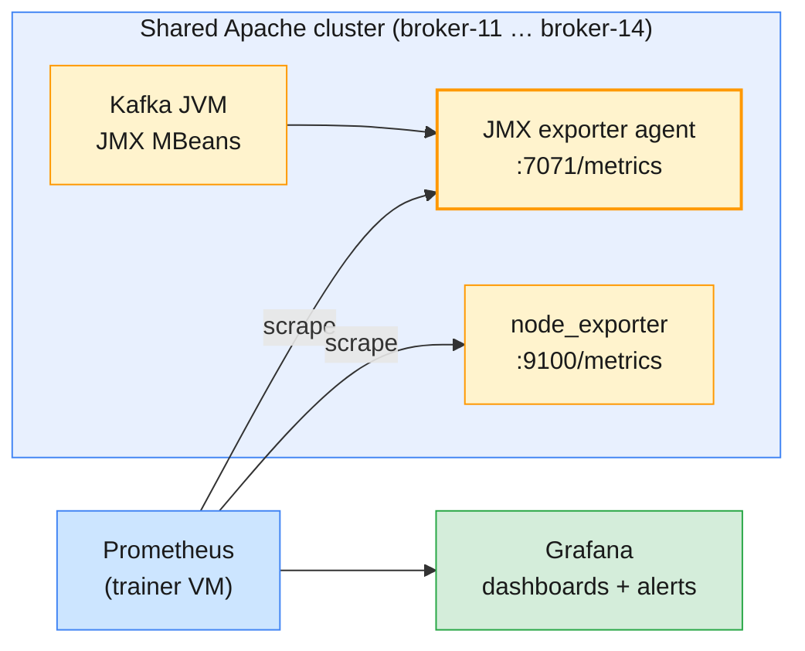

Apache Kafka exposes everything through **JMX** (Java Management
Extensions) MBeans and leaves collection to you. The common open-source
pattern — and the one on the course's Apache cluster — is:

1. The **Prometheus JMX exporter**, a Java agent loaded into the broker
   (`KAFKA_OPTS=-javaagent:/opt/jmx/jmx_prometheus_javaagent.jar=7071:/opt/jmx/kafka.yml`),
   turns MBeans into Prometheus metrics on port **7071**, using rename rules in
   `/opt/jmx/kafka.yml`.
2. **node_exporter** on port **9100** adds host metrics: CPU, disk, network.
3. **Prometheus** on the trainer VM scrapes both, and **Grafana** draws the
   dashboards (broker health, URP, request rate, bytes in/out, disk, quota
   throttling) and evaluates alert rules (`infra/cluster/PLAN.md` §7).

The exporter's rules lowercase and flatten the MBean names. For example:

| JMX MBean | Prometheus name on the course cluster |
| --------- | ------------------------------------- |
| `kafka.server:type=ReplicaManager,name=UnderReplicatedPartitions` (attribute `Value`) | `kafka_server_replicamanager_underreplicatedpartitions_value` |
| `kafka.server:type=BrokerTopicMetrics,name=MessagesInPerSec,topic=…` (`OneMinuteRate`) | `kafka_server_brokertopicmetrics_messagesinpersec_oneminuterate{topic="…"}` |
| `kafka.network:type=RequestMetrics,name=TotalTimeMs,request=Produce` (`99thPercentile`) | `kafka_network_requestmetrics_totaltimems_99thpercentile{request="Produce"}` |

### 6.2 The same indicator in three tools

| Indicator | Apache Kafka (JMX → Prometheus) | Confluent Platform (Control Center) | Confluent Cloud (Metrics API) |
| --------- | ------------------------------- | ----------------------------------- | ----------------------------- |
| **Bytes in** | `BrokerTopicMetrics BytesInPerSec` | Production charts | `received_bytes` |
| **Bytes out** | `BrokerTopicMetrics BytesOutPerSec` | Consumption charts | `sent_bytes` |
| **Produce latency** | `RequestMetrics TotalTimeMs request=Produce` | Broker production latency | `producer_latency_avg_milliseconds` |
| **Under-replicated** | `ReplicaManager UnderReplicatedPartitions` | Cluster / topic URP | Confluent's responsibility |
| **Offline partitions** | `KafkaController OfflinePartitionsCount` | Offline topic partitions | Confluent's responsibility |
| **Consumer lag** | Not a broker MBean: client `records-lag-max`, a lag exporter, or `kafka-consumer-groups.sh` | Consumer Lag page (broker-emitted) | `consumer_lag_offsets` |
| **Saturation** | `RequestHandlerAvgIdlePercent`, node_exporter | Broker pages | `cluster_load_percent` (Dedicated) |
| **Throttling** | Client `produce-throttle-time-avg` | Client metrics | `client_limit_milliseconds` |
| **Alerting** | Prometheus / Grafana rules | Triggers + actions | Your own tool, fed by `/export` |

> **Common trap for Apache Kafka administrators:** expecting a broker MBean
> for consumer lag. Apache Kafka brokers do not publish lag per group;
> consumers report their own `records-lag-max`, which disappears when the
> consumer is down — exactly when you need it. That is why the Apache world
> uses external lag exporters or `kafka-consumer-groups.sh`, and why
> Confluent's broker-side lag emitter is a genuine operational advantage.

### 6.3 Choosing your stack

| | JMX + Prometheus + Grafana | Control Center | Metrics API |
| - | -------------------------- | -------------- | ----------- |
| **Works on** | Any self-managed Kafka (Apache, CP) | Confluent Platform | Confluent Cloud |
| **Licence** | Open source | Enterprise | Included with Cloud |
| **Setup effort** | High: agents, rules, dashboards, alerting | Low (cp-ansible) | Low: an API key |
| **Depth** | Everything the JVM exposes, at the resolution you choose | Curated Kafka view, 1-minute points | Curated, aggregated, ~3-min delay |
| **Also manages topics** | No | Yes | No (Console / CLI do) |
| **Best for** | Unified NOC dashboards, deep debugging | Kafka admins on CP | Cloud dashboards and alert feeds |

> **The production baseline:** most enterprises run both. Control Center (or
> the Cloud Console) for Kafka-specific investigation, and a central
> Prometheus/Grafana — scraping JMX on self-managed brokers and `/export` on
> Confluent Cloud — for the NOC wall and the alert routing everyone else
> already uses.

---

## 7. Hands-on lab: monitoring, alerting and consumer lag

> **Lab status:** `labs/module-08/` is not written yet. This section is a
> **preview** of the hands-on, built from the Module 6–7 labs and the course
> environment (`infra/LAB-SETUP.md` §7: *"CP Control Center + CC Metrics API;
> compare with Grafana on the Apache cluster"*). The Module 8 labs will be the
> runtime companion; when they exist, their commands and expected outputs take
> precedence over this preview.

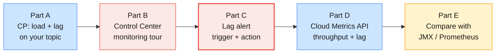

Variables, as in Modules 6–7:

```bash
# (VM)
source ~/kafka/confluent.env            # CP, MDS_URL, CP_REST, CP_CA, C3_URL
ME=lNN                                  # your prefix
CFG=~/kafka/cp.properties               # your LDAP user on the shared Confluent Platform
SA_CFG=~/kafka/sa-app.properties        # sa-lNN-app's key, kept from Module 7 Lab 01
CCLOUD=$(grep bootstrap.servers $SA_CFG | cut -d= -f2)
APACHE=apache-kafka.lab.internal:9092
APACHE_CFG=~/kafka/apache.properties
```

### 7.1 Part A — Create load and consumer lag on the shared Confluent Platform cluster

```bash
# (VM) 1. A topic for the exercise (you are ResourceOwner on $ME.*)
kafka-topics.sh --bootstrap-server $CP --command-config $CFG --create \
  --topic $ME.cdr.voice --partitions 3 --replication-factor 3 --if-not-exists

# 2. Rate-limited load: 30 000 CDR-sized records at 500/s (about one minute)
kafka-producer-perf-test.sh --topic $ME.cdr.voice --num-records 30000 \
  --record-size 512 --throughput 500 --producer.config $CFG

# 3. A "billing" consumer that reads only part of the backlog, then stops
kafka-console-consumer.sh --bootstrap-server $CP --command-config $CFG \
  --topic $ME.cdr.voice --group $ME.billing --from-beginning --max-messages 5000 > /dev/null

# 4. Lag at this second, from the CLI
kafka-consumer-groups.sh --bootstrap-server $CP --command-config $CFG \
  --describe --group $ME.billing
```

Expect `LAG` around 25 000 spread across three partitions, and no active
members (`CONSUMER-ID` empty): the group is **empty but still lagging** —
the 03:00 case from §2.6.

### 7.2 Part B — Read it in Control Center

1. Open `$C3_URL`, log in as `lNN`.
2. **Cluster overview:** find the production spike from step 2. Note the
   one-minute resolution (§3.1).
3. **Topics → `lNN.cdr.voice`:** bytes in, partitions, replica status.
4. **Clients → Consumer Lag → `lNN.billing`:** total lag and per-partition
   current / end offsets. Compare with step 4 — same numbers, a minute or two
   later.
5. **Brokers:** check whether you can see broker-level charts with your role.
   Note what is hidden from a learner (§3.2).

### 7.3 Part C — Set up a consumer-lag alert

1. On **Clients → Consumer Lag → `lNN.billing`**, choose **Set up an alert**
   (or **Alerts bell → Triggers → + New trigger**).
2. Trigger name `lNN-billing-lag`; component type **Consumer group**; group
   `lNN.billing`; metric **Consumer lag**; condition **Greater than**; value
   `10000`; buffer `120` seconds.
3. **Alerts → Actions:** attach the action the trainer has prepared (email
   or webhook), or create one if your role allows.
4. Run step 2 again to make lag grow, wait past the buffer, and find the
   fired alert under **Alerts → Overview**.
5. Clear it: consume the backlog, then re-check lag and the alert state.

```bash
# (VM) 5. Catch up: the same group reads everything that is left
kafka-console-consumer.sh --bootstrap-server $CP --command-config $CFG \
  --topic $ME.cdr.voice --group $ME.billing --timeout-ms 20000 > /dev/null
kafka-consumer-groups.sh --bootstrap-server $CP --command-config $CFG \
  --describe --group $ME.billing                    # LAG 0 on every partition
```

### 7.4 Part D — Query Confluent Cloud with the Metrics API

```bash
# (VM) 6. Cloud context and the IDs you noted in Module 7 Lab 01
confluent context list
ENV_ID=env-xxxxx; LKC=lkc-xxxxx; SA=sa-xxxxxx
confluent environment use $ENV_ID
SCOPE="--environment $ENV_ID --cloud-cluster $LKC --kafka-cluster $LKC"
# Module 7 left sa-lNN-app read-only; give write back for the load test
confluent iam rbac role-binding create --principal User:$SA --role DeveloperWrite $SCOPE --resource Topic:$ME.cdr.voice

# 7. A monitoring identity: MetricsViewer for the service account, and a Cloud key for it
confluent iam rbac role-binding create --principal User:$SA --role MetricsViewer --environment $ENV_ID
confluent api-key create --resource cloud --service-account $SA --description "$ME metrics $(date +%F)"
CLOUD_KEY=XXXXXXXXXXXXXXXX
read -rsp "Cloud API secret: " CLOUD_SECRET; echo

# 8. Some traffic and some lag on Cloud
kafka-producer-perf-test.sh --topic $ME.cdr.voice --num-records 20000 \
  --record-size 512 --throughput 200 --producer.config $SA_CFG
kafka-console-consumer.sh --bootstrap-server $CCLOUD --command-config $SA_CFG \
  --topic $ME.cdr.voice --group $ME.billing --max-messages 2000 > /dev/null

# 9. Wait ~3 minutes (§4.1), then: bytes produced per topic, last 30 minutes
cat > q-bytes.json <<EOF
{
  "aggregations": [{"metric": "io.confluent.kafka.server/received_bytes"}],
  "filter": {"field": "resource.kafka.id", "op": "EQ", "value": "$LKC"},
  "granularity": "PT1M",
  "group_by": ["metric.topic"],
  "intervals": ["$(date -u -d '-30 min' +%FT%TZ)/$(date -u +%FT%TZ)"]
}
EOF
curl -s -X POST https://api.telemetry.confluent.cloud/v2/metrics/cloud/query \
  -u "$CLOUD_KEY:$CLOUD_SECRET" -H 'Content-Type: application/json' -d @q-bytes.json | jq .

# 10. Consumer lag per group, same interval
sed -e 's#received_bytes#consumer_lag_offsets#' \
    -e 's#"metric.topic"#"metric.consumer_group_id"#' q-bytes.json > q-lag.json
curl -s -X POST https://api.telemetry.confluent.cloud/v2/metrics/cloud/query \
  -u "$CLOUD_KEY:$CLOUD_SECRET" -H 'Content-Type: application/json' -d @q-lag.json | jq .

# 11. The Prometheus view of the same cluster
curl -s -u "$CLOUD_KEY:$CLOUD_SECRET" \
  "https://api.telemetry.confluent.cloud/v2/metrics/cloud/export?resource.kafka.id=$LKC" \
  | grep -E '^confluent_kafka_server_(received_bytes|consumer_lag_offsets)' | head
unset CLOUD_SECRET
```

Compare step 10 with `kafka-consumer-groups.sh --describe --group $ME.billing`
against `$CCLOUD` with `$SA_CFG`: the API's value trails the CLI by a few minutes.

### 7.5 Part E — The Apache Kafka view: JMX through Prometheus

```bash
# (VM) 12. Raw JMX-exporter output from one Apache broker
curl -s http://broker-11.lab.internal:7071/metrics \
  | grep -E '^kafka_server_replicamanager_underreplicatedpartitions|^kafka_server_kafkarequesthandlerpool_requesthandleravgidlepercent'
curl -s http://broker-11.lab.internal:7071/metrics \
  | grep -E '^kafka_network_requestmetrics_totaltimems_99thpercentile\{request="Produce"'

# 13. Consumer lag on the Apache cluster: no broker metric, ask the group coordinator
kafka-consumer-groups.sh --bootstrap-server $APACHE --command-config $APACHE_CFG --list
```

Then open the course Grafana (URL from the trainer) and find the same
under-replicated-partitions and request-latency panels. Note what you had to
build yourself on the Apache side — exporter, rules, Prometheus, dashboards
— that Control Center and the Metrics API gave you ready-made.

**Clean up:**

```bash
# (VM)
confluent api-key delete $CLOUD_KEY --force
confluent iam rbac role-binding delete --principal User:$SA --role MetricsViewer --environment $ENV_ID
confluent iam rbac role-binding delete --principal User:$SA --role DeveloperWrite $SCOPE --resource Topic:$ME.cdr.voice
rm -f q-bytes.json q-lag.json
# Delete your lNN-billing-lag trigger in Control Center: Alerts → Triggers → Delete
```

| Observation | Concept | Where it's covered |
| ----------- | ------- | ------------------ |
| Lag stays visible after the consumer stopped | Broker-side lag emitter | §3.1, §3.3 |
| Control Center lag matches `kafka-consumer-groups.sh`, a minute later | Same offsets, 1-minute collection interval | §3.1, §3.3 |
| The alert fires only after the buffer elapses | Trigger buffer avoids paging on transient spikes | §3.4 |
| Broker pages partly hidden for learners | Control Center respects RBAC | §3.2, Module 7 §4 |
| The cluster API key cannot call the Metrics API; a `cloud` key with `MetricsViewer` can | Control-plane vs data-plane credentials | §4.1, Module 7 §5.2 |
| Metrics API values trail the CLI by a few minutes | ~3-minute data latency | §4.1 |
| `/export` returns Prometheus text | Cloud metrics in your own Prometheus | §4.4 |
| JMX exporter names are flattened MBean names | Exporter rename rules | §6.1 |
| No lag metric on Apache brokers | Lag comes from clients, exporters or the CLI | §6.2 |

---

## 8. Troubleshooting monitoring and performance issues

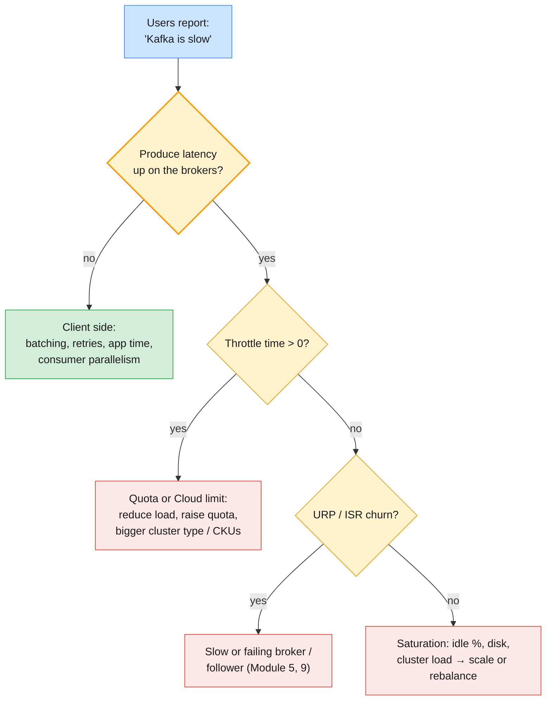

| Symptom | Likely cause | Check / fix |
| ------- | ------------ | ----------- |
| **Control Center shows topics but no charts** | Telemetry Reporter not sending, or Prometheus unreachable | Broker `metric.reporters` and `confluent.telemetry.exporter._c3.*`; `prometheus.log` |
| **Charts stop at a point in time** | Prometheus down or out of disk on the Control Center host | `systemctl status`, disk on `cp-services` |
| **Consumer group missing from the lag page** | Group never committed, uses `assign()`, or not visible to your role | `kafka-consumer-groups.sh --describe`; role bindings on `Group:` |
| **Alert never fires** | Buffer longer than the condition lasts, wrong cluster id, or no action attached | Edit the trigger; check **Alerts → Actions** |
| **Alert fires constantly** | Threshold below normal operation, or buffer 0 | Re-baseline; add a buffer (§3.4) |
| **Metrics API: 401 / 403** | Cluster key used, or owner lacks `MetricsViewer` | `--resource cloud` key; role binding (§4.1) |
| **Metrics API: empty `data`** | Interval too recent, wrong `lkc`, or no traffic | Query a wider interval ending 3+ minutes ago |
| **Metrics API: 429** | Rate limit hit | Fewer calls; scrape `/export` once a minute |
| **`client_limit_milliseconds` / throttle time > 0** | Cluster-type limit or quota reached | Client efficiency; larger cluster type or CKUs; quota review |
| **High p99 produce latency, low throughput** | `acks=all` waiting on a slow follower, or disk | `RemoteTimeMs` vs `LocalTimeMs` (§2.3) |
| **Lag grows on one partition only** | Hot key or stuck consumer | Key distribution; restart or fix that consumer |
| **Lag grows everywhere, brokers idle** | Consumer processing too slow | More consumers (≤ partitions), faster processing, larger batches |
| **Health+ cannot be enabled on the new CP cluster** | Discontinued for new deployments since CP 8.1 | Use Control Center locally; plan USM (§4.5) |

---

## 9. Bridging to the rest of the course

| Question this module raises | Answered in |
| --------------------------- | ----------- |
| An alert fired — how do I find the root cause in broker and client logs? | Module 9 |
| How do throttling, quotas and `acks` settings turn into lost or delayed messages? | Module 9 |
| How do I use lag analysis to remediate a consumer that has fallen behind? | Module 9 |
| How do Confluent support cases and escalation use these metrics? | Module 9 |
| How do I monitor Connect, Schema Registry and replication between clusters? | Module 10 |

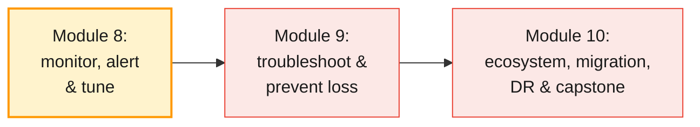

Previous guides: [Module 4](./module-04-producing-consuming-messages.md) for
the producer and consumer settings you tune,
[Module 5](./module-05-cluster-operations-replication-ha.md) for ISR states
and capacity planning, [Module 6](./module-06-introducing-confluent-kafka.md)
for the Control Center architecture and Cloud cluster types, and
[Module 7](./module-07-administering-kafka-security.md) for the role
bindings and Cloud API keys the monitoring tools need.

---

## 10. Key takeaways

1. **Four indicator families.** Throughput, latency, saturation and
   availability — every tool answers the same questions; alert on
   availability and saturation, explain with throughput and latency.
2. **Latency has stages.** Request queue, local, remote and response times
   show *which* resource is the bottleneck; fetch latency on quiet topics is
   long-polling, not slowness.
3. **Consumer lag is Kafka's queue depth.** Measured in messages per
   partition per group; convert thresholds to time and alert per critical
   group with a buffer.
4. **Control Center 2.x is Prometheus-backed.** Brokers push OTLP metrics
   every minute via the Telemetry Reporter, and compute consumer lag
   themselves.
5. **Alerts = triggers + actions.** Component type, metric, condition, value
   and buffer, with email, Slack or PagerDuty actions; a few actionable alerts
   beat many noisy ones.
6. **The Metrics API is Cloud's JMX.** `/query` for analysis, `/export` for
   Prometheus, authenticated with a `cloud` API key whose owner has
   `MetricsViewer`.
7. **Health+ is being retired.** Discontinued for new deployments since CP 8.1
   and sunset on 31 December 2026; Unified Stream Manager is the successor.
8. **Tune top-down.** Clients and topics first, then brokers, then platform
   capacity; change one thing at a time against a measured baseline.
9. **Cloud scales by cluster type.** Elastic eCKUs on Basic/Standard/
   Enterprise up to fixed maximums; CKUs and `cluster_load_percent` on
   Dedicated; throttling shows as `client_limit_milliseconds`.
10. **Apache Kafka means build-your-own.** JMX exporter, node_exporter,
    Prometheus and Grafana give depth and a unified NOC view, but no
    broker-side lag — most enterprises run both stacks.

---

## 11. Glossary

| Term | Definition |
| ---- | ---------- |
| **Throughput** | Bytes or records per second into and out of the cluster |
| **Request latency** | Time a broker takes to serve a request, split into queue, local, remote and response stages |
| **Saturation** | How close a resource (threads, disk, network, cluster capacity) is to its limit |
| **Under-replicated partitions (URP)** | Partitions whose ISR is smaller than the replica set |
| **Consumer lag** | Log-end offset minus committed offset, per partition per consumer group |
| **JMX / MBean** | Java Management Extensions; Kafka exposes each metric as an MBean attribute |
| **JMX exporter** | Prometheus Java agent that serves JMX metrics over HTTP (port 7071 in the course) |
| **Telemetry Reporter** | Confluent metrics reporter in brokers and services that pushes metrics to Control Center or Confluent Cloud |
| **OTLP** | OpenTelemetry Protocol, used by brokers to push metrics into Control Center's Prometheus |
| **Trigger** | Control Center alert condition: component, metric, condition, value, buffer |
| **Action** | What Control Center does when a trigger fires: email, Slack or PagerDuty notification |
| **Buffer** | Seconds a trigger condition must remain true before it fires |
| **Metrics API** | Confluent Cloud REST API for server-side metrics (`/query`, `/export`) |
| **MetricsViewer** | Confluent Cloud role allowing access to the Metrics API |
| **Health+** | Confluent-hosted monitoring for self-managed clusters; deprecated, sunsets 31 December 2026 |
| **Unified Stream Manager (USM)** | Successor to Health+: monitors Confluent Platform clusters from the Confluent Cloud UI via a USM Agent |
| **eCKU / CKU** | Elastic and fixed Confluent capacity units for Cloud clusters |
| **Cluster load** | Dedicated-cluster saturation metric, 0–100 %; above 80 % expect latency and throttling |
| **Throttling** | Broker delaying responses to a client over its quota or the cluster's limits |
| **Quota** | Per-user or per-client limit on bytes or request time on a self-managed cluster |
| **Hot partition** | A partition carrying disproportionate load, usually from a skewed key |

---

## 12. References

**Apache Kafka (official)**

- Monitoring (4.3) — <https://kafka.apache.org/43/operations/monitoring/>
- Basic Kafka operations — <https://kafka.apache.org/43/operations/basic-kafka-operations/>

**Confluent Platform and Control Center**

- Control Center overview — <https://docs.confluent.io/control-center/current/overview.html>
- Control Center single-node installation (Telemetry Reporter settings) — <https://docs.confluent.io/control-center/current/installation/single-node.html>
- Control Center alerts concepts — <https://docs.confluent.io/control-center/current/alerts/concepts.html>
- Manage Control Center alert triggers — <https://docs.confluent.io/control-center/current/alerts/triggers.html>
- Manage consumer groups in Control Center — <https://docs.confluent.io/control-center/current/clients/consumers.html>
- Troubleshoot Control Center — <https://docs.confluent.io/control-center/current/installation/troubleshooting.html>
- Monitor Kafka with JMX in Confluent Platform — <https://docs.confluent.io/platform/current/kafka/monitoring.html>
- Self-Balancing Clusters — <https://docs.confluent.io/platform/current/clusters/sbc/index.html>
- Health+ — <https://docs.confluent.io/platform/current/health-plus/index.html>
- Health+ FAQ (end of life) — <https://docs.confluent.io/platform/current/health-plus/health-plus-faq.html>
- Unified Stream Manager in Confluent Platform — <https://docs.confluent.io/platform/current/usm/overview.html>

**Confluent Cloud**

- Confluent Cloud Metrics — <https://docs.confluent.io/cloud/current/monitoring/metrics-api.html>
- Metrics API example queries — <https://docs.confluent.io/cloud/current/monitoring/metrics-api-examples.html>
- Metrics API reference — <https://api.telemetry.confluent.cloud/docs>
- Monitor consumer lag in Confluent Cloud — <https://docs.confluent.io/cloud/current/monitoring/monitor-lag.html>
- Dedicated cluster performance and expansion — <https://docs.confluent.io/cloud/current/monitoring/monitor-performance.html>
- Confluent Cloud cluster types — <https://docs.confluent.io/cloud/current/clusters/cluster-types.html>

**Prometheus ecosystem**

- Prometheus JMX exporter — <https://github.com/prometheus/jmx_exporter>
- Prometheus node_exporter — <https://github.com/prometheus/node_exporter>

**Course environment**

- Lab environment setup — [`infra/LAB-SETUP.md`](../infra/LAB-SETUP.md)
- Apache cluster build plan (monitoring, R13) — [`infra/cluster/PLAN.md`](../infra/cluster/PLAN.md)

**Books**

- *Kafka: The Definitive Guide*, 2nd ed. (Shapira, Palino, Sivaram, Petty; O'Reilly)

---

> **Next module:** _Module 9 — Troubleshooting & Preventing Message Loss on Confluent Kafka_,
> where the alerts you just built start firing: common Confluent Cloud and
> Platform errors and logs, the root causes of message loss (`acks`,
> replication factor, quotas and throttling), connectivity problems, consumer
> lag remediation, and Confluent's support and escalation model.
