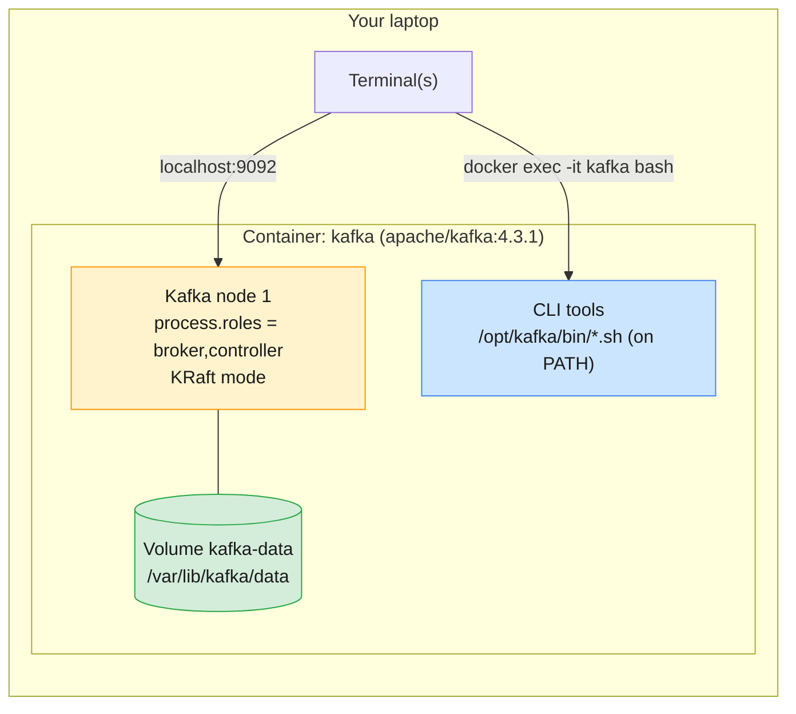

# Module 1 Labs — Messaging & Kafka Fundamentals

> **Course:** Apache Kafka & Confluent Kafka Administration
> **Companion guide:** [`guides/module-01-messaging-kafka-fundamentals.md`](../../guides/module-01-messaging-kafka-fundamentals.md)
> **Module objective:** Understand messaging concepts and core Apache Kafka
> architecture, components, and distributed design principles.

These three labs turn the Module 1 concepts into things you can see on a real
(single-node, KRaft) Kafka running on your laptop. They build on each other, so
do them in order.

| # | Lab | Level | Time | Concepts you will *see* |
| - | --- | ----- | ---- | ----------------------- |
| 01 | [Environment setup & first steps with Kafka](lab-01-environment-setup.md) | Beginner | 45 min | Docker setup, KRaft node, CLI tools, topic → produce → consume, listeners |
| 02 | [Topics, partitions, offsets & consumer groups](lab-02-partitions-offsets-consumer-groups.md) | Beginner → Intermediate | 60 min | Keys and partitioning, ordering, queue vs pub/sub, rebalancing, lag, offset reset |
| 03 | [Storage, retention, compaction & KRaft internals](lab-03-storage-retention-compaction-kraft.md) | Intermediate | 60 min | Segments on disk, replication limits, time-based retention, compaction and tombstones, `__cluster_metadata` |

Estimated total: **about 2 h 45 min**, including checkpoint questions.

---

## Prerequisites

| Requirement | Check with | Notes |
| ----------- | ---------- | ----- |
| Docker Desktop (running) | `docker version` | Both *Client* and *Server* sections must print |
| Docker Compose v2 | `docker compose version` | Bundled with Docker Desktop |
| ~2 GB free RAM for Docker | Docker Desktop → Settings → Resources | Kafka runs with a 1 GB heap by default |
| Port **9092** free | `lsof -i :9092` (macOS/Linux) · `netstat -ano \| findstr 9092` (Windows) | Stop any other local Kafka first |
| A terminal that can open **several tabs/windows** | — | Lab 02 needs 3–4 terminals at once |

You do **not** need Java or Kafka installed on your laptop. Every Kafka CLI tool
runs *inside* the container.

---

## Lab environment

All three labs share one Compose file: [`docker-compose.yml`](docker-compose.yml).



Two conveniences are built into the Compose file so the commands in the labs stay
short:

- The Kafka tools directory `/opt/kafka/bin` is on the `PATH` inside the
  container, so you can type `kafka-topics.sh` instead of
  `/opt/kafka/bin/kafka-topics.sh`.
- The variable **`$BS`** (bootstrap server) is set to `localhost:9092` inside the
  container.

### Everyday commands

Run these from **this folder** (`labs/module-01`):

```bash
docker compose up -d          # start Kafka
docker compose ps             # STATUS should show (healthy)
docker exec -it kafka bash    # open a shell inside the container
docker compose down           # stop Kafka, keep topics and data
docker compose down -v        # stop Kafka and DELETE all data (fresh start)
```

> **Convention used in the labs**
>
> - Code blocks marked `# (container)` are run **inside** `docker exec -it kafka bash`.
> - Code blocks marked `# (host)` are run on **your laptop**, from `labs/module-01`.

---

## Troubleshooting

| Symptom | Likely cause | Fix |
| ------- | ------------ | --- |
| `Cannot connect to the Docker daemon` | Docker Desktop not running | Start Docker Desktop and wait for "Engine running" |
| `Bind for 0.0.0.0:9092 failed: port is already allocated` | Another Kafka / container uses 9092 | `docker ps` → stop the other container, then `docker compose up -d` |
| `docker compose ps` shows `(health: starting)` for a long time | Slow first start / image still pulling | Wait 30–60 s; check `docker compose logs -f kafka` |
| `kafka-topics.sh: command not found` | You are on the host, not in the container | Run `docker exec -it kafka bash` first |
| Console consumer prints nothing | Consumer started *after* the messages and without `--from-beginning`, or the group already committed past them | Add `--from-beginning` **and** use a new `--group` name |
| `ERROR ... TimeoutException` at the end of a consumer run with `--timeout-ms` | Expected: the consumer stops when no message arrives within the timeout | Ignore; check the `Processed a total of N messages` line |
| Strange leftovers from an earlier attempt | Old topics / groups in the volume | `docker compose down -v && docker compose up -d` |

---

## Cleaning up after the module

```bash
# (host) - from labs/module-01
docker compose down -v
```

This removes the container, the network and the `kafka-data` volume. Keep the
`apache/kafka` image; Module 2 uses it again for a multi-broker cluster.
