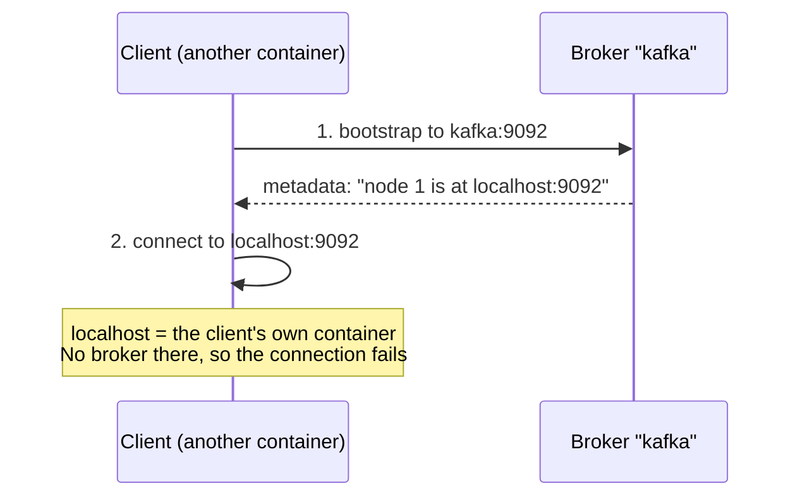

# Lab 01 — Environment Setup & First Steps with Kafka

| | |
| --- | --- |
| **Level** | Beginner |
| **Duration** | ~45 minutes |
| **Guide sections** | §5 Kafka ecosystem · §8 ZooKeeper vs KRaft · §9 Hands-on preview |
| **You will need** | Docker Desktop running, one terminal (two for Part 5) |

## Learning objectives

By the end of this lab you will be able to:

1. Start a single-node Apache Kafka cluster in **KRaft mode** with Docker Compose.
2. Explain what each setting in the Compose file does (node ID, roles, listeners).
3. Find your way around the Kafka **CLI tools** and use them to inspect a cluster.
4. Run a first **topic → produce → consume** flow.
5. Explain why **advertised listeners** matter when clients connect from
   somewhere else (the most common Kafka connectivity problem).

---

## Part 1 — Check your Docker environment (5 min)

```bash
# (host)
docker version
docker compose version
```

**Expected:** both `Client:` and `Server:` sections print, and Compose reports
`v2.x`. If the `Server:` section shows an error, Docker Desktop is not running.

Check that port 9092 is free:

```bash
# (host) macOS / Linux
lsof -i :9092            # no output = free

# (host) Windows PowerShell
netstat -ano | findstr 9092
```

---

## Part 2 — Start Kafka (10 min)

### 2.1 Read the Compose file first

Open [`docker-compose.yml`](docker-compose.yml) and find these settings. You
will see them again in the output later in the lab.

| Setting | Value | Meaning |
| ------- | ----- | ------- |
| `KAFKA_NODE_ID` | `1` | This node's unique ID in the cluster (`node.id`) |
| `KAFKA_PROCESS_ROLES` | `broker,controller` | **Combined mode**: stores data *and* manages metadata. Fine for labs; production uses dedicated controllers |
| `KAFKA_CONTROLLER_QUORUM_VOTERS` | `1@kafka:9093` | Members of the KRaft controller quorum (here, just this node) |
| `CLUSTER_ID` | `4L6g3nShT-eMCtK--X86sw` | Written into storage when it is formatted. Every node in a cluster must share it |
| `KAFKA_LISTENERS` | `PLAINTEXT://:19092, CONTROLLER://:9093, PLAINTEXT_HOST://:9092` | Ports the node **listens on** |
| `KAFKA_ADVERTISED_LISTENERS` | `PLAINTEXT://kafka:19092, PLAINTEXT_HOST://localhost:9092` | Addresses the node **tells clients to use** |
| `KAFKA_OFFSETS_TOPIC_REPLICATION_FACTOR` | `1` | Internal topics cannot have more replicas than there are brokers |

> **Note:** The `apache/kafka` image turns every `KAFKA_*` environment variable into
> a `server.properties` entry. For example, `KAFKA_NODE_ID` becomes `node.id`.

### 2.2 Start the container

```bash
# (host) - from labs/module-01
docker compose up -d
docker compose ps
```

Wait until `STATUS` shows **`(healthy)`**. This usually takes 15–30 seconds. The
first run also downloads the image.

```
NAME      IMAGE                COMMAND                  SERVICE   CREATED          STATUS                    PORTS
kafka     apache/kafka:4.3.1   "/__cacert_entrypoin…"   kafka     30 seconds ago   Up 29 seconds (healthy)   0.0.0.0:9092->9092/tcp, [::]:9092->9092/tcp
```

### 2.3 Read the startup log

```bash
# (host)
docker compose logs kafka | grep -E "Kafka Server started|process.roles|node.id ="
```

**Expected:** a line ending in `Kafka Server started (kafka.server.KafkaRaftServer)`.
The class name **`KafkaRaftServer`** tells you the node runs in KRaft mode. There is
no ZooKeeper anywhere in this setup.

---

## Part 3 — Look inside the node (10 min)

Open a shell in the container. You will use it for the rest of the lab.

```bash
# (host)
docker exec -it kafka bash
```

### 3.1 The generated configuration

```bash
# (container)
grep -v '^#' /opt/kafka/config/server.properties | grep .
```

You should see the Compose settings written out as Kafka properties:
`node.id=1`, `process.roles=broker,controller`,
`controller.quorum.voters=1@kafka:9093`, and so on.

### 3.2 The data directory

```bash
# (container)
ls -la /var/lib/kafka/data
cat /var/lib/kafka/data/meta.properties
```

Expected (IDs will differ except `cluster.id`):

```
cluster.id=4L6g3nShT-eMCtK--X86sw
directory.id=Ya203CJ243U17NKNW2BfOw
node.id=1
version=1
```

Things to notice:

- **`meta.properties`** is the node's identity card. The node refuses to start
  if `cluster.id` or `node.id` here does not match its configuration. This
  protects you from pointing a broker at another cluster's disks.
- **`__cluster_metadata-0/`** is the **KRaft metadata log**. Topics, partitions,
  leaders, ISR and configs are stored as events in this log, in the same way
  your data is stored. You will decode it in Lab 03.
- No topic folders exist yet, because you have not created any topics.

### 3.3 Tour the CLI tools

```bash
# (container)
ls /opt/kafka/bin/*.sh | xargs -n1 basename
```

About 40 tools are listed. These are the ones you will use most as an administrator:

| Tool | Purpose |
| ---- | ------- |
| `kafka-topics.sh` | Create / list / describe / alter / delete topics |
| `kafka-console-producer.sh` / `kafka-console-consumer.sh` | Produce from stdin / consume to stdout |
| `kafka-consumer-groups.sh` | Inspect groups, lag; reset offsets |
| `kafka-configs.sh` | Read / change broker and topic configuration |
| `kafka-metadata-quorum.sh` | Inspect the KRaft controller quorum |
| `kafka-get-offsets.sh` | Earliest / latest offsets per partition |
| `kafka-dump-log.sh` | Decode segment files on disk |
| `kafka-storage.sh` | Format storage / generate a cluster ID (KRaft) |

Every tool prints its options with `--help`. Try one:

```bash
# (container)
kafka-topics.sh --help | head -30
```

> **Tip:** Almost every tool needs `--bootstrap-server`. Inside this container,
> `$BS` is already set to `localhost:9092`.

### 3.4 Ask the cluster about itself

```bash
# (container)
kafka-cluster.sh cluster-id --bootstrap-server $BS
kafka-metadata-quorum.sh --bootstrap-server $BS describe --status
```

Expected output of the quorum command:

```
ClusterId:              4L6g3nShT-eMCtK--X86sw
LeaderId:               1
LeaderEpoch:            1
HighWatermark:          59
MaxFollowerLag:         0
MaxFollowerLagTimeMs:   0
CurrentVoters:          [{"id": 1, "endpoints": ["CONTROLLER://kafka:9093"]}]
CurrentObservers:       []
```

| Field | Meaning |
| ----- | ------- |
| `LeaderId` | The **active controller** (node 1, the only voter here) |
| `LeaderEpoch` | Increases every time a new controller leader is elected |
| `HighWatermark` | How far the metadata log has been committed. Run the command again after Part 4 and watch it grow |
| `CurrentVoters` | The controller quorum. Production clusters have 3 or 5 voters |

Two more useful checks:

```bash
# (container)
# Which features / metadata version is the cluster running?
kafka-features.sh --bootstrap-server $BS describe

# Effective value of a broker setting, and where it came from
kafka-configs.sh --bootstrap-server $BS --describe --entity-type brokers \
  --entity-name 1 --all | grep -E "log.retention.hours|log.dirs|num.partitions"
```

In the `kafka-configs.sh` output, `synonyms={DEFAULT_CONFIG:...}` means the value
is Kafka's built-in default. `STATIC_BROKER_CONFIG` means it came from
`server.properties`. Look at `log.retention.hours=168` (7 days) and remember it
for Lab 03.

---

## Part 4 — Your first end-to-end flow (10 min)

### 4.1 Create a topic

```bash
# (container)
kafka-topics.sh --bootstrap-server $BS --create \
  --topic cdr.voice --partitions 3 --replication-factor 1

kafka-topics.sh --bootstrap-server $BS --list
kafka-topics.sh --bootstrap-server $BS --describe --topic cdr.voice
```

Expected:

```
Topic: cdr.voice  TopicId: 9oCd...  PartitionCount: 3  ReplicationFactor: 1  Configs: min.insync.replicas=1
    Topic: cdr.voice  Partition: 0  Leader: 1  Replicas: 1  Isr: 1  Elr:   LastKnownElr:
    Topic: cdr.voice  Partition: 1  Leader: 1  Replicas: 1  Isr: 1  Elr:   LastKnownElr:
    Topic: cdr.voice  Partition: 2  Leader: 1  Replicas: 1  Isr: 1  Elr:   LastKnownElr:
```

> The warning about topic names containing both `.` and `_` is harmless. It is
> good practice to pick **one** separator style for all topic names in a cluster.

Each partition has a **leader** (the broker serving reads and writes), a
**replica list** and an **ISR** (in-sync replicas). With one broker, all three are
`1`. Lab 03 shows what happens when you ask for more.

Look at the disk again:

```bash
# (container)
ls /var/lib/kafka/data | grep cdr
```

There is **one directory per partition**: `cdr.voice-0`, `cdr.voice-1`,
`cdr.voice-2`. A partition is a physical log on disk.

### 4.2 Produce messages

```bash
# (container)
kafka-console-producer.sh --bootstrap-server $BS --topic cdr.voice \
  --reader-property parse.key=true --reader-property key.separator=:
```

At the `>` prompt, type these lines (format `key:value`), then press **Ctrl+C**:

```
966500000001:call-start
966500000002:call-start
966500000003:call-start
966500000001:call-end
966500000002:call-end
966500000003:call-end
```

### 4.3 Consume messages

```bash
# (container)
kafka-console-consumer.sh --bootstrap-server $BS --topic cdr.voice \
  --group billing --from-beginning \
  --formatter-property print.partition=true \
  --formatter-property print.offset=true \
  --formatter-property print.key=true
```

Expected (press **Ctrl+C** after the six lines appear):

```
Partition:2	Offset:0	966500000001	call-start
Partition:2	Offset:1	966500000002	call-start
Partition:2	Offset:2	966500000001	call-end
Partition:2	Offset:3	966500000002	call-end
Partition:0	Offset:0	966500000003	call-start
Partition:0	Offset:1	966500000003	call-end
```

What this shows:

- Records with the **same key always go to the same partition**, so each caller's
  `call-start` comes before their `call-end`.
- Two different keys (`...001` and `...002`) can share a partition. The key is
  hashed, and the hash is divided by the number of partitions.
- **Partition 1 got nothing.** Having more partitions does not guarantee an even
  spread when there are few keys.
- Offsets are counted **per partition**. Each partition starts at 0.

### 4.4 Consumption does not delete

Run the **same** consumer command again with the same group, `billing`:

```bash
# (container)
kafka-console-consumer.sh --bootstrap-server $BS --topic cdr.voice \
  --group billing --from-beginning --timeout-ms 5000
```

**Nothing is printed.** `--from-beginning` only applies when a group has **no
committed offsets**. `billing` already committed its position, so it continues
from there.

Now use a **new** group:

```bash
# (container)
kafka-console-consumer.sh --bootstrap-server $BS --topic cdr.voice \
  --group fraud --from-beginning --timeout-ms 5000
```

All six messages come back. The messages were **not removed** when `billing`
read them. This is the most important difference from a traditional MQ queue.

Check each group's position:

```bash
# (container)
kafka-consumer-groups.sh --bootstrap-server $BS --describe --group billing
```

```
GROUP     TOPIC      PARTITION  CURRENT-OFFSET  LOG-END-OFFSET  LAG  CONSUMER-ID  HOST  CLIENT-ID
billing   cdr.voice  0          2               2               0    -            -     -
billing   cdr.voice  1          0               0               0    -            -     -
billing   cdr.voice  2          4               4               0    -            -     -
```

`CURRENT-OFFSET` is the group's **committed position**. `LOG-END-OFFSET` is the
end of the log. The difference is the **LAG**. Lab 02 covers this in depth.

Finally, check the quorum `HighWatermark` again:

```bash
# (container)
kafka-metadata-quorum.sh --bootstrap-server $BS describe --status | grep HighWatermark
```

It has grown. Creating `cdr.voice` and the internal `__consumer_offsets` topic
wrote new records to the metadata log. The controller also writes a small
periodic heartbeat record, so the number keeps growing even when nothing
changes. You will decode these records in Lab 03.

---

## Part 5 — Listeners: why "it works on my machine" (10 min, intermediate)

A client connects to Kafka in **two steps**:

1. It connects to the **bootstrap** address you give it and asks for metadata.
2. The broker answers with its **advertised listener** address, and the client
   then connects **to that address** for all real work.

If the advertised address is not reachable from where the client runs, step 1
succeeds and step 2 fails.



Exit the container shell (`exit`) and run the following on the **host**. The
command starts a *second*, throw-away container on the same Docker network,
acting as a client application.

**Test A: use the internal listener (correct for containers)**

```bash
# (host)
docker run --rm --network module-01_default apache/kafka:4.3.1 \
  /opt/kafka/bin/kafka-topics.sh --bootstrap-server kafka:19092 --list
```

Expected: the topic list (`__consumer_offsets`, `cdr.voice`). The `PLAINTEXT`
listener advertises `kafka:19092`, and that name resolves inside the Docker
network.

**Test B: use the host listener from inside Docker (wrong)**

```bash
# (host)  - press Ctrl+C after a few WARN lines
docker run --rm --network module-01_default apache/kafka:4.3.1 \
  /opt/kafka/bin/kafka-topics.sh --bootstrap-server kafka:9092 --list
```

Expected: repeated warnings.

```
WARN [AdminClient clientId=adminclient-1] Connection to node 1 (localhost/127.0.0.1:9092) could not be established. Node may not be available.
```

The bootstrap to `kafka:9092` **worked**. The broker then told the client to use
`localhost:9092`, the address advertised for `PLAINTEXT_HOST`. Inside the client
container, `localhost` is the client itself, so the connection fails.

> **Administrator rule:** configure one listener per network that clients come
> from (inside Docker, laptop, VPC, internet, and so on), and advertise an address
> that is reachable from **that** network. You will see this again with the shared
> AWS cluster and in Module 7 (security).

> If the network name `module-01_default` is not found, run `docker network ls`.
> Compose names the network after the folder you ran `docker compose up` from.

---

## Checkpoint questions

<details>
<summary>1. What in the logs and on disk shows that this cluster runs in KRaft mode, not ZooKeeper mode?</summary>

The server class is `KafkaRaftServer`, `process.roles` is set, the controller
quorum is defined by `controller.quorum.voters`, and the data directory contains
`__cluster_metadata-0`. No ZooKeeper connection string exists anywhere.
</details>

<details>
<summary>2. Why did the second run of the <code>billing</code> consumer print nothing, even with <code>--from-beginning</code>?</summary>

`--from-beginning` sets `auto.offset.reset=earliest`, which only applies when
the group has **no committed offset**. `billing` had already committed offsets
2 / 0 / 4, so it resumed from there and found nothing new.
</details>

<details>
<summary>3. You create a topic with 3 partitions and send 6 keyed messages, but one partition stays empty. Is something broken?</summary>

No. The partition is chosen by `hash(key) % partitions`. With only three distinct
keys, two of them happened to hash to the same partition. An even spread needs
many keys, or no keys (Lab 02).
</details>

<details>
<summary>4. A Java app in Kubernetes can reach the bootstrap address but logs "Connection to node 1 (localhost/127.0.0.1:9092) could not be established". What is wrong?</summary>

The broker's **advertised listener** for that listener is `localhost:9092`, which
is not reachable from the pod. Add a listener whose advertised address can be
resolved and reached from the Kubernetes network, and have the app use it.
</details>

---

## Clean up

Leave Kafka running if you are continuing to Lab 02. It uses the same container.

```bash
# (host) only if you are stopping here
docker compose down        # keeps data
```

**Next:** [Lab 02 — Topics, partitions, offsets & consumer groups](lab-02-partitions-offsets-consumer-groups.md)
