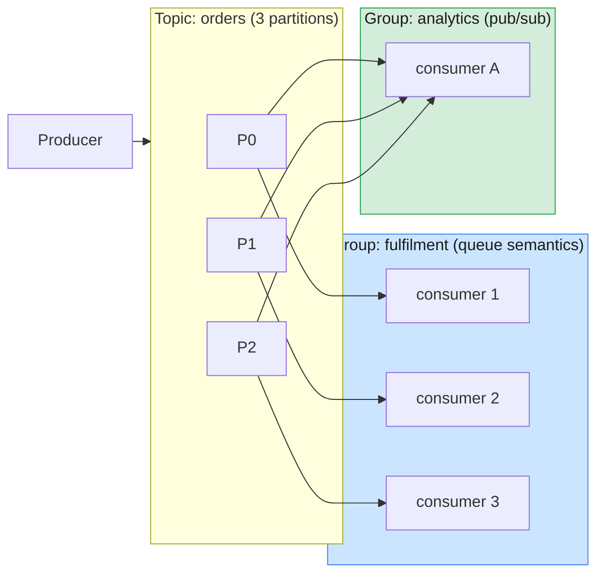

# Lab 02 — Topics, Partitions, Offsets & Consumer Groups

| | |
| --- | --- |
| **Level** | Beginner → Intermediate |
| **Duration** | ~60 minutes |
| **Guide sections** | §2 Messaging concepts · §3 Kafka vs IBM MQ · §5 Ecosystem · §6 Offsets |
| **You will need** | Kafka from Lab 01 running (`docker compose ps` shows `healthy`), **four** terminal windows or tabs |

## Learning objectives

By the end of this lab you will be able to:

1. Show how the **message key** decides the partition, and why ordering is
   guaranteed **per partition only**.
2. Show **queue semantics** (one consumer group shares the work) and
   **pub/sub semantics** (several groups each get everything) with the same topic.
3. Trigger and observe a **consumer group rebalance**, including idle consumers.
4. Measure **consumer lag** and **reset offsets** to replay data, and explain
   the safety rule for doing so.



> **Terminal naming.** This lab uses several terminals at once. They are called
> **T1–T4**. Every command below runs from your **host**, via `docker exec`, so
> you can copy it straight into any terminal. The Kafka tools are already on the
> container's `PATH`.

---

## Part 1 — Keys, partitions and ordering (10 min)

### 1.1 Create a topic and send keyed messages

In **T1**:

```bash
# (host) T1
docker exec kafka kafka-topics.sh --bootstrap-server localhost:9092 \
  --create --topic cdr.sms --partitions 3 --replication-factor 1
```

Send 15 SMS records: 5 subscribers (keys), 3 messages each, sent round-robin
(`sms-1` for everyone, then `sms-2`, then `sms-3`):

```bash
# (host) T1
for n in 1 2 3; do
  for k in 966500000001 966500000002 966500000003 966500000004 966500000005; do
    echo "$k:sms-$n"
  done
done | docker exec -i kafka kafka-console-producer.sh --bootstrap-server localhost:9092 \
  --topic cdr.sms --reader-property parse.key=true --reader-property key.separator=:
```

> The `-i` flag lets `docker exec` read the piped input. Without it, the producer
> receives nothing.

### 1.2 Read each partition on its own

```bash
# (host) T1
for p in 0 1 2; do
  echo "=== partition $p ==="
  docker exec kafka kafka-console-consumer.sh --bootstrap-server localhost:9092 \
    --topic cdr.sms --partition $p --from-beginning --timeout-ms 4000 \
    --formatter-property print.key=true --formatter-property print.offset=true 2>/dev/null
done
```

Expected:

```
=== partition 0 ===
Offset:0	966500000003	sms-1
Offset:1	966500000003	sms-2
Offset:2	966500000003	sms-3
=== partition 1 ===
Offset:0	966500000004	sms-1
Offset:1	966500000005	sms-1
Offset:2	966500000004	sms-2
Offset:3	966500000005	sms-2
Offset:4	966500000004	sms-3
Offset:5	966500000005	sms-3
=== partition 2 ===
Offset:0	966500000001	sms-1
Offset:1	966500000002	sms-1
Offset:2	966500000001	sms-2
Offset:3	966500000002	sms-2
Offset:4	966500000001	sms-3
Offset:5	966500000002	sms-3
```

What this shows:

- **All records for one key are in one partition, in the order they were sent**
  (`sms-1`, `sms-2`, `sms-3`). This is the ordering guarantee Kafka gives you.
- The key-to-partition mapping is **deterministic**
  (`murmur2(key) % 3`). Everyone in the class gets the same layout.
- The partitions are **uneven** (3 / 6 / 6 records). A "hot" key can overload one
  partition.

### 1.3 Read the whole topic

```bash
# (host) T1
docker exec kafka kafka-console-consumer.sh --bootstrap-server localhost:9092 \
  --topic cdr.sms --from-beginning --timeout-ms 4000 \
  --formatter-property print.key=true --formatter-property print.partition=true 2>/dev/null
```

The records arrive **grouped by partition**, not in the order you sent them. Each
subscriber's messages are still in order, but there is **no global order**
across the topic.

> **Design rule:** if two events must be processed in order, give them the
> **same key**. Customer ID, MSISDN and account number are typical choices.

### 1.4 What about messages without a key?

```bash
# (host) T1
docker exec kafka kafka-get-offsets.sh --bootstrap-server localhost:9092 --topic cdr.sms

seq 1 30 | sed 's/^/nokey-/' | docker exec -i kafka kafka-console-producer.sh \
  --bootstrap-server localhost:9092 --topic cdr.sms

docker exec kafka kafka-get-offsets.sh --bootstrap-server localhost:9092 --topic cdr.sms
```

Compare the two outputs (format `topic:partition:end-offset`):

```
cdr.sms:0:3        cdr.sms:0:3
cdr.sms:1:6   -->  cdr.sms:1:6
cdr.sms:2:6        cdr.sms:2:36
```

All 30 records went to **one** partition. Which partition it is varies from run
to run. Without a key, the producer uses the
**sticky partitioner**: it fills a whole batch for one partition before moving
to the next one. This gives bigger batches and better throughput. With enough
traffic the load evens out, which you will see in Part 4. It does **not** mean
round-robin per message.

---

## Part 2 — Queue semantics: one group shares the work (10 min)

Create a new topic:

```bash
# (host) T1
docker exec kafka kafka-topics.sh --bootstrap-server localhost:9092 \
  --create --topic orders --partitions 3 --replication-factor 1
```

Start **three consumers in the same group** `fulfilment`, one in each of **T1, T2
and T3**. Change `client.id` so you can tell them apart:

```bash
# (host) T1   - use client.id=fulfil-2 in T2, fulfil-3 in T3
docker exec -it kafka kafka-console-consumer.sh --bootstrap-server localhost:9092 \
  --topic orders --group fulfilment \
  --consumer-property client.id=fulfil-1 \
  --formatter-property print.key=true --formatter-property print.partition=true
```

In **T4**, check how the partitions were assigned:

```bash
# (host) T4
docker exec kafka kafka-consumer-groups.sh --bootstrap-server localhost:9092 \
  --describe --group fulfilment --members
```

```
GROUP       CONSUMER-ID              HOST        CLIENT-ID  #PARTITIONS
fulfilment  fulfil-3-9ada6b75-...    /127.0.0.1  fulfil-3   1
fulfilment  fulfil-1-f7d45026-...    /127.0.0.1  fulfil-1   1
fulfilment  fulfil-2-18b017b3-...    /127.0.0.1  fulfil-2   1
```

Now start a keyed producer in **T4**:

```bash
# (host) T4
docker exec -it kafka kafka-console-producer.sh --bootstrap-server localhost:9092 \
  --topic orders --reader-property parse.key=true --reader-property key.separator=:
```

Type some orders, for example:

```
cust-01:order-1001
cust-02:order-1002
cust-03:order-1003
cust-04:order-1004
cust-05:order-1005
cust-01:order-1006
```

Watch T1–T3:

- Each order appears in **exactly one** consumer terminal. The group behaves like
  a **queue** with competing consumers.
- All `cust-01` orders go to the **same** consumer, because they share a
  partition. Unlike competing consumers on an MQ queue, the consumers do not take
  turns message by message. Each one owns whole partitions.

> **Compare with IBM MQ:** in MQ, several consumers reading from one queue get
> messages one at a time from a shared pool. In Kafka, the **partition** is the
> unit of work sharing. Scaling beyond the partition count is not possible, as
> the next part shows.

Keep the producer (T4) and the three consumers running.

---

## Part 3 — Rebalancing and idle consumers (10 min)

### 3.1 Add a fourth consumer

Open a **fifth** terminal (or reuse T4 after stopping the producer with Ctrl+C)
and start `fulfil-4` in the same group:

```bash
# (host) T5
docker exec -it kafka kafka-console-consumer.sh --bootstrap-server localhost:9092 \
  --topic orders --group fulfilment --consumer-property client.id=fulfil-4
```

Describe the members again from any free terminal:

```bash
docker exec kafka kafka-consumer-groups.sh --bootstrap-server localhost:9092 \
  --describe --group fulfilment --members
```

```
GROUP       CONSUMER-ID           HOST        CLIENT-ID  #PARTITIONS
fulfilment  fulfil-3-...          /127.0.0.1  fulfil-3   1
fulfilment  fulfil-1-...          /127.0.0.1  fulfil-1   1
fulfilment  fulfil-2-...          /127.0.0.1  fulfil-2   1
fulfilment  fulfil-4-...          /127.0.0.1  fulfil-4   0     <-- idle
```

**`fulfil-4` has 0 partitions.** Within one group, a partition goes to at most one
consumer, so a 4th consumer on a 3-partition topic does nothing. It is a hot
standby at best.

### 3.2 Kill a consumer

Press **Ctrl+C** in **T1** (`fulfil-1`). Wait about 5–10 seconds, then describe the
members again:

```
fulfilment  fulfil-3-...   fulfil-3   1
fulfilment  fulfil-2-...   fulfil-2   1
fulfilment  fulfil-4-...   fulfil-4   1     <-- took over fulfil-1's partition
```

The group **rebalanced**: the partition that belonged to `fulfil-1` moved to the
idle `fulfil-4`. Produce a few more orders and confirm that `fulfil-4` now prints
some of them.

> **What happened:** a clean shutdown sends a `LeaveGroup` request, so the group
> coordinator starts a rebalance straight away. If a consumer **crashes** instead,
> the coordinator only notices after `session.timeout.ms` (45 s by default).
> Module 4 covers tuning this.

**Stop all consumers (Ctrl+C in every terminal) before continuing.**

---

## Part 4 — Pub/sub semantics and consumer lag (10 min)

### 4.1 A second group gets everything

In **T1**, start a consumer in a **different** group:

```bash
# (host) T1
docker exec -it kafka kafka-console-consumer.sh --bootstrap-server localhost:9092 \
  --topic orders --group analytics --from-beginning \
  --consumer-property client.id=analytics-1
```

It receives **all** orders produced so far, including the ones `fulfilment`
already processed. Each group keeps **its own offsets**, so adding a new
subscriber does not affect the existing ones. This is **pub/sub**.

Stop it with **Ctrl+C**.

### 4.2 Create lag

Both groups are now stopped. Send 3,000 records with the built-in performance
tool:

```bash
# (host) T1
docker exec kafka kafka-producer-perf-test.sh --topic orders \
  --num-records 3000 --record-size 100 --throughput -1 \
  --producer-props bootstrap.servers=localhost:9092
```

```
3000 records sent, 13636.4 records/sec (1.30 MB/sec), 21.65 ms avg latency, ...
```

Now look at the group:

```bash
# (host) T1
docker exec kafka kafka-consumer-groups.sh --bootstrap-server localhost:9092 \
  --describe --group fulfilment
```

```
Consumer group 'fulfilment' has no active members.

GROUP       TOPIC   PARTITION  CURRENT-OFFSET  LOG-END-OFFSET  LAG   CONSUMER-ID  HOST  CLIENT-ID
fulfilment  orders  0          4               889             885   -            -     -
fulfilment  orders  1          1               889             888   -            -     -
fulfilment  orders  2          1               1228            1227  -            -     -
```

Your numbers will differ a little. Things to notice:

- **LAG = LOG-END-OFFSET − CURRENT-OFFSET** is the number of records waiting for
  this group. It is the **most important consumer health metric** (Module 8).
- The perf tool sends no keys. With 3,000 records the sticky partitioner spread
  them over all partitions. Compare this with the 30 records in Part 1.4.
- The data is **still there** for `analytics` and any future group.

### 4.3 Drain the lag

Start **one** consumer in `fulfilment` (quietly, counting records) and watch it
catch up:

```bash
# (host) T1
docker exec kafka kafka-console-consumer.sh --bootstrap-server localhost:9092 \
  --topic orders --group fulfilment --timeout-ms 10000 2>/dev/null | wc -l

docker exec kafka kafka-consumer-groups.sh --bootstrap-server localhost:9092 \
  --describe --group fulfilment
```

A single consumer took **all three** partitions and drained them. LAG is now `0`
everywhere.

---

## Part 5 — Resetting offsets (replay) (15 min, intermediate)

Offsets belong to the **consumer group**, not to the messages. An administrator
can move them to **replay** or **skip** data. This is a common production task,
for example after a bug fix or to reprocess one day of records.

### 5.1 The safety rule

Start a consumer in `analytics` in **T2** and leave it running:

```bash
# (host) T2
docker exec -it kafka kafka-console-consumer.sh --bootstrap-server localhost:9092 \
  --topic orders --group analytics > /dev/null
```

In **T1**, try to reset the group:

```bash
# (host) T1
docker exec kafka kafka-consumer-groups.sh --bootstrap-server localhost:9092 \
  --group analytics --reset-offsets --to-earliest --topic orders --execute
```

```
Error: Assignments can only be reset if the group 'analytics' is inactive, but the current state is Stable.
```

Kafka refuses: **offsets can only be reset while the group has no active
members.** Otherwise the running consumers would overwrite the new offsets on
their next commit. In production this means you **stop the application first**.

Stop the consumer in **T2** (Ctrl+C).

### 5.2 Always dry-run first

```bash
# (host) T1
docker exec kafka kafka-consumer-groups.sh --bootstrap-server localhost:9092 \
  --group analytics --reset-offsets --to-earliest --topic orders --dry-run
```

```
GROUP      TOPIC   PARTITION  NEW-OFFSET
analytics  orders  0          0
analytics  orders  1          0
analytics  orders  2          0
```

`--dry-run` shows the result without changing anything. `--execute` applies it.
If you give neither, the tool only prints the plan.

### 5.3 Try the common reset strategies

```bash
# (host) T1
# a) Replay the last 100 records of every partition
docker exec kafka kafka-consumer-groups.sh --bootstrap-server localhost:9092 \
  --group analytics --reset-offsets --shift-by -100 --topic orders --execute

# b) Replay one partition only, from a point in time (UTC)
docker exec kafka kafka-consumer-groups.sh --bootstrap-server localhost:9092 \
  --group analytics --reset-offsets --to-datetime 2020-01-01T00:00:00.000 \
  --topic orders:2 --execute

# Check the result
docker exec kafka kafka-consumer-groups.sh --bootstrap-server localhost:9092 \
  --describe --group analytics
```

Expected (numbers depend on your earlier runs):

```
GROUP      TOPIC   PARTITION  CURRENT-OFFSET  LOG-END-OFFSET  LAG
analytics  orders  0          789             889             100
analytics  orders  1          789             889             100
analytics  orders  2          0               1228            1228
```

Other options worth knowing (see `kafka-consumer-groups.sh --help`):

| Option | Moves the group to… |
| ------ | ------------------- |
| `--to-earliest` / `--to-latest` | The start / end of each partition |
| `--to-offset N` | An exact offset |
| `--shift-by ±N` | N records back / forward from the current position |
| `--to-datetime` / `--by-duration PT1H` | The first offset at or after a time / a duration ago |
| `--topic orders:0,2` | Only the listed partitions |
| `--all-topics` | Every topic the group has offsets for |

Replay by running the consumer again and counting what comes back:

```bash
# (host) T1
docker exec kafka kafka-console-consumer.sh --bootstrap-server localhost:9092 \
  --topic orders --group analytics --timeout-ms 10000 2>/dev/null | wc -l
```

The count should equal the total LAG shown before the replay.

---

## Part 6 — Stretch: the new consumer group protocol (5 min, optional)

Kafka 4.x ships a new, server-driven rebalance protocol (KIP-848). With this
protocol, the broker computes assignments and rebalances happen incrementally,
without "stop-the-world" pauses. The console consumer suggests it at startup:

```
The consumer rebalance protocol (KIP-848) is production-ready! Set group.protocol=consumer to try it out.
```

Try it:

```bash
# (host) T1
docker exec kafka kafka-console-consumer.sh --bootstrap-server localhost:9092 \
  --topic orders --group newproto --from-beginning --max-messages 5 \
  --consumer-property group.protocol=consumer

docker exec kafka kafka-groups.sh --bootstrap-server localhost:9092 --list
```

```
GROUP                  TYPE      PROTOCOL
fulfilment             Classic   consumer
analytics              Classic   consumer
newproto               Consumer  consumer     <-- new protocol
console-consumer-12345 Classic   consumer
...
```

You will also see `console-consumer-NNNNN` groups. The console consumer creates
one automatically every time you run it **without** `--group`. Administrators
often have to clean these up with
`kafka-consumer-groups.sh --delete --group <name>`.

---

## Summary: Kafka vs a traditional queue

| You observed… | Kafka concept | Traditional MQ equivalent |
| ------------- | ------------- | ------------------------- |
| Each order went to one consumer in `fulfilment` | Consumer group = competing consumers | Several getters on one queue |
| `analytics` received everything | Several groups = independent subscribers | Pub/sub topic with durable subscriptions |
| Records stayed after being read | Log retention, not delete-on-consume | Message removed on `MQGET` / commit |
| One consumer per partition; the 4th sat idle | Partition = unit of parallelism | Any number of getters per queue |
| Per-key order kept, no global order | Ordering per partition | FIFO per queue (with a single consumer) |
| Offset reset replayed data | Consumer-controlled position | Not possible once consumed |

---

## Checkpoint questions

<details>
<summary>1. A topic has 6 partitions and the consuming application runs 10 instances in one group. How many instances do work?</summary>

Six. The other four are idle because a partition goes to at most one member of a
group. To use all 10 you would need at least 10 partitions.
</details>

<details>
<summary>2. The billing team needs every event for account <code>A-123</code> processed in order. What must the producer do?</summary>

Use the account ID as the **message key**. All records with the same key go to
the same partition, and Kafka guarantees order within a partition. Also keep the
partition count unchanged: adding partitions changes `hash % N` and moves keys
to different partitions.
</details>

<details>
<summary>3. Why does <code>--reset-offsets</code> refuse to run while consumers are active?</summary>

Active members hold their own in-memory positions and would overwrite the new
committed offsets on their next commit. The group must be **Empty** (all members
stopped) before a reset.
</details>

<details>
<summary>4. <code>kafka-consumer-groups.sh --describe</code> shows LAG growing steadily for one group while the others are at 0. What does it tell you?</summary>

That group consumes slower than producers write. The cause could be too few
consumers (or too few partitions to scale), slow processing, or a stuck or
crashed instance. Lag is measured **per group**, so the other groups are
unaffected.
</details>

---

## Clean up

Keep Kafka running for Lab 03. Stop any consumers or producers still running in
your terminals (Ctrl+C).

**Next:** [Lab 03 — Storage, retention, compaction & KRaft internals](lab-03-storage-retention-compaction-kraft.md)
