# Lab 03 — Storage, Retention, Compaction & KRaft Internals

| | |
| --- | --- |
| **Level** | Intermediate |
| **Duration** | ~60 minutes (includes a few 1–2 minute waits) |
| **Guide sections** | §6 Architecture (replicas) · §7 Retention and compaction · §8 ZooKeeper vs KRaft |
| **You will need** | Kafka from Labs 01/02 running (the `cdr.voice` topic from Lab 01 is used in Part 2), one terminal |

## Learning objectives

By the end of this lab you will be able to:

1. Explain why the **replication factor** is limited by the number of brokers,
   and read the replication fields in `kafka-topics.sh --describe`.
2. Find a partition's **segment files** on disk and decode them with
   `kafka-dump-log.sh`.
3. Configure and observe **time-based retention** (`cleanup.policy=delete`),
   including the fact that retention ignores whether anyone has consumed the data.
4. Configure and observe **log compaction** (`cleanup.policy=compact`), including
   **tombstones**.
5. Read the **KRaft metadata log** (`__cluster_metadata`) and explain how it
   replaces ZooKeeper.

This lab runs almost entirely **inside the container**:

```bash
# (host)
docker exec -it kafka bash
```

> **Why the waits in this lab are short.** The Compose file sets
> `log.retention.check.interval.ms=15000`, so the broker checks for expired data
> every 15 seconds instead of every 5 minutes. The topics below also use very
> small `segment.ms` values. **Never** use values like these in production.
> They create thousands of tiny files.

---

## Part 1 — Replicas on a single broker (5 min)

Ask for three copies of a partition:

```bash
# (container)
kafka-topics.sh --bootstrap-server $BS --create \
  --topic payments --partitions 1 --replication-factor 3
```

```
Error while executing topic command : Unable to replicate the partition 3 time(s): The target replication factor of 3 cannot be reached because only 1 broker(s) are registered or some brokers have all their log directories cordoned.
```

A replica is a **copy on a different broker**. Two copies on the same broker
would not protect you against losing that broker, so Kafka never places them
there. **Replication factor ≤ number of brokers.**

Now look at an internal topic that Kafka created for you:

```bash
# (container)
kafka-topics.sh --bootstrap-server $BS --describe --topic __consumer_offsets | head -3
```

```
Topic: __consumer_offsets  PartitionCount: 50  ReplicationFactor: 1  Configs: compression.type=producer,min.insync.replicas=1,cleanup.policy=compact,segment.bytes=104857600
    Topic: __consumer_offsets  Partition: 0  Leader: 1  Replicas: 1  Isr: 1  Elr:   LastKnownElr:
```

Things to notice:

- Consumer group offsets from Lab 02 are stored in a **normal Kafka topic** with
  50 partitions.
- It uses **`cleanup.policy=compact`**. Only the latest committed offset per
  group/topic/partition matters, and that is exactly what compaction keeps
  (Part 4).
- `ReplicationFactor: 1` exists only because this is a one-broker lab (you set
  `KAFKA_OFFSETS_TOPIC_REPLICATION_FACTOR: 1`). In production it is **3**. If this
  topic loses data, every consumer group loses its position.

| Field | What it will show on a 3-broker cluster (Module 2) |
| ----- | --------------------------------------------------- |
| `Leader` | The broker serving reads and writes for this partition |
| `Replicas` | All brokers holding a copy, e.g. `1,2,3`. The first one is the *preferred* leader |
| `Isr` | The replicas that are fully caught up. If a broker fails, it drops out of this list |
| `Elr` | *Eligible leader replicas*: replicas that are safe to elect even though they left the ISR (KIP-966) |

---

## Part 2 — Segments on disk (10 min)

Every partition is a directory, and the log inside it is split into **segments**.

```bash
# (container)
ls -l /var/lib/kafka/data/cdr.voice-2/
```

```
-rw-r--r-- 1 appuser appuser 10485760 ... 00000000000000000000.index
-rw-r--r-- 1 appuser appuser      173 ... 00000000000000000000.log
-rw-r--r-- 1 appuser appuser 10485756 ... 00000000000000000000.timeindex
-rw-r--r-- 1 appuser appuser        8 ... leader-epoch-checkpoint
-rw-r--r-- 1 appuser appuser       43 ... partition.metadata
```

| File | Purpose |
| ---- | ------- |
| `…0000.log` | The records themselves. The file name is the **base offset** of the segment |
| `…0000.index` | Maps offsets to byte positions in the `.log`, for fast seeks |
| `…0000.timeindex` | Maps timestamps to offsets (used by `--to-datetime` resets and time-based retention) |
| `leader-epoch-checkpoint` | Leader epoch history, used to truncate logs correctly after leader changes |
| `partition.metadata` | Topic ID of this partition |

The index files are **pre-allocated** (10 MB) for the active segment and trimmed
when the segment is closed.

Decode the log:

```bash
# (container)
kafka-dump-log.sh --print-data-log \
  --files /var/lib/kafka/data/cdr.voice-2/00000000000000000000.log
```

```
baseOffset: 0 lastOffset: 3 count: 4 ... producerId: 0 producerEpoch: 0 ... isTransactional: false ... compresscodec: none ...
| offset: 0 CreateTime: 1790567315534 keySize: 12 valueSize: 10 sequence: 0 headerKeys: [] key: 966500000001 payload: call-start
| offset: 1 CreateTime: 1790567315541 keySize: 12 valueSize: 10 sequence: 1 headerKeys: [] key: 966500000002 payload: call-start
| offset: 2 CreateTime: 1790567315542 keySize: 12 valueSize: 8 sequence: 2 headerKeys: [] key: 966500000001 payload: call-end
| offset: 3 CreateTime: 1790567315542 keySize: 12 valueSize: 8 sequence: 3 headerKeys: [] key: 966500000002 payload: call-end
```

Things to notice:

- Records are written in **batches**. One `baseOffset … lastOffset` header covers
  four records.
- Each record has an **offset, timestamp, key, value and headers**, which is the
  full record structure from the guide.
- `producerId` and `sequence` come from the **idempotent producer** (enabled by
  default). The broker uses them to discard duplicates caused by retries
  (Module 4).

Check how much disk each partition uses:

```bash
# (container)
kafka-log-dirs.sh --bootstrap-server $BS --describe --topic-list cdr.voice
```

The JSON output lists `size` in bytes per partition. You will use this tool for
capacity planning in Module 3.

---

## Part 3 — Time-based retention (15 min)

Create a topic that **rolls a new segment every 10 seconds**, then give it a
**60-second retention** as a separate, dynamic change:

```bash
# (container)
kafka-topics.sh --bootstrap-server $BS --create --topic sms.events \
  --partitions 1 --replication-factor 1 --config segment.ms=10000

kafka-configs.sh --bootstrap-server $BS --alter --entity-type topics \
  --entity-name sms.events --add-config retention.ms=60000

kafka-configs.sh --bootstrap-server $BS --describe --entity-type topics \
  --entity-name sms.events
```

```
Dynamic configs for topic sms.events are:
  retention.ms=60000 sensitive=false synonyms={DYNAMIC_TOPIC_CONFIG:retention.ms=60000}
  segment.ms=10000 sensitive=false synonyms={DYNAMIC_TOPIC_CONFIG:segment.ms=10000}
```

`DYNAMIC_TOPIC_CONFIG` means the value overrides the broker default
(`log.retention.hours=168`, from Lab 01) **for this topic only**, with no restart.

### 3.1 Write three batches, 12 seconds apart

```bash
# (container)
for b in 1 2 3; do
  seq 1 5 | sed "s/^/batch$b-msg/" | kafka-console-producer.sh --bootstrap-server $BS --topic sms.events
  echo "batch $b sent at $(date +%T)"; sleep 12
done
```

### 3.2 Look at the segments and read the data once

```bash
# (container)
ls -l /var/lib/kafka/data/sms.events-0/*.log

kafka-console-consumer.sh --bootstrap-server $BS --topic sms.events \
  --group sms-archiver --from-beginning --timeout-ms 5000 2>/dev/null
```

You should see **three `.log` segments** (base offsets `0`, `5`, `10`), one per
batch, and all 15 messages. The `sms-archiver` group has now consumed everything.

Record the **earliest** and **latest** offsets (`--time -2` = earliest,
`-1` = latest):

```bash
# (container)
kafka-get-offsets.sh --bootstrap-server $BS --topic sms.events --time -2   # sms.events:0:0
kafka-get-offsets.sh --bootstrap-server $BS --topic sms.events --time -1   # sms.events:0:15
```

### 3.3 Wait for retention

Wait about **90 seconds**: 60 s retention plus up to 15 s for the next check.
Run this loop to see what happens:

```bash
# (container)  - Ctrl+C to stop once the files are gone
while true; do date +%T; ls /var/lib/kafka/data/sms.events-0/ | grep -E "log|deleted"; echo; sleep 10; done
```

You will see files renamed to **`*.deleted`** and then removed about a minute
later (`file.delete.delay.ms`). Confirm in the broker log (from the **host**, or
a second terminal):

```bash
# (host)
docker logs kafka 2>&1 | grep "sms.events" | grep "Deleting segment"
```

```
INFO [UnifiedLog partition=sms.events-0, dir=/var/lib/kafka/data] Deleting segment LogSegment(baseOffset=0, size=151, ...) due to log retention time 60000ms breach based on the largest record timestamp in the segment
```

### 3.4 Check the result

```bash
# (container)
kafka-get-offsets.sh --bootstrap-server $BS --topic sms.events --time -2   # sms.events:0:15
kafka-console-consumer.sh --bootstrap-server $BS --topic sms.events \
  --group brand-new-group --from-beginning --timeout-ms 5000 2>/dev/null   # nothing
```

What this shows:

- The **log start offset** moved from `0` to `15`. Offsets are **never reused**,
  and the next message will still get offset 15.
- Retention deleted data **whether or not** anyone consumed it. A group that was
  offline for longer than `retention.ms` would lose messages. This is one of the
  message-loss scenarios in Module 9.
- Kafka deletes **whole segments** only. A segment is removed when its
  **newest** record is older than `retention.ms`. That is why `segment.ms` and
  `segment.bytes` affect how precisely retention works.

> **Size-based retention** works the same way with `retention.bytes` (a limit
> **per partition**, not per topic). When both are set, whichever limit is
> reached first applies.

---

## Part 4 — Log compaction and tombstones (15 min)

Compaction keeps **the latest value for each key** and removes older values. A
compacted topic works like a replayable table, for example the current plan of
every subscriber.

```mermaid
flowchart LR
    subgraph BEFORE["Before compaction"]
        direction LR
        b0["0: sub-001=PREPAID_10"] --- b1["1: sub-002=POSTPAID_50"] --- b2["2: sub-003=PREPAID_10"] --- b3["3: sub-001=PREPAID_30"] --- b4["4: sub-002=POSTPAID_100"] --- b5["5: sub-001=POSTPAID_50"] --- b6["6: sub-003=null"]
    end
    subgraph AFTER["After compaction"]
        direction LR
        a4["4: sub-002=POSTPAID_100"] --- a5["5: sub-001=POSTPAID_50"] --- a6["6: sub-003=null (tombstone)"]
    end
    BEFORE --> AFTER
    style b0 fill:#eeeeee,stroke:#999,color:#777
    style b1 fill:#eeeeee,stroke:#999,color:#777
    style b2 fill:#eeeeee,stroke:#999,color:#777
    style b3 fill:#eeeeee,stroke:#999,color:#777
    style a6 fill:#fce8e6,stroke:#ea4335,color:#1a1a1a
```



### 4.1 Create a compacted topic

```bash
# (container)
kafka-topics.sh --bootstrap-server $BS --create --topic subscriber.plan \
  --partitions 1 --replication-factor 1 \
  --config cleanup.policy=compact \
  --config segment.ms=5000 \
  --config min.cleanable.dirty.ratio=0.01 \
  --config delete.retention.ms=5000
```

| Setting | Lab value | Why |
| ------- | --------- | --- |
| `cleanup.policy=compact` | — | Keep the latest record per key instead of deleting by age |
| `segment.ms` | 5 s | The **active segment is never compacted**, so it must roll quickly |
| `min.cleanable.dirty.ratio` | 0.01 | Compact as soon as 1 % of the log is "dirty" (default 50 %) |
| `delete.retention.ms` | 5 s | How long tombstones survive after compaction (default 24 h) |

### 4.2 Write plan changes, including a delete

`NULL` is mapped to a real **null value** (a **tombstone**) via `null.marker`:

```bash
# (container)
printf "sub-001:PREPAID_10\nsub-002:POSTPAID_50\nsub-003:PREPAID_10\nsub-001:PREPAID_30\nsub-002:POSTPAID_100\nsub-001:POSTPAID_50\nsub-003:NULL\n" | \
kafka-console-producer.sh --bootstrap-server $BS --topic subscriber.plan \
  --reader-property parse.key=true --reader-property key.separator=: \
  --reader-property null.marker=NULL
```

Read everything now, before compaction:

```bash
# (container)
kafka-console-consumer.sh --bootstrap-server $BS --topic subscriber.plan \
  --from-beginning --timeout-ms 5000 \
  --formatter-property print.key=true --formatter-property print.offset=true 2>/dev/null
```

```
Offset:0	sub-001	PREPAID_10
Offset:1	sub-002	POSTPAID_50
Offset:2	sub-003	PREPAID_10
Offset:3	sub-001	PREPAID_30
Offset:4	sub-002	POSTPAID_100
Offset:5	sub-001	POSTPAID_50
Offset:6	sub-003	null
```

All seven records are here. They are all in the **active segment**, which the
cleaner never touches.

### 4.3 Roll the segment and let the cleaner run

Wait more than 5 seconds, then write one more record. The new record forces the
old segment to close:

```bash
# (container)
sleep 6
echo "sub-004:PREPAID_10" | kafka-console-producer.sh --bootstrap-server $BS \
  --topic subscriber.plan --reader-property parse.key=true --reader-property key.separator=:
```

Wait **30–60 seconds** for the log cleaner, then read again:

```bash
# (container)
kafka-console-consumer.sh --bootstrap-server $BS --topic subscriber.plan \
  --from-beginning --timeout-ms 5000 \
  --formatter-property print.key=true --formatter-property print.offset=true 2>/dev/null
```

```
Offset:4	sub-002	POSTPAID_100
Offset:5	sub-001	POSTPAID_50
Offset:6	sub-003	null
Offset:7	sub-004	PREPAID_10
```

> If you still see seven or eight records, wait another 30 seconds and try again.
> The cleaner runs in the background.

What this shows:

- **Only the latest value per key survives.** A new consumer rebuilding its state
  reads 4 records instead of 8.
- **Offsets are kept.** Compaction leaves gaps (0–3 are gone) and never
  renumbers records. Consumers must not assume offsets are contiguous.
- The **tombstone** (`sub-003 → null`) is still there, so that consumers can
  learn that `sub-003` was deleted. After `delete.retention.ms`, a later cleaning
  pass removes the tombstone too.
- `__consumer_offsets` from Part 1 works exactly like this.

### 4.4 Retention vs compaction

| | `cleanup.policy=delete` | `cleanup.policy=compact` |
| --- | --- | --- |
| Removes | Whole segments older than `retention.ms` / beyond `retention.bytes` | Older records whose key has a newer value |
| Keeps | Everything newer than the limit | At least the latest record per key, forever |
| Keys required? | No | **Yes**. Records without a key are rejected |
| Typical use | Event streams: CDRs, logs, clickstream | State / changelogs: subscriber profile, config, offsets |
| Both | `cleanup.policy=compact,delete`: compacted, and old keys also expire after `retention.ms` | |

---

## Part 5 — Inside KRaft: the metadata log (15 min)

In ZooKeeper mode, topics, partitions and broker registrations lived in
ZooKeeper **znodes**. In KRaft mode they are **events in a Kafka log**. Let's read
it.

### 5.1 The controller quorum

```bash
# (container)
kafka-metadata-quorum.sh --bootstrap-server $BS describe --replication
```

```
NodeId  DirectoryId             LogEndOffset  Lag  LastFetchTimestamp  LastCaughtUpTimestamp  Status
1       AAAAAAAAAAAAAAAAAAAAAA  425           0    1790568808523       1790568808523          Leader
```

With 3 controllers (Module 5), you would see one `Leader` and two `Follower`
rows. `Lag` shows how far behind each one is.

### 5.2 Decode the metadata log

```bash
# (container)
META=/var/lib/kafka/data/__cluster_metadata-0/00000000000000000000.log

# Which kinds of events are in the log?
kafka-dump-log.sh --cluster-metadata-decoder --files $META 2>/dev/null \
  | grep -oE '"type":"[A-Z_]+"' | sort | uniq -c
```

Sample output (your counts will differ):

```
   1 "type":"BEGIN_TRANSACTION_RECORD"
   2 "type":"BROKER_REGISTRATION_CHANGE_RECORD"
   6 "type":"CONFIG_RECORD"
   1 "type":"END_TRANSACTION_RECORD"
   6 "type":"FEATURE_LEVEL_RECORD"
 332 "type":"NO_OP_RECORD"
  56 "type":"PARTITION_RECORD"
   1 "type":"PRODUCER_IDS_RECORD"
   1 "type":"REGISTER_BROKER_RECORD"
   1 "type":"REGISTER_CONTROLLER_RECORD"
   4 "type":"TOPIC_RECORD"
```

Look at the records for one topic:

```bash
# (container)
kafka-dump-log.sh --cluster-metadata-decoder --files $META 2>/dev/null \
  | grep -E "TOPIC_RECORD|CONFIG_RECORD" | grep -E "sms.events|retention" | cut -c1-300
```

You will find:

- a `TOPIC_RECORD` with the name `sms.events` and its topic ID,
- a `CONFIG_RECORD` with `retention.ms = 60000`, which was your
  `kafka-configs.sh --alter` from Part 3, stored as an event.

And one partition's record:

```bash
# (container)
kafka-dump-log.sh --cluster-metadata-decoder --files $META 2>/dev/null \
  | grep PARTITION_RECORD | head -1 | grep -oE '\{"type".*'
```

```json
{"type":"PARTITION_RECORD","version":2,"data":{"partitionId":0,"topicId":"...","replicas":[1],"isr":[1],"removingReplicas":[],"addingReplicas":[],"leader":1,"leaderEpoch":0,"partitionEpoch":0,"directories":["..."]}}
```

This is where `Leader`, `Replicas` and `Isr` in `kafka-topics.sh --describe`
come from.

> **`NO_OP_RECORD`s** are heartbeats the active controller writes regularly.
> They keep the quorum's high watermark moving and show that the leader is alive.

### 5.3 Watch a change become an event

```bash
# (container)
kafka-topics.sh --bootstrap-server $BS --create --topic temp.demo --partitions 2 --replication-factor 1
kafka-topics.sh --bootstrap-server $BS --delete --topic temp.demo
sleep 2
kafka-dump-log.sh --cluster-metadata-decoder --files $META 2>/dev/null \
  | grep -E "temp.demo|REMOVE_TOPIC" | grep -oE '\{"type".*' | cut -c1-200
```

You should see a `TOPIC_RECORD` for `temp.demo`, followed by a
**`REMOVE_TOPIC_RECORD`**. Every admin action is appended to the log. Brokers
**replay** these events to build their metadata cache, the same way a consumer
replays a topic.

### 5.4 Browse the metadata as a tree (metadata shell)

`kafka-metadata-shell.sh` shows the metadata as a filesystem-like tree. It
refuses to open a data directory that a **running** node has locked, so work on
a copy:

```bash
# (container)
mkdir -p /tmp/meta && cp $META /tmp/meta/

kafka-metadata-shell.sh --snapshot /tmp/meta/00000000000000000000.log ls /image
kafka-metadata-shell.sh --snapshot /tmp/meta/00000000000000000000.log ls /image/topics/byName
kafka-metadata-shell.sh --snapshot /tmp/meta/00000000000000000000.log cat /image/topics/byName/cdr.voice/0
kafka-metadata-shell.sh --snapshot /tmp/meta/00000000000000000000.log cat /image/cluster/brokers/1
```

```
PartitionRegistration(replicas=[1], directories=[...], isr=[1], removingReplicas=[], addingReplicas=[], elr=[], lastKnownElr=[], leader=1, leaderRecoveryState=RECOVERED, leaderEpoch=0, partitionEpoch=0)

BrokerRegistration(id=1, epoch=..., listeners=[Endpoint(listenerName='PLAINTEXT', ... host='kafka', port=19092), Endpoint(listenerName='PLAINTEXT_HOST', ... host='localhost', port=9092)], ... fenced=false, ...)
```

The broker registration contains the **advertised listeners** you tested in
Lab 01, Part 5. This is where clients get the address to connect to.

> Running `kafka-metadata-shell.sh --snapshot …` **without** a command at the end
> opens an interactive shell with `ls`, `cd`, `cat` and `tree`. Type `exit` to
> leave.

### 5.5 ZooKeeper vs KRaft, from what you just saw

| You looked at… | KRaft (this lab) | ZooKeeper-mode equivalent (Kafka ≤ 3.x) |
| -------------- | ---------------- | ---------------------------------------- |
| Topic definitions | `TOPIC_RECORD` in `__cluster_metadata` | znode `/brokers/topics/<topic>` |
| Partition leader / ISR | `PARTITION_RECORD` / `PARTITION_CHANGE_RECORD` | znode `/brokers/topics/<topic>/partitions/<n>/state` |
| Live brokers | `REGISTER_BROKER_RECORD` + heartbeats to the controller | Ephemeral znode `/brokers/ids/<id>` |
| Topic config overrides | `CONFIG_RECORD` | znode `/config/topics/<topic>` |
| Active controller | `kafka-metadata-quorum.sh` → `LeaderId` | Ephemeral znode `/controller` |
| Tool to inspect | `kafka-metadata-shell.sh`, `kafka-dump-log.sh` | `zookeeper-shell.sh` |
| Systems to run | **One** (Kafka) | **Two** (Kafka + ZooKeeper ensemble) |

---

## Checkpoint questions

<details>
<summary>1. A topic has <code>retention.ms=86400000</code> (1 day), but the disk still holds data that is 3 days old. Name a likely cause.</summary>

Retention deletes **whole closed segments**, based on the newest record in each
segment. A low-traffic topic with the default `segment.bytes=1GB` and
`segment.ms=7 days` may keep one segment open for days, and the data in it cannot
expire until the segment rolls. Lower `segment.ms` for such topics.
</details>

<details>
<summary>2. Consumer group <code>reports</code> was offline for 3 days. The topic has 2-day retention. What happens when it restarts?</summary>

Its committed offset now points before the log start offset (the data was
deleted). The consumer gets an "offset out of range" condition and falls back to
`auto.offset.reset`: `earliest` jumps to the new log start, `latest` jumps to the
end. **Either way, one day of data was never processed.** Retention does not wait
for consumers.
</details>

<details>
<summary>3. Why did the compacted topic still return <code>sub-003 → null</code>, and why is that useful?</summary>

It is a **tombstone**. Compaction keeps it for `delete.retention.ms` so that
every consumer, including ones that are behind, sees the delete and removes
`sub-003` from its own state. If the tombstone were removed straight away, a
lagging consumer would keep `sub-003` forever.
</details>

<details>
<summary>4. You run <code>kafka-configs.sh --alter ... retention.ms=60000</code>. Where is this change stored in a KRaft cluster, and how do the brokers learn about it?</summary>

The active controller appends a `CONFIG_RECORD` to the `__cluster_metadata` log.
The controller quorum replicates it, and every broker **fetches** the metadata
log and applies the record to its local metadata cache. No restart and no
ZooKeeper watch is involved.
</details>

<details>
<summary>5. Why could you not create a topic with <code>--replication-factor 3</code>, and what should production use?</summary>

Replicas must be on **different brokers**, and this cluster has one. Production
typically uses **RF=3 with `min.insync.replicas=2`** and `acks=all` on producers
(Modules 3 and 5), which needs at least 3 brokers.
</details>

---

## Clean up

You have finished the Module 1 labs. Remove everything:

```bash
# (container)
exit

# (host) - from labs/module-01
docker compose down -v
```

**Next module:** *Module 2 — Kafka Installation, Setup & CLI Operations*, which
builds a **multi-broker KRaft cluster**. There, `--replication-factor 3`
succeeds, and you will see Leader / Replicas / ISR spread across brokers.
