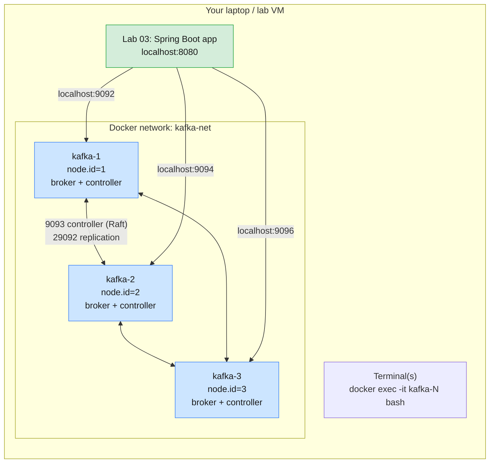

# Module 2 Labs — Kafka Installation, Setup & CLI Operations

> **Course:** Apache Kafka & Confluent Kafka Administration
> **Companion guide:** [`guides/module-02-installation-setup-cli-operations.md`](../../guides/module-02-installation-setup-cli-operations.md)
> **Module objective:** Install, configure, and perform core administration on
> Apache Kafka clusters.

Module 1 ran one Kafka node. In these labs you install Kafka the way a Linux
administrator does, build a **3-node KRaft cluster**, and then run it the way
you would in production: from the CLI first, then from a Java (Spring Boot)
application that uses the same Admin API as the CLI tools. Do the labs in
order.

| # | Lab | Level | Time | What you will do |
| - | --- | ----- | ---- | ---------------- |
| 01 | [Installing Kafka & building a 3-node KRaft cluster](lab-01-install-multi-broker-cluster.md) | Beginner | 60 min | Binary-style install, `kafka-storage.sh format`, 3-node Compose cluster, controller quorum and failover, two classic install mistakes |
| 02 | [Topic administration & CLI produce/consume](lab-02-topic-admin-cli-produce-consume.md) | Beginner → Intermediate | 75 min | Create / list / describe / alter / delete, topic configs, console producer and consumer options, consumer groups and lag, a broker outage with `min.insync.replicas` |
| 03 | [Kafka administration from Spring Boot](lab-03-spring-boot-admin-client.md) | Intermediate | 60 min | Topics as code (`NewTopic`), the Java Admin API behind the CLI, `KafkaTemplate` and `@KafkaListener`, lag from Java, fail-fast startup, surviving a broker outage |

Estimated total: **about 3 h 15 min**, including checkpoint questions.

---

## Prerequisites

| Requirement | Check with | Notes |
| ----------- | ---------- | ----- |
| Docker Desktop (running) | `docker version` | Both *Client* and *Server* sections must print |
| Docker Compose v2 | `docker compose version` | Bundled with Docker Desktop |
| **~3 GB** free RAM for Docker | Docker Desktop → Settings → Resources | Three Kafka JVMs with a 512 MB heap each |
| Ports **9092, 9094, 9096** free | `lsof -i :9092 -i :9094 -i :9096` (macOS/Linux) | Stop the Module 1 cluster first (below) |
| **Lab 03 only:** Java 17+ JDK and Maven 3.9+ | `java -version` · `mvn -v` | Pre-installed on the course VMs (Java 21, Maven). Port **8080** must be free |
| A terminal that can open several tabs | — | Lab 02 and Lab 03 use 2–3 terminals |

> **Stop Module 1 first.** Its single broker also uses port 9092:
>
> ```bash
> # (host) - from labs/module-01
> docker compose down
> ```

> **Using the course AWS VMs?** Everything above is already installed on your
> VM (`lab-lNN`). Connect with VS Code Remote-SSH and run the labs on the VM
> exactly as written. See [`infra/LAB-SETUP.md`](../../infra/LAB-SETUP.md).

---

## Lab environment

All three labs share one Compose file, [`docker-compose.yml`](docker-compose.yml).
Lab 01 has you generate your own cluster ID into a local `.env` file (not
committed to git); without it, the Compose file uses a built-in sample ID.



Each node has three listeners:

| Listener | Port in the container | Used by | Address it advertises |
| -------- | --------------------- | ------- | --------------------- |
| `PLAINTEXT` | 29092 | Other brokers, and CLI tools run **inside** a container | `kafka-N:29092` |
| `CONTROLLER` | 9093 | KRaft controller traffic only | — |
| `EXTERNAL` | 9092 (published as 9092 / 9094 / 9096) | Applications on **your laptop** (Lab 03) | `localhost:9092` / `9094` / `9096` |

Conveniences built into the Compose file:

- The Kafka tools directory `/opt/kafka/bin` is on the `PATH` in every
  container, so `kafka-topics.sh` works without a path.
- **`$BS`** (bootstrap servers) is set to `kafka-1:29092,kafka-2:29092,kafka-3:29092`
  in every container. Lab 01 Part 6 shows why the CLI must use these internal
  addresses and not `localhost:9092`.

### Everyday commands

Run these from **this folder** (`labs/module-02`):

```bash
docker compose up -d            # start the 3-node cluster
docker compose ps               # all three should show (healthy)
docker exec -it kafka-1 bash    # shell inside node 1 (kafka-2 / kafka-3 work too)
docker compose stop kafka-2     # stop one node (simulate a failure)
docker compose start kafka-2    # bring it back
docker compose down             # stop the cluster, keep topics and data
docker compose down -v          # stop and DELETE all data (fresh start)
```

> **Convention used in the labs**
>
> - `# (container)`: run **inside** `docker exec -it kafka-1 bash`.
> - `# (host)`: run on **your laptop / VM**, from `labs/module-02` unless the
>   block says otherwise.

---

## Troubleshooting

| Symptom | Likely cause | Fix |
| ------- | ------------ | --- |
| `no configuration file provided: not found` | Not in `labs/module-02` | `cd labs/module-02` |
| `Bind for 0.0.0.0:9092 failed: port is already allocated` | Module 1 cluster (or another Kafka) still running | `docker ps`, then stop it (`docker compose down` in `labs/module-01`) |
| A node stays `(health: starting)` then `(unhealthy)` | Wrong cluster ID in its volume (Lab 01 Part 6.2), or not enough RAM | `docker compose logs kafka-N \| grep -i -E "error\|inconsistent"` |
| Containers exit with code 137 | Docker ran out of memory | Give Docker Desktop more RAM (≥ 4 GB total) |
| CLI prints `Connection to node 2 (localhost/127.0.0.1:9094) could not be established` | Used `--bootstrap-server localhost:9092` **inside** a container | Use `--bootstrap-server $BS` (Lab 01 Part 6.1) |
| `WARN Couldn't resolve server kafka-3:29092` | That node is stopped; Docker removes its DNS name | Expected during failure exercises; the tool uses the other nodes |
| Spring Boot app: `Could not configure topics` ... `TimeoutException` | Cluster not running or ports not published | `docker compose ps`; all three healthy |
| `Web server failed to start. Port 8080 was already in use` | Another app on 8080 | `java -jar ... --server.port=8081` and use 8081 in the `curl` commands |

---

## Cleaning up after the module

```bash
# (host) - from labs/module-02
docker compose down -v
```

This removes the three containers, the `kafka-net` network and the three data
volumes. Keep the `apache/kafka:4.3.1` image; later modules use it again.
