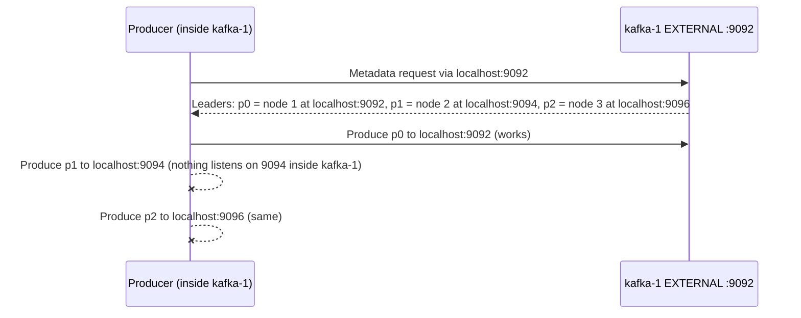

# Lab 01 — Installing Kafka & Building a 3-Node KRaft Cluster

| | |
| --- | --- |
| **Level** | Beginner |
| **Duration** | ~60 minutes |
| **Guide sections** | §2 Requirements · §3 Linux install · §4 Docker · §5 KRaft setup · §6 Lab topology · §11 Troubleshooting |
| **You will need** | Docker Desktop running, two terminals |

## Learning objectives

By the end of this lab you will be able to:

1. Install and start Kafka **by hand**, the way it is done on a Linux server:
   configuration file, cluster ID, **storage format**, start, stop.
2. Explain the two kinds of "logs" in a Kafka install (application logs vs.
   partition data in `log.dirs`).
3. Stand up a **3-node KRaft cluster** with Docker Compose and explain what is
   the same and what differs on each node.
4. Verify the **controller quorum** and watch it fail over, and see what happens
   when a majority of controllers is lost.
5. Recognise and fix two classic install mistakes: a client using the wrong
   **listener**, and a node formatted with the wrong **cluster ID**.

---

## Part 1 — Check your system (5 min)

```bash
# (host)
docker version
docker compose version
```

Both `Client:` and `Server:` must print. Then make sure the Module 1 broker is
stopped and the three ports this lab needs are free:

```bash
# (host) - from labs/module-01
docker compose down

# (host) macOS / Linux: no output means the ports are free
lsof -i :9092 -i :9094 -i :9096
```

Kafka 4.x brokers need **Java 17 or newer** (guide §2.2). The `apache/kafka`
image ships its own JVM. Check which one:

```bash
# (host)
docker run --rm --entrypoint java apache/kafka:4.3.1 -version
```

```
openjdk version "21.0.11" 2026-04-21 LTS
```

> **Sizing reminder (guide §2.1).** Kafka serves reads from the **OS page
> cache**, not from the JVM heap. Production brokers use a modest heap (about
> 6 GB) on machines with far more RAM. In this lab each node gets a 512 MB heap
> so that three of them fit on a laptop.

---

## Part 2 — Install Kafka "the Linux way" (15 min)

On a Linux server you download the Kafka tarball, extract it, write a
`server.properties`, **format** the storage and start the broker (guide §3). The
`apache/kafka` image contains exactly that extracted tarball under `/opt/kafka`,
so we use a throwaway container as our "Linux server" and do every step by
hand.

### 2.1 Open a shell on the "server"

```bash
# (host)
docker run -it --rm --name kafka-linux --hostname kafka-linux \
  --entrypoint bash apache/kafka:4.3.1
```

`--entrypoint bash` gives you a shell instead of starting Kafka. `--rm` deletes
the container when you exit, so nothing from this part is left behind.

### 2.2 Look at the installation

```bash
# (container: kafka-linux)
cd /opt/kafka
ls
ls bin
ls bin | wc -l
ls config
```

```
LICENSE  NOTICE  bin  config  kafka.jsa  libs  licenses  site-docs  storage.jsa
...
44
broker.properties  controller.properties  server.properties  producer.properties  consumer.properties  ...
```

| Directory | What it holds |
| --------- | ------------- |
| `bin/` | The CLI tools (`kafka-*.sh`), 44 of them in 4.3.1 (Windows `.bat` files are in `bin/windows/`) |
| `config/` | Example configs. `server.properties` is a combined broker+controller node; `broker.properties` and `controller.properties` are for dedicated roles |
| `libs/` | Kafka and dependency JARs. Every CLI tool is a thin wrapper around a Java class in here |

### 2.3 Prepare a configuration

Work on a copy, and point `log.dirs` (where **partition data** is stored) at a
directory you own:

```bash
# (container: kafka-linux)
mkdir -p ~/lab
cp config/server.properties ~/lab/
sed -i "s#^log.dirs=.*#log.dirs=$HOME/lab/data#" ~/lab/server.properties

grep -E "^(process.roles|node.id|controller.quorum|listeners|advertised.listeners|controller.listener.names|log.dirs)" ~/lab/server.properties
```

```
process.roles=broker,controller
node.id=1
controller.quorum.bootstrap.servers=localhost:9093
listeners=PLAINTEXT://:9092,CONTROLLER://:9093
advertised.listeners=PLAINTEXT://localhost:9092,CONTROLLER://localhost:9093
controller.listener.names=CONTROLLER
log.dirs=/home/appuser/lab/data
```

Match each line with the table in guide §3.3. Note that this sample file uses
`controller.quorum.bootstrap.servers` (a **dynamic** quorum, where controllers
can be added later with `kafka-metadata-quorum.sh`). The Compose cluster in
Part 3 uses the classic **static** `controller.quorum.voters` list instead.

### 2.4 Try to start it (this fails on purpose)

```bash
# (container: kafka-linux)
bin/kafka-server-start.sh ~/lab/server.properties 2>&1 | grep -E "ERROR|RuntimeException"
```

```
[...] ERROR Exiting Kafka due to fatal exception (kafka.Kafka$)
java.lang.RuntimeException: No readable meta.properties files found.
```

A KRaft node refuses to start until its storage has been **formatted**. This is
the most common reason a freshly installed broker will not start (guide §5.1).

### 2.5 Generate a cluster ID and format the storage

```bash
# (container: kafka-linux)
CLUSTER_ID=$(bin/kafka-storage.sh random-uuid)
echo $CLUSTER_ID

bin/kafka-storage.sh format -t $CLUSTER_ID -c ~/lab/server.properties
```

```
Because controller.quorum.voters is not set on this controller, you must specify one of the following: --standalone, --initial-controllers, or --no-initial-controllers.
```

With a dynamic quorum, `format` must be told how the quorum starts. This is a
single node, so it is a **standalone** quorum of one:

```bash
# (container: kafka-linux)
bin/kafka-storage.sh format --standalone -t $CLUSTER_ID -c ~/lab/server.properties
```

```
Formatting dynamic metadata voter directory /home/appuser/lab/data with metadata.version 4.3-IV0.
```

Look at what `format` wrote, and try formatting a second time:

```bash
# (container: kafka-linux)
ls ~/lab/data
cat ~/lab/data/meta.properties
bin/kafka-storage.sh format --standalone -t $CLUSTER_ID -c ~/lab/server.properties
```

```
__cluster_metadata-0  bootstrap.checkpoint  meta.properties

cluster.id=j8xlT-kGTom22UlSGqzpBg
directory.id=PVP48-L1TtCTJ6tTOuK3uA
node.id=1
version=1

Log directory /home/appuser/lab/data is already formatted. Use --ignore-formatted to ignore this directory and format the others.
```

`format` refuses to overwrite existing storage. That protects you from wiping
a live node by accident.

### 2.6 Start the node, and find the two kinds of "logs"

```bash
# (container: kafka-linux)
bin/kafka-server-start.sh -daemon ~/lab/server.properties

# wait until the node reports it is up
until grep -q "Kafka Server started" logs/server.log 2>/dev/null; do sleep 1; done
grep "Kafka Server started" logs/server.log
```

```
[...] INFO [KafkaRaftServer nodeId=1] Kafka Server started (kafka.server.KafkaRaftServer)
```

`-daemon` runs Kafka in the background, as a service would. Now compare the two
directories:

```bash
# (container: kafka-linux)
ls /opt/kafka/logs          # application logs: what the JVM prints
bin/kafka-topics.sh --bootstrap-server localhost:9092 --create --topic hello
ls ~/lab/data               # log.dirs: partition data
```

```
controller.log  kafka-authorizer.log  kafka-request.log  kafkaServer-gc.log  kafkaServer.out  log-cleaner.log  server.log  state-change.log

Created topic hello.

__cluster_metadata-0  bootstrap.checkpoint  cleaner-offset-checkpoint  hello-0  log-start-offset-checkpoint  meta.properties  ...
```

| Directory | Contains | Guide |
| --------- | -------- | ----- |
| `/opt/kafka/logs/` | The broker's **own diagnostics** (`server.log`, `controller.log`, GC log) | §3.1 |
| `log.dirs` (`~/lab/data`) | **Partition data**: one directory per partition (`hello-0`) plus the KRaft metadata log | §3.1, Module 1 §7 |

In production `log.dirs` is a dedicated disk, never the install directory.

Check the heap the start script chose, then confirm the single-node quorum:

```bash
# (container: kafka-linux)
ps -o args= -C java | grep -o -- "-Xmx[^ ]*"
bin/kafka-metadata-quorum.sh --bootstrap-server localhost:9092 describe --status
```

```
-Xmx1G

ClusterId:              j8xlT-kGTom22UlSGqzpBg
LeaderId:               1
...
CurrentVoters:          [{"id": 1, "directoryId": "efswrtIhTz-5owd4UD9e-w", "endpoints": ["CONTROLLER://localhost:9093"]}]
```

The default heap is 1 GB. You change it with the `KAFKA_HEAP_OPTS` environment
variable, which is what the Compose file in Part 3 does.

### 2.7 Stop the node and leave

```bash
# (container: kafka-linux)
bin/kafka-server-stop.sh
sleep 5; tail -1 logs/server.log
exit
```

On a real server you would not start Kafka by hand. It runs as a **systemd**
service as a dedicated non-root user, with `LimitNOFILE=100000` (guide §3.4).
The steps are the same as the ones you just ran: configure, format once, then
start and stop.

> **What this shows:** installing Kafka is: unpack, write `server.properties`,
> **format storage with a cluster ID**, start. The Docker image in Part 3 does
> the same steps for you from environment variables when a container starts.

---

## Part 3 — Build a 3-node cluster with Docker Compose (15 min)

Open a terminal in `labs/module-02` for the rest of the module.

### 3.1 Give your cluster its own ID

Every node in a KRaft cluster is formatted with the **same** cluster ID. The
Compose file reads `CLUSTER_ID` from a `.env` file in this folder, and falls
back to a built-in sample ID if there is none. Generate your own:

```bash
# (host) - from labs/module-02
echo "CLUSTER_ID=$(docker run --rm apache/kafka:4.3.1 /opt/kafka/bin/kafka-storage.sh random-uuid)" > .env
cat .env
```

```
CLUSTER_ID=Je89w39_Q46DWmFYXCGkGw
```

(Your ID will be different. On Windows without a bash shell, run the
`docker run` part, then paste the ID into `.env` with an editor.)

> Only change the ID **before the first start**, or after `docker compose down -v`.
> Part 6.2 shows what happens if a node's storage and the cluster disagree.

### 3.2 Read the Compose file

Open [`docker-compose.yml`](docker-compose.yml). Settings shared by all nodes are
defined once under `x-kafka-common-env` and merged into each service with
`<<: *kafka-common-env`. Only four things differ per node:

| Per-node setting | kafka-1 | kafka-2 | kafka-3 |
| ---------------- | ------- | ------- | ------- |
| `KAFKA_NODE_ID` | 1 | 2 | 3 |
| `KAFKA_ADVERTISED_LISTENERS` | `kafka-1:29092`, `localhost:9092` | `kafka-2:29092`, `localhost:9094` | `kafka-3:29092`, `localhost:9096` |
| Published port (host → container 9092) | 9092 | 9094 | 9096 |
| Data volume | `kafka-1-data` | `kafka-2-data` | `kafka-3-data` |

And the shared settings worth knowing:

| Shared setting | Value | Why |
| -------------- | ----- | --- |
| `KAFKA_CONTROLLER_QUORUM_VOTERS` | `1@kafka-1:9093,2@kafka-2:9093,3@kafka-3:9093` | Static quorum: **every** node lists **every** controller (guide §5.2) |
| `KAFKA_DEFAULT_REPLICATION_FACTOR` / `KAFKA_MIN_INSYNC_REPLICAS` | `3` / `2` | Production-style defaults for new topics |
| `KAFKA_OFFSETS_TOPIC_REPLICATION_FACTOR` | `3` | `__consumer_offsets` is now replicated (it was RF 1 in Module 1) |
| `KAFKA_AUTO_CREATE_TOPICS_ENABLE` | `false` | Topics are created deliberately by an admin (Lab 02) |
| `KAFKA_HEAP_OPTS` | `-Xms512m -Xmx512m` | Three JVMs on one machine |

Let Compose show you the fully merged settings of one node:

```bash
# (host)
docker compose config kafka-2 | grep -E "NODE_ID|ADVERTISED|QUORUM|CLUSTER_ID"
```

### 3.3 Start the cluster

```bash
# (host)
docker compose up -d
docker compose ps
```

After 15–30 seconds:

```
NAME      IMAGE                COMMAND                  SERVICE   CREATED          STATUS                    PORTS
kafka-1   apache/kafka:4.3.1   "/__cacert_entrypoin…"   kafka-1   30 seconds ago   Up 29 seconds (healthy)   0.0.0.0:9092->9092/tcp, [::]:9092->9092/tcp
kafka-2   apache/kafka:4.3.1   "/__cacert_entrypoin…"   kafka-2   30 seconds ago   Up 29 seconds (healthy)   0.0.0.0:9094->9092/tcp, [::]:9094->9092/tcp
kafka-3   apache/kafka:4.3.1   "/__cacert_entrypoin…"   kafka-3   30 seconds ago   Up 29 seconds (healthy)   0.0.0.0:9096->9092/tcp, [::]:9096->9092/tcp
```

### 3.4 Watch the first controller election in the logs

```bash
# (host)
docker compose logs --no-log-prefix | grep -o "RaftManager id=[0-9]\] Completed transition to [A-Za-z]*" | sort | uniq -c
```

```
   3 RaftManager id=1] Completed transition to UnattachedState
   1 RaftManager id=1] Completed transition to FollowerState
   1 RaftManager id=2] Completed transition to UnattachedState
   1 RaftManager id=2] Completed transition to ProspectiveState
   1 RaftManager id=2] Completed transition to CandidateState
   1 RaftManager id=2] Completed transition to Leader
   3 RaftManager id=3] Completed transition to UnattachedState
   1 RaftManager id=3] Completed transition to FollowerState
```

One node went `Candidate → Leader` and the other two became `Follower`s. Which
node wins varies from run to run.

---

## Part 4 — Verify the cluster (10 min)

Open a shell in node 1. Everything in this part runs there.

```bash
# (host)
docker exec -it kafka-1 bash
```

### 4.1 The bootstrap list

```bash
# (container)
echo $BS
kafka-broker-api-versions.sh --bootstrap-server $BS | grep -o "^kafka-[0-9]:29092 (id: [0-9]"
```

```
kafka-1:29092,kafka-2:29092,kafka-3:29092
kafka-1:29092 (id: 1
kafka-2:29092 (id: 2
kafka-3:29092 (id: 3
```

All three brokers answered. Listing all three in `--bootstrap-server` is not
required (any one reachable broker is enough), but it keeps tools working when
one node is down.

### 4.2 The controller quorum

```bash
# (container)
kafka-metadata-quorum.sh --bootstrap-server $BS describe --status
kafka-metadata-quorum.sh --bootstrap-server $BS describe --replication
```

```
ClusterId:              Je89w39_Q46DWmFYXCGkGw
LeaderId:               2
LeaderEpoch:            1
HighWatermark:          47
MaxFollowerLag:         0
MaxFollowerLagTimeMs:   114
CurrentVoters:          [{"id": 1, "endpoints": ["CONTROLLER://kafka-1:9093"]}, {"id": 2, "endpoints": ["CONTROLLER://kafka-2:9093"]}, {"id": 3, "endpoints": ["CONTROLLER://kafka-3:9093"]}]
CurrentObservers:       []

NodeId  DirectoryId             LogEndOffset  Lag  LastFetchTimestamp  LastCaughtUpTimestamp  Status
2       AAAAAAAAAAAAAAAAAAAAAA  51            0    1790651292902       1790651292902          Leader
1       AAAAAAAAAAAAAAAAAAAAAA  51            0    1790651292862       1790651292862          Follower
3       AAAAAAAAAAAAAAAAAAAAAA  51            0    1790651292862       1790651292862          Follower
```

| Check | Healthy value |
| ----- | ------------- |
| `ClusterId` | Your ID from `.env` |
| `LeaderId` | One of 1, 2, 3: the **active controller** |
| `CurrentVoters` | All three nodes, matching `KAFKA_CONTROLLER_QUORUM_VOTERS` |
| `Lag` (replication view) | `0` or close to it for every follower |

**Write down the `LeaderId`.** You need it in Part 5.

### 4.3 Same cluster ID, different node IDs

```bash
# (container)
exit
```

```bash
# (host)
for n in 1 2 3; do echo "--- kafka-$n"; docker exec kafka-$n grep -E "cluster.id|node.id" /var/lib/kafka/data/meta.properties; done
```

```
--- kafka-1
cluster.id=Je89w39_Q46DWmFYXCGkGw
node.id=1
--- kafka-2
cluster.id=Je89w39_Q46DWmFYXCGkGw
node.id=2
--- kafka-3
cluster.id=Je89w39_Q46DWmFYXCGkGw
node.id=3
```

The image's start script ran `kafka-storage.sh format` on each node with the
`CLUSTER_ID` from `.env`, exactly as you did by hand in Part 2.

---

## Part 5 — Controller failover and quorum majority (10 min)

A 3-voter quorum needs a **majority (2 of 3)** to elect a leader and to commit
any metadata change.

### 5.1 Stop the active controller

Use the `LeaderId` you wrote down (the example uses 2):

```bash
# (host)
docker compose stop kafka-2
docker exec kafka-1 bash -c 'kafka-metadata-quorum.sh --bootstrap-server $BS describe --status 2>/dev/null | head -3; kafka-metadata-quorum.sh --bootstrap-server $BS describe --replication 2>/dev/null'
```

```
ClusterId:              Je89w39_Q46DWmFYXCGkGw
LeaderId:               1
LeaderEpoch:            2

NodeId  DirectoryId             LogEndOffset  Lag  ...  Status
1       AAAAAAAAAAAAAAAAAAAAAA  418           0    ...  Leader
2       AAAAAAAAAAAAAAAAAAAAAA  -1            419  ...  Follower
3       AAAAAAAAAAAAAAAAAAAAAA  418           0    ...  Follower
```

(If you stopped `kafka-1`, run the command in `kafka-3` instead.)

- A new leader was elected within seconds, and `LeaderEpoch` went up by one.
  Every election starts a new epoch.
- The stopped node is still a **voter** (the list is static), but its `Lag` grows.

### 5.2 Lose the majority

Stop a second node, so only one of three voters is left. The commands below
assume **kafka-1** is the survivor. If you stopped kafka-1 in 5.1, keep kafka-3
instead and replace `kafka-1` with `kafka-3` in this part.

```bash
# (host)
docker compose stop kafka-3            # or kafka-2: any node except the survivor
docker compose ps --status running     # exactly one node listed
docker exec -it kafka-1 bash
```

```bash
# (container)
kafka-topics.sh --bootstrap-server kafka-1:29092 --list                   # works
kafka-metadata-quorum.sh --bootstrap-server kafka-1:29092 describe --status   # waits ~60 s, then times out
```

We use `kafka-1:29092` alone here, because `$BS` also names the stopped nodes
and the tools would print DNS warnings for them.

```
java.util.concurrent.ExecutionException: org.apache.kafka.common.errors.TimeoutException: The request timed out.
```

Try a metadata **change**:

```bash
# (container)
printf "request.timeout.ms=10000\ndefault.api.timeout.ms=15000\n" > /tmp/short.properties
kafka-topics.sh --bootstrap-server kafka-1:29092 --create --topic no.quorum \
  --command-config /tmp/short.properties
```

```
Error while executing topic command : Call(callName=createTopics, ...) timed out ...
```

| Operation | With 1 of 3 controllers | Why |
| --------- | ----------------------- | --- |
| `--list` topics | Works | Brokers answer from their **cached** copy of the metadata |
| Quorum status, create topic | Times out | There is no controller leader, so nothing can be **committed** to `__cluster_metadata` |

### 5.3 Restore the majority

```bash
# (container)
exit
```

```bash
# (host)
docker compose start          # starts every stopped node
sleep 15
docker compose ps
docker exec kafka-1 bash -c 'kafka-metadata-quorum.sh --bootstrap-server $BS describe --replication'
docker exec kafka-1 bash -c 'kafka-topics.sh --bootstrap-server $BS --list'
```

All three are `(healthy)` again with `Lag` near 0.

**Look at the topic list.** `no.quorum` may be there, even though the create
command reported a timeout: the request was still waiting at the broker and was
applied once a majority returned. A timeout means "no answer in time", **not**
"it failed". Always check before retrying an admin change. Remove it if present:

```bash
# (host)
docker exec kafka-1 bash -c 'kafka-topics.sh --bootstrap-server $BS --delete --topic no.quorum --if-exists'
```

> **What this shows:** with combined broker+controller nodes, losing 2 of 3
> nodes loses both data replicas **and** the controller majority. That is one
> reason production separates the roles and uses 3 or 5 dedicated controllers
> (guide §6).

---

## Part 6 — Two classic install mistakes (10 min)

### 6.1 The wrong listener: `localhost` inside a container

Create a topic whose three partitions are led by three different brokers:

```bash
# (host)
docker exec -it kafka-1 bash
```

```bash
# (container)
kafka-topics.sh --bootstrap-server $BS --create --topic listener.test --partitions 3 --replication-factor 3
kafka-topics.sh --bootstrap-server $BS --describe --topic listener.test
```

```
Topic: listener.test  Partition: 0  Leader: 1  Replicas: 1,2,3  Isr: 1,2,3
Topic: listener.test  Partition: 1  Leader: 2  Replicas: 2,3,1  Isr: 2,3,1
Topic: listener.test  Partition: 2  Leader: 3  Replicas: 3,1,2  Isr: 3,1,2
```

Note which partition **kafka-1** leads (partition 0 here; yours may differ).

Now produce six keyed messages, but bootstrap through **`localhost:9092`**, the
EXTERNAL listener meant for your laptop:

```bash
# (container)
for i in 1 2 3 4 5 6; do echo "k$i:v$i"; done | kafka-console-producer.sh \
  --bootstrap-server localhost:9092 --topic listener.test \
  --reader-property parse.key=true --reader-property key.separator=: \
  --command-property delivery.timeout.ms=8000 --command-property request.timeout.ms=3000
```

```
WARN [Producer clientId=console-producer] Connection to node 2 (localhost/127.0.0.1:9094) could not be established. Node may not be available.
WARN [Producer clientId=console-producer] Connection to node 3 (localhost/127.0.0.1:9096) could not be established. Node may not be available.
...
ERROR Error when sending message to topic listener.test with key: 2 bytes, value: 2 bytes with error:
org.apache.kafka.common.errors.TimeoutException: Expiring 3 record(s) for listener.test-1:8000 ms has passed since batch creation.
```

```bash
# (container)
kafka-get-offsets.sh --bootstrap-server $BS --topic listener.test
```

```
listener.test:0:2
listener.test:1:0
listener.test:2:0
```

Only the partition led by **kafka-1** received messages. What happened:



Bootstrapping is only the first step. After that the client connects to the
**advertised** address of each partition leader, on the same listener it
bootstrapped through. `localhost:9094` is correct on your laptop and wrong inside
a container. Now use the internal listener:

```bash
# (container)
for i in 1 2 3 4 5 6; do echo "k$i:v$i"; done | kafka-console-producer.sh \
  --bootstrap-server $BS --topic listener.test \
  --reader-property parse.key=true --reader-property key.separator=:
kafka-get-offsets.sh --bootstrap-server $BS --topic listener.test
kafka-topics.sh --bootstrap-server $BS --delete --topic listener.test
exit
```

```
listener.test:0:4
listener.test:1:3
listener.test:2:1
```

All six new messages arrived, in every partition. This is guide §11's troubleshooting flow in
practice: *"gets metadata, then hangs"* means an **advertised listener** problem.

### 6.2 The wrong cluster ID: `INCONSISTENT_CLUSTER_ID`

Simulate a node whose disk was replaced and then formatted with a **new**
cluster ID by mistake.

```bash
# (host) remove kafka-3 and its data volume
docker compose rm -sf kafka-3
docker volume ls | grep kafka-3          # note the exact name, e.g. module-02_kafka-3-data
docker volume rm module-02_kafka-3-data

# start kafka-3 with a DIFFERENT cluster ID (the shell variable overrides .env)
CLUSTER_ID=$(docker run --rm apache/kafka:4.3.1 /opt/kafka/bin/kafka-storage.sh random-uuid) \
  docker compose up -d kafka-3
```

Wait about 30 seconds, then look:

```bash
# (host)
docker compose ps kafka-3
docker compose logs kafka-3 | grep -m 2 INCONSISTENT_CLUSTER_ID
docker exec kafka-1 bash -c 'kafka-metadata-quorum.sh --bootstrap-server kafka-1:29092 describe --replication'
docker exec kafka-3 grep cluster.id /var/lib/kafka/data/meta.properties
grep CLUSTER_ID .env
```

```
kafka-3   ...   Up About a minute (health: starting)

ERROR [RaftManager id=3] Unexpected error INCONSISTENT_CLUSTER_ID in FETCH response: ... source=kafka-2:9093 (id: 2 ...)
ERROR [RaftManager id=3] Unexpected error INCONSISTENT_CLUSTER_ID in FETCH response: ... source=kafka-1:9093 (id: 1 ...)

NodeId  ...  LogEndOffset  Lag  ...  Status
2       ...  527           0    ...  Leader
1       ...  527           0    ...  Follower
3       ...  -1            528  ...  Follower

cluster.id=fJKlpIqvTI2vB5jpKeXEuA
CLUSTER_ID=Je89w39_Q46DWmFYXCGkGw
```

The container is running, but the node never joins. The other controllers
reject every request from it because the cluster ID it carries does not match.
It never becomes healthy.

**Fix:** wipe that node's storage and format it again with the cluster's
**real** ID. Starting it normally does that, because `.env` has the right ID:

```bash
# (host)
docker compose rm -sf kafka-3
docker volume rm module-02_kafka-3-data
docker compose up -d kafka-3
sleep 20
docker compose ps
docker exec kafka-1 bash -c 'kafka-metadata-quorum.sh --bootstrap-server $BS describe --replication'
```

All three are `(healthy)` with `Lag` 0 again. On a real cluster, wiping a node
loses its copy of the data. Other replicas copy it back, which is why RF 3
matters (Lab 02 and Module 5).

---

## Checkpoint questions

<details>
<summary>1. A new broker exits at startup with <code>No readable meta.properties files found</code>. What was skipped?</summary>

`kafka-storage.sh format`. Every KRaft node's `log.dirs` must be formatted with
the cluster ID before its first start. On a node joining an existing cluster, use
that cluster's ID, not a new `random-uuid`.
</details>

<details>
<summary>2. A disk alert fires for <code>/opt/kafka/logs</code>. Is partition data at risk of filling it?</summary>

No. `/opt/kafka/logs` holds the broker's application logs (`server.log`, GC
logs). Partition data lives in `log.dirs`, which should be a separate,
dedicated volume. Both need monitoring, but they are different disks and fixes.
</details>

<details>
<summary>3. In a 3-controller quorum, how many controllers can fail before metadata changes stop? Why not use 4 controllers?</summary>

One. A quorum needs a majority (2 of 3). With 4 voters the majority is 3, so 4
controllers still tolerate only 1 failure, and add more traffic. That is why
quorums use odd sizes: 3 tolerates 1 failure, 5 tolerates 2.
</details>

<details>
<summary>4. While 2 of 3 nodes were down, <code>--list</code> worked but <code>--create</code> timed out. Why the difference?</summary>

Listing reads the broker's cached metadata. Creating a topic must be written to
the `__cluster_metadata` log by the active controller and committed by a
majority of voters. With one voter left there is no leader and no majority.
</details>

<details>
<summary>5. An application on a laptop connects to <code>broker1.example.com:9092</code>, gets metadata, then logs <code>Connection to node 2 (kafka-2/172.18.0.3:29092) could not be established</code>. What is wrong, and who fixes it?</summary>

The client is receiving an internal advertised address (`kafka-2:29092`) that it
cannot reach. Either it bootstrapped through the internal listener, or the
listener it used advertises an internal name. The Kafka administrator fixes
`advertised.listeners` so that listener advertises addresses reachable from the
client's network. Changing the client does not help.
</details>

<details>
<summary>6. Why did kafka-3 show <code>(health: starting)</code> and not simply exit, when its cluster ID was wrong?</summary>

Formatting and starting succeeded locally: the node's storage matches its own
configuration. The mismatch shows up only when it talks to the other
controllers, which answer `INCONSISTENT_CLUSTER_ID`. The process keeps running
and retrying, so the failure appears in the **logs** and the **quorum
replication view**, not in the container status. Check both after any node
rebuild.
</details>

---

## Clean up

Leave the cluster running for Lab 02.

```bash
# (host) only if you are stopping here
docker compose down        # keeps topics and data
```

**Next:** [Lab 02 — Topic administration & CLI produce/consume](lab-02-topic-admin-cli-produce-consume.md)
