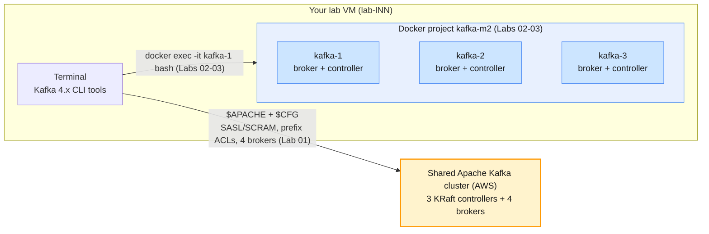

# Module 3 Labs — Cluster Configuration, Storage & Retention

> **Course:** Apache Kafka & Confluent Kafka Administration
> **Companion guide:** [`guides/module-03-cluster-configuration-storage-retention.md`](../../guides/module-03-cluster-configuration-storage-retention.md)
> **Module objective:** Administer storage, retention, and configuration on
> Apache Kafka clusters.

Module 2 gave you a cluster that runs. These labs make it a cluster that
**stores your data the way the business needs it stored**. You work in two
places: Lab 01 runs on the **shared Apache Kafka cluster on AWS** (where you
configure retention and replication on your own `lNN.*` topics), and Labs 02–03
run on **your own Module 2 Docker cluster** (where you can break brokers and
watch durability, retention and segments act without affecting anyone else).
Do the labs in order.

| # | Lab | Level | Time | What you will do |
| - | --- | ----- | ---- | ---------------- |
| 01 | [Broker & topic configuration on the shared cluster](lab-01-broker-topic-configuration.md) | Beginner | 55 min | Connect with your config file, create a topic with a designed contract, read synonyms, change retention live, prove the acks=all contract, hit the cluster guardrails |
| 02 | [Retention, segments & storage management](lab-02-retention-segments-storage-management.md) | Beginner → Intermediate | 70 min | Segments on disk, time-based and size-based retention in action, compaction and tombstones with space reclaim, compression comparison |
| 03 | [Durability under acks & min.insync.replicas](lab-03-durability-acks-min-insync-replicas.md) | Intermediate → Advanced | 75 min | Kill a broker under `acks=all`, raise `min.insync.replicas` live, watch writes get rejected, the strict min ISR rule hiding `acks=1` data, and full recovery |

Estimated total: **about 3 h 20 min**, including checkpoint questions.

---

## Prerequisites

| Requirement | Check with | Notes |
| ----------- | ---------- | ----- |
| Lab VM with the prepared client config (Lab 01) | `kafka-topics.sh --bootstrap-server apache-kafka.lab.internal:9092 --command-config ~/kafka/apache.properties --list` | Prints nothing on first run — that is the healthy result |
| Your learner prefix `lNN` | The credentials e-mail you received | Every topic and group name starts with `$ME` |
| Docker Desktop (running) (Labs 02–03) | `docker version` | Both *Client* and *Server* sections must print |
| **~3 GB** free RAM for Docker | Docker Desktop → Settings → Resources | Three Kafka JVMs with a 512 MB heap each |
| Ports **9092, 9094, 9096** free | `lsof -i :9092 -i :9094 -i :9096` (macOS/Linux) | Stop the Module 2 cluster first (below) |
| A terminal that can open 2–3 tabs | — | Lab 03 runs compose commands and container commands side by side |

> **Stop Module 2 first.** Its cluster also uses ports 9092/9094/9096:
>
> ```bash
> # (host) - from labs/module-02
> docker compose down -v
> ```

> **Using the course AWS VMs?** Everything above is already installed on your
> VM (`lab-lNN`), including the prepared config file `~/kafka/apache.properties`
> and the Kafka 4.x CLI tools on your `PATH`. Connect with VS Code Remote-SSH
> and run these labs on the VM exactly as written. See
> [`infra/LAB-SETUP.md`](../../infra/LAB-SETUP.md) for the full course
> environment.

---

## Lab environment

Two environments, two rules:

- **Lab 01 — shared Apache Kafka cluster on AWS.** You authenticate with
  SASL/SCRAM through your prepared config file and work only inside your own
  prefix. The cluster has 3 KRaft controllers and **4 brokers**; you cannot
  change broker-level configs there (and Lab 01 shows you why).
- **Labs 02–03 — your own Module 2 cluster.** The 3-node Docker cluster from
  [`labs/module-02/docker-compose.yml`](../module-02/docker-compose.yml), started
  together with this folder's
  [`docker-compose.override.yml`](docker-compose.override.yml), which shortens
  the retention check interval so storage changes are visible in seconds
  instead of 5-minute waits. Everything else stays as Module 2 defined it.



| Endpoint | Config file | Your prefix | Used by |
| -------- | ----------- | ----------- | ------- |
| `apache-kafka.lab.internal:9092` | `~/kafka/apache.properties` (`$CFG`) | `lNN` (`$ME`), e.g. `l07` | Lab 01: `--command-config $CFG` on every admin tool, `$ME.` before every topic/group |
| `kafka-1:29092,kafka-2:29092,kafka-3:29092` (`$BS`, inside the containers) | — | `$ME` | Labs 02–03: the same internal listeners Module 2 used |

Conveniences that carry over from Module 2 (Labs 02–03): `/opt/kafka/bin` is on
the `PATH` in every container, and **`$BS`** is preset to the internal
bootstrap list. The override file adds `log.retention.check.interval.ms=15000`
(15 s, instead of the 5-minute default) so the retention exercises are fast —
**never** use a value like that in production.

### Everyday commands

Shared cluster (Lab 01):

```bash
# (VM)
APACHE=apache-kafka.lab.internal:9092   # the shared cluster
CFG=~/kafka/apache.properties           # your SASL credentials (prepared for you)
ME=lNN                                  # your prefix: l01 … l18

kafka-topics.sh --bootstrap-server $APACHE --command-config $CFG --list
```

Local cluster (Labs 02–03) — run from **this folder** (`labs/module-03`):

```bash
docker compose -p kafka-m2 -f ../module-02/docker-compose.yml \
  -f docker-compose.override.yml up -d        # start the 3-node cluster
docker compose -p kafka-m2 -f ../module-02/docker-compose.yml \
  -f docker-compose.override.yml ps           # all three should show (healthy)
docker exec -it kafka-1 bash                  # shell inside node 1
docker compose -p kafka-m2 -f ../module-02/docker-compose.yml \
  -f docker-compose.override.yml stop kafka-2 # stop one node (simulate a failure)
docker compose -p kafka-m2 -f ../module-02/docker-compose.yml \
  -f docker-compose.override.yml start kafka-2
docker compose -p kafka-m2 -f ../module-02/docker-compose.yml \
  -f docker-compose.override.yml down -v      # stop and DELETE all data (fresh start)
```

> **Convention used in the labs**
>
> - `# (VM)`: run on **your lab VM** against the **shared cluster**, using your
>   prepared config file (`$CFG`) and prefix (`$ME`). Lab 01 only.
> - `# (host)`: run on **your laptop / lab VM**, from `labs/module-03` unless
>   the block says otherwise. Labs 02–03 compose commands.
> - `# (container)`: run **inside** `docker exec -it kafka-1 bash` (or
>   `kafka-2` / `kafka-3` where the lab says so). Labs 02–03 Kafka commands.

---

## Troubleshooting

| Symptom | Likely cause | Fix |
| ------- | ------------ | --- |
| `Failed to connect` / `SaslAuthenticationException` on any Lab 01 command | Wrong or missing config file, or the VM lost network | Check `ls -l ~/kafka/apache.properties` and re-export `CFG`; ask the trainer to verify cluster health |
| `TopicAuthorizationException` when creating a topic (Lab 01) | Topic name does not start with your prefix | Every topic and group must be `$ME.*` — never another learner's prefix |
| `kafka-topics.sh --list` shows nothing or only a few topics (Lab 01) | Expected: prefix ACLs hide other learners' topics | List is filtered to what you are allowed to describe |
| Cluster-level `kafka-configs.sh --alter` fails with `ClusterAuthorizationException` (Lab 01) | Expected: learners have no `AlterConfigs` on the cluster | That is the guardrail Lab 01 Part 6 demonstrates |
| `kafka-log-dirs.sh` prints one huge JSON line | That is its normal output | Read it as JSON: pipe to `jq` **on the VM** (not inside the container) |
| `Bind for 0.0.0.0:9092 failed: port is already allocated` (Labs 02–03) | The Module 2 cluster is still running | `docker compose down -v` in `labs/module-02`, or reuse the same `-p kafka-m2` project |
| Retention "does nothing" (Lab 02) | Started without the override file (check interval is 5 min), or the segment never rolled | Use the full `-f … override` command; check `segment.ms`/`segment.bytes`; wait out the 60 s delete delay |
| Compaction "does nothing" (Lab 02) | Active segment never compacted; cleaner runs lazily in the background | Produce one more record after a 6 s pause to roll the segment, then wait 30–60 s |
| `WARN Couldn't resolve server kafka-2:29092` (Lab 03) | kafka-2 is stopped; Docker removed its DNS name | Expected during the failure exercise |
| Producer errors `NOT_ENOUGH_REPLICAS` (Lab 03) | ISR dropped below `min.insync.replicas` | Expected in Part 4; restore `min.insync.replicas=2` and restart the broker (Part 6) |
| `jq: command not found` inside a container | `jq` is installed on the VM, not in the Kafka image | Run `kafka-log-dirs.sh` from the container and pipe on the VM, or read the raw JSON |

---

## Cleaning up after the module

```bash
# (host) - from labs/module-03
docker compose -p kafka-m2 -f ../module-02/docker-compose.yml \
  -f docker-compose.override.yml down -v
```

This removes the three containers, the `kafka-net` network and the three data
volumes of the Lab 02–03 project. It does **not** touch your Lab 01 topics on
the shared cluster — those are yours to keep or delete. Keep the
`apache/kafka:4.3.1` image; Modules 4 and 5 use it again.
