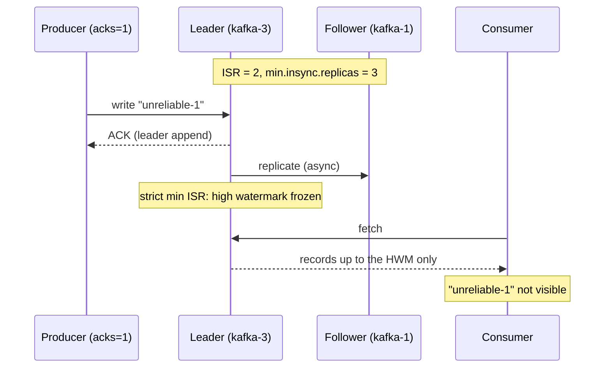

# Lab 03 — Durability under acks & min.insync.replicas

| | |
| --- | --- |
| **Level** | Intermediate → Advanced |
| **Duration** | ~75 minutes |
| **Guide sections** | §6 min.insync.replicas and acknowledgments (acks) · §4.2 Setting and inspecting overrides · §4.3 How a config change propagates in KRaft · §3.1 One directory per partition · §8.2–8.3 Hands-on Parts B and C |
| **You will need** | The `kafka-m2` cluster from Lab 02 running, two terminals (one `docker exec` shell in kafka-1, one on the host for compose commands) |

## Learning objectives

By the end of this lab you will be able to:

1. Build a topic with the production durability baseline (RF = 3,
   `min.insync.replicas=2`) and verify its contract in `--describe`.
2. Stop a broker and observe leader failover and ISR shrinkage, while
   `acks=all` writes keep succeeding.
3. Raise `min.insync.replicas` **live** and watch `acks=all` writes get
   rejected with `NOT_ENOUGH_REPLICAS` — a refusal by design.
4. Prove the **strict min ISR rule** of Kafka 4.x: an `acks=1` write that
   "succeeds" is invisible to consumers until replication recovers, because
   the high watermark stops advancing.
5. Restore the broker and the config, and watch the frozen records become
   visible as the ISR heals.
6. Read the segment files of the partition to see the raw truth behind all of
   the above.

---

## Part 1 — A topic built for durability (5 min)

Start the shell and set your prefix (the cluster is the one Lab 02 left
running):

```bash
# (host)
docker exec -it kafka-1 bash
```

```bash
# (container)
ME=lNN
```

A single partition is enough to demonstrate the whole contract:

```bash
# (container)
kafka-topics.sh --bootstrap-server $BS --create \
  --topic $ME.durability.test \
  --partitions 1 --replication-factor 3 \
  --config min.insync.replicas=2

kafka-topics.sh --bootstrap-server $BS --describe --topic $ME.durability.test
```

**Expected** (the leader assignment varies):

```
Created topic l07.durability.test.
Topic: l07.durability.test	TopicId: i-n9WbtHTj61BhKpOrLAvw	PartitionCount: 1	ReplicationFactor: 3	Configs: min.insync.replicas=2
	Topic: l07.durability.test	Partition: 0	Leader: 2	Replicas: 2,3,1	Isr: 2,3,1	Elr: 	LastKnownElr: 
```

The contract (guide §6.1): the **producer** side is `acks=all` — a write only
counts when every in-sync replica has it. The **broker** side is
`min.insync.replicas=2` — an `acks=all` write is only accepted while at least
two replicas are in sync. Together: tolerate one broker failure with zero
producer impact.

---

## Part 2 — The happy path: `acks=all` (5 min)

```bash
# (container)
printf "before-failure-1\nbefore-failure-2\n" | \
  kafka-console-producer.sh --bootstrap-server $BS --topic $ME.durability.test \
  --command-property acks=all 2>/dev/null
```

**Expected:** silence — both records acknowledged by the full ISR of 3.
Verify:

```bash
# (container)
kafka-console-consumer.sh --bootstrap-server $BS --topic $ME.durability.test \
  --group $ME.baseline --from-beginning --timeout-ms 4000 \
  --formatter-property print.offset=true 2>/dev/null
```

**Expected:**

```
Offset:0	before-failure-1
Offset:1	before-failure-2
```

> **Note on `acks` defaults:** the Java producer has defaulted to `acks=all`
> since Kafka 3.0, but old tutorials and habits still assume `acks=1`. These
> exercises always set `acks` explicitly so the contract under test is visible
> in the command (guide §6.3).

---

## Part 3 — Stop a broker; the contract holds (10 min)

Open **terminal 2** on the host and stop broker 2:

```bash
# (host) - terminal 2, from labs/module-03
docker compose -p kafka-m2 -f ../module-02/docker-compose.yml \
  -f docker-compose.override.yml stop kafka-2
```

**Expected:** ` Container kafka-2 Stopped `. Wait ~10 seconds for the
controller to notice, then read the damage report:

```bash
# (container) - terminal 1
kafka-topics.sh --bootstrap-server $BS --describe --topic $ME.durability.test 2>/dev/null
```

**Expected** (in this example the partition was led by broker 2; yours may
have moved from 1 or 3):

```
	Topic: l07.durability.test	Partition: 0	Leader: 3	Replicas: 2,3,1	Isr: 3,1	Elr: 	LastKnownElr: 
```

(`2>/dev/null` hides the `Couldn't resolve server kafka-2` warnings — a
stopped container's DNS name disappears.)

- The controller elected a new leader **from the ISR** within seconds.
- Broker 2 dropped out of the ISR, but it is still in `Replicas`: the cluster
  expects it back.

Now prove the contract: with ISR = 2 and `min.insync.replicas=2`, an
`acks=all` write must still be accepted:

```bash
# (container)
echo "during-outage-acks-all" | kafka-console-producer.sh --bootstrap-server $BS \
  --topic $ME.durability.test --command-property acks=all 2>/dev/null
echo "exit code: $?"

kafka-get-offsets.sh --bootstrap-server $BS --topic-partitions $ME.durability.test:0 2>/dev/null
```

**Expected:**

```
exit code: 0
l07.durability.test:0:3
```

Accepted. This is why **RF = 3 + `min.insync.replicas=2`** is the production
pairing: one broker can fail with no visible effect on producers (guide §6.4).

---

## Part 4 — Raise the bar while it's down (20 min)

The business now demands three confirmed copies of every record. Raise the
durability floor **live** — the same dynamic topic config you used in Lab 01:

```bash
# (container)
kafka-configs.sh --bootstrap-server $BS --alter \
  --entity-type topics --entity-name $ME.durability.test \
  --add-config min.insync.replicas=3
```

**Expected:**

```
Completed updating config for topic l07.durability.test.
```

Effective immediately, on every broker, no restart — the KRaft metadata event
from Lab 01 Part 4. The cluster can no longer meet the new bar: ISR = 2, but
you require 3.

### 4.1 `acks=all` is rejected — by design

```bash
# (container)
echo "rejected-1" | kafka-console-producer.sh --bootstrap-server $BS \
  --topic $ME.durability.test \
  --command-property acks=all \
  --command-property delivery.timeout.ms=10000 \
  --command-property request.timeout.ms=5000 2>&1 | grep -viE "resolve|deprecat"
```

**Expected:**

```
WARN [Producer clientId=console-producer] Got error produce response with correlation id 6 on topic-partition l07.durability.test-0, retrying (2 attempts left). Error: NOT_ENOUGH_REPLICAS
WARN [Producer clientId=console-producer] Got error produce response with correlation id 7 on topic-partition l07.durability.test-0, retrying (1 attempts left). Error: NOT_ENOUGH_REPLICAS
WARN [Producer clientId=console-producer] Got error produce response with correlation id 8 on topic-partition l07.durability.test-0, retrying (0 attempts left). Error: NOT_ENOUGH_REPLICAS
ERROR Error when sending message to topic l07.durability.test with key: null, value: 10 bytes with error:
org.apache.kafka.common.errors.NotEnoughReplicasException: Messages are rejected since there are fewer in-sync replicas than required.
```

Kafka **refuses the write** rather than accepting it with weaker durability
than configured. The producer retried (that is `retries` at work — Module 4
tunes it), then gave up. A real application must handle this exception.

### 4.2 `acks=1` "succeeds" — but the cluster is protecting you from it

```bash
# (container)
echo "unreliable-1" | kafka-console-producer.sh --bootstrap-server $BS \
  --topic $ME.durability.test --command-property acks=1 2>/dev/null
echo "exit code: $?"
```

**Expected:**

```
exit code: 0
```

No error at all: `acks=1` only waits for the **leader's** append, and
`min.insync.replicas` does not gate `acks=1` writes (guide §6.4, rule 2). So
where is the record? Try to read it in a **new** group:

```bash
# (container)
kafka-get-offsets.sh --bootstrap-server $BS --topic-partitions $ME.durability.test:0 2>/dev/null

kafka-console-consumer.sh --bootstrap-server $BS --topic $ME.durability.test \
  --group $ME.misr-check --from-beginning --timeout-ms 5000 \
  --formatter-property print.offset=true 2>/dev/null
```

**Expected:**

```
l07.durability.test:0:3

Offset:0	before-failure-1
Offset:1	before-failure-2
Offset:2	during-outage-acks-all
```

The producer said "success", yet the record is **not visible**: the latest
offset is still 3 and the consumer stops at offset 2. Is the record lost? Look
at the leader's segment file on disk — the raw truth:

```bash
# (container) - every broker holds a copy (RF = 3); the leader was kafka-3 in this example
kafka-dump-log.sh --print-data-log --files /var/lib/kafka/data/$ME.durability.test-0/00000000000000000000.log 2>/dev/null \
  | grep -E "^\| offset"
```

**Expected** (the last record, `unreliable-1`, shows `sequence: -1` — its
producer ran without idempotence):

```
| offset: 0 ... payload: before-failure-1
| offset: 1 ... payload: before-failure-2
| offset: 2 ... payload: during-outage-acks-all
| offset: 3 ... sequence: -1 ... payload: unreliable-1
```

It **is** in the log. Consumers only ever see records below the **high
watermark**, and Kafka 4.x's **strict min ISR rule** (guide §6.2) stops the
high watermark from advancing while the ISR is smaller than
`min.insync.replicas`. The record is written but not committed:



> **Why raise `min.insync.replicas` instead of stopping a second broker?** On
> this combined broker+controller laptop cluster, stopping two of three nodes
> breaks the controller **quorum** as well as the ISR. Raising the minimum
> while one broker is down exercises the exact same write-rejection path and
> lets you watch dynamic config take effect — a double lesson (guide §8.2).

---

## Part 5 — `acks=0`: no confirmation at all (5 min)

For completeness, the third level of `acks`:

```bash
# (container)
echo "fire-and-forget-1" | kafka-console-producer.sh --bootstrap-server $BS \
  --topic $ME.durability.test --command-property acks=0 2>/dev/null
echo "exit code: $?"
```

**Expected:** `exit code: 0` and **no output whatsoever** — the producer does
not even wait for the leader's answer, so it can neither report success nor
detect failure. The record takes the same frozen-high-watermark path as
`acks=1`.

| acks | Producer waits for | Fails when | Use for |
| ---- | ------------------ | ---------- | ------- |
| `0` | Nothing | Never (silent) | Metrics you can afford to lose entirely |
| `1` | Leader append | Leader is down | Throughput-sensitive, loss-tolerant data |
| `all` | Full ISR append | ISR < `min.insync.replicas` | Everything that must not be lost |

---

## Part 6 — Restore and recover (10 min)

Put the topic's durability setting back first:

```bash
# (container)
kafka-configs.sh --bootstrap-server $BS --alter \
  --entity-type topics --entity-name $ME.durability.test \
  --add-config min.insync.replicas=2
```

**Expected:** `Completed updating config for topic l07.durability.test.`

Then bring broker 2 back:

```bash
# (host) - terminal 2
docker compose -p kafka-m2 -f ../module-02/docker-compose.yml \
  -f docker-compose.override.yml start kafka-2
```

Wait ~15 seconds and watch the ISR heal:

```bash
# (container)
kafka-topics.sh --bootstrap-server $BS --describe --topic $ME.durability.test
```

**Expected:**

```
	Topic: l07.durability.test	Partition: 0	Leader: 3	Replicas: 2,3,1	Isr: 1,2,3	Elr: 	LastKnownElr: 
```

Broker 2 copied everything it missed and rejoined the ISR. Two things happen
now, in order:

1. With ISR = 3 ≥ `min.insync.replicas=2`, the **high watermark advances**.
2. The records that were written but invisible — `unreliable-1` and
   `fire-and-forget-1` — become visible.

Read in a **new** group to prove it:

```bash
# (container)
kafka-console-consumer.sh --bootstrap-server $BS --topic $ME.durability.test \
  --group $ME.misr-check-2 --from-beginning --timeout-ms 5000 \
  --formatter-property print.offset=true 2>/dev/null
```

**Expected:**

```
Offset:0	before-failure-1
Offset:1	before-failure-2
Offset:2	during-outage-acks-all
Offset:3	unreliable-1
Offset:4	fire-and-forget-1
```

Nothing was lost this time — but only because the leader's disk survived. If
broker 3 had lost its disk before recovery, offsets 3 and 4 existed on **one**
broker only and would be gone (guide §6.4, scenario table). That is the real
meaning of the two `acks` levels: `acks=1` traded that risk for speed.

> **Notice the leadership did not move back to broker 2.** The partition is
> healthy and fully replicated, just led by broker 3. Brokers rebalance
> leadership to the **preferred** replica automatically
> (`leader.imbalance.check.interval.seconds`, default 5 min), or an admin runs
> `kafka-leader-election.sh --election-type preferred` — you did exactly this
> in Module 2 Lab 02 Part 5.5.

---

## Part 7 — Segments on disk (10 min)

Close the loop with the same on-disk view you used in Lab 02:

```bash
# (container)
ls -lh /var/lib/kafka/data/$ME.durability.test-0/
```

**Expected:** the familiar layout — `00000000000000000000.log` (all five
records still fit one segment), the pre-allocated 10 MB `.index` /
`.timeindex`, `leader-epoch-checkpoint` and `partition.metadata`.

Then the per-partition, per-replica sizes:

```bash
# (container)
kafka-log-dirs.sh --bootstrap-server $BS --describe --topic-list $ME.durability.test 2>/dev/null \
  | grep -oE '"(broker|partition)":[^,}]+' | head -12
```

**Expected** (sizes are examples):

```
"broker":1
"partition":"l07.durability.test-0"
"broker":2
"partition":"l07.durability.test-0"
"broker":3
"partition":"l07.durability.test-0"
```

Three brokers, one copy each — and after the outage, all three copies carry
the same five records. The durability story, told in files.

---

## Checkpoint questions

<details>
<summary>1. With RF = 3 and <code>min.insync.replicas=2</code>, how many brokers can fail before an <code>acks=all</code> producer is rejected? And an <code>acks=1</code> producer?</summary>

`acks=all` keeps working with **one** broker down (ISR 2 ≥ 2). With two down,
the ISR is 1 and writes fail with `NOT_ENOUGH_REPLICAS`. An `acks=1` producer
"keeps working" as long as a leader exists — but in Kafka 4.x those records
are invisible to consumers while the ISR is below `min.insync.replicas`, and
they are lost for good if the leader's disk dies first.
</details>

<details>
<summary>2. The <code>acks=1</code> producer reported success, yet a brand-new consumer group saw nothing. Where was the record, and what moved it into view later?</summary>

The record was appended to the leader's log, above the **high watermark**.
The strict min ISR rule holds the watermark while ISR <
`min.insync.replicas`, so it was uncommitted. After you restored
`min.insync.replicas=2` and broker 2 rejoined the ISR, the watermark advanced
past it and consumers could see it.
</details>

<details>
<summary>3. Why did this lab raise <code>min.insync.replicas</code> instead of stopping a second broker to break the contract?</summary>

On a combined broker+controller cluster, stopping two of three nodes breaks
the controller **quorum** (2 of 3 needed) as well as the ISR, and nothing
about the lesson would be more visible. Raising `min.insync.replicas=3` while
one broker is down drives the ISR below the minimum and exercises the exact
same `NOT_ENOUGH_REPLICAS` rejection path — plus it demonstrates dynamic
topic config changing live.
</details>

<details>
<summary>4. After broker 2 returned, the ISR showed 1,2,3 but the leader was still broker 3. Is anything wrong, and what (if anything) fixes it?</summary>

Nothing is wrong: leadership stays where it failed over to until a rebalance.
Kafka's `auto.leader.rebalance` (checked every
`leader.imbalance.check.interval.seconds`, 5 min) moves partitions back to
their **preferred** replicas, or an admin does it on demand with
`kafka-leader-election.sh --election-type preferred`.
</details>

<details>
<summary>5. What is the practical difference between <code>acks=0</code> and <code>acks=1</code> from the producer's point of view?</summary>

With `acks=1` the producer at least learns the leader accepted the append —
it can detect a leader failure and retry. With `acks=0` the producer sends and
does not wait, so it can neither confirm delivery nor detect loss; the data
"made it somewhere" only if nothing failed. Both are below the high watermark
during a strict-min-ISR episode.
</details>

<details>
<summary>6. A colleague proposes "RF = 3, acks = all, min.insync.replicas left at its default of 1" for the billing topic. What is the flaw?</summary>

With `min.insync.replicas=1`, an `acks=all` write is acknowledged by a single
in-sync replica — the "last replica standing" problem. A second broker
failure before replication catches up can lose acknowledged data. The broker
only consults `min.insync.replicas` for `acks=all` writes, so it must be
raised deliberately: the standard baseline is RF = 3, `min.insync.replicas=2`,
`acks=all`, idempotence on, `unclean.leader.election.enable=false`.
</details>

---

## Clean up

```bash
# (container)
exit
```

```bash
# (host) - from labs/module-03
docker compose -p kafka-m2 -f ../module-02/docker-compose.yml \
  -f docker-compose.override.yml down -v
```

This stops the cluster and deletes all Lab 02–03 data. Your Lab 01 topics on
the shared cluster remain.

**Next module:** *Module 4 — Producing & Consuming Messages*, where the
storage and durability decisions you made here meet the client side: producer
tuning (`batch.size`, `linger.ms`, retries, idempotence), consumer groups and
offset management, delivery semantics (at-most-once, at-least-once,
exactly-once), and Java producer/consumer applications running against the
shared Apache Kafka cluster.
