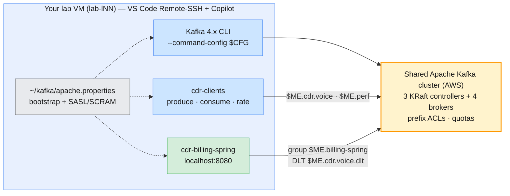

# Module 4 Labs — Producing & Consuming Messages

> **Course:** Apache Kafka & Confluent Kafka Administration
> **Companion guide:** [`guides/module-04-producing-consuming-messages.md`](../../guides/module-04-producing-consuming-messages.md)
> **Module objective:** Administer and validate message flow by producing and
> consuming via CLI and Java applications on Apache Kafka.

Modules 2 and 3 were about the cluster. These labs are about the **clients**:
the producer and consumer settings that decide whether CDRs arrive once, twice
or never. You work on your **lab VM in VS Code** (Remote-SSH, with GitHub
Copilot) against the **shared Apache Kafka cluster on AWS**, inside your own
`lNN.*` prefix. Every exercise uses two ready-made projects in this folder: a
plain Java client ([`cdr-clients/`](cdr-clients/)) and a Spring Boot billing
service ([`cdr-billing-spring/`](cdr-billing-spring/)). Do the labs in order.

| # | Lab | Level | Time | What you will do |
| - | --- | ----- | ---- | ---------------- |
| 01 | [Validating message flow & tuning the Java producer](lab-01-java-producer-tuning.md) | Beginner | 60 min | CLI produce/consume through your config file, `kafka-producer-perf-test.sh` with batching metrics and quotas, build and run a Java producer, tune `batch.size` / `linger.ms` / compression, review a Copilot draft |
| 02 | [Consumer groups, offsets & rebalancing in Java](lab-02-consumer-groups-offsets-rebalancing.md) | Beginner → Intermediate | 70 min | Scale a Java consumer group 1 → 3, clean leave vs `kill -9`, the KIP-848 consumer protocol, offset resets as an administrator, the same group in Spring Boot |
| 03 | [Delivery semantics & error handling](lab-03-delivery-semantics-error-handling.md) | Intermediate → Advanced | 80 min | Prove at-least-once and at-most-once with a crash, a poison pill that blocks a partition, a dead-letter topic in Java and in Spring Boot, exactly-once with transactions |

Estimated total: **about 3 h 30 min**, including checkpoint questions.

---

## Prerequisites

| Requirement | Check with | Notes |
| ----------- | ---------- | ----- |
| Lab VM with the prepared client config | `kafka-topics.sh --bootstrap-server apache-kafka.lab.internal:9092 --command-config ~/kafka/apache.properties --list` | Lists only your own `lNN.*` topics (Module 3 left `lNN.cdr.voice`) |
| Your learner prefix `lNN` | The credentials e-mail you received | Every topic, group and transactional ID starts with `$ME.` |
| Java 17+ JDK and Maven 3.9+ | `java -version` · `mvn -v` | The course VMs have Java 21 and Maven |
| VS Code with Remote-SSH (GitHub Copilot optional) | VS Code → Remote Explorer | Lab 01 Part 6 uses Copilot Chat if you have a licence; the lab works without it |
| Port **8080** free on the VM | `ss -ltn \| grep 8080` | Used by the Spring Boot app (Labs 02–03) |
| 3–4 terminals | VS Code → Terminal → Split | Consumers, producer and CLI side by side |

> **No Docker cluster in this module.** Everything runs against the shared
> cluster. If your Module 3 cluster is still up, you can stop it — nothing
> here uses it:
>
> ```bash
> # (VM) - from labs/module-03
> docker compose -p kafka-m2 -f ../module-02/docker-compose.yml \
>   -f docker-compose.override.yml down -v
> ```

> **Using the course AWS VMs?** Everything above is already installed on your
> VM (`lab-lNN`), including `~/kafka/apache.properties`, the Kafka 4.x CLI on
> your `PATH`, Java 21, Maven and the course repo in `~/mobliy-kafka`. Connect
> with VS Code Remote-SSH and run the labs on the VM exactly as written. See
> [`infra/LAB-SETUP.md`](../../infra/LAB-SETUP.md) for the full course
> environment.

---

## Lab environment

All three labs use the **shared Apache Kafka cluster on AWS**: 3 KRaft
controllers and 4 brokers, SASL/SCRAM authentication, prefix ACLs on topics,
groups and transactional IDs, and per-user produce/consume quotas. The Java
applications and the CLI read their connection and credentials from the same
prepared file, so no password ever appears in code or in this repo.



| Endpoint | Config file | Your prefix | Names used in the labs |
| -------- | ----------- | ----------- | ---------------------- |
| `apache-kafka.lab.internal:9092` (`$APACHE`) | `~/kafka/apache.properties` (`$CFG`) | `lNN` (`$ME`), e.g. `l07` | Topics `$ME.cdr.voice`, `$ME.perf`, `$ME.cdr.voice.dlt`, `$ME.cdr.rated` · groups `$ME.billing`, `$ME.billing-v2`, `$ME.billing-spring`, `$ME.rating` · transactional ID `$ME.rating-tx` |

| Project | Build | Run |
| ------- | ----- | --- |
| [`cdr-clients/`](cdr-clients/) — plain `kafka-clients` 4.3.1 | `mvn -q package` | `java -jar target/cdr-clients.jar produce\|consume\|rate\|draft …` |
| [`cdr-billing-spring/`](cdr-billing-spring/) — Spring Boot 4.1 | `mvn -q package` | `java -jar target/cdr-billing-spring-1.0.0.jar --lab.prefix=$ME` |

### Everyday commands

Define the coordinates in **every** new terminal:

```bash
# (VM)
APACHE=apache-kafka.lab.internal:9092   # the shared cluster
CFG=~/kafka/apache.properties           # your SASL credentials (prepared for you)
ME=lNN                                  # your prefix: l01 … l18

kafka-topics.sh --bootstrap-server $APACHE --command-config $CFG --list
kafka-consumer-groups.sh --bootstrap-server $APACHE --command-config $CFG \
  --describe --group $ME.billing --members --verbose
```

> **Convention used in the labs**
>
> - `# (VM)`: run on **your lab VM** (VS Code terminal) against the **shared
>   cluster**, using your prepared config file (`$CFG`) and prefix (`$ME`).
>   The block says which folder and which terminal when it matters, e.g.
>   `# (VM) - terminal 2, from labs/module-04/cdr-clients`.

---

## Troubleshooting

| Symptom | Likely cause | Fix |
| ------- | ------------ | --- |
| `NoSuchFileException: /home/learner/kafka/apache.properties` | Config file missing or the app runs as another user | `ls -l ~/kafka/apache.properties`; ask the trainer to redistribute it |
| `TopicAuthorizationException: Not authorized to access topics: [cdr.voice]` | Topic name without your prefix | Every topic is `$ME.…` — check that `ME` is set in **this** terminal (`echo $ME`) |
| `GroupAuthorizationException: Not authorized to access group: console-consumer-…` | Console consumer started without `--group`; its random group is outside your prefix | Always pass `--group $ME.<something>` on the shared cluster |
| `TimeoutException: Topic lNN.cdr.voize not present in metadata after 60000 ms` | Typo in the topic name; `auto.create.topics.enable=false` on the shared cluster | Create the topic first, or fix the name (Lab 01 Part 4) |
| `ConfigException: Must set acks to all in order to use the idempotent producer` | `acks=1` (or `0`) together with `enable.idempotence=true` | Use `acks=all`, or drop idempotence deliberately (Lab 01 Part 6) |
| Perf test shows `produce-throttle-time-avg` > 0 and a flat ~3–4 MB/s | Your per-user quota on the shared cluster | Expected; compare efficiency metrics, not raw records/sec (Lab 01 Part 3) |
| A restarted consumer gets no partitions for ~45 s | The old instance was killed (`kill -9`) and its session must expire first | Wait out `session.timeout.ms`, or always stop consumers with `Ctrl+C` (Lab 02 Part 2) |
| `Error: Assignments can only be reset if the group … is inactive` | Consumers of that group are still running | Stop them; `--describe --state` must show `Empty` (Lab 02 Part 4) |
| Lag stuck on one partition, `Cannot process p=N off=M … retrying` repeats | A poison pill and a retry-forever consumer | Restart with `--dlt=$ME.cdr.voice.dlt` (Lab 03 Part 3) |
| Spring Boot app: `Could not resolve placeholder 'lab.prefix'` | Started without `--lab.prefix=$ME` | `java -jar target/cdr-billing-spring-1.0.0.jar --lab.prefix=$ME` |
| `Web server failed to start. Port 8080 was already in use` | Another app (or a second copy) on 8080 | Stop it, or add `--server.port=8081` and use 8081 in the `curl` commands |

---

## Cleaning up after the module

Delete your Module 4 topics and groups — your prefix only:

```bash
# (VM)
for t in perf cdr.voice.dlt cdr.rated; do
  kafka-topics.sh --bootstrap-server $APACHE --command-config $CFG --delete --topic $ME.$t
done
for g in cli-check perf-reader billing-v2 billing-spring dlt-inspect rating \
         rated-check-read_uncommitted rated-check-read_committed; do
  kafka-consumer-groups.sh --bootstrap-server $APACHE --command-config $CFG --delete --group $ME.$g
done
```

Make sure no consumer or Spring app is still running first: a group with
active members cannot be deleted. This keeps `$ME.cdr.voice` and the
`$ME.billing` group — small, yours, and a ready-made keyed topic with a
consumer group for Module 5, where you prepare partition-reassignment plans
for your own topics. The compiled `target/` folders of the two projects are
ignored by git; delete them with `mvn -q clean` if you need the disk space.
