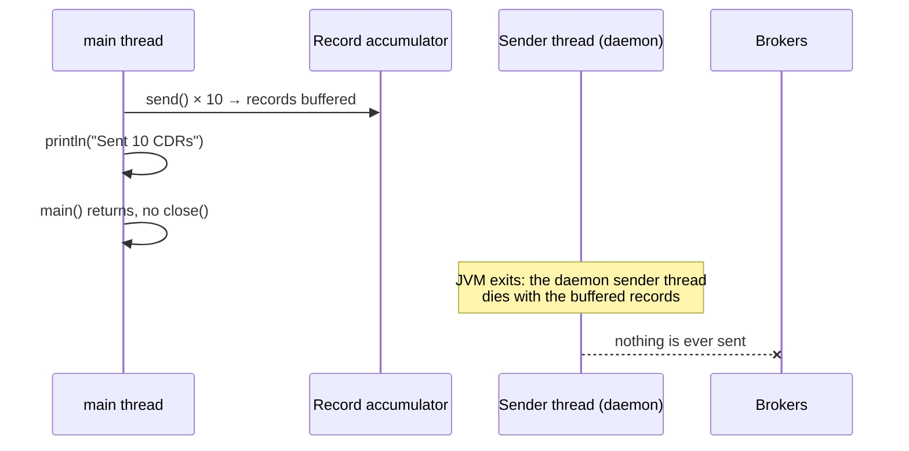

# Lab 01 — Validating Message Flow & Tuning the Java Producer

| | |
| --- | --- |
| **Level** | Beginner |
| **Duration** | ~60 minutes |
| **Guide sections** | §2 Inside the producer · §3 Producer configuration tuning · §8.1–§8.3 Java project, shared-cluster config, durable producer · §8.6 Using GitHub Copilot · §10.1 Part A |
| **You will need** | Your lab VM in VS Code (Remote-SSH) with `~/kafka/apache.properties`, your prefix `lNN`, Java 17+ and Maven, two terminals; GitHub Copilot optional |

## Learning objectives

By the end of this lab you will be able to:

1. Validate a message flow end to end with the console producer and consumer
   through your config file, and show that **one key always lands on one
   partition**.
2. Measure producer settings with `kafka-producer-perf-test.sh`, read the
   batching metrics (`batch-size-avg`, `records-per-request-avg`,
   `request-total`), and recognise when a **quota**, not your settings, is
   the limit.
3. Build and run a **plain Java producer** that loads the shared-cluster
   connection from `~/kafka/apache.properties` and handles every `send()`
   result in a callback.
4. Tune `batch.size`, `linger.ms` and `compression.type` from the command line
   and explain the effect from the client metrics.
5. Review an AI-generated producer and find the four classic defects:
   conflicting `acks`/idempotence, random keys, ignored `send()` results and a
   missing `close()`.

The examples use `l07` as the prefix. Replace it with your own everywhere.

---

## Part 1 — Your coordinates and topics (8 min)

Open a terminal in VS Code (**Terminal → New Terminal**) and define the three
variables every command uses. You will open more terminals later; define them
in each one.

```bash
# (VM)
APACHE=apache-kafka.lab.internal:9092
CFG=~/kafka/apache.properties
ME=lNN                          # your learner prefix: l01 … l18
```

Module 3 Lab 01 left you a topic, `$ME.cdr.voice` (6 partitions, RF 3,
`min.insync.replicas=2`). Make sure it exists — `--if-not-exists` creates it
only if it is missing — and create a second topic for measurements:

```bash
# (VM)
kafka-topics.sh --bootstrap-server $APACHE --command-config $CFG --create --if-not-exists \
  --topic $ME.cdr.voice --partitions 6 --replication-factor 3 \
  --config min.insync.replicas=2

kafka-topics.sh --bootstrap-server $APACHE --command-config $CFG --create \
  --topic $ME.perf --partitions 6 --replication-factor 3
```

**Expected:** the first command prints only the metric-name `WARNING` when the
topic already exists (no `Created topic` line), the second prints:

```
WARNING: Due to limitations in metric names, topics with a period ('.') or underscore ('_') could collide. To avoid issues it is best to use either, but not both.
Created topic l07.perf.
```

Check the contract of the topic the Java apps will use:

```bash
# (VM)
kafka-topics.sh --bootstrap-server $APACHE --command-config $CFG \
  --describe --topic $ME.cdr.voice
```

**Expected** (leaders and replica order differ on your cluster):

```
Topic: l07.cdr.voice	TopicId: sqGZi-sLSyCuHi4Vw2dxSA	PartitionCount: 6	ReplicationFactor: 3	Configs: min.insync.replicas=2,cleanup.policy=delete,segment.bytes=268435456,retention.ms=604800000,unclean.leader.election.enable=false
	Topic: l07.cdr.voice	Partition: 0	Leader: 12	Replicas: 12,13,11	Isr: 12,13,11	Elr: 	LastKnownElr: 
	Topic: l07.cdr.voice	Partition: 1	Leader: 13	Replicas: 13,11,12	Isr: 13,11,12	Elr: 	LastKnownElr: 
	Topic: l07.cdr.voice	Partition: 2	Leader: 11	Replicas: 11,12,13	Isr: 11,12,13	Elr: 	LastKnownElr: 
	…
```

Six partitions, every ISR complete, `min.insync.replicas=2`. That is the
broker side of the durability contract from Module 3. The rest of this module
is about the **client side** of the same contract (guide §1).

---

## Part 2 — Validate the flow with the CLI (10 min)

Before writing any code, prove the path works with the tools you already
know. Produce three calls (start and end events) for three subscribers, keyed
by MSISDN, with the durability setting written out explicitly:

```bash
# (VM)
kafka-console-producer.sh --bootstrap-server $APACHE --command-config $CFG \
  --topic $ME.cdr.voice \
  --command-property acks=all --command-property linger.ms=10 \
  --reader-property parse.key=true --reader-property key.separator=:
```

Type these six lines, then `Ctrl+D`:

```
966500000001:call-start
966500000002:call-start
966500000003:call-start
966500000001:call-end
966500000003:call-end
966500000002:call-end
```

The producer prints nothing on success. Now consume as a group, the way a
billing service would, and print the key, partition and offset of each record:

```bash
# (VM)
kafka-console-consumer.sh --bootstrap-server $APACHE --command-config $CFG \
  --topic $ME.cdr.voice --group $ME.cli-check --from-beginning --timeout-ms 5000 \
  --formatter-property print.key=true --formatter-property print.partition=true \
  --formatter-property print.offset=true
```

**Expected** (the first three records on partition 2 are the ones you wrote in
Module 3 Lab 01; your partition numbers may differ, the grouping will not):

```
The consumer rebalance protocol (KIP-848) is production-ready! Set group.protocol=consumer to try it out. See https://kafka.apache.org/documentation/#consumer_rebalance_protocol
Partition:3	Offset:0	966500000003	call-start
Partition:3	Offset:1	966500000003	call-end
Partition:2	Offset:0	966500000001	call-start
Partition:2	Offset:1	966500000002	call-start
Partition:2	Offset:2	966500000001	call-end
Partition:2	Offset:3	966500000001	call-start
Partition:2	Offset:4	966500000002	call-start
Partition:2	Offset:5	966500000001	call-end
Partition:2	Offset:6	966500000002	call-end
[2026-10-01 02:42:03,853] ERROR Error processing message, terminating consumer process:  (org.apache.kafka.tools.consumer.ConsoleConsumer)
org.apache.kafka.common.errors.TimeoutException
Processed a total of 9 messages
```

| What you see | What it proves | Guide |
| ------------ | -------------- | ----- |
| `966500000003` on partition 3 only, `…001` and `…002` on partition 2 only | Key hash → partition: every event of one subscriber stays in order on one partition | §2.2 |
| `call-start` before `call-end` for each key | Per-key ordering holds | §2.2 |
| Two keys share partition 2 | 3 keys over 6 partitions do not spread evenly — hashing is not balancing | §2.2 |
| `ERROR … TimeoutException` at the end | That is how `--timeout-ms` ends the console consumer; harmless | — |
| The KIP-848 banner | Kafka 4.x advertises the new consumer protocol; Lab 02 Part 3 tries it | §6.4 |

> **Shared-cluster rule:** always give the console consumer a `--group` under
> your prefix. Without one, it invents a group called
> `console-consumer-NNNNN`, which your ACLs do not cover, and fails with
> `GroupAuthorizationException`.

---

## Part 3 — Measure before you tune (12 min)

Never tune from intuition (guide §3.6). `kafka-producer-perf-test.sh` drives
the real Java producer with any settings you pass. Run the same load twice —
50,000 records of 1 KB — first with **no batching** (`linger.ms=0`, the 16 KB
default batch), then **batched and compressed**. `--print-metrics` dumps the
producer's metrics at the end; `grep` keeps the ones that matter:

```bash
# (VM)
for P in "acks=all linger.ms=0 batch.size=16384" \
         "acks=all linger.ms=20 batch.size=131072 compression.type=lz4"; do
  echo "== $P"
  kafka-producer-perf-test.sh --topic $ME.perf --num-records 50000 --record-size 1024 \
    --throughput -1 --command-config $CFG --command-property $P --print-metrics \
  | grep -E "50000 records sent|producer-metrics:(batch-size-avg|records-per-request-avg|request-total|compression-rate-avg|produce-throttle-time-avg)"
done
```

**Expected** (each run takes 10–15 s; your numbers differ, the pattern does not):

```
== acks=all linger.ms=0 batch.size=16384
50000 records sent, 3861.302031 records/sec (3.77 MB/sec), 4217.61 ms avg latency, 11808.00 ms max latency, 826 ms 50th, 11736 ms 95th, 11795 ms 99th, 11804 ms 99.9th.
producer-metrics:batch-size-avg:{client-id=perf-producer-client}                            : 15552.902
producer-metrics:compression-rate-avg:{client-id=perf-producer-client}                      : 1.000
producer-metrics:produce-throttle-time-avg:{client-id=perf-producer-client}                 : 18.667
producer-metrics:records-per-request-avg:{client-id=perf-producer-client}                   : 29.904
producer-metrics:request-total:{client-id=perf-producer-client}                             : 1678.000
== acks=all linger.ms=20 batch.size=131072 compression.type=lz4
50000 records sent, 4000.640102 records/sec (3.91 MB/sec), 6335.07 ms avg latency, 11833.00 ms max latency, 9167 ms 50th, 11817 ms 95th, 11827 ms 99th, 11833 ms 99.9th.
producer-metrics:batch-size-avg:{client-id=perf-producer-client}                            : 122652.007
producer-metrics:compression-rate-avg:{client-id=perf-producer-client}                      : 0.999
producer-metrics:produce-throttle-time-avg:{client-id=perf-producer-client}                 : 160.160
producer-metrics:records-per-request-avg:{client-id=perf-producer-client}                   : 234.742
producer-metrics:request-total:{client-id=perf-producer-client}                             : 219.000
```

Records per second barely moved. That is the most important observation of
this part, and the reason is the line most people skip:
`produce-throttle-time-avg` is **not zero**. The shared cluster gives every
learner a produce quota (`infra/LAB-SETUP.md` §4), and both runs hit it. The
broker delayed its responses to keep you at your share, so the run time and
latency are mostly **quota queueing** (guide §3.6: "rising latency with flat
throughput").

So compare what the client actually did differently:

| Metric | `linger.ms=0`, 16 KB | `linger.ms=20`, 128 KB, lz4 | What it means |
| ------ | -------------------- | --------------------------- | ------------- |
| `request-total` | 1678 | **219** | 7–8× fewer produce requests for the same data — less broker CPU, fewer network round trips |
| `records-per-request-avg` | 30 | **235** | Each request carries far more records |
| `batch-size-avg` | 15,553 B (batch full at 16 KB) | 122,652 B | The small batch was always full: `batch.size` was the limit (guide §3.2) |
| `compression-rate-avg` | 1.0 | 0.999 | **No gain** — the perf tool's payload is random bytes, which do not compress. Real CDRs do (Part 5) |
| `produce-throttle-time-avg` | > 0 | > 0 | You hit your **quota** in both runs: the cluster, not your settings, set the speed |

> **Administrator rule:** read throughput numbers together with
> `produce-throttle-time-avg`. A tuning "improvement" that does not change
> records/sec on a quota-limited user is still real if it cuts requests 8×:
> that is capacity you give back to the other 17 tenants (Module 5 capacity
> planning).

The consumer side has its own tool. Read 50,000 records back as a group:

```bash
# (VM)
kafka-consumer-perf-test.sh --bootstrap-server $APACHE --command-config $CFG \
  --topic $ME.perf --num-records 50000 --group $ME.perf-reader
```

**Expected:**

```
start.time, end.time, data.consumed.in.MB, MB.sec, data.consumed.in.nMsg, nMsg.sec, rebalance.time.ms, fetch.time.ms, fetch.MB.sec, fetch.nMsg.sec
2026-10-01 02:43:55:459, 2026-10-01 02:43:59:641, 49.0625, 11.7318, 50240, 12013.3907, 3617, 565, 86.8363, 88920.3540
```

`rebalance.time.ms` ≈ 3.6 s of the run was spent **joining the group**: the
shared cluster sets `group.initial.rebalance.delay.ms=3000` so that a group
whose members start together rebalances once, not once per member. You will
see that 3-second pause again in Lab 02.

---

## Part 4 — Build and run the Java producer (12 min)

### 4.1 Tour the project

Open the folder `~/mobliy-kafka/labs/module-04/cdr-clients` in VS Code
(**File → Open Folder**). It is a plain Maven project built the way guide §8.1
describes: `kafka-clients` 4.3.1, `slf4j-simple` for log output, Java 17+.

| File | What it does | Guide |
| ---- | ------------ | ----- |
| [`pom.xml`](cdr-clients/pom.xml) | `kafka-clients`, Jackson (Lab 03), SLF4J; builds one runnable jar `target/cdr-clients.jar` | §8.1 |
| [`ClientConfig.java`](cdr-clients/src/main/java/com/examples/kafka/ClientConfig.java) | Loads `~/kafka/apache.properties` (bootstrap + SASL) — the file `--command-config` uses — and applies `name=value` overrides from the command line | §8.2 |
| [`CdrProducer.java`](cdr-clients/src/main/java/com/examples/kafka/CdrProducer.java) | `produce <topic> <count>`: JSON CDRs keyed by 20 MSISDNs, the durable baseline settings, a callback for every send, `flush()` + `close()`, and the producer metrics at the end | §8.3 |
| [`CdrConsumer.java`](cdr-clients/src/main/java/com/examples/kafka/CdrConsumer.java) | `consume <topic> <group>` — Labs 02 and 03 | §8.4 |
| [`TransactionalRater.java`](cdr-clients/src/main/java/com/examples/kafka/TransactionalRater.java) | `rate …` — Lab 03 Part 5 | §7.4 |
| [`review/CopilotDraftProducer.java`](cdr-clients/src/main/java/com/examples/kafka/review/CopilotDraftProducer.java) | `draft <topic>` — Part 6 of this lab | §8.6 |

Open `CdrProducer.java` and find the settings block:

```java
props.put(ProducerConfig.ACKS_CONFIG, "all");
props.put(ProducerConfig.ENABLE_IDEMPOTENCE_CONFIG, "true");
props.put(ProducerConfig.LINGER_MS_CONFIG, "10");
props.put(ProducerConfig.BATCH_SIZE_CONFIG, "65536");
props.put(ProducerConfig.COMPRESSION_TYPE_CONFIG, "zstd");
props.put(ProducerConfig.DELIVERY_TIMEOUT_MS_CONFIG, "120000");
props.put(ProducerConfig.CLIENT_ID_CONFIG, "cdr-producer");
ClientConfig.applyOverrides(props, args.subList(2, args.size()));
```

That is the guide's production baseline (§3.4). The last line lets you
override any of it from the command line — that is how you will tune it in
Part 5 without editing code. There is **no** bootstrap address or password
anywhere in the project: both come from your config file.

### 4.2 Build and run

```bash
# (VM) - terminal 1
cd ~/mobliy-kafka/labs/module-04/cdr-clients
mvn -q package
java -jar target/cdr-clients.jar produce $ME.cdr.voice 200
```

The first build downloads dependencies and takes a minute or two. **Expected:**

```
02:44:21.297 INFO ClientConfig - Connection settings from /home/learner/kafka/apache.properties (bootstrap.servers=apache-kafka.lab.internal:9092)
02:44:21.298 INFO CdrProducer - Producer settings: acks=all enable.idempotence=true linger.ms=10 batch.size=65536 compression.type=zstd
02:44:22.112 INFO CdrProducer - key=966500000004 -> partition=1 offset=0
02:44:22.113 INFO CdrProducer - key=966500000003 -> partition=3 offset=2
02:44:22.116 INFO CdrProducer - key=966500000001 -> partition=2 offset=7
02:44:22.116 INFO CdrProducer - key=966500000002 -> partition=2 offset=8
02:44:22.117 INFO CdrProducer - key=966500000000 -> partition=5 offset=0
02:44:22.124 INFO CdrProducer - Sent 200 records in 826 ms (242 records/sec), 0 failed
02:44:22.125 INFO CdrProducer - Records per partition: {0=30, 1=20, 2=50, 3=30, 4=40, 5=30}
02:44:22.126 INFO CdrProducer -   batch-size-avg                 1090.2
02:44:22.126 INFO CdrProducer -   records-per-request-avg          66.7
02:44:22.126 INFO CdrProducer -   request-total                     9.0
02:44:22.126 INFO CdrProducer -   compression-rate-avg              0.2
02:44:22.126 INFO CdrProducer -   record-retry-total                0.0
02:44:22.126 INFO CdrProducer -   record-error-total                0.0
02:44:22.127 INFO CdrProducer -   produce-throttle-time-avg         0.0
```

- `966500000001` and `…002` went to **partition 2** and `…003` to **partition
  3** — the same partitions as the console producer in Part 2. The Java client
  and the console tool use the same `murmur2(key) % 6` (guide §2.2).
- The `key=… -> partition=… offset=…` lines are printed **in the callback**,
  after the broker acknowledged the write. Only the first five are printed;
  the summary counts the rest. `0 failed` is the number you would alert on.
- `compression-rate-avg 0.2`: zstd shrank these JSON CDRs to about **one fifth**
  of their size — the gain the random perf-test payload could not show.
- 20 keys over 6 partitions gives 20 to 50 records per partition, not 33 each.

### 4.3 Two mistakes the shared cluster catches

Send to a topic **without** your prefix:

```bash
# (VM) - terminal 1
java -jar target/cdr-clients.jar produce cdr.voice 3
```

**Expected** (repeated once per record):

```
… ERROR CdrProducer - Delivery failed for key=966500000000: org.apache.kafka.common.errors.TopicAuthorizationException: Not authorized to access topics: [cdr.voice]
…
… INFO CdrProducer - Sent 0 records in 958 ms (0 records/sec), 3 failed
```

Now a **typo** inside your own prefix. The shared cluster has
`auto.create.topics.enable=false`, so the topic never appears. The override
`max.block.ms=5000` shortens the wait from the default 60 s:

```bash
# (VM) - terminal 1
java -jar target/cdr-clients.jar produce $ME.cdr.voize 1 max.block.ms=5000
```

**Expected** (after a few `UNKNOWN_TOPIC_OR_PARTITION` warnings):

```
… ERROR CdrProducer - Delivery failed for key=966500000000: org.apache.kafka.common.errors.TimeoutException: Topic l07.cdr.voize not present in metadata after 5000 ms.
… INFO CdrProducer - Sent 0 records in 5321 ms (0 records/sec), 1 failed
```

Both failures surface **in the callback**, not as an exception at the
`send()` call. An application that ignores the callback never learns that
nothing was written (guide §3.3, §9.2).

---

## Part 5 — Tune the Java producer (8 min)

Use the override mechanism to run the same producer with **no batching and no
compression**, then with the built-in baseline, 20,000 CDRs each, into the
measurement topic. The `grep` hides the per-record lines:

```bash
# (VM) - terminal 1
java -jar target/cdr-clients.jar produce $ME.perf 20000 \
  linger.ms=0 batch.size=16384 compression.type=none 2>&1 | grep -v -E "key=|Connection"
java -jar target/cdr-clients.jar produce $ME.perf 20000 2>&1 | grep -v -E "key=|Connection"
```

**Expected:**

```
02:46:05.386 INFO CdrProducer - Producer settings: acks=all enable.idempotence=true linger.ms=0 batch.size=16384 compression.type=none
02:46:06.337 INFO CdrProducer - Sent 20000 records in 951 ms (21030 records/sec), 0 failed
02:46:06.338 INFO CdrProducer - Records per partition: {0=3000, 1=2000, 2=5000, 3=3000, 4=4000, 5=3000}
02:46:06.341 INFO CdrProducer -   batch-size-avg                 6783.4
02:46:06.341 INFO CdrProducer -   records-per-request-avg          98.0
02:46:06.342 INFO CdrProducer -   request-total                   210.0
02:46:06.342 INFO CdrProducer -   compression-rate-avg              1.0
02:46:06.342 INFO CdrProducer -   record-retry-total                0.0
02:46:06.342 INFO CdrProducer -   record-error-total                0.0
02:46:06.342 INFO CdrProducer -   produce-throttle-time-avg         0.0
02:46:06.470 INFO CdrProducer - Producer settings: acks=all enable.idempotence=true linger.ms=10 batch.size=65536 compression.type=zstd
02:46:07.546 INFO CdrProducer - Sent 20000 records in 1075 ms (18604 records/sec), 0 failed
02:46:07.547 INFO CdrProducer - Records per partition: {0=3000, 1=2000, 2=5000, 3=3000, 4=4000, 5=3000}
02:46:07.548 INFO CdrProducer -   batch-size-avg                 5157.9
02:46:07.548 INFO CdrProducer -   records-per-request-avg         363.6
02:46:07.548 INFO CdrProducer -   request-total                    61.0
02:46:07.549 INFO CdrProducer -   compression-rate-avg              0.2
02:46:07.549 INFO CdrProducer -   record-retry-total                0.0
02:46:07.549 INFO CdrProducer -   record-error-total                0.0
02:46:07.549 INFO CdrProducer -   produce-throttle-time-avg         0.0
```

| Observation | Explanation | Guide |
| ----------- | ----------- | ----- |
| **Requests: 210 → 61**, records per request 98 → 364 | `linger.ms=10` lets batches fill before the sender drains them | §3.2 |
| `batch-size-avg` *smaller* in the tuned run (5.2 KB vs 6.8 KB) | Batch size is measured **after compression**: ~5 KB compressed holds about 25 KB of CDRs | §3.2, Module 3 §7.2 |
| `compression-rate-avg` 1.0 → 0.2 | 80 % fewer bytes on the network, on disk ×3 replicas, and against your quota | §3.1 |
| Records/sec similar (21 k vs 19 k) | A one-second run is dominated by start-up and metadata; it says little | §3.6 |
| `produce-throttle-time-avg 0.0` | 20,000 small CDRs (≈2 MB, or ≈0.4 MB compressed) stayed under the quota | §3.6 |

> **Tip:** the producer settings line is the first thing to check in any
> producer incident ticket. If the application does not log its effective
> settings at startup, ask the team to add it — it costs one line.

---

## Part 6 — Review a Copilot draft (10 min)

Assistants such as GitHub Copilot are good at boilerplate and bad at delivery
guarantees (guide §8.6). The project contains a producer written the way an
assistant typically drafts it for *"a Kafka producer that sends 10 JSON CDRs
keyed by MSISDN, make it fast"*. Open
[`review/CopilotDraftProducer.java`](cdr-clients/src/main/java/com/examples/kafka/review/CopilotDraftProducer.java)
and read it, then run it:

```bash
# (VM) - terminal 1
java -jar target/cdr-clients.jar draft $ME.cdr.voice
```

**Expected:**

```
… INFO ClientConfig - Connection settings from /home/learner/kafka/apache.properties (bootstrap.servers=apache-kafka.lab.internal:9092)
Exception in thread "main" org.apache.kafka.common.config.ConfigException: Must set acks to all in order to use the idempotent producer. Otherwise we cannot guarantee idempotence.
	at org.apache.kafka.clients.producer.ProducerConfig.postProcessAndValidateIdempotenceConfigs(ProducerConfig.java:613)
```

Defect 1: `acks=1` "for speed" plus an explicit `enable.idempotence=true`
(guide §2.3). Fix only that line — change `"1"` to `"all"` — rebuild, and
count the records in the topic before and after the run with
`kafka-get-offsets.sh` (it prints the log-end offset of every partition):

```bash
# (VM) - terminal 1
kafka-get-offsets.sh --bootstrap-server $APACHE --command-config $CFG --topic $ME.cdr.voice
mvn -q package
java -jar target/cdr-clients.jar draft $ME.cdr.voice
kafka-get-offsets.sh --bootstrap-server $APACHE --command-config $CFG --topic $ME.cdr.voice
```

**Expected:**

```
l07.cdr.voice:0:30
l07.cdr.voice:1:20
l07.cdr.voice:2:57
l07.cdr.voice:3:32
l07.cdr.voice:4:40
l07.cdr.voice:5:30
… INFO ClientConfig - Connection settings from /home/learner/kafka/apache.properties (bootstrap.servers=apache-kafka.lab.internal:9092)
Sent 10 CDRs to l07.cdr.voice
l07.cdr.voice:0:30
l07.cdr.voice:1:20
l07.cdr.voice:2:57
l07.cdr.voice:3:32
l07.cdr.voice:4:40
l07.cdr.voice:5:30
```

The program says it sent 10 CDRs. **Not one arrived**: every offset is
unchanged. Run it as often as you like — the result is the same.



This is guide §2.1 in action: `send()` only **buffers**; the background sender
thread ships the batch later, and the JVM does not wait for it. Now review the
whole file — with Copilot Chat if you have it (select the class, then ask
*"Review this Kafka producer for delivery guarantees: acks, idempotence, keys,
error handling and shutdown"*) — and check its answer against this list:

| # | Defect in the draft | Consequence | Fix | Guide |
| - | ------------------- | ----------- | --- | ----- |
| 1 | `acks=1` with `enable.idempotence=true` | `ConfigException` at start (or, without the idempotence line, idempotence silently off) | `acks=all` | §2.3, §3.4 |
| 2 | Random `Integer` as the key | Per-subscriber order destroyed: `call-start` and `call-end` on different partitions | MSISDN as the key | §2.2 |
| 3 | `send()` result ignored | Failures (ACL, timeout, too large) are invisible | Callback with an error branch | §3.3, §9.2 |
| 4 | No `flush()` / `close()` | Buffered records die with the JVM | try-with-resources or explicit `close()` | §2.1 |

Fix all four, rebuild, run, and confirm with `kafka-get-offsets.sh` that the
offsets moved by 10 in total.

<details>
<summary>Solution: the fixed loop</summary>

```java
props.put("acks", "all");
props.put("enable.idempotence", "true");

try (KafkaProducer<String, String> producer = new KafkaProducer<>(props)) {
    for (int i = 0; i < 10; i++) {
        String msisdn = "96650000000" + i;                    // business key: per-subscriber order
        String value = "{\"msisdn\":\"" + msisdn + "\",\"event\":\"call-start\"}";
        producer.send(new ProducerRecord<>(topic, msisdn, value), (md, ex) -> {
            if (ex != null) {
                System.err.println("FAILED " + msisdn + ": " + ex);   // alert, DLT or stop
            } else {
                System.out.println(msisdn + " -> partition " + md.partition() + " offset " + md.offset());
            }
        });
    }
    producer.flush();
}                                                             // close() before main() returns
System.out.println("Sent 10 CDRs to " + topic);
```

**Expected** run (your offsets differ):

```
966500000001 -> partition 2 offset 57
966500000002 -> partition 2 offset 58
966500000000 -> partition 5 offset 30
966500000006 -> partition 5 offset 31
966500000007 -> partition 5 offset 32
966500000004 -> partition 1 offset 20
966500000003 -> partition 3 offset 32
966500000009 -> partition 0 offset 30
966500000005 -> partition 4 offset 40
966500000008 -> partition 4 offset 41
Sent 10 CDRs to l07.cdr.voice
```

and `kafka-get-offsets.sh` now shows `0:31 1:21 2:59 3:33 4:42 5:33`.
</details>

> **Administrator rule:** every one of these defects compiles, runs and passes
> a demo. Make "callback or future handled, `acks=all`, business key,
> `close()` on shutdown" part of the go-live review for every new producer —
> whoever (or whatever) wrote it.

---

## Checkpoint questions

<details>
<summary>1. Both perf-test runs gave about 4,000 records/sec. Was the tuning useless? How do you decide?</summary>

No. `produce-throttle-time-avg` was above zero in both runs, so the per-user
quota capped throughput and hid the difference. The tuned run needed 219
requests instead of 1,678 for the same 50,000 records — a large cut in broker
CPU and network round trips. When a quota or a slow broker is the bottleneck,
compare request counts, batch sizes and compression, not records/sec.
</details>

<details>
<summary>2. The draft printed "Sent 10 CDRs" but the offsets did not move. Where were the records, and what would have made the loss visible?</summary>

They were in the producer's record accumulator, in memory, waiting for the
sender thread. `main()` returned without `close()`, the JVM exited and the
daemon sender thread died with them. A callback that counted successes would
have shown 0 acknowledgements; `flush()` + `close()` would have sent them.
</details>

<details>
<summary>3. Why did <code>batch-size-avg</code> go <em>down</em> when you raised <code>batch.size</code> and <code>linger.ms</code> in Part 5?</summary>

`batch-size-avg` measures the batch as sent, after compression. The tuned run
compressed with zstd at a ratio of about 0.2, so a 5 KB batch carried roughly
25 KB of CDRs, while the untuned 6.8 KB batch was uncompressed. The
records-per-request metric (98 → 364) shows the real increase in batching.
</details>

<details>
<summary>4. A team wants <code>linger.ms=0</code> "for lowest latency" on <code>cdr.voice</code>. What do you check before agreeing?</summary>

How much load the producer sends and what latency it really needs. Under load,
`linger.ms=0` gives many tiny requests, poor compression and more broker CPU,
and often no better end-to-end latency — the reason Kafka 4.0 changed the
default to 5 ms (guide §3.1). Ask for a perf-test or metric comparison of
`request-total`/`records-per-request-avg` and latency percentiles at
production-like load, then decide.
</details>

<details>
<summary>5. A producer on the shared cluster logs <code>TimeoutException: Topic l07.cdr.voize not present in metadata after 60000 ms</code>. What happened and what would you do?</summary>

The topic does not exist (a typo) and `auto.create.topics.enable=false`, so
`send()` waited `max.block.ms` (60 s) for metadata that never came. Fix the
name, or create the topic deliberately with its RF, partitions and configs.
Do not enable auto-creation to "fix" it — that turns every typo into a new
topic with default settings.
</details>

---

## Clean up

Nothing to tear down. Keep `$ME.cdr.voice` (Labs 02–03 consume from it) and
`$ME.perf`. Restore the draft if you want to try Part 6 again later:
`git checkout src/main/java/com/examples/kafka/review/CopilotDraftProducer.java`.

**Next:** [Lab 02 — Consumer groups, offsets & rebalancing in Java](lab-02-consumer-groups-offsets-rebalancing.md)
