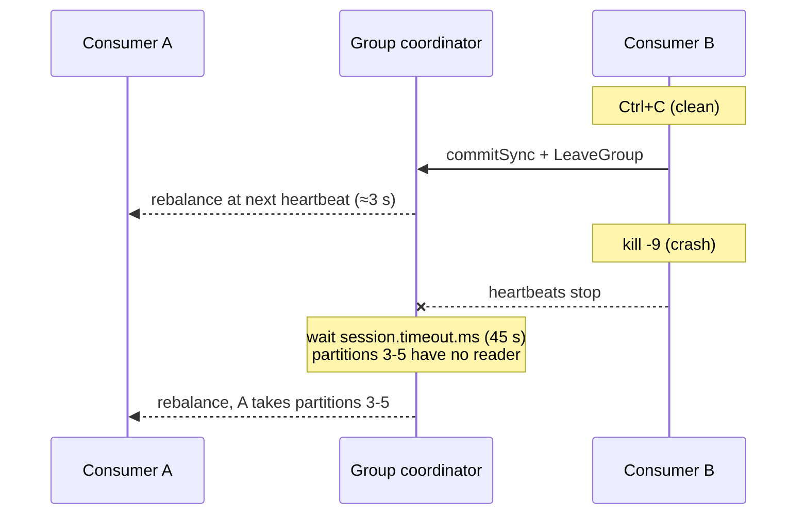

# Lab 02 — Consumer Groups, Offsets & Rebalancing in Java

| | |
| --- | --- |
| **Level** | Beginner → Intermediate |
| **Duration** | ~70 minutes |
| **Guide sections** | §4 Consumer groups and the poll loop · §5 Offset management and commit strategies · §6 Rebalancing · §8.4 At-least-once consumer · §8.5 Spring Boot · §10.2–§10.4 |
| **You will need** | Lab 01 completed (`$ME.cdr.voice` with data, `cdr-clients` built), **four** terminals with `APACHE`, `CFG` and `ME` defined, port 8080 free |

## Learning objectives

By the end of this lab you will be able to:

1. Run a Java consumer group, and read its members, assignment, committed
   offsets and lag with `kafka-consumer-groups.sh`.
2. Scale a group from one to three members, and explain each
   `Revoked`/`Assigned` log line under the classic (eager `range`) protocol.
3. Contrast a **clean leave** (`Ctrl+C`, rebalance in about 3 s) with a
   **crash** (`kill -9`, partitions stranded until `session.timeout.ms`).
4. Switch a consumer to the Kafka 4.x **consumer protocol (KIP-848)** and show
   that it moves only the partitions that need to move.
5. Reset a group's offsets safely: refuse while active, dry-run, shift one
   partition, replay by time or from the beginning.
6. Run the same group model in **Spring Boot** with `@KafkaListener` and
   `concurrency`, and prove the CLI sees the same thing.

---

## Part 1 — One consumer, one group (12 min)

Arrange four terminals in VS Code (**Terminal → Split Terminal**) and define
`APACHE`, `CFG` and `ME` in each (Lab 01 Part 1). In this lab:

| Terminal | Role |
| -------- | ---- |
| 1 | Consumer A |
| 2 | Producer and CLI |
| 3 | Consumer B |
| 4 | Consumer C, later the Spring Boot app |

Start the billing consumer in **terminal 1**. `consume <topic> <group>` runs
the at-least-once loop from guide §8.4: manual commits after processing,
`commitSync()` on revoke and on shutdown, and a log line for every rebalance.

```bash
# (VM) - terminal 1, from labs/module-04/cdr-clients
java -jar target/cdr-clients.jar consume $ME.cdr.voice $ME.billing
```

**Expected:**

```
02:46:33.329 INFO ClientConfig - Connection settings from /home/learner/kafka/apache.properties (bootstrap.servers=apache-kafka.lab.internal:9092)
02:46:33.337 INFO CdrConsumer - Started pid=14838 client.id=cdr-consumer-14838 group=l07.billing group.protocol=classic commit=after process-ms=0
02:46:37.048 INFO CdrConsumer - Assigned [l07.cdr.voice-0, l07.cdr.voice-1, l07.cdr.voice-2, l07.cdr.voice-3, l07.cdr.voice-4, l07.cdr.voice-5]
02:46:37.054 INFO CdrConsumer -   l07.cdr.voice-0 starts at committed offset 0
02:46:37.054 INFO CdrConsumer -   l07.cdr.voice-1 starts at committed offset 0
02:46:37.054 INFO CdrConsumer -   l07.cdr.voice-2 starts at committed offset 3
02:46:37.054 INFO CdrConsumer -   l07.cdr.voice-3 starts at committed offset 0
02:46:37.054 INFO CdrConsumer -   l07.cdr.voice-4 starts at committed offset 0
02:46:37.054 INFO CdrConsumer -   l07.cdr.voice-5 starts at committed offset 0
02:46:37.158 INFO CdrConsumer - p=0 off=0 key=966500000009 value={"cdrId":"45ff1dd2","msisdn":"966500000009","type":"voice","durationSec":39}
…
02:46:37.678 INFO CdrConsumer - p=2 off=58 key=966500000002 value={"msisdn":"966500000002","event":"call-start"}
```

Read the start of the log carefully:

- **`pid=14838`** — note your own value; you will need it in Part 2.
- `l07.cdr.voice-2 starts at committed offset 3`: the group `$ME.billing`
  already existed. Module 3 Lab 01 consumed the first three records of
  partition 2 with the console consumer **in the same group**, and that
  commit is still in `__consumer_offsets`. The Java consumer continues where
  the CLI stopped (guide §5.3).
- The other partitions start at offset 0 and the consumer works through
  everything Lab 01 wrote — about 200 records — then waits.
- It took about **4 s** from start to `Assigned`: the 3-second
  `group.initial.rebalance.delay.ms` you met in Lab 01 Part 3.

In **terminal 2**, produce 200 more CDRs and watch terminal 1 scroll:

```bash
# (VM) - terminal 2, from labs/module-04/cdr-clients
java -jar target/cdr-clients.jar produce $ME.cdr.voice 200 2>&1 | grep -E "Sent|per partition"
```

```
02:46:53.642 INFO CdrProducer - Sent 200 records in 838 ms (238 records/sec), 0 failed
02:46:53.642 INFO CdrProducer - Records per partition: {0=30, 1=20, 2=50, 3=30, 4=40, 5=30}
```

Now look at the group from the administrator's side — offsets and lag, then
members, then state (guide §4.5):

```bash
# (VM) - terminal 2
kafka-consumer-groups.sh --bootstrap-server $APACHE --command-config $CFG \
  --describe --group $ME.billing
kafka-consumer-groups.sh --bootstrap-server $APACHE --command-config $CFG \
  --describe --group $ME.billing --members --verbose
kafka-consumer-groups.sh --bootstrap-server $APACHE --command-config $CFG \
  --describe --group $ME.billing --state
```

**Expected:**

```
GROUP           TOPIC           PARTITION  CURRENT-OFFSET  LOG-END-OFFSET  LAG             CONSUMER-ID                                             HOST            CLIENT-ID
l07.billing     l07.cdr.voice   0          61              61              0               cdr-consumer-14838-a1c8e2fe-f4ae-4acf-9228-e0abbee65c39 /172.24.0.9     cdr-consumer-14838
l07.billing     l07.cdr.voice   1          41              41              0               cdr-consumer-14838-a1c8e2fe-f4ae-4acf-9228-e0abbee65c39 /172.24.0.9     cdr-consumer-14838
l07.billing     l07.cdr.voice   2          109             109             0               cdr-consumer-14838-a1c8e2fe-f4ae-4acf-9228-e0abbee65c39 /172.24.0.9     cdr-consumer-14838
l07.billing     l07.cdr.voice   3          63              63              0               cdr-consumer-14838-a1c8e2fe-f4ae-4acf-9228-e0abbee65c39 /172.24.0.9     cdr-consumer-14838
l07.billing     l07.cdr.voice   4          82              82              0               cdr-consumer-14838-a1c8e2fe-f4ae-4acf-9228-e0abbee65c39 /172.24.0.9     cdr-consumer-14838
l07.billing     l07.cdr.voice   5          63              63              0               cdr-consumer-14838-a1c8e2fe-f4ae-4acf-9228-e0abbee65c39 /172.24.0.9     cdr-consumer-14838

GROUP           CONSUMER-ID                                             HOST            CLIENT-ID          #PARTITIONS     CURRENT-EPOCH   CURRENT-ASSIGNMENT        TARGET-EPOCH    TARGET-ASSIGNMENT   
l07.billing     cdr-consumer-14838-a1c8e2fe-f4ae-4acf-9228-e0abbee65c39 /172.24.0.9     cdr-consumer-14838 6               -               l07.cdr.voice:0,1,2,3,4,5 -               -                   

GROUP           COORDINATOR (ID)          ASSIGNMENT-STRATEGY  STATE                #MEMBERS
l07.billing     broker-11:9092  (11)      range                Stable               1
```

| Column / value | Meaning | Guide |
| -------------- | ------- | ----- |
| `CURRENT-OFFSET` = `LOG-END-OFFSET`, `LAG 0` | The consumer has processed and **committed** everything | §5.1 |
| `CLIENT-ID cdr-consumer-14838` | The `client.id` the app sets from its PID — make client IDs meaningful, they are how you find the process behind a member | §8.3 |
| `CURRENT-EPOCH -` / `TARGET-…  -` | Epochs exist only in the new consumer protocol (Part 3) | §6.4 |
| `COORDINATOR … (11)` | The broker that owns this group's `__consumer_offsets` partition | §4.1 |
| `ASSIGNMENT-STRATEGY range` | The client default `[RangeAssignor, CooperativeStickyAssignor]` picked `range` — an **eager** assignor | §6.2 |

---

## Part 2 — Scale out and watch the rebalance (15 min)

### 2.1 Add a second and a third member

In **terminal 3**, start a second consumer in the **same** group:

```bash
# (VM) - terminal 3, from labs/module-04/cdr-clients
java -jar target/cdr-clients.jar consume $ME.cdr.voice $ME.billing
```

Compare the rebalance lines in both terminals:

```
# terminal 1 (consumer A)
02:47:10.060 INFO CdrConsumer - Revoked  [l07.cdr.voice-0, l07.cdr.voice-1, l07.cdr.voice-2, l07.cdr.voice-3, l07.cdr.voice-4, l07.cdr.voice-5]
02:47:10.112 INFO CdrConsumer - Assigned [l07.cdr.voice-0, l07.cdr.voice-1, l07.cdr.voice-2]
02:47:10.114 INFO CdrConsumer -   l07.cdr.voice-0 starts at committed offset 61
02:47:10.114 INFO CdrConsumer -   l07.cdr.voice-1 starts at committed offset 41
02:47:10.114 INFO CdrConsumer -   l07.cdr.voice-2 starts at committed offset 109

# terminal 3 (consumer B)
02:47:10.126 INFO CdrConsumer - Assigned [l07.cdr.voice-3, l07.cdr.voice-4, l07.cdr.voice-5]
02:47:10.135 INFO CdrConsumer -   l07.cdr.voice-3 starts at committed offset 63
02:47:10.135 INFO CdrConsumer -   l07.cdr.voice-4 starts at committed offset 82
02:47:10.135 INFO CdrConsumer -   l07.cdr.voice-5 starts at committed offset 63
```

Consumer A gave up **all six** partitions and got three back. That is the
eager protocol (guide §6.2): every member stops, revokes everything, and waits
for the new plan. Consumer B starts exactly where A had committed — the commit
in `onPartitionsRevoked` is what makes that hand-over clean.

Start a third consumer in **terminal 4** (same command) and read the last two
rebalance lines in each terminal:

```
# terminal 1
02:47:22.111 INFO CdrConsumer - Revoked  [l07.cdr.voice-0, l07.cdr.voice-1, l07.cdr.voice-2]
02:47:22.142 INFO CdrConsumer - Assigned [l07.cdr.voice-0, l07.cdr.voice-1]
# terminal 3
02:47:22.121 INFO CdrConsumer - Revoked  [l07.cdr.voice-3, l07.cdr.voice-4, l07.cdr.voice-5]
02:47:22.148 INFO CdrConsumer - Assigned [l07.cdr.voice-2, l07.cdr.voice-3]
# terminal 4
02:47:22.148 INFO CdrConsumer - Assigned [l07.cdr.voice-4, l07.cdr.voice-5]
```

```bash
# (VM) - terminal 2
kafka-consumer-groups.sh --bootstrap-server $APACHE --command-config $CFG \
  --describe --group $ME.billing --members
```

```
GROUP           CONSUMER-ID                                             HOST            CLIENT-ID          #PARTITIONS     
l07.billing     cdr-consumer-16019-766f18e2-e711-4bc8-801c-fb9950cd4f8a /172.24.0.9     cdr-consumer-16019 2               
l07.billing     cdr-consumer-16063-f4c04f72-a3cc-4d2c-9e00-d4e5f6972aca /172.24.0.9     cdr-consumer-16063 2               
l07.billing     cdr-consumer-14838-a1c8e2fe-f4ae-4acf-9228-e0abbee65c39 /172.24.0.9     cdr-consumer-14838 2               
```

Six partitions over three members: 2 + 2 + 2. A fourth, fifth and sixth member
would each get one partition; a **seventh** would get none (guide §4.1 —
parallelism is capped by the partition count). Part 5 shows that idle member.

### 2.2 A clean leave

Stop consumer C in **terminal 4** with `Ctrl+C`:

```
# terminal 4
02:47:58.595 INFO CdrConsumer - Committed final offsets, closing (leaves the group)
02:47:58.600 INFO CdrConsumer - Revoked  [l07.cdr.voice-4, l07.cdr.voice-5]
# terminal 1
02:48:01.170 INFO CdrConsumer - Revoked  [l07.cdr.voice-0, l07.cdr.voice-1]
02:48:01.234 INFO CdrConsumer - Assigned [l07.cdr.voice-0, l07.cdr.voice-1, l07.cdr.voice-2]
# terminal 3
02:48:01.182 INFO CdrConsumer - Revoked  [l07.cdr.voice-2, l07.cdr.voice-3]
02:48:01.233 INFO CdrConsumer - Assigned [l07.cdr.voice-3, l07.cdr.voice-4, l07.cdr.voice-5]
```

`Ctrl+C` ran the shutdown hook: `wakeup()` → final `commitSync()` →
`close()`, which sends a **LeaveGroup** request. The survivors rebalanced
about **3 seconds** later (the next heartbeat), with nothing lost and nothing
repeated (guide §8.4).

### 2.3 A crash

Now kill consumer B **without** a clean shutdown. Use the PID from its
`Started pid=…` line in terminal 3, and produce while it is dead:

> **Warning:** `kill -9` gives the JVM no chance to commit or leave the group.
> That is the point of this step — it is what an OOM kill or a lost VM does.

```bash
# (VM) - terminal 2: replace 16019 with consumer B's pid
kill -9 16019
java -jar target/cdr-clients.jar produce $ME.cdr.voice 50 2>&1 | grep "per partition"
kafka-consumer-groups.sh --bootstrap-server $APACHE --command-config $CFG \
  --describe --group $ME.billing
```

**Expected** (taken a few seconds after the kill; your offsets differ):

```
GROUP           TOPIC           PARTITION  CURRENT-OFFSET  LOG-END-OFFSET  LAG             CONSUMER-ID                                             HOST            CLIENT-ID
l07.billing     l07.cdr.voice   0          120             120             0               cdr-consumer-30334-44432197-22d9-4b8c-b782-24ecf290a9da /172.24.0.9     cdr-consumer-30334
l07.billing     l07.cdr.voice   1          84              84              0               cdr-consumer-30334-44432197-22d9-4b8c-b782-24ecf290a9da /172.24.0.9     cdr-consumer-30334
l07.billing     l07.cdr.voice   2          210             210             0               cdr-consumer-30334-44432197-22d9-4b8c-b782-24ecf290a9da /172.24.0.9     cdr-consumer-30334
l07.billing     l07.cdr.voice   3          115             122             7               cdr-consumer-30372-df4571e4-9d09-41d1-b597-ec887f00f84a /172.24.0.9     cdr-consumer-30372
l07.billing     l07.cdr.voice   4          156             166             10              cdr-consumer-30372-df4571e4-9d09-41d1-b597-ec887f00f84a /172.24.0.9     cdr-consumer-30372
l07.billing     l07.cdr.voice   5          124             133             9               cdr-consumer-30372-df4571e4-9d09-41d1-b597-ec887f00f84a /172.24.0.9     cdr-consumer-30372
```

The dead process **still owns** partitions 3–5 and their lag grows. The
coordinator cannot tell a dead consumer from a slow one until heartbeats
have been missing for `session.timeout.ms` (45 s by default, guide §4.4).
Watch terminal 1:

```
# terminal 1, about 45 s after the kill
03:05:59.122 INFO CdrConsumer - Revoked  [l07.cdr.voice-0, l07.cdr.voice-1, l07.cdr.voice-2]
03:05:59.171 INFO CdrConsumer - Assigned [l07.cdr.voice-0, l07.cdr.voice-1, l07.cdr.voice-2, l07.cdr.voice-3, l07.cdr.voice-4, l07.cdr.voice-5]
```



| | Clean leave (`Ctrl+C`) | Crash (`kill -9`) |
| --- | --- | --- |
| **Detected by** | LeaveGroup request | Missing heartbeats |
| **Rebalance after** | ≈ 3 s | ≈ `session.timeout.ms` (45 s) |
| **Final commit** | Yes — nothing replayed | No — uncommitted work is replayed (Lab 03) |
| **Lever you own** | Graceful shutdown in every deployment | `session.timeout.ms`; static membership for planned restarts (§6.3) |

Stop consumer A with `Ctrl+C` in terminal 1. All your `$ME.billing` members
are now gone.

---

## Part 3 — The Kafka 4.x consumer protocol (10 min)

The console consumer printed a banner in Lab 01: *"The consumer rebalance
protocol (KIP-848) is production-ready!"*. Try it. Any trailing `name=value`
argument is passed to the consumer config, so no code change is needed. Use a
**new** group, `$ME.billing-v2` — a group runs one protocol at a time.

```bash
# (VM) - terminal 1
java -jar target/cdr-clients.jar consume $ME.cdr.voice $ME.billing-v2 group.protocol=consumer
```

Wait until it has read the whole topic (a new group starts at the earliest
offset), then start a second member in **terminal 3** with the same command.

**Expected:**

```
# terminal 1 (first member)
02:49:16.874 INFO CdrConsumer - Started pid=16939 client.id=cdr-consumer-16939 group=l07.billing-v2 group.protocol=consumer commit=after process-ms=0
02:49:17.792 INFO CdrConsumer - Assigned [l07.cdr.voice-0, l07.cdr.voice-1, l07.cdr.voice-2, l07.cdr.voice-3, l07.cdr.voice-4, l07.cdr.voice-5]
02:49:17.838 INFO CdrConsumer -   l07.cdr.voice-0 starts at auto.offset.reset (no committed offset)
…
02:49:38.082 INFO CdrConsumer - Revoked  [l07.cdr.voice-3, l07.cdr.voice-4, l07.cdr.voice-5]
02:49:38.353 INFO CdrConsumer - Assigned []

# terminal 3 (second member)
02:49:36.218 INFO CdrConsumer - Started pid=17721 client.id=cdr-consumer-17721 group=l07.billing-v2 group.protocol=consumer commit=after process-ms=0
02:49:36.787 INFO CdrConsumer - Assigned []
02:49:41.905 INFO CdrConsumer - Assigned [l07.cdr.voice-3, l07.cdr.voice-4, l07.cdr.voice-5]
02:49:41.937 INFO CdrConsumer -   l07.cdr.voice-3 starts at committed offset 63
02:49:41.938 INFO CdrConsumer -   l07.cdr.voice-4 starts at committed offset 82
02:49:41.938 INFO CdrConsumer -   l07.cdr.voice-5 starts at committed offset 63
```

```bash
# (VM) - terminal 2
kafka-consumer-groups.sh --bootstrap-server $APACHE --command-config $CFG \
  --describe --group $ME.billing-v2 --state
kafka-consumer-groups.sh --bootstrap-server $APACHE --command-config $CFG \
  --describe --group $ME.billing-v2 --members --verbose
```

```
GROUP           COORDINATOR (ID)          ASSIGNMENT-STRATEGY  STATE                #MEMBERS
l07.billing-v2  broker-11:9092  (11)      uniform              Stable               2

GROUP           CONSUMER-ID            HOST            CLIENT-ID          #PARTITIONS     CURRENT-EPOCH   CURRENT-ASSIGNMENT   TARGET-EPOCH    TARGET-ASSIGNMENT   
l07.billing-v2  jmtoqpKjSdadNCMcaW3GxA /172.24.0.9     cdr-consumer-17721 3               3               l07.cdr.voice:3,4,5  3               l07.cdr.voice:3,4,5 
l07.billing-v2  xaE54hQORQmeI4QMQY9zqg /172.24.0.9     cdr-consumer-16939 3               3               l07.cdr.voice:0,1,2  3               l07.cdr.voice:0,1,2 
```

| Classic (`$ME.billing`, Part 2) | Consumer protocol (`$ME.billing-v2`) | Guide |
| ------------------------------- | ------------------------------------ | ----- |
| First member revoked **all six** partitions | First member revoked only **3, 4, 5**; `Assigned []` means "nothing new for you" — it kept 0, 1, 2 and never stopped reading them | §6.4 |
| Assignment computed by a client (`range`) | Computed by the broker's coordinator (`uniform`) | §6.4 |
| Epoch columns `-` | `CURRENT-EPOCH` / `TARGET-EPOCH`: each member reconciles towards the target on its own | §6.4 |
| Second member assigned at once | Second member got `Assigned []` first, then 3–5 once member 1 released them (≈5 s, the broker heartbeat interval) | §6.4 |

> **Administrator note:** with `group.protocol=consumer` the session and
> heartbeat timeouts are **broker** settings
> (`group.consumer.session.timeout.ms`, `group.consumer.heartbeat.interval.ms`);
> the client's `session.timeout.ms` is not allowed. When you review a 4.x
> consumer, check `group.protocol` first.

Stop both members with `Ctrl+C`.

---

## Part 4 — Offsets as an administrator (15 min)

An offset reset is a **data operation**: it replays or skips CDRs for billing
(guide §5.5). Do every reset in the same order: **stop, check, dry-run,
execute, verify.**

### 4.1 A reset is refused while the group is active

Start a member of `$ME.billing-v2` again in **terminal 1** (the Part 3
command), then try to reset that group from **terminal 2**:

```bash
# (VM) - terminal 2
kafka-consumer-groups.sh --bootstrap-server $APACHE --command-config $CFG \
  --group $ME.billing-v2 --topic $ME.cdr.voice --reset-offsets --to-earliest --execute
echo "exit code: $?"
```

**Expected:**

```
Error: Assignments can only be reset if the group 'l07.billing-v2' is inactive, but the current state is Stable.

GROUP           TOPIC           PARTITION  NEW-OFFSET
exit code: 0
```

The broker refused — a running consumer would immediately overwrite the reset
with its own commits. Note the **exit code 0**: in a script, check the output,
not just `$?`. Stop the consumer in terminal 1 (`Ctrl+C`).

### 4.2 Stop, check, dry-run

Work on `$ME.billing`, which has no members since Part 2:

```bash
# (VM) - terminal 2
kafka-consumer-groups.sh --bootstrap-server $APACHE --command-config $CFG \
  --describe --group $ME.billing --state
kafka-consumer-groups.sh --bootstrap-server $APACHE --command-config $CFG \
  --group $ME.billing --topic $ME.cdr.voice --reset-offsets --to-earliest --dry-run
```

**Expected:**

```
Consumer group 'l07.billing' has no active members.

GROUP           COORDINATOR (ID)          ASSIGNMENT-STRATEGY  STATE                #MEMBERS
l07.billing     broker-11:9092  (11)      -                    Empty                0

GROUP           TOPIC           PARTITION  NEW-OFFSET
l07.billing     l07.cdr.voice   0          0
l07.billing     l07.cdr.voice   1          0
l07.billing     l07.cdr.voice   2          0
l07.billing     l07.cdr.voice   3          0
l07.billing     l07.cdr.voice   4          0
l07.billing     l07.cdr.voice   5          0
```

`Empty` is the state you need. `--dry-run` prints the plan and changes
nothing — confirm with `--describe --group $ME.billing`: the current offsets
are unchanged. In production, paste this plan into the change ticket.

### 4.3 Skip records on one partition

The `topic:partition` form limits a reset to one partition. Move partition 2
back by five records (a negative shift replays; `--shift-by 1` would skip one
poison record, guide §5.5):

```bash
# (VM) - terminal 2
kafka-consumer-groups.sh --bootstrap-server $APACHE --command-config $CFG \
  --group $ME.billing --topic $ME.cdr.voice:2 --reset-offsets --shift-by -5 --execute
```

**Expected** (your offset differs):

```
GROUP           TOPIC           PARTITION  NEW-OFFSET
l07.billing     l07.cdr.voice   2          104
```

### 4.4 Replay by time

Time-based resets use each partition's time index (Module 3 §3.1):

```bash
# (VM) - terminal 2
kafka-consumer-groups.sh --bootstrap-server $APACHE --command-config $CFG \
  --group $ME.billing --topic $ME.cdr.voice --reset-offsets --by-duration PT30M --dry-run
```

**Expected:** a plan that starts each partition at the first record written
in the last 30 minutes — all zeros if you produced everything this session.

> **Common trap:** if **no** record is newer than the time you ask for, the
> tool prints `Warn: Partition 0 from topic l07.cdr.voice is empty. Falling
> back to latest known offset.` for each partition. The partition is not
> empty — there is just nothing after that time, so the plan is "the end of
> the log". Read the warnings before you `--execute`.

### 4.5 Execute a full replay and verify

```bash
# (VM) - terminal 2
kafka-consumer-groups.sh --bootstrap-server $APACHE --command-config $CFG \
  --group $ME.billing --topic $ME.cdr.voice --reset-offsets --to-earliest --execute
```

Start consumer A in **terminal 1** again. It now reprocesses the whole topic:

```
02:51:20.786 INFO CdrConsumer -   l07.cdr.voice-0 starts at committed offset 0
02:51:20.787 INFO CdrConsumer -   l07.cdr.voice-1 starts at committed offset 0
02:51:20.787 INFO CdrConsumer -   l07.cdr.voice-2 starts at committed offset 0
…
```

When it goes quiet, stop it with `Ctrl+C` and check that the lag is 0 on
every partition (`--describe --group $ME.billing`). In a real billing
pipeline, everything you just replayed would be billed **again** unless the
consumer is idempotent (guide §7.5) — the question of Lab 03.

---

## Part 5 — The same group in Spring Boot (15 min)

The Spring Boot billing service in
[`cdr-billing-spring/`](cdr-billing-spring/) wraps the same clients (guide
§8.5):

| File | What it does | Plain-client equivalent |
| ---- | ------------ | ----------------------- |
| [`application.yml`](cdr-billing-spring/src/main/resources/application.yml) | `spring.config.import` loads `~/kafka/apache.properties`; producer `acks=all`, idempotence, zstd, `linger.ms=10`; consumer `auto-offset-reset: latest` | `ClientConfig.baseConfig()` + the settings block |
| [`CdrController.java`](cdr-billing-spring/src/main/java/com/examples/kafka/billing/CdrController.java) | `POST /api/cdr`, `/api/cdr/generate`, `/api/cdr/raw` → `KafkaTemplate.send()` | `CdrProducer` |
| [`BillingListener.java`](cdr-billing-spring/src/main/java/com/examples/kafka/billing/BillingListener.java) | `@KafkaListener` on `$ME.cdr.voice`, group `$ME.billing-spring`, `concurrency` 3 | three `CdrConsumer` processes |
| [`ErrorHandlingConfig.java`](cdr-billing-spring/src/main/java/com/examples/kafka/billing/ErrorHandlingConfig.java) | Retries and a dead-letter topic | Lab 03 |

Build and start it in **terminal 4**:

```bash
# (VM) - terminal 4
cd ~/mobliy-kafka/labs/module-04/cdr-billing-spring
mvn -q package
java -jar target/cdr-billing-spring-1.0.0.jar --lab.prefix=$ME
```

**Expected** (end of the startup log):

```
… c.e.kafka.billing.CdrBillingApplication  : Started CdrBillingApplication in 1.821 seconds (process running for 2.213)
… [  billing-1-C-1] o.s.k.l.KafkaMessageListenerContainer    : l07.billing-spring: partitions assigned: [l07.cdr.voice-2, l07.cdr.voice-3]
… [  billing-2-C-1] o.s.k.l.KafkaMessageListenerContainer    : l07.billing-spring: partitions assigned: [l07.cdr.voice-4, l07.cdr.voice-5]
… [  billing-0-C-1] o.s.k.l.KafkaMessageListenerContainer    : l07.billing-spring: partitions assigned: [l07.cdr.voice-0, l07.cdr.voice-1]
```

Three listener threads (`billing-0` … `billing-2`) are three consumers in one
group, 2 partitions each — exactly Part 2.1. Because the new group uses
`auto-offset-reset: latest`, it skips the topic's history and bills only new
CDRs. Produce through the REST API from **terminal 2**:

```bash
# (VM) - terminal 2
curl -s -X POST "localhost:8080/api/cdr/generate?count=100"; echo
curl -s -H "Content-Type: application/json" \
  -d '{"msisdn":"966500000001","durationSec":95}' localhost:8080/api/cdr; echo
```

**Expected:**

```
{"0":15,"1":10,"2":25,"3":15,"4":20,"5":15}
{"topic":"l07.cdr.voice","partition":2,"offset":134,"key":"966500000001","value":"{\"cdrId\":\"08415c31\",\"msisdn\":\"966500000001\",\"type\":\"voice\",\"durationSec\":95}"}
```

The app log (terminal 4) shows each CDR being billed, by the thread that owns
its partition:

```
… [  billing-0-C-1] c.e.kafka.billing.BillingListener        : Billed p=0 off=74 key=966500000013 durationSec=123
… [  billing-0-C-1] c.e.kafka.billing.BillingListener        : Billed p=0 off=75 key=966500000015 durationSec=125
… [  billing-1-C-1] c.e.kafka.billing.BillingListener        : Billed p=2 off=134 key=966500000001 durationSec=95
```

The CLI sees the Spring listeners as ordinary group members:

```bash
# (VM) - terminal 2
kafka-consumer-groups.sh --bootstrap-server $APACHE --command-config $CFG \
  --describe --group $ME.billing-spring --members
```

```
GROUP              CONSUMER-ID                                                        HOST            CLIENT-ID                     #PARTITIONS     
l07.billing-spring consumer-l07.billing-spring-3-b49fdc10-e2f8-47fc-a90e-98cef1c7d26c /172.24.0.9     consumer-l07.billing-spring-3 2               
l07.billing-spring consumer-l07.billing-spring-1-974bc31e-9c56-4f2a-813f-021a1b284fff /172.24.0.9     consumer-l07.billing-spring-1 2               
l07.billing-spring consumer-l07.billing-spring-2-1834e3e7-5571-4f14-9bcc-8205e0f7dd11 /172.24.0.9     consumer-l07.billing-spring-2 2               
```

### 5.1 More members than partitions

Stop the app (`Ctrl+C`) and start it with eight listener threads:

```bash
# (VM) - terminal 4
java -jar target/cdr-billing-spring-1.0.0.jar --lab.prefix=$ME --lab.concurrency=8
```

```bash
# (VM) - terminal 2
kafka-consumer-groups.sh --bootstrap-server $APACHE --command-config $CFG \
  --describe --group $ME.billing-spring --members
```

**Expected:**

```
GROUP              CONSUMER-ID                                                        HOST            CLIENT-ID                     #PARTITIONS     
l07.billing-spring consumer-l07.billing-spring-7-31a3ad0f-fb80-4938-a810-f7abf109654b /172.24.0.9     consumer-l07.billing-spring-7 0               
l07.billing-spring consumer-l07.billing-spring-8-1715a469-e58c-4608-9a19-88ff55440913 /172.24.0.9     consumer-l07.billing-spring-8 0               
l07.billing-spring consumer-l07.billing-spring-1-6f15dfeb-7a75-4753-a1c1-07050ae96afa /172.24.0.9     consumer-l07.billing-spring-1 1               
…
```

Six members with one partition each, and **two idle members** (`0`
partitions, `partitions assigned: []` in the app log). Extra consumers do not
add throughput; only more partitions would (Module 5). Idle members are only
useful as hot standbys.

Stop the app with `Ctrl+C`; the log ends with `Consumer stopped` for each
listener and `Graceful shutdown complete`.

---

## Checkpoint questions

<details>
<summary>1. Consumer B was killed with <code>kill -9</code>. Why did its partitions sit unread for about 45 seconds, and what would you change?</summary>

The coordinator only learns about a crash from missing heartbeats, so it waits
`session.timeout.ms` (45 s) before removing the member and rebalancing. During
that window nobody reads partitions 3–5 and their lag grows. Make every
deployment stop consumers gracefully (SIGTERM → `close()`), consider a shorter
session timeout if fast failover matters more than tolerance to GC pauses, and
use static membership (`group.instance.id`) so planned restarts do not
rebalance at all (guide §6.3).
</details>

<details>
<summary>2. Under the classic protocol, consumer A logged <code>Revoked</code> for all six partitions when B joined, even though it kept three of them. Why does that matter in production?</summary>

The `range` assignor is eager: every member stops consuming and revokes
everything until the new assignment is in place. With many members and
partitions, every scale-out, deploy or crash pauses the **whole** group and
lag spikes on all partitions. `CooperativeStickyAssignor` or the KIP-848
consumer protocol move only the partitions that need to move.
</details>

<details>
<summary>3. The Java consumer started partition 2 at offset 3, not 0. What does that tell you about where offsets live?</summary>

Committed offsets belong to the **group**, not to the application: they are
stored in `__consumer_offsets` keyed by group, topic and partition. The
console consumer in Module 3 committed offset 3 for `$ME.billing`, and any
client that joins that group — CLI, Java or Spring — continues from there.
Reusing a group name is therefore a deliberate decision, not a detail.
</details>

<details>
<summary>4. A developer asks you to "reset the billing group to yesterday 08:00" while the service is running. What do you do, step by step?</summary>

Stop every instance of the service (the reset is refused while the group is
`Stable`, and a running member would overwrite it). Confirm `--describe
--state` shows `Empty`. Run the reset with `--to-datetime …T08:00:00.000
--dry-run`, read any "falling back to latest" warnings, attach the plan to the
change ticket, confirm billing is idempotent for the replayed range, then run
it with `--execute`, restart the service and watch the lag drain.
</details>

<details>
<summary>5. You started the Spring app with <code>concurrency=8</code> on a 6-partition topic. Two members got nothing. Would <code>concurrency=12</code> make billing faster?</summary>

No. A partition is read by at most one member of a group, so a 6-partition
topic supports at most 6 active consumers per group. More listener threads
just add idle members (and more rebalance participants). To scale further you
need more partitions — with the ordering caveat for keyed topics (guide §2.2)
— or faster processing per record.
</details>

---

## Clean up

Make sure no consumer or Spring app is still running (`Ctrl+C` in terminals 1,
3 and 4). Keep the groups and topics: Lab 03 starts from `$ME.billing` and
the Spring app's `$ME.billing-spring`.

**Next:** [Lab 03 — Delivery semantics & error handling](lab-03-delivery-semantics-error-handling.md)
