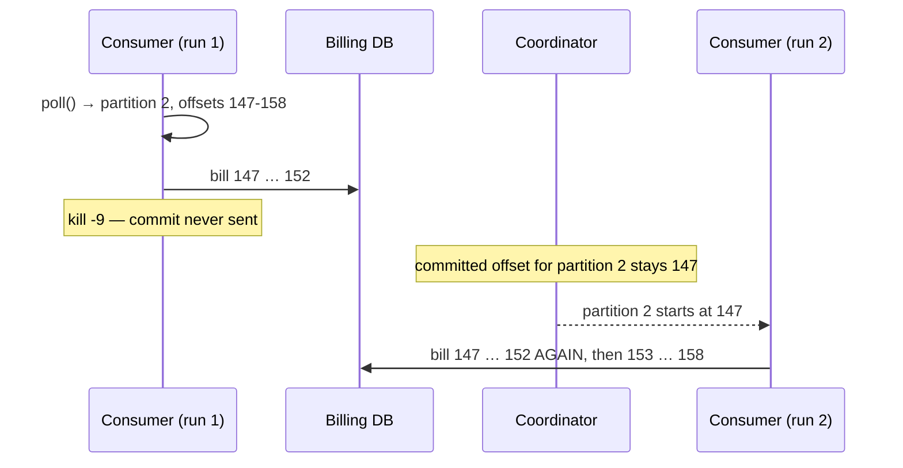

# Lab 03 — Delivery Semantics & Error Handling

| | |
| --- | --- |
| **Level** | Intermediate → Advanced |
| **Duration** | ~80 minutes |
| **Guide sections** | §5.1–§5.2 Positions, commits and strategies · §7 Delivery semantics · §9 Error handling and retry patterns · §10.3 Part C · §11 Troubleshooting |
| **You will need** | Labs 01–02 completed (`cdr-clients` and `cdr-billing-spring` built, groups `$ME.billing` and `$ME.billing-spring` exist), three terminals with `APACHE`, `CFG` and `ME` defined, port 8080 free |

## Why this lab

Labs 01–02 showed the happy path. Billing does not fail on the happy path: it
fails when a consumer dies between processing and committing, when one bad
record arrives, or when a downstream system is down. In this lab you cause
each of those on purpose, find the evidence with the CLI and the logs, and
apply the pattern that fixes it. Less is spelled out than in Labs 01–02:
you will decide when to kill a process and read the results yourself.

## Learning objectives

By the end of this lab you will be able to:

1. **Prove** at-least-once delivery: crash a consumer mid-batch and identify
   exactly which offsets were processed twice.
2. Break the same consumer into **at-most-once** and identify the offsets that
   were never processed.
3. Diagnose a **poison pill** from lag that is stuck on one partition, and
   unblock it with a **dead-letter topic** (DLT) without losing order on the
   other partitions.
4. Configure **blocking retries plus a DLT** in Spring Boot, and tell a
   transient error (retry) from bad data (DLT at once) in the logs and the
   DLT headers.
5. Run an **exactly-once** Kafka → Kafka step with transactions and show what
   `read_committed` hides.

---

## Part 1 — Prove at-least-once (15 min)

The consumer you used in Lab 02 commits **after** processing (`--commit=after`,
the default) — at-least-once by design (guide §7.3). To make a crash land in
the middle of a batch, slow it down with `--process-ms=200` (a simulated
200 ms billing-DB write per record).

### 1.1 Start from zero lag

Lab 02 Part 5 produced 101 CDRs that `$ME.billing` has not read yet. Catch up
first, so the experiment only sees the records you produce in it. Run the
consumer, wait until it goes quiet, then `Ctrl+C`:

```bash
# (VM) - terminal 1, from labs/module-04/cdr-clients
java -jar target/cdr-clients.jar consume $ME.cdr.voice $ME.billing
```

### 1.2 Crash mid-batch

Start the slow consumer and save its log. `session.timeout.ms=10000` shortens
the crash-detection wait you measured in Lab 02 Part 2.3 from 45 s to 10 s:

```bash
# (VM) - terminal 1
java -jar target/cdr-clients.jar consume $ME.cdr.voice $ME.billing \
  --process-ms=200 session.timeout.ms=10000 2>&1 | tee /tmp/run1.log
```

When it shows `Assigned [...]`, produce 50 CDRs from **terminal 2**, wait
**about 5 seconds**, and kill the consumer by its PID (from the `Started pid=`
line):

> **Warning:** `kill -9` simulates a crash on purpose: no final commit, no
> LeaveGroup.

```bash
# (VM) - terminal 2, from labs/module-04/cdr-clients
java -jar target/cdr-clients.jar produce $ME.cdr.voice 50 2>&1 | grep "per partition"
sleep 5
kill -9 23571              # the pid from terminal 1
```

### 1.3 Read the evidence

Summarise which offsets the dead consumer **processed**, per partition (it
logged a `p=… off=…` line after each record):

```bash
# (VM) - terminal 2
grep -oE "p=[0-9]+ off=[0-9]+" /tmp/run1.log \
  | awk -F'[= ]' '{r[$2]=r[$2]" "$4} END {for (p in r) print "p=" p ":" r[p]}' | sort
kafka-consumer-groups.sh --bootstrap-server $APACHE --command-config $CFG \
  --describe --group $ME.billing
```

**Expected** (which partitions were finished depends on your timing):

```
p=0: 83 84 85 86 87 88 89
p=1: 56 57 58 59 60
p=2: 147 148 149 150 151 152
p=3: 85 86 87 88 89 90 91

GROUP           TOPIC           PARTITION  CURRENT-OFFSET  LOG-END-OFFSET  LAG             CONSUMER-ID                                             HOST            CLIENT-ID
l07.billing     l07.cdr.voice   0          90              90              0               cdr-consumer-23571-…                                    /172.24.0.9     cdr-consumer-23571
l07.billing     l07.cdr.voice   1          61              61              0               cdr-consumer-23571-…                                    /172.24.0.9     cdr-consumer-23571
l07.billing     l07.cdr.voice   2          147             159             12              cdr-consumer-23571-…                                    /172.24.0.9     cdr-consumer-23571
l07.billing     l07.cdr.voice   3          92              92              0               cdr-consumer-23571-…                                    /172.24.0.9     cdr-consumer-23571
l07.billing     l07.cdr.voice   4          112             122             10              cdr-consumer-23571-…                                    /172.24.0.9     cdr-consumer-23571
l07.billing     l07.cdr.voice   5          87              96              9               cdr-consumer-23571-…                                    /172.24.0.9     cdr-consumer-23571
```

Line them up for partition 2: the consumer **billed 147–152**, but the
committed offset is still **147**. It died after processing and before the
commit (guide §5.1). Partitions 0, 1 and 3 were finished **and** committed —
`poll()` returned them as separate batches, each committed on its own.

Restart the consumer (normal speed) and save a second log:

```bash
# (VM) - terminal 1
java -jar target/cdr-clients.jar consume $ME.cdr.voice $ME.billing \
  session.timeout.ms=10000 2>&1 | tee /tmp/run2.log
```

After about 10 s (the dead member's session expiring) it is assigned all six
partitions. `Ctrl+C` it once it goes quiet, and summarise `/tmp/run2.log`
with the same `grep | awk` command:

```
p=2: 147 148 149 150 151 152 153 154 155 156 157 158
p=4: 112 113 114 115 116 117 118 119 120 121
p=5: 87 88 89 90 91 92 93 94 95
```

**Offsets 147–152 on partition 2 appear in both logs.** Those six CDRs were
billed twice. Nothing was lost: every offset from both runs together covers
the 50 records exactly.



> **What this shows:** at-least-once **means** duplicates after a crash. The
> fix is not a Kafka setting; it is an idempotent consumer — a billing write
> keyed by `cdrId` that ignores a second insert (guide §7.5).

---

## Part 2 — Break it: at-most-once (10 min)

Repeat Part 1.2 exactly, but commit **before** processing:

```bash
# (VM) - terminal 1
java -jar target/cdr-clients.jar consume $ME.cdr.voice $ME.billing \
  --commit=before --process-ms=200 session.timeout.ms=10000 2>&1 | tee /tmp/run3.log
```

```bash
# (VM) - terminal 2
java -jar target/cdr-clients.jar produce $ME.cdr.voice 50 2>&1 | grep "per partition"
sleep 5
kill -9 24073              # the pid from terminal 1
```

Wait 10 s for the session to expire, then summarise `/tmp/run3.log` and
describe the group:

**Expected:**

```
p=0: 90 91 92 93 94 95 96
p=1: 61 62 63 64 65
p=3: 92 93 94 95 96 97 98
p=4: 122 123 124 125 126 127

Consumer group 'l07.billing' has no active members.

GROUP           TOPIC           PARTITION  CURRENT-OFFSET  LOG-END-OFFSET  LAG             CONSUMER-ID     HOST            CLIENT-ID
l07.billing     l07.cdr.voice   0          97              97              0               -               -               -
l07.billing     l07.cdr.voice   1          66              66              0               -               -               -
l07.billing     l07.cdr.voice   2          159             171             12              -               -               -
l07.billing     l07.cdr.voice   3          99              99              0               -               -               -
l07.billing     l07.cdr.voice   4          132             132             0               -               -               -
l07.billing     l07.cdr.voice   5          105             105             0               -               -               -
```

Now the gaps are the other way round:

| Partition | Billed | Committed | Result |
| --------- | ------ | --------- | ------ |
| 4 | 122–127 | **132** | 128–131 **never billed**: 4 CDRs lost |
| 5 | none | **105** | 96–104 **never billed**: 9 CDRs lost |
| 2 | none | 159 (not yet polled) | Still safe: lag 12, billed on the next run |

Lag shows **0** on partitions 4 and 5. Monitoring sees a healthy consumer, and
13 calls were never charged. That is why at-most-once is reserved for data
you can afford to lose (guide §7.2), and why "lag is zero" alone does not
prove that billing is complete.

Run the consumer once more at normal speed (no `--commit=before`) until it is
quiet, then `Ctrl+C`, so `$ME.billing` is clean for Part 3.

> **Note:** auto-commit (`--commit=auto`, `enable.auto.commit=true`) commits
> the **polled** positions in the background. For a consumer that processes
> synchronously inside the loop it behaves like at-least-once; the moment
> processing moves to other threads it becomes at-most-once (guide §5.2).

---

## Part 3 — A poison pill and a dead-letter topic (20 min)

### 3.1 One bad record

`--json` makes the consumer parse every value as a CDR. This version has the
naive error handling many first drafts have: if a record cannot be
processed, it retries the **same record, forever**. Start it:

```bash
# (VM) - terminal 1
java -jar target/cdr-clients.jar consume $ME.cdr.voice $ME.billing --json
```

From **terminal 2**, write one malformed CDR for subscriber `966500000007`,
then 40 good ones:

```bash
# (VM) - terminal 2
echo '966500000007:{"msisdn":"966500000007",durationSec:abc' | \
  kafka-console-producer.sh --bootstrap-server $APACHE --command-config $CFG \
  --topic $ME.cdr.voice --reader-property parse.key=true --reader-property key.separator=:
java -jar target/cdr-clients.jar produce $ME.cdr.voice 40 2>&1 | grep "per partition"
```

Terminal 1 starts repeating:

```
02:55:31.682 ERROR CdrConsumer - Cannot process p=5 off=105 (StreamReadException: Unexpected character ('d' (code 100)): was expecting double-quote to start property name) - retrying in 1 s
02:55:32.690 ERROR CdrConsumer - Cannot process p=5 off=105 (StreamReadException: Unexpected character ('d' (code 100)): was expecting double-quote to start property name) - retrying in 1 s
02:55:33.707 ERROR CdrConsumer - Cannot process p=5 off=105 (StreamReadException: Unexpected character ('d' (code 100)): was expecting double-quote to start property name) - retrying in 1 s
```

### 3.2 Diagnose it the way you would in production

Pretend you only have the CLI — the alert says "billing lag". Look at the group:

```bash
# (VM) - terminal 2
kafka-consumer-groups.sh --bootstrap-server $APACHE --command-config $CFG \
  --describe --group $ME.billing
```

**Expected** (columns trimmed):

```
PARTITION CURRENT-OFFSET LOG-END-OFFSET LAG
0 103 103 0
1 70 70 0
2 181 181 0
3 105 105 0
4 140 140 0
5 105 112 7
```

Lag on **one** partition only, and its `CURRENT-OFFSET` does not move however
long you wait. That is the signature of a poison pill (guide §11) — a slow
consumer would show lag everywhere. The stuck offset tells you which record
to look at. Read exactly that one record:

```bash
# (VM) - terminal 2
kafka-console-consumer.sh --bootstrap-server $APACHE --command-config $CFG \
  --topic $ME.cdr.voice --partition 5 --offset 105 --max-messages 1 \
  --formatter-property print.key=true
```

```
966500000007	{"msisdn":"966500000007",durationSec:abc
Processed a total of 1 messages
```

Every record **behind** offset 105 on partition 5 — including good CDRs for
other subscribers — waits for a record that will never succeed. The other five
partitions keep flowing because the consumer only rewinds the failed
partition.

### 3.3 Unblock it with a dead-letter topic

Stop the consumer (`Ctrl+C`). Create the DLT the way guide §9.4 prescribes —
**at least as many partitions** as the source (the record keeps its partition
number) and **longer retention** (14 days) so operations has time to act:

```bash
# (VM) - terminal 2
kafka-topics.sh --bootstrap-server $APACHE --command-config $CFG --create \
  --topic $ME.cdr.voice.dlt --partitions 6 --replication-factor 3 \
  --config retention.ms=1209600000
```

Restart the consumer with `--dlt`: a record that cannot be parsed is written
to the DLT with headers describing where it came from and why, and the
consumer moves on:

```bash
# (VM) - terminal 1
java -jar target/cdr-clients.jar consume $ME.cdr.voice $ME.billing --dlt=$ME.cdr.voice.dlt
```

**Expected:**

```
02:55:52.344 INFO CdrConsumer - Started pid=25711 client.id=cdr-consumer-25711 group=l07.billing group.protocol=classic commit=after process-ms=0 json=on dlt=l07.cdr.voice.dlt
02:55:56.062 WARN CdrConsumer - Poison pill p=5 off=105 -> l07.cdr.voice.dlt (StreamReadException: Unexpected character ('d' (code 100)): was expecting double-quote to start property name)
02:55:56.064 INFO CdrConsumer - p=5 off=106 key=966500000000 value={"cdrId":"792ae5c1","msisdn":"966500000000","type":"voice","durationSec":30}
02:55:56.064 INFO CdrConsumer - p=5 off=107 key=966500000006 value={"cdrId":"936da5bb","msisdn":"966500000006","type":"voice","durationSec":36}
…
02:55:56.064 INFO CdrConsumer - p=5 off=111 key=966500000007 value={"cdrId":"93134ebe","msisdn":"966500000007","type":"voice","durationSec":57}
```

Partition 5 drains; `--describe --group $ME.billing` shows lag 0 everywhere.
Inspect the DLT as the operations team would. Remember the shared-cluster
rule: a `--group` under your prefix.

```bash
# (VM) - terminal 2
kafka-console-consumer.sh --bootstrap-server $APACHE --command-config $CFG \
  --topic $ME.cdr.voice.dlt --group $ME.dlt-inspect --from-beginning --timeout-ms 5000 \
  --formatter-property print.headers=true --formatter-property print.key=true \
  --formatter-property print.partition=true --formatter-property print.offset=true
```

**Expected:**

```
Partition:5	Offset:0	dlt.original.topic:l07.cdr.voice,dlt.original.partition:5,dlt.original.offset:105,dlt.exception:StreamReadException: Unexpected character ('d' (code 100)): was expecting double-quote to start property name	966500000007	{"msisdn":"966500000007",durationSec:abc
```

Open `process()` in
[`CdrConsumer.java`](cdr-clients/src/main/java/com/examples/kafka/CdrConsumer.java):
the DLT record is sent with `.get()` — **synchronously** — before the consumer
commits past the poison pill. If the DLT write failed, the consumer would
retry instead of committing, so the bad record can never vanish between the
two topics.

> **Administrator checklist for DLTs** (guide §9.4): the DLT has an owner,
> enough partitions, longer retention than the source, an **alert on any
> growth** (Module 8), and a written replay procedure. A DLT nobody watches
> is just a slower way to lose data.

---

## Part 4 — Retries and a DLT in Spring Boot (15 min)

The Spring app has the same two failure types built in
([`BillingListener.java`](cdr-billing-spring/src/main/java/com/examples/kafka/billing/BillingListener.java)):

| Input | Exception | Type | Handling in [`ErrorHandlingConfig.java`](cdr-billing-spring/src/main/java/com/examples/kafka/billing/ErrorHandlingConfig.java) |
| ----- | --------- | ---- | ------------------------------ |
| A value that is not a JSON CDR | `IllegalArgumentException` | Bad data — will never succeed | `addNotRetryableExceptions(...)`: straight to the DLT |
| A CDR for MSISDN `966500000099` | `BillingUnavailableException` ("Billing DB timeout (simulated)") | Transient — might succeed later | `FixedBackOff(1000L, 3L)`: 3 retries 1 s apart, then the DLT |

```java
DefaultErrorHandler handler = new DefaultErrorHandler(toDlt, new FixedBackOff(1000L, 3L));
handler.addNotRetryableExceptions(IllegalArgumentException.class);    // bad data: DLT at once
```

Start the app in **terminal 3**:

```bash
# (VM) - terminal 3, from labs/module-04/cdr-billing-spring
java -jar target/cdr-billing-spring-1.0.0.jar --lab.prefix=$ME
```

The group `$ME.billing-spring` last committed in Lab 02, so the app first
catches up on everything produced since (a burst of `Billed …` lines) —
including the Part 3 poison pill:

```
… WARN  … [  billing-2-C-1] c.e.kafka.billing.ErrorHandlingConfig    : Attempt 1 failed for p=5 off=105: Not a JSON CDR: {"msisdn":"966500000007",durationSec:abc
… ERROR … [  billing-2-C-1] c.e.kafka.billing.ErrorHandlingConfig    : Gave up on p=5 off=105 key=966500000007: sent to l07.cdr.voice.dlt
```

**Every** consumer group meets the same bad record, and each one needs its
own handling.

Now send one of each failure type from **terminal 2**:

```bash
# (VM) - terminal 2
curl -s -H "Content-Type: text/plain" -d 'call-start;966500000004;no-json' \
  "localhost:8080/api/cdr/raw?key=966500000004"; echo
curl -s -H "Content-Type: application/json" \
  -d '{"msisdn":"966500000099","durationSec":61}' localhost:8080/api/cdr; echo
```

```
{"topic":"l07.cdr.voice","partition":1,"offset":71,"key":"966500000004","value":"call-start;966500000004;no-json"}
{"topic":"l07.cdr.voice","partition":4,"offset":141,"key":"966500000099","value":"{\"cdrId\":\"0c41a7f2\",\"msisdn\":\"966500000099\",\"type\":\"voice\",\"durationSec\":61}"}
```

**Expected** in the app log (terminal 3):

```
… [  billing-0-C-1] c.e.kafka.billing.ErrorHandlingConfig    : Attempt 1 failed for p=1 off=71: Not a JSON CDR: call-start;966500000004;no-json
… ERROR … [  billing-0-C-1] c.e.kafka.billing.ErrorHandlingConfig    : Gave up on p=1 off=71 key=966500000004: sent to l07.cdr.voice.dlt
… [  billing-2-C-1] c.e.kafka.billing.ErrorHandlingConfig    : Attempt 1 failed for p=4 off=141: Billing DB timeout for 966500000099 (simulated)
… [  billing-2-C-1] c.e.kafka.billing.ErrorHandlingConfig    : Attempt 2 failed for p=4 off=141: Billing DB timeout for 966500000099 (simulated)
… [  billing-2-C-1] c.e.kafka.billing.ErrorHandlingConfig    : Attempt 3 failed for p=4 off=141: Billing DB timeout for 966500000099 (simulated)
… [  billing-2-C-1] c.e.kafka.billing.ErrorHandlingConfig    : Attempt 4 failed for p=4 off=141: Billing DB timeout for 966500000099 (simulated)
… ERROR … [  billing-2-C-1] c.e.kafka.billing.ErrorHandlingConfig    : Gave up on p=4 off=141 key=966500000099: sent to l07.cdr.voice.dlt
```

- The bad record failed **once** and went to the DLT at once — retrying bad
  data only wastes time.
- The transient failure was tried **4 times** (1 + 3 retries) over about 3 s
  and then dead-lettered. During those 3 s **partition 4 was blocked**: the
  retries are blocking, which keeps per-key order (guide §9.5).

Read the new DLT records. `--group $ME.dlt-inspect` continues where Part 3
left off, so you see only the Spring records:

```bash
# (VM) - terminal 2
kafka-console-consumer.sh --bootstrap-server $APACHE --command-config $CFG \
  --topic $ME.cdr.voice.dlt --group $ME.dlt-inspect --timeout-ms 5000 \
  --formatter-property print.headers=true --formatter-property print.partition=true \
  --formatter-property print.offset=true
```

**Expected** (one line per record; the `Listener method '…'` signature is
elided here; the last record is the Part 3 poison pill as seen by the Spring
group, next to the copy from Part 3 at offset 0 of partition 5):

```
Partition:1	Offset:0	kafka_dlt-exception-fqcn:org.springframework.kafka.listener.ListenerExecutionFailedException,kafka_dlt-exception-cause-fqcn:java.lang.IllegalArgumentException,kafka_dlt-exception-message:Listener method '…' threw exception; Not a JSON CDR: call-start;966500000004;no-json,kafka_dlt-original-topic:l07.cdr.voice,kafka_dlt-original-consumer-group:l07.billing-spring,dlt.original.offset:71	call-start;966500000004;no-json
Partition:4	Offset:0	kafka_dlt-exception-fqcn:org.springframework.kafka.listener.ListenerExecutionFailedException,kafka_dlt-exception-cause-fqcn:com.examples.kafka.billing.BillingListener$BillingUnavailableException,kafka_dlt-exception-message:Listener method '…' threw exception; Billing DB timeout for 966500000099 (simulated),kafka_dlt-original-topic:l07.cdr.voice,kafka_dlt-original-consumer-group:l07.billing-spring,dlt.original.offset:141	{"cdrId":"0c41a7f2","msisdn":"966500000099","type":"voice","durationSec":61}
Partition:5	Offset:1	kafka_dlt-exception-fqcn:org.springframework.kafka.listener.ListenerExecutionFailedException,kafka_dlt-exception-cause-fqcn:java.lang.IllegalArgumentException,kafka_dlt-exception-message:Listener method '…' threw exception; Not a JSON CDR: {"msisdn":"966500000007",durationSec:abc,kafka_dlt-original-topic:l07.cdr.voice,kafka_dlt-original-consumer-group:l07.billing-spring,dlt.original.offset:105	{"msisdn":"966500000007",durationSec:abc
Processed a total of 3 messages
```

| Header | Tells operations | Why it matters |
| ------ | ---------------- | -------------- |
| `kafka_dlt-exception-cause-fqcn` | Bad data (`IllegalArgumentException`) or outage (`BillingUnavailableException`) | Bad data needs a fix upstream; outage records can simply be **replayed** once the DB is back |
| `kafka_dlt-original-consumer-group` | Which service gave up | Two groups dead-lettered the same poison pill (Part 3 and here) |
| `dlt.original.offset` | Where it came from | Lets you find the record and its neighbours in the source topic |

> **Note:** Spring's own `kafka_dlt-original-partition`/`-offset` headers are
> binary numbers that print as garbage in the console, so
> `ErrorHandlingConfig` excludes them (and the multi-kilobyte stack trace) and
> adds `dlt.original.offset` as text. Readable DLTs are an operational
> requirement; ask for them in reviews.

Stop the app (`Ctrl+C`).

---

## Part 5 — Exactly-once Kafka → Kafka (15 min, advanced)

Transactions let a "read → process → write" step commit its **output records
and its input offsets atomically** (guide §7.4). The `rate` command reads CDRs,
writes rated CDRs (with a charge) to `$ME.cdr.rated`, and commits the input
offsets inside the same transaction, with `transactional.id=$ME.rating-tx`.
`--abort-every=2` aborts every second transaction and rewinds the input, the
way a crash or a failed write would.

> **Note:** transactional IDs need an ACL too. The shared cluster grants your
> user `lNN.*` transactional IDs, which is why the ID is built from the group
> name `$ME.rating`. Any other ID fails with
> `TransactionalIdAuthorizationException`.

```bash
# (VM) - terminal 2
kafka-topics.sh --bootstrap-server $APACHE --command-config $CFG --create \
  --topic $ME.cdr.rated --partitions 6 --replication-factor 3
```

```bash
# (VM) - terminal 1
java -jar target/cdr-clients.jar rate $ME.cdr.voice $ME.cdr.rated $ME.rating --abort-every=2
```

The rater starts at the **end** of `$ME.cdr.voice`. Once it logs
`Rating … abort every 2 transactions`, produce exactly 50 CDRs:

```bash
# (VM) - terminal 2
java -jar target/cdr-clients.jar produce $ME.cdr.voice 50 2>&1 | grep Sent
```

**Expected** in terminal 1 (batch sizes vary):

```
02:59:31.199 INFO TransactionalRater - Rating l07.cdr.voice -> l07.cdr.rated with transactional.id=l07.rating-tx, abort every 2 transactions
02:59:43.442 INFO TransactionalRater - Transaction 1 committed (7 rated CDRs + input offsets)
02:59:43.685 WARN TransactionalRater - Transaction 2 ABORTED  (10 rated CDRs discarded, input rewound)
02:59:43.923 INFO TransactionalRater - Transaction 3 committed (10 rated CDRs + input offsets)
02:59:44.070 WARN TransactionalRater - Transaction 4 ABORTED  (10 rated CDRs discarded, input rewound)
02:59:44.324 INFO TransactionalRater - Transaction 5 committed (10 rated CDRs + input offsets)
…
02:59:46.229 INFO TransactionalRater - Transaction 13 committed (7 rated CDRs + input offsets)
```

Now count `$ME.cdr.rated` with both isolation levels:

```bash
# (VM) - terminal 2
for L in read_uncommitted read_committed; do
  echo "== $L"
  kafka-console-consumer.sh --bootstrap-server $APACHE --command-config $CFG \
    --topic $ME.cdr.rated --group $ME.rated-check-$L --from-beginning \
    --isolation-level $L --timeout-ms 8000 2>&1 | grep -E "Processed|charge" | tail -2
done
```

**Expected:**

```
== read_uncommitted
{"cdrId":"2ec31097","msisdn":"966500000009","durationSec":79,"charge":0.5}
Processed a total of 93 messages
== read_committed
{"cdrId":"2ec31097","msisdn":"966500000009","durationSec":79,"charge":0.5}
Processed a total of 50 messages
```

| Isolation level | Count | Why |
| --------------- | ----- | --- |
| `read_uncommitted` (the consumer default) | ~90 | Committed records **plus** the records of aborted transactions that reached the broker |
| `read_committed` | **50** | Exactly one rated CDR per input CDR: aborted records are skipped |

The `read_uncommitted` count varies from run to run (93 here): records an
aborted transaction had not yet sent are dropped in the producer and never
reach the broker. The `read_committed` count is always 50.

Check the transaction state the way you would for "lag never drains with
`read_committed`" (guide §11):

```bash
# (VM) - terminal 2
kafka-transactions.sh --bootstrap-server $APACHE --command-config $CFG list
```

```
TransactionalId	Coordinator	ProducerId	TransactionState	
l07.rating-tx  	13         	1001      	CompleteCommit 
```

`CompleteCommit` is healthy. A transaction stuck in `Ongoing` holds back the
last stable offset, and every `read_committed` consumer behind it stops —
`kafka-transactions.sh describe` and `abort` are the tools for that incident.
Stop the rater with `Ctrl+C`.

> **What this shows:** exactly-once covers **Kafka topics and Kafka offsets**
> only. If the rater also wrote to the billing DB, that write would be outside
> the transaction, and the DB would need the idempotent design from Part 1
> (guide §7.4–§7.5).

---

## Checkpoint questions

<details>
<summary>1. After the crash in Part 1, offsets 147–152 on partition 2 were billed twice. Exactly why those six, and what makes such duplicates harmless?</summary>

The consumer processed 147–152 from a batch it had polled, then died before
the commit at the end of that batch, so the group's committed offset for
partition 2 stayed at 147. The next owner started at 147 and processed them
again. A billing write that is idempotent — for example an insert keyed by
`cdrId` that ignores duplicates — makes the replay harmless (guide §7.5).
</details>

<details>
<summary>2. In Part 2, monitoring showed lag 0 on partitions 4 and 5, yet 13 CDRs were never billed. How would you detect that kind of loss?</summary>

Lag only compares committed offsets with the log end; it cannot see records
that were committed but never processed. Detecting it needs an end-to-end
check outside the consumer group: reconcile counts or IDs between the source
topic and the billing system for a time window, or alert on gaps in
per-source sequence numbers. The real fix is not to commit before processing.
</details>

<details>
<summary>3. Lag is stuck on one partition and its current offset does not move. Lag on the other partitions is zero. What do you check, and what do you do next?</summary>

That pattern points to one record the consumer cannot get past — a poison
pill (or one extremely slow or hot record). Read the record at the stuck
offset with `kafka-console-consumer.sh --partition N --offset M
--max-messages 1`, check the application log for the error, and either
deploy DLT handling or, as an emergency, skip it with
`--reset-offsets --shift-by 1` on that `topic:partition` after stopping the
group — recording the skipped record first.
</details>

<details>
<summary>4. Why does the Spring app retry the billing-DB timeout but not the malformed CDR? What would happen if both were retried forever?</summary>

A timeout can succeed on a later attempt; malformed data never will, so
retrying it only blocks the partition. With unlimited retries for both, a
single bad record would block its partition forever (Part 3.1), and a long DB
outage would block every partition. For outages the better pattern is often
to pause the consumer and resume when the dependency is back (guide §9.4).
</details>

<details>
<summary>5. A team says "we enabled transactions, so our billing is exactly-once". What questions do you ask?</summary>

Where the side effect happens: transactions make Kafka → Kafka processing
exactly-once, but a write to a database or a call to a charging API is outside
the transaction. Do downstream consumers read with
`isolation.level=read_committed`, or do they see aborted records? And is the
`transactional.id` stable per instance (for zombie fencing) and covered by an
ACL? Without those, "exactly-once" is at-least-once with extra latency.
</details>

<details>
<summary>6. Your DLT keeps the source partition number. What breaks if someone creates it with 3 partitions while the source has 6?</summary>

A failed record from partition 4 or 5 is sent to a DLT partition that does
not exist. The DLT write fails, so the record cannot be recovered and the
listener either keeps retrying (blocking the partition) or the error handler
gives up. Create DLTs with at least as many partitions as their source, or
change the destination resolver to choose a partition another way.
</details>

---

## Clean up

Stop every consumer, rater and app (`Ctrl+C`). Then follow
[Cleaning up after the module](README.md#cleaning-up-after-the-module) in the
README: it deletes your Module 4 topics and groups and keeps `$ME.cdr.voice`
and `$ME.billing`.

> **Next module:** *Module 5 — Cluster Operations, Replication & High
> Availability*, where you move from the clients to the cluster that serves
> them: adding and removing brokers, partition reassignment with
> `kafka-reassign-partitions.sh`, ISR and leader election under broker
> failure, rolling restarts and capacity planning — including what the
> producers and consumers you built here experience while it happens.
