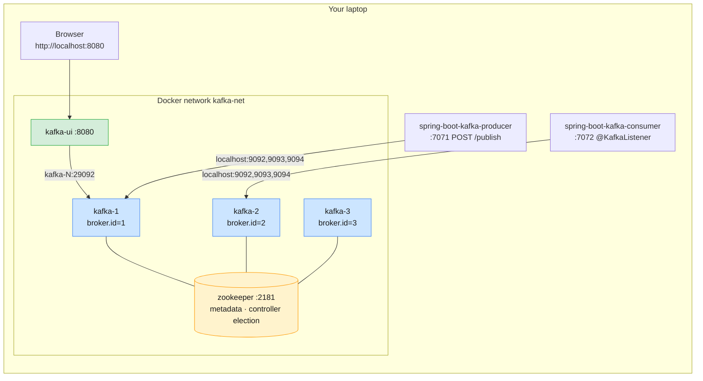

# Lab 04 — A ZooKeeper-Mode Cluster with Spring Boot Producer & Consumer

| | |
| --- | --- |
| **Level** | Intermediate |
| **Duration** | ~75 minutes |
| **Guide sections** | §5 Core components · §6 Architecture · §8 ZooKeeper vs KRaft |
| **You will need** | Docker Desktop, **JDK 17+** (`java -version`), `curl`, two or three terminals, a browser |
| **Files** | [`lab-04/`](lab-04/): `docker-compose.yml`, `spring-boot-kafka-producer/`, `spring-boot-kafka-consumer/` |

## Learning objectives

Labs 01–03 ran Kafka the modern way: **KRaft**, where the brokers keep their
own metadata. Many production clusters still run (or have just migrated off)
the older architecture, where **Apache ZooKeeper** holds the metadata. An
administrator has to be able to read both. By the end of this lab you will be
able to:

1. Start a **3-broker Apache Kafka cluster managed by ZooKeeper** and explain
   why it needs Kafka **3.9** rather than 4.x.
2. Find brokers, topics, partition leaders, ISR and the **controller** inside
   ZooKeeper's znode tree.
3. Monitor the cluster in **Kafka UI** (brokers, topics, messages, consumer
   groups, lag).
4. Run a **Spring Boot producer** (REST → Kafka) and a **Spring Boot consumer**
   (`@KafkaListener`) against the cluster, and see **queue** vs **pub/sub**
   behaviour from consumer groups.
5. Observe **controller failover** through ZooKeeper, and what does and does
   not keep working when **ZooKeeper itself is down**.

### Versions used

| Component | Version | Why |
| --------- | ------- | --- |
| Broker image | `apache/kafka:3.9.2` | Apache Kafka **4.0 removed ZooKeeper mode**. 3.9.x is the last Apache Kafka line that can run with ZooKeeper |
| ZooKeeper | `zookeeper:3.8.5` (official Apache image) | The ZooKeeper line that Kafka 3.9 is built and tested against |
| Kafka UI | `provectuslabs/kafka-ui:v0.7.2` | Web UI for the cluster on **http://localhost:8080** |
| Spring Boot / Spring for Apache Kafka | 4.1.1 / 4.1.1 | Latest GA releases |
| Kafka Java client (`kafka-clients`) | **4.3.1** | Latest Apache Kafka client, pinned in each `pom.xml` |

> **A 4.3 client talking to a 3.9 broker?** Yes. Kafka clients and brokers
> negotiate the protocol version for every request (`ApiVersions`). Clients
> 4.x work with any broker from 2.1 onward. This is exactly how real upgrades
> work: clients and brokers are upgraded independently.

---

## Lab environment



| What | From your laptop | From inside the Docker network |
| ---- | ---------------- | ------------------------------ |
| Brokers | `localhost:9092`, `localhost:9093`, `localhost:9094` | `kafka-1:29092`, `kafka-2:29092`, `kafka-3:29092` (`$BS`) |
| ZooKeeper | `localhost:2181` | `zookeeper:2181` |
| Kafka UI | http://localhost:8080 | — |
| Producer app / consumer app | http://localhost:7071 / :7072 | — |

> **Convention used in this lab**
>
> - `# (host)` — run on your laptop from **`labs/module-01/lab-04`**.
> - `# (kafka-1)` — run inside `docker exec -it kafka-1 bash`. The Kafka CLI
>   tools are on the `PATH` and `$BS` is the internal bootstrap list, as before.

---

## Part 1 — Start the ZooKeeper-mode cluster (10 min)

### 1.1 Stop the KRaft lab broker

The Lab 01–03 container also uses port 9092, so stop it first:

```bash
# (host) - from labs/module-01
docker compose down          # add -v if you no longer need the Lab 01-03 topics
cd lab-04
```

### 1.2 Read the Compose file before you run it

Open [`lab-04/docker-compose.yml`](lab-04/docker-compose.yml) and find:

| Look for | What it tells you |
| -------- | ----------------- |
| `KAFKA_ZOOKEEPER_CONNECT: zookeeper:2181` | Each broker registers in, and reads metadata from, ZooKeeper |
| No `KAFKA_PROCESS_ROLES`, no `CONTROLLER` listener, no `CLUSTER_ID` | These are KRaft settings. Leaving `process.roles` unset is what puts a broker in ZooKeeper mode |
| `KAFKA_BROKER_ID` (not `KAFKA_NODE_ID`) | The ZooKeeper-era name for the broker's ID |
| The broker `command:` block | The `apache/kafka` image is built for KRaft and always tries to *format* storage. That step is KRaft-only, so the command builds `server.properties` and skips it. ZooKeeper-mode brokers need no format step |
| One `zookeeper` service | Fine for a laptop. Production runs an **ensemble of 3 or 5** so a majority survives a failure |

### 1.3 Start it

```bash
# (host) - from labs/module-01/lab-04
docker compose up -d
docker compose ps
```

Wait until every service is `(healthy)` or `Up` (30–60 s, longer on the first
pull):

```
NAME        IMAGE                           STATUS
kafka-1     apache/kafka:3.9.2              Up 24 seconds (healthy)
kafka-2     apache/kafka:3.9.2              Up 24 seconds (healthy)
kafka-3     apache/kafka:3.9.2              Up 24 seconds (healthy)
kafka-ui    provectuslabs/kafka-ui:v0.7.2   Up 1 second
zookeeper   zookeeper:3.8.5                 Up 31 seconds (healthy)
```

Ask ZooKeeper how it is doing with a *four-letter word* command:

```bash
# (host)
docker exec zookeeper bash -c 'echo ruok | nc localhost 2181; echo; echo srvr | nc localhost 2181'
```

```
imok
Zookeeper version: 3.8.5-..., built on 2025-09-03 21:35 UTC
...
Mode: standalone
Node count: 30
```

`Mode: standalone` means a single-node ZooKeeper. In an ensemble you would see
one `leader` and the rest `follower`.

---

## Part 2 — The cluster inside ZooKeeper (15 min)

Open a shell on a broker. Every command in this part uses `zookeeper-shell.sh`,
which ships with Kafka 3.9:

```bash
# (host)
docker exec -it kafka-1 bash
```

```bash
# (kafka-1)
Z="zookeeper-shell.sh zookeeper:2181"
$Z ls /
```

`zookeeper-shell.sh` prints a few connection lines (`Connecting to ...`,
`WATCHER::`, `WatchedEvent ...`) before the answer. The answer is the **last
line**:

```
[admin, brokers, cluster, config, consumers, controller, controller_epoch, feature, isr_change_notification, latest_producer_id_block, log_dir_event_notification, zookeeper]
```

### 2.1 Brokers register themselves

```bash
# (kafka-1)
$Z ls /brokers/ids
$Z get /brokers/ids/1
```

```
[1, 2, 3]
{"features":{},"listener_security_protocol_map":{"PLAINTEXT":"PLAINTEXT","EXTERNAL":"PLAINTEXT"},"endpoints":["PLAINTEXT://kafka-1:29092","EXTERNAL://localhost:9092"],"jmx_port":-1,"port":29092,"host":"kafka-1","version":5,"timestamp":"..."}
```

Each `/brokers/ids/N` is an **ephemeral znode**: it exists only while broker N
keeps its ZooKeeper session alive. If the broker dies, ZooKeeper deletes the
znode and everyone watching `/brokers/ids` is told. That is how a ZooKeeper
cluster detects broker failure. You will see it happen in Part 6.

The `endpoints` are the **advertised listeners**. They are what clients receive
in metadata responses. This is why the producer on your laptop is told to use
`localhost:9092`, while Kafka UI inside Docker uses `kafka-1:29092`.

### 2.2 One broker is the controller

```bash
# (kafka-1)
$Z get /controller
$Z get /controller_epoch
$Z get /cluster/id
```

```
{"version":2,"brokerid":2,"timestamp":"...","kraftControllerEpoch":-1}
1
{"version":"1","id":"0-qO5c0cSx6Xr_0aaXdpZg"}
```

- The **first broker to create the ephemeral `/controller` znode wins** and
  becomes the controller (here broker 2; yours may differ). It assigns
  partition leaders and tells the other brokers about changes.
- `controller_epoch` counts controller elections. It stops a "zombie" old
  controller's commands from being accepted.
- `kraftControllerEpoch: -1` confirms this cluster has **never** been migrated
  to KRaft.
- The cluster ID was generated by the first broker and **stored in ZooKeeper**.
  Compare that with KRaft, where you passed `CLUSTER_ID` to `kafka-storage.sh
  format` on every node.

> **Write down** which broker is the controller. You will stop it in Part 6.

### 2.3 Create the lab topics and find them in ZooKeeper

The consumer app listens on three topics. Auto-creation is disabled, so create
them (3 partitions, 3 replicas):

```bash
# (kafka-1)
for t in test demo test1; do
  kafka-topics.sh --bootstrap-server $BS --create --topic $t --partitions 3 --replication-factor 3
done
kafka-topics.sh --bootstrap-server $BS --describe --topic demo
```

```
Topic: demo  TopicId: cMr3GpVESX2L3byPGf93lQ  PartitionCount: 3  ReplicationFactor: 3  Configs: min.insync.replicas=2
    Topic: demo  Partition: 0  Leader: 2  Replicas: 2,3,1  Isr: 2,3,1
    Topic: demo  Partition: 1  Leader: 3  Replicas: 3,1,2  Isr: 3,1,2
    Topic: demo  Partition: 2  Leader: 1  Replicas: 1,2,3  Isr: 1,2,3
```

Unlike Lab 03, `--replication-factor 3` works because there are three brokers.
Now read the same information **from ZooKeeper**:

```bash
# (kafka-1)
$Z get /brokers/topics/demo
$Z get /brokers/topics/demo/partitions/0/state
$Z ls /config/topics
```

```
{"partitions":{"0":[2,3,1],"1":[3,1,2],"2":[1,2,3]},"topic_id":"cMr3GpVESX2L3byPGf93lQ","adding_replicas":{},"removing_replicas":{},"version":3}
{"controller_epoch":1,"leader":2,"version":1,"leader_epoch":0,"isr":[2,3,1]}
[demo, test, test1]
```

| znode | Holds | Who writes it |
| ----- | ----- | ------------- |
| `/brokers/topics/<t>` | Replica assignment per partition | Controller (on create / reassignment) |
| `/brokers/topics/<t>/partitions/<p>/state` | Leader, ISR, leader epoch | Controller, and the partition leader when ISR changes |
| `/config/topics/<t>` | Per-topic config overrides (`retention.ms`, ...) | `kafka-configs.sh`, via a broker |

> **Older tutorials** use `kafka-topics.sh --zookeeper localhost:2181`. That
> option was removed in Kafka 3.0. Admin tools always talk to **brokers**
> (`--bootstrap-server`), even in ZooKeeper mode. Only the brokers talk to
> ZooKeeper.

Leave this shell open.

---

## Part 3 — Tour the cluster in Kafka UI (5 min)

Open **http://localhost:8080**. The cluster appears as **lab-04-local**.

| Page | Check |
| ---- | ----- |
| **Dashboard** | Status *online*, 3 brokers, version `3.9-IV0` |
| **Brokers** | Three brokers, which one is the **controller**, partition and leader counts per broker |
| **Topics** → `demo` | 3 partitions, replication factor 3, in-sync replicas 9/9. Open **Settings** to see the topic config |
| **Consumers** | Empty for now. It fills up in Part 4 |

Kafka UI is a **client** like any other. It uses the bootstrap servers from the
Compose file and the Kafka Admin API, and never talks to ZooKeeper.

---

## Part 4 — Run the Spring Boot consumer and producer (15 min)

### 4.1 Look at the code first

| File | What to notice |
| ---- | -------------- |
| `spring-boot-kafka-producer/src/main/resources/application.properties` | `spring.kafka.bootstrap-servers=localhost:9092,localhost:9093,localhost:9094`, which are the published ports of the three brokers. Port 7071 |
| `spring-boot-kafka-producer/.../KafkaProducerConfig.java` | Two `KafkaTemplate`s: one for `String`, one for `Greeting`. Both use **`JacksonJsonSerializer`** for the value |
| `spring-boot-kafka-producer/.../SpringBootKafkaProducerApplication.java` | `POST /publish?topic=` and `POST /publishObj?topic=`. Each message gets a **random key**, so messages spread across partitions |
| `spring-boot-kafka-consumer/.../SpringBootKafkaConsumerApplication.java` | Six `@KafkaListener`s: one on `test`, **three in the same group** on `demo`, and **two different groups** on `test1` |
| `spring-boot-kafka-consumer/.../KafkaConsumerConfig.java` | A container factory with `JacksonJsonDeserializer<Greeting>`, used by the `test1` listeners |
| Both `pom.xml` | `<kafka.version>4.3.1</kafka.version>` overrides the client version that Spring Boot would otherwise pick |

### 4.2 Start the consumer

Open a **new terminal**:

```bash
# (host) - from labs/module-01/lab-04
cd spring-boot-kafka-consumer
./mvnw spring-boot:run          # Windows: mvnw.cmd spring-boot:run
```

The first run downloads Maven and the dependencies (2–3 minutes). Then look for:

```
Kafka version: 4.3.1
Started SpringBootKafkaConsumerApplication in 5.4 seconds
demo-group: partitions assigned: [demo-1]
demo-group: partitions assigned: [demo-0]
demo-group: partitions assigned: [demo-2]
test-group: partitions assigned: [test-0, test-1, test-2]
test-group1: partitions assigned: [test1-0, test1-1, test1-2]
test-group2: partitions assigned: [test1-0, test1-1, test1-2]
```

You may first see a few `RebalanceInProgressException ... rejoin is needed`
lines. That is normal: three listeners in `demo-group` are joining at the same
moment.

Read the assignment carefully:

- **`demo-group`** has three consumers and three partitions, so **each gets
  one**. This is the *queue* model: the group shares the work.
- **`test-group1` and `test-group2`** each get **all** partitions of `test1`.
  This is the *pub/sub* model: every group gets every message.

### 4.3 Start the producer

Open a **third terminal**:

```bash
# (host) - from labs/module-01/lab-04
cd spring-boot-kafka-producer
./mvnw spring-boot:run
```

Wait for `Started SpringBootKafkaProducerApplication`.

### 4.4 Send messages

Use your original terminal (exit the `kafka-1` shell, or open another):

```bash
# (host)
curl -X POST "localhost:7071/publish?topic=test" \
     -H 'Content-Type: text/plain' -d 'Hello from Mobily'

for i in 1 2 3 4 5 6; do
  curl -s -X POST "localhost:7071/publish?topic=demo" \
       -H 'Content-Type: text/plain' -d "CDR $i"; echo
done

curl -X POST "localhost:7071/publishObj?topic=test1" \
     -H 'Content-Type: application/json' \
     -d '{"id":1,"message":"Welcome to Mobily 5G"}'
```

> **Windows PowerShell:** use `curl.exe` instead of `curl`, and double quotes
> around the JSON with the inner quotes escaped: `-d "{\"id\":1,\"message\":\"Hi\"}"`.

Each call answers `Message published successfully`. In the **consumer**
terminal you should see something like:

```
#1 Consume message as String - Received message - "Hello from Mobily"
#2 Consume message as String - Received message - "CDR 3"
#3 Consume message as String - Received message - "CDR 1"
#2 Consume message as String - Received message - "CDR 4"
#3 Consume message as String - Received message - "CDR 2"
...
Consume message as Object - Received message - ID: 1, Message: Welcome to Mobily 5G
Consume message as Consumer Record - Received message - ID: 1, Message: Welcome to Mobily 5G
Consumer Record Details - Topic: test1, Partition: 0, Offset: 0, Key: -454870155, Value: [ID: 1, Message: Welcome to Mobily 5G]
```

What to notice:

1. The six `demo` messages were **split** between the `#1`, `#2`, `#3`
   listeners, depending on which partition each random key hashed to. No
   message was processed twice.
2. The one `test1` message was received **twice**, once by each group.
3. The string messages arrive **with quotes** (`"CDR 3"`). The producer's
   `String` template also uses the JSON serializer, so `CDR 3` is written as the
   JSON string `"CDR 3"`. The serializer is part of the contract between
   producer and consumer. Module 10 formalises this with Schema Registry.
4. The `Key` is the random number the producer chose. Same key → same partition.

---

## Part 5 — Consumer groups from the CLI and the UI (10 min)

```bash
# (kafka-1)
kafka-consumer-groups.sh --bootstrap-server $BS --list
kafka-consumer-groups.sh --bootstrap-server $BS --describe --group demo-group
```

```
GROUP       TOPIC  PARTITION  CURRENT-OFFSET  LOG-END-OFFSET  LAG  CONSUMER-ID                         HOST           CLIENT-ID
demo-group  demo   2          0               0               0    consumer-demo-group-6-57c01a0d-...  /192.168.65.1  consumer-demo-group-6
demo-group  demo   1          3               3               0    consumer-demo-group-2-629e79e5-...  /192.168.65.1  consumer-demo-group-2
demo-group  demo   0          3               3               0    consumer-demo-group-1-cdddd2ae-...  /192.168.65.1  consumer-demo-group-1
```

Your offsets will differ. `CURRENT-OFFSET = LOG-END-OFFSET` and `LAG 0` mean the
group has processed everything.

Where are these offsets stored? Try ZooKeeper:

```bash
# (kafka-1)
zookeeper-shell.sh zookeeper:2181 ls /consumers
```

```
[]
```

Empty. Even in a ZooKeeper cluster, modern consumers commit offsets to the
**`__consumer_offsets` topic**, the same as in Lab 02. `/consumers` is a leftover
from the pre-0.9 consumer that stored offsets in ZooKeeper, which did not scale.

Now open **Kafka UI → Consumers**. You should see the four groups, their
members, state `STABLE` and lag per partition. Open **Topics → demo →
Messages** to browse the six records with their keys, partitions and offsets.

**Try it:** stop the consumer app (Ctrl+C), send three more `demo` messages,
and refresh **Consumers** in Kafka UI. `demo-group` is now `EMPTY` with
**lag 3**. Start the consumer again and watch the lag drop to 0 as it catches up
from its committed offsets.

---

## Part 6 — Controller failover through ZooKeeper (10 min)

Keep both apps running. Stop the broker that is currently the controller
(the one you wrote down in 2.2. Replace `2` below with your controller's ID):

```bash
# (host)
docker compose stop kafka-2
```

```bash
# (kafka-1)            - if kafka-1 was the controller, use docker exec -it kafka-3 bash
Z="zookeeper-shell.sh zookeeper:2181"
$Z ls /brokers/ids
$Z get /controller
$Z get /controller_epoch
kafka-topics.sh --bootstrap-server $BS --describe --topic demo
```

```
[1, 3]
{"version":2,"brokerid":1,"timestamp":"...","kraftControllerEpoch":-1}
2
Topic: demo  ...
    Topic: demo  Partition: 0  Leader: 3  Replicas: 2,3,1  Isr: 3,1
    Topic: demo  Partition: 1  Leader: 3  Replicas: 3,1,2  Isr: 3,1
    Topic: demo  Partition: 2  Leader: 1  Replicas: 1,2,3  Isr: 1,3
```

Here is what happened, in order:

1. Broker 2's ZooKeeper session ended, so its **ephemeral** znodes
   `/brokers/ids/2` and `/controller` disappeared.
2. The surviving brokers were watching `/controller`. They raced to recreate
   it, and broker 1 won. `controller_epoch` went from 1 to **2**.
3. The new controller **loaded the full cluster state from ZooKeeper**, picked
   a new leader from the ISR for every partition that broker 2 led (partition 0
   moved to broker 3), and removed 2 from every ISR.

Send more messages while broker 2 is down. They still succeed, because each
partition still has 2 in-sync replicas and `min.insync.replicas=2`:

```bash
# (host)
for i in 7 8 9; do
  curl -s -X POST "localhost:7071/publish?topic=demo" -H 'Content-Type: text/plain' -d "CDR $i"; echo
done
```

The consumer prints `CDR 7`, `CDR 8` and `CDR 9`. The apps never noticed: their
clients got new metadata and moved to the new leaders automatically.

Bring the broker back and check again after ~10 seconds:

```bash
# (host)
docker compose start kafka-2
```

```bash
# (kafka-1)
kafka-topics.sh --bootstrap-server $BS --describe --topic demo
$Z get /controller
```

```
    Topic: demo  Partition: 0  Leader: 3  Replicas: 2,3,1  Isr: 3,1,2
...
{"version":2,"brokerid":1,...}
```

- Broker 2 caught up and is back in **every ISR**.
- It is **not** the controller again. There is no "fail-back"; broker 1 keeps
  the role.
- Partition 0 is still led by broker 3, even though broker 2 is its *preferred*
  leader (first in `Replicas`). The controller moves leadership back after its
  periodic imbalance check (`leader.imbalance.check.interval.seconds`, default
  300 s), or immediately with
  `kafka-leader-election.sh --bootstrap-server $BS --election-type preferred --all-topic-partitions`.

---

## Part 7 — What happens when ZooKeeper is down? (10 min)

ZooKeeper is the cluster's **control plane**. Stop it:

```bash
# (host)
docker compose stop zookeeper
```

**Data plane:** produce through the app:

```bash
# (host)
curl -X POST "localhost:7071/publish?topic=demo" -H 'Content-Type: text/plain' -d 'CDR 10'
```

It succeeds and the consumer prints `CDR 10`. Brokers keep serving reads and
writes for partitions whose leaders and ISR they already know.

**Control plane:** try a metadata change:

```bash
# (kafka-1)
time timeout 40 kafka-topics.sh --bootstrap-server $BS --create \
  --topic zk.down --partitions 1 --replication-factor 3
```

It hangs and is killed after 40 seconds. Topic creation needs the controller
to write to ZooKeeper. The same applies to config changes, ACL changes,
partition reassignment, and to **electing new leaders if a broker fails now**.
A broker failure during a ZooKeeper outage leaves its partitions without a
leader.

Start ZooKeeper again and wait ~15 seconds:

```bash
# (host)
docker compose start zookeeper
```

```bash
# (kafka-1)
zookeeper-shell.sh zookeeper:2181 ls /brokers/ids
kafka-topics.sh --bootstrap-server $BS --list
```

```
[1, 2, 3]
__consumer_offsets
demo
test
test1
zk.down
```

The brokers re-registered, and **`zk.down` exists**. The broker completed the
create request once ZooKeeper returned, even though your command had already
given up. *Timed out* does not mean *did not happen*. Always check before you
retry an admin operation.

---

## Part 8 — ZooKeeper vs KRaft, from what you just saw (5 min)

| | ZooKeeper mode (this lab) | KRaft (Labs 01–03) |
| - | ------------------------- | ------------------ |
| Systems to run, secure, monitor and upgrade | **Two**: a ZooKeeper ensemble + Kafka | **One**: Kafka |
| Where metadata lives | znodes in ZooKeeper | The `__cluster_metadata` log, replicated by the controller quorum |
| Controller | Any **one broker**, elected by racing for `/controller` | A dedicated Raft **quorum** of controllers (or combined nodes) |
| Controller failover | New controller must **reload all state from ZooKeeper**. Slow with many partitions | Standby controllers already have the log, so failover is near-instant |
| How brokers learn about changes | Controller pushes RPCs. Brokers watch znodes | Brokers **fetch** the metadata log like a topic |
| Cluster ID | Generated by the first broker, stored in `/cluster/id` | Chosen by you, written by `kafka-storage.sh format` |
| Scale limit | Practically ~200k partitions per cluster | Millions of partitions |
| Status | Deprecated in 3.5, **removed in 4.0** | The only mode from 4.0 onward |

Clusters still on ZooKeeper must migrate to KRaft (`zookeeper.metadata.migration.enable`,
supported up to 3.9) **before** they can upgrade to Kafka 4.x. That is why
you will meet both architectures at work for years to come.

---

## Checkpoint questions

<details>
<summary>1. Why does this lab use <code>apache/kafka:3.9.2</code> instead of the <code>4.3.1</code> image from Labs 01–03?</summary>

Apache Kafka 4.0 removed ZooKeeper mode completely. A 4.x broker can only run
in KRaft mode. 3.9.x is the last release line that supports ZooKeeper (and the
ZooKeeper → KRaft migration).
</details>

<details>
<summary>2. How did the cluster notice that the controller broker had stopped, and how was the new controller chosen?</summary>

The broker's ZooKeeper session ended, so ZooKeeper deleted its **ephemeral**
znodes `/brokers/ids/2` and `/controller`. The other brokers had **watches** on
`/controller`. They were notified, raced to create it, and the first one
succeeded. `controller_epoch` was incremented so that commands from the old
controller would be rejected.
</details>

<details>
<summary>3. Three listeners in <code>demo-group</code> each got one partition, but both <code>test1</code> groups got all partitions. Why?</summary>

Within one consumer group, each partition is assigned to **exactly one** member,
so the group shares the work (queue). Different groups are independent: each
group tracks its own offsets and gets every message (pub/sub). With 3
partitions, a 4th `demo-group` listener would sit idle.
</details>

<details>
<summary>4. Where are the Spring consumer's committed offsets stored in this ZooKeeper cluster?</summary>

In the `__consumer_offsets` topic on the brokers, the same as in KRaft. The
`/consumers` znode is only used by the old pre-0.9 consumer and was empty.
</details>

<details>
<summary>5. With ZooKeeper stopped, producing still worked but creating a topic hung. Why? What else would be at risk?</summary>

Produce and fetch are handled by the partition leaders with metadata they already
hold (the data plane). Creating a topic needs the controller to write to
ZooKeeper (the control plane). Config/ACL changes and reassignment also stall.
Most importantly, **leader election** stalls too: a broker failure during the outage leaves
its partitions offline. This is why production runs a 3- or 5-node ensemble.
</details>

<details>
<summary>6. The producer app uses a 4.3.1 client and the brokers are 3.9.2. What makes that work, and which direction is not safe?</summary>

Clients and brokers negotiate the highest protocol version both support for
each API (`ApiVersions` request). Newer clients work with brokers from 2.1
onward. The thing to check during upgrades is a **new client feature that
needs a new broker** (for example the KIP-848 consumer protocol needs a 4.x
broker). Older clients continue to work with newer brokers.
</details>

---

## Clean up

Stop both Spring Boot apps with **Ctrl+C** in their terminals, then:

```bash
# (host) - from labs/module-01/lab-04
docker compose down -v
```

To go back to the Lab 01–03 environment: `cd .. && docker compose up -d`.

**Next module:** *Module 2 — Kafka Installation, Setup & CLI Operations* uses
KRaft again, now with three nodes. Compare its Compose file with
`lab-04/docker-compose.yml`. The `CONTROLLER` listener and
`KAFKA_CONTROLLER_QUORUM_VOTERS` replace `KAFKA_ZOOKEEPER_CONNECT`.
