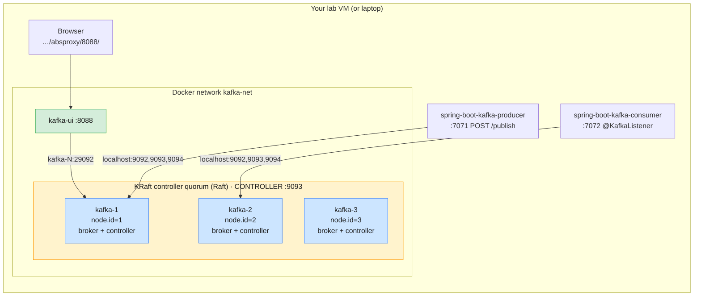

# Lab 05 — A KRaft Cluster with Spring Boot Producer & Consumer

| | |
| --- | --- |
| **Level** | Intermediate → Advanced |
| **Duration** | ~80 minutes (includes one 2-minute wait) |
| **Guide sections** | Module 4 guide §4 Consumer groups · §6 Rebalancing · §8 Writing producer and consumer applications · [Module 1 guide](../../guides/module-01-messaging-kafka-fundamentals.md) §8 ZooKeeper vs KRaft |
| **You will need** | Docker, **JDK 17+** (`java -version`), `curl`, three terminals, a browser. [Lab 04](lab-04-zookeeper-cluster-spring-boot.md) is recommended first: this lab repeats its experiments on KRaft so you can compare |
| **Files** | [`lab-05/`](lab-05/): `docker-compose.yml`, `spring-boot-kafka-producer/`, `spring-boot-kafka-consumer/` (copies of the Lab 04 apps, unchanged) |

## Learning objectives

Lab 04 ran the legacy architecture, with ZooKeeper holding the metadata. This lab
runs the **same two Spring Boot apps, unchanged**, against a **3-node KRaft
cluster on Apache Kafka 4.3.1** and repeats the failure experiments. By the end
of this lab you will be able to:

1. Start a 3-node **KRaft** cluster (combined broker + controller nodes) and
   read its **controller quorum** with `kafka-metadata-quorum.sh`.
2. Find topics and partitions in the **`__cluster_metadata` log** instead of in
   znodes.
3. Show that clients **do not care** whether the cluster runs ZooKeeper or
   KRaft: same jars, same `bootstrap-servers`, same behaviour.
4. Observe **Raft controller failover**, and what happens when the quorum loses
   its **majority**, including a message that the app reports as sent but is
   **lost**.
5. Switch Spring consumers to the **KIP-848 consumer group protocol**
   (`group.protocol=consumer`), which needs a Kafka 4.x broker, and see why
   your tools need upgrading too.

### Versions used

| Component | Version | Notes |
| --------- | ------- | ----- |
| Broker image | `apache/kafka:4.3.1` | Same image and settings as the Module 2 cluster. KRaft is the only mode in 4.x |
| Kafka UI | `provectuslabs/kafka-ui:v0.7.2` | Port **8088**, path `/absproxy/8088/` (see [Opening Kafka UI](#opening-kafka-ui)) |
| Spring Boot / Spring for Apache Kafka | 4.1.1 / 4.1.1 | Same as Lab 04 |
| Kafka Java client (`kafka-clients`) | **4.3.1** | Same as Lab 04, now matching the broker version |

---

## Lab environment



| What | From the VM (or your laptop) | From inside the Docker network |
| ---- | ---------------------------- | ------------------------------ |
| Brokers | `localhost:9092`, `localhost:9093`, `localhost:9094` | `kafka-1:29092`, `kafka-2:29092`, `kafka-3:29092` (`$BS`) |
| Controllers (Raft) | not published | `kafka-1:9093`, `kafka-2:9093`, `kafka-3:9093` |
| Kafka UI | See [Opening Kafka UI](#opening-kafka-ui) | — |
| Producer app / consumer app | http://localhost:7071 / :7072 | — |

The apps keep `bootstrap-servers=localhost:9092,localhost:9093,localhost:9094`
from Lab 04. Here `localhost:9093` is kafka-2's client listener published on
the VM. The KRaft `CONTROLLER` port 9093 exists only *inside* the containers,
so the two do not clash.

> **Convention used in this lab**
>
> - `# (VM)`: run on your lab VM (VS Code terminal) from
>   **`labs/module-04/lab-05`**, or on your laptop if you run Docker locally.
> - `# (kafka-1)`: run inside `docker exec -it kafka-1 bash`. The Kafka 4.3 CLI
>   tools are on the `PATH` and `$BS` is the internal bootstrap list. This cluster
>   has no SASL, so do **not** pass `--command-config $CFG` here.

### Opening Kafka UI

Kafka UI runs **on the VM**, so `http://localhost:8088` in your laptop's
browser does not reach it.

| You use the VM through | Open |
| ---------------------- | ---- |
| **The browser** (code-server at `https://lab-lNN.kafka.supercloudlabs.com`) | **`https://lab-lNN.kafka.supercloudlabs.com/absproxy/8088/`**. Replace `lNN` with your VM, and stay logged in to code-server in the same browser |
| **VS Code desktop + Remote-SSH** | Forward port `8088` in the **Ports** tab, then **`http://localhost:8088/absproxy/8088/`** |
| Docker on your own laptop | `http://localhost:8088/absproxy/8088/` |

Use `/absproxy/`, not `/proxy/`. `/proxy/` strips the path prefix, Kafka UI's
scripts then fail to load, and the page stays blank. See
[Lab 04](lab-04-zookeeper-cluster-spring-boot.md#opening-kafka-ui) for the
details.

---

## Part 1 — Start the KRaft cluster (10 min)

### 1.1 Stop the Lab 04 cluster

Both labs use the container names `kafka-1`..`kafka-3`, the `kafka-net` network
and port 9092:

```bash
# (VM)
docker ps -a --format '{{.Names}}\t{{.Status}}'
cd ~/mobliy-kafka/labs/module-04/lab-04 && docker compose down -v
cd ../lab-05
```

If the Module 2/3 cluster is listed instead, remove it with
`docker compose -p kafka-m2 down` and `docker compose -p module-02 down`.

### 1.2 Read the Compose file: what changed from Lab 04?

Open [`lab-05/docker-compose.yml`](lab-05/docker-compose.yml) next to
[`lab-04/docker-compose.yml`](lab-04/docker-compose.yml):

| Lab 04 (ZooKeeper) | Lab 05 (KRaft) | Why |
| ------------------ | -------------- | --- |
| `zookeeper` service | *gone* | The controllers inside Kafka replace it |
| `KAFKA_ZOOKEEPER_CONNECT: zookeeper:2181` | `KAFKA_PROCESS_ROLES: broker,controller` | Each node is a broker **and** a member of the controller quorum (combined mode). Module 5 splits the roles, as production does |
| — | `KAFKA_CONTROLLER_QUORUM_VOTERS: 1@kafka-1:9093,...` | The fixed list of controller voters (a *static* quorum) |
| — | `CONTROLLER` listener on `:9093` | Raft traffic between controllers. Clients never use it |
| `KAFKA_BROKER_ID` | `KAFKA_NODE_ID` | One ID for the node, whichever roles it has |
| No cluster ID (stored in ZooKeeper) | `CLUSTER_ID: ...` | Every node's storage is **formatted** with the same ID before first start. The `apache/kafka` image runs `kafka-storage.sh format` for you |
| Custom broker `command:` to skip formatting | *none* | The image is built for KRaft, so its normal start script works |
| `apache/kafka:3.9.2` | `apache/kafka:4.3.1` | 4.x is KRaft-only |

### 1.3 Start it

```bash
# (VM) - from labs/module-04/lab-05
docker compose up -d
docker compose ps
```

```
NAME       IMAGE                           STATUS
kafka-1    apache/kafka:4.3.1              Up 16 seconds (healthy)
kafka-2    apache/kafka:4.3.1              Up 16 seconds (healthy)
kafka-3    apache/kafka:4.3.1              Up 16 seconds (healthy)
kafka-ui   provectuslabs/kafka-ui:v0.7.2   Up 1 second
```

Four containers instead of five: there is no ZooKeeper to run, secure, patch
or monitor.

---

## Part 2 — The controller quorum (10 min)

```bash
# (VM)
docker exec -it kafka-1 bash
```

```bash
# (kafka-1)
kafka-metadata-quorum.sh --bootstrap-server $BS describe --status
```

```
ClusterId:              Je89w39_Q46DWmFYXCGkGw
LeaderId:               1
LeaderEpoch:            1
HighWatermark:          95
MaxFollowerLag:         0
MaxFollowerLagTimeMs:   0
CurrentVoters:          [{"id": 1, "endpoints": ["CONTROLLER://kafka-1:9093"]}, {"id": 2, ...}, {"id": 3, ...}]
CurrentObservers:       []
```

| Field | Meaning | Lab 04 equivalent |
| ----- | ------- | ----------------- |
| `LeaderId` | The **active controller**, the Raft leader of the quorum (yours may differ) | `get /controller` |
| `LeaderEpoch` | Increases with every election | `get /controller_epoch` |
| `HighWatermark` | Offset of the last metadata record committed by a majority | — (ZooKeeper had its own `zxid`) |
| `CurrentVoters` | Controllers that vote in elections. Here all three nodes | The ZooKeeper ensemble members |
| `CurrentObservers` | Brokers that only *read* the metadata log. Empty, because every node is also a voter | — |

> **Write down the `LeaderId`.** You will stop that node in Part 5.

Now look at each voter's progress:

```bash
# (kafka-1)
kafka-metadata-quorum.sh --bootstrap-server $BS describe --replication
```

```
NodeId  DirectoryId             LogEndOffset  Lag  LastFetchTimestamp  LastCaughtUpTimestamp  Status
1       AAAAAAAAAAAAAAAAAAAAAA  99            0    1791196081080       1791196081080          Leader
2       AAAAAAAAAAAAAAAAAAAAAA  99            0    1791196080927       1791196080927          Follower
3       AAAAAAAAAAAAAAAAAAAAAA  99            0    1791196080926       1791196080926          Follower
```

The followers **fetch** the metadata log from the leader exactly like follower
replicas fetch a topic partition. `Lag 0` means they are caught up.

Finally, the feature versions that the quorum has agreed on:

```bash
# (kafka-1)
kafka-features.sh --bootstrap-server $BS describe
```

```
Feature: group.version        ...  FinalizedVersionLevel: 1  ...
Feature: kraft.version        ...  FinalizedVersionLevel: 0  ...
Feature: metadata.version     SupportedMinVersion: 3.3-IV3  SupportedMaxVersion: 4.3-IV0  FinalizedVersionLevel: 4.3-IV0  ...
...
```

- `metadata.version 4.3-IV0` is the KRaft equivalent of
  `inter.broker.protocol.version`. You raise it after a rolling upgrade.
- `group.version 1` enables the **KIP-848** consumer protocol you use in Part 7.
- `kraft.version 0` means a **static** quorum (fixed voters list). Version 1
  allows adding and removing controllers at runtime (KIP-853).

---

## Part 3 — Topics in the metadata log (10 min)

Create the three topics the consumer app listens on:

```bash
# (kafka-1)
for t in test demo test1; do
  kafka-topics.sh --bootstrap-server $BS --create --topic $t --partitions 3 --replication-factor 3
done
kafka-topics.sh --bootstrap-server $BS --describe --topic demo
```

```
Topic: demo  TopicId: iPLDTU4eTLaAZg5TQrspjQ  PartitionCount: 3  ReplicationFactor: 3  Configs: min.insync.replicas=2
    Topic: demo  Partition: 0  Leader: 1  Replicas: 1,2,3  Isr: 1,2,3  Elr:   LastKnownElr:
    Topic: demo  Partition: 1  Leader: 2  Replicas: 2,3,1  Isr: 2,3,1  Elr:   LastKnownElr:
    Topic: demo  Partition: 2  Leader: 3  Replicas: 3,1,2  Isr: 3,1,2  Elr:   LastKnownElr:
```

`Elr` was `N/A` in Lab 04. *Eligible leader replicas* (KIP-966) need KRaft.

In Lab 04 you found this in `/brokers/topics/demo`. In KRaft it is a sequence of
**records** in the `__cluster_metadata` topic. Count the record types:

```bash
# (kafka-1)
LOG=/var/lib/kafka/data/__cluster_metadata-0/00000000000000000000.log
kafka-dump-log.sh --cluster-metadata-decoder --files $LOG 2>/dev/null \
  | grep -o '"type":"[A-Z_]*"' | sort | uniq -c | sort -rn
```

```
     61 "type":"NO_OP_RECORD"
     59 "type":"PARTITION_RECORD"
      6 "type":"FEATURE_LEVEL_RECORD"
      6 "type":"BROKER_REGISTRATION_CHANGE_RECORD"
      4 "type":"TOPIC_RECORD"
      4 "type":"CONFIG_RECORD"
      3 "type":"REGISTER_CONTROLLER_RECORD"
      3 "type":"REGISTER_BROKER_RECORD"
      ...
```

Find the `demo` topic and its partition 0:

```bash
# (kafka-1)
ID=$(kafka-topics.sh --bootstrap-server $BS --describe --topic demo \
     | grep -o 'TopicId: [^[:space:]]*' | cut -d' ' -f2)
echo $ID
kafka-dump-log.sh --cluster-metadata-decoder --files $LOG 2>/dev/null \
  | grep -o 'payload: .*' | grep -E "\"name\":\"demo\"|\"partitionId\":0,\"topicId\":\"$ID\""
```

```
payload: {"type":"TOPIC_RECORD","version":0,"data":{"name":"demo","topicId":"iPLDTU4eTLaAZg5TQrspjQ"}}
payload: {"type":"PARTITION_RECORD","version":2,"data":{"partitionId":0,"topicId":"iPLDTU4eTLaAZg5TQrspjQ","replicas":[1,2,3],"isr":[1,2,3],...,"leader":1,"leaderEpoch":0,"partitionEpoch":0,...}}
```

| Lab 04 (ZooKeeper) | Lab 05 (KRaft) |
| ------------------ | -------------- |
| `/brokers/ids/N` ephemeral znode | `REGISTER_BROKER_RECORD`, and the broker sends heartbeats to the controller |
| `/brokers/topics/demo` | `TOPIC_RECORD` + one `PARTITION_RECORD` per partition |
| `/brokers/topics/demo/partitions/0/state` | `PARTITION_RECORD`, then `PARTITION_CHANGE_RECORD`s when leader/ISR change |
| `/config/topics/demo` | `CONFIG_RECORD` |
| The current *state*, overwritten in place | An append-only *log of events*. The state is what you get by replaying it |

`NO_OP_RECORD`s are written by the active controller about every 500 ms, so the
followers can tell the leader is alive and the high watermark keeps advancing.

Leave this shell open.

---

## Part 4 — Kafka UI and the Spring Boot apps (15 min)

### 4.1 Kafka UI

Open Kafka UI ([Opening Kafka UI](#opening-kafka-ui)). The cluster is called
**lab-05-kraft**. **Dashboard** shows 3 brokers online and the topics you
created. Two things look odd:

- The version shows **`1.0-UNKNOWN`** (it showed `3.9-IV0` in Lab 04).
  Kafka UI 0.7.2 is older than Kafka 4.x and cannot name it.
- **Brokers → Active controller** names a broker, but often **not** the
  `LeaderId` from Part 2. In KRaft, clients reach the cluster through brokers,
  and the Admin API answers "who is the controller?" with an arbitrary live
  broker (KIP-919). Controllers are not reachable on the client listeners. The
  real active controller is only visible with `kafka-metadata-quorum.sh`.

Part 7 shows one more blind spot of this UI version.

### 4.2 Run the same apps, unchanged

The two projects in `lab-05/` are copies of the Lab 04 apps, unchanged except
for a comment in `pom.xml`. Lab 04 Part 4 walks through the code. Same
`bootstrap-servers`, same jars:

```bash
# (VM) - terminal 2, from labs/module-04/lab-05
cd spring-boot-kafka-consumer
./mvnw spring-boot:run
```

```bash
# (VM) - terminal 3, from labs/module-04/lab-05
cd spring-boot-kafka-producer
./mvnw spring-boot:run
```

The consumer prints the same assignment as in Lab 04 (`demo-group` gets one
partition per listener, `test-group1` and `test-group2` each get all three).
Send the same messages:

```bash
# (VM) - terminal 1
curl -X POST "localhost:7071/publish?topic=test" -H 'Content-Type: text/plain' -d 'Hello from Mobily'
for i in 1 2 3 4 5 6; do
  curl -s -X POST "localhost:7071/publish?topic=demo" -H 'Content-Type: text/plain' -d "CDR $i"; echo
done
curl -X POST "localhost:7071/publishObj?topic=test1" -H 'Content-Type: application/json' \
     -d '{"id":1,"message":"Welcome to Mobily 5G"}'
```

```
#1 Consume message as String - Received message - "Hello from Mobily"
#2 Consume message as String - Received message - "CDR 3"
#1 Consume message as String - Received message - "CDR 1"
...
Consume message as Object - Received message - ID: 1, Message: Welcome to Mobily 5G
Consume message as Consumer Record - Received message - ID: 1, Message: Welcome to Mobily 5G
```

**Nothing in the apps changed.** Clients bootstrap from brokers, ask brokers for
metadata and talk to partition leaders. Whether those brokers get their
metadata from ZooKeeper or from a Raft log is invisible to the client. That is
why a ZooKeeper → KRaft migration needs **no application changes**.

---

## Part 5 — Controller failover with Raft (10 min)

Keep both apps running. Stop the node that is the active controller (the
`LeaderId` you wrote down. Replace `1` below):

```bash
# (VM)
docker compose stop kafka-1
```

From a surviving node (`docker exec -it kafka-2 bash` if you stopped kafka-1):

```bash
# (kafka-2)
kafka-metadata-quorum.sh --bootstrap-server kafka-2:29092 describe --status | grep -E 'LeaderId|LeaderEpoch'
kafka-metadata-quorum.sh --bootstrap-server kafka-2:29092 describe --replication
kafka-topics.sh --bootstrap-server kafka-2:29092 --describe --topic demo
```

```
LeaderId:               3
LeaderEpoch:            3
NodeId  ...  LogEndOffset  Lag  ...  Status
3       ...  348           0    ...  Leader
1       ...  -1            349  ...  Follower
2       ...  348           0    ...  Follower
Topic: demo  ...
    Topic: demo  Partition: 0  Leader: 2  Replicas: 1,2,3  Isr: 2,3
    Topic: demo  Partition: 1  Leader: 2  Replicas: 2,3,1  Isr: 2,3
    Topic: demo  Partition: 2  Leader: 3  Replicas: 3,1,2  Isr: 3,2
```

What happened:

1. The two remaining voters stopped receiving fetches/`NO_OP_RECORD`s from the
   leader, timed out, and held a **Raft election**. One of them got a majority
   (2 of 3 votes, its own included) and became leader at a higher epoch.
2. The new controller **already had the full metadata log**: it had been
   fetching it all along. There was nothing to reload. In Lab 04 the new
   controller had to read the whole state from ZooKeeper first.
3. Because kafka-1 was also a **broker** (combined mode), its partitions got new
   leaders and it left every ISR, the same as in Lab 04.

Send messages while kafka-1 is down. They succeed (2 in-sync replicas,
`min.insync.replicas=2`), and the consumer prints them:

```bash
# (VM)
for i in 7 8 9; do
  curl -s -X POST "localhost:7071/publish?topic=demo" -H 'Content-Type: text/plain' -d "CDR $i"; echo
done
```

Bring kafka-1 back:

```bash
# (VM)
docker compose start kafka-1
```

```bash
# (kafka-2)
kafka-metadata-quorum.sh --bootstrap-server kafka-2:29092 describe --replication
```

```
NodeId  ...  LogEndOffset  Lag  ...  Status
3       ...  469           0    ...  Leader
1       ...  469           0    ...  Follower
2       ...  469           0    ...  Follower
```

kafka-1 rejoined as a **follower** and caught up on the metadata it missed by
fetching the log. Like Lab 04, there is no fail-back of the controller role.

---

## Part 6 — Losing the quorum majority, and a lost message (15 min)

A Raft quorum needs a **majority** of voters, here 2 of 3, to elect a leader
and commit metadata. Stop two nodes:

```bash
# (VM)
docker compose stop kafka-1 kafka-2
```

Watch the survivor try, and fail, to become leader:

```bash
# (VM)
docker logs kafka-3 2>&1 | grep RaftManager | tail -3
```

```
... [RaftManager id=3] Completed transition to ProspectiveState(epoch=4, leaderId=OptionalInt.empty, ...
... [RaftManager id=3] Attempting durable transition to UnattachedState(epoch=4, leaderId=OptionalInt.empty, ...
```

kafka-3 keeps cycling through *Prospective* (asking for votes) and *Unattached*.
With 1 vote out of 3 it can never win. **No leader means no metadata changes**:

```bash
# (VM)
docker exec kafka-3 timeout 60 kafka-topics.sh --bootstrap-server kafka-3:29092 \
  --create --topic q.lost --partitions 1 --replication-factor 1
```

It does not succeed: it prints connection errors for the stopped nodes and
gives up, or `timeout` stops it after 60 s. `kafka-metadata-quorum.sh describe
--status` fails too.

Now produce one message:

```bash
# (VM)
curl -X POST "localhost:7071/publish?topic=demo" -H 'Content-Type: text/plain' -d 'CDR 10'
```

```
Message published successfully
```

Watch the **producer** terminal:

```
Got error produce response ... on topic-partition demo-1, retrying (2147483575 attempts left). Error: NOT_ENOUGH_REPLICAS
Got error produce response ... on topic-partition demo-1, retrying (2147483574 attempts left). Error: NOT_ENOUGH_REPLICAS
...
```

Only one replica is alive, and `acks=all` (the default) with
`min.insync.replicas=2` refuses to accept the write. The producer retries, but
only until `delivery.timeout.ms` (default **120 s**) expires. **Wait for it**
(about 2 minutes) without restarting anything:

```
org.apache.kafka.common.errors.TimeoutException: Expiring 1 record(s) for demo-1:120003 ms has passed since batch creation.
```

Now restore the quorum:

```bash
# (VM)
docker compose start kafka-1 kafka-2
```

```bash
# (kafka-1)            - reopen with docker exec -it kafka-1 bash once it is healthy
kafka-metadata-quorum.sh --bootstrap-server $BS describe --status | grep -E 'LeaderId|LeaderEpoch'
kafka-topics.sh --bootstrap-server $BS --list
```

The quorum elects a leader again at a higher epoch, and `q.lost` was **never
created**. Check the consumer terminal: **`CDR 10` never arrives.**

The REST endpoint said *"Message published successfully"*, and the message is
gone. Look at the producer code:

```java
strKafkaTemplate.send(topic, String.valueOf(new Random().nextInt()), message);
return "Message published successfully";
```

`send()` is **asynchronous**. It returns a `CompletableFuture` as soon as the
record is in the client's buffer. The app never looks at the result, so it
cannot know that the broker refused the write. The cluster did the right thing
by refusing to accept data it could not replicate safely. The application lost
it.

> **Stretch:** make `/publish` honest. Replace the line with
> `strKafkaTemplate.send(...).get(10, TimeUnit.SECONDS)` (blocking), or add
> `.whenComplete((r, ex) -> ...)` and log or store failures. Repeat this part
> and the REST call now reports the error. Lab 01 showed the same thing for the
> plain Java producer: failures arrive **in the callback**.

---

## Part 7 — The KIP-848 consumer group protocol (10 min)

Kafka 4.x brokers support a new consumer group protocol (KIP-848). Assignment
moves to the **broker** (group coordinator), rebalances are incremental, and
there is no "stop-the-world" `JoinGroup`/`SyncGroup` barrier. The client opts in
with `group.protocol=consumer`. Lab 02 tried it with the plain Java consumer.
Now do it in Spring Boot without touching the code.

Stop the consumer app (**Ctrl+C** in terminal 2) and restart it with one extra
property:

```bash
# (VM) - terminal 2, from labs/module-04/lab-05/spring-boot-kafka-consumer
./mvnw spring-boot:run \
  -Dspring-boot.run.arguments="--spring.kafka.consumer.properties.group.protocol=consumer"
```

Scroll up in terminal 2 to the `ConsumerConfig values:` blocks that each
consumer prints at startup, and look at the `group.protocol` line:

| Consumers | `group.protocol` |
| --------- | ---------------- |
| `test-group` and the 3 `demo-group` listeners | `consumer` |
| `test-group1` and `test-group2` | `classic` |

Why only four? `spring.kafka.consumer.*` configures Spring Boot's **default**
listener container factory. The two `test1` listeners use
`greetingKafkaListenerContainerFactory` from `KafkaConsumerConfig.java`, which
builds its config from its own `consumerConfigs()` map and ignores Boot's
properties. *Where does this setting come from?* is a question you will ask
about every Spring Kafka app.

```bash
# (kafka-1)
kafka-consumer-groups.sh --bootstrap-server $BS --list --type
kafka-consumer-groups.sh --bootstrap-server $BS --describe --group demo-group --state
kafka-consumer-groups.sh --bootstrap-server $BS --describe --group demo-group --members
```

```
GROUP        TYPE
test-group   Consumer
test-group2  Classic
test-group1  Classic
demo-group   Consumer

GROUP       COORDINATOR (ID)  ASSIGNMENT-STRATEGY  STATE   #MEMBERS
demo-group  kafka-3:29092 (3) uniform              Stable  3

GROUP       CONSUMER-ID             HOST           CLIENT-ID              #PARTITIONS
demo-group  W8MtVE8WStu-AUquSNxpLQ  /192.168.65.1  consumer-demo-group-2  1
...
```

- The group **type** is now `Consumer`, and the assignment strategy is
  **`uniform`**, a *server-side* assignor. Classic groups show the client-side
  `range` assignor.
- Send a few more `demo` messages. They are still split across the three
  listeners.

Now open **Kafka UI → Consumers**:

| Group | Kafka UI 0.7.2 shows |
| ----- | -------------------- |
| `test-group1`, `test-group2` (classic) | `STABLE`, 1 member, lag 0 |
| `demo-group`, `test-group` (consumer) | **`DEAD`, 0 members** |

The groups are healthy (the CLI says `Stable`, 3 members). Kafka UI 0.7.2 uses
an older Kafka client that only understands *classic* groups, so it
misreports the new ones. **New broker features need up-to-date tools too.**
Always cross-check a GUI with the CLI that ships with your broker.

---

## Part 8 — ZooKeeper vs KRaft, from both labs (5 min)

| Observation | Lab 04 (ZooKeeper, Kafka 3.9.2) | Lab 05 (KRaft, Kafka 4.3.1) |
| ----------- | ------------------------------- | --------------------------- |
| Containers to run | 5 (ZooKeeper + 3 brokers + UI) | 4 (3 nodes + UI) |
| Where to look for the controller | `get /controller` | `kafka-metadata-quorum.sh describe --status` |
| Topic metadata | Current state in znodes | Event records in `__cluster_metadata` |
| Controller failover | Race for an ephemeral znode, then **reload all state** from ZooKeeper | Raft election among voters that **already have the log** |
| "Control plane down" | ZooKeeper stopped: produce still worked, topic create hung | Quorum majority lost: topic create failed; produce failed here because the same nodes are brokers (combined mode) |
| Apps | Unchanged | **Unchanged** |
| KIP-848 consumer protocol, ELR | Not available | Available |

> **Combined mode vs dedicated controllers.** In this lab, losing two nodes
> lost both the quorum *and* two brokers at once. Production clusters (and the
> shared course cluster: 3 controllers + 4 brokers) run controllers as
> **separate nodes**, so controller and broker failures are independent.
> Module 5 works with that layout.

---

## Checkpoint questions

<details>
<summary>1. The Spring Boot apps ran against ZooKeeper in Lab 04 and KRaft here without a single change. Why?</summary>

Clients only talk to **brokers**: they bootstrap, request metadata, and produce
to and fetch from partition leaders. How brokers obtain that metadata, from
ZooKeeper or from the KRaft metadata log, is internal to the cluster. This is
why a ZooKeeper → KRaft migration is an operations project with no client
changes.
</details>

<details>
<summary>2. After the active controller stopped, why was KRaft failover faster than ZooKeeper failover in principle?</summary>

Every voter continuously replicates the `__cluster_metadata` log, so the newly
elected leader already holds the complete, up-to-date metadata and can act
immediately. A ZooKeeper-mode controller had to read the entire cluster state
from ZooKeeper after winning the election. With many partitions that took a long time.
</details>

<details>
<summary>3. With two of three nodes down, why could kafka-3 not become the controller, and what is the rule for quorum size?</summary>

Raft needs votes from a **majority** of voters, here 2 of 3. Alone, kafka-3
has 1 vote. A quorum of *n* voters tolerates ⌊(n−1)/2⌋ failures: 3 voters
tolerate 1, 5 voters tolerate 2. That is why controller quorums are 3 or 5
(odd) nodes. A 4th voter adds no fault tolerance.
</details>

<details>
<summary>4. <code>/publish</code> answered "Message published successfully", but CDR 10 was lost. Who is at fault, and how do you fix it?</summary>

The cluster behaved correctly: with `acks=all` and `min.insync.replicas=2` it
refused a write it could not replicate, and the producer retried until
`delivery.timeout.ms` (120 s) expired. The **application** is at fault. It
ignored the `CompletableFuture` returned by `KafkaTemplate.send()` and reported
success before the broker had acknowledged anything. Fix: wait for the result
(`.get(timeout)`), or handle it asynchronously (`whenComplete`) and surface or
store failures, and alert on producer error metrics (Module 8).
</details>

<details>
<summary>5. Only four of the six Spring consumers switched to <code>group.protocol=consumer</code>. Why?</summary>

`--spring.kafka.consumer.properties.*` only applies to consumers created by
Spring Boot's auto-configured `ConsumerFactory`. The `test1` listeners use a
custom `greetingKafkaListenerContainerFactory` whose `ConsumerFactory` is built
from the app's own `consumerConfigs()` map, so Boot's properties never reach
them. To switch them, add `group.protocol` to that map, or build the custom
factory from Boot's `KafkaProperties`.
</details>

<details>
<summary>6. Kafka UI reported <code>demo-group</code> as DEAD with 0 members, while it was consuming fine. What does this teach you?</summary>

Monitoring tools have their own client versions and protocol support. Kafka UI
0.7.2 predates KIP-848 and cannot describe *consumer*-type groups, so it
misreports them (it also showed the version as `1.0-UNKNOWN` and could not
identify the active KRaft controller). After a broker upgrade that enables new features, check that
your UIs, exporters and scripts understand them, and trust the CLI shipped with
the broker when they disagree.
</details>

---

## Clean up

Stop both Spring Boot apps with **Ctrl+C**, then:

```bash
# (VM) - from labs/module-04/lab-05
docker compose down -v
```

This lab created nothing on the shared cluster, so there is nothing to delete
under your `$ME` prefix.

**Next module:** *Module 5 — Cluster Operations, Replication & High
Availability* ([guide](../../guides/module-05-cluster-operations-replication-ha.md)).
It moves from combined nodes to dedicated controllers, and covers partition
reassignment, broker failure and rolling restarts.
