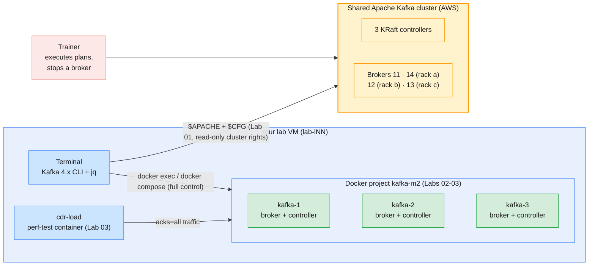

# Module 5 Labs — Cluster Operations, Replication & High Availability

> **Course:** Apache Kafka & Confluent Kafka Administration
> **Companion guide:** [`guides/module-05-cluster-operations-replication-ha.md`](../../guides/module-05-cluster-operations-replication-ha.md)
> **Module objective:** Complete core Apache Kafka administration: cluster
> operations and high availability.

Modules 3 and 4 kept the cluster still while you configured topics and
clients. These labs change the cluster **underneath** running traffic: you
move partitions, stop and kill brokers, and restart a whole cluster one node at
a time. You work in two places. Lab 01 runs on the **shared Apache Kafka
cluster on AWS**, which is read-only for you at cluster level: you inspect it
and prepare a reassignment plan that the trainer executes. Labs 02–03 run on
**your own Module 2 Docker cluster**, where you execute every operation
yourself and break brokers on purpose without disturbing anyone. Do the labs in
order.

| # | Lab | Level | Time | What you will do |
| - | --- | ----- | ---- | ---------------- |
| 01 | [Inspecting the shared cluster & planning a reassignment](lab-01-inspecting-cluster-planning-reassignment.md) | Beginner | 60 min | Read brokers, racks and the controller quorum, map your replicas to racks, use the health filters, generate and review a plan to drain broker 11, watch the trainer execute it, size a cluster on paper |
| 02 | [Executing throttled reassignments & draining a broker](lab-02-executing-throttled-reassignments.md) | Beginner → Intermediate | 75 min | Raise RF and spread leaders with a throttle, watch the throttle configs come and go, rescue a move whose throttle is too low, cancel a move, cordon and drain a broker |
| 03 | [Simulating broker failure, recovery & a rolling restart](lab-03-broker-failure-recovery-rolling-restart.md) | Intermediate → Advanced | 80 min | Graceful stop vs `docker kill` under live `acks=all` traffic, controller failover, log recovery, preferred leader election, a scripted rolling restart behind a health gate, feature levels, the trainer's failure demo on the shared cluster |

Estimated total: **about 3 h 35 min**, including checkpoint questions.

---

## Prerequisites

| Requirement | Check with | Notes |
| ----------- | ---------- | ----- |
| Lab VM with the prepared client config (Lab 01) | `kafka-topics.sh --bootstrap-server apache-kafka.lab.internal:9092 --command-config ~/kafka/apache.properties --list` | Lists your own `lNN.*` topics; Module 4 left `lNN.cdr.voice` |
| Your learner prefix `lNN` | The credentials e-mail you received | Every topic and group starts with `$ME.` |
| `jq` on the VM | `jq --version` | Reads the one-line JSON from `kafka-reassign-partitions.sh` and `kafka-log-dirs.sh` |
| Docker with the compose plugin (Labs 02–03) | `docker compose version` | Runs the Module 2 three-node cluster |
| **~3 GB** free RAM for Docker | `docker info --format '{{.MemTotal}}'` | Three Kafka JVMs (512 MB heap each) plus a small load-generator container |
| Ports **9092, 9094, 9096** free | `ss -ltn \| grep -E ':(9092\|9094\|9096)'` | Stop any earlier cluster first (below); otherwise `Bind for 0.0.0.0:9092 failed: port is already allocated` |
| 3 terminals | VS Code → Terminal → Split | Container shell, compose commands and the load generator side by side |

> **Stop earlier clusters first.** Module 3's labs used the same three
> containers with an extra override file. If they are still up, remove them
> (this deletes the Module 3 data):
>
> ```bash
> # (host) - from labs/module-03
> docker compose -p kafka-m2 -f ../module-02/docker-compose.yml \
>   -f docker-compose.override.yml down -v
> ```

> **Using the course AWS VMs?** Everything above is already installed on your
> VM (`lab-lNN`), including `~/kafka/apache.properties`, the Kafka 4.x CLI on
> your `PATH`, `jq`, Docker and the pre-pulled `apache/kafka:4.3.1` image.
> Connect with VS Code Remote-SSH and run the labs on the VM exactly as
> written. See [`infra/LAB-SETUP.md`](../../infra/LAB-SETUP.md) for the full
> course environment.

---

## Lab environment

The split follows the course lab setup: killing a broker on the shared cluster
would disrupt all 18 learners, so destructive work happens on your own cluster
and the trainer demonstrates a real failure on the shared one.

- **Lab 01 — shared Apache Kafka cluster.** 3 dedicated KRaft controllers and
  4 brokers (ids **11–14**) spread over three availability zones, used as
  racks: 11 and 14 in `ap-south-1a`, 12 in `ap-south-1b`, 13 in `ap-south-1c`.
  You have full rights on `$ME.*` topics and groups and `Describe` on the
  cluster, enough to inspect anything and to **generate** and **verify**
  reassignment plans. Executing a plan needs cluster `Alter`, which only the
  trainer has.
- **Labs 02–03 — your own Module 2 cluster.** The three-node cluster from
  [`labs/module-02/docker-compose.yml`](../module-02/docker-compose.yml), used
  as it is: no override file this time. Each node is broker **and**
  controller (combined mode), so a broker failure here also costs the
  controller quorum a voter, unlike the shared cluster.



| Cluster | Bootstrap | Config file | Prefix | Names used in the labs |
| ------- | --------- | ----------- | ------ | ---------------------- |
| Shared (Lab 01) | `apache-kafka.lab.internal:9092` (`$APACHE`) | `~/kafka/apache.properties` (`$CFG`) | `lNN` (`$ME`), e.g. `l07` | Topic `$ME.cdr.voice` (from Module 4), files in `~/m5/` |
| Own (Labs 02–03) | `kafka-1:29092,kafka-2:29092,kafka-3:29092` (`$BS`, preset inside the containers) | — | `$ME` | Topics `$ME.move.test`, `$ME.cdr.archive`, `$ME.cdr.sms`, `$ME.cdr.ha` |

### Everyday commands

Shared cluster (Lab 01), in every new terminal:

```bash
# (VM)
APACHE=apache-kafka.lab.internal:9092   # the shared cluster
CFG=~/kafka/apache.properties           # your SASL credentials (prepared for you)
ME=lNN                                  # your prefix: l01 … l18

kafka-topics.sh --bootstrap-server $APACHE --command-config $CFG --describe --topic $ME.cdr.voice
```

Own cluster (Labs 02–03), from **this folder** (`labs/module-05`):

```bash
# (host) - from labs/module-05
docker compose -p kafka-m2 -f ../module-02/docker-compose.yml up -d     # start the 3 nodes
docker compose -p kafka-m2 -f ../module-02/docker-compose.yml ps        # all three (healthy)
docker exec -it kafka-1 bash                                            # shell inside node 1
docker compose -p kafka-m2 -f ../module-02/docker-compose.yml stop --timeout 30 kafka-3   # graceful stop
docker compose -p kafka-m2 -f ../module-02/docker-compose.yml start kafka-3
docker compose -p kafka-m2 -f ../module-02/docker-compose.yml down -v  # stop and DELETE all data
```

> **Convention used in the labs**
>
> - `# (VM)`: run on **your lab VM** against the **shared cluster**, using
>   your prepared config file (`$CFG`) and prefix (`$ME`). Lab 01 and
>   Lab 03 Part 6.
> - `# (host)`: run on **your lab VM / laptop** shell, from `labs/module-05`
>   unless the block says otherwise. Docker and compose commands in
>   Labs 02–03.
> - `# (container)`: run **inside** `docker exec -it kafka-1 bash`. Kafka
>   commands against your own cluster in Labs 02–03.

---

## Troubleshooting

| Symptom | Likely cause | Fix |
| ------- | ------------ | --- |
| `l07.cdr.voice-0: … needs ALTER permission` on `--execute`, or `Not authorized to perform leader election` (Lab 01) | Expected: reassignments and elections need cluster `Alter`, which learners never get | Hand the plan to the trainer (Lab 01 Part 5) |
| `ClusterAuthorizationException: Cluster authorization failed.` after `--verify` (Lab 01) | `--verify` tries to clear throttles, which also needs cluster `Alter` | Always add `--preserve-throttles` on the shared cluster |
| `InvalidReplicationFactorException: … only 2 broker(s) are registered or some brokers have all their log directories cordoned` | Fewer usable brokers than the replication factor (broker list too short, or a broker is cordoned) | Add brokers to `--broker-list`, lower the RF deliberately, or uncordon (Lab 02 Part 5) |
| `--verify` keeps saying `is still in progress` | Throttle lower than what the partitions need, often below their write rate | `--execute --additional --throttle <higher>` with the same plan (Lab 02 Part 3) |
| Topic or broker still shows `*.replication.throttled.*` after a move | Nobody ran `--verify` after completion | Run `--verify` (without `--preserve-throttles`) once; it clears them |
| Producer WARN `NOT_LEADER_OR_FOLLOWER` / `Error connecting to node kafka-2:29092` (Labs 02–03) | Leadership moved, or a broker is down; the producer is retrying | Expected while it lasts; failures only if retries exhaust `delivery.timeout.ms` |
| Restart log says `Recovering N logs … since no clean shutdown file was found` after a "graceful" stop | Docker killed the JVM before its shutdown finished (stop timeout too short) | Stop with `--timeout 30` (Lab 03 Part 2); on servers check `TimeoutStopSec` |
| `Couldn't resolve server kafka-3:29092` / `UnknownHostException` | The stopped container's DNS name disappeared | Expected during failure drills; add `2>/dev/null` or list only live nodes in `--bootstrap-server` |

---

## Cleaning up after the module

```bash
# (host) - from labs/module-05
docker rm -f cdr-load 2>/dev/null
docker compose -p kafka-m2 -f ../module-02/docker-compose.yml down -v
```

This removes the three containers, the `kafka-net` network and their data
volumes. It does **not** touch the shared cluster: keep `$ME.cdr.voice` and
the files in `~/m5/` (your rollback plan) until the trainer confirms that every
learner's reassignment is done. From Module 6 on the course moves to Confluent
Platform and Confluent Cloud; the Module 2 compose file and the
`apache/kafka:4.3.1` image stay on your VM if you want to repeat these drills.
