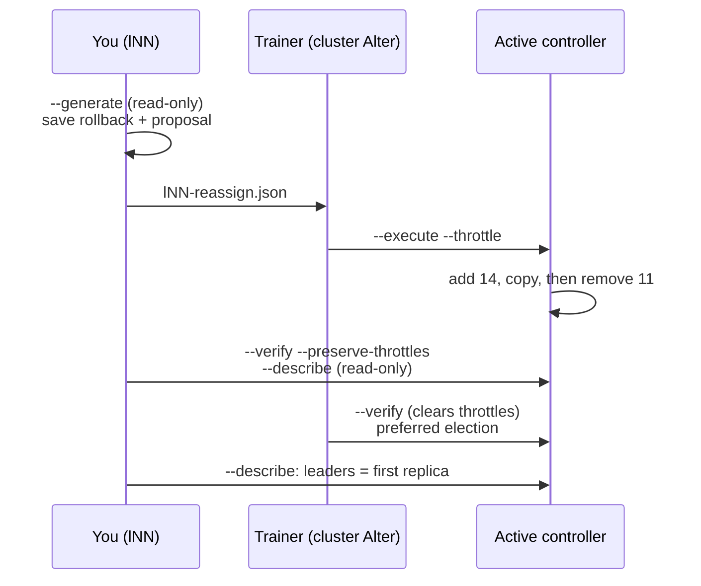

# Lab 01 — Inspecting the Shared Cluster & Planning a Reassignment

| | |
| --- | --- |
| **Level** | Beginner |
| **Duration** | ~60 minutes |
| **Guide sections** | §2.3 Partition health states · §3.1 Who decides: the KRaft controller · §3.5 Rack awareness · §4.2 Decommissioning a broker · §5.2 The three-step workflow · §5.3 Reading the plan · §7 Cluster capacity planning · §8.1–§8.2 Hands-on Parts A and B |
| **You will need** | Your lab VM with `~/kafka/apache.properties`, your prefix `lNN`, the topic `$ME.cdr.voice` left by Module 4, `jq`, one terminal |

## Learning objectives

By the end of this lab you will be able to:

1. List the brokers of a cluster with their **racks**, and read the KRaft
   controller quorum: leader, voters and observers.
2. Map every replica of a topic to a broker and a rack, find its **preferred
   leaders**, and explain why two brokers of the shared cluster hold a copy of
   every partition.
3. Run the four **health filters** of `kafka-topics.sh` and say what each
   state means for producers.
4. **Generate** a reassignment plan that drains a broker, save the rollback
   plan, and review the proposal against a checklist.
5. Explain from real error messages which reassignment steps need cluster
   `Alter`, and follow a plan executed by someone else with
   `--verify --preserve-throttles`.
6. Size a cluster on paper from a measured record size.

The examples use `l07` as the prefix and come from a replica of the course
cluster. Your topic IDs, replica orders and leaders differ; the patterns do
not.

---

## Part 1 — Brokers, racks and controllers (10 min)

Open a terminal in VS Code and define the variables every command uses:

```bash
# (VM)
APACHE=apache-kafka.lab.internal:9092
CFG=~/kafka/apache.properties
ME=lNN                          # your learner prefix: l01 … l18
```

### 1.1 Who are the brokers, and where do they live?

```bash
# (VM)
kafka-broker-api-versions.sh --bootstrap-server $APACHE --command-config $CFG | grep "(id:"
```

**Expected** (order varies):

```
broker-13.lab.internal:9092 (id: 13 rack: ap-south-1c isFenced: false) -> (
broker-11.lab.internal:9092 (id: 11 rack: ap-south-1a isFenced: false) -> (
broker-12.lab.internal:9092 (id: 12 rack: ap-south-1b isFenced: false) -> (
broker-14.lab.internal:9092 (id: 14 rack: ap-south-1a isFenced: false) -> (
```

Four brokers, three racks. The rack is the broker's static `broker.rack`
setting, here the AWS availability zone it runs in (guide §3.5). Note the
asymmetry, because it explains a lot of what follows:

| Rack | Brokers |
| ---- | ------- |
| `ap-south-1a` | 11, 14 |
| `ap-south-1b` | 12 |
| `ap-south-1c` | 13 |

### 1.2 Who decides? The controller quorum

```bash
# (VM)
kafka-metadata-quorum.sh --bootstrap-server $APACHE --command-config $CFG describe --status
```

**Expected:**

```
ClusterId:              0dU-UGW3SReMOGQzhLCiag
LeaderId:               1
LeaderEpoch:            1
HighWatermark:          272
MaxFollowerLag:         0
MaxFollowerLagTimeMs:   0
CurrentVoters:          [{"id": 1, "endpoints": ["CONTROLLER://ctl-1:9093"]}, {"id": 2, "endpoints": ["CONTROLLER://ctl-2:9093"]}, {"id": 3, "endpoints": ["CONTROLLER://ctl-3:9093"]}]
CurrentObservers:       [{"id": 13, "directoryId": "lZkIt4RWGOCFhR4vu4TK4g"}, {"id": 12, "directoryId": "TLouufH1ri2n0FvNazLazg"}, {"id": 14, "directoryId": "Wx4HkQfOGYNEsiqloGxtPw"}, {"id": 11, "directoryId": "wY83AV6PajVIQkZ28K3AGQ"}]
```

| Field | Meaning |
| ----- | ------- |
| **`LeaderId`** | The **active controller**: it makes every leader and ISR decision (guide §3.1) |
| **`CurrentVoters`** | The 3 dedicated controllers (ids 1–3) that vote on the metadata log |
| **`CurrentObservers`** | The 4 brokers: they replay the metadata log but never vote |
| **`HighWatermark`** | Last committed offset of the metadata log; every topic, ISR change and config change is a record in it |

`describe --replication` shows the same nodes with their position in the
metadata log; a healthy cluster has `Lag` 0 or close to it everywhere:

```bash
# (VM)
kafka-metadata-quorum.sh --bootstrap-server $APACHE --command-config $CFG describe --replication
```

**Expected:**

```
NodeId	DirectoryId           	LogEndOffset	Lag	LastFetchTimestamp	LastCaughtUpTimestamp	Status  	
1     	AAAAAAAAAAAAAAAAAAAAAA	275         	0  	1791137013074     	1791137013074        	Leader  	
2     	AAAAAAAAAAAAAAAAAAAAAA	275         	0  	1791137012746     	1791137012746        	Follower	
3     	AAAAAAAAAAAAAAAAAAAAAA	275         	0  	1791137012747     	1791137012747        	Follower	
13    	lZkIt4RWGOCFhR4vu4TK4g	275         	0  	1791137012746     	1791137012746        	Observer	
12    	TLouufH1ri2n0FvNazLazg	275         	0  	1791137012746     	1791137012746        	Observer	
14    	Wx4HkQfOGYNEsiqloGxtPw	275         	0  	1791137012746     	1791137012746        	Observer	
11    	wY83AV6PajVIQkZ28K3AGQ	275         	0  	1791137012744     	1791137012744        	Observer	
```

> **Dedicated controllers:** losing a broker on this cluster never touches the
> quorum. On your own Module 2 cluster every node is both, so in Lab 03 a
> broker failure also removes a voter. Keep this output in mind for the
> comparison.

### 1.3 The settings that govern failover

You have `DescribeConfigs` on the cluster, so you can read any broker's
effective settings (but not change them):

```bash
# (VM)
kafka-configs.sh --bootstrap-server $APACHE --command-config $CFG --describe \
  --entity-type brokers --entity-name 11 --all \
  | grep -E "broker.rack|auto.leader|leader.imbalance|replica.lag.time|unclean|broker.session|min.insync|default.replication"
```

**Expected:**

```
  auto.leader.rebalance.enable=true sensitive=false synonyms={DEFAULT_CONFIG:auto.leader.rebalance.enable=true}
  broker.rack=ap-south-1a sensitive=false synonyms={STATIC_BROKER_CONFIG:broker.rack=ap-south-1a}
  broker.session.timeout.ms=9000 sensitive=false synonyms={DEFAULT_CONFIG:broker.session.timeout.ms=9000}
  default.replication.factor=3 sensitive=false synonyms={STATIC_BROKER_CONFIG:default.replication.factor=3, DEFAULT_CONFIG:default.replication.factor=1}
  leader.imbalance.check.interval.seconds=300 sensitive=false synonyms={DEFAULT_CONFIG:leader.imbalance.check.interval.seconds=300}
  min.insync.replicas=2 sensitive=false synonyms={DYNAMIC_DEFAULT_BROKER_CONFIG:min.insync.replicas=2, STATIC_BROKER_CONFIG:min.insync.replicas=2, DEFAULT_CONFIG:min.insync.replicas=1}
  replica.lag.time.max.ms=30000 sensitive=false synonyms={DEFAULT_CONFIG:replica.lag.time.max.ms=30000}
  unclean.leader.election.enable=false sensitive=false synonyms={STATIC_BROKER_CONFIG:unclean.leader.election.enable=false, DEFAULT_CONFIG:unclean.leader.election.enable=false}
```

| Setting | Value | Used in |
| ------- | ----- | ------- |
| **`broker.session.timeout.ms`** | 9 s | How long a silent broker keeps its leaderships before it is fenced (Lab 03 Part 4) |
| **`replica.lag.time.max.ms`** | 30 s | How far behind a follower may fall before it leaves the ISR (guide §2.2) |
| **`unclean.leader.election.enable`** | `false` | Never elect an out-of-sync replica (guide §3.3) |
| **`auto.leader.rebalance.enable`** + **`leader.imbalance.check.interval.seconds`** | `true`, 300 s | Leaders drift back to the preferred replica within 5 minutes (Lab 03 Part 3) |

---

## Part 2 — Map your replicas to racks (12 min)

```bash
# (VM)
kafka-topics.sh --bootstrap-server $APACHE --command-config $CFG --describe --topic $ME.cdr.voice
```

**Expected** (your replica lists differ):

```
Topic: l07.cdr.voice	TopicId: mF2JrFTrQz24LLmWmQiuzQ	PartitionCount: 6	ReplicationFactor: 3	Configs: min.insync.replicas=2,cleanup.policy=delete,segment.bytes=268435456,retention.ms=604800000,unclean.leader.election.enable=false
	Topic: l07.cdr.voice	Partition: 0	Leader: 11	Replicas: 11,12,13	Isr: 11,12,13	Elr: 	LastKnownElr: 
	Topic: l07.cdr.voice	Partition: 1	Leader: 12	Replicas: 12,13,14	Isr: 12,13,14	Elr: 	LastKnownElr: 
	Topic: l07.cdr.voice	Partition: 2	Leader: 13	Replicas: 13,11,12	Isr: 13,11,12	Elr: 	LastKnownElr: 
	Topic: l07.cdr.voice	Partition: 3	Leader: 14	Replicas: 14,12,13	Isr: 14,12,13	Elr: 	LastKnownElr: 
	Topic: l07.cdr.voice	Partition: 4	Leader: 13	Replicas: 13,12,14	Isr: 13,12,14	Elr: 	LastKnownElr: 
	Topic: l07.cdr.voice	Partition: 5	Leader: 12	Replicas: 12,11,13	Isr: 12,11,13	Elr: 	LastKnownElr: 
```

Copy this table into your notes and fill it in from **your** output, using
the rack map from Part 1.1. The example row values come from the output above:

| Partition | Replicas | Preferred leader (first) | Current leader | Racks of the replicas |
| --------- | -------- | ------------------------ | -------------- | --------------------- |
| 0 | 11,12,13 | 11 | 11 | a, b, c |
| 1 | 12,13,14 | 12 | 12 | b, c, a |
| 2 | 13,11,12 | 13 | 13 | c, a, b |
| … | | | | |

Now count replicas per broker with `kafka-log-dirs.sh`. It prints one long
JSON line, so let `jq` summarise it:

```bash
# (VM)
kafka-log-dirs.sh --bootstrap-server $APACHE --command-config $CFG \
  --describe --topic-list $ME.cdr.voice | grep '^{' \
  | jq -r '.brokers[] | "broker \(.broker): \([.logDirs[].partitions[]] | length) replicas, \([.logDirs[].partitions[].size] | add // 0) bytes"'
```

**Expected** (byte counts depend on how much you produced in Module 4):

```
broker 11: 3 replicas, 65265 bytes
broker 12: 6 replicas, 118635 bytes
broker 13: 6 replicas, 118635 bytes
broker 14: 3 replicas, 53370 bytes
```

> **What this shows:** every partition has exactly one replica per rack
> (rack-aware placement, guide §3.5). Rack `b` has only broker 12 and rack
> `c` only broker 13, so **12 and 13 must hold a copy of every partition**,
> while 11 and 14 share rack `a`'s copies. Losing a whole zone still costs
> each partition just one replica, but brokers 12 and 13 carry twice the
> replicas of 11 and 14. This is why the Kafka docs recommend the same number
> of brokers in every rack (guide §3.5, design note).

---

## Part 3 — The health filters (6 min)

These four filters are the first thing you run before, during and after any
operation (guide §2.3). Run them all:

```bash
# (VM)
kafka-topics.sh --bootstrap-server $APACHE --command-config $CFG --describe --under-replicated-partitions
kafka-topics.sh --bootstrap-server $APACHE --command-config $CFG --describe --at-min-isr-partitions
kafka-topics.sh --bootstrap-server $APACHE --command-config $CFG --describe --under-min-isr-partitions
kafka-topics.sh --bootstrap-server $APACHE --command-config $CFG --describe --unavailable-partitions
```

**Expected:** no output at all. On a healthy cluster every filter is empty;
silence is the good answer.

| Filter | Lists partitions where | `acks=all` producers |
| ------ | ---------------------- | -------------------- |
| **`--under-replicated-partitions`** | ISR is smaller than the replica list | ✅ still accepted |
| **`--at-min-isr-partitions`** | ISR = `min.insync.replicas` (2): one more failure stops writes | ✅ still accepted |
| **`--under-min-isr-partitions`** | ISR < `min.insync.replicas` | ❌ `NotEnoughReplicasException` |
| **`--unavailable-partitions`** | No leader at all | ❌ no reads, no writes |

> **Note:** with prefix ACLs you only see partitions of topics you may
> describe, that is your own `$ME.*` topics. The trainer runs the same
> commands with the admin config and sees the whole cluster.

---

## Part 4 — Generate and review a reassignment plan (14 min)

The scenario: operations wants to **decommission broker 11**. Before the
trainer can stop it, every replica on it must move (guide §4.2). You prepare
the plan for your own topic. Generating a plan is read-only, so you are
allowed to do it.

### 4.1 Generate

```bash
# (VM)
mkdir -p ~/m5 && cd ~/m5
cat > topics-to-move.json <<EOF
{"topics": [{"topic": "$ME.cdr.voice"}], "version": 1}
EOF

kafka-reassign-partitions.sh --bootstrap-server $APACHE --command-config $CFG \
  --topics-to-move-json-file topics-to-move.json --broker-list "12,13,14" --generate | tee generate.out
```

**Expected** (two headings, each followed by one long JSON line):

```
Current partition replica assignment
{"version":1,"partitions":[{"topic":"l07.cdr.voice","partition":0,"replicas":[11,12,13],"log_dirs":["/var/lib/kafka/data","/var/lib/kafka/data","/var/lib/kafka/data"]},…]}

Proposed partition reassignment configuration
{"version":1,"partitions":[{"topic":"l07.cdr.voice","partition":0,"replicas":[12,13,14],"log_dirs":["any","any","any"]},…]}
```

Split the two documents into files. The **current** assignment is your
rollback plan; the **proposed** one is what you will hand over:

```bash
# (VM)
sed -n '/^Current partition replica assignment/{n;p;}' generate.out > $ME-rollback.json
sed -n '/^Proposed partition reassignment configuration/{n;p;}' generate.out > $ME-reassign.json

jq -c '.partitions[] | {partition, replicas}' $ME-rollback.json
jq -c '.partitions[] | {partition, replicas}' $ME-reassign.json
```

**Expected:**

```
{"partition":0,"replicas":[11,12,13]}
{"partition":1,"replicas":[12,13,14]}
{"partition":2,"replicas":[13,11,12]}
{"partition":3,"replicas":[14,12,13]}
{"partition":4,"replicas":[13,12,14]}
{"partition":5,"replicas":[12,11,13]}
{"partition":0,"replicas":[12,13,14]}
{"partition":1,"replicas":[13,14,12]}
{"partition":2,"replicas":[14,12,13]}
{"partition":3,"replicas":[12,14,13]}
{"partition":4,"replicas":[14,13,12]}
{"partition":5,"replicas":[13,12,14]}
```

`--generate` picks a random starting broker, so running it twice gives
different orders. Keep the files you saved; do not regenerate after you hand
the plan over.

### 4.2 Review the plan

Walk through the checklist from guide §5.3 for **your** proposal:

| Check | How | In the example |
| ----- | --- | -------------- |
| **Broker 11 gone** | No replica list contains 11 | ✅ |
| **One replica per rack** | 12 = b, 13 = c, 14 = a | ✅ every partition has all three |
| **Preferred leaders spread** | Count the first id of each list | ✅ 12, 13, 14, 12, 14, 13: two each |
| **RF unchanged** | Every list still has 3 ids | ✅ |
| **Data volume** | Bytes from Part 2 ÷ planned throttle | A few hundred KB: seconds at any throttle |
| **Rollback saved** | `$ME-rollback.json` exists and is not empty | ✅ |

With only 12, 13 and 14 allowed, rack awareness leaves the tool no choice
about *which* brokers: every partition gets {12, 13, 14}. It only chooses the
order, that is, the preferred leaders.

### 4.3 Two plans you should reject

Generate with broker lists that a tired operator might type, and read what
comes back:

```bash
# (VM) - two brokers in the same rack
kafka-reassign-partitions.sh --bootstrap-server $APACHE --command-config $CFG \
  --topics-to-move-json-file topics-to-move.json --broker-list "11,14" --generate 2>&1 | tail -2
```

**Expected:**

```
org.apache.kafka.common.errors.InvalidReplicationFactorException: The target replication factor of 3 cannot be reached because only 2 broker(s) are registered or some brokers have all their log directories cordoned.

```

Rejected by the tool: RF 3 needs three brokers. The next one is accepted, and
that makes it more dangerous:

```bash
# (VM) - three brokers, but only two racks
kafka-reassign-partitions.sh --bootstrap-server $APACHE --command-config $CFG \
  --topics-to-move-json-file topics-to-move.json --broker-list "11,12,14" --generate \
  | tail -1 | jq -c '.partitions[] | {partition, replicas}'
```

**Expected** (orders vary):

```
{"partition":0,"replicas":[12,11,14]}
{"partition":1,"replicas":[14,12,11]}
{"partition":2,"replicas":[12,11,14]}
{"partition":3,"replicas":[11,12,14]}
{"partition":4,"replicas":[12,14,11]}
{"partition":5,"replicas":[11,12,14]}
```

Every partition now has **two replicas in rack `a`** (11 and 14). If zone
`ap-south-1a` fails, each partition drops to ISR 1, below
`min.insync.replicas=2`, and every `acks=all` producer stops. The tool did
its best with the brokers you named. Checking racks is the reviewer's job,
not the tool's. The example also gives broker 12 three of the six preferred
leaderships.

### 4.4 Try to execute it yourself

On your own cluster you would now run `--execute`. Here, see what happens:

```bash
# (VM)
kafka-reassign-partitions.sh --bootstrap-server $APACHE --command-config $CFG \
  --reassignment-json-file $ME-reassign.json --execute 2>&1 | grep -o "needs ALTER permission" | sort | uniq -c
```

**Expected:**

```
      6 needs ALTER permission
```

Each of the six partitions was refused. The full output also prints the
current assignment ("Save this to use … during rollback") followed by
`Error reassigning partition(s):` and one long line per partition. Your ACLs
explain why:

```bash
# (VM)
kafka-acls.sh --bootstrap-server $APACHE --command-config $CFG --list --principal User:$ME
```

**Expected** (excerpt):

```
Current ACLs for resource `ResourcePattern(resourceType=CLUSTER, name=kafka-cluster, patternType=LITERAL)`:
	(principal=User:l07, host=*, operation=DESCRIBE, permissionType=ALLOW)
	(principal=User:l07, host=*, operation=DESCRIBE_CONFIGS, permissionType=ALLOW)

Current ACLs for resource `ResourcePattern(resourceType=TOPIC, name=l07., patternType=PREFIXED)`:
	(principal=User:l07, host=*, operation=ALL, permissionType=ALLOW)
```

You own your **topics**, but where replicas live is a **cluster** decision:
it moves data onto disks shared by everyone. Reassignment, throttle configs
and leader elections all need `Alter` on the cluster (guide §5.2, "On the
course cluster").

---

## Part 5 — Hand over the plan and watch it run (10 min)

Send `$ME-reassign.json` to the trainer the way they ask in class. The trainer
reviews it and executes it with a throttle, using the admin configuration:

```bash
# (trainer only - shown for reference)
kafka-reassign-partitions.sh --bootstrap-server $APACHE --command-config <admin config> \
  --reassignment-json-file l07-reassign.json --execute --throttle <bytes/s>
```

> **If the trainer batches the plans,** continue with Part 6 and Lab 02 and
> come back to this part when your plan has run. Nothing else in this module
> depends on it.

### 5.1 Follow the move

```bash
# (VM) - anything moving right now?
kafka-reassign-partitions.sh --bootstrap-server $APACHE --command-config $CFG --list

# (VM) - progress of YOUR plan; --preserve-throttles because clearing them needs cluster Alter
kafka-reassign-partitions.sh --bootstrap-server $APACHE --command-config $CFG \
  --reassignment-json-file $ME-reassign.json --verify --preserve-throttles
```

**Expected** once the move has finished (your topic holds only a few hundred
KB, so it finishes in seconds):

```
No partition reassignments found.
Status of partition reassignment:
Reassignment of partition l07.cdr.voice-0 is completed.
Reassignment of partition l07.cdr.voice-1 is completed.
Reassignment of partition l07.cdr.voice-2 is completed.
Reassignment of partition l07.cdr.voice-3 is completed.
Reassignment of partition l07.cdr.voice-4 is completed.
Reassignment of partition l07.cdr.voice-5 is completed.
```

Before the trainer executes, the same `--verify` reports `There is no active
reassignment of partition l07.cdr.voice-0, but replica set is 11,12,13 rather
than 12,13,14.` for every partition. That tells you the plan has not run yet.
Lab 02 lets you see a move **in progress**, on a topic big enough to take
time.

Now try `--verify` the normal way:

```bash
# (VM)
kafka-reassign-partitions.sh --bootstrap-server $APACHE --command-config $CFG \
  --reassignment-json-file $ME-reassign.json --verify 2>&1 | grep -E "Clearing|^Error"
```

**Expected:**

```
Clearing broker-level throttles on brokers 11,12,13,14
Error: org.apache.kafka.common.errors.ClusterAuthorizationException: Cluster authorization failed.
```

Without `--preserve-throttles`, `--verify` also **removes the throttle**
when everything is complete. That is a cluster change, so you may not do it.

### 5.2 What the move left behind

```bash
# (VM)
kafka-topics.sh --bootstrap-server $APACHE --command-config $CFG --describe --topic $ME.cdr.voice
kafka-configs.sh --bootstrap-server $APACHE --command-config $CFG --describe --entity-type brokers --entity-name 14
```

**Expected** before the trainer's cleanup:

```
Topic: l07.cdr.voice	TopicId: mF2JrFTrQz24LLmWmQiuzQ	PartitionCount: 6	ReplicationFactor: 3	Configs: leader.replication.throttled.replicas=0:11,0:12,0:13,1:12,1:13,1:14,2:11,2:12,2:13,3:12,3:13,3:14,4:12,4:13,4:14,5:11,5:12,5:13,min.insync.replicas=2,cleanup.policy=delete,follower.replication.throttled.replicas=0:14,2:14,5:14,segment.bytes=268435456,retention.ms=604800000,unclean.leader.election.enable=false
	Topic: l07.cdr.voice	Partition: 0	Leader: 12	Replicas: 12,13,14	Isr: 12,13,14	Elr: 	LastKnownElr: 
	Topic: l07.cdr.voice	Partition: 1	Leader: 12	Replicas: 13,14,12	Isr: 12,13,14	Elr: 	LastKnownElr: 
	Topic: l07.cdr.voice	Partition: 2	Leader: 13	Replicas: 14,12,13	Isr: 12,13,14	Elr: 	LastKnownElr: 
	Topic: l07.cdr.voice	Partition: 3	Leader: 14	Replicas: 12,14,13	Isr: 14,12,13	Elr: 	LastKnownElr: 
	Topic: l07.cdr.voice	Partition: 4	Leader: 13	Replicas: 14,13,12	Isr: 13,12,14	Elr: 	LastKnownElr: 
	Topic: l07.cdr.voice	Partition: 5	Leader: 12	Replicas: 13,12,14	Isr: 12,13,14	Elr: 	LastKnownElr: 
Dynamic configs for broker 14 are:
  follower.replication.throttled.rate=10000 sensitive=false synonyms={DYNAMIC_BROKER_CONFIG:follower.replication.throttled.rate=10000}
  leader.replication.throttled.rate=10000 sensitive=false synonyms={DYNAMIC_BROKER_CONFIG:leader.replication.throttled.rate=10000}
```

Three things to read here:

| Observation | Meaning |
| ----------- | ------- |
| **`Replicas` no longer contains 11; `ReplicationFactor: 3`** | The drain worked and RF did not change |
| **`*.replication.throttled.*` on the topic and the broker** | The throttle outlives the move until someone runs `--verify` (guide §5.4). A forgotten throttle silently slows normal follower catch-up for months |
| **Partitions 1, 2, 4 and 5 are not led by their first replica** | Leadership stays where the move put it until a **preferred leader election** |

Try the election yourself:

```bash
# (VM)
kafka-leader-election.sh --bootstrap-server $APACHE --command-config $CFG \
  --election-type preferred --topic $ME.cdr.voice --partition 1 2>&1 | head -1
```

**Expected:**

```
Not authorized to perform leader election
```

The trainer finishes the job with the admin config: a `--verify` without
`--preserve-throttles` (output ends with `Clearing broker-level throttles on
brokers 11,12,13,14` and `Clearing topic-level throttles on topic
l07.cdr.voice`) and a preferred election. Describe again afterwards:

```bash
# (VM)
kafka-topics.sh --bootstrap-server $APACHE --command-config $CFG --describe --topic $ME.cdr.voice
```

**Expected:**

```
Topic: l07.cdr.voice	TopicId: mF2JrFTrQz24LLmWmQiuzQ	PartitionCount: 6	ReplicationFactor: 3	Configs: min.insync.replicas=2,cleanup.policy=delete,segment.bytes=268435456,retention.ms=604800000,unclean.leader.election.enable=false
	Topic: l07.cdr.voice	Partition: 0	Leader: 12	Replicas: 12,13,14	Isr: 12,13,14	Elr: 	LastKnownElr: 
	Topic: l07.cdr.voice	Partition: 1	Leader: 13	Replicas: 13,14,12	Isr: 12,13,14	Elr: 	LastKnownElr: 
	Topic: l07.cdr.voice	Partition: 2	Leader: 14	Replicas: 14,12,13	Isr: 12,13,14	Elr: 	LastKnownElr: 
	Topic: l07.cdr.voice	Partition: 3	Leader: 12	Replicas: 12,14,13	Isr: 14,12,13	Elr: 	LastKnownElr: 
	Topic: l07.cdr.voice	Partition: 4	Leader: 14	Replicas: 14,13,12	Isr: 13,12,14	Elr: 	LastKnownElr: 
	Topic: l07.cdr.voice	Partition: 5	Leader: 13	Replicas: 13,12,14	Isr: 12,13,14	Elr: 	LastKnownElr: 
```

No throttle configs, every leader is the first replica, two leaderships per
broker. Rerun the `kafka-log-dirs.sh | jq` command from Part 2: broker 11
now reports `0 replicas, 0 bytes`. Keep `~/m5/$ME-rollback.json`; with it, the
trainer can move you back.



---

## Part 6 — Size the cluster on paper (8 min)

Capacity planning starts from a measured record size (guide §7.1). Measure
yours: total bytes of **one** copy of the topic, divided by the number of
records in it.

```bash
# (VM)
kafka-log-dirs.sh --bootstrap-server $APACHE --command-config $CFG \
  --describe --topic-list $ME.cdr.voice | grep '^{' \
  | jq '[.brokers[].logDirs[].partitions[].size] | add / 3'

kafka-get-offsets.sh --bootstrap-server $APACHE --command-config $CFG --topic $ME.cdr.voice \
  | awk -F: '{s += $3} END {print s}'
```

**Expected** (your numbers differ):

```
118635
1200
```

118,635 bytes ÷ 1,200 records ≈ **99 bytes per stored CDR**, including the
batch and record overhead. Dividing by 3 works because every replica holds the
same data. The record count uses latest offsets because nothing has expired
yet; on an older topic you would subtract the earliest offsets.

Now plan the production CDR cluster from the guide's workload, but with
**your** measured size instead of the guide's 800 bytes:

| Input | Value |
| ----- | ----- |
| Peak write rate | 25,000 CDRs/s |
| Stored record size | your measurement (≈ 100 B in the example) |
| Replication factor | 3 |
| Retention | 7 days |
| Consumer groups reading everything | 3 (billing, fraud, archive) |

Fill in the guide's formulas (§7.2–§7.3): peak ingress, daily volume, retained
volume × RF, raw disk at 60 % fill, network in and out.

<details>
<summary>Worked answer for 100 bytes per CDR</summary>

| Quantity | Formula | Result |
| -------- | ------- | ------ |
| Peak ingress | 25,000 × 100 B | 2.5 MB/s |
| Daily volume | 2.5 MB/s × 86,400 s | ≈ 216 GB/day |
| Retained, one copy | 216 GB × 7 | ≈ 1.5 TB |
| Retained, RF 3 | 1.5 TB × 3 | ≈ 4.5 TB |
| Raw disk at 60 % | 4.5 TB ÷ 0.6 | ≈ 7.6 TB |
| Network in | 2.5 × RF 3 | 7.5 MB/s |
| Network out | 2.5 × (RF − 1) + 2.5 × 3 groups | 12.5 MB/s |

At 100 bytes per record, storage and network are both small. Partition
count, rack layout (3 AZs, equal brokers per rack) and N−1 headroom decide
the broker count instead: three brokers, one per AZ, or six (two per AZ) if
the consumers need more partitions than three brokers comfortably host.
The guide's 800-byte example needs eight times the disk. Record size is the
input that matters most, so measure it rather than guess it.
</details>

---

## Checkpoint questions

<details>
<summary>1. Brokers 12 and 13 hold a copy of every partition of your topic, brokers 11 and 14 only half. Is that a bug in the placement?</summary>

No. Rack-aware placement puts each of the three replicas in a different rack.
Racks `b` and `c` contain one broker each, so 12 and 13 receive a replica of
every partition, while rack `a`'s replica is shared between 11 and 14. The
cluster survives a whole zone, but load per broker is uneven. Equal brokers per
rack (for example six: two per AZ) fixes it.
</details>

<details>
<summary>2. Why does the plan generated for <code>--broker-list "11,12,14"</code> look valid but must be rejected?</summary>

It only spans two racks, so every partition gets two replicas in
`ap-south-1a`. Losing that zone leaves one in-sync replica, below
`min.insync.replicas=2`, and `acks=all` writes stop for every partition. The
tool only uses the brokers you give it. The reviewer has to check one replica
per rack.
</details>

<details>
<summary>3. After the trainer executed your plan, <code>--verify --preserve-throttles</code> said "completed". Is the operation finished?</summary>

Not yet. The throttle configs (`leader/follower.replication.throttled.*`)
stay on the topic and brokers until someone runs `--verify` without
`--preserve-throttles`, and the leaders still sit where the move left them.
The operation is finished when the throttles are cleared and a preferred leader
election has put each leadership on the first replica, confirmed with
`--describe`.
</details>

<details>
<summary>4. You own every <code>lNN.*</code> topic. Why can't you execute a reassignment of your own topic?</summary>

Topic ACLs control the data inside a topic. Replica placement is a
**cluster** resource: it decides which shared disks and network links carry
the copies, and it sets broker-level throttles that affect every tenant.
`AlterPartitionReassignments`, `ElectLeaders` and broker config changes all
need `Alter`/`AlterConfigs` on the cluster. The shared cluster gives learners
only `Describe` and `DescribeConfigs` there.
</details>

<details>
<summary>5. The health filters all printed nothing. During the trainer's move, which filter would you expect to list your partitions, and why might none do so?</summary>

During a move a partition temporarily has more replicas than its RF, and the
new replica is outside the ISR until it catches up. Kafka does not count
replicas that are still being added as under-replicated. So
`--under-replicated-partitions` normally stays empty, and you follow progress
with `--list`, `--verify` and the `Adding Replicas` field of `--describe`
instead (Lab 02 Part 2 shows them).
</details>

---

## Clean up

Nothing to delete. Keep `$ME.cdr.voice` and the files in `~/m5/` until the
trainer confirms all plans are done.

**Next:** [Lab 02 — Executing throttled reassignments & draining a broker](lab-02-executing-throttled-reassignments.md)
