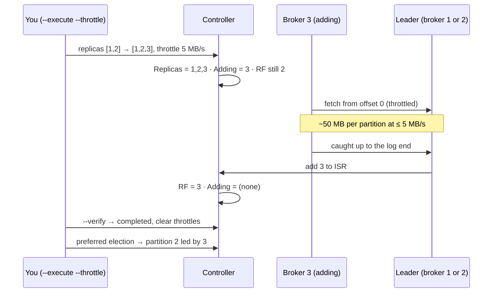

# Lab 02 — Executing Throttled Reassignments & Draining a Broker

| | |
| --- | --- |
| **Level** | Beginner → Intermediate |
| **Duration** | ~75 minutes |
| **Guide sections** | §4.1 Adding a broker moves nothing · §4.2 Decommissioning a broker · §5.1 What a reassignment does · §5.2 The three-step workflow · §5.4 Throttling · §3.4 Preferred leaders · §8.3 Hands-on Part C (C1–C2) |
| **You will need** | Docker on your VM, the Module 2 compose file, three terminals (one `docker exec` shell in kafka-1, one for a load generator, one on the host), `jq` on the host |

## Learning objectives

By the end of this lab you will be able to:

1. Build a deliberately unbalanced topic and measure where its bytes live,
   per broker.
2. Execute a **throttled** reassignment that raises the replication factor
   and spreads leaders, and follow it with `--list`, `--verify`, the
   `Adding Replicas` field and the throttle configs it sets.
3. Explain why a reassignment **adds before it removes**, and why
   `--verify` is the step that removes the throttle.
4. Rescue a move whose throttle is too low with `--execute --additional`,
   while a producer keeps writing, without losing a record.
5. **Cancel** a reassignment and restore the exact original replica order
   from the rollback plan.
6. Rehearse a broker decommission: **cordon** the broker, drain a topic off
   it, guard against accidental RF changes, and uncordon.

In Lab 01 the trainer executed your plan. Here you run every step yourself,
on a cluster that is yours to break.

---

## Part 1 — Start your cluster and build a lopsided topic (12 min)

Start the Module 2 cluster from this folder and wait for three `(healthy)`
nodes:

```bash
# (host) - from labs/module-05
docker compose -p kafka-m2 -f ../module-02/docker-compose.yml up -d
docker compose -p kafka-m2 -f ../module-02/docker-compose.yml ps
```

**Expected** after about 30 seconds:

```
NAME      IMAGE                COMMAND                  SERVICE   CREATED          STATUS                    PORTS
kafka-1   apache/kafka:4.3.1   "/__cacert_entrypoin…"   kafka-1   31 seconds ago   Up 30 seconds (healthy)   0.0.0.0:9092->9092/tcp, [::]:9092->9092/tcp
kafka-2   apache/kafka:4.3.1   "/__cacert_entrypoin…"   kafka-2   31 seconds ago   Up 30 seconds (healthy)   0.0.0.0:9094->9092/tcp, [::]:9094->9092/tcp
kafka-3   apache/kafka:4.3.1   "/__cacert_entrypoin…"   kafka-3   31 seconds ago   Up 30 seconds (healthy)   0.0.0.0:9096->9092/tcp, [::]:9096->9092/tcp
```

Open terminal 1 inside node 1 and set your prefix:

```bash
# (host) - terminal 1
docker exec -it kafka-1 bash
```

```bash
# (container)
ME=lNN
```

Create a topic the way a hurried administrator might have years ago:
**RF 2, every replica on brokers 1 and 2**, nothing on broker 3. This is
exactly what a cluster looks like right after you add a broker (guide §4.1):
the new broker is empty.

```bash
# (container)
kafka-topics.sh --bootstrap-server $BS --create --topic $ME.move.test \
  --replica-assignment 1:2,2:1,1:2

kafka-producer-perf-test.sh --bootstrap-server $BS --topic $ME.move.test \
  --num-records 150000 --record-size 1000 --throughput -1 --command-property acks=all

kafka-topics.sh --bootstrap-server $BS --describe --topic $ME.move.test
```

**Expected** (throughput numbers vary):

```
Created topic l07.move.test.
109425 records sent, 21885.0 records/sec (20.87 MB/sec), 1224.2 ms avg latency, 1812.0 ms max latency.
150000 records sent, 19374.838543 records/sec (18.48 MB/sec), 1281.15 ms avg latency, 2560.00 ms max latency, 1270 ms 50th, 2148 ms 95th, 2543 ms 99th, 2558 ms 99.9th.
Topic: l07.move.test	TopicId: q6t8O81ZR3Odgwr8kOJx6Q	PartitionCount: 3	ReplicationFactor: 2	Configs: min.insync.replicas=2
	Topic: l07.move.test	Partition: 0	Leader: 1	Replicas: 1,2	Isr: 1,2	Elr: 	LastKnownElr: 
	Topic: l07.move.test	Partition: 1	Leader: 2	Replicas: 2,1	Isr: 2,1	Elr: 	LastKnownElr: 
	Topic: l07.move.test	Partition: 2	Leader: 1	Replicas: 1,2	Isr: 1,2	Elr: 	LastKnownElr: 
```

Every `--create` of a topic with a `.` in its name also prints `WARNING: Due
to limitations in metric names, topics with a period ('.') or underscore ('_')
could collide…` first. It is harmless, and the expected outputs in this lab
leave it out.

(`--replica-assignment` lists the replicas of partition 0, 1, 2 separated by
commas; the first broker of each pair is the preferred leader. The topic
inherits the cluster's `min.insync.replicas=2`, so with RF 2 any single
broker failure would stop `acks=all` writes. One more reason to fix it.)

Measure the bytes per broker. `kafka-log-dirs.sh` prints one long JSON line
and `jq` lives on the host, so run this one from **terminal 3** on the host:

```bash
# (host) - terminal 3
ME=lNN
docker exec kafka-1 kafka-log-dirs.sh --bootstrap-server kafka-1:29092 \
  --describe --topic-list $ME.move.test | grep '^{' \
  | jq -r '.brokers[] | "broker \(.broker): \([.logDirs[].partitions[]] | length) replicas, \([.logDirs[].partitions[].size] | add // 0) bytes"'
```

**Expected:**

```
broker 1: 3 replicas, 151921875 bytes
broker 2: 3 replicas, 151921875 bytes
broker 3: 0 replicas, 0 bytes
```

About 150 MB on each of brokers 1 and 2, nothing on broker 3. Broker 1 also
leads two of the three partitions.

---

## Part 2 — A throttled reassignment, step by step (20 min)

Goal: RF 3 for every partition, and one preferred leader per broker. That
needs a hand-written plan: `--generate` can move replicas but never changes
the replication factor (guide §5.1).

```bash
# (container)
cat > /tmp/reassign.json <<EOF
{"version": 1, "partitions": [
  {"topic": "$ME.move.test", "partition": 0, "replicas": [1, 2, 3]},
  {"topic": "$ME.move.test", "partition": 1, "replicas": [2, 3, 1]},
  {"topic": "$ME.move.test", "partition": 2, "replicas": [3, 1, 2]}
]}
EOF
```

Broker 3 must copy ~150 MB. At a throttle of **5 MB/s** the copy takes about
30 seconds, long enough to watch. Execute, then run the commands below
straight away; they are read-only:

```bash
# (container)
kafka-reassign-partitions.sh --bootstrap-server $BS \
  --reassignment-json-file /tmp/reassign.json --execute --throttle 5000000
```

**Expected:**

```
Current partition replica assignment

{"version":1,"partitions":[{"topic":"l07.move.test","partition":0,"replicas":[1,2],"log_dirs":["/var/lib/kafka/data","/var/lib/kafka/data"]},{"topic":"l07.move.test","partition":1,"replicas":[2,1],"log_dirs":["/var/lib/kafka/data","/var/lib/kafka/data"]},{"topic":"l07.move.test","partition":2,"replicas":[1,2],"log_dirs":["/var/lib/kafka/data","/var/lib/kafka/data"]}]}

Save this to use as the --reassignment-json-file option during rollback
Warning: You must run --verify periodically, until the reassignment completes, to ensure the throttle is removed.
The inter-broker throttle limit was set to 5000000 B/s
Successfully started partition reassignments for l07.move.test-0,l07.move.test-1,l07.move.test-2
```

### 2.1 Watch it move

```bash
# (container)
kafka-reassign-partitions.sh --bootstrap-server $BS --list
kafka-topics.sh --bootstrap-server $BS --describe --topic $ME.move.test
kafka-topics.sh --bootstrap-server $BS --describe --under-replicated-partitions
```

**Expected** (while the copy runs):

```
Current partition reassignments:
l07.move.test-0: replicas: 1,2,3. adding: 3.
l07.move.test-1: replicas: 2,3,1. adding: 3.
l07.move.test-2: replicas: 3,1,2. adding: 3.
Topic: l07.move.test	TopicId: q6t8O81ZR3Odgwr8kOJx6Q	PartitionCount: 3	ReplicationFactor: 2	Configs: leader.replication.throttled.replicas=0:1,0:2,1:1,1:2,2:1,2:2,min.insync.replicas=2,follower.replication.throttled.replicas=0:3,1:3,2:3
	Topic: l07.move.test	Partition: 0	Leader: 1	Replicas: 1,2,3	Isr: 1,2	Adding Replicas: 3	Removing Replicas: 	Elr: 	LastKnownElr: 
	Topic: l07.move.test	Partition: 1	Leader: 2	Replicas: 2,3,1	Isr: 2,1	Adding Replicas: 3	Removing Replicas: 	Elr: 	LastKnownElr: 
	Topic: l07.move.test	Partition: 2	Leader: 1	Replicas: 3,1,2	Isr: 1,2	Adding Replicas: 3	Removing Replicas: 	Elr: 	LastKnownElr: 
```

The under-replicated filter prints nothing.

| Observation | Concept |
| ----------- | ------- |
| **`Replicas: 1,2,3` but `Isr: 1,2` and `Adding Replicas: 3`** | Broker 3 is a replica being added: it fetches from the leader but has not caught up yet (guide §5.1) |
| **`ReplicationFactor: 2` during the move** | The *target* RF only counts once the reassignment completes |
| **`--under-replicated-partitions` is empty** | Replicas still being added do not make a partition under-replicated; follow moves with `--list` and `--verify` instead |
| **`Leader: 1` for partition 2, whose new first replica is 3** | A reassignment does not move leadership unless it has to (Part 2.3) |

### 2.2 The throttle, as configuration

`--throttle` is not a flag stored in the tool: it writes **dynamic configs**
on the brokers and the topic (guide §5.4). Look at them while the move runs:

```bash
# (container)
kafka-configs.sh --bootstrap-server $BS --describe --entity-type brokers --entity-name 3
kafka-configs.sh --bootstrap-server $BS --describe --entity-type topics --entity-name $ME.move.test
```

**Expected:**

```
Dynamic configs for broker 3 are:
  follower.replication.throttled.rate=5000000 sensitive=false synonyms={DYNAMIC_BROKER_CONFIG:follower.replication.throttled.rate=5000000}
  leader.replication.throttled.rate=5000000 sensitive=false synonyms={DYNAMIC_BROKER_CONFIG:leader.replication.throttled.rate=5000000}
Dynamic configs for topic l07.move.test are:
  follower.replication.throttled.replicas=0:3,1:3,2:3 sensitive=false synonyms={DYNAMIC_TOPIC_CONFIG:follower.replication.throttled.replicas=0:3,1:3,2:3}
  leader.replication.throttled.replicas=0:1,0:2,1:1,1:2,2:1,2:2 sensitive=false synonyms={DYNAMIC_TOPIC_CONFIG:leader.replication.throttled.replicas=0:1,0:2,1:1,1:2,2:1,2:2}
```

Read the topic configs as `partition:broker` pairs. **Follower** throttled
replicas are the copies being created: broker 3 for every partition.
**Leader** throttled replicas are the existing copies the data is read
from: brokers 1 and 2. Only traffic between those pairs is throttled. Normal
replication of other partitions keeps full speed.

### 2.3 Verify until done

Run `--verify` every few seconds:

```bash
# (container)
kafka-reassign-partitions.sh --bootstrap-server $BS --reassignment-json-file /tmp/reassign.json --verify
```

**Expected** while copying:

```
Status of partition reassignment:
Reassignment of partition l07.move.test-0 is still in progress.
Reassignment of partition l07.move.test-1 is still in progress.
Reassignment of partition l07.move.test-2 is still in progress.

```

and after about 40 seconds:

```
Status of partition reassignment:
Reassignment of partition l07.move.test-0 is completed.
Reassignment of partition l07.move.test-1 is completed.
Reassignment of partition l07.move.test-2 is completed.

Clearing broker-level throttles on brokers 1,2,3
Clearing topic-level throttles on topic l07.move.test
```

The last two lines matter as much as the first three. Describe the configs
again: `Dynamic configs for broker 3 are:` and `Dynamic configs for topic
l07.move.test are:` are now followed by nothing.

> **Administrator rule:** a reassignment is finished when `--verify` has
> printed `Clearing … throttles`, not when the data has arrived. In Lab 01
> you saw what a throttle left behind looks like. On a busy cluster it slows
> every future follower catch-up on those brokers, and nobody remembers why.

### 2.4 Leaders follow only after an election

```bash
# (container)
kafka-leader-election.sh --bootstrap-server $BS --election-type preferred --all-topic-partitions
kafka-topics.sh --bootstrap-server $BS --describe --topic $ME.move.test
```

**Expected:**

```
Successfully completed leader election (PREFERRED) for partitions l07.move.test-2
Topic: l07.move.test	TopicId: q6t8O81ZR3Odgwr8kOJx6Q	PartitionCount: 3	ReplicationFactor: 3	Configs: min.insync.replicas=2
	Topic: l07.move.test	Partition: 0	Leader: 1	Replicas: 1,2,3	Isr: 1,2,3	Elr: 	LastKnownElr: 
	Topic: l07.move.test	Partition: 1	Leader: 2	Replicas: 2,3,1	Isr: 1,2,3	Elr: 	LastKnownElr: 
	Topic: l07.move.test	Partition: 2	Leader: 3	Replicas: 3,1,2	Isr: 1,2,3	Elr: 	LastKnownElr: 
```

Only partition 2 needed an election. Run the `jq` command from Part 1 again in
terminal 3: every broker now reports `3 replicas, 151921875 bytes`.



---

## Part 3 — A throttle that is too low (15 min)

Guide §5.4 warns that a throttle below the partition's write rate never
finishes. Prove it under a live producer, then rescue the move without
cancelling it.

Create an RF 2 archive topic with **all three leaders on broker 1** and give
it some history:

```bash
# (container) - terminal 1
kafka-topics.sh --bootstrap-server $BS --create --topic $ME.cdr.archive \
  --replica-assignment 1:2,1:2,1:2
kafka-producer-perf-test.sh --bootstrap-server $BS --topic $ME.cdr.archive \
  --num-records 60000 --record-size 1000 --throughput -1 --command-property acks=all | tail -1
```

**Expected:**

```
Created topic l07.cdr.archive.
60000 records sent, 26595.744681 records/sec (25.36 MB/sec), 862.38 ms avg latency, 1253.00 ms max latency, 904 ms 50th, 1232 ms 95th, 1248 ms 99th, 1251 ms 99.9th.
```

Now start a steady **1 MB/s** producer in **terminal 2**. It runs for 5
minutes; leave it alone:

```bash
# (host) - terminal 2
docker exec -it kafka-1 bash
```

```bash
# (container) - terminal 2
kafka-producer-perf-test.sh --bootstrap-server $BS --topic lNN.cdr.archive \
  --num-records 300000 --record-size 1000 --throughput 1000 --command-property acks=all
```

Back in terminal 1, move the archive so broker 3 takes part, with a throttle
of only **500 KB/s**:

```bash
# (container) - terminal 1
cat > /tmp/archive.json <<EOF
{"version": 1, "partitions": [
  {"topic": "$ME.cdr.archive", "partition": 0, "replicas": [3, 2]},
  {"topic": "$ME.cdr.archive", "partition": 1, "replicas": [2, 3]},
  {"topic": "$ME.cdr.archive", "partition": 2, "replicas": [3, 1]}
]}
EOF
kafka-reassign-partitions.sh --bootstrap-server $BS \
  --reassignment-json-file /tmp/archive.json --execute --throttle 500000 | tail -2
```

**Expected:**

```
The inter-broker throttle limit was set to 500000 B/s
Successfully started partition reassignments for l07.cdr.archive-0,l07.cdr.archive-1,l07.cdr.archive-2
```

Watch broker 3's copies and the leaders' log-end offsets. Run this pair three
or four times, about 15 seconds apart:

```bash
# (container) - terminal 1
kafka-log-dirs.sh --bootstrap-server $BS --describe --topic-list $ME.cdr.archive \
  --broker-list 3 2>/dev/null | grep '^{' | grep -oE '"partition":"[^"]+","size":[0-9]+'
kafka-get-offsets.sh --bootstrap-server $BS --topic $ME.cdr.archive
```

**Expected** (two of four samples shown):

```
"partition":"l07.cdr.archive-1","size":1037120
"partition":"l07.cdr.archive-0","size":1037120
"partition":"l07.cdr.archive-2","size":1037120
l07.cdr.archive:0:26229
l07.cdr.archive:1:25667
l07.cdr.archive:2:26384
…
"partition":"l07.cdr.archive-1","size":1037120
"partition":"l07.cdr.archive-0","size":1037120
"partition":"l07.cdr.archive-2","size":1037120
l07.cdr.archive:0:45177
l07.cdr.archive:1:43325
l07.cdr.archive:2:45042
```

In one minute the leaders gained about 19,000 records per partition. Broker 3's
copies did not grow at all: they stayed at 1,037,120 bytes. The copy has to
cover the 20 MB of history **and** about 330 KB/s of new data per partition,
with only 500 KB/s for all three together. This move will never finish.
`--list` confirms it is stuck mid-flight:

```bash
# (container) - terminal 1
kafka-reassign-partitions.sh --bootstrap-server $BS --list
```

**Expected:**

```
Current partition reassignments:
l07.cdr.archive-0: replicas: 3,2,1. adding: 3. removing: 1.
l07.cdr.archive-1: replicas: 2,3,1. adding: 3. removing: 1.
l07.cdr.archive-2: replicas: 3,1,2. adding: 3. removing: 2.
```

Each partition has three replicas (one being added, one waiting to be
removed). The copy on broker 1 or 2 is only removed after broker 3 catches up.
**Rescue it** by resubmitting the same plan with a higher throttle and
`--additional`:

```bash
# (container) - terminal 1
kafka-reassign-partitions.sh --bootstrap-server $BS --reassignment-json-file /tmp/archive.json \
  --execute --additional --throttle 50000000 | tail -2
kafka-configs.sh --bootstrap-server $BS --describe --entity-type brokers --entity-name 3
```

**Expected:**

```
The inter-broker throttle limit was set to 50000000 B/s
Successfully started partition reassignments for l07.cdr.archive-0,l07.cdr.archive-1,l07.cdr.archive-2
Dynamic configs for broker 3 are:
  follower.replication.throttled.rate=50000000 sensitive=false synonyms={DYNAMIC_BROKER_CONFIG:follower.replication.throttled.rate=50000000}
  leader.replication.throttled.rate=50000000 sensitive=false synonyms={DYNAMIC_BROKER_CONFIG:leader.replication.throttled.rate=50000000}
```

Within seconds, `--verify` reports all three partitions `completed` and
clears the throttles. Describe the topic:

```bash
# (container) - terminal 1
kafka-reassign-partitions.sh --bootstrap-server $BS --reassignment-json-file /tmp/archive.json --verify
kafka-topics.sh --bootstrap-server $BS --describe --topic $ME.cdr.archive
```

**Expected:**

```
Status of partition reassignment:
Reassignment of partition l07.cdr.archive-0 is completed.
Reassignment of partition l07.cdr.archive-1 is completed.
Reassignment of partition l07.cdr.archive-2 is completed.

Clearing broker-level throttles on brokers 1,2,3
Clearing topic-level throttles on topic l07.cdr.archive
Topic: l07.cdr.archive	TopicId: i2LMDEvOSMCmHtOcjC12Ug	PartitionCount: 3	ReplicationFactor: 2	Configs: min.insync.replicas=2
	Topic: l07.cdr.archive	Partition: 0	Leader: 3	Replicas: 3,2	Isr: 2,3	Elr: 	LastKnownElr: 
	Topic: l07.cdr.archive	Partition: 1	Leader: 2	Replicas: 2,3	Isr: 2,3	Elr: 	LastKnownElr: 
	Topic: l07.cdr.archive	Partition: 2	Leader: 1	Replicas: 3,1	Isr: 1,3	Elr: 	LastKnownElr: 
```

Partitions 0 and 1 changed leader because their old leader (broker 1) was
removed: the controller had to move leadership. Partition 2 kept broker 1,
which is still a replica.

Now look at **terminal 2**. When the leaders moved, the producer printed
warnings like:

```
WARN [Producer clientId=perf-producer-client] Got error produce response with correlation id 11998 on topic-partition l07.cdr.archive-1, retrying (2147483646 attempts left). Error: NOT_LEADER_OR_FOLLOWER (org.apache.kafka.clients.producer.internals.Sender)
```

These are **retries**, not failures: the producer refreshed its metadata and
sent to the new leader. Let it run to the end (about 5 minutes after you
started it) and keep its summary line for Part 4.

> **Tip:** to choose a throttle, start from the spare network capacity of
> the busiest broker involved, then check that it is well above the write rate
> of the partitions being moved (guide §5.4, §7.3). Raising it with
> `--additional` is safe. Cancelling throws away the copy made so far.

---

## Part 4 — Cancel a move and roll back exactly (10 min)

Sometimes the right decision is to stop: the plan was wrong, or the cluster
is in trouble. Start a move back onto brokers 1 and 2 with a deliberately
slow throttle, then cancel it:

```bash
# (container) - terminal 1
cat > /tmp/back.json <<EOF
{"version": 1, "partitions": [
  {"topic": "$ME.cdr.archive", "partition": 0, "replicas": [1, 2]},
  {"topic": "$ME.cdr.archive", "partition": 1, "replicas": [1, 2]},
  {"topic": "$ME.cdr.archive", "partition": 2, "replicas": [1, 2]}
]}
EOF
kafka-reassign-partitions.sh --bootstrap-server $BS --reassignment-json-file /tmp/back.json \
  --execute --throttle 500000 | sed -n 3p > /tmp/archive-rollback.json
cat /tmp/archive-rollback.json
kafka-reassign-partitions.sh --bootstrap-server $BS --list
```

`sed -n 3p` keeps the third line of the output, the "Current partition replica
assignment" JSON that the tool tells you to save.

**Expected:**

```
{"version":1,"partitions":[{"topic":"l07.cdr.archive","partition":0,"replicas":[3,2],"log_dirs":["/var/lib/kafka/data","/var/lib/kafka/data"]},{"topic":"l07.cdr.archive","partition":1,"replicas":[2,3],"log_dirs":["/var/lib/kafka/data","/var/lib/kafka/data"]},{"topic":"l07.cdr.archive","partition":2,"replicas":[3,1],"log_dirs":["/var/lib/kafka/data","/var/lib/kafka/data"]}]}
Current partition reassignments:
l07.cdr.archive-0: replicas: 1,2,3. adding: 1. removing: 3.
l07.cdr.archive-1: replicas: 1,2,3. adding: 1. removing: 3.
l07.cdr.archive-2: replicas: 1,2,3. adding: 2. removing: 3.
```

Cancel it:

```bash
# (container) - terminal 1
kafka-reassign-partitions.sh --bootstrap-server $BS --reassignment-json-file /tmp/back.json --cancel
kafka-reassign-partitions.sh --bootstrap-server $BS --list
kafka-topics.sh --bootstrap-server $BS --describe --topic $ME.cdr.archive
```

**Expected:**

```
Successfully cancelled partition reassignments for: l07.cdr.archive-0,l07.cdr.archive-1,l07.cdr.archive-2
None of the specified partition moves are active.Clearing broker-level throttles on brokers 1,2,3
Clearing topic-level throttles on topic l07.cdr.archive
No partition reassignments found.
Topic: l07.cdr.archive	TopicId: i2LMDEvOSMCmHtOcjC12Ug	PartitionCount: 3	ReplicationFactor: 2	Configs: min.insync.replicas=2
	Topic: l07.cdr.archive	Partition: 0	Leader: 3	Replicas: 2,3	Isr: 2,3	Elr: 	LastKnownElr: 
	Topic: l07.cdr.archive	Partition: 1	Leader: 2	Replicas: 2,3	Isr: 2,3	Elr: 	LastKnownElr: 
	Topic: l07.cdr.archive	Partition: 2	Leader: 1	Replicas: 1,3	Isr: 1,3	Elr: 	LastKnownElr: 
```

The half-made copies were dropped and the throttles cleared. Now compare
with the rollback file: partition 0 was `[3,2]` and is now `2,3`, and
partition 2 was `[3,1]` and is now `1,3`. **The brokers are right but the
order is not**, so the preferred leaders changed. Re-applying the saved
plan only reorders the lists. No data moves:

```bash
# (container) - terminal 1
kafka-reassign-partitions.sh --bootstrap-server $BS --reassignment-json-file /tmp/archive-rollback.json --execute | tail -1
kafka-reassign-partitions.sh --bootstrap-server $BS --reassignment-json-file /tmp/archive-rollback.json --verify | tail -4
kafka-leader-election.sh --bootstrap-server $BS --election-type preferred --all-topic-partitions
kafka-topics.sh --bootstrap-server $BS --describe --topic $ME.cdr.archive | grep Partition:
```

**Expected:**

```
Successfully started moving log directory to /var/lib/kafka/data for replica l07.cdr.archive-2 with broker 3 
Reassignment of replica l07.cdr.archive-1-3 completed successfully.
Reassignment of replica l07.cdr.archive-2-3 completed successfully.
Clearing broker-level throttles on brokers 1,2,3
Clearing topic-level throttles on topic l07.cdr.archive
Successfully completed leader election (PREFERRED) for partitions l07.cdr.archive-2
	Topic: l07.cdr.archive	Partition: 0	Leader: 3	Replicas: 3,2	Isr: 2,3	Elr: 	LastKnownElr: 
	Topic: l07.cdr.archive	Partition: 1	Leader: 2	Replicas: 2,3	Isr: 2,3	Elr: 	LastKnownElr: 
	Topic: l07.cdr.archive	Partition: 2	Leader: 3	Replicas: 3,1	Isr: 1,3	Elr: 	LastKnownElr: 
```

The "moving log directory" lines come from the `log_dirs` entries in the
saved file. The tool asks each broker to keep the replica in the directory it
already uses, which is a no-op with one data directory. The order is back to
`3,2` / `2,3` / `3,1`, and the election moved partition 2's leadership to
broker 3.

> **What this shows:** `--cancel` restores the original **set** of brokers,
> but you should still compare the result with the "Current partition replica
> assignment" you saved. Keep that JSON for every plan you execute. It is your
> rollback, and it is the only record of the preferred leaders you had.

When the producer in terminal 2 has finished, check that nothing was lost
through three moves and a cancel. Every record should be there **exactly
once**: 60,000 history + 300,000 live.

```bash
# (container) - terminal 1
kafka-get-offsets.sh --bootstrap-server $BS --topic $ME.cdr.archive | awk -F: '{s += $3} END {print s}'
```

**Expected** (terminal 2's last line, then the count):

```
300000 records sent, 999.510240 records/sec (0.95 MB/sec), 9.10 ms avg latency, 1083.00 ms max latency, 6 ms 50th, 14 ms 95th, 52 ms 99th, 871 ms 99.9th.
360000
```

---

## Part 5 — Rehearse a decommission: cordon and drain (13 min)

Decommissioning starts by stopping new data from landing on the broker
(guide §4.2). Kafka 4.x calls this **cordoning**: a dynamic broker config
that tells the controller not to place new replicas on those log
directories.

```bash
# (container) - terminal 1
kafka-configs.sh --bootstrap-server $BS --alter --entity-type brokers --entity-name 3 \
  --add-config cordoned.log.dirs="*"
kafka-configs.sh --bootstrap-server $BS --describe --entity-type brokers --entity-name 3
```

**Expected:**

```
Completed updating config for broker 3.
Dynamic configs for broker 3 are:
  cordoned.log.dirs=* sensitive=false synonyms={DYNAMIC_BROKER_CONFIG:cordoned.log.dirs=*, DEFAULT_CONFIG:cordoned.log.dirs=}
```

A colleague now creates a new topic during your maintenance window:

```bash
# (container) - terminal 1
kafka-topics.sh --bootstrap-server $BS --create --topic $ME.cdr.sms --partitions 3 --replication-factor 3
kafka-topics.sh --bootstrap-server $BS --create --topic $ME.cdr.sms --partitions 6 --replication-factor 2
kafka-topics.sh --bootstrap-server $BS --describe --topic $ME.cdr.sms
```

**Expected:**

```
Error while executing topic command : Unable to replicate the partition 3 time(s): The target replication factor of 3 cannot be reached because only 2 broker(s) are registered or some brokers have all their log directories cordoned.
…
Created topic l07.cdr.sms.
Topic: l07.cdr.sms	TopicId: PWy-yzEHSiuop7SmfoW8Qw	PartitionCount: 6	ReplicationFactor: 2	Configs: min.insync.replicas=2
	Topic: l07.cdr.sms	Partition: 0	Leader: 2	Replicas: 2,1	Isr: 2,1	Elr: 	LastKnownElr: 
	Topic: l07.cdr.sms	Partition: 1	Leader: 1	Replicas: 1,2	Isr: 1,2	Elr: 	LastKnownElr: 
	Topic: l07.cdr.sms	Partition: 2	Leader: 2	Replicas: 2,1	Isr: 2,1	Elr: 	LastKnownElr: 
	Topic: l07.cdr.sms	Partition: 3	Leader: 1	Replicas: 1,2	Isr: 1,2	Elr: 	LastKnownElr: 
	Topic: l07.cdr.sms	Partition: 4	Leader: 2	Replicas: 2,1	Isr: 2,1	Elr: 	LastKnownElr: 
	Topic: l07.cdr.sms	Partition: 5	Leader: 1	Replicas: 1,2	Isr: 1,2	Elr: 	LastKnownElr: 
```

With broker 3 cordoned, the cluster has only two usable brokers: RF 3 is
refused, and the RF 2 topic lands on brokers 1 and 2 only. You no longer
have to chase topics created during the drain.

Now drain `$ME.cdr.archive` off broker 3. Generate with only the remaining
brokers, then compare with what you get if you forget to leave broker 3 out:

```bash
# (container) - terminal 1
echo "{\"topics\": [{\"topic\": \"$ME.cdr.archive\"}], \"version\": 1}" > /tmp/drain.json
kafka-reassign-partitions.sh --bootstrap-server $BS --topics-to-move-json-file /tmp/drain.json \
  --broker-list "1,2" --generate | sed -n '/^Proposed/{n;p;}' > /tmp/drain-plan.json
cat /tmp/drain-plan.json
kafka-reassign-partitions.sh --bootstrap-server $BS --topics-to-move-json-file /tmp/drain.json \
  --broker-list "1,2,3" --generate | tail -1
```

**Expected** (orders vary):

```
{"version":1,"partitions":[{"topic":"l07.cdr.archive","partition":0,"replicas":[2,1],"log_dirs":["any","any"]},{"topic":"l07.cdr.archive","partition":1,"replicas":[1,2],"log_dirs":["any","any"]},{"topic":"l07.cdr.archive","partition":2,"replicas":[1,2],"log_dirs":["any","any"]}]}
{"version":1,"partitions":[{"topic":"l07.cdr.archive","partition":0,"replicas":[3,1],"log_dirs":["any","any"]},{"topic":"l07.cdr.archive","partition":1,"replicas":[1,2],"log_dirs":["any","any"]},{"topic":"l07.cdr.archive","partition":2,"replicas":[2,3],"log_dirs":["any","any"]}]}
```

The second plan puts replicas **back on the cordoned broker**. Cordoning
governs where the *controller* places new partitions. A plan you submit says
exactly where replicas go, so the `--broker-list` is still your
responsibility.

Execute the correct plan. Add `--disallow-replication-factor-change` as a
guard, which costs nothing (guide §5.2):

```bash
# (container) - terminal 1
kafka-reassign-partitions.sh --bootstrap-server $BS --reassignment-json-file /tmp/drain-plan.json \
  --execute --throttle 50000000 --disallow-replication-factor-change | tail -1
kafka-reassign-partitions.sh --bootstrap-server $BS --reassignment-json-file /tmp/drain-plan.json --verify | tail -3
kafka-topics.sh --bootstrap-server $BS --describe --topic $ME.cdr.archive
```

**Expected** (run `--verify` again if it still says `in progress`):

```
Successfully started partition reassignments for l07.cdr.archive-0,l07.cdr.archive-1,l07.cdr.archive-2

Clearing broker-level throttles on brokers 1,2,3
Clearing topic-level throttles on topic l07.cdr.archive
Topic: l07.cdr.archive	TopicId: i2LMDEvOSMCmHtOcjC12Ug	PartitionCount: 3	ReplicationFactor: 2	Configs: min.insync.replicas=2
	Topic: l07.cdr.archive	Partition: 0	Leader: 2	Replicas: 2,1	Isr: 1,2	Elr: 	LastKnownElr: 
	Topic: l07.cdr.archive	Partition: 1	Leader: 2	Replicas: 1,2	Isr: 1,2	Elr: 	LastKnownElr: 
	Topic: l07.cdr.archive	Partition: 2	Leader: 1	Replicas: 1,2	Isr: 1,2	Elr: 	LastKnownElr: 
```

What would the guard have caught? Try a plan that quietly adds a replica:

```bash
# (container) - terminal 1
echo "{\"version\":1,\"partitions\":[{\"topic\":\"$ME.cdr.sms\",\"partition\":0,\"replicas\":[2,1,3]}]}" > /tmp/rf.json
kafka-reassign-partitions.sh --bootstrap-server $BS --reassignment-json-file /tmp/rf.json \
  --execute --disallow-replication-factor-change 2>&1 | tail -2
```

**Expected:**

```
Error reassigning partition(s):
l07.cdr.sms-0: The replication factor is changed from 2 to 3
```

Which topics still have replicas on broker 3? Ask from terminal 3 on the host:

```bash
# (host) - terminal 3
docker exec kafka-1 kafka-log-dirs.sh --bootstrap-server kafka-1:29092 --describe --broker-list 3 \
  | grep '^{' \
  | jq -r '[.brokers[].logDirs[].partitions[].partition | sub("-[0-9]+$"; "")] | group_by(.) | map("\(.[0]): \(length)") | .[]'
```

**Expected:**

```
l07.move.test: 3
```

`$ME.cdr.archive` is gone from broker 3. `$ME.move.test` is not, and it
cannot be: with RF 3 on a three-broker cluster, every broker must hold a copy.
A real decommission needs somewhere for those replicas to go. That is why the
shared cluster has a fourth broker (Lab 01 drained broker 11 onto 12–14), and
why you would add the replacement broker **before** removing the old one. On a
long-lived cluster, the internal `__consumer_offsets` topic (RF 3) would be in
this list too.

End the rehearsal by **uncordoning** broker 3. In production you would
instead stop it and run `kafka-cluster.sh unregister --id 3` (guide §4.2):

```bash
# (container) - terminal 1
kafka-configs.sh --bootstrap-server $BS --alter --entity-type brokers --entity-name 3 \
  --delete-config cordoned.log.dirs
kafka-configs.sh --bootstrap-server $BS --describe --entity-type brokers --entity-name 3
```

**Expected:**

```
Completed updating config for broker 3.
Dynamic configs for broker 3 are:
```

---

## Checkpoint questions

<details>
<summary>1. During the move in Part 2, <code>--describe</code> showed <code>Replicas: 1,2,3</code> but <code>ReplicationFactor: 2</code>, and the under-replicated filter was empty. Explain all three.</summary>

A reassignment adds the new replica first: the replica list grows to the
target, with broker 3 marked as `Adding Replicas`. The topic's RF reflects
the committed assignment and only becomes 3 when the move completes. Replicas
still being added are excluded from the under-replicated check, because the
partition has every replica it had before. Durability never drops during a
move.
</details>

<details>
<summary>2. In Part 3, broker 3's copies stopped growing even though the throttle was 500 KB/s, not zero. Why can such a move never complete, and what is the right fix?</summary>

The new replica must copy the existing log **and** keep up with new writes.
Three partitions each received about 330 KB/s, more than the 500 KB/s shared
by all three. The copy cannot catch up, so the replica never joins the ISR
and the old replica is never removed. The fix is to resubmit the same plan with
`--execute --additional --throttle <higher>`. That changes the rate without
losing the copy already made, which a cancel would throw away.
</details>

<details>
<summary>3. Your plan completed an hour ago, but you never ran <code>--verify</code>. What is the cluster still carrying, and what is the risk?</summary>

The `leader/follower.replication.throttled.rate` configs on the brokers and the
`*.replication.throttled.replicas` lists on the topic. Any time one of those
replicas falls behind later (after a broker restart, for example), its catch-up
is limited to the old throttle rate. That makes recovery slow, and the cause is
hard to see. One `--verify` run after completion clears both.
</details>

<details>
<summary>4. After <code>--cancel</code>, the same brokers held the partitions but in a different order. Why does the order matter, and how did you fix it without moving data?</summary>

The first broker in the replica list is the preferred leader. A changed order
silently moves leadership, and with it produce and fetch load, the next time a
preferred election runs. Re-applying the saved "Current partition replica
assignment" JSON only reorders the lists (no new replicas, so no copy), and a
preferred election then puts leadership back where it was.
</details>

<details>
<summary>5. You cordoned broker 3, yet <code>--generate --broker-list "1,2,3"</code> proposed replicas on it. What does cordoning protect against, and what does it not?</summary>

Cordoning stops the **controller** from placing new partitions (new topics,
added partitions) on that broker, so nothing new arrives during a drain. It
does not check reassignment plans: a plan states exactly where replicas go, and
the controller follows it. The broker list you choose when you generate or
write a plan is the operator's responsibility.
</details>

<details>
<summary>6. Your manager asks you to "remove broker 3" from this three-node cluster tonight. What do you tell them?</summary>

Every RF 3 topic, and internal topics such as `__consumer_offsets`, needs
three brokers. Draining broker 3 would mean lowering RF everywhere, which
weakens durability and breaks the `min.insync.replicas=2` contract. On this
cluster broker 3 is also a controller, so removing it shrinks the quorum.
Add the replacement broker first, reassign onto it with a throttle, run a
preferred election, then drain, stop and unregister the old one.
</details>

---

## Clean up

Delete this lab's topics, but **leave the cluster running** for Lab 03:

```bash
# (container) - terminal 1
for t in move.test cdr.archive cdr.sms; do
  kafka-topics.sh --bootstrap-server $BS --delete --topic $ME.$t
done
kafka-topics.sh --bootstrap-server $BS --list
exit
```

**Expected:** the list prints nothing (no `$ME.*` topics left). Close
terminal 2 as well (`exit`).

**Next:** [Lab 03 — Simulating broker failure, recovery & a rolling restart](lab-03-broker-failure-recovery-rolling-restart.md)
