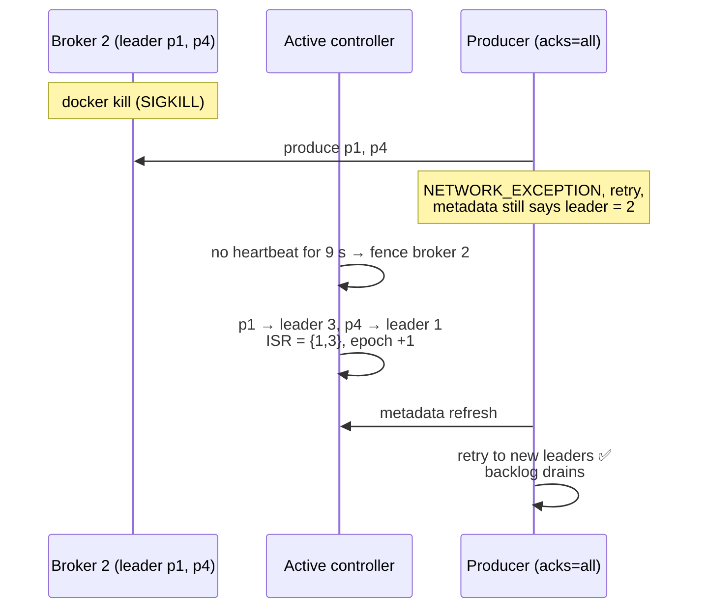

# Lab 03 — Simulating Broker Failure, Recovery & a Rolling Restart

| | |
| --- | --- |
| **Level** | Intermediate → Advanced |
| **Duration** | ~80 minutes |
| **Guide sections** | §2.2–§2.3 ISR and health states · §3.1–§3.2 Controller, fencing and anatomy of a failure · §3.4 Preferred leaders · §3.6 Failure scenarios · §6.1 Rolling restart loop · §6.2–§6.3 Upgrades and feature levels · §8.3 Part C (C3–C5) · §8.4 Part D |
| **You will need** | The `kafka-m2` cluster from Lab 02 running (no `$ME.*` topics left), three terminals (terminal 1: `docker exec` shell in kafka-1, terminal 2: host shell for compose commands, terminal 3: host shell for the load generator), the shared-cluster variables for Part 6 |

## Why this lab

Module 2 Lab 02 Part 5 and Module 3 Lab 03 already stopped a broker and read
the damage report. This lab asks the operator's questions instead. While real
`acks=all` traffic flows, **what does a client actually feel** when a broker
stops gracefully, compared with a broker that dies? How long do leaderships
stay on a dead broker? What does the returning broker do before it serves
again? And how do you restart **every** broker for an upgrade without anyone
noticing? A load generator runs throughout, and at the end you prove that not
one record was lost or duplicated.

## Learning objectives

By the end of this lab you will be able to:

1. Stop a broker **gracefully** under live `acks=all` traffic and read the
   ISR, the min-ISR state and the controller quorum while it is down.
2. Bring it back and rebalance leadership with a **preferred leader
   election**.
3. **Kill** a broker and measure how long its leaderships stay on the dead
   node before the controller **fences** it, and what the producer feels
   meanwhile.
4. Tell a clean restart from **log recovery** in the broker log, and explain
   why the Docker stop timeout matters.
5. Run a scripted **rolling restart** with a health gate between nodes and
   the active controller last, then finish it properly.
6. Read the cluster's **feature levels**, the second half of a KRaft upgrade,
   and follow a real broker failure on the shared cluster.

---

## Part 1 — A topic, a baseline and a load generator (10 min)

Terminal 1, inside node 1:

```bash
# (host) - terminal 1
docker exec -it kafka-1 bash
```

```bash
# (container) - terminal 1
ME=lNN
kafka-topics.sh --bootstrap-server $BS --create --topic $ME.cdr.ha --partitions 6 --replication-factor 3
kafka-topics.sh --bootstrap-server $BS --describe --topic $ME.cdr.ha
```

**Expected** (your replica orders may differ):

```
Created topic l07.cdr.ha.
Topic: l07.cdr.ha	TopicId: _hfDXqHlQz6I7rB-JbQSVw	PartitionCount: 6	ReplicationFactor: 3	Configs: min.insync.replicas=2
	Topic: l07.cdr.ha	Partition: 0	Leader: 1	Replicas: 1,2,3	Isr: 1,2,3	Elr: 	LastKnownElr: 
	Topic: l07.cdr.ha	Partition: 1	Leader: 2	Replicas: 2,3,1	Isr: 2,3,1	Elr: 	LastKnownElr: 
	Topic: l07.cdr.ha	Partition: 2	Leader: 3	Replicas: 3,1,2	Isr: 3,1,2	Elr: 	LastKnownElr: 
	Topic: l07.cdr.ha	Partition: 3	Leader: 3	Replicas: 3,2,1	Isr: 3,2,1	Elr: 	LastKnownElr: 
	Topic: l07.cdr.ha	Partition: 4	Leader: 2	Replicas: 2,1,3	Isr: 2,1,3	Elr: 	LastKnownElr: 
	Topic: l07.cdr.ha	Partition: 5	Leader: 1	Replicas: 1,3,2	Isr: 1,3,2	Elr: 	LastKnownElr: 
```

The production baseline: RF 3 with `min.insync.replicas=2` (inherited from
the cluster). You will count leaders per broker often. This one-liner does
it:

```bash
# (container) - terminal 1
kafka-topics.sh --bootstrap-server $BS --describe --topic $ME.cdr.ha \
  | awk '/Leader:/ {print "broker " $6}' | sort | uniq -c

kafka-metadata-quorum.sh --bootstrap-server $BS describe --status | grep -E "LeaderId|LeaderEpoch|CurrentVoters"
```

**Expected** (the active controller and epoch vary):

```
      2 broker 1
      2 broker 2
      2 broker 3
LeaderId:               1
LeaderEpoch:            10
CurrentVoters:          [{"id": 1, "endpoints": ["CONTROLLER://kafka-1:9093"]}, {"id": 2, "endpoints": ["CONTROLLER://kafka-2:9093"]}, {"id": 3, "endpoints": ["CONTROLLER://kafka-3:9093"]}]
```

Unlike the shared cluster in Lab 01, the voters **are** your brokers, and
there are no observers. Note which node is `LeaderId`; you need it in Part 5.

**Terminal 3** runs the client side of the story. This command starts a
throwaway container on the cluster's Docker network that writes **200
CDR-sized records per second with `acks=all`** for 5 minutes, and prints a
summary every 5 seconds:

```bash
# (host) - terminal 3
docker run --rm --name cdr-load --network kafka-net apache/kafka:4.3.1 \
  /opt/kafka/bin/kafka-producer-perf-test.sh \
  --bootstrap-server kafka-1:29092,kafka-2:29092,kafka-3:29092 \
  --topic lNN.cdr.ha --num-records 60000 --record-size 200 --throughput 200 \
  --command-property acks=all
```

**Expected** (a line every 5 seconds):

```
1004 records sent, 200.7 records/sec (0.04 MB/sec), 6.5 ms avg latency, 40.0 ms max latency.
```

> **Rules for the load generator:** start it now and go straight on to
> Part 2. Let every run finish by itself. Don't use `Ctrl+C`: a run
> interrupted that way prints no final summary, and Part 5's count no longer
> adds up. If a run ends before you finish a drill, start the same command
> again and note how many runs you have done. Each run writes exactly 60,000
> records.

---

## Part 2 — A graceful stop under traffic (15 min)

**Terminal 2**, on the host. Stop broker 3 the way an operator should, with
`SIGTERM` and enough time to finish:

```bash
# (host) - terminal 2, from labs/module-05
docker compose -p kafka-m2 -f ../module-02/docker-compose.yml stop --timeout 30 kafka-3
```

**Expected** (after 2–4 seconds):

```
 Container kafka-3 Stopping 
 Container kafka-3 Stopped 
```

> **Why `--timeout 30`?** `docker stop` sends `SIGTERM` and, if the process
> has not exited when the timeout runs out, `SIGKILL`. Docker's usual default
> is 10 seconds, but on one Docker Desktop installation used to test this lab
> it was **1 second**. Kafka was killed halfway through its controlled
> shutdown, and every restart had to recover its logs. Give the broker the
> time it needs. On servers the same setting is the systemd unit's
> `TimeoutStopSec`.

Read the damage report in terminal 1. `2>/dev/null` hides the
`Couldn't resolve server kafka-3:29092` warnings, because Docker removes a
stopped container's DNS name:

```bash
# (container) - terminal 1
kafka-topics.sh --bootstrap-server $BS --describe --topic $ME.cdr.ha 2>/dev/null
kafka-topics.sh --bootstrap-server $BS --describe --under-replicated-partitions 2>/dev/null | wc -l
kafka-topics.sh --bootstrap-server $BS --describe --at-min-isr-partitions 2>/dev/null | wc -l
kafka-topics.sh --bootstrap-server $BS --describe --under-min-isr-partitions 2>/dev/null | wc -l
```

**Expected:**

```
Topic: l07.cdr.ha	TopicId: _hfDXqHlQz6I7rB-JbQSVw	PartitionCount: 6	ReplicationFactor: 3	Configs: min.insync.replicas=2
	Topic: l07.cdr.ha	Partition: 0	Leader: 1	Replicas: 1,2,3	Isr: 1,2	Elr: 	LastKnownElr: 
	Topic: l07.cdr.ha	Partition: 1	Leader: 2	Replicas: 2,3,1	Isr: 2,1	Elr: 	LastKnownElr: 
	Topic: l07.cdr.ha	Partition: 2	Leader: 1	Replicas: 3,1,2	Isr: 1,2	Elr: 	LastKnownElr: 
	Topic: l07.cdr.ha	Partition: 3	Leader: 2	Replicas: 3,2,1	Isr: 2,1	Elr: 	LastKnownElr: 
	Topic: l07.cdr.ha	Partition: 4	Leader: 2	Replicas: 2,1,3	Isr: 2,1	Elr: 	LastKnownElr: 
	Topic: l07.cdr.ha	Partition: 5	Leader: 1	Replicas: 1,3,2	Isr: 1,2	Elr: 	LastKnownElr: 
6
6
0
```

All six partitions are under-replicated **and** at min ISR. Partitions 2 and 3
moved their leadership from broker 3 to another ISR member. Under min ISR is
0, so writes continue. Prove it with your own record:

```bash
# (container) - terminal 1
echo "still-writable" | kafka-console-producer.sh --bootstrap-server $BS \
  --topic $ME.cdr.ha --command-property acks=all 2>/dev/null
echo "exit code: $?"
```

**Expected:** `exit code: 0`. Remember this one extra record for Part 5.

Now the part that differs from the shared cluster: on this cluster broker 3
was also a **controller**.

```bash
# (container) - terminal 1
kafka-metadata-quorum.sh --bootstrap-server $BS describe --replication 2>/dev/null
```

**Expected:**

```
NodeId	DirectoryId           	LogEndOffset	Lag	LastFetchTimestamp	LastCaughtUpTimestamp	Status  	
1     	AAAAAAAAAAAAAAAAAAAAAA	5635        	0  	1791139754760     	1791139754760        	Leader  	
2     	AAAAAAAAAAAAAAAAAAAAAA	5635        	0  	1791139754363     	1791139754363        	Follower	
3     	AAAAAAAAAAAAAAAAAAAAAA	5610        	25 	1791139742819     	1791139742425        	Follower	
```

Voter 3's `Lag` grows and its `LastFetchTimestamp` stops. The quorum still
has 2 of 3 voters, a majority, so metadata changes (like the leader moves
you just saw) still work. If the node you stopped was the **active**
controller, `describe --status` now shows a different `LeaderId` and a
higher `LeaderEpoch`: a controller failover happened as well.

> **Do not stop a second node.** Two of three combined-mode nodes down means
> two of three controllers down. The quorum is lost and **no** leader
> election can happen at all (guide §3.6). On the shared cluster, with
> dedicated controllers, the same experiment would "only" push partitions
> under min ISR.

### 2.1 What the clients and the broker saw

Look at **terminal 3**. Around the moment of the stop you will find a short
burst of retries, all within a few milliseconds, then normal lines again:

```
[2026-10-04 18:49:00,435] WARN [Producer clientId=perf-producer-client] Got error produce response with correlation id 1471 on topic-partition l07.cdr.ha-2, retrying (2147483646 attempts left). Error: NOT_LEADER_OR_FOLLOWER (org.apache.kafka.clients.producer.internals.Sender)
…
990 records sent, 197.8 records/sec (0.04 MB/sec), 27.6 ms avg latency, 450.0 ms max latency.
1011 records sent, 202.2 records/sec (0.04 MB/sec), 8.7 ms avg latency, 87.0 ms max latency.
```

Worst case: under half a second, and no failed sends. The broker's own log
shows why:

```bash
# (host) - terminal 2
docker logs kafka-3 2>&1 | grep -E "Beginning controlled shutdown|asked us to exit controlled shutdown|Transition from SHUTTING_DOWN to SHUTDOWN" | tail -3
```

**Expected:**

```
[2026-10-04 18:49:00,188] INFO [BrokerLifecycleManager id=3] Beginning controlled shutdown. (org.apache.kafka.server.BrokerLifecycleManager)
[2026-10-04 18:49:02,419] INFO [BrokerLifecycleManager id=3] The controller has asked us to exit controlled shutdown. (org.apache.kafka.server.BrokerLifecycleManager)
[2026-10-04 18:49:02,743] INFO [BrokerServer id=3] Transition from SHUTTING_DOWN to SHUTDOWN (kafka.server.BrokerServer)
```

**Controlled shutdown** (guide §3.2): the broker asked the controller to move
its leaderships *before* it went away. Producers got one
`NOT_LEADER_OR_FOLLOWER`, refreshed their metadata and carried on.

---

## Part 3 — Recovery and leader balance (10 min)

```bash
# (host) - terminal 2
docker compose -p kafka-m2 -f ../module-02/docker-compose.yml start kafka-3
docker logs kafka-3 2>&1 | grep -E "Skipping recovery|Recovering [0-9]+ logs" | tail -1
```

**Expected:**

```
 Container kafka-3 Starting 
 Container kafka-3 Started 
[2026-10-04 18:49:29,940] INFO Skipping recovery of 9 logs from /var/lib/kafka/data since clean shutdown file was found (kafka.log.LogManager)
```

A completed graceful shutdown writes a **clean shutdown file**. On restart the
broker trusts its logs and skips recovery. (The count can include logs of
topics deleted in Lab 02 that are still waiting for cleanup.) After about 20
seconds:

```bash
# (container) - terminal 1
kafka-topics.sh --bootstrap-server $BS --describe --topic $ME.cdr.ha
kafka-topics.sh --bootstrap-server $BS --describe --topic $ME.cdr.ha \
  | awk '/Leader:/ {print "broker " $6}' | sort | uniq -c
```

**Expected:**

```
Topic: l07.cdr.ha	TopicId: _hfDXqHlQz6I7rB-JbQSVw	PartitionCount: 6	ReplicationFactor: 3	Configs: min.insync.replicas=2
	Topic: l07.cdr.ha	Partition: 0	Leader: 1	Replicas: 1,2,3	Isr: 1,2,3	Elr: 	LastKnownElr: 
	Topic: l07.cdr.ha	Partition: 1	Leader: 2	Replicas: 2,3,1	Isr: 1,2,3	Elr: 	LastKnownElr: 
	Topic: l07.cdr.ha	Partition: 2	Leader: 1	Replicas: 3,1,2	Isr: 1,2,3	Elr: 	LastKnownElr: 
	Topic: l07.cdr.ha	Partition: 3	Leader: 2	Replicas: 3,2,1	Isr: 1,2,3	Elr: 	LastKnownElr: 
	Topic: l07.cdr.ha	Partition: 4	Leader: 2	Replicas: 2,1,3	Isr: 1,2,3	Elr: 	LastKnownElr: 
	Topic: l07.cdr.ha	Partition: 5	Leader: 1	Replicas: 1,3,2	Isr: 1,2,3	Elr: 	LastKnownElr: 
      3 broker 1
      3 broker 2
```

The ISR is complete again: broker 3 fetched what it missed and rejoined. But
it **leads nothing**, and brokers 1 and 2 now do all the produce work. You can
wait for the automatic rebalance (up to `leader.imbalance.check.interval.seconds`
= 300 s, Lab 01 Part 1.3) or fix it now:

```bash
# (container) - terminal 1
kafka-leader-election.sh --bootstrap-server $BS --election-type preferred --all-topic-partitions
kafka-topics.sh --bootstrap-server $BS --describe --topic $ME.cdr.ha \
  | awk '/Leader:/ {print "broker " $6}' | sort | uniq -c
```

**Expected:**

```
Successfully completed leader election (PREFERRED) for partitions l07.cdr.ha-2, l07.cdr.ha-3
      2 broker 1
      2 broker 2
      2 broker 3
```

Back to one-third each. If the command prints nothing, the automatic
rebalance got there first.

---

## Part 4 — A hard failure: `docker kill` (15 min)

Now take broker 2 down **without warning**: `SIGKILL`, the container
equivalent of a power cut or `kill -9`. There is no controlled shutdown, so
the controller only learns about it when the heartbeats stop. Get both
terminals ready. Paste the loop in terminal 1 **immediately** after the kill
in terminal 2. The loop only asks nodes 1 and 3:

```bash
# (host) - terminal 2 (check terminal 3 is still running a load first)
docker kill kafka-2
```

```bash
# (container) - terminal 1
for i in $(seq 1 8); do
  echo "--- $(date +%T)"
  kafka-topics.sh --bootstrap-server kafka-1:29092,kafka-3:29092 --describe --topic $ME.cdr.ha 2>/dev/null \
    | grep Partition: | cut -f3-6
  sleep 1
done
```

**Expected** (the kill happened at about 18:50:08; trimmed to three samples):

```
--- 18:50:09
Partition: 0	Leader: 1	Replicas: 1,2,3	Isr: 1,2,3
Partition: 1	Leader: 2	Replicas: 2,3,1	Isr: 1,2,3
Partition: 2	Leader: 3	Replicas: 3,1,2	Isr: 1,2,3
Partition: 3	Leader: 3	Replicas: 3,2,1	Isr: 1,2,3
Partition: 4	Leader: 2	Replicas: 2,1,3	Isr: 1,2,3
Partition: 5	Leader: 1	Replicas: 1,3,2	Isr: 1,2,3
--- 18:50:14
Partition: 0	Leader: 1	Replicas: 1,2,3	Isr: 1,2,3
Partition: 1	Leader: 2	Replicas: 2,3,1	Isr: 1,2,3
Partition: 2	Leader: 3	Replicas: 3,1,2	Isr: 1,2,3
Partition: 3	Leader: 3	Replicas: 3,2,1	Isr: 1,2,3
Partition: 4	Leader: 2	Replicas: 2,1,3	Isr: 1,2,3
Partition: 5	Leader: 1	Replicas: 1,3,2	Isr: 1,2,3
--- 18:50:16
Partition: 0	Leader: 1	Replicas: 1,2,3	Isr: 1,3
Partition: 1	Leader: 3	Replicas: 2,3,1	Isr: 1,3
Partition: 2	Leader: 3	Replicas: 3,1,2	Isr: 1,3
Partition: 3	Leader: 3	Replicas: 3,2,1	Isr: 1,3
Partition: 4	Leader: 1	Replicas: 2,1,3	Isr: 1,3
Partition: 5	Leader: 1	Replicas: 1,3,2	Isr: 1,3
```

For **about seven seconds** the metadata still said broker 2 led partitions 1
and 4, with a full ISR, even though broker 2 was dead. Then everything
changed at once: the controller **fenced** broker 2 after
`broker.session.timeout.ms` (9 s) without a heartbeat, removed it from every
ISR and elected new leaders (guide §3.1).



Now look at **terminal 3**:

```
[2026-10-04 18:50:08,900] WARN [Producer clientId=perf-producer-client] Got error produce response with correlation id 8937 on topic-partition l07.cdr.ha-1, retrying (2147483646 attempts left). Error: NETWORK_EXCEPTION (org.apache.kafka.clients.producer.internals.Sender)
…
527 records sent, 50.2 records/sec (0.01 MB/sec), 20.4 ms avg latency, 7441.0 ms max latency.
2027 records sent, 405.0 records/sec (0.08 MB/sec), 2127.6 ms avg latency, 7444.0 ms max latency.
```

Between those lines you may also see `Connection to node 2 (kafka-2/…:29092)
could not be established` or `Error connecting to node kafka-2:29092`: the
producer trying to reconnect to the dead broker.
Throughput fell to a quarter while records for partitions 1 and 4 waited, then
doubled while the backlog drained. The worst latency was **seconds** instead
of the graceful stop's half second: 7.4 s here, and between 7 and 22 seconds
in other test runs, depending on which requests were in flight to the dead
broker. Yet still **no failed send**: the producer kept retrying within its
`delivery.timeout.ms` (120 s), exactly as Module 4 configured it.

| | Graceful stop (Part 2) | `docker kill` (Part 4) |
| --- | --- | --- |
| **Leadership moves** | Before the broker leaves | After fencing, ~7–9 s later |
| **Producer sees** | A few `NOT_LEADER_OR_FOLLOWER` retries | `NETWORK_EXCEPTION`, connection errors, a stall |
| **Worst latency** | < 0.5 s | 7–22 s |
| **Records lost (RF 3, min ISR 2, `acks=all`)** | 0 | 0 |

### 4.1 The price of a crash: log recovery

```bash
# (host) - terminal 2
docker compose -p kafka-m2 -f ../module-02/docker-compose.yml start kafka-2
docker logs kafka-2 2>&1 | grep -E "Recovering [0-9]+ logs|Loaded [0-9]+ logs" | tail -2
```

**Expected:**

```
 Container kafka-2 Starting 
 Container kafka-2 Started 
[2026-10-04 18:50:33,907] INFO Recovering 6 logs from /var/lib/kafka/data since no clean shutdown file was found (kafka.log.LogManager)
[2026-10-04 18:50:34,023] INFO Loaded 6 logs in 115ms (unclean log dirs = ArrayBuffer(/var/lib/kafka/data)) (kafka.log.LogManager)
```

Compare with broker 3 in Part 3 ("Skipping recovery … clean shutdown file was
found"). Without the clean shutdown file, broker 2 **rescanned** every
unflushed segment, rebuilding indexes and checking records, before it could
serve. Here that took 115 ms for a few MB. On a production broker with
terabytes it can take many minutes. This is why you never stop brokers with
`kill -9`, and why the stop timeout in Part 2 matters.

Wait 20 seconds, then check health and rebalance:

```bash
# (container) - terminal 1
kafka-topics.sh --bootstrap-server $BS --describe --under-replicated-partitions
kafka-leader-election.sh --bootstrap-server $BS --election-type preferred --all-topic-partitions
kafka-topics.sh --bootstrap-server $BS --describe --topic $ME.cdr.ha \
  | awk '/Leader:/ {print "broker " $6}' | sort | uniq -c
```

**Expected:** nothing from the first command (healthy), then:

```
Successfully completed leader election (PREFERRED) for partitions l07.cdr.ha-1, l07.cdr.ha-4
      2 broker 1
      2 broker 2
      2 broker 3
```

---

## Part 5 — A rolling restart behind a health gate (20 min)

An upgrade, a JVM flag or an OS patch means restarting **every** broker
(guide §6.1). The whole technique is the health gate: never touch the next
node until the cluster has zero under-replicated partitions again. In
combined mode, also restart the **active controller last**, so the controller
leadership moves only once.

Find the active controller:

```bash
# (container) - terminal 1
kafka-metadata-quorum.sh --bootstrap-server $BS describe --status | grep LeaderId
```

**Expected** (yours may differ):

```
LeaderId:               1
```

In terminal 3, wait for the current load run to finish (its last line starts
with `60000 records sent`), then **start a new run** with the same command as
in Part 1. While it runs, save this script in terminal 2 as
`labs/module-05/roll.sh`. Set `ORDER` so that your `LeaderId` comes **last**:

```bash
# (host) - terminal 2, from labs/module-05
cat > roll.sh <<'EOF'
dc()  { docker compose -p kafka-m2 -f ../module-02/docker-compose.yml "$@"; }
urp() { docker exec "$1" kafka-topics.sh --bootstrap-server kafka-1:29092,kafka-2:29092,kafka-3:29092 \
          --describe --under-replicated-partitions 2>/dev/null; }

ORDER="2 3 1"                      # active controller (LeaderId) LAST
for n in $ORDER; do
  probe=kafka-$(( n % 3 + 1 ))     # ask a node that stays up
  until [ -z "$(urp $probe)" ]; do echo "$(date +%T)   waiting: under-replicated partitions"; sleep 5; done
  echo "$(date +%T) restarting kafka-$n"
  dc restart --timeout 30 kafka-$n
  sleep 5                          # let the broker register before the next health check
done
until [ -z "$(urp kafka-1)" ]; do echo "$(date +%T)   waiting: under-replicated partitions"; sleep 5; done
echo "$(date +%T) rolling restart complete: under-replicated partitions = 0"
EOF
bash roll.sh
```

**Expected:**

```
00:23:59 restarting kafka-2
 Container kafka-2 Restarting 
 Container kafka-2 Started 
00:24:09   waiting: under-replicated partitions
00:24:16 restarting kafka-3
 Container kafka-3 Restarting 
 Container kafka-3 Started 
00:24:26   waiting: under-replicated partitions
00:24:33 restarting kafka-1
 Container kafka-1 Restarting 
 Container kafka-1 Started 
00:24:43 rolling restart complete: under-replicated partitions = 0
```

The `waiting` lines are the gate at work: kafka-2 was started but still
catching up, so the script held kafka-3 back until the ISR was full again.
Three brokers in about 45 seconds, never more than one down.

> **Note:** restarting kafka-1 ends your terminal 1 shell (it was running
> inside that container). Open it again with `docker exec -it kafka-1 bash`
> and set `ME=lNN`.

A rolling restart is not finished when the last node is up. Check the
leaders and the quorum:

```bash
# (container) - terminal 1
kafka-topics.sh --bootstrap-server $BS --describe --topic $ME.cdr.ha \
  | awk '/Leader:/ {print "broker " $6}' | sort | uniq -c
kafka-metadata-quorum.sh --bootstrap-server $BS describe --status | grep -E "LeaderId|LeaderEpoch"
kafka-leader-election.sh --bootstrap-server $BS --election-type preferred --all-topic-partitions
kafka-topics.sh --bootstrap-server $BS --describe --topic $ME.cdr.ha \
  | awk '/Leader:/ {print "broker " $6}' | sort | uniq -c
```

**Expected:**

```
      4 broker 2
      2 broker 3
LeaderId:               2
LeaderEpoch:            11
Successfully completed leader election (PREFERRED) for partitions l07.cdr.ha-0, l07.cdr.ha-5, l07.cdr.ha-3
      2 broker 1
      2 broker 2
      2 broker 3
```

The last node restarted (kafka-1 here) comes back leading nothing. Restarting
the active controller moved the controller role once (new `LeaderId`, epoch
+1). The preferred election restores the balance (guide §6.3, "After").

### 5.1 Count every record

When terminal 3 shows the new run's final line, which should read similar to
this:

```
60000 records sent, 199.944016 records/sec (0.04 MB/sec), 9.70 ms avg latency, 1019.00 ms max latency, 7 ms 50th, 13 ms 95th, 38 ms 99th, 771 ms 99.9th.
```

The worst latency across the whole rolling restart was about one second.
Now count what the cluster holds:

```bash
# (container) - terminal 1
kafka-get-offsets.sh --bootstrap-server $BS --topic $ME.cdr.ha | awk -F: '{s += $3} END {print s}'
```

**Expected** with two load runs (Parts 2–4 and Part 5) plus the
`still-writable` record:

```
120001
```

Every complete run adds exactly 60,000. A graceful stop, a crash, a log
recovery, three preferred elections and a full rolling restart: **zero
records lost, zero duplicated**. RF 3, `min.insync.replicas=2`, `acks=all`,
idempotent retries and `unclean.leader.election.enable=false` did their job.

### 5.2 The second half of an upgrade: feature levels

If this roll had installed new Kafka binaries, the cluster would now run new
software at its **old feature levels**, and rolling back would still be
possible. Raising them is a separate, one-way step (guide §6.2). Read where
your cluster stands:

```bash
# (container) - terminal 1
kafka-features.sh --bootstrap-server $BS describe
kafka-features.sh --bootstrap-server $BS version-mapping --release-version 4.3
```

**Expected:**

```
Feature: eligible.leader.replicas.version          SupportedMinVersion: 0                SupportedMaxVersion: 1                FinalizedVersionLevel: 1                Epoch: 6420
Feature: group.version                             SupportedMinVersion: 0                SupportedMaxVersion: 1                FinalizedVersionLevel: 1                Epoch: 6420
Feature: kraft.version                             SupportedMinVersion: 0                SupportedMaxVersion: 1                FinalizedVersionLevel: 0                Epoch: 6420
Feature: metadata.version                          SupportedMinVersion: 3.3-IV3          SupportedMaxVersion: 4.3-IV0          FinalizedVersionLevel: 4.3-IV0          Epoch: 6420
Feature: share.version                             SupportedMinVersion: 0                SupportedMaxVersion: 1                FinalizedVersionLevel: 1                Epoch: 6420
Feature: streams.version                           SupportedMinVersion: 0                SupportedMaxVersion: 1                FinalizedVersionLevel: 1                Epoch: 6420
Feature: transaction.version                       SupportedMinVersion: 0                SupportedMaxVersion: 2                FinalizedVersionLevel: 2                Epoch: 6420
metadata.version=30 (4.3)
kraft.version=1
transaction.version=2
group.version=1
eligible.leader.replicas.version=1
share.version=1
streams.version=1
```

| Column | Meaning |
| ------ | ------- |
| **`SupportedMin/MaxVersion`** | What the **software** on every node can run |
| **`FinalizedVersionLevel`** | What the **cluster** actually uses. Raised only by `kafka-features.sh upgrade` |
| **`version-mapping`** | The levels a given release would finalize |

`metadata.version` is already `4.3-IV0`, the maximum this software supports,
so there is nothing to finalize. Your cluster was formatted on 4.3.1. One
exception stands out: `kraft.version` is finalized at **0** although release
4.3 maps it to 1. Level 0 is the **static** controller quorum this compose
file configures (`KAFKA_CONTROLLER_QUORUM_VOTERS`). Level 1 enables the
dynamic quorum of KIP-853 (guide §4.3), and changing it is a deliberate
migration, not a side effect of an upgrade. After a real upgrade from, say,
4.2 to 4.3 you would soak for days, then run `kafka-features.sh upgrade
--release-version 4.3`, first with `--dry-run` (guide §6.2). From that point
there is no downgrade.

---

## Part 6 — The real thing: the trainer's failure demo on the shared cluster (10 min, trainer-led)

At an announced time the trainer stops one broker of the **shared** cluster
with a controlled shutdown, then starts it again (guide §8.4). You watch from
your VM with the shared-cluster variables from Lab 01 (`APACHE`, `CFG`,
`ME`).

Before the announced time, start a gentle `acks=all` producer on your own
topic. It sends 50 records per second for one minute:

```bash
# (VM) - terminal A
kafka-producer-perf-test.sh --topic $ME.cdr.voice --num-records 3000 --record-size 120 \
  --throughput 50 --command-config $CFG --command-property acks=all
```

While the demo runs, repeat these in terminal B every few seconds:

```bash
# (VM) - terminal B
kafka-topics.sh --bootstrap-server $APACHE --command-config $CFG --describe --topic $ME.cdr.voice 2>/dev/null
kafka-topics.sh --bootstrap-server $APACHE --command-config $CFG --describe --at-min-isr-partitions 2>/dev/null
kafka-broker-api-versions.sh --bootstrap-server $APACHE --command-config $CFG 2>/dev/null | grep "(id:"
```

**Expected** while broker 12 is down, with your topic on brokers 12–14 after
Lab 01 (from a replica of the course cluster; the trainer may stop a
different broker). The `--at-min-isr-partitions` filter lists the same six
partitions as the describe, so it is not repeated here:

```
Topic: l07.cdr.voice	TopicId: mF2JrFTrQz24LLmWmQiuzQ	PartitionCount: 6	ReplicationFactor: 3	Configs: min.insync.replicas=2,cleanup.policy=delete,segment.bytes=268435456,retention.ms=604800000,unclean.leader.election.enable=false
	Topic: l07.cdr.voice	Partition: 0	Leader: 13	Replicas: 12,13,14	Isr: 13,14	Elr: 	LastKnownElr: 
	Topic: l07.cdr.voice	Partition: 1	Leader: 13	Replicas: 13,14,12	Isr: 13,14	Elr: 	LastKnownElr: 
	Topic: l07.cdr.voice	Partition: 2	Leader: 14	Replicas: 14,12,13	Isr: 13,14	Elr: 	LastKnownElr: 
	Topic: l07.cdr.voice	Partition: 3	Leader: 14	Replicas: 12,14,13	Isr: 14,13	Elr: 	LastKnownElr: 
	Topic: l07.cdr.voice	Partition: 4	Leader: 14	Replicas: 14,13,12	Isr: 13,14	Elr: 	LastKnownElr: 
	Topic: l07.cdr.voice	Partition: 5	Leader: 13	Replicas: 13,12,14	Isr: 13,14	Elr: 	LastKnownElr: 
broker-13.lab.internal:9092 (id: 13 rack: ap-south-1c isFenced: false) -> (
broker-11.lab.internal:9092 (id: 11 rack: ap-south-1a isFenced: false) -> (
broker-14.lab.internal:9092 (id: 14 rack: ap-south-1a isFenced: false) -> (
```

and after the restart, once the ISR is full again:

```
	Topic: l07.cdr.voice	Partition: 0	Leader: 13	Replicas: 12,13,14	Isr: 12,13,14	Elr: 	LastKnownElr: 
	Topic: l07.cdr.voice	Partition: 3	Leader: 14	Replicas: 12,14,13	Isr: 12,13,14	Elr: 	LastKnownElr: 
…
```

The producer in terminal A should end without a single error:

```
3000 records sent, 49.965857 records/sec (0.01 MB/sec), 12.44 ms avg latency, 543.00 ms max latency, 9 ms 50th, 24 ms 95th, 78 ms 99th, 238 ms 99.9th.
```

Narrate what you saw, using this lab's vocabulary:

| Observation on the shared cluster | Concept | Where you saw it locally |
| --------------------------------- | ------- | ------------------------ |
| Every partition at min ISR, none under min ISR | One broker down with RF 3, min ISR 2 | Part 2 |
| The stopped broker disappears from `kafka-broker-api-versions.sh` | Unregistered broker; clients stop routing to it | Part 2 |
| Producer max latency well under a second, no errors | Controlled shutdown moved leaders first | Part 2.1 |
| ISR back to three, but broker 12 leads nothing | Rejoin as follower; leadership waits for an election | Part 3 |
| Leaders return after the trainer's election or within 5 minutes | Preferred election / `auto.leader.rebalance.enable` | Part 3 |
| No quorum change at all | Dedicated controllers: brokers are only observers | Lab 01 Part 1.2 vs Part 2 |

> **Why does the whole topic show at min ISR?** In Lab 01 you moved
> `$ME.cdr.voice` onto brokers 12, 13 and 14. Every partition has a replica
> on each of them, so stopping any one of the three touches every partition.
> Had the trainer stopped broker 11, your topic would not have noticed at all.

---

## Checkpoint questions

<details>
<summary>1. Both drills ended with zero lost records. So why does it matter whether a broker is stopped gracefully or killed?</summary>

Clients and recovery time. A graceful stop moves leaderships before the
broker leaves: producers see one retry and sub-second latency, and the
restart skips log recovery. A kill leaves leaderships on a dead broker until
the controller fences it (`broker.session.timeout.ms`, 9 s). Producers stall
for seconds, and the restart must rescan every unflushed segment, which takes
minutes on a big broker. Zero data loss came from RF 3 + min ISR 2 + `acks=all`
+ idempotent retries, not from the stop method.
</details>

<details>
<summary>2. Right after <code>docker kill kafka-2</code>, <code>--describe</code> still showed broker 2 as leader with a full ISR for about seven seconds. Was the metadata wrong?</summary>

It was out of date, by design. The controller only learns that a broker
died when its heartbeats stop arriving. It waits `broker.session.timeout.ms`
(9 s by default) before fencing it, so a short GC pause or network blip does
not cause a leadership storm. Lowering the timeout speeds up failover but
risks fencing healthy brokers. It is a trade-off, not a free improvement.
</details>

<details>
<summary>3. Your rolling restart script restarted a node, slept 5 seconds, and found under-replicated partitions. What would have happened without the gate?</summary>

The next broker would have been stopped while the previous one was still
catching up. For partitions with replicas on both, the ISR would drop to one,
below `min.insync.replicas=2`, and `acks=all` producers would get
`NotEnoughReplicasException`. On this combined-mode cluster two nodes down
would also lose the controller quorum. "Process started" is not "broker
healthy". Only URP = 0 is.
</details>

<details>
<summary>4. Why restart the active controller last in combined mode, and what changes on a cluster with dedicated controllers?</summary>

Each restart of the active controller forces a controller election, so doing
it last means the role moves once instead of up to three times. With
dedicated controllers (the shared cluster), brokers and controllers are rolled
as two separate passes. Broker restarts never touch the quorum. Controllers
are restarted one at a time, checking `kafka-metadata-quorum.sh describe
--status` between them, and usually the active one last.
</details>

<details>
<summary>5. After an upgrade roll to new binaries, a colleague wants to run <code>kafka-features.sh upgrade --release-version 4.3</code> immediately. What do you answer?</summary>

Not yet. Until the feature levels are raised, the cluster runs new software
with old metadata formats and can still be rolled back to the previous
binaries. Finalizing `metadata.version` is a one-way door. Soak first (days,
watching client error rates and broker health), run `--dry-run`, then
upgrade. Also check that every node really runs the new version: the upgrade
is refused otherwise (guide §6.2, §9).
</details>

<details>
<summary>6. Your Docker host kills containers one second after <code>docker stop</code>. Which symptoms would tell you, and why does it matter more in production?</summary>

The container exits with code 137 (SIGKILL) instead of 143. The broker log
stops mid-shutdown, and every restart logs `Recovering N logs … since no
clean shutdown file was found`. On a production broker, every "graceful"
restart then pays full log recovery, which can take minutes, and a rolling
restart becomes much slower and riskier. Fix the timeout: `--timeout`, a
compose `stop_grace_period`, or `TimeoutStopSec` in systemd.
</details>

---

## Clean up

When the last load run has finished, stop the cluster and delete its data.
Remove `roll.sh` if you don't want to keep it:

```bash
# (host) - from labs/module-05
docker rm -f cdr-load 2>/dev/null
rm -f roll.sh
docker compose -p kafka-m2 -f ../module-02/docker-compose.yml down -v
```

On the shared cluster, keep `$ME.cdr.voice` and `~/m5/` until the trainer
confirms all reassignments are complete (see the module
[README](README.md#cleaning-up-after-the-module)).

> **Next module:** *Module 6 — Introducing Confluent Kafka: Platform,
> Architecture & Administration Basics*, where you carry these core
> administration skills onto Confluent Platform and Confluent Cloud: the
> platform architecture, Confluent vs Apache Kafka features and licensing,
> deployment models, the Confluent CLI, and topic management through Control
> Center, including Self-Balancing Clusters, which run the reassignments you
> just did by hand.
