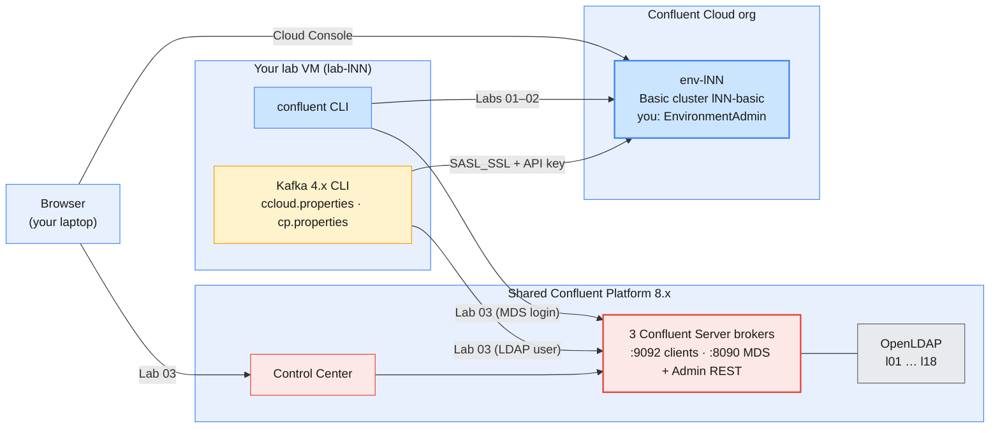

# Module 6 Labs — Introducing Confluent Kafka: Platform, Architecture & Administration Basics

> **Course:** Apache Kafka & Confluent Kafka Administration
> **Companion guide:** [`guides/module-06-introducing-confluent-kafka.md`](../../guides/module-06-introducing-confluent-kafka.md)
> **Module objective:** Transition core Kafka administration skills to the
> Confluent Kafka platform.

Modules 1–5 ran on Apache Kafka you could touch: containers, config files,
broker IDs. These labs move the same administration onto **Confluent**. You
start in your own **Confluent Cloud** environment (`env-lNN`): log in with the
Confluent CLI, find your cluster, create an API key, and then run the whole
topic lifecycle there with the Confluent CLI, the Cloud Console and the
Apache Kafka CLI you already know. The last lab moves to the **shared
self-managed Confluent Platform** cluster: Control Center, the Admin REST API
and RBAC-scoped topic management. Do the labs in order.

| # | Lab | Level | Time | What you will do |
| - | --- | ----- | ---- | ---------------- |
| 01 | [Confluent CLI, environments & authentication](lab-01-confluent-cli-environments-authentication.md) | Beginner | 55 min | Check your prepared configs, log in to Confluent Cloud, navigate organization → environment → cluster by ID, create and select a cluster API key, build `ccloud.properties`, reach Cloud with `kafka-topics.sh` |
| 02 | [Managing topics on Confluent Cloud](lab-02-managing-topics-confluent-cloud.md) | Beginner → Intermediate | 70 min | Create topics with explicit settings, hit the Cloud guardrails (RF, `min.insync.replicas`, broker configs), dry-run and apply config changes, produce and consume keyed CDRs, use the Cloud Console, delete safely |
| 03 | [Control Center & topic management on Confluent Platform](lab-03-control-center-topic-management-platform.md) | Intermediate → Advanced | 85 min | Inspect the shared Confluent Platform cluster with the Apache CLI, tour Control Center, create a topic in the UI and verify it from the CLI, log in to MDS and drive the Admin REST API with the Confluent CLI, prove RBAC prefix scoping, compare Confluent Server with Apache Kafka |

Estimated total: **about 3 h 30 min**, including checkpoint questions.

> **Trainers:** the environment these labs need (Confluent Cloud
> subscription, per-learner environments, the Confluent Platform enterprise
> cluster, LDAP users, RBAC bindings and the config files on every VM) is set
> up with the kit in [`setup/`](setup/README.md). Run it before day 1 and
> dry-run all three labs on `lab-l01`.

---

## Prerequisites

| Requirement | Check with | Notes |
| ----------- | ---------- | ----- |
| Confluent Cloud invitation accepted | You can log in at `https://confluent.cloud` | The invite comes by e-mail; set a password when you accept it |
| Confluent CLI on the VM | `confluent version` | Installed in the golden image; v4.x |
| Kafka 4.x CLI on `PATH` | `kafka-topics.sh --version` | Same tools as Modules 3–5 |
| Your learner prefix `lNN` | The credentials e-mail you received | Every topic and group starts with `$ME.` |
| Endpoint file `~/kafka/confluent.env` | `cat ~/kafka/confluent.env` | Written by the trainer; endpoints only, no secrets |
| Platform client config `~/kafka/cp.properties` + CA `~/kafka/cp-ca.pem` | `ls -l ~/kafka/` | Your LDAP user for the shared Confluent Platform cluster (Lab 03) |
| Your LDAP password | The credentials e-mail | Control Center and `confluent login --url` (Lab 03) |
| `jq` | `jq --version` | Reads `-o json` output |
| A browser on your laptop | — | Cloud Console (Labs 01–02) and Control Center (Lab 03) |

> **No Docker in this module.** Nothing here runs locally, so there are no
> ports to free. If your Module 5 cluster is still running, stop it to give
> the VM its memory back:
>
> ```bash
> # (VM) - from labs/module-05
> docker compose -p kafka-m2 -f ../module-02/docker-compose.yml down -v
> ```

> **Using the course AWS VMs?** Your VM (`lab-lNN`) already has the Confluent
> CLI, the Kafka CLI, `jq` and the prepared files under `~/kafka/`. Open it in
> the browser IDE or VS Code Remote-SSH and run the labs there exactly as
> written. See [`infra/LAB-SETUP.md`](../../infra/LAB-SETUP.md) §5–§7 for the
> full course environment.

> **Studying on your own?** Lab 01 and Lab 02 work in a personal Confluent
> Cloud trial organization (new organizations get free credit). Follow
> [`setup/README.md` Part C](setup/README.md#part-c--self-study-your-own-trial-organization)
> to create an environment and a Basic cluster first. Lab 03 needs a
> Confluent Platform cluster with RBAC and Control Center.

---

## Lab environment

From this module on there is no local cluster. You work against two
Confluent targets, as laid out in the course lab setup
(`infra/LAB-SETUP.md` §5–§6 and guide §2.4):



| Target | Endpoint | Credentials | Your rights | Names used in the labs |
| ------ | -------- | ----------- | ----------- | ---------------------- |
| **Confluent Cloud** (Labs 01–02) | Bootstrap from `confluent kafka cluster describe` (`$CCLOUD`) | Cloud login; cluster API key you create in Lab 01 → `~/kafka/ccloud.properties` (`$CC_CFG`) | **EnvironmentAdmin** on `env-lNN` | Topics `$ME.cdr.voice`, `$ME.cdr.sms`, `$ME.cdr.console`; group `$ME.billing` |
| **Shared Confluent Platform** (Lab 03) | `$CP` = `cp-kafka.lab.internal:9092`; `$MDS_URL`, `$CP_REST`, `$C3_URL` from `~/kafka/confluent.env` | LDAP user `lNN`: `~/kafka/cp.properties` (`$CFG`) | `ResourceOwner` on topics and groups `lNN.*`; cluster `Describe` only | Topics `$ME.cdr.data`, `$ME.cdr.roaming` |

### Everyday commands

In every new terminal:

```bash
# (VM)
source ~/kafka/confluent.env            # CP, MDS_URL, CP_REST, C3_URL, CP_CA (no secrets)
ME=lNN                                  # your prefix: l01 … l18
CFG=~/kafka/cp.properties               # shared Confluent Platform (Lab 03)
CC_CFG=~/kafka/ccloud.properties        # your Confluent Cloud cluster (created in Lab 01)

confluent context list                  # which login is current? (* marks it)
confluent kafka cluster describe        # which Cloud cluster will the next command hit?
```

> **Convention used in the labs**
>
> - `# (VM)`: run on **your lab VM**, against Confluent Cloud or the shared
>   Confluent Platform cluster, with your prefix (`$ME`) and the config files
>   above. Every command block in this module uses it.
> - **Browser** steps (Cloud Console, Control Center) are written as
>   numbered *Menu → Item* paths, not code blocks.

---

## Troubleshooting

| Symptom | Likely cause | Fix |
| ------- | ------------ | --- |
| `Error: expired token` / `Error: not logged in` | Cloud session ended (1 h) and credentials were not saved | `confluent login --save` (Lab 01 Part 2) |
| `No Kafka cluster selected` / topic command asks for `--cluster` | Environment or cluster not selected in this context | `confluent environment use <env-id>`, `confluent kafka cluster use <lkc-id>` |
| `confluent kafka topic produce` asks for an API key | No key stored and selected for this cluster | `confluent api-key create --resource <lkc-id> --use` (Lab 01 Part 4) |
| `SaslAuthenticationException` from `kafka-topics.sh` against Cloud right after creating a key | Key not propagated yet, or key/secret pasted wrong | Wait 1–2 minutes; check `sasl.jaas.config` in `$CC_CFG` |
| Topic create rejected for `replication.factor` or `min.insync.replicas=3` (Lab 02) | Expected: Cloud fixes RF at 3 and allows `min.insync.replicas` 1 or 2 | Drop the setting / use 2 (guide §7.4) |
| `topic create` on Platform: `--url` required, or `401 Unauthorized` | Platform topic commands go to the Admin REST API with your MDS token | Add `--url $CP_REST`; `confluent login --url $MDS_URL --certificate-authority-path $CP_CA` (Lab 03 Part 4) |
| `x509: certificate signed by unknown authority` / `PKIX path building failed` | Platform uses the course CA, which the client does not trust | Pass `--certificate-authority-path $CP_CA`; check `ssl.truststore.location` in `$CFG` |
| `TopicAuthorizationException` / `403 Forbidden` on a topic outside `lNN.` | Expected: your role bindings cover only your prefix | Use your own prefix (Lab 03 Part 5) |

---

## Cleaning up after the module

Each lab deletes the throwaway topics it creates. Keep these for Modules 7–10:

- Confluent Cloud: the topic `$ME.cdr.voice` and the group `$ME.billing`.
- The API key from Lab 01 and `~/kafka/ccloud.properties` (Module 7 replaces
  it with a service-account key and deletes the user-owned one).
- Your saved CLI contexts (`confluent context list`).

To remove everything you created in Cloud in this module:

```bash
# (VM)
confluent kafka topic delete $ME.cdr.voice --force
confluent api-key delete <API_KEY> --force
rm -f ~/kafka/ccloud.properties
```

This deletes data and credentials only; your environment and cluster stay,
and nothing on the shared Confluent Platform cluster except your own `$ME.*`
topics is ever touched. The trainer deletes the whole Cloud organization at
the end of the course ([`setup/README.md` Part D](setup/README.md#part-d--teardown)).
