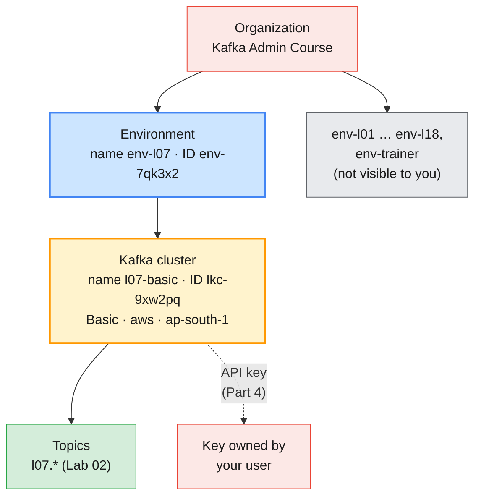
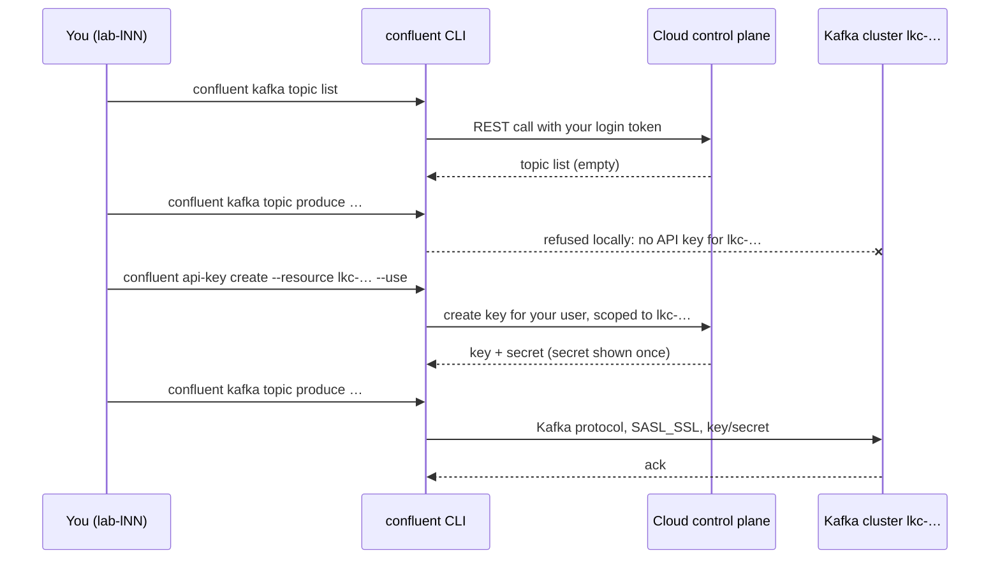

# Lab 01 — Confluent CLI, Environments & Authentication

| | |
| --- | --- |
| **Level** | Beginner |
| **Duration** | ~55 minutes |
| **Guide sections** | §2.4 The course's Confluent environments · §4.2 The Confluent Cloud resource hierarchy · §4.3 Cluster types · §5.1–§5.4 Confluent CLI, login, contexts, API keys · §5.6 The Apache Kafka CLI still works · §6.3 The Cloud Console · §8.1 Hands-on Part A |
| **You will need** | Your lab VM, the Confluent Cloud invitation accepted, your prefix `lNN`, a browser on your laptop, one terminal |

## Learning objectives

By the end of this lab you will be able to:

1. Check that your VM holds everything the Confluent labs need, and say
   which file is used for which target.
2. **Log in** to Confluent Cloud with the Confluent CLI, keep the session
   alive with `--save`, and read the current **context**.
3. Navigate **organization → environment → cluster** by **ID** in the CLI and
   in the Cloud Console, and record the IDs every later command needs.
4. Explain the difference between the **control plane** (your login) and the
   **data plane** (an API key), and create, select and list a cluster API key.
5. Build a client config from that key and use **`kafka-topics.sh`** against
   Confluent Cloud, proving it is the same Kafka protocol as Modules 2–5.

The examples use `l07` as the prefix. Your IDs (`env-…`, `lkc-…`, `pkc-…`)
and keys differ; the shapes do not.

---

## Part 1 — Check your prepared environment (8 min)

The trainer prepared three files on your VM before the course (see
[`setup/README.md` Part B.7](setup/README.md#b7-distribute-client-files-to-the-lab-vms)).
Open a terminal and look at them:

```bash
# (VM)
ls -l ~/kafka/
```

**Expected:**

```
-rw------- 1 learner learner … apache.properties
-rw-r--r-- 1 learner learner … confluent.env
-rw-r--r-- 1 learner learner … cp-ca.pem
-rw------- 1 learner learner … cp.properties
```

| File | Target | Contains | Used in |
| ---- | ------ | -------- | ------- |
| **`apache.properties`** | Shared Apache Kafka cluster | Your SCRAM user (Modules 3–5) | Comparisons in Modules 7–8 |
| **`cp.properties`** | Shared Confluent Platform | Your LDAP user over `SASL_SSL` / `PLAIN` | Lab 03 |
| **`cp-ca.pem`** | Shared Confluent Platform | The course CA certificate that signed the broker certificates | Lab 03 |
| **`confluent.env`** | Both | Endpoints only — **no secrets** | Every lab |

The two `.properties` files are mode `600` because they hold passwords. The
endpoint file is safe to read:

```bash
# (VM)
cat ~/kafka/confluent.env
```

**Expected** (the trainer's values for the course environment):

```
# Confluent endpoints for the Module 6-10 labs. No secrets in this file.
export CP=cp-kafka.lab.internal:9092
export MDS_URL=https://cp-kafka.lab.internal:8090
export CP_REST=https://cp-kafka.lab.internal:8090/kafka
export CP_CA=$HOME/kafka/cp-ca.pem
export C3_URL=https://c3.kafka.supercloudlabs.com
```

> **Note:** if your file shows a different Control Center URL, use yours. The
> labs never hard-code it; they always say `$C3_URL`.

Now set the variables this lab uses and check the CLI versions:

```bash
# (VM)
source ~/kafka/confluent.env
ME=lNN                          # your learner prefix: l01 … l18
confluent version | head -3
kafka-topics.sh --version
```

**Expected** (versions may be newer):

```
confluent - Confluent CLI

Version:     v4.56.0
4.3.1
```

> **What this shows:** one VM, two toolsets. The Apache Kafka CLI talks to
> brokers over the Kafka protocol; the Confluent CLI mostly talks to
> **control-plane and REST APIs** (guide §5.1). You use both in this module.

---

## Part 2 — Log in to Confluent Cloud (10 min)

### 2.1 Explore before you log in

The CLI's help is the fastest map of what it can do:

```bash
# (VM)
confluent --help | sed -n '/Available Commands/,/Flags/p'
confluent kafka topic --help | sed -n '/Available Commands/,/Global/p'
```

**Expected** (`kafka topic` part):

```
Available Commands:
  configuration Manage topic configuration.
  consume       Consume messages from a Kafka topic.
  create        Create a Kafka topic.
  delete        Delete one or more Kafka topics.
  describe      Describe a Kafka topic.
  list          List Kafka topics.
  produce       Produce messages to a Kafka topic.
  update        Update a Kafka topic.
```

> **Tip:** the flags a command shows depend on **where you are logged in**.
> Logged in to Cloud, `confluent kafka topic create --help` has no
> `--replication-factor`; logged in to Platform it has, plus `--url`. Run
> `--help` again in Lab 03 and compare.

### 2.2 Log in and save the credentials

```bash
# (VM)
confluent login --save
```

Enter the e-mail address the invitation was sent to and the password you
chose when you accepted it.

**Expected:**

```
Enter your Confluent Cloud credentials:
Email: l07.learner@example.com
Password: ****************
Logged in as "l07.learner@example.com" for organization "…" ("Kafka Admin Course").
```

| Flag | Why you use it here |
| ---- | ------------------- |
| **`--save`** | Stores your user name and an **encrypted** password in `~/.confluent/`, so the CLI logs you back in when the token expires (after one hour for Confluent Cloud) |
| `--organization <id>` | Only if your user belongs to several organizations |
| `--no-browser` | Only for SSO users on a headless VM: copy the URL to your laptop's browser |

> **Common trap:** logging in without `--save` and coming back from lunch to
> `Error: expired token`. The session token is short-lived on purpose; the
> CLI's own help says it refreshes after one hour for Cloud and six hours for
> Platform.

### 2.3 Read your context

A **context** is one login plus the environment, cluster and API key that the
next commands default to — the CLI's version of a kubeconfig context
(guide §5.3):

```bash
# (VM)
confluent context list
```

**Expected:**

```
  Current |                          Name                          |    Platform     |            Credential
----------+--------------------------------------------------------+-----------------+-----------------------------------
  *       | login-l07.learner@example.com-https://confluent.cloud  | confluent.cloud | username-l07.learner@example.com
```

```bash
# (VM)
confluent context describe
```

The description shows the same name, platform and credential, plus the
current environment and cluster once you select them in Part 3. Run it again
at the end of the lab and compare.

---

## Part 3 — Navigate organization → environment → cluster (15 min)



### 3.1 Your environment

```bash
# (VM)
confluent environment list
```

**Expected:**

```
  Current |     ID     |  Name   | Stream Governance Package
----------+------------+---------+----------------------------
          | env-7qk3x2 | env-l07 | ESSENTIALS
```

You see **one** environment: you are `EnvironmentAdmin` on `env-lNN` and
have no role anywhere else in the organization. The trainer sees all
nineteen.

The name `env-l07` is a **display name**; every command wants the **ID**
(guide §4.2). Select it and keep it in a variable:

```bash
# (VM)
ENV_ID=env-7qk3x2               # ← your ID from the list above
confluent environment use $ENV_ID
```

**Expected:**

```
Using environment "env-7qk3x2".
```

Check what the trainer granted you:

```bash
# (VM)
confluent iam rbac role-binding list --current-user --environment $ENV_ID --inclusive
```

**Expected:** one row with the role **`EnvironmentAdmin`** and your
environment ID. That single binding is why you may create API keys, topics
and (in Module 7) role bindings here, and nowhere else.

### 3.2 Your cluster

```bash
# (VM)
confluent kafka cluster list
```

**Expected:**

```
  Current |     ID     |   Name    | Type  | Cloud |   Region   | Availability | Network | Status
----------+------------+-----------+-------+-------+------------+--------------+---------+---------
          | lkc-9xw2pq | l07-basic | BASIC | aws   | ap-south-1 | single-zone  |         | UP
```

```bash
# (VM)
LKC=lkc-9xw2pq                  # ← your cluster ID
confluent kafka cluster use $LKC
confluent kafka cluster describe
```

**Expected** (abridged):

```
Set Kafka cluster "lkc-9xw2pq" as the active cluster for environment "env-7qk3x2".
+----------------------+-----------------------------------------------------------+
| Current              | true                                                      |
| ID                   | lkc-9xw2pq                                                |
| Name                 | l07-basic                                                 |
| Type                 | BASIC                                                     |
…
| Cloud                | aws                                                       |
| Region               | ap-south-1                                                |
| Availability         | single-zone                                               |
| Status               | UP                                                        |
| Endpoint             | SASL_SSL://pkc-xxxxx.ap-south-1.aws.confluent.cloud:9092  |
| REST Endpoint        | https://pkc-xxxxx.ap-south-1.aws.confluent.cloud:443      |
| Topic Count          | 0                                                         |
+----------------------+-----------------------------------------------------------+
```

Keep the bootstrap endpoint without the `SASL_SSL://` prefix; Part 5 needs it:

```bash
# (VM)
CCLOUD=$(confluent kafka cluster describe -o json | jq -r .endpoint | sed 's#SASL_SSL://##')
echo $CCLOUD
```

**Expected:**

```
pkc-xxxxx.ap-south-1.aws.confluent.cloud:9092
```

Fill in this table in your notes. Every Confluent lab from here to Module 10
starts from it:

| Item | Display name | ID / value |
| ---- | ------------ | ---------- |
| Environment | `env-lNN` | `env-…` |
| Kafka cluster | `lNN-basic` | `lkc-…` |
| Bootstrap endpoint | — | `pkc-….confluent.cloud:9092` |
| REST endpoint | — | `https://pkc-….confluent.cloud:443` |
| Cluster type / cloud / region | — | Basic · aws · ap-south-1 |

> **Design note:** a Basic cluster is a development tier (guide §4.3). It is
> right for 18 learners with one environment each; the billing pipeline of a
> real operator belongs on Standard or above, like the trainer's
> `env-trainer` cluster.

### 3.3 The same objects in the Cloud Console

On your laptop, open `https://confluent.cloud` and log in with the same
e-mail address:

1. **Environments** → `env-lNN`. Compare the ID in the page header with
   `$ENV_ID`.
2. Open the cluster `lNN-basic` → **Cluster Settings**. Find the bootstrap
   server, REST endpoint, cloud, region and cluster type, and check each one
   against `confluent kafka cluster describe`.
3. Look at the left menu of the cluster: **Topics**, **Clients**, **API Keys**,
   **Cluster Settings**. There is no **Brokers** page — on Cloud, brokers are
   Confluent's job (guide §4.1).
4. Open **Administration** (top-right menu) → **Accounts & access**. You can
   see your own user; the organization-level pages you lack rights for are
   greyed out or empty.

> **What this shows:** the CLI and the Console are two views of one
> resource hierarchy. Anything you click in the Console has a CLI equivalent,
> and only the CLI version can go into a script or a change ticket.

---

## Part 4 — API keys: control plane vs data plane (12 min)



### 4.1 Management works with your login alone

```bash
# (VM)
confluent kafka topic list
```

**Expected:** an empty list (or only the column headers). No API key was
needed: listing topics is a **control-plane** REST call made with your login
token.

### 4.2 Data needs a key

Try to produce to a topic. The topic need not exist yet; the CLI stops
before it even connects:

```bash
# (VM)
confluent kafka topic produce $ME.cdr.voice
```

**Expected:** the command fails with an error saying that **no API key is
selected** for cluster `lkc-…`, with suggestions to create one or select one
with `confluent api-key use`. Producing and consuming are **data-plane**
operations: they use the Kafka protocol, and Confluent Cloud only accepts an
API key and secret there (guide §5.4).

### 4.3 Create, select and list a key

```bash
# (VM)
confluent api-key create --resource $LKC --description "$ME module 6 CLI"
```

**Expected:**

```
It may take a couple of minutes for the API key to be ready.
Save the API key and secret. The secret is not retrievable later.
+------------+------------------------------------------------------------------+
| API Key    | ABCDEFGH12345678                                                 |
| API Secret | ****************************************************************|
+------------+------------------------------------------------------------------+
```

> **Administrator rule:** the secret is shown **once**. Copy key and secret
> into your password manager now. Never paste them into a chat, a ticket, a
> git repository or this lab's notes file. If you lose the secret, create a
> new key and delete the old one; there is no "show secret" button anywhere.

Select the key for this cluster and list your keys:

```bash
# (VM)
API_KEY=ABCDEFGH12345678         # ← your key (the key only, never the secret)
confluent api-key use $API_KEY
confluent api-key list --resource $LKC
```

**Expected:**

```
Using API Key "ABCDEFGH12345678".
  Current |       Key        |   Description    |   Owner    |        Owner Email        | Resource Type |  Resource  | Created
----------+------------------+------------------+------------+---------------------------+---------------+------------+------------
  *       | ABCDEFGH12345678 | l07 module 6 CLI | u-a1b2c3d4 | l07.learner@example.com   | kafka         | lkc-9xw2pq | …
```

Read the row:

| Column | Meaning |
| ------ | ------- |
| **Owner** `u-…` | The key belongs to **your user**. Fine for a lab; in production keys belong to service accounts (Module 7) |
| **Resource** `lkc-…` | The key works **only** on this cluster; it is useless against any other cluster or Schema Registry |
| **`*` Current** | The CLI's produce and consume commands now use this key for `lkc-…` |

> **Tip:** `confluent api-key create --resource $LKC --use` creates and
> selects in one step. Keys can take a minute or two to become usable; a
> `SaslAuthenticationException` right after creation usually just means
> "wait".

### 4.4 Prove the key works

```bash
# (VM)
confluent kafka topic create $ME.cdr.voice --partitions 6
printf '966500000001:call-start\n' | confluent kafka topic produce $ME.cdr.voice --parse-key
```

**Expected:**

```
Created topic "l07.cdr.voice".
Starting Kafka Producer. Use Ctrl-C or Ctrl-D to exit.
```

The produce returns without an error: the record went in over the Kafka
protocol with your key. Lab 02 rebuilds this topic with explicit settings.

---

## Part 5 — The Apache Kafka CLI against Confluent Cloud (10 min)

Every tool from Modules 2–5 speaks the Kafka protocol, so it works against
Confluent Cloud with the right client config (guide §5.6).

### 5.1 Build `ccloud.properties`

The Confluent CLI can write the client config for you. It prints a complete
Java client file, including commented-out Schema Registry lines and some
producer defaults; keep the four connection lines:

```bash
# (VM)
read -rsp "API secret: " API_SECRET; echo
umask 077
confluent kafka client-config create java --api-key $API_KEY --api-secret "$API_SECRET" 2>/dev/null \
  | grep -E '^(bootstrap.servers|security.protocol|sasl.mechanism|sasl.jaas.config)=' \
  > ~/kafka/ccloud.properties
unset API_SECRET
CC_CFG=~/kafka/ccloud.properties
sed 's/password=.*/password=<hidden>;/' $CC_CFG
ls -l $CC_CFG
```

**Expected:**

```
bootstrap.servers=pkc-xxxxx.ap-south-1.aws.confluent.cloud:9092
security.protocol=SASL_SSL
sasl.mechanism=PLAIN
sasl.jaas.config=org.apache.kafka.common.security.plain.PlainLoginModule required username='ABCDEFGH12345678' password=<hidden>;
-rw------- 1 learner learner … /home/learner/kafka/ccloud.properties
```

> **Note:** `read -s` keeps the secret out of your shell history and off the
> screen; `umask 077` makes the file readable by you only. The `sed` only
> masks the password on screen; the file itself keeps the real secret. The
> generated file quotes the key and secret with single quotes; Kafka accepts
> single or double quotes in `sasl.jaas.config`.

| Line | Compare with `apache.properties` (Modules 3–5) |
| ---- | ---------------------------------------------- |
| **`security.protocol=SASL_SSL`** | Apache cluster: `SASL_PLAINTEXT` inside the VPC. Cloud is on the internet, so it is always TLS |
| **`sasl.mechanism=PLAIN`** | Apache cluster: `SCRAM-SHA-512`. Cloud API keys use `PLAIN` over TLS |
| **`username` / `password`** | Apache: your SCRAM user `lNN`. Cloud: the **API key and secret** |

### 5.2 Same commands, different cluster

```bash
# (VM)
kafka-broker-api-versions.sh --bootstrap-server $CCLOUD --command-config $CC_CFG | grep "(id:"
```

**Expected** (abridged; the number of lines varies):

```
b0-pkc-xxxxx.ap-south-1.aws.confluent.cloud:9092 (id: 0 rack: … isFenced: false) -> (
b1-pkc-xxxxx.ap-south-1.aws.confluent.cloud:9092 (id: 1 rack: … isFenced: false) -> (
…
```

These are real brokers of a multi-tenant cluster you never installed and
cannot log in to.

```bash
# (VM)
kafka-topics.sh --bootstrap-server $CCLOUD --command-config $CC_CFG --list
kafka-topics.sh --bootstrap-server $CCLOUD --command-config $CC_CFG --describe --topic $ME.cdr.voice
```

**Expected** (abridged; IDs and leaders differ):

```
l07.cdr.voice
Topic: l07.cdr.voice	TopicId: …	PartitionCount: 6	ReplicationFactor: 3	Configs: …
	Topic: l07.cdr.voice	Partition: 0	Leader: 3	Replicas: 3,1,5	Isr: 3,1,5	…
	…
```

> **What this shows:** `ReplicationFactor: 3` although you never asked for
> it, on broker IDs you did not choose. Confluent Cloud fixes RF at 3 and
> places replicas for you. Lab 02 tests what else it decides for you.

Now try a controller tool from Module 5:

```bash
# (VM)
kafka-metadata-quorum.sh --bootstrap-server $CCLOUD --command-config $CC_CFG describe --status
```

**Expected:** an error (an authorization or unsupported-request exception)
instead of the quorum table you read on the Apache cluster in Module 5 Lab 01
Part 1.2. The controller quorum of a Cloud cluster is not exposed to
customers.

---

## Checkpoint questions

<details>
<summary>1. <code>confluent kafka topic list</code> worked before you had an API key, but <code>produce</code> did not. Why?</summary>

Listing topics is a control-plane call: the CLI sends a REST request
authenticated with your login token, and your `EnvironmentAdmin` role allows
it. Producing is a data-plane operation over the Kafka protocol, and Confluent
Cloud only accepts an API key and secret scoped to that cluster on the Kafka
port. Your login never reaches the brokers.
</details>

<details>
<summary>2. A colleague runs <code>confluent kafka topic delete l07.cdr.voice</code> and says "it deleted the wrong one". Which two commands should be a reflex before any destructive command, and why?</summary>

`confluent context list` (which login: Cloud or Platform, which user) and
`confluent kafka cluster describe` (which environment and cluster the next
command defaults to). The CLI remembers the last `environment use` and
`kafka cluster use` per context, so the same command can hit a different
cluster than the one you think — the Confluent equivalent of checking `$BS`
before `kafka-topics.sh --delete` in Module 2.
</details>

<details>
<summary>3. You lost the secret of an API key that a test script uses. What do you do?</summary>

Create a new key for the same resource (`confluent api-key create
--resource lkc-…`), put the new key and secret into the script's config,
confirm the script works, then delete the old key with `confluent api-key
delete`. Secrets are shown once and cannot be retrieved — not by you, not by
the trainer, not by Confluent support.
</details>

<details>
<summary>4. Compare <code>ccloud.properties</code> with <code>apache.properties</code>. Which lines change, and what stays the same in your Module 4 Java code?</summary>

`bootstrap.servers`, `security.protocol` (`SASL_SSL` instead of
`SASL_PLAINTEXT`), `sasl.mechanism` (`PLAIN` instead of `SCRAM-SHA-512`) and
the credentials in `sasl.jaas.config` (API key and secret instead of the
SCRAM user). The producer and consumer code, serializers, `acks`, retries and
group logic do not change at all: Confluent Cloud is Kafka on the wire.
</details>

<details>
<summary>5. Why do you see only <code>env-lNN</code> in <code>confluent environment list</code>, and what would you need to see <code>env-trainer</code>?</summary>

The CLI shows only resources your role bindings cover. You hold
`EnvironmentAdmin` on your own environment and nothing at organization level.
To see `env-trainer` you would need a role binding on it (for example
`EnvironmentAdmin`, or a narrower read role on its cluster) granted by an
`OrganizationAdmin`. Module 7 builds these bindings.
</details>

---

## Clean up

Leave everything in place for Lab 02: your saved login, the selected
environment and cluster, the API key, `~/kafka/ccloud.properties` and the
topic `$ME.cdr.voice`. Write your IDs table somewhere you can reach from the
next terminal; Lab 02 starts by setting `ENV_ID`, `LKC`, `CCLOUD` and
`CC_CFG` again.

**Next:** [Lab 02 — Managing topics on Confluent Cloud](lab-02-managing-topics-confluent-cloud.md)
