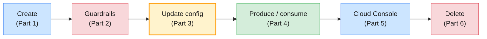

# Lab 02 — Managing Topics on Confluent Cloud

| | |
| --- | --- |
| **Level** | Beginner → Intermediate |
| **Duration** | ~70 minutes |
| **Guide sections** | §4.1 Who operates what · §5.6 The Apache Kafka CLI still works · §6.3 The Cloud Console · §7.1–§7.6 Topic management · §8.2 Hands-on Part B · §9 Troubleshooting |
| **You will need** | Everything Lab 01 left: saved Cloud login, environment and cluster selected, an API key in use, `~/kafka/ccloud.properties`, the topic `$ME.cdr.voice`; two terminals; the Cloud Console in a browser |

## Learning objectives

By the end of this lab you will be able to:

1. **Create** Confluent Cloud topics with explicit partitions and configs,
   validate them first with `--dry-run`, and make scripts idempotent with
   `--if-not-exists`.
2. Name the **Cloud guardrails** — fixed RF 3, `min.insync.replicas` 1 or 2,
   no broker configs — and recognise them in error messages.
3. **Update** topic configs dynamically and verify the result with both the
   Confluent CLI and `kafka-configs.sh`.
4. **Produce** and **consume** keyed CDRs with the Confluent CLI, and read the
   consumer group's offsets and lag with `kafka-consumer-groups.sh`.
5. Run the same lifecycle in the **Cloud Console**, and **delete** topics
   safely in both tools.



The topic lifecycle is the one from Module 2 §8.1; only the tools change
(guide §7.1).

---

## Before you start — restore your variables (2 min)

Shell variables do not survive a new terminal. Set them again from your
Lab 01 notes, in **both** terminals:

```bash
# (VM)
source ~/kafka/confluent.env
ME=lNN                                  # your prefix
ENV_ID=env-xxxxxx                       # from Lab 01 Part 3.1
LKC=lkc-xxxxxx                          # from Lab 01 Part 3.2
CC_CFG=~/kafka/ccloud.properties
CCLOUD=$(grep ^bootstrap.servers $CC_CFG | cut -d= -f2)

confluent context list                  # * on your Cloud login
confluent kafka cluster describe | grep -E "^\| (ID|Name|Type) "
```

**Expected:**

```
| ID                   | lkc-9xw2pq                                                |
| Name                 | l07-basic                                                 |
| Type                 | BASIC                                                     |
```

> **Administrator rule:** you are about to create and delete topics. Make
> these two checks — context and cluster — the first thing you type in every
> new terminal (guide §5.3).

---

## Part 1 — Create topics with explicit settings (13 min)

### 1.1 What did the defaults give you?

Lab 01 Part 4.4 created `$ME.cdr.voice` with only `--partitions 6`. Read
the settings that matter for a billing topic:

```bash
# (VM)
confluent kafka topic describe $ME.cdr.voice \
  | grep -E "cleanup.policy|min.insync.replicas|retention.ms|retention.bytes|max.message.bytes|segment.bytes"
```

**Expected:**

```
  cleanup.policy                          | delete
  max.message.bytes                       | 2097164
  min.insync.replicas                     | 2
  retention.bytes                         | -1
  retention.ms                            | 604800000
  segment.bytes                           | 104857600
```

| Setting | Cloud default | Same as your Apache cluster in Module 3? |
| ------- | ------------- | ---------------------------------------- |
| **`min.insync.replicas`** | 2 | The shared Apache cluster also used 2 — but there **you** set it; here Confluent did |
| **`retention.ms`** | 604800000 (7 days) | Same as Apache's 168 h default |
| **`retention.bytes`** | -1 (no size limit) | Same |
| **`max.message.bytes`** | ≈ 2 MB | Apache default is ≈ 1 MB |

> **Note:** `confluent kafka topic describe` shows the **configuration** in
> one place — what took `kafka-topics.sh --describe` plus `kafka-configs.sh
> --describe --all` in Module 3. It does not show leaders and ISR; use
> `kafka-topics.sh --describe` for that, as in Lab 01 Part 5.2 (guide §7.3).

### 1.2 Validate, then create

Create the SMS CDR topic with every setting spelled out. Validate first:

```bash
# (VM)
confluent kafka topic create $ME.cdr.sms --partitions 3 \
  --config retention.ms=259200000,min.insync.replicas=2,cleanup.policy=delete \
  --dry-run
```

**Expected:** a confirmation that the request is valid, and no topic yet:

```bash
# (VM)
confluent kafka topic list
```

```
       Name      | Internal | Replication Factor | Partition Count
-----------------+----------+--------------------+------------------
  l07.cdr.voice  | false    |                  3 |               6
```

Now create it for real:

```bash
# (VM)
confluent kafka topic create $ME.cdr.sms --partitions 3 \
  --config retention.ms=259200000,min.insync.replicas=2,cleanup.policy=delete
confluent kafka topic list
```

**Expected:**

```
Created topic "l07.cdr.sms".
       Name      | Internal | Replication Factor | Partition Count
-----------------+----------+--------------------+------------------
  l07.cdr.sms    | false    |                  3 |               3
  l07.cdr.voice  | false    |                  3 |               6
```

### 1.3 Run it again — the script way

```bash
# (VM)
confluent kafka topic create $ME.cdr.sms --partitions 3
echo "exit code: $?"
confluent kafka topic create $ME.cdr.sms --partitions 3 --if-not-exists
echo "exit code: $?"
```

**Expected:** the first command fails because the topic already exists and
returns a non-zero exit code; the second exits `0` without changing anything.

> **Tip:** provisioning scripts (and Terraform, and the CI jobs your
> platform team will write) must be safe to re-run. `--if-not-exists` is the
> Confluent CLI form of `kafka-topics.sh --create --if-not-exists`.

---

## Part 2 — Hit the Cloud guardrails (12 min)

On your Apache cluster you could set anything the broker accepted. On Cloud
some settings are Confluent's, by design (guide §4.1, §7.4). Make each
mistake once, so you recognise it later.

### 2.1 A replication factor of 2

```bash
# (VM)
confluent kafka topic create $ME.cdr.rf2 --partitions 3 --config replication.factor=2
```

**Expected:** the command is rejected with an error about
`replication.factor`, and no topic is created. There is not even a
`--replication-factor` flag on Cloud (`confluent kafka topic create --help`);
every Confluent Cloud topic has RF **3**.

### 2.2 `min.insync.replicas=3`

```bash
# (VM)
confluent kafka topic create $ME.cdr.mir3 --partitions 3 --config min.insync.replicas=3
```

**Expected:** rejected. Cloud accepts only 1 or 2.

> **What this shows:** with RF 3 and `min.insync.replicas=3`, losing **one**
> replica would stop every `acks=all` write — the trap you built on purpose in
> Module 2 Lab 02 Part 5.3. Confluent removes the option entirely. Keep
> `min.insync.replicas=2` and set `acks=all` in your producers: Cloud gives you
> RF 3 for free, but it cannot set `acks` for your clients (guide §7.4).

### 2.3 Broker configs are not yours

On your own clusters you changed broker defaults with `kafka-configs.sh`
(Module 3 Lab 01). Try it on Cloud:

```bash
# (VM)
kafka-configs.sh --bootstrap-server $CCLOUD --command-config $CC_CFG \
  --alter --entity-type brokers --entity-default --add-config log.retention.hours=1
```

**Expected:** an error (a cluster authorization or policy violation
exception). Broker-level configuration belongs to Confluent on a Cloud
cluster.

### 2.4 What *is* allowed: more partitions

Adding partitions is a topic operation, not a broker one. The Confluent CLI
does not wrap it, so use the Apache CLI (guide §7.1):

```bash
# (VM)
kafka-topics.sh --bootstrap-server $CCLOUD --command-config $CC_CFG \
  --alter --topic $ME.cdr.sms --partitions 6
confluent kafka topic list | grep cdr.sms
```

**Expected:**

```
  l07.cdr.sms    | false    |                  3 |               6
```

> **Common trap:** more partitions changes which partition a key hashes to.
> On a keyed CDR topic, records for MSISDN `966500000001` written before the
> change and after it may sit in different partitions, so per-subscriber
> ordering is broken across the change (Module 2 §8.4). Decide partition
> counts at creation time.

| Attempt | Result | Why |
| ------- | ------ | --- |
| `replication.factor=2` | ❌ rejected | RF is fixed at 3 on Cloud |
| `min.insync.replicas=3` | ❌ rejected | Only 1 or 2 allowed |
| Broker default `log.retention.hours` | ❌ refused | Brokers are Confluent's responsibility |
| `--partitions 6` on an existing topic | ✅ accepted | A topic-level change you own (with the ordering caveat) |

---

## Part 3 — Update topic configuration (10 min)

Billing has agreed to keep raw SMS CDRs for **one day** instead of three.
Change it the safe way: dry run, apply, verify twice.

```bash
# (VM)
confluent kafka topic update $ME.cdr.sms --config retention.ms=86400000 --dry-run
confluent kafka topic update $ME.cdr.sms --config retention.ms=86400000
```

**Expected** (for the real update):

```
Updated the following configuration values for topic "l07.cdr.sms":
      Name     |   Value   | Read-Only
---------------+-----------+------------
  retention.ms | 86400000  | false
```

Verify with the Confluent CLI and then with the Apache CLI, which also shows
**where** each value comes from:

```bash
# (VM)
confluent kafka topic describe $ME.cdr.sms | grep retention.ms
kafka-configs.sh --bootstrap-server $CCLOUD --command-config $CC_CFG \
  --describe --entity-type topics --entity-name $ME.cdr.sms
```

**Expected:**

```
  retention.ms                            | 86400000
Dynamic configs for topic l07.cdr.sms are:
  cleanup.policy=delete sensitive=false synonyms={DYNAMIC_TOPIC_CONFIG:cleanup.policy=delete, …}
  min.insync.replicas=2 sensitive=false synonyms={DYNAMIC_TOPIC_CONFIG:min.insync.replicas=2, …}
  retention.ms=86400000 sensitive=false synonyms={DYNAMIC_TOPIC_CONFIG:retention.ms=86400000, …}
```

> **What this shows:** a topic config change on Cloud is the same dynamic,
> per-topic override you made with `kafka-configs.sh --alter` in Module 3
> Lab 01 — a metadata record, no restart, effective within seconds. Both
> CLIs read and write the same thing.

> **Tip:** `--config` also takes a **file** of `key=value` lines. Keep your
> topic definitions in git as such files and apply them with
> `confluent kafka topic update <topic> --config <file>`; a change is then a
> reviewed commit, not a click (guide §6.2, administrator takeaway).

---

## Part 4 — Produce and consume keyed CDRs (15 min)

### 4.1 Produce from a file

Write six voice CDRs for three subscribers. The key is the MSISDN, the
separator is `:` (the CLI's default delimiter for `--parse-key`):

```bash
# (VM)
mkdir -p ~/m6
cat > ~/m6/cdrs.txt <<'EOF'
966500000001:{"type":"call-start","cell":"RUH-0412"}
966500000002:{"type":"call-start","cell":"JED-0108"}
966500000003:{"type":"call-start","cell":"DMM-0233"}
966500000001:{"type":"call-end","duration":184}
966500000002:{"type":"call-end","duration":61}
966500000003:{"type":"call-end","duration":907}
EOF
confluent kafka topic produce $ME.cdr.voice --parse-key < ~/m6/cdrs.txt
```

**Expected:**

```
Starting Kafka Producer. Use Ctrl-C or Ctrl-D to exit.
```

> **Common trap:** the JSON values contain `:` too. That is fine:
> `--parse-key` splits on the **first** delimiter only. A key that itself
> contains `:` needs `--delimiter` with another character.

### 4.2 Consume in a named group

```bash
# (VM)
confluent kafka topic consume $ME.cdr.voice --from-beginning \
  --group $ME.billing --print-key --print-offset
```

**Expected:** after a few seconds, seven records — Lab 01's `call-start`
plus the six above — one per line, each with its partition and offset, then
the key and the value separated by a tab. Records of the same MSISDN show the
**same partition**, in the order you wrote them; across partitions the order
is interleaved. Press **Ctrl+C** when nothing new arrives.

### 4.3 Read the group with the Apache CLI

```bash
# (VM)
kafka-consumer-groups.sh --bootstrap-server $CCLOUD --command-config $CC_CFG \
  --describe --group $ME.billing
```

**Expected** (abridged; your partitions differ):

```
Consumer group 'l07.billing' has no active members.

GROUP        TOPIC          PARTITION  CURRENT-OFFSET  LOG-END-OFFSET  LAG   CONSUMER-ID  HOST  CLIENT-ID
l07.billing  l07.cdr.voice  0          0               0               0     -            -     -
l07.billing  l07.cdr.voice  1          3               3               0     -            -     -
l07.billing  l07.cdr.voice  4          2               2               0     -            -     -
l07.billing  l07.cdr.voice  5          2               2               0     -            -     -
…
```

Three keys never fill six partitions, so some partitions stay at offset 0.
The total of `LOG-END-OFFSET` is 7.

### 4.4 Reset offsets — the Apache CLI still matters

Billing wants to **reprocess** the topic. The Confluent CLI does not wrap
offset resets (guide §5.6); the Apache tool does, against Cloud as well:

```bash
# (VM)
kafka-consumer-groups.sh --bootstrap-server $CCLOUD --command-config $CC_CFG \
  --group $ME.billing --topic $ME.cdr.voice --reset-offsets --to-earliest --dry-run
kafka-consumer-groups.sh --bootstrap-server $CCLOUD --command-config $CC_CFG \
  --group $ME.billing --topic $ME.cdr.voice --reset-offsets --to-earliest --execute
kafka-consumer-groups.sh --bootstrap-server $CCLOUD --command-config $CC_CFG \
  --describe --group $ME.billing | awk 'NR<3 || $6>0'
```

**Expected:** `NEW-OFFSET` 0 for every partition, then a describe that shows
`LAG` equal to `LOG-END-OFFSET` for each partition that holds data: the group
will read all seven records again. Run the consume command from 4.2 once
more to see it happen, then **Ctrl+C**.

> **Administrator rule:** an offset reset only works while the group has no
> active members — exactly as in Module 4 Lab 02. In production, stop the
> billing service first, reset, then start it.

---

## Part 5 — The same lifecycle in the Cloud Console (10 min)

Switch to the browser: `https://confluent.cloud` → **Environments** →
`env-lNN` → `lNN-basic`.

1. **Topics → + Add topic**. Name: `lNN.cdr.console` (your prefix),
   partitions: **3**. Choose **Show advanced settings** (or the equivalent
   *customise* option on your Console version) and set **Retention time** to
   1 day. Create the topic **without** choosing the quick defaults path.
2. Open the new topic. Read the **Configuration** tab and find
   `min.insync.replicas` and `retention.ms`.
3. **Messages → Produce a new message**. Key `966500000004`, value
   `{"type":"call-start","cell":"MED-0019"}`. Watch it appear in the
   message browser with its partition and offset.
4. Open **Clients** (left menu) → **Consumers** and find `lNN.billing`. Its
   lag view shows the same partitions and offsets as `kafka-consumer-groups.sh`
   in Part 4.3.

Back in the terminal, confirm that the UI and the CLI see one cluster:

```bash
# (VM)
confluent kafka topic list
confluent kafka topic describe $ME.cdr.console | grep -E "retention.ms|min.insync"
kafka-console-consumer.sh --bootstrap-server $CCLOUD --command-config $CC_CFG \
  --topic $ME.cdr.console --from-beginning --max-messages 1 \
  --formatter-property print.key=true
```

**Expected:**

```
       Name        | Internal | Replication Factor | Partition Count
-------------------+----------+--------------------+------------------
  l07.cdr.console  | false    |                  3 |               3
  l07.cdr.sms      | false    |                  3 |               6
  l07.cdr.voice    | false    |                  3 |               6
  min.insync.replicas                     | 2
  retention.ms                            | 86400000
966500000004	{"type":"call-start","cell":"MED-0019"}
Processed a total of 1 messages
```

> **What this shows:** a record produced from a web page is read by the
> Apache console consumer of Module 2 over `SASL_SSL` with an API key. One
> cluster, three tools (guide §7.1).

| Task | Confluent CLI | Apache CLI with `$CC_CFG` | Cloud Console |
| ---- | ------------- | ------------------------- | ------------- |
| Create | `topic create` | `kafka-topics.sh --create` | Topics → Add topic |
| Describe configs | `topic describe` | `kafka-configs.sh --describe` | Topic → Configuration |
| Leaders / ISR | — | `kafka-topics.sh --describe` | — |
| Add partitions | — | `kafka-topics.sh --alter --partitions` | Not editable |
| Update config | `topic update --config` | `kafka-configs.sh --alter` | Configuration → Edit settings |
| Produce / consume | `topic produce` / `consume` | Console producer / consumer | Messages tab |
| Group offsets / reset | — | `kafka-consumer-groups.sh` | Clients → Consumers (read) |
| Delete | `topic delete` | `kafka-topics.sh --delete` | Configuration → Delete topic |

---

## Part 6 — Delete safely (8 min)

> **Warning:** deletion is asynchronous and irreversible. On Cloud there is
> no broker disk to recover from (guide §7.6). Check the context and cluster
> before every delete.

### 6.1 Delete with the confirmation prompt

```bash
# (VM)
confluent kafka cluster describe | grep -E "^\| (ID|Name) "
confluent kafka topic delete $ME.cdr.sms
```

**Expected:** the CLI asks you to type the topic name to confirm. Type
`lNN.cdr.sms` exactly:

```
Are you sure you want to delete topic "l07.cdr.sms"? To confirm, type "l07.cdr.sms". To cancel, press Ctrl-C: l07.cdr.sms
Deleted topic "l07.cdr.sms".
```

`--force` skips the prompt. Use it in scripts only, never interactively.

### 6.2 Delete from the Console and verify in the CLI

In the Cloud Console: `lNN.cdr.console` → **Configuration** → **Delete
topic**, and type the name to confirm. Then:

```bash
# (VM)
kafka-topics.sh --bootstrap-server $CCLOUD --command-config $CC_CFG --list
```

**Expected:**

```
l07.cdr.voice
```

Only the topic you keep for Modules 7–10 remains.

| Observation | Concept | Where it's covered |
| ----------- | ------- | ------------------ |
| `--dry-run` validates without creating | Safe change workflow | §7.2, §7.4 |
| `replication.factor=2` and `min.insync.replicas=3` are rejected | Cloud fixes RF at 3; `min.insync.replicas` is 1 or 2 | §7.4 |
| Broker `--entity-default` alter is refused | Shared responsibility: brokers are Confluent's | §4.1, §5.6 |
| Partitions can be added with `kafka-topics.sh` | Topic-level changes stay yours | §7.1 |
| Offsets reset with `kafka-consumer-groups.sh` on Cloud | The Apache CLI fills gaps in the Confluent CLI | §5.6 |
| A Console-produced record is read by the console consumer | One cluster, many tools | §7.1, §7.5 |

---

## Checkpoint questions

<details>
<summary>1. You create a CDR topic on Confluent Cloud and forget <code>min.insync.replicas</code>. Is the data as safe as on the shared Apache cluster in Module 3? What still depends on you?</summary>

The topic gets RF 3 and `min.insync.replicas=2` by default, so the broker
side of the durability contract from Module 3 §6 is in place. What Cloud
cannot set is the producer side: an application with `acks=1` (or `acks=0`)
still loses records on a leader failure. You still own `acks=all`,
`enable.idempotence` and retries in every client.
</details>

<details>
<summary>2. Why does <code>kafka-configs.sh --alter --entity-type brokers</code> fail on Cloud, while <code>kafka-configs.sh --alter --entity-type topics</code> works?</summary>

On Confluent Cloud the responsibility line runs between brokers and topics
(guide §4.1). Broker configuration, rolling restarts, balancing and the
controller quorum belong to Confluent, so those requests are refused. Topic
configuration is yours, within a curated set of editable configs and ranges,
so topic-level alters work through either CLI.
</details>

<details>
<summary>3. Billing asks you to double the partitions of <code>cdr.voice</code> on a live system. What do you check before you say yes?</summary>

Whether any consumer depends on per-key ordering: adding partitions changes
the key-to-partition mapping, so records of one MSISDN can end up in two
partitions across the change. Also check the cluster type's partition limit
(guide §4.3), that consumers can use the extra parallelism, and agree a
moment when producers can be paused if strict ordering matters. Partitions can
never be reduced afterwards.
</details>

<details>
<summary>4. A teammate created a topic in the Cloud Console with the quick defaults. How do you find out, from the CLI, what they got, and how do you fix it without recreating the topic?</summary>

`confluent kafka topic describe <topic>` (or `kafka-configs.sh --describe`)
shows every effective setting. Retention, cleanup policy and
`min.insync.replicas` can be changed in place with `confluent kafka topic
update <topic> --config …` — dynamic, no restart. Only the partition count
going down or a change of the key design would need a new topic.
</details>

<details>
<summary>5. Why did you need the Apache Kafka CLI in this lab at all?</summary>

The Confluent CLI does not wrap every Kafka admin operation. Adding partitions
to an existing topic, reading a group's per-partition offsets and lag, and
resetting offsets all came from `kafka-topics.sh` and
`kafka-consumer-groups.sh`. Because Confluent Cloud speaks the Kafka protocol,
those tools work with nothing more than a client config file.
</details>

---

## Clean up

Keep `$ME.cdr.voice`, the group `$ME.billing`, the API key and
`~/kafka/ccloud.properties` for Modules 7–10. Remove the local CDR file if
you like:

```bash
# (VM)
rm -f ~/m6/cdrs.txt
```

Lab 03 moves to the shared Confluent Platform cluster. You do not need to log
out of Cloud: the Platform login in Lab 03 creates a **second** context next
to your Cloud context.

**Next:** [Lab 03 — Control Center & topic management on Confluent Platform](lab-03-control-center-topic-management-platform.md)
