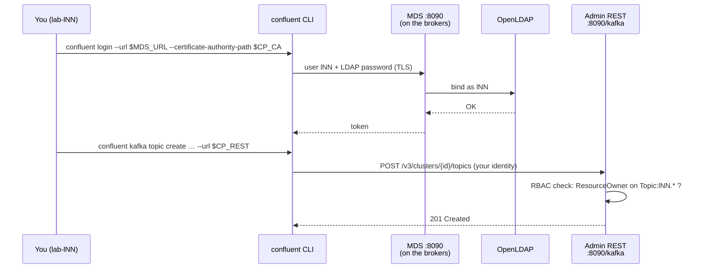
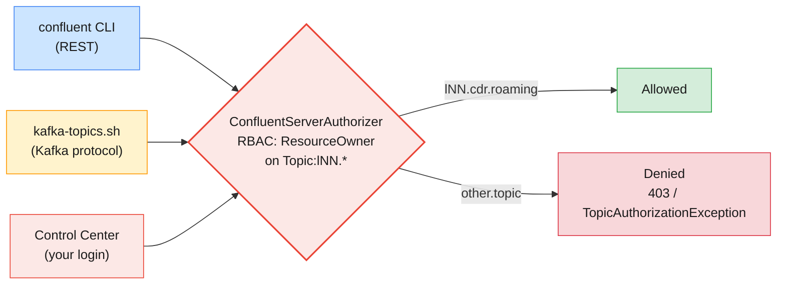

# Lab 03 — Control Center & Topic Management on Confluent Platform

| | |
| --- | --- |
| **Level** | Intermediate → Advanced |
| **Duration** | ~85 minutes |
| **Guide sections** | §2.1–§2.4 Platform architecture, Confluent Server · §3.1–§3.2 Features and licensing · §4.4–§4.5 Self-managed install and operations · §5.5 Logging in to Confluent Platform (MDS) · §6.1–§6.2 Control Center · §7 Topic management · §8.3–§8.4 Hands-on Parts C and D |
| **You will need** | Labs 01–02 done (your Cloud context stays), `~/kafka/cp.properties`, `~/kafka/cp-ca.pem`, `~/kafka/confluent.env`, your LDAP password, a browser for Control Center, two terminals |

## Learning objectives

By the end of this lab you will be able to:

1. Inspect a **self-managed Confluent Platform** cluster with the Apache Kafka
   CLI and point out what Confluent Server adds to the broker you know.
2. Walk through **Control Center** in the order of a cluster investigation
   and match every page to the CLI command you used in Modules 2–5.
3. Run the topic lifecycle on Platform in **Control Center** and verify each
   step from the CLI.
4. **Log in to MDS** with the Confluent CLI, hold a Cloud and a Platform
   context side by side, and manage topics through the **Admin REST API**.
5. Show from real errors that **RBAC role bindings** restrict you to your
   own prefix, in the CLI and in the UI.
6. Build an evidence-based **Confluent vs Apache Kafka** comparison — features,
   licensing and deployment model — for an architecture board.

This lab gives you less step-by-step help than Labs 01–02: each part states
the goal and the key commands; you read the results and fill in the tables.

---

## Before you start — variables (2 min)

```bash
# (VM)
source ~/kafka/confluent.env            # CP, MDS_URL, CP_REST, CP_CA, C3_URL
ME=lNN                                  # your prefix
CFG=~/kafka/cp.properties               # your LDAP user on the shared Confluent Platform
APACHE=apache-kafka.lab.internal:9092   # the Module 3-5 cluster, for comparison
APACHE_CFG=~/kafka/apache.properties
echo "$CP  $MDS_URL  $CP_REST  $C3_URL"
```

Your Platform client config uses TLS and your LDAP user (the password is
masked here, not in the file):

```bash
# (VM)
sed 's/password=.*/password=<hidden>;/' $CFG
```

**Expected:**

```
bootstrap.servers=cp-kafka.lab.internal:9092
security.protocol=SASL_SSL
sasl.mechanism=PLAIN
sasl.jaas.config=org.apache.kafka.common.security.plain.PlainLoginModule required username="l07" password=<hidden>;
ssl.truststore.type=PEM
ssl.truststore.location=/home/learner/kafka/cp-ca.pem
```

| Line | Meaning |
| ---- | ------- |
| **`SASL_SSL` + `PLAIN`** | The broker checks your user name and password **against LDAP** (Confluent's LDAP callback handler), over TLS |
| **`ssl.truststore.type=PEM`** | The course CA is a plain PEM file; no Java keystore needed |

---

## Part 1 — Inspect the shared Confluent Platform cluster (15 min)

Goal: prove that the core is the Kafka you know, then find what Confluent
Server adds.

### 1.1 Brokers and the controller quorum

```bash
# (VM)
kafka-broker-api-versions.sh --bootstrap-server $CP --command-config $CFG | grep "(id:"
kafka-metadata-quorum.sh --bootstrap-server $CP --command-config $CFG describe --status
```

**Expected** (abridged; node IDs and the leader may differ):

```
cp-broker-2.lab.internal:9092 (id: 2 rack: null isFenced: false) -> (
cp-broker-1.lab.internal:9092 (id: 1 rack: null isFenced: false) -> (
cp-broker-3.lab.internal:9092 (id: 3 rack: null isFenced: false) -> (
ClusterId:              …
LeaderId:               9991
…
CurrentVoters:          [{"id": 9991, …}, {"id": 9992, …}, {"id": 9993, …}]
CurrentObservers:       [{"id": 1, …}, {"id": 2, …}, {"id": 3, …}]
```

Same shape as the shared Apache cluster in Module 5 Lab 01 Part 1: dedicated
KRaft controllers vote, brokers observe. Confluent Platform 8.x is KRaft-only.

### 1.2 What the broker adds

Count the broker settings that exist only in Confluent Server, then the same
on the Apache cluster:

```bash
# (VM)
kafka-configs.sh --bootstrap-server $CP --command-config $CFG --describe \
  --entity-type brokers --entity-name 1 --all | grep -c "^  confluent\."
kafka-configs.sh --bootstrap-server $APACHE --command-config $APACHE_CFG --describe \
  --entity-type brokers --entity-name 11 --all | grep -c "^  confluent\."
```

**Expected:** a count in the hundreds for the Confluent Platform broker
(your number depends on the exact version), and **`0`** for the Apache
broker.

Now look at a few of them:

```bash
# (VM)
kafka-configs.sh --bootstrap-server $CP --command-config $CFG --describe \
  --entity-type brokers --entity-name 1 --all \
  | grep -E "^  (confluent\.balancer\.enable|confluent\.license|authorizer\.class\.name|confluent\.authorizer\.access\.rule\.providers|min\.insync\.replicas|default\.replication\.factor)="
```

**Expected** (synonyms trimmed):

```
  authorizer.class.name=io.confluent.kafka.security.authorizer.ConfluentServerAuthorizer sensitive=false synonyms={…}
  confluent.authorizer.access.rule.providers=CONFLUENT,KRAFT_ACL sensitive=false synonyms={…}
  confluent.balancer.enable=true sensitive=false synonyms={…}
  confluent.license=null sensitive=true synonyms={…}
  default.replication.factor=3 sensitive=false synonyms={…}
  min.insync.replicas=2 sensitive=false synonyms={…}
```

| Setting | What it tells you | Guide |
| ------- | ----------------- | ----- |
| **`authorizer.class.name=…ConfluentServerAuthorizer`** | Authorization goes through Confluent's authorizer, not Apache's `StandardAuthorizer` | §2.3 |
| **`confluent.authorizer.access.rule.providers=CONFLUENT,KRAFT_ACL`** | **RBAC** role bindings (`CONFLUENT`) **and** classic ACLs (`KRAFT_ACL`) are both checked | §3.1, Module 7 |
| **`confluent.balancer.enable=true`** | **Self-Balancing** runs the Module 5 reassignments for you | §3.1 |
| **`confluent.license`** `sensitive=true` | The licence key is a secret; the value is hidden even when set | §3.2 |

> **Note:** if your output shows `confluent.balancer.enable=false`, the
> trainer chose to leave Self-Balancing off for a stable demo; the setting
> still exists only on Confluent Server.

### 1.3 Health filters and visibility

```bash
# (VM)
kafka-topics.sh --bootstrap-server $CP --command-config $CFG --describe --under-replicated-partitions
kafka-topics.sh --bootstrap-server $CP --command-config $CFG --list
```

**Expected:** no output from the health filter (silence is healthy, as in
Module 5), and a list that contains **only** your own `lNN.*` topics — empty
for now. The other learners' topics exist; RBAC hides them from you.

---

## Part 2 — Walk through Control Center (15 min)

Goal: investigate the cluster in the UI in the same order you did it with
the CLI in Modules 2–5 (guide §6.2).

On your laptop, open `$C3_URL` (the value from `confluent.env`) and log in as
`lNN` with your **LDAP password**. Visit the pages below in order and fill in
the last column from what you see:

| # | Page | Question | CLI cross-check | Your answer |
| - | ---- | -------- | --------------- | ----------- |
| 1 | **Home** | How many clusters are connected, and are they healthy? | — | |
| 2 | **Cluster overview** | Brokers, partitions, under-replicated and offline partitions, throughput in/out | Part 1.3 health filter | |
| 3 | **Brokers** | Which brokers are up? How are partitions and leaders spread? | Part 1.1 | |
| 4 | **Topics** | Which topics can you see? | `kafka-topics.sh --list` | |
| 5 | **Consumers** (or **Clients**) | Which groups can you see, and their lag? | `kafka-consumer-groups.sh --list` | |
| 6 | **Cluster settings** | Value of `min.insync.replicas` and `log.retention.hours` | Part 1.2 | |

Then run the cross-checks you have not run yet:

```bash
# (VM)
kafka-consumer-groups.sh --bootstrap-server $CP --command-config $CFG --list
kafka-configs.sh --bootstrap-server $CP --command-config $CFG --describe \
  --entity-type brokers --entity-name 1 --all | grep -E "^  log.retention.hours="
```

> **What this shows:** Control Center is a **view** of the same metadata the
> CLI reads, filtered by **your** role bindings. Pages that need cluster-wide
> rights may be empty or partly hidden for a learner; the trainer sees
> everything. Since CP 8.0, Control Center 2.x keeps its metrics in an
> embedded Prometheus (guide §6.1); Module 8 uses that side.

> **Administrator takeaway:** a UI makes the cluster visible; it does not
> make changes auditable. Use Control Center to investigate, and the CLI or
> automation to change things (guide §6.2).

---

## Part 3 — The topic lifecycle in Control Center (15 min)

Goal: create, inspect, produce to and change a topic in the UI, and verify
each step from the CLI.

### 3.1 Create — with the settings that matter

1. **Topics → Add a topic**. Name `lNN.cdr.data` (your prefix),
   partitions **6**.
2. Choose **Customize settings** — not *Create with defaults*. Set
   `min.insync.replicas` = **2** and retention = **7 days**.
3. **Save & create**.

> **Common trap:** the quick-create path uses the broker defaults. That is
> fine on this cluster (`min.insync.replicas=2`, Part 1.2), and silently
> wrong on a cluster whose default is 1 — the durability contract from
> Module 3 §6 would be gone without anyone noticing (guide §7.2).

### 3.2 Verify from the CLI

```bash
# (VM)
kafka-topics.sh --bootstrap-server $CP --command-config $CFG --describe --topic $ME.cdr.data
kafka-configs.sh --bootstrap-server $CP --command-config $CFG \
  --describe --entity-type topics --entity-name $ME.cdr.data
```

**Expected** (abridged; leaders and replica orders differ):

```
Topic: l07.cdr.data	TopicId: …	PartitionCount: 6	ReplicationFactor: 3	Configs: min.insync.replicas=2,retention.ms=604800000,…
	Topic: l07.cdr.data	Partition: 0	Leader: 2	Replicas: 2,3,1	Isr: 2,3,1	…
	…
Dynamic configs for topic l07.cdr.data are:
  min.insync.replicas=2 sensitive=false synonyms={DYNAMIC_TOPIC_CONFIG:min.insync.replicas=2, …}
  retention.ms=604800000 sensitive=false synonyms={DYNAMIC_TOPIC_CONFIG:retention.ms=604800000, …}
```

Unlike Cloud (Lab 02 Part 1.1), you see **leaders, replicas and ISR** on
broker IDs you can name, because this cluster is self-managed.

### 3.3 Produce from the UI, read from the CLI

1. Open `lNN.cdr.data` → **Messages** → **Produce a new message**.
2. Key `966500000001`, value `{"type":"session-start","apn":"internet","bytes":0}`.
   Produce, and watch it appear in the message browser.

```bash
# (VM)
kafka-console-consumer.sh --bootstrap-server $CP --command-config $CFG \
  --topic $ME.cdr.data --from-beginning --max-messages 1 \
  --group $ME.analytics --formatter-property print.key=true
```

**Expected:**

```
966500000001	{"type":"session-start","apn":"internet","bytes":0}
Processed a total of 1 messages
```

Back in Control Center, open **Consumers** and find `lNN.analytics` with
lag 0.

### 3.4 Change retention in the UI

**Configuration → Edit settings** → retention **3 days** → **Save
changes**. Then:

```bash
# (VM)
kafka-configs.sh --bootstrap-server $CP --command-config $CFG \
  --describe --entity-type topics --entity-name $ME.cdr.data | grep retention.ms
```

**Expected:**

```
  retention.ms=259200000 sensitive=false synonyms={DYNAMIC_TOPIC_CONFIG:retention.ms=259200000, …}
```

The click wrote the same dynamic topic override that `kafka-configs.sh
--alter` writes (Module 3 Lab 01).

---

## Part 4 — The Confluent CLI against Platform: MDS and Admin REST (18 min)

Goal: log in to the **Metadata Service**, keep two contexts, and manage a
topic through the **Admin REST API** embedded in Confluent Server.



### 4.1 Log in to MDS

```bash
# (VM)
confluent login --url $MDS_URL --certificate-authority-path $CP_CA --save
```

Enter `lNN` and your LDAP password.

**Expected:**

```
Enter your Confluent credentials:
Username: l07
Password: ****************
Logged in as "l07".
```

```bash
# (VM)
confluent context list
```

**Expected:** **two** contexts — your Cloud login from Lab 01 and the new
Platform login (named after your user and the MDS URL), with `*` on the
Platform one.

Run `confluent kafka topic create --help` again and compare it with Lab 01
Part 2.1: on Platform it has `--url`, `--replication-factor` and
`--certificate-authority-path`, and no `--dry-run` or `--environment`.

### 4.2 Find the cluster ID and your role bindings

```bash
# (VM)
confluent cluster describe --url $MDS_URL --certificate-authority-path $CP_CA
```

**Expected** (abridged):

```
Confluent Resource Name: …

Scope:
      Type      |           ID
----------------+-------------------------
  kafka-cluster | AbCdEfGhIjKlMnOpQrStUv
```

```bash
# (VM)
CP_ID=AbCdEfGhIjKlMnOpQrStUv            # ← your kafka-cluster ID
confluent iam rbac role-binding list --principal User:$ME --kafka-cluster $CP_ID
```

**Expected:** your role bindings — **`ResourceOwner`** on the **prefixed**
resources `Topic:lNN.` and `Group:lNN.`. That is the Platform form of the
prefix ACLs you had on the Apache cluster.

### 4.3 The topic lifecycle through Admin REST

```bash
# (VM)
confluent kafka topic create $ME.cdr.roaming --url $CP_REST --certificate-authority-path $CP_CA \
  --partitions 3 --replication-factor 3 --config min.insync.replicas=2,retention.ms=604800000
confluent kafka topic list --url $CP_REST --certificate-authority-path $CP_CA
confluent kafka topic describe $ME.cdr.roaming --url $CP_REST --certificate-authority-path $CP_CA \
  | grep -E "min.insync|retention.ms"
confluent kafka topic update $ME.cdr.roaming --url $CP_REST --certificate-authority-path $CP_CA \
  --config retention.ms=259200000
```

**Expected:**

```
Created topic "l07.cdr.roaming".
         Name
-------------------
  l07.cdr.data
  l07.cdr.roaming
  min.insync.replicas                     | 2
  retention.ms                            | 604800000
Updated the following configuration values for topic "l07.cdr.roaming":
      Name     |   Value   | Read-Only
---------------+-----------+------------
  retention.ms | 259200000 | false
```

> **Tip:** typing `--url … --certificate-authority-path …` every time gets
> old. The CLI reads `CONFLUENT_REST_URL` when `--url` is missing (see
> `confluent kafka topic create --help`), so `export CONFLUENT_REST_URL=$CP_REST`
> shortens the commands. The labs keep the flags so you always see the
> target.

### 4.4 Admin REST is just HTTP

The CLI is one client of the Admin REST API. `curl` is another:

```bash
# (VM)
curl -s --cacert $CP_CA -u $ME "$CP_REST/v3/clusters" | jq -r '.data[].cluster_id'
curl -s --cacert $CP_CA -u $ME "$CP_REST/v3/clusters/$CP_ID/topics/$ME.cdr.roaming" \
  | jq '{topic_name, partitions_count, replication_factor}'
```

Enter your LDAP password at each prompt.

**Expected:**

```
AbCdEfGhIjKlMnOpQrStUv
{
  "topic_name": "l07.cdr.roaming",
  "partitions_count": 3,
  "replication_factor": 3
}
```

> **What this shows:** on Platform the Confluent CLI does not use the Kafka
> protocol for admin at all; it calls the **Admin REST API** on port 8090 of
> Confluent Server (guide §5.5). The Apache Kafka broker has no such API —
> `cp-kafka` and `apache/kafka` would refuse the connection on 8090
> (guide §2.3).

---

## Part 5 — RBAC keeps you in your prefix (10 min)

Goal: see the same authorization decision from three tools.

> **Administrator rule:** use the made-up name `other.topic`, never another
> learner's prefix.

```bash
# (VM)
confluent kafka topic create other.topic --url $CP_REST --certificate-authority-path $CP_CA --partitions 1
kafka-topics.sh --bootstrap-server $CP --command-config $CFG \
  --create --topic other.topic --partitions 1 --replication-factor 3
```

**Expected:** both refused. The Confluent CLI reports an authorization
failure from the REST API (HTTP 403); the Apache CLI ends with:

```
Error while executing topic command : Authorization failed.
… org.apache.kafka.common.errors.TopicAuthorizationException: Authorization failed.
```

In Control Center, try **Topics → Add a topic** with the name `other.topic`:
the UI makes the same call with your identity, and the same check refuses it.



> **What this shows:** one authorizer in the broker, three ways in. A denied
> delete on someone else's topic is the system working, not a bug
> (guide §7.6). Module 7 opens up how role bindings are granted.

---

## Part 6 — Confluent vs Apache Kafka: build the evidence (10 min, advanced)

Goal: turn what you **observed** in Modules 3–6 into the comparison an
architecture board asks for (guide §3, §4). Fill in the last column from your
own outputs — not from the slides.

| Question | Apache Kafka (shared cluster, Modules 3–5) | Confluent Platform (Lab 03) | Confluent Cloud (Labs 01–02) | Your evidence |
| -------- | ------------------------------------------ | --------------------------- | ---------------------------- | ------------- |
| Who runs brokers, upgrades, balancing? | You (Module 5) | You, helped by Self-Balancing and cp-ansible | Confluent | Part 1.2 `confluent.balancer.enable`; Lab 02 Part 2.3 |
| Can you read leaders and ISR? | Yes | Yes | Yes, RF 3 fixed, IDs not yours | Part 3.2; Lab 01 Part 5.2 |
| Can you change broker configs? | Yes (trainer) | Yes (admins) | No | Lab 02 Part 2.3 |
| Authorization model | Prefix ACLs, SCRAM users | RBAC + ACLs, LDAP users via MDS | RBAC + ACLs, API keys | Part 4.2, Part 5 |
| Admin API beyond the Kafka protocol | None | Admin REST on :8090 | REST via control plane | Part 4.4 |
| Management UI | None (Grafana in Module 8) | Control Center (enterprise licence) | Cloud Console | Part 2 |
| Licence of the broker | Apache 2.0 | Confluent Enterprise (trial, developer or subscription) | Included in usage billing | Part 1.2 `confluent.license` |

Then answer, in three sentences each, for a telecom operator:

1. Mediation and billing must keep CDRs **in the operator's own data
   centre**, with LDAP-integrated access control and vendor support. Which
   option(s), and what licence do you need before go-live?
2. A new analytics team wants Kafka **next month** and no brokers to run.
   Which option, and what do they still own?
3. Both of the above must share the `cdr.voice` stream. What joins them?
   (Guide §3.4 — the answer returns in Module 10.)

> **Licensing reminder (guide §3.2):** the shared cluster runs on the
> built-in **30-day trial**; when it expires, the enterprise features —
> Control Center, RBAC, Admin REST — stop working. Production needs a
> **subscription** licence key in `confluent.license`; the free **developer**
> licence is limited to a single broker per cluster.

---

## Checkpoint questions

<details>
<summary>1. A colleague says "Confluent Kafka is a different product, so our Module 4 Java clients will need rewriting." What evidence from this lab answers that?</summary>

`kafka-topics.sh`, `kafka-configs.sh`, `kafka-console-consumer.sh` and
`kafka-metadata-quorum.sh` all worked unchanged against Confluent Server with
a normal client config; only `bootstrap.servers`, the security protocol and the
credentials changed. The broker is Apache Kafka 4.x plus extra modules
(authorizer, balancer, REST), with the same wire protocol and on-disk format.
Clients move by changing configuration, not code.
</details>

<details>
<summary>2. Why did <code>confluent kafka topic create</code> need <code>--url</code> on Platform but not on Cloud?</summary>

On Cloud the CLI finds the cluster's REST endpoint itself from the selected
environment and cluster (`confluent kafka cluster use`). On Platform there is
no such control plane: the CLI must be told which REST endpoint to call —
the Admin REST API embedded in Confluent Server (`https://<broker>:8090/kafka`)
or a standalone REST Proxy — and it authenticates there with the identity from
your MDS login.
</details>

<details>
<summary>3. Control Center shows you only <code>lNN.cdr.data</code> and <code>lNN.cdr.roaming</code>, but the trainer sees 40 topics. Is Control Center broken?</summary>

No. Control Center makes its admin calls with **your** identity, and the
Confluent Server authorizer returns only resources your role bindings cover —
`ResourceOwner` on `Topic:lNN.` and `Group:lNN.`. The trainer's broader role
shows everything. The same filtering explains why `kafka-topics.sh --list`
returned only your topics in Part 1.3.
</details>

<details>
<summary>4. One morning the course cluster's Control Center refuses to load and RBAC logins fail, but plain clients still connect. What is the first thing you check, and how would you avoid it in production?</summary>

The enterprise licence: the cluster may have reached the end of its 30-day
trial, which disables the enterprise features. Check the licence state (the
broker log reports licence problems at startup; Control Center shows a licence
banner) and the date the cluster was installed. In production, install a
subscription key in `confluent.license` and put its expiry in the same
calendar as your TLS certificate expiries (guide §3.2).
</details>

<details>
<summary>5. You changed retention on <code>lNN.cdr.data</code> by clicking in Control Center. Your change-management process asks for the exact change and a rollback. What do you hand in?</summary>

The equivalent command and its inverse: `kafka-configs.sh --alter
--entity-type topics --entity-name lNN.cdr.data --add-config
retention.ms=259200000`, rollback `--add-config retention.ms=604800000` (or
`--delete-config retention.ms` to fall back to the default), plus the
`--describe` output before and after. Better: make the change with that command
or a config file in git in the first place, and use Control Center to confirm
it (guide §6.2).
</details>

<details>
<summary>6. Self-Balancing is enabled on this cluster. Which Module 5 task does it replace, and what does it <em>not</em> remove from your job?</summary>

It replaces the manual `--generate` / `--execute` / `--verify` reassignment
loop: when brokers are added, removed or load becomes uneven, Confluent Server
plans and runs throttled reassignments itself. It does not remove capacity
planning: moving data still uses network and disk, so the cluster still needs
headroom, and you still decide when to add brokers (guide §3.1, Module 5 §7).
</details>

---

## Clean up

> **Warning:** delete only your own `$ME.*` topics. The confirmation prompt
> asks you to type the topic name; read it before you type.

Delete `$ME.cdr.roaming` with the Confluent CLI, and `$ME.cdr.data` from
Control Center (**Configuration → Delete topic**). Then verify, and switch
the CLI back to your Cloud context for the next module:

```bash
# (VM)
confluent kafka topic delete $ME.cdr.roaming --url $CP_REST --certificate-authority-path $CP_CA
kafka-topics.sh --bootstrap-server $CP --command-config $CFG --list
confluent context list
confluent context use <your Cloud context name>
```

**Expected:** no `$ME.*` topics left on the Platform cluster (the list is
empty), and `*` back on your Cloud context.

Keep both contexts, `~/kafka/ccloud.properties` and the Cloud topic
`$ME.cdr.voice`: Module 7 starts from them.

> **Next module:** *Module 7 — Administering Kafka Security*, where you
> secure both worlds: SASL, SSL and ACLs on Apache Kafka compared with
> Confluent RBAC, role bindings, API keys and service accounts — replacing
> the user-owned API key from Lab 01 with a service account that has exactly
> the rights its application needs.
