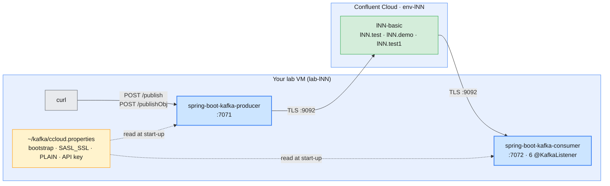
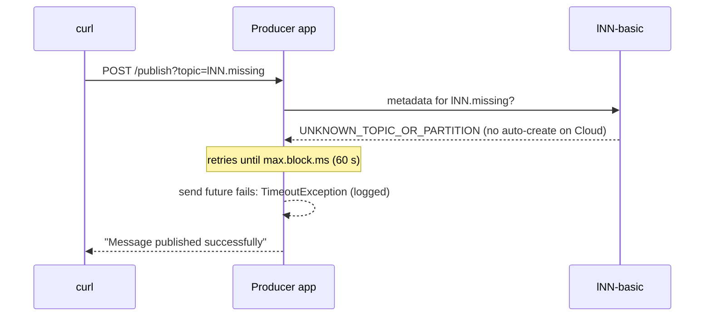

# Lab 04 — Producing & Consuming with Spring Boot on Confluent Cloud

| | |
| --- | --- |
| **Level** | Intermediate |
| **Duration** | ~60 minutes |
| **Guide sections** | §4.2 Confluent Cloud hierarchy · §5 Authentication and API keys · §7 Topic management via Confluent CLI · Module 4 §8.2 Loading the shared-cluster configuration · Module 4 §4.1 Group anatomy |
| **You will need** | Labs 01–03 done; your Cloud CLI context current; `~/kafka/ccloud.properties` from Lab 01 Part 5.1; Java 17+ and the Maven wrapper (in the VM image); the sample apps in [`lab-04/`](lab-04/); three terminals; VS Code (browser IDE or Remote-SSH) |

## Learning objectives

By the end of this lab you will be able to:

1. Explain what a Kafka client needs to reach **Confluent Cloud** that it
   does not need for a local cluster: `SASL_SSL`, `PLAIN` and an API key.
2. Explain how an existing Spring Boot producer and consumer were made **Cloud-ready**
   without writing a secret into the code or `application.properties`.
3. Run the apps against your `lNN-basic` cluster and send string and JSON
   messages through REST endpoints.
4. Read the result as an administrator: consumer groups, partition
   assignment and lag with the Kafka CLI and the Cloud Console.
5. Recognise the failure when an application produces to a topic that does
   not exist on Cloud.

## Why this lab

Labs 01–03 administered Confluent from the operator's chair. Sooner or later
an application team asks: *"Our service works on our laptop cluster. What
changes for Confluent Cloud?"* The honest answer is: **only the client
configuration and the topic names**. The Kafka protocol, the serializers and
the consumer-group logic stay the same. In this lab you prove it with two
small Spring Boot services, the same ones Module 1 Lab 04 ran against a local
cluster.



---

## Before you start — variables (5 min)

```bash
# (VM)
confluent context list                  # the * must be on your Cloud context
ME=lNN                                  # your prefix
ENV_ID=env-xxxxxx                       # from Lab 01 Part 3.1
LKC=lkc-xxxxxx                          # from Lab 01 Part 3.2
confluent environment use $ENV_ID
confluent kafka cluster use $LKC
CC_CFG=~/kafka/ccloud.properties
CCLOUD=$(grep ^bootstrap.servers $CC_CFG | cut -d= -f2)
sed 's/password=.*/password=<hidden>;/' $CC_CFG
java -version 2>&1 | head -1
```

**Expected:** the four lines of `ccloud.properties` with the secret hidden,
and a Java version of 17 or higher:

```
bootstrap.servers=pkc-xxxxx.ap-south-1.aws.confluent.cloud:9092
security.protocol=SASL_SSL
sasl.mechanism=PLAIN
sasl.jaas.config=org.apache.kafka.common.security.plain.PlainLoginModule required username='ABCDEFGH12345678' password=<hidden>;
openjdk version "21.0.…"
```

If the `*` is on the Platform context from Lab 03, switch with
`confluent context use <your Cloud context name>`. Copy the variable block
into terminals 2 and 3 when you open them.

---

## Part 1 — Read the sample apps (10 min)

Open `labs/module-06/lab-04/` in VS Code. The two projects started as the
ones from Module 1 Lab 04, which ran against a local cluster. They have
already been made **Cloud-ready**. This part shows what had to change, and
Part 2 walks through the code.

| File | What to notice |
| ---- | -------------- |
| `spring-boot-kafka-producer/src/main/resources/application.properties` | `spring.kafka.bootstrap-servers=localhost:9092,…` is still the default; `app.kafka.client-config` and `app.prefix` are new. Port **7071** |
| `spring-boot-kafka-producer/.../KafkaProducerConfig.java` | Builds the producer properties **by hand** in `producerConfigs()`, and now merges in a client file. Two `KafkaTemplate`s: `String` and `Greeting`, both with `JacksonJsonSerializer` for the value |
| `spring-boot-kafka-producer/.../SpringBootKafkaProducerApplication.java` | Unchanged. `POST /publish?topic=` (text) and `POST /publishObj?topic=` (JSON `Greeting`); each message gets a **random key** |
| `spring-boot-kafka-consumer/.../KafkaConsumerConfig.java` | `consumerConfigs()` merges in the same client file; **two** listener factories: one for strings (it replaces Spring Boot's default) and one for `Greeting` |
| `spring-boot-kafka-consumer/.../SpringBootKafkaConsumerApplication.java` | Six `@KafkaListener`s whose topic and group names start with `${app.prefix}`: `test` / `test-group`; `demo` / `demo-group` (three listeners); `test1` / `test-group1` and `test-group2` |

What stopped the original samples from working on Confluent Cloud, and how
the code handles it now:

| # | Gap in the original | Why it fails on Cloud | Fixed by |
| - | ------------------- | --------------------- | -------- |
| 1 | Only `bootstrap.servers` was set | Cloud accepts only `SASL_SSL` with `PLAIN` and an API key. A plaintext client cannot connect | The client file (Part 2.1–2.2) |
| 2 | The **String** listeners (`test`, `demo`) did not use `consumerConfigs()` | They used Spring Boot's **default** listener factory, which reads only `spring.kafka.*`. Even with the client file, these four listeners would still try `localhost:9092` | A `kafkaListenerContainerFactory` bean (Part 2.3) |
| 3 | Topic and group names were hard-coded without a prefix | The course rule is `$ME.*` for every topic and group | `${app.prefix}` in the annotations (Part 2.4) |
| 4 | Topics do not exist | Confluent Cloud never creates topics automatically. Somebody must create them first | You, with the Confluent CLI (Part 3.1) |

> **Administrator rule:** the API key and secret go into a file **outside**
> the repository (`~/kafka/ccloud.properties`, mode `600`), and the
> application reads that file at start-up. Never commit a key to
> `application.properties` or to git. In production the file comes from a
> secret store (Kubernetes Secret, Vault, AWS Secrets Manager).

---

## Part 2 — Walk through the Cloud-ready code, then build (15 min)

None of the changes adds a secret to the code. Read each one in VS Code as
you go.

### 2.1 A client file and a prefix from the environment

Both `application.properties` files end with:

```properties
# Module 6 Lab 04: client file from Lab 01 (Confluent Cloud) and your prefix
app.kafka.client-config=${KAFKA_CLIENT_CONFIG:}
app.prefix=${ME:local}
```

Both values come from environment variables when the app starts. Without
them, the client file is empty and the prefix is `local`, so the apps still
run against a local cluster, as in Module 1.

### 2.2 Loading the client file

Find the new lines in both config classes:

```bash
# (VM) - from labs/module-06/lab-04
grep -n "clientConfig\|loadClientConfig" spring-boot-kafka-*/src/main/java/com/examples/spring/boot/kafka/Kafka*Config.java
```

**Expected:** three hits per file: the `@Value` field, the `putAll` call and
the helper method.

In `KafkaProducerConfig.java`:

```java
	  // Optional client file, e.g. ~/kafka/ccloud.properties: bootstrap.servers, security.protocol,
	  // sasl.mechanism, sasl.jaas.config. Empty = plain local cluster.
	  @Value("${app.kafka.client-config}")
	  private String clientConfig;

	  @Bean
	  public Map<String, Object> producerConfigs() {
	    Map<String, Object> props = new HashMap<>();
	    props.put(ProducerConfig.BOOTSTRAP_SERVERS_CONFIG, bootstrapServers);
	    props.putAll(loadClientConfig(clientConfig));
	    …
	  }

	  static Map<String, Object> loadClientConfig(String path) {
	    Map<String, Object> config = new HashMap<>();
	    if (path == null || path.isBlank()) {
	      return config;
	    }
	    Properties file = new Properties();
	    try (InputStream in = Files.newInputStream(Path.of(path))) {
	      file.load(in);
	    } catch (IOException e) {
	      throw new UncheckedIOException("Cannot read Kafka client config " + path, e);
	    }
	    file.forEach((key, value) -> config.put((String) key, value));
	    return config;
	  }
```

`KafkaConsumerConfig.java` has the same field and helper, and the same
`putAll` line in `consumerConfigs()`.

> **Note:** `putAll` runs **after** the bootstrap line, so the
> `bootstrap.servers` from the file replaces `localhost:9092,…`. The other
> three lines (`security.protocol`, `sasl.mechanism`, `sasl.jaas.config`)
> are exactly what `kafka-topics.sh --command-config` used in Lab 01. A
> missing or unreadable file stops the app at start-up with
> `Cannot read Kafka client config …`, instead of failing later.

### 2.3 The String listeners get the same configuration (gap 2)

`KafkaConsumerConfig.java` defines two more beans. A bean named
`kafkaListenerContainerFactory` replaces Spring Boot's default factory, so
the `test` and `demo` listeners get the client file too:

```java
	// Replaces Spring Boot's default listener factory, which only reads spring.kafka.*.
	// The String listeners (test, demo) use it.
	@Bean
	public ConsumerFactory<String, String> stringConsumerFactory() {
		return new DefaultKafkaConsumerFactory<>(consumerConfigs(), new StringDeserializer(), new StringDeserializer());
	}

	@Bean
	public ConcurrentKafkaListenerContainerFactory<String, String> kafkaListenerContainerFactory() {
		ConcurrentKafkaListenerContainerFactory<String, String> factory = new ConcurrentKafkaListenerContainerFactory<>();
		factory.setConsumerFactory(stringConsumerFactory());
		return factory;
	}
```

> **Common trap:** fixing only the factory you wrote yourself. In a dry run
> without these two beans, the two `test1` listeners connected through the
> client file, while the four String listeners logged
> `bootstrap.servers = [localhost:9092, localhost:9093, localhost:9094]`.
> On Cloud they would retry forever and never receive a message. When a
> Spring app half-works, check **every** factory's `bootstrap.servers` in the
> start-up log (Part 3.2 does this).

### 2.4 Prefixed listener topics and groups (gap 3)

```bash
# (VM) - from labs/module-06/lab-04
grep -nE 'topics = |groupId = ' \
  spring-boot-kafka-consumer/src/main/java/com/examples/spring/boot/kafka/SpringBootKafkaConsumerApplication.java | grep -v '//'
```

**Expected:**

```
21:	@KafkaListener(topics = {"${app.prefix}.test"}, groupId = "${app.prefix}.test-group")
26:	@KafkaListener(topics = {"${app.prefix}.demo"}, groupId = "${app.prefix}.demo-group")
31:	@KafkaListener(topics = {"${app.prefix}.demo"}, groupId = "${app.prefix}.demo-group")
36:	@KafkaListener(topics = {"${app.prefix}.demo"}, groupId = "${app.prefix}.demo-group")
43:	@KafkaListener(topics = {"${app.prefix}.test1"},
44:			groupId = "${app.prefix}.test-group1",
52:		topics = {"${app.prefix}.test1"},
53:		groupId = "${app.prefix}.test-group2",
```

With `ME=l07`, Spring resolves `${app.prefix}.demo` to `l07.demo`. The producer needs no such change: the topic is a request parameter.

### 2.5 Build both apps

```bash
# (VM) - from labs/module-06/lab-04
(cd spring-boot-kafka-producer && ./mvnw -q -DskipTests package) && \
(cd spring-boot-kafka-consumer && ./mvnw -q -DskipTests package) && \
ls spring-boot-kafka-*/target/*.jar
```

**Expected:** no compiler errors, then:

```
spring-boot-kafka-consumer/target/spring-boot-kafka-consumer-0.0.1-SNAPSHOT.jar
spring-boot-kafka-producer/target/spring-boot-kafka-producer-0.0.1-SNAPSHOT.jar
```

The first build downloads Maven and the dependencies (2–3 minutes).

---

## Part 3 — Create the topics and run the apps on Cloud (15 min)

### 3.1 Create the topics first (gap 4)

```bash
# (VM)
for t in test demo test1; do confluent kafka topic create $ME.$t --partitions 3; done
confluent kafka topic list | grep -E "$ME\.(test|demo|test1)\b"
```

**Expected:** `Created topic "lNN.test".` (and the same for `demo` and
`test1`), then the three topics in the list.

### 3.2 Start the consumer (terminal 2)

```bash
# (VM) - terminal 2, from labs/module-06/lab-04
ME=lNN KAFKA_CLIENT_CONFIG=$HOME/kafka/ccloud.properties \
  java -jar spring-boot-kafka-consumer/target/spring-boot-kafka-consumer-0.0.1-SNAPSHOT.jar 2>&1 \
  | tee /tmp/$ME-consumer.log
```

Use `$HOME`, not `~`, inside the variable. Java does not expand `~`. Look for
these lines (a dry run on a local cluster; your timestamps and partition
order differ):

```
Started SpringBootKafkaConsumerApplication in 2.429 seconds
l19.demo-group: partitions assigned: [l19.demo-0]
l19.demo-group: partitions assigned: [l19.demo-2]
l19.demo-group: partitions assigned: [l19.demo-1]
l19.test-group: partitions assigned: [l19.test-0, l19.test-1, l19.test-2]
l19.test-group1: partitions assigned: [l19.test1-0, l19.test1-1, l19.test1-2]
l19.test-group2: partitions assigned: [l19.test1-0, l19.test1-1, l19.test1-2]
```

Check that **every** consumer reached Cloud, using the copy of the log that
`tee` keeps:

```bash
# (VM) - terminal 1
grep -c "bootstrap.servers = \[pkc-" /tmp/$ME-consumer.log
grep -c "localhost:9092" /tmp/$ME-consumer.log
grep -m1 "security.protocol" /tmp/$ME-consumer.log
grep -m1 "sasl.jaas.config" /tmp/$ME-consumer.log
```

**Expected:** `6` (one consumer per listener), `0` (none left on the local
defaults), `security.protocol = SASL_SSL` and `sasl.jaas.config = [hidden]`.
Kafka never logs the secret, but delete the log file in the clean up anyway.

### 3.3 Start the producer (terminal 3) and send messages

```bash
# (VM) - terminal 3, from labs/module-06/lab-04
ME=lNN KAFKA_CLIENT_CONFIG=$HOME/kafka/ccloud.properties \
  java -jar spring-boot-kafka-producer/target/spring-boot-kafka-producer-0.0.1-SNAPSHOT.jar
```

Wait for `Started SpringBootKafkaProducerApplication`, then send from
terminal 1:

```bash
# (VM)
curl -s -X POST "localhost:7071/publish?topic=$ME.test" -H 'Content-Type: text/plain' -d 'CDR 966500000001 voice 120s'; echo
for i in 1 2 3 4 5 6; do
  curl -s -X POST "localhost:7071/publish?topic=$ME.demo" -H 'Content-Type: text/plain' -d "CDR $i"; echo
done
curl -s -X POST "localhost:7071/publishObj?topic=$ME.test1" -H 'Content-Type: application/json' \
  -d '{"id":1,"message":"Welcome to Mobily 5G"}'; echo
```

**Expected:** `Message published successfully` eight times. In terminal 2
(from the dry run):

```
#1 Consume message as String - Received message - "CDR 966500000001 voice 120s"
#3 Consume message as String - Received message - "CDR 1"
#2 Consume message as String - Received message - "CDR 4"
#3 Consume message as String - Received message - "CDR 2"
#3 Consume message as String - Received message - "CDR 3"
#3 Consume message as String - Received message - "CDR 5"
#1 Consume message as String - Received message - "CDR 6"
Consume message as Object - Received message - ID: 1, Message: Welcome to Mobily 5G
Consume message as Consumer Record - Received message - ID: 1, Message: Welcome to Mobily 5G
Consumer Record Details - Topic: l19.test1, Partition: 1, Offset: 0, Key: 1145120021, Value: [ID: 1, Message: Welcome to Mobily 5G]
```

| Observation | What it shows |
| ----------- | ------------- |
| **`demo` messages split across `#1`, `#2`, `#3`** | One group, three members, one partition each: the queue model. Which listener gets which message depends on the random key's partition |
| **The `test1` message arrives twice** | Two groups each receive every message: the publish/subscribe model |
| **Strings arrive in quotes** (`"CDR 1"`) | The producer's `String` template uses the JSON serializer. The serializer is a contract between producer and consumer, exactly as on the local cluster |
| **Nothing in the code mentions Cloud** | Only the client file and the topic names changed |

> **What this shows:** moving an application to Confluent Cloud is a
> **configuration** change, not a code rewrite, as long as the code reads its
> client settings from outside. Code that builds properties by hand, as these
> samples do, must pass the security settings through as well. That is the
> most common reason a "working" app cannot reach Cloud.

---

## Part 4 — Look at the application as an administrator (10 min)

Keep both apps running. From terminal 1, use the Kafka CLI with the same
client file the apps use:

```bash
# (VM)
kafka-consumer-groups.sh --bootstrap-server $CCLOUD --command-config $CC_CFG --list | grep "^$ME\."
kafka-consumer-groups.sh --bootstrap-server $CCLOUD --command-config $CC_CFG --describe --group $ME.demo-group
```

**Expected** (dry run on a local cluster; your offsets and IDs differ):

```
l19.test-group1
l19.demo-group
l19.test-group2
l19.test-group

GROUP           TOPIC           PARTITION  CURRENT-OFFSET  LOG-END-OFFSET  LAG             CONSUMER-ID                                                    HOST            CLIENT-ID
l19.demo-group  l19.demo        1          4               4               0               consumer-l19.demo-group-2-381789b6-b499-4648-b4a6-80bd6544e2e8 /192.168.65.1   consumer-l19.demo-group-2
l19.demo-group  l19.demo        0          1               1               0               consumer-l19.demo-group-1-e20a7377-88d8-4e69-bf73-18911c1ad981 /192.168.65.1   consumer-l19.demo-group-1
l19.demo-group  l19.demo        2          1               1               0               consumer-l19.demo-group-6-f972c541-d6cf-4f22-acea-f73d41b91499 /192.168.65.1   consumer-l19.demo-group-6
```

Three different `CONSUMER-ID`s, one per partition, and `LAG 0`. On Cloud
the `HOST` column shows your VM's **public** IP address as Cloud sees it.

Now the same view in the browser:

1. `https://confluent.cloud` → **Environments** → `env-lNN` → `lNN-basic`.
2. **Topics** → `lNN.demo` → **Messages**: find the six `CDR n` records,
   with their keys, partitions and offsets.
3. **Clients** → **Consumers** (or **Consumer lag**): find
   `lNN.demo-group` with three members and lag 0.

**Try it:** stop the consumer (`Ctrl+C` in terminal 2), send three more
`demo` messages, and run the `--describe` command again. You see
`Consumer group 'lNN.demo-group' has no active members.` and a total `LAG`
of **3**. Start the consumer again: the three messages are delivered and the
lag returns to 0. The group resumed from its **committed offsets**, which
Confluent Cloud stores in `__consumer_offsets` just as Apache Kafka does.

---

## Part 5 — A topic that does not exist (5 min)

Publish to a topic you did not create:

```bash
# (VM)
time curl -s -X POST "localhost:7071/publish?topic=$ME.missing" -H 'Content-Type: text/plain' -d 'CDR lost?'; echo
```

**What to watch:** `curl` hangs for about **60 seconds** (the producer's
`max.block.ms`, waiting for metadata of a topic that never appears). Then it
**still** prints `Message published successfully`. Terminal 3 logs an error
from Spring's producer listener that mentions a `TimeoutException` and says
the topic is not present in metadata.



> **What this shows:** two lessons. First, **Confluent Cloud does not
> auto-create topics**, so topics are created by the platform team or a
> pipeline before an application is deployed (Lab 02). Second,
> `KafkaTemplate.send()` is **asynchronous**: these samples return "success"
> without waiting for the result. A real service checks the returned
> future, or sets a callback, before it tells its caller that a CDR is safe
> (Module 4 §9.2).

> **Note:** this part was not run against Cloud in the dry run. A local
> cluster creates the topic automatically, so it cannot reproduce the failure.
> Write down the exact error line that your terminal 3 shows.

---

## Checkpoint questions

<details>
<summary>1. An application team says "our app connects to Cloud, but only some listeners receive messages". Where do you look first?</summary>

At the start-up log of **each** consumer: the `bootstrap.servers` and
`security.protocol` lines. In Spring, listeners can use different
container factories. A factory built by hand may have the security settings
while Spring Boot's default factory has only `spring.kafka.*`, or the other
way round. Every factory must get the same client settings (Part 2.3).
</details>

<details>
<summary>2. Why read the API key from <code>~/kafka/ccloud.properties</code> instead of putting it in <code>application.properties</code>?</summary>

`application.properties` is committed to git and copied into every build
artefact, so a key there leaks to everyone with access to the repository or
the jar. A separate file with mode `600` (or a secret store in production)
keeps the key out of the code. You can rotate it without a rebuild, and each
environment can use its own key.
</details>

<details>
<summary>3. The producer endpoint answered "Message published successfully" for <code>lNN.missing</code>. Was the message written? How would you prove it?</summary>

No. The send failed with a `TimeoutException` after `max.block.ms`, and
the endpoint did not wait for the result. Prove it with the CLI: the topic
does not appear in `confluent kafka topic list`, and the producer log shows
the error. The fix belongs in the code: wait for, or react to, the send
result before reporting success.
</details>

<details>
<summary>4. You start a second copy of the consumer app on another VM with the same <code>ME</code>. What happens to <code>lNN.demo-group</code> and to <code>lNN.test-group1</code>?</summary>

Each group now has twice as many members, and the group rebalances. In
`demo-group` the six members share three partitions, so three of them stay
idle. `test-group1` (one listener per app, so now two members) splits the
three partitions between the two copies. Messages are still processed once
**per group**. More consumers than partitions add no throughput.
</details>

<details>
<summary>5. Compare what changed for this app between Module 1 (local cluster) and Confluent Cloud. What would change again for the shared Confluent Platform cluster from Lab 03?</summary>

For Cloud: the bootstrap endpoint, `SASL_SSL` with `PLAIN` and an **API key**,
and topics created up front. For the Platform cluster: a different client
file (`~/kafka/cp.properties`), still `SASL_SSL` with `PLAIN`, but with your
**LDAP user** instead of an API key, and the course CA in a truststore. The
Java code would not change at all: start the apps with
`KAFKA_CLIENT_CONFIG=$HOME/kafka/cp.properties`.
</details>

---

## Clean up

Stop the producer (terminal 3) and the consumer (terminal 2) with `Ctrl+C`.

> **Warning:** delete only your own `$ME.*` topics and groups. Read the
> commands before you run them.

```bash
# (VM)
for t in test demo test1; do confluent kafka topic delete $ME.$t --force; done
for g in test-group demo-group test-group1 test-group2; do
  kafka-consumer-groups.sh --bootstrap-server $CCLOUD --command-config $CC_CFG --delete --group $ME.$g
done
confluent kafka topic list
rm -f /tmp/$ME-consumer.log
```

**Expected:** `Deleted topic "lNN.test".` (and `demo`, `test1`), four
`Deletion of requested consumer groups (…) was successful.` lines, and a
topic list without them. Keep `$ME.cdr.voice`, which Module 7 starts from.

Keep the two jar files: Lab 05 runs them, unchanged, against the
Confluent Platform cluster on AWS by changing only `KAFKA_CLIENT_CONFIG`.
Keep `~/kafka/ccloud.properties` as well: Module 7 starts by replacing its
user-owned key with a service account.

**Next:** [Lab 05 — Producing & consuming with Spring Boot on Confluent Platform (AWS)](lab-05-spring-boot-produce-consume-confluent-platform-aws.md)
