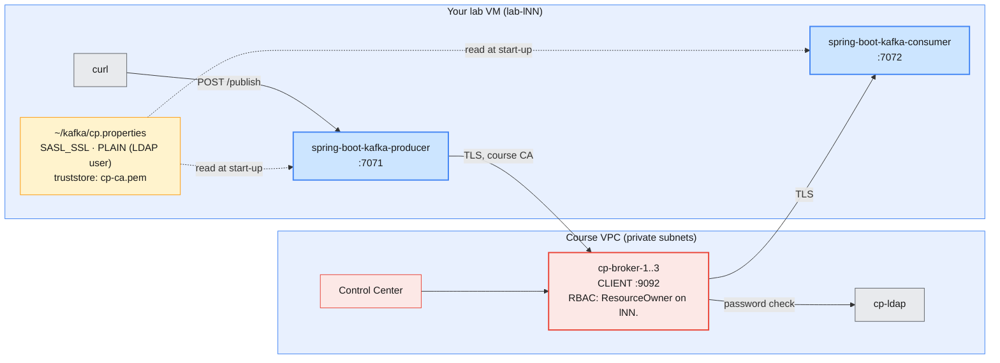
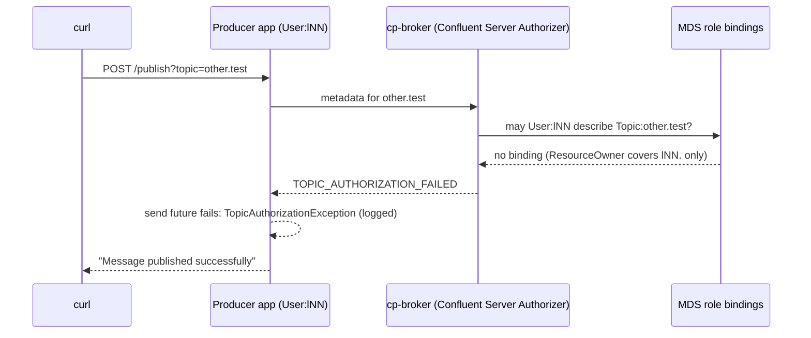

# Lab 05 — Producing & Consuming with Spring Boot on Confluent Platform (AWS)

| | |
| --- | --- |
| **Level** | Intermediate → Advanced |
| **Duration** | ~65 minutes |
| **Guide sections** | §2.1–§2.4 Platform architecture, Confluent Server · §5.5 Logging in to Confluent Platform (MDS) · §6.2 Control Center tour · §7 Topic management · Module 4 §8.2 Loading the shared-cluster configuration |
| **You will need** | Lab 04 done (the Cloud-ready apps in [`lab-04/`](lab-04/) built); the shared Confluent Platform cluster **started by the trainer**; `~/kafka/cp.properties`, `~/kafka/cp-ca.pem`, `~/kafka/confluent.env`; your LDAP password; three terminals; a browser for Control Center |

## Learning objectives

By the end of this lab you will be able to:

1. Run the **same** Spring Boot producer and consumer from Lab 04 against the
   self-hosted Confluent Platform cluster on AWS, by changing only the client
   file.
2. Explain the two differences between the Cloud and Platform client files:
   **LDAP user instead of API key**, and a **truststore** for the course CA.
3. Create topics on Platform with an explicit replication factor through the
   **Admin REST API**, using your MDS login.
4. Watch **RBAC** act on an application: allowed on `lNN.*`, refused
   elsewhere, and recognise the error in the application log.
5. Diagnose a **TLS trust** failure from the application log and fix it.

## Why this lab

Many organisations run both: Confluent Cloud for new services and a
self-managed Confluent Platform in their own network. Application teams want
**one** build that runs on both. Lab 04 made the apps read their connection
settings from a file. In this lab you point the **same jar files** at the
Platform cluster in the course VPC, and see what the platform team controls
there that Confluent controlled on Cloud: certificates, users and role
bindings.



---

## Before you start — variables (5 min)

```bash
# (VM)
source ~/kafka/confluent.env            # CP, MDS_URL, CP_REST, CP_CA, C3_URL
ME=lNN                                  # your prefix
CFG=~/kafka/cp.properties               # your LDAP user on Confluent Platform
CC_CFG=~/kafka/ccloud.properties        # Lab 01, for the comparison in Part 1
echo "$ME   $CP   $CP_REST"
kafka-broker-api-versions.sh --bootstrap-server $CP --command-config $CFG | grep "(id:"
```

**Expected:** your prefix and endpoints, then one line per broker:

```
cp-broker-1.lab.internal:9092 (id: 1 rack: null isFenced: false) -> (
cp-broker-2.lab.internal:9092 (id: 2 rack: null isFenced: false) -> (
cp-broker-3.lab.internal:9092 (id: 3 rack: null isFenced: false) -> (
```

If the command hangs or fails to connect, the cluster is stopped between
sessions: ask the trainer. Then log in to MDS, as in Lab 03 Part 4, with your
LDAP password:

```bash
# (VM)
confluent login --url $MDS_URL --certificate-authority-path $CP_CA --save
confluent context list
```

**Expected:** `Logged in as "lNN".`, and the `*` on the Platform context.

Copy the first variable block into terminals 2 and 3 when you open them.

---

## Part 1 — Same apps, different client file (10 min)

Put the two client files side by side, with the secrets hidden:

```bash
# (VM)
diff <(sed 's/password=.*/password=<hidden>;/' $CC_CFG) \
     <(sed 's/password=.*/password=<hidden>;/' $CFG)
```

**Expected** (your endpoint, key and user differ):

```
1c1
< bootstrap.servers=pkc-xxxxx.ap-south-1.aws.confluent.cloud:9092
---
> bootstrap.servers=cp-kafka.lab.internal:9092
4c4,6
< sasl.jaas.config=org.apache.kafka.common.security.plain.PlainLoginModule required username='ABCDEFGH12345678' password=<hidden>;
---
> sasl.jaas.config=org.apache.kafka.common.security.plain.PlainLoginModule required username="lNN" password=<hidden>;
> ssl.truststore.type=PEM
> ssl.truststore.location=/home/learner/kafka/cp-ca.pem
```

| Line | Confluent Cloud | Confluent Platform on AWS | Who controls it |
| ---- | --------------- | ------------------------- | --------------- |
| **`bootstrap.servers`** | Public `pkc-…` endpoint | Private DNS name in the course VPC | Confluent / your network team |
| **`security.protocol`, `sasl.mechanism`** | `SASL_SSL`, `PLAIN` | `SASL_SSL`, `PLAIN`: identical | — |
| **`username` / `password`** | API key and secret | Your **LDAP** user and password, checked by the brokers against OpenLDAP | Confluent Cloud IAM / your directory team |
| **`ssl.truststore.*`** | Not needed: Cloud certificates chain to a public CA that Java already trusts | **Required**: the brokers use certificates from the **course CA** (`cp-ca.pem`) | Confluent / **your** platform team |

> **What this shows:** the Kafka protocol and the security mechanism are the
> same. What differs is **who issues the identity and the certificates**.
> On Platform both are your organisation's job, so both appear in the
> client file. The `.properties` keys are standard Kafka client settings, so
> the `loadClientConfig()` helper from Lab 04 passes them through unchanged.

No code changes and no rebuild: you reuse the jar files you built in Lab 04.

```bash
# (VM) - from labs/module-06/lab-04
ls spring-boot-kafka-*/target/*.jar
```

**Expected:** the two jar files from Lab 04 Part 2.5. If they are missing,
build them again with the command from Lab 04 Part 2.5.

---

## Part 2 — Create the topics on Platform (5 min)

On Platform you choose the replication factor and `min.insync.replicas`
yourself (Lab 03 Part 4). Create the three topics through the Admin REST API
with your MDS login:

```bash
# (VM)
for t in test demo test1; do
  confluent kafka topic create $ME.$t --url $CP_REST --certificate-authority-path $CP_CA \
    --partitions 3 --replication-factor 3 --config min.insync.replicas=2
done
kafka-topics.sh --bootstrap-server $CP --command-config $CFG --describe --topic $ME.demo
```

**Expected:** `Created topic "lNN.test".` (and `demo`, `test1`), then
three partitions of `lNN.demo` with `ReplicationFactor: 3`, a leader on
brokers 1–3, and `Isr` listing three brokers on every partition.

> **Note:** your role binding is **`ResourceOwner` on `Topic:lNN.`**
> (prefixed). It lets you create, configure and delete any topic whose name
> starts with `lNN.`, and nothing else. The application in this lab runs
> with the **same** LDAP user, so it has the same rights. Module 7 gives an
> application its own, smaller set of rights.

---

## Part 3 — Run the apps on Platform (15 min)

### 3.1 Start the consumer (terminal 2)

```bash
# (VM) - terminal 2, from labs/module-06/lab-04
ME=lNN KAFKA_CLIENT_CONFIG=$HOME/kafka/cp.properties \
  java -jar spring-boot-kafka-consumer/target/spring-boot-kafka-consumer-0.0.1-SNAPSHOT.jar 2>&1 \
  | tee /tmp/$ME-cp-consumer.log
```

Look for `Started SpringBootKafkaConsumerApplication` and six
`partitions assigned` lines, as in Lab 04 Part 3.2:

```
lNN.demo-group: partitions assigned: [lNN.demo-0]
lNN.demo-group: partitions assigned: [lNN.demo-2]
lNN.demo-group: partitions assigned: [lNN.demo-1]
lNN.test-group: partitions assigned: [lNN.test-0, lNN.test-1, lNN.test-2]
lNN.test-group1: partitions assigned: [lNN.test1-0, lNN.test1-1, lNN.test1-2]
lNN.test-group2: partitions assigned: [lNN.test1-0, lNN.test1-1, lNN.test1-2]
```

Check from terminal 1 that every consumer went to the Platform cluster with
TLS and the course CA:

```bash
# (VM) - terminal 1
grep -c "bootstrap.servers = \[cp-kafka.lab.internal:9092\]" /tmp/$ME-cp-consumer.log
grep -c "localhost:9092" /tmp/$ME-cp-consumer.log
grep -m1 "security.protocol" /tmp/$ME-cp-consumer.log
grep -m1 "ssl.truststore.location" /tmp/$ME-cp-consumer.log
grep -m1 "sasl.jaas.config" /tmp/$ME-cp-consumer.log
```

**Expected:** `6`, `0`, `security.protocol = SASL_SSL`,
`ssl.truststore.location = /home/learner/kafka/cp-ca.pem` and
`sasl.jaas.config = [hidden]`.

### 3.2 Start the producer (terminal 3) and send messages

```bash
# (VM) - terminal 3, from labs/module-06/lab-04
ME=lNN KAFKA_CLIENT_CONFIG=$HOME/kafka/cp.properties \
  java -jar spring-boot-kafka-producer/target/spring-boot-kafka-producer-0.0.1-SNAPSHOT.jar
```

Wait for `Started SpringBootKafkaProducerApplication`, then send from
terminal 1:

```bash
# (VM)
curl -s -X POST "localhost:7071/publish?topic=$ME.test" -H 'Content-Type: text/plain' -d 'CDR 966500000002 data 45MB'; echo
for i in 1 2 3 4 5 6; do
  curl -s -X POST "localhost:7071/publish?topic=$ME.demo" -H 'Content-Type: text/plain' -d "CDR $i"; echo
done
curl -s -X POST "localhost:7071/publishObj?topic=$ME.test1" -H 'Content-Type: application/json' \
  -d '{"id":2,"message":"Welcome to Mobily on-prem"}'; echo
```

**Expected:** `Message published successfully` eight times, and in terminal 2
the same pattern as Lab 04 Part 3.3: the six `demo` messages split
between listeners `#1`, `#2` and `#3`, the `test` message once, and the
`test1` message **twice** (once per group):

```
#1 Consume message as String - Received message - "CDR 966500000002 data 45MB"
#3 Consume message as String - Received message - "CDR 1"
#2 Consume message as String - Received message - "CDR 4"
…
Consume message as Object - Received message - ID: 2, Message: Welcome to Mobily on-prem
Consume message as Consumer Record - Received message - ID: 2, Message: Welcome to Mobily on-prem
Consumer Record Details - Topic: lNN.test1, Partition: …, Offset: 0, Key: …, Value: [ID: 2, Message: Welcome to Mobily on-prem]
```

> **What this shows:** the same jar files, unchanged, ran on Confluent Cloud
> in Lab 04 and on a self-managed cluster in AWS now. Only the client file
> changed. Keep application settings outside the build, and one artefact
> moves between environments, including the move from Platform to Cloud in
> Module 10.

---

## Part 4 — RBAC acts on the application (10 min)

The application runs as **your** LDAP user, so it inherits your role
bindings. Publish to a topic outside your prefix:

```bash
# (VM)
time curl -s -X POST "localhost:7071/publish?topic=other.test" -H 'Content-Type: text/plain' -d 'CDR not mine'; echo
```

**What to watch:** `curl` still answers `Message published successfully`.
The samples do not wait for the send result, as you saw in Lab 04 Part 5.
In terminal 3 the producer logs an error with a
**`TopicAuthorizationException`** for `other.test`. Write down the exact
message:

| Question | Your answer |
| -------- | ----------- |
| Exception and message in terminal 3 | |
| How long did `curl` take? | |
| Compare with Lab 04 Part 5 (missing topic on Cloud) | |



Now look at the rights the application had, from the administrator's side:

```bash
# (VM)
CP_ID=$(confluent cluster describe --url $MDS_URL --certificate-authority-path $CP_CA -o json \
  | jq -r '.scope[] | select(.type=="kafka-cluster") | .id')
confluent iam rbac role-binding list --principal User:$ME --kafka-cluster $CP_ID
```

**Expected:** two `ResourceOwner` rows, `Topic` and `Group`, both with name
`lNN.` and pattern type `PREFIXED`.

> **What this shows:** on Cloud, the missing topic made the producer wait
> for metadata until `max.block.ms`. Here the broker answers at once that
> you are **not allowed** to know about the topic. Two different errors,
> two different owners: a missing topic is a deployment problem, an
> authorization error is an access-request problem. Read the exception
> before you open a ticket.

> **Administrator rule:** an application that runs as a **person's** LDAP
> user inherits everything that person may do, and stops working when the
> person leaves. Module 7 gives an application its own identity with only
> `DeveloperRead` / `DeveloperWrite` on its topics (Lab 01 does it on Cloud).

---

## Part 5 — Watch the application in Control Center and the CLI (10 min)

Keep both apps running.

```bash
# (VM)
kafka-consumer-groups.sh --bootstrap-server $CP --command-config $CFG --list | grep "^$ME\."
kafka-consumer-groups.sh --bootstrap-server $CP --command-config $CFG --describe --group $ME.demo-group
```

**Expected:** your four groups, then three rows for `lNN.demo-group`, one
member per partition and `LAG 0`. The `HOST` column shows your VM's
**private** address (`/10.20.x.x`): the traffic never leaves the VPC. On
Cloud the same column showed your VM's public address.

In the browser, open `$C3_URL` and log in as `lNN`:

1. **Topics → `lNN.demo` → Messages**: find the six `CDR n` records, with
   keys, partitions and offsets.
2. **Topics → `lNN.demo`**: check the replica placement. Every partition has three replicas,
   one on each broker.
3. **Consumers → `lNN.demo-group`**: three members, lag 0.

**Try it:** stop the consumer (`Ctrl+C` in terminal 2), send three more
`demo` messages, and refresh **Consumers** in Control Center. Lag **3**
appears. Start the consumer again with the command from Part 3.1 and watch
the lag return to 0.

---

## Part 6 — Break the trust, then fix it (10 min, advanced)

What happens when an application on Platform does not have the course CA? You
make a copy of your client file without the truststore lines.

> **Warning:** the copy contains your LDAP password. It is created with mode
> `600` and deleted at the end of this part.

```bash
# (VM)
umask 077
sed '/^ssl.truststore/d' $CFG > /tmp/$ME-notrust.properties
grep -c truststore /tmp/$ME-notrust.properties
```

**Expected:** `0`: no truststore lines left.

Stop the consumer in terminal 2 (`Ctrl+C`) and start it with the broken file:

```bash
# (VM) - terminal 2, from labs/module-06/lab-04
ME=lNN KAFKA_CLIENT_CONFIG=/tmp/$ME-notrust.properties \
  java -jar spring-boot-kafka-consumer/target/spring-boot-kafka-consumer-0.0.1-SNAPSHOT.jar 2>&1 \
  | grep -m3 -iE "ssl handshake|PKIX|SSLHandshakeException"
```

**Expected:** within a few seconds, log lines that report an **SSL
handshake failure** caused by `PKIX path building failed`. Java does not
trust a certificate signed by the course CA. The application keeps
retrying, and no listener is ever assigned a partition. Press `Ctrl+C`.

| Symptom in the log | Meaning | Fix |
| ------------------ | ------- | --- |
| **`PKIX path building failed`** / `unable to find valid certification path` | The client does not trust the broker's certificate issuer | Give the client the CA (`ssl.truststore.*`) |
| **`Authentication failed: Invalid username or password`** | TLS worked; the LDAP check failed | Fix the user or password (Module 7 Lab 02 Part 2) |
| **`TopicAuthorizationException`** | TLS and login worked; RBAC refused the topic | Request a role binding, or use your prefix (Part 4) |

Restore the working consumer and remove the copy:

```bash
# (VM)
rm -f /tmp/$ME-notrust.properties
ls /tmp/$ME-notrust.properties 2>&1
```

**Expected:** `ls: cannot access '/tmp/lNN-notrust.properties': No such file or directory`.
Then start the consumer again in terminal 2 with the command from Part 3.1.
It catches up from its committed offsets.

> **What this shows:** the three layers fail in a fixed order: **TLS
> trust**, then **authentication**, then **authorization**. The first
> error in the log tells you which layer to fix and who owns it: the
> platform team for certificates, the directory team for passwords, the
> Kafka administrator for role bindings.

---

## Checkpoint questions

<details>
<summary>1. A developer copies the working <code>ccloud.properties</code> settings into the Platform environment and only changes <code>bootstrap.servers</code>. Which two errors will they meet, in which order?</summary>

First an SSL handshake failure (`PKIX path building failed`), because the
file has no truststore for the course CA. After adding the truststore, an
authentication failure, because a Confluent Cloud API key is not an LDAP user.
TLS is checked before the password, so the trust error always comes first.
</details>

<details>
<summary>2. Why did Cloud not need a truststore while Platform does?</summary>

Confluent Cloud's broker certificates are issued by a public CA that the
JDK already trusts. The course Platform cluster uses certificates from a
private CA created for the course (`make-certs.sh`), which no JDK trusts by
default. In a company, the private CA is usually distributed to all hosts or
build images, so applications do not each carry their own copy.
</details>

<details>
<summary>3. The publish to <code>other.test</code> returned "Message published successfully". How would you change the producer endpoint so the caller learns the truth?</summary>

Wait for the result of `KafkaTemplate.send()`. Either block on the returned
future with a timeout and return an HTTP error when it fails, or answer
`202 Accepted` and report failures by another path. For billing CDRs, the
service should confirm only after the broker has acknowledged the record
(with `acks=all`, Module 4 §3.4).
</details>

<details>
<summary>4. Your application must move from the Platform cluster to Confluent Cloud next quarter. Using what you saw in Labs 04 and 05, what is on the migration checklist for the application itself?</summary>

A new client file: Cloud endpoint, an API key for a service account, no
private truststore. Topics created on Cloud with the same names and
settings (partitions; the replication factor is fixed by Cloud). Role
bindings for the service account on those topics and groups, and a plan for
the consumer offsets. The code and the jar do not change. Module 10 covers
the data and offset migration.
</details>

<details>
<summary>5. In <code>--describe</code>, Platform showed a private <code>10.20.x.x</code> host and Cloud a public address. Why does that matter to a network or security reviewer?</summary>

Platform traffic stays inside the VPC, with security groups that admit only
the lab VMs. Cloud traffic crosses the internet to a public endpoint,
protected by TLS and API keys. Many organisations require private
connectivity to Cloud (PrivateLink, VPC peering) for that reason. The
address in `--describe` is a quick way to see which path a client really
uses.
</details>

---

## Clean up

Stop the producer (terminal 3) and the consumer (terminal 2) with `Ctrl+C`.

> **Warning:** delete only your own `$ME.*` topics and groups. Read the
> commands before you run them.

```bash
# (VM)
for t in test demo test1; do
  confluent kafka topic delete $ME.$t --url $CP_REST --certificate-authority-path $CP_CA --force
done
for g in test-group demo-group test-group1 test-group2; do
  kafka-consumer-groups.sh --bootstrap-server $CP --command-config $CFG --delete --group $ME.$g
done
kafka-topics.sh --bootstrap-server $CP --command-config $CFG --list
rm -f /tmp/$ME-cp-consumer.log /tmp/$ME-notrust.properties
confluent context use <your Cloud context name>
```

**Expected:** `Deleted topic "lNN.test".` (and `demo`, `test1`), four
`Deletion of requested consumer groups (…) was successful.` lines, a topic
list without your lab topics, and the `*` back on your Cloud context.

Keep both CLI contexts, `~/kafka/ccloud.properties`, the Cloud topic
`$ME.cdr.voice` and the two apps: Module 7 starts from them.

> **Next module:** *Module 7 — Administering Kafka Security*, where you
> secure both worlds: SASL, SSL and ACLs on Apache Kafka compared with
> Confluent RBAC, role bindings, API keys and service accounts. You replace
> the personal identities these apps used (your Cloud API key and your LDAP
> user) with service accounts that have exactly the rights each application
> needs.
