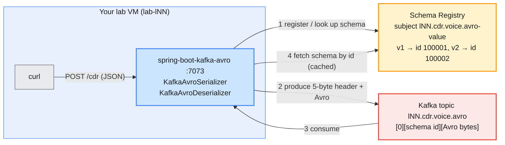

# Lab 06 — Schema Registry on Confluent Cloud and Confluent Platform

| | |
| --- | --- |
| **Level** | Beginner |
| **Duration** | ~75 minutes |
| **Guide sections** | §1.3 Platform components (Schema Registry) · §4.2 Environments (`lsrc-` Schema Registry) · §5 API keys · Lab 04–05 client files |
| **You will need** | Labs 01 and 05 done: `~/kafka/ccloud.properties` (Cloud API key), `~/kafka/cp.properties` + `~/kafka/cp-ca.pem` (Platform); Java 17+; `jq`; two terminals; a browser for the Cloud Console and Control Center |

## Learning objectives

By the end of this lab you will be able to:

1. Explain what Schema Registry stores (**subjects**, **versions**,
   **schema IDs**) and why a producer and a consumer need it.
2. Find the Schema Registry of your Confluent Cloud environment, create an
   API key for it and call its REST API with `curl`.
3. Produce and consume **Avro** records from Spring Boot, and see the
   **5-byte header** (magic byte + schema ID) that replaces the schema in
   every message.
4. Evolve a schema **safely**: test compatibility first, register a
   backward-compatible version, and watch the registry refuse a breaking
   one.
5. Run the **same jar** against the self-managed Schema Registry on the
   Confluent Platform cluster, with your LDAP user, the course CA and RBAC
   on subjects.

## Why this lab

In Labs 04–05 the apps exchanged JSON strings. Nothing stopped a producer
from renaming a field or sending `"duration": "forty-two"`, and the
consumer found out only when it crashed. **Schema Registry** turns the
message format into a contract that the platform checks:

- The producer **registers** its schema once and puts only a small **schema
  ID** in each message: the payload is compact Avro binary, not JSON text.
- The consumer **looks up** the schema by ID, so it can always decode the
  bytes, even records written with an older version.
- The registry **refuses** a new version that would break existing
  consumers, before a single bad record reaches the topic.



| | Confluent Cloud (Parts 2–4) | Confluent Platform on AWS (Parts 5–6) |
| --- | --- | --- |
| **Where it runs** | One Schema Registry per environment (`env-lNN`), run by Confluent | `cp-services.lab.internal:8081`, shared by the class, run by the trainer |
| **Endpoint** | `https://psrc-….aws.confluent.cloud` | `$SR_URL` = `https://cp-services.lab.internal:8081` |
| **Credentials** | A **Schema Registry API key** (not your Kafka key) | Your **LDAP user**, same as `cp.properties` |
| **TLS trust** | Public CA, nothing to configure | The course CA, `~/kafka/cp-ca.pem` |
| **Who may write which subject** | Everything in your own environment | RBAC: `ResourceOwner` on subjects starting with `lNN.` |

---

## Before you start — variables and build (10 min)

```bash
# (VM) - terminal 1
source ~/kafka/confluent.env            # CP, MDS_URL, CP_REST, CP_CA, SR_URL
ME=lNN                                  # your prefix
CFG=~/kafka/cp.properties               # Platform (Part 5)
CC_CFG=~/kafka/ccloud.properties        # Cloud (Lab 01)
CCLOUD=$(sed -n 's/^bootstrap.servers=//p' $CC_CFG)
TOPIC=$ME.cdr.voice.avro
SUBJECT=$TOPIC-value
echo "$ME  $CCLOUD  $SUBJECT  ${SR_URL:-<SR_URL missing>}"
```

**Expected:** your prefix, your Cloud bootstrap endpoint and
`lNN.cdr.voice.avro-value`. If the last word is `<SR_URL missing>`, your
`confluent.env` is older than this lab: add the line yourself
(`export SR_URL=https://cp-services.lab.internal:8081`).

Lab 05 left the Platform login as the current CLI context. Parts 2–4 work
on Cloud, so switch back:

```bash
# (VM)
confluent context list                  # the Cloud context is the one with your e-mail
confluent context use <cloud-context-name>
confluent kafka cluster describe        # lNN-basic
```

Build the lab app. The first build downloads the Confluent serializer from
`packages.confluent.io`, which takes a minute:

```bash
# (VM) - from labs/module-06/lab-06/spring-boot-kafka-avro
./mvnw -q package
ls target/*.jar
```

**Expected:** `target/spring-boot-kafka-avro-0.0.1-SNAPSHOT.jar` and
`Tests run: 4, Failures: 0`. The tests check the schemas without a
cluster: v2 can read v1 data, v3-breaking cannot.

---

## Part 1 — Read the schema and the app (10 min)

### 1.1 The schema is a file

Open `src/main/resources/avro/cdr-voice-v1.avsc`:

```json
{
  "type": "record",
  "name": "CdrVoice",
  "namespace": "com.examples.telco",
  "fields": [
    {"name": "callId",      "type": "string"},
    {"name": "caller",      "type": "string"},
    {"name": "callee",      "type": "string"},
    {"name": "durationSec", "type": "int"}
  ]
}
```

An **Avro schema** is JSON that names every field and its type. The same
folder holds the next versions you will use later: `cdr-voice-v2.avsc`
(adds `roaming` with a default) and `cdr-voice-v3-breaking.avsc` (adds
`network` **without** a default).

### 1.2 Three words you need

| Term | Meaning in this lab |
| ---- | ------------------- |
| **Subject** | The name a schema is registered under. By default one per topic and part: `lNN.cdr.voice.avro-value` (`-key` for keys). |
| **Version** | 1, 2, 3 … inside a subject. Each successful registration adds one. |
| **Schema ID** | A number unique in the whole registry. It is what travels **inside each message**. |
| **Compatibility** | The rule a new version must pass. The default, **BACKWARD**, means: a consumer using the **new** schema can still read data written with the **previous** one. |

### 1.3 Two serializer settings make it Avro

```bash
# (VM) - from labs/module-06/lab-06/spring-boot-kafka-avro
grep -n "Avro\|loadClientConfig(" src/main/java/com/examples/spring/boot/kafka/avro/KafkaAvroConfig.java
```

**Expected:** `KafkaAvroSerializer` for the producer value,
`KafkaAvroDeserializer` for the consumer value, and **two** client files
loaded into both: the Kafka file you know from Labs 04–05
(`KAFKA_CLIENT_CONFIG`) and a new **Schema Registry** file
(`SR_CLIENT_CONFIG`). Everything else is the plain Spring Kafka you used
before. The app:

- `POST /cdr` turns your JSON into an Avro record with the schema chosen by
  `SCHEMA=v1|v2|v3-breaking` and sends it to `lNN.cdr.voice.avro`, keyed by
  `caller`.
- a `@KafkaListener` in the same app (group `lNN.cdr-avro-reader`) logs
  every record it reads back, with its field count.

> **Note:** the app uses Avro `GenericRecord`, so you can switch schema
> versions with an environment variable and no rebuild. Production apps
> usually generate Java classes from the `.avsc` files instead
> (`avro-maven-plugin`); the bytes on the wire are the same.

---

## Part 2 — Connect to Schema Registry on Confluent Cloud (10 min)

### 2.1 Find your Schema Registry

Every Cloud environment with Stream Governance has one Schema Registry
(`lsrc-…`). Make sure your environment is selected (Lab 01), then:

```bash
# (VM)
confluent environment list
confluent schema-registry cluster describe
```

**Expected:** a `*` in front of `env-lNN`, then a table with
`Cluster ID | lsrc-xxxxxx`, `Endpoint URL | https://psrc-xxxxx.ap-south-1.aws.confluent.cloud`
and `Package | essentials` (or `advanced`).

```bash
# (VM)
SR_ID=$(confluent schema-registry cluster describe -o json | jq -r .cluster)
SR_CC=$(confluent schema-registry cluster describe -o json | jq -r .endpoint_url)
echo "$SR_ID  $SR_CC"
```

> **Note:** if `jq` prints `null`, your CLI version names the fields
> differently. Run `confluent schema-registry cluster describe -o json`
> and copy the ID and URL into the two variables by hand.

### 2.2 Create a Schema Registry API key

Your Kafka API key from Lab 01 is scoped to the **Kafka cluster**
(`lkc-…`). Schema Registry is a different resource, so it needs its own key:

```bash
# (VM)
confluent api-key create --resource $SR_ID --description "$ME lab06 schema registry"
```

**Expected:** a table with `API Key` and `API Secret`. **Copy the secret
now**: Confluent shows it only once.

Store it in a Schema Registry client file, readable only by you:

```bash
# (VM) - paste your key and secret
SR_KEY=<API Key>
SR_SECRET='<API Secret>'
umask 077
cat > ~/kafka/sr-ccloud.properties <<EOF
schema.registry.url=$SR_CC
basic.auth.credentials.source=USER_INFO
basic.auth.user.info=$SR_KEY:$SR_SECRET
EOF
ls -l ~/kafka/sr-ccloud.properties
```

**Expected:** `-rw-------` and the file name.

### 2.3 Talk to the REST API

Schema Registry is a plain HTTPS + JSON service. A small shell function
saves typing for the rest of the lab: `sr <path> [curl options]`.

```bash
# (VM)
SR=$SR_CC; SR_AUTH="$SR_KEY:$SR_SECRET"; SR_CA=
sr() { curl -s -u "$SR_AUTH" ${SR_CA:+--cacert "$SR_CA"} "$SR$1" "${@:2}"; echo; }

sr /subjects
sr /config
```

**Expected:** `[]` (no subjects yet, unless you registered some before) and
`{"compatibilityLevel":"BACKWARD"}`, the registry-wide default rule.

If you get `{"error_code":401,"message":"Unauthorized"}`, the key is
wrong or not active yet: wait a minute and check `SR_AUTH`.

---

## Part 3 — Produce and consume Avro on Cloud (15 min)

### 3.1 Create the topic

```bash
# (VM)
confluent kafka topic create $TOPIC --partitions 3
```

**Expected:** `Created topic "lNN.cdr.voice.avro".`

### 3.2 Start the app with schema v1 (terminal 2)

```bash
# (VM) - terminal 2, from labs/module-06/lab-06/spring-boot-kafka-avro
ME=lNN SCHEMA=v1 \
KAFKA_CLIENT_CONFIG=$HOME/kafka/ccloud.properties \
SR_CLIENT_CONFIG=$HOME/kafka/sr-ccloud.properties \
  java -jar target/spring-boot-kafka-avro-0.0.1-SNAPSHOT.jar
```

**Expected**, among the start-up lines:

```
Producer writes to 'lNN.cdr.voice.avro' with schema v1 (4 fields)
Started SpringBootKafkaAvroApplication in … seconds
lNN.cdr-avro-reader: partitions assigned: [lNN.cdr.voice.avro-0, lNN.cdr.voice.avro-1, lNN.cdr.voice.avro-2]
```

### 3.3 Send two calls (terminal 1)

```bash
# (VM) - terminal 1
for n in 1 2; do
  curl -s -X POST localhost:7073/cdr -H 'Content-Type: application/json' \
    -d "{\"callId\":\"c-$n\",\"caller\":\"919845000$n\",\"callee\":\"9198451111\",\"durationSec\":$((n*40))}"
done
```

**Expected:** `Sent with schema v1 to lNN.cdr.voice.avro-<p>@<offset>` twice.
In terminal 2 the listener prints each record back:

```
Received lNN.cdr.voice.avro-1@0 key=9198450001 fields=4 value={"callId": "c-1", "caller": "9198450001", "callee": "9198451111", "durationSec": 40}
```

### 3.4 What did the first send register?

```bash
# (VM) - terminal 1
sr /subjects
sr /subjects/$SUBJECT/versions
sr /subjects/$SUBJECT/versions/1 | jq '{subject, version, id}'
```

**Expected:**

```
["lNN.cdr.voice.avro-value"]
[1]
{ "subject": "lNN.cdr.voice.avro-value", "version": 1, "id": 100001 }
```

Your ID will differ. The serializer registered the schema on the first
send (`auto.register.schemas` is `true` by default) and cached the ID for
every later send.

### 3.5 Look at the raw bytes

The console consumer knows nothing about Avro. Look at one record as hex:

```bash
# (VM)
kafka-console-consumer.sh --bootstrap-server $CCLOUD --consumer.config $CC_CFG \
  --topic $TOPIC --from-beginning --max-messages 1 2>/dev/null | xxd | head -3
```

**Expected** (bytes differ):

```
00000000: 0000 0186 a106 632d 3114 3931 3938 3435  ......c-1.919845
00000010: 3030 3031 1439 3139 3834 3531 3131 3150  0001.91984511111P
```

| Bytes | Meaning |
| ----- | ------- |
| `00` | **Magic byte**: "this value uses the Schema Registry format" |
| `0001 86a1` | **Schema ID** as a 4-byte number (`0x186a1` = 100001, your `id` from 3.4) |
| rest | Avro binary: field values only, no field names. `06 632d31` = length 3, `c-1` |

The field **names** are not in the message: they live once in the
registry. That is why Avro records are smaller than the same JSON, and why
a consumer without access to the registry cannot read them.

### 3.6 The same view in the Cloud Console

1. Open `https://confluent.cloud` → **Environments** → `env-lNN`.
2. **Schema Registry** (left menu, or the **Data contracts** tab of the
   environment) → find `lNN.cdr.voice.avro-value`. You see version 1 and
   the four fields.
3. **Clusters** → `lNN-basic` → **Topics** → `lNN.cdr.voice.avro` →
   **Messages**. The Console decodes the Avro values with the registry and
   shows them as JSON.

---

## Part 4 — Evolve the schema safely (15 min)

The business wants to know whether a call was made while **roaming**.
Old records do not have this field.

### 4.1 Ask the registry before you change anything

The compatibility endpoint tests a schema against the latest version
**without** registering it:

```bash
# (VM) - from labs/module-06/lab-06/spring-boot-kafka-avro
AVRO=src/main/resources/avro
check() { jq -n --rawfile s "$AVRO/cdr-voice-$1.avsc" '{schema: $s}' \
  | sr "/compatibility/subjects/$SUBJECT/versions/latest?verbose=true" \
       -X POST -H 'Content-Type: application/vnd.schemaregistry.v1+json' -d @- | jq; }

check v2
check v3-breaking
```

**Expected:**

```
{ "is_compatible": true, "messages": [] }
{
  "is_compatible": false,
  "messages": [
    "{errorType:'READER_FIELD_MISSING_DEFAULT_VALUE', description:'The field 'network' at path '/fields/5' in the new schema has no default value and is missing in the old schema', …}",
    …
  ]
}
```

| Change | BACKWARD-compatible? | Why |
| ------ | -------------------- | --- |
| v2: add `roaming`, **default `false`** | Yes | A reader using v2 fills `roaming=false` into old v1 records |
| v3: add `network`, **no default** | No | A reader using v3 has no value to put into `network` for old records |

> **Rule of thumb for BACKWARD:** you may **add** fields with a default and
> **remove** fields. You may not add a required field or change a field's
> type. Upgrade the **consumers first**, then the producers.

### 4.2 Produce with v2 (terminal 2)

Stop the app with `Ctrl+C` and start it with the new schema. Same jar:

```bash
# (VM) - terminal 2
ME=lNN SCHEMA=v2 \
KAFKA_CLIENT_CONFIG=$HOME/kafka/ccloud.properties \
SR_CLIENT_CONFIG=$HOME/kafka/sr-ccloud.properties \
  java -jar target/spring-boot-kafka-avro-0.0.1-SNAPSHOT.jar
```

**Expected:** `… with schema v2 (5 fields)`.

```bash
# (VM) - terminal 1
curl -s -X POST localhost:7073/cdr -H 'Content-Type: application/json' \
  -d '{"callId":"c-3","caller":"9198450003","callee":"447700900123","durationSec":300,"roaming":true}'
sr /subjects/$SUBJECT/versions
sr /subjects/$SUBJECT/versions/latest | jq '{version, id}'
```

**Expected:** `Sent with schema v2 …`, then `[1,2]` and version 2 with a
**new** ID. In terminal 2:

```
Received … key=9198450003 fields=5 value={…, "durationSec": 300, "roaming": true}
```

The topic now holds v1 and v2 records side by side. Each record carries
its own schema ID, so every consumer can decode both.

### 4.3 Watch the registry refuse a breaking change

Restart the app once more, now with `SCHEMA=v3-breaking`, and send a call
that even includes the new field:

```bash
# (VM) - terminal 2: Ctrl+C, then
ME=lNN SCHEMA=v3-breaking \
KAFKA_CLIENT_CONFIG=$HOME/kafka/ccloud.properties \
SR_CLIENT_CONFIG=$HOME/kafka/sr-ccloud.properties \
  java -jar target/spring-boot-kafka-avro-0.0.1-SNAPSHOT.jar
```

```bash
# (VM) - terminal 1
curl -s -X POST localhost:7073/cdr -H 'Content-Type: application/json' \
  -d '{"callId":"c-4","caller":"9198450004","callee":"9198451111","durationSec":10,"network":"5G"}'
sr /subjects/$SUBJECT/versions
```

**Expected:**

```
Send failed: io.confluent.kafka.schemaregistry.client.rest.exceptions.RestClientException: Schema being registered is incompatible with an earlier schema for subject "lNN.cdr.voice.avro-value" …; error code: 409
[1,2]
```

The record **never reached Kafka**: the serializer asked the registry
first, got `409 Conflict`, and the send failed in the producer. The topic
stays clean for every consumer.

Stop the app with `Ctrl+C`.

---

## Part 5 — The same jar on Confluent Platform (15 min)

On the Platform cluster the trainer runs Schema Registry next to Control
Center. The protocol is identical; only the client files change.

### 5.1 Create the Schema Registry client file

Your LDAP password is already in `cp.properties`. Reuse it:

```bash
# (VM) - terminal 1
LDAP_PW=$(sed -n 's/.*password="\([^"]*\)".*/\1/p' $CFG)
umask 077
cat > ~/kafka/sr-cp.properties <<EOF
schema.registry.url=$SR_URL
basic.auth.credentials.source=USER_INFO
basic.auth.user.info=$ME:$LDAP_PW
schema.registry.ssl.truststore.type=PEM
schema.registry.ssl.truststore.location=$CP_CA
EOF
diff <(sed 's/user.info=.*/user.info=<hidden>/' ~/kafka/sr-ccloud.properties) \
     <(sed 's/user.info=.*/user.info=<hidden>/' ~/kafka/sr-cp.properties)
```

**Expected:** only the URL differs, plus two extra truststore lines for the
course CA: the same two differences you saw for Kafka in Lab 05.

Point the `sr` helper at the Platform registry and try it:

```bash
# (VM)
SR=$SR_URL; SR_AUTH="$ME:$LDAP_PW"; SR_CA=$CP_CA
sr /subjects
sr "/config/$SUBJECT?defaultToGlobal=true"
```

**Expected:** a list holding only the subjects **you** may see (empty
now; other learners' subjects are hidden by RBAC) and
`{"compatibilityLevel":"BACKWARD"}`.

### 5.2 Create the topic and run the app

```bash
# (VM) - terminal 1
confluent login --url $MDS_URL --certificate-authority-path $CP_CA --save
confluent kafka topic create $TOPIC --url $CP_REST --certificate-authority-path $CP_CA \
  --partitions 3 --replication-factor 3 --config min.insync.replicas=2
```

```bash
# (VM) - terminal 2, from labs/module-06/lab-06/spring-boot-kafka-avro
ME=lNN SCHEMA=v1 \
KAFKA_CLIENT_CONFIG=$HOME/kafka/cp.properties \
SR_CLIENT_CONFIG=$HOME/kafka/sr-cp.properties \
  java -jar target/spring-boot-kafka-avro-0.0.1-SNAPSHOT.jar
```

Send the same two calls as in Part 3.3, then a v2 call after restarting
with `SCHEMA=v2` as in Part 4.2. Check the registry:

```bash
# (VM) - terminal 1
sr /subjects
sr /subjects/$SUBJECT/versions
sr /subjects/$SUBJECT/versions/1 | jq '{subject, version, id}'
```

**Expected:** `["lNN.cdr.voice.avro-value"]`, `[1,2]`, and an ID that is
**small** (for example `3`). A self-managed registry numbers schemas from 1
for the whole cluster, while Cloud IDs start at 100000. The ID is local to
one registry: never copy Avro bytes between registries without their
schemas.

### 5.3 See it in Control Center

1. Open `$C3_URL` in your browser and log in with your LDAP user.
2. **Topics** → `lNN.cdr.voice.avro` → **Schema** (or **Data contracts**):
   the value schema, its versions, and the compatibility level.
3. **Messages**: the values decoded through Schema Registry.

---

## Part 6 — RBAC on subjects (5 min)

On the shared Platform registry your role binding is **`ResourceOwner` on
`Subject:lNN.`** (prefixed), just like your topics. Try to register a
schema under a name you do not own:

```bash
# (VM) - from labs/module-06/lab-06/spring-boot-kafka-avro
jq -n --rawfile s src/main/resources/avro/cdr-voice-v1.avsc '{schema: $s}' \
  | sr /subjects/cdr.voice-value/versions -X POST \
       -H 'Content-Type: application/vnd.schemaregistry.v1+json' -d @-
```

**Expected** (the wording can vary between versions; the code `403…` is what matters):

```
{"error_code":40301,"message":"User is denied operation Write on Subject: cdr.voice-value"}
```

| Who | Can register under | Granted by |
| --- | ------------------ | ---------- |
| You (`lNN`) | `lNN.*` | `ResourceOwner` on `Subject:lNN.` (prefixed) in the Schema Registry cluster |
| Another learner | their own `lMM.*` | Same binding with their prefix |
| Trainer | everything | `SystemAdmin` |

On Cloud you own the whole registry of `env-lNN`, so the same request
would succeed there. That is the difference between **one registry per
team** (Cloud environments) and **one shared registry** (this Platform
cluster) protected by RBAC.

---

## Checkpoint questions

<details>
<summary>1. A producer sends 1 million CDRs with the same schema. How many times is the schema itself sent to Kafka?</summary>

Zero. The schema goes to **Schema Registry** once, on the first send, and
each record carries only the 4-byte **schema ID** after the magic byte.
Both sides cache the ID ↔ schema mapping, so the registry is called once
per schema, not once per record.
</details>

<details>
<summary>2. Why was v2 accepted and v3-breaking refused, although both only add a field?</summary>

Under **BACKWARD** compatibility a consumer using the new schema must be
able to read the old data. v2's `roaming` has a **default**, so the reader
fills `false` into old records. v3's `network` has **no default**, so there
is no value to use for old records: the registry answers `409` and the
producer never writes the record.
</details>

<details>
<summary>3. A consumer team says "we get <code>401 Unauthorized</code> on Cloud, but our Kafka API key works". What is wrong?</summary>

They use the **Kafka** API key for Schema Registry. On Cloud the registry
(`lsrc-…`) is a separate resource and needs its own API key, created with
`--resource lsrc-…`, in `basic.auth.user.info`.
</details>

<details>
<summary>4. Moving the app from Cloud to Platform, what changed and what did not?</summary>

Changed: only the two client files: Kafka (`cp.properties`) and Schema
Registry (`sr-cp.properties`: URL, LDAP user instead of API key, the
course CA). Not changed: the jar, the schemas, the subject name, and the
compatibility rule. Schema IDs differ between the two registries, which is
why each cluster needs its own registry or schema replication.
</details>

<details>
<summary>5. Why can you register <code>lNN.cdr.voice.avro-value</code> on the Platform registry but not <code>cdr.voice-value</code>?</summary>

The shared registry uses **RBAC on subjects**. Your binding is
`ResourceOwner` on subjects starting with `lNN.`. With the default naming
(`<topic>-value`), keeping every topic in your prefix also keeps every
subject in your prefix, so topic and subject rights line up.
</details>

---

## Troubleshooting

| Symptom | Likely cause | Fix |
| ------- | ------------ | --- |
| `401 Unauthorized` from the registry (Cloud) | Kafka API key used, or the new key is not active yet | Use the key created with `--resource $SR_ID`; wait 1–2 minutes |
| `401 Unauthorized` from the registry (Platform) | Wrong LDAP password in `sr-cp.properties` | Re-create the file from `cp.properties` (Part 5.1) |
| `PKIX path building failed` / `SSLHandshakeException` (Platform) | The registry's certificate is from the course CA | Check `schema.registry.ssl.truststore.*` in `sr-cp.properties`; `--cacert $CP_CA` for curl |
| `40301 User is denied operation Write on Subject` | Subject outside your prefix, or the trainer has not added the Subject role binding | Keep the topic in `lNN.`; ask the trainer to run `cp-rbac-learners.sh` |
| `409` / `incompatible with an earlier schema` | Expected in Part 4.3 | Give new fields a default, or change the subject's compatibility level (only if every consumer agrees) |
| App log: `Error retrieving Avro schema for id …` | The consumer reads records written to a **different** registry, or has no read right on the subject | Use the registry the producer used; check the consumer's credentials |
| `Connection refused` / timeout on `cp-services.lab.internal:8081` | Platform services stopped between sessions | Ask the trainer (`cp-power.sh start`) |

---

## Clean up

Stop the app with `Ctrl+C`.

> **Warning:** delete only your own subjects and topics. Deleting a
> subject in a shared registry cannot be undone after the `permanent=true`
> step.

**Platform** (`sr` still points there after Part 5):

```bash
# (VM)
sr /subjects/$SUBJECT -X DELETE                    # soft delete: [1,2]
sr "/subjects/$SUBJECT?permanent=true" -X DELETE   # hard delete: [1,2]
confluent kafka topic delete $TOPIC --url $CP_REST --certificate-authority-path $CP_CA --force
```

**Cloud:**

```bash
# (VM)
SR=$SR_CC; SR_AUTH="$SR_KEY:$SR_SECRET"; SR_CA=
sr /subjects/$SUBJECT -X DELETE
sr "/subjects/$SUBJECT?permanent=true" -X DELETE
confluent context list                             # switch back to your Cloud context if needed (Lab 03)
confluent kafka topic delete $TOPIC --force
kafka-consumer-groups.sh --bootstrap-server $CCLOUD --command-config $CC_CFG --delete --group $ME.cdr-avro-reader
```

**Expected:** `[1,2]` from each delete, `Deleted topic "lNN.cdr.voice.avro".`
and the group deletion message.

Keep `~/kafka/sr-ccloud.properties`, `~/kafka/sr-cp.properties` and the Cloud
Schema Registry API key if you want to try more Avro on your own; ksqlDB
(Lab 08) can declare a stream with `VALUE_FORMAT='AVRO'` and take its
columns straight from the registry. To remove the key when you no longer
need it:

```bash
# (VM)
confluent api-key delete $SR_KEY --force
rm -f ~/kafka/sr-ccloud.properties
```
