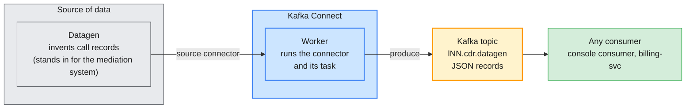

# Lab 07 — Kafka Connect on Confluent Cloud and Confluent Platform

| | |
| --- | --- |
| **Level** | Beginner |
| **Duration** | ~75 minutes |
| **Guide sections** | §2.2 Component map (Kafka Connect) · §4.1 Who operates what · §5.4 API keys · §6.2 Control Center tour |
| **You will need** | Labs 01 and 05 done: `~/kafka/ccloud.properties` (Cloud API key), `~/kafka/cp.properties` + `~/kafka/cp-ca.pem` (Platform); `jq`, `curl`; two terminals; a browser for the Cloud Console. The helper files are in [`lab-07/`](lab-07/) |

## Learning objectives

By the end of this lab you will be able to:

1. Explain what **Kafka Connect** does and name its parts: **worker**,
   **connector**, **task**, **converter** and **plugin**, and the difference
   between a **source** and a **sink**.
2. Create a **fully managed** Datagen Source connector on Confluent Cloud
   with the Confluent CLI, read its status and see its records in a topic.
3. **Pause and resume** a connector and prove the effect by watching the
   topic's end offsets.
4. Use the **Connect REST API** of the self-managed Confluent Platform
   cluster to list plugins, create a connector, read its status and remove it.
5. Tell a **connector** state from a **task** state, read the `trace` of a
   failed task, fix the cause and restart the task.
6. Compare who runs the workers, who pays and how access is controlled on
   Cloud and on Platform.

## Why this lab

In Labs 04–06 every record came from an application you ran. In a telecom
operator most data starts somewhere else: a mediation system, a billing
database, files dropped by a partner, an object store. Writing a Java
producer for each source is slow and every team would write it differently.
**Kafka Connect** is the part of Kafka that moves data between Kafka and
other systems **with configuration instead of code**. You describe the
connection in JSON, the Connect **workers** run it, and the data appears in
a topic.

A real mediation feed is not available in this course, so you use the
**Datagen** connector: it invents call records on a schedule. It needs no
external system, which makes it the cheapest way to see exactly how Connect
behaves. The administration is the same for any other connector.



You run the **same** connector twice. Only the place where Connect runs
changes:

| | Confluent Cloud (Part 2) | Confluent Platform on AWS (Parts 3–4) |
| --- | --- | --- |
| **Where it runs** | **Fully managed**: Confluent runs the workers for you | One shared **Connect cluster** on the services node, `cp-services.lab.internal:8083`, run by the trainer |
| **How you manage it** | Confluent CLI or Cloud Console | **REST API** (`curl`) with your LDAP user |
| **Connector class** | A short name: `DatagenSource` | The full Java class: `io.confluent.kafka.connect.datagen.DatagenConnector` |
| **Who connects to Kafka** | The connector, with **your Kafka API key** inside its configuration | The **worker**, with its own identity. You give no Kafka credentials |
| **Plugins** | Confluent offers a catalog; you cannot add your own here | Whatever the trainer installed on the workers |
| **Access control** | Everything in your own environment | RBAC: `ResourceOwner` on connectors whose name starts with `lNN.` |
| **Cost** | Per **task-hour** while the connector exists | Shared worker capacity: nothing extra for you, but nothing left for others if you leave connectors running |

---

## Before you start — variables (5 min)

```bash
# (VM)
source ~/kafka/confluent.env            # CP, MDS_URL, CP_REST, CP_CA, C3_URL, CONNECT_URL
ME=lNN                                  # your prefix
export ME
CFG=~/kafka/cp.properties               # Platform
CC_CFG=~/kafka/ccloud.properties        # Cloud (Lab 01)
CCLOUD=$(sed -n 's/^bootstrap.servers=//p' $CC_CFG)
CP_CONNECT=${CONNECT_URL:-https://cp-services.lab.internal:8083}
TOPIC=$ME.cdr.datagen
NAME=$ME.datagen-cdr
cd labs/module-06/lab-07                # every command below runs from here
echo "$ME  $CCLOUD  $CP_CONNECT  $TOPIC"
```

**Expected:** your prefix, your Cloud bootstrap endpoint,
`https://cp-services.lab.internal:8083` and `lNN.cdr.datagen`. If
`CONNECT_URL` is not in your `confluent.env`, the lab falls back to the URL
above.

Labs 05 and 06 may have left the Platform login as the current CLI context.
Parts 1–2 work on Cloud, so switch back:

```bash
# (VM)
confluent context list                  # the Cloud context is the one with your e-mail
confluent context use <cloud-context-name>
confluent kafka cluster describe        # lNN-basic
```

---

## Part 1 — Kafka Connect in ten minutes (8 min)

### 1.1 The words you need

| Term | Meaning in this lab |
| ---- | ------------------- |
| **Worker** | A Java process that runs connectors. Workers in a **Connect cluster** share the work and take over for each other. |
| **Connector** | The *configuration* of one data flow: which system, which topic, how often. It does little work itself. |
| **Task** | The unit that actually moves data. A connector starts **one or more tasks** (`tasks.max` is the upper limit) and the workers spread them out. |
| **Source / Sink** | A **source** connector reads from an outside system and writes **into** Kafka. A **sink** reads from Kafka and writes **out**. Datagen is a source. |
| **Converter** | Turns between the Connect internal record and the bytes in Kafka: JSON, Avro, string. You choose it for the **key** and the **value**. |
| **Plugin** | The installed code of a connector (a JAR on the worker, or an entry in Confluent's Cloud catalog). No plugin, no connector. |

### 1.2 The data generator is a schema file

Open `cdr-datagen.avsc`. It is an ordinary Avro schema (you met them in
Lab 06) with a hint called `arg.properties` on each field:

```bash
# (VM)
jq -c '.fields[] | {name, hint: .type["arg.properties"]}' cdr-datagen.avsc
```

**Expected:**

```
{"name":"callId","hint":{"range":{"min":100000,"max":999999}}}
{"name":"caller","hint":{"options":["9198450001","9198450002","9198450003","9198450004","9198450005"]}}
{"name":"callee","hint":{"options":["9198451111","9198452222","447700900123","971500900456"]}}
{"name":"durationSec","hint":{"range":{"min":5,"max":600}}}
```

`options` picks one value from a list, `range` picks a number between two
limits. Each generated record is a call: five callers, four callees, a
random duration.

> **Note:** Datagen can also generate a `regex` pattern on a self-managed
> worker, but the **fully managed** Cloud connector does not support it.
> The schema here uses only `options` and `range` so the **same file works
> on both targets**.

### 1.3 The helper prints the connector configuration

`datagen-config.sh` builds the JSON that each target needs. Look at the
Platform version first. It holds no secret, so it is safe to print:

```bash
# (VM)
./datagen-config.sh platform | jq 'del(.config["schema.string"])'
```

**Expected:**

```json
{
  "name": "lNN.datagen-cdr",
  "config": {
    "connector.class": "io.confluent.kafka.connect.datagen.DatagenConnector",
    "kafka.topic": "lNN.cdr.datagen",
    "max.interval": "1000",
    "tasks.max": "1",
    "key.converter": "org.apache.kafka.connect.storage.StringConverter",
    "value.converter": "org.apache.kafka.connect.json.JsonConverter",
    "value.converter.schemas.enable": "false"
  }
}
```

(The long `schema.string` is removed here only to keep the output short.)

| Setting | Meaning |
| ------- | ------- |
| `name` | The connector's name. On Platform it starts with `lNN.`, because that is what your RBAC binding covers. |
| `kafka.topic` | Where the generated calls go. |
| `max.interval` | The generator waits a random time up to this many milliseconds between records, so expect roughly one to a few records per second. |
| `tasks.max` | Upper limit of tasks. One is enough here and keeps the load on the shared workers small. |
| `key.converter`, `value.converter` | Plain text key, JSON value **without** an embedded schema (`schemas.enable=false`), so a console consumer reads it. |

You will see the Cloud version in Part 2.

---

## Part 2 — A fully managed connector on Confluent Cloud (22 min)

### 2.1 What does the catalog offer?

```bash
# (VM)
confluent connect plugin list | grep -i datagen
```

**Expected:** a line with `DatagenSource`. The full list holds
the managed connectors Confluent runs for you (databases, object stores,
message queues, SaaS systems). In the Cloud Console the same catalog is under
**Environments** → `env-lNN` → **Clusters** → `lNN-basic` → **Connectors**
→ **Add connector**.

> **Note:** you do not install anything on Cloud. The plugin already exists
> in Confluent's fleet; you only create a connector from it.

### 2.2 Create the topic

A managed connector does not create the topic for you. Create it first:

```bash
# (VM)
confluent kafka topic create $TOPIC --partitions 3
```

**Expected:** `Created topic "lNN.cdr.datagen".`

> **Common trap:** if the topic is missing, the connector is created happily
> and then **fails** when its first record has nowhere to go. You meet the
> same failure on Platform in Part 4.

### 2.3 Build the Cloud configuration

On Cloud the **connector** connects to your Kafka cluster, so the
configuration carries a Kafka API key. The helper reads the key from the
client file you built in Lab 01 and writes the JSON into a file only you can
read:

```bash
# (VM)
umask 077
./datagen-config.sh cloud > ~/kafka/datagen-cloud.json
ls -l ~/kafka/datagen-cloud.json
jq 'del(."kafka.api.secret", ."schema.string")' ~/kafka/datagen-cloud.json
```

**Expected:** `-rw-------`, then:

```json
{
  "name": "lNN.datagen-cdr",
  "connector.class": "DatagenSource",
  "kafka.auth.mode": "KAFKA_API_KEY",
  "kafka.api.key": "<your API key>",
  "kafka.topic": "lNN.cdr.datagen",
  "output.data.format": "JSON",
  "max.interval": "1000",
  "tasks.max": "1"
}
```

> **Administrator rule:** the file holds your **API secret**. Keep the mode
> `600`, never paste it into a chat or a ticket, and delete it in the clean
> up. (Module 7 replaces user keys with **service accounts**, the better
> identity for a connector.)

Compare it with Part 1.3 and note the differences:

| Cloud | Platform | Why |
| ----- | -------- | --- |
| `connector.class` = `DatagenSource` | The full Java class | Cloud uses catalog names |
| `kafka.auth.mode`, `kafka.api.key`, `kafka.api.secret` | *(absent)* | On Platform the worker already has its own connection |
| `output.data.format` = `JSON` | Two converters and `schemas.enable=false` | Cloud hides the converter details behind one choice |
| `name` at the top level | `name` outside a `config` object | Different API shapes |

### 2.4 Create the connector

```bash
# (VM)
confluent connect cluster create --config-file ~/kafka/datagen-cloud.json
```

**Expected:** a line like `Created connector lNN.datagen-cdr lcc-xxxxx`.
`lcc-…` is the **connector ID**, the handle for every later command.

```bash
# (VM)
confluent connect cluster list
```

**Expected:** a row with your connector's ID and name and a status of
`PROVISIONING`. Cloud starts workers for you, which takes a minute or two.
Repeat the command until the status is `RUNNING`.

Save the ID in a variable:

```bash
# (VM)
CID=$(confluent connect cluster list -o json | jq -r --arg n "$NAME" '.[] | select(.name==$n) | .id')
echo "$CID"
```

> **Note:** if this prints nothing, your CLI version names the JSON fields
> differently. Run `confluent connect cluster list -o json`, find the `lcc-…`
> ID of your connector and set `CID=lcc-xxxxx` by hand.

```bash
# (VM)
confluent connect cluster describe $CID
```

**Expected:** the connector's ID, name, **status** and type, the state of its
**task**, and its configuration. The API secret is not shown in clear. If
the status is `FAILED`, the `Trace` field names the reason.

### 2.5 See the records

```bash
# (VM)
kafka-console-consumer.sh --bootstrap-server $CCLOUD --consumer.config $CC_CFG \
  --topic $TOPIC --from-beginning --max-messages 3 2>/dev/null
```

**Expected:** three JSON calls. The values are random, the shape is not:

```
{"callId":412207,"caller":"9198450003","callee":"447700900123","durationSec":311}
{"callId":120844,"caller":"9198450001","callee":"9198451111","durationSec":87}
{"callId":907315,"caller":"9198450005","callee":"971500900456","durationSec":19}
```

Count the records the connector has written so far. Define a small
function once; you will use it again on Platform:

```bash
# (VM)
total() { kafka-get-offsets.sh --bootstrap-server "$1" --command-config "$2" --topic $TOPIC --time -1 \
  | awk -F: '{s+=$3} END{print s}'; }
total $CCLOUD $CC_CFG
```

**Expected:** a number (for example `87`) that grows every few seconds.
`kafka-get-offsets.sh --time -1` prints the **end offset** of each partition
(`topic:partition:offset`); the function adds the three partitions up.

> **What this shows:** the connector wrote with **no key**, so the records
> are spread over the three partitions round-robin. Setting `schema.keyfield`
> to `caller` in the configuration would key each call by subscriber, as the
> Spring Boot producers did in Lab 04.

### 2.6 Pause and resume

A paused connector keeps its configuration but stops its tasks. Prove it
with the counter:

```bash
# (VM)
confluent connect cluster pause $CID
sleep 30
total $CCLOUD $CC_CFG; sleep 15; total $CCLOUD $CC_CFG
```

**Expected:** the same number twice: nothing is being written. The pause can
take 10–30 seconds to take effect; if the numbers still differ, wait a
moment and run the last line again.

```bash
# (VM)
confluent connect cluster resume $CID
sleep 30
total $CCLOUD $CC_CFG; sleep 15; total $CCLOUD $CC_CFG
```

**Expected:** two numbers, the second larger. Writing has resumed from where
it stopped.

### 2.7 The same connector in the Cloud Console

1. Open `https://confluent.cloud` → **Environments** → `env-lNN` →
   **Clusters** → `lNN-basic` → **Connectors**.
2. Click your connector. You see its **status**, its **task** and a chart of
   **messages per second**, with a dip where you paused it.
3. **Topics** → `lNN.cdr.datagen` → **Messages** shows the same JSON calls
   as the console consumer.

### 2.8 Delete the connector now

> **Warning:** a managed connector is billed for **every task-hour** until
> you delete it. Delete it **now**, not at the end of the day. The topic and
> its records stay.

```bash
# (VM)
confluent connect cluster delete $CID --force
sleep 20
confluent connect cluster list
```

**Expected:** a confirmation for the connector, then an empty list (or your
connector in a deleting state for a moment).

---

## Part 3 — Self-managed Kafka Connect on Confluent Platform (25 min)

On Platform, Connect is a service you reach over HTTPS, the **Connect REST
API**. You need no CLI. The Connect cluster lives on the trainer's services
node, next to Schema Registry and ksqlDB. It checks your LDAP user and, with
RBAC, whether your name matches the connectors you may manage.

### 3.1 Say hello to the Connect cluster

Define a small function for authenticated calls (it works like `sr` in
Lab 06):

```bash
# (VM)
LDAP_PW=$(sed -n 's/.*password="\([^"]*\)".*/\1/p' $CFG)
cn() { curl -sS --cacert "$CP_CA" -u "$ME:$LDAP_PW" "$CP_CONNECT$1" "${@:2}"; echo; }
cn / | jq
```

**Expected:**

```json
{
  "version": "…",
  "commit": "…",
  "kafka_cluster_id": "…"
}
```

The `kafka_cluster_id` is the ID of the **Kafka cluster behind Connect**: the
same Confluent Platform cluster you used in Lab 03. Connect stores its own
state (configurations, source offsets, status) in **topics** of that cluster:
a Connect cluster is "just" a group of workers plus a few internal topics.

If you get `401`, the password is wrong; if `curl` complains about the
certificate, `CP_CA` is not set (`source ~/kafka/confluent.env`).

### 3.2 Which plugins are installed?

On Platform the plugins are JARs on the worker. The API tells you which ones:

```bash
# (VM)
cn /connector-plugins | jq -r '.[] | "\(.type)\t\(.class)"'
```

**Expected:** a short list of `source` and `sink` classes. It must contain
`io.confluent.kafka.connect.datagen.DatagenConnector`. It also contains the
**Replicator** (`io.confluent.connect.replicator.ReplicatorSourceConnector`),
which copies topics between clusters and is the subject of Module 10.

> **Compare with Cloud:** Cloud listed dozens of managed plugins. Here the
> list is **only what the trainer installed**. Adding a connector means
> installing it on every worker and restarting them: that is the price of
> self-managed Connect.

### 3.3 Create the topic

```bash
# (VM)
kafka-topics.sh --bootstrap-server $CP --command-config $CFG \
  --create --topic $TOPIC --partitions 3 --replication-factor 3
```

**Expected:** `Created topic lNN.cdr.datagen.`

### 3.4 Create the connector

The helper prints the request body; you send it to `/connectors`:

```bash
# (VM)
./datagen-config.sh platform | cn /connectors -X POST -H 'Content-Type: application/json' -d @- | jq
```

**Expected:** the connector as Connect stored it: `"name": "lNN.datagen-cdr"`,
your `config`, an empty or one-element `tasks` list and `"type": "source"`.

### 3.5 Read its status

```bash
# (VM)
cn /connectors/$NAME/status | jq
```

**Expected:**

```json
{
  "name": "lNN.datagen-cdr",
  "connector": { "state": "RUNNING", "worker_id": "cp-services.lab.internal:8083" },
  "tasks": [ { "id": 0, "state": "RUNNING", "worker_id": "cp-services.lab.internal:8083" } ],
  "type": "source"
}
```

Two levels of state: the **connector** (its configuration is valid and
accepted) and each **task** (it is moving data). Part 4 shows why they can
differ. The `worker_id` tells you which worker runs the task. This Connect
cluster has one worker; production clusters have several, and Connect moves
tasks between them when one stops.

### 3.6 See the records

```bash
# (VM)
kafka-console-consumer.sh --bootstrap-server $CP --consumer.config $CFG \
  --topic $TOPIC --from-beginning --max-messages 3 2>/dev/null
cn /connectors/$NAME/topics | jq
total $CP $CFG; sleep 10; total $CP $CFG
```

**Expected:** three JSON calls like those on Cloud, then your topic name
under the connector, then two growing numbers.

Compare what the worker remembers about the connector with the Cloud
configuration from Part 2.3:

```bash
# (VM)
cn /connectors/$NAME/config | jq 'del(."schema.string")'
```

The `key.converter` and `value.converter` lines are the Platform equivalent
of Cloud's `output.data.format`, and nothing in the file is a credential: the
**worker** connects to Kafka with its own identity.

### 3.7 Pause and resume over REST

```bash
# (VM)
cn /connectors/$NAME/pause -X PUT
sleep 20
cn /connectors/$NAME/status | jq -r '.connector.state'
total $CP $CFG; sleep 10; total $CP $CFG
cn /connectors/$NAME/resume -X PUT
sleep 20
cn /connectors/$NAME/status | jq -r '.connector.state'
total $CP $CFG; sleep 10; total $CP $CFG
```

**Expected:** `PAUSED`, two equal numbers, then `RUNNING` and two growing
numbers. (`pause` and `resume` are asynchronous: the REST call answers
immediately with an empty `202` and the state changes a moment later.)

### 3.8 In Control Center (optional)

1. Open `$C3_URL` and log in with your LDAP user.
2. If your Control Center version shows **Connect** in the left menu, open
   it: it lists the Connect cluster and the connectors you may see, with the
   same states as the REST API.
3. **Topics** → `lNN.cdr.datagen` → **Messages** shows the generated calls.

If Connect is not shown, skip this step: the REST API is the source of truth.

### 3.9 RBAC on connectors

Your role binding on the Connect cluster is **`ResourceOwner` on connectors
starting with `lNN.`**. Try to create a connector under a name you do not
own:

```bash
# (VM)
NAME=other.datagen-cdr ./datagen-config.sh platform \
  | cn /connectors -X POST -H 'Content-Type: application/json' -d @- | jq
```

**Expected** (the wording varies between versions; the code `403` is what
matters): an error with `"error_code": 403` and a message saying you are not
authorized for that connector.

On Cloud your connector lived in **your** environment, where you are
`EnvironmentAdmin`, so any name would have worked. On the shared Platform
cluster the **name prefix** is how RBAC separates learners, exactly as it
does for topics, groups and subjects.

---

## Part 4 — When a task fails (10 min)

A connector can be `RUNNING` and still move nothing. You create a connector
that writes to a topic that does not exist, find out why from its status and
fix it.

### 4.1 Create the broken connector

```bash
# (VM)
BAD=$ME.datagen-bad
NAME=$BAD TOPIC=$ME.cdr.missing ./datagen-config.sh platform \
  | cn /connectors -X POST -H 'Content-Type: application/json' -d @- | jq -r .name
sleep 90
cn /connectors/$BAD/status | jq
```

**Expected:** the connector is accepted (`lNN.datagen-bad`). After a minute or
two the status looks like this (the trace text varies):

```json
{
  "name": "lNN.datagen-bad",
  "connector": { "state": "RUNNING", "worker_id": "cp-services.lab.internal:8083" },
  "tasks": [
    { "id": 0, "state": "FAILED", "worker_id": "cp-services.lab.internal:8083",
      "trace": "org.apache.kafka.connect.errors.ConnectException: … TimeoutException: Topic lNN.cdr.missing not present in metadata after 60000 ms. …" }
  ],
  "type": "source"
}
```

The **connector** is `RUNNING` because its configuration is valid. The
**task** is `FAILED`, and the `trace` names the cause: the topic does not
exist (the brokers do not create topics on demand) or the worker has no
right to it.

> **What this shows:** always read the **task** state and its `trace`, not
> just the connector state. On Cloud the same failure appears as status
> `FAILED` with the reason in the `Trace` field of `confluent connect cluster
> describe`.

### 4.2 Fix the cause and restart the task

```bash
# (VM)
kafka-topics.sh --bootstrap-server $CP --command-config $CFG \
  --create --topic $ME.cdr.missing --partitions 1 --replication-factor 3
cn /connectors/$BAD/tasks/0/restart -X POST
sleep 20
cn /connectors/$BAD/status | jq -r '.tasks[0].state'
```

**Expected:** `Created topic lNN.cdr.missing.` and `RUNNING`. A failed task
does **not** retry forever on its own: someone has to restart it. That is why
you alert on task state (Module 8) rather than waiting for a user to
complain.

---

## Checkpoint questions

<details>
<summary>1. What is the difference between a connector, a task and a worker?</summary>

The **connector** is the configuration of one data flow. It starts one or
more **tasks** (up to `tasks.max`), and the tasks do the actual copying.
**Workers** are the JVM processes that run the tasks. If a worker stops, the
Connect cluster moves its tasks to the other workers.
</details>

<details>
<summary>2. The Cloud connector configuration contains your Kafka API key, the Platform one does not. Why?</summary>

On Cloud the managed connector runs in Confluent's fleet and has to be told
how to authenticate to **your** Kafka cluster, so the key is part of the
configuration. On Platform the **worker** already has its own Kafka
connection and identity, so a connector inherits it. The consequence on
Platform: the worker's identity needs the right to write to your topics, so
the trainer's role bindings must cover them.
</details>

<details>
<summary>3. A connector is <code>RUNNING</code> but its topic stays empty. What do you check, in what order?</summary>

First the **task** state and `trace` (`/connectors/<name>/status` or
`describe`): a `RUNNING` connector with a `FAILED` task is the usual cause.
Then whether the **topic exists** and whether the worker or API key may write
to it. Then the connector's own settings (source reachable, `max.interval`,
`iterations`). Only then look at brokers.
</details>

<details>
<summary>4. What does <code>pause</code> do, and is any data lost?</summary>

It stops the tasks but keeps the configuration and the position the
connector had reached. A source connector resumes from that position; a
sink connector's consumer group simply builds **lag** while paused and
catches up afterwards. Nothing is lost, but the data waits, so a long pause
on a sink shows up as growing lag.
</details>

<details>
<summary>5. Why delete the Cloud connector immediately, but only "tidy up" the Platform one?</summary>

Cloud bills a managed connector **per task-hour** while it exists, so an
idle connector is a running cost. On Platform nothing is billed per
connector, but all learners share the workers' memory: a forgotten connector
takes capacity (and possibly a lease on a topic) from everyone else.
</details>

<details>
<summary>6. You must load subscriber data from a database into Kafka. Name three things you need before this works on Platform that Datagen did not need.</summary>

The **plugin** (a JDBC source connector installed on every worker), network
access from the workers to the database and a **database account**
(credentials that should be kept out of the plain configuration, in a
secrets mechanism). Also a decision on the **converters** and the topic
naming and key, so that downstream consumers can read the result.
</details>

---

## Troubleshooting

| Symptom | Likely cause | Fix |
| ------- | ------------ | --- |
| Cloud connector stays `PROVISIONING` for more than 5 minutes | Normal for the first connector in a cluster, or a problem with the configuration | Wait; then `confluent connect cluster describe $CID` and read `Trace` |
| Cloud connector `FAILED`, trace mentions an authorisation error or an unknown topic | The topic was not created (Part 2.2), or the API key belongs to another cluster | Create the topic; rebuild `datagen-cloud.json` from `$CC_CFG` and re-create the connector |
| `datagen-config.sh cloud` prints `no API key found` | `$CC_CFG` is not the client file from Lab 01 | `echo $CC_CFG`; check that it contains `sasl.jaas.config` with `username=` and `password=` |
| `confluent connect cluster create` says the connector already exists | You ran it twice | `confluent connect cluster list`, then delete the old one or change `NAME` |
| `401 Unauthorized` on the Platform REST API | Wrong LDAP password | Re-read it from `cp.properties` (Part 3.1) |
| `curl: (60) SSL certificate problem` | `CP_CA` empty | `source ~/kafka/confluent.env` |
| `403` when creating **your own** connector on Platform | The trainer has not added the Connect role bindings for your user | Ask the trainer to bind `ResourceOwner` on `Connector:lNN.` (see the trainer note in the module README) |
| `400 … Connector configuration is invalid … connector.class` | The Datagen plugin is not installed on the workers | `cn /connector-plugins`; ask the trainer to install it |
| `409` on create | The connector already exists, or the workers are rebalancing | Delete the old one (clean up) or retry after a few seconds |
| Platform task `FAILED` with an authorisation error on your topic | The worker's identity has no right on `lNN.` topics | Ask the trainer to bind the Connect worker's user on your prefix |
| `Connection refused` on `cp-services.lab.internal:8083` | Platform services stopped between sessions | Ask the trainer (`cp-power.sh start`) |

---

## Clean up

> **Warning:** delete only your own connectors and topics. Connector names
> start with `lNN.`.

**Platform:**

```bash
# (VM)
cn /connectors/$NAME -X DELETE
cn /connectors/$ME.datagen-bad -X DELETE
cn /connectors | jq -r '.[]' | grep "^$ME\." || echo "no $ME connectors left"
kafka-topics.sh --bootstrap-server $CP --command-config $CFG --delete --topic $TOPIC
kafka-topics.sh --bootstrap-server $CP --command-config $CFG --delete --topic $ME.cdr.missing
```

**Expected:** empty answers for the two deletes (the API replies `204 No
Content`), `no lNN connectors left` and no output from the topic deletes.

**Cloud:**

```bash
# (VM)
confluent connect cluster list                   # must be empty: you deleted it in Part 2.8
confluent kafka topic delete $TOPIC --force
rm -f ~/kafka/datagen-cloud.json                 # it contains your API secret
```

**Expected:** an empty connector list, `Deleted topic "lNN.cdr.datagen".`
and no file left. Your Kafka API key from Lab 01 is still valid: Module 7
replaces it with a service account.

**Next:** [Lab 08 — Stream processing with ksqlDB on Confluent Cloud and Confluent Platform](lab-08-ksqldb-confluent-cloud-platform.md)
