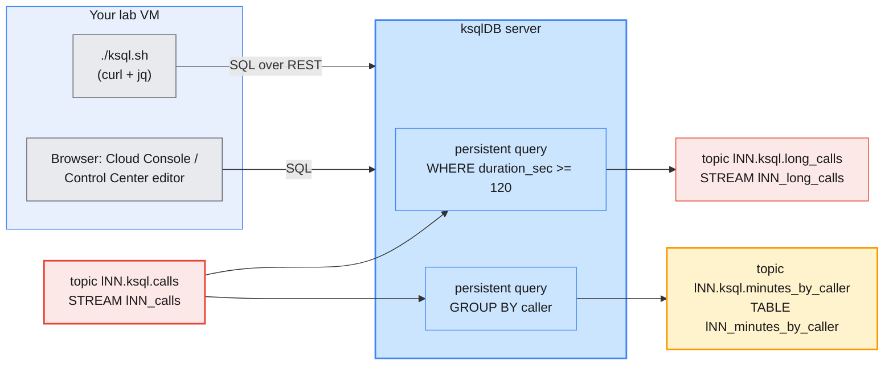

# Lab 08 — Stream Processing with ksqlDB on Confluent Cloud and Confluent Platform

| | |
| --- | --- |
| **Level** | Beginner |
| **Duration** | ~85 minutes |
| **Guide sections** | §1.3 Platform components (ksqlDB) · §4.2 Environments · §5 API keys · §6.2 Control Center tour |
| **You will need** | Labs 01 and 05 done: `~/kafka/ccloud.properties` (Cloud), `~/kafka/cp.properties` + `~/kafka/cp-ca.pem` (Platform); `jq`; a browser for the Cloud Console and Control Center. Lab 06 is helpful but not required. |

## Learning objectives

By the end of this lab you will be able to:

1. Explain the two ksqlDB building blocks, **STREAM** and **TABLE**, and
   the three kinds of query: **push**, **pull** and **persistent**.
2. Create a ksqlDB cluster on Confluent Cloud and an API key for it.
3. Declare a stream over a Kafka topic, insert rows, and watch them with a
   push query.
4. Write two **persistent queries** in SQL: a filter that feeds a new
   topic and an aggregation that keeps a running total per subscriber,
   then read that total with a pull query.
5. Run the **same SQL files** on the shared ksqlDB server of the Confluent
   Platform cluster, and see why names need your prefix there.

## Why this lab

Until now every transformation of data needed an application: a Spring
Boot consumer that reads, a bit of Java, a producer that writes. Many
everyday jobs are simpler than that: "only long calls", "minutes per
subscriber", "join calls with the price plan". **ksqlDB** lets you write
them as SQL. The ksqlDB server turns each statement into a Kafka Streams
application, runs it for you, and writes the results back to Kafka
topics that any consumer can read.



| | Confluent Cloud (Parts 1–4) | Confluent Platform on AWS (Parts 5–6) |
| --- | --- | --- |
| **Server** | Your own ksqlDB cluster `lNN-ksql` (`lksqlc-…`), created in Part 1 | One shared ksqlDB server on `cp-services`, run by the trainer |
| **Endpoint** | `https://pksqlc-….aws.confluent.cloud:443` | `$KSQL_URL` = `https://cp-services.lab.internal:8088` |
| **Credentials** | A **ksqlDB API key** | Your **LDAP user** |
| **TLS trust** | Public CA | The course CA, `~/kafka/cp-ca.pem` |
| **Names** | Only you use this server | Everyone shares it: **prefix every stream, table and topic** |
| **Cost** | Billed per hour while it exists: **delete it at the end** | Already running |

All SQL for this lab is in [`lab-08/sql/`](lab-08/sql/). The helper
[`lab-08/ksql.sh`](lab-08/ksql.sh) sends it to whichever ksqlDB server
the variables point at, and replaces `${ME}` with your prefix.

---

## Before you start — variables (5 min)

```bash
# (VM)
source ~/kafka/confluent.env            # CP, MDS_URL, CP_REST, CP_CA, C3_URL, KSQL_URL
ME=lNN                                  # your prefix
export ME
CFG=~/kafka/cp.properties
CC_CFG=~/kafka/ccloud.properties
CCLOUD=$(sed -n 's/^bootstrap.servers=//p' $CC_CFG)
CP_KSQL=${KSQL_URL:-https://cp-services.lab.internal:8088}
cd labs/module-06/lab-08                # every command below runs from here
echo "$ME  $CCLOUD  $CP_KSQL"
```

**Expected:** your prefix, your Cloud bootstrap endpoint and
`https://cp-services.lab.internal:8088`.

Make sure the CLI points at Cloud (Lab 05 may have left the Platform
login as the current context):

```bash
# (VM)
confluent context list                  # the Cloud context is the one with your e-mail
confluent context use <cloud-context-name>
confluent kafka cluster describe        # lNN-basic
LKC=$(confluent kafka cluster describe -o json | jq -r .id)
```

---

## Part 1 — Start a ksqlDB cluster on Cloud (10 min)

A Cloud ksqlDB cluster takes **5–10 minutes** to provision. Start it now
and read Part 2 while you wait.

1. Open `https://confluent.cloud` → **Environments** → `env-lNN` →
   cluster `lNN-basic`.
2. Left menu: **ksqlDB** → **Create cluster myself** (or **Add cluster**).
3. **Access control**: choose **Global access** ("my account"). The
   cluster then reads and writes topics with your own rights in
   `env-lNN`. Module 7 shows the production choice: a service account with
   granular rights.
4. **Cluster name**: `lNN-ksql`. **Cluster size**: the **smallest**
   offered (1 CSU, or the lowest number in the list).
5. **Launch cluster**.

Follow the status from the VM:

```bash
# (VM)
confluent ksql cluster list
```

**Expected:** one row, `lNN-ksql`, with an ID `lksqlc-xxxxx`, an
`Endpoint` like `https://pksqlc-xxxxx.ap-south-1.aws.confluent.cloud:443`
and `Status` `PROVISIONING`, later `UP`.

> **Cost:** a ksqlDB cluster is billed for every hour it exists, even when
> idle. The clean-up at the end deletes it. Do not skip it.

---

## Part 2 — ksqlDB in ten minutes (10 min)

### 2.1 Streams and tables

| | **STREAM** | **TABLE** |
| --- | --- | --- |
| **Holds** | Every event, in order, forever (an append-only log) | The **latest value per key** |
| **A new record with an existing key** | Is one more event | **Replaces** the old value |
| **Telecom example** | Every call a subscriber makes | Total minutes per subscriber, now |
| **Kafka topic underneath** | Normal topic | Topic (compacted when it is a changelog) |

Both are **views over a Kafka topic**. `CREATE STREAM` or `CREATE TABLE`
alone stores no data: it tells ksqlDB which topic to read and how to
decode it.

### 2.2 Three kinds of query

| Query | Looks like | Runs | Use it for |
| ----- | ---------- | ---- | ---------- |
| **Push** | `SELECT … EMIT CHANGES;` | Until you stop it (or `LIMIT n` rows) | Watching new results arrive |
| **Pull** | `SELECT … FROM <table> WHERE key = …;` | Answers once, like a database | "What is the total for this subscriber **now**?" |
| **Persistent** | `CREATE STREAM/TABLE … AS SELECT …` | **On the server, forever**, writing to a new topic | Pipelines: filter, transform, aggregate |

### 2.3 The helper script

`ksql.sh` is about 40 lines of `curl` and `jq`. Read it:

```bash
# (VM)
sed -n '1,20p' ksql.sh
ls sql/
```

**Expected:** the usage notes, then five files: `01-calls-stream.sql`,
`02-insert-calls.sql`, `03-long-calls.sql`, `04-minutes-by-caller.sql` and
`99-cleanup.sql`. It sends `SELECT` statements to the `/query` endpoint
and everything else to `/ksql`, the same REST API the ksqlDB CLI and the
web editors use.

---

## Part 3 — Your first stream on Cloud (15 min)

### 3.1 Connect to your ksqlDB cluster

When `confluent ksql cluster list` shows `UP`:

```bash
# (VM)
KSQL_ID=$(confluent ksql cluster list -o json | jq -r --arg n "$ME-ksql" '.[] | select(.name==$n) | .id')
CC_KSQL=$(confluent ksql cluster list -o json | jq -r --arg n "$ME-ksql" '.[] | select(.name==$n) | .endpoint')
confluent api-key create --resource $KSQL_ID --description "$ME lab08 ksqldb"
```

**Expected:** the `API Key` and `API Secret`. Copy the secret now, it is
shown only once. Like Schema Registry in Lab 06, ksqlDB is its own
resource with its own key.

```bash
# (VM) - paste your key and secret
KSQL_KEY=<API Key>
KSQL_SECRET='<API Secret>'
export KSQL_URL=$CC_KSQL KSQL_AUTH="$KSQL_KEY:$KSQL_SECRET" KSQL_CA=
./ksql.sh "SHOW STREAMS;"
```

**Expected:** a JSON block with `"@type": "streams"` and one stream,
`KSQL_PROCESSING_LOG` (ksqlDB's own error log). If you get `401`, wait a
minute for the key to become active.

### 3.2 Declare the stream

```bash
# (VM)
cat sql/01-calls-stream.sql
./ksql.sh -f sql/01-calls-stream.sql
```

**Expected:** `OK    Stream created`. ksqlDB also created the topic,
because the statement gives `PARTITIONS`:

```bash
# (VM)
confluent kafka topic list | grep "$ME.ksql"
```

**Expected:** `lNN.ksql.calls` with 3 partitions.

> **Note:** ksqlDB writes names in **upper case** unless you quote them:
> `lNN_calls` becomes `LNN_CALLS` in listings and errors. Topic names are
> case-sensitive, so they stay exactly as written in `KAFKA_TOPIC`.

### 3.3 Insert calls and watch them with a push query

```bash
# (VM)
./ksql.sh -f sql/02-insert-calls.sql
./ksql.sh "SELECT * FROM \${ME}_calls EMIT CHANGES LIMIT 6;"
```

**Expected:** the inserts return nothing (no error is success). The push
query returns a header and six rows, then stops because of `LIMIT 6`:

```
[{"header":{"queryId":"transient_LNN_CALLS_…","schema":"`CALLER` STRING KEY, `CALL_ID` STRING, `CALLEE` STRING, `DURATION_SEC` INTEGER, `ROAMING` BOOLEAN"}},
{"row":{"columns":["9198450001","c-1","9198451111",40,false]}},
{"row":{"columns":["9198450002","c-2","9198451111",300,false]}},
…]
```

Rows from different partitions may come in a different order. Without
`LIMIT`, a push query keeps waiting for new rows until you press `Ctrl+C`.

### 3.4 It is still just Kafka

The stream is a view; the data is in an ordinary topic. Read it with the
tool you have used since Module 2:

```bash
# (VM)
kafka-console-consumer.sh --bootstrap-server $CCLOUD --consumer.config $CC_CFG \
  --topic $ME.ksql.calls --from-beginning --max-messages 6 --property print.key=true 2>/dev/null
```

**Expected:** six lines, key then JSON value. The key column is the Kafka
key, not part of the value:

```
9198450001	{"CALL_ID":"c-1","CALLEE":"9198451111","DURATION_SEC":40,"ROAMING":false}
```

### 3.5 The same in the Cloud Console editor

1. Cloud Console → `lNN-basic` → **ksqlDB** → `lNN-ksql` → **Editor**.
2. Set **auto.offset.reset** to `Earliest` (the property selector above
   the editor).
3. Run `SELECT * FROM LNN_CALLS EMIT CHANGES;` (your prefix, upper case).
   The rows appear as a table. Press **Stop** to end the push query.

---

## Part 4 — Persistent queries (20 min)

### 4.1 A filter that never stops

```bash
# (VM)
cat sql/03-long-calls.sql
./ksql.sh -f sql/03-long-calls.sql
./ksql.sh "SHOW QUERIES;"
```

**Expected:** `OK    Created query with ID CSAS_LNN_LONG_CALLS_…`, and
`SHOW QUERIES` lists it with state `RUNNING` and sink
`LNN_LONG_CALLS`. This query now runs **on the server**, not in your
terminal: it processed the six existing calls and will process every new
one.

```bash
# (VM)
kafka-console-consumer.sh --bootstrap-server $CCLOUD --consumer.config $CC_CFG \
  --topic $ME.ksql.long_calls --from-beginning --max-messages 3 2>/dev/null
```

**Expected:** the three calls of 120 seconds or more (`c-2` 300, `c-3`
610, `c-6` 130). Any application can consume `lNN.ksql.long_calls` without
knowing that SQL produced it.

### 4.2 A running total per subscriber

```bash
# (VM)
cat sql/04-minutes-by-caller.sql
./ksql.sh -f sql/04-minutes-by-caller.sql
```

**Expected:** `OK    Created query with ID CTAS_LNN_MINUTES_BY_CALLER_…`.

Now ask the table a question, like a database, with a **pull query**:

```bash
# (VM)
./ksql.sh "SELECT * FROM \${ME}_minutes_by_caller WHERE caller = '9198450001';"
```

**Expected:**

```
[{"header":{"queryId":"…","schema":"`CALLER` STRING KEY, `CALLS` BIGINT, `TOTAL_SEC` INTEGER"}},
{"row":{"columns":["9198450001",3,780]}}]
```

Three calls, 40 + 610 + 130 = 780 seconds. If you get an empty answer,
wait a few seconds: the aggregation needs a moment to catch up.

### 4.3 Watch the table change

Insert one more call and ask again:

```bash
# (VM)
./ksql.sh "INSERT INTO \${ME}_calls (caller, call_id, callee, duration_sec, roaming) VALUES ('9198450001', 'c-7', '9198451111', 20, false);"
sleep 3
./ksql.sh "SELECT * FROM \${ME}_minutes_by_caller WHERE caller = '9198450001';"
./ksql.sh "SELECT * FROM \${ME}_minutes_by_caller EMIT CHANGES LIMIT 3;"
```

**Expected:** the pull query now shows `["9198450001",4,800]`, and
`long_calls` did **not** get the new call (20 s). The push query on the
table shows the latest row per caller.

| Caller | `CALLS` | `TOTAL_SEC` |
| ------ | ------- | ----------- |
| 9198450001 | 4 | 800 |
| 9198450002 | 2 | 395 |
| 9198450003 | 1 | 15 |

That is the stream/table difference from Part 2.1 in one picture: the
stream `lNN_calls` now holds **seven** events, and the table holds **three**
rows, one per key.

### 4.4 Look behind the scenes

```bash
# (VM)
confluent kafka topic list | grep -E "$ME\.ksql|_confluent-ksql"
```

**Expected:** your three topics, plus internal topics named
`_confluent-ksql-pksqlc-…` with `changelog` in the name. The aggregation
keeps its state in a local store on the ksqlDB server and backs it up to
that changelog topic, so it survives a restart. In the Cloud Console,
`lNN-ksql` → **Flow** draws the pipeline you built: `LNN_CALLS` feeding
the two persistent queries.

---

## Part 5 — The same SQL on Confluent Platform (15 min)

Point the helper at the shared ksqlDB server: your LDAP user (already in
`cp.properties`) and the course CA. Nothing else changes.

```bash
# (VM)
LDAP_PW=$(sed -n 's/.*password="\([^"]*\)".*/\1/p' $CFG)
export KSQL_URL=$CP_KSQL KSQL_AUTH="$ME:$LDAP_PW" KSQL_CA=$CP_CA
./ksql.sh "SHOW STREAMS;"
```

**Expected:** a list of streams. It may already include **other
learners'** streams (`L03_CALLS`, `L11_CALLS`, …): one server, one
namespace for the whole class. That is why every name in the SQL files
starts with `${ME}`: two learners creating `calls` would collide.

Run the four files in order:

```bash
# (VM)
for f in sql/01-calls-stream.sql sql/02-insert-calls.sql sql/03-long-calls.sql sql/04-minutes-by-caller.sql; do
  echo "== $f"; ./ksql.sh -f $f
done
sleep 5
./ksql.sh "SELECT * FROM \${ME}_minutes_by_caller WHERE caller = '9198450001';"
```

**Expected:** `Stream created`, two `Created query with ID …` lines and
the same answer as on Cloud: `["9198450001",3,780]`. Check the topics
from the Kafka side:

```bash
# (VM)
kafka-topics.sh --bootstrap-server $CP --command-config $CFG --list | grep "^$ME.ksql"
kafka-console-consumer.sh --bootstrap-server $CP --consumer.config $CFG \
  --topic $ME.ksql.long_calls --from-beginning --max-messages 3 2>/dev/null
```

**Expected:** `lNN.ksql.calls`, `lNN.ksql.long_calls`,
`lNN.ksql.minutes_by_caller`, then the same three long calls.

| | Cloud | Platform |
| --- | --- | --- |
| SQL files | Same | Same |
| `KSQL_URL` | `https://pksqlc-…:443` | `https://cp-services.lab.internal:8088` |
| `KSQL_AUTH` | ksqlDB API key | LDAP user |
| `KSQL_CA` | empty | `~/kafka/cp-ca.pem` |
| Internal topics | `_confluent-ksql-pksqlc-…` | `_confluent-ksql-default_…` (service ID `default_`) |

**In Control Center** (optional): open `$C3_URL`, log in with your LDAP
user and look for **ksqlDB** in the left menu. If your Control Center
version shows it, the **Editor** works as on Cloud: set
`auto.offset.reset` to `Earliest` and run
`SELECT * FROM LNN_LONG_CALLS EMIT CHANGES;`. **Topics** →
`lNN.ksql.minutes_by_caller` → **Messages** shows the table's updates in
every case.

---

## Part 6 — RBAC on the shared server (5 min)

Your role bindings on the Platform cluster let you use the ksqlDB server
(`DeveloperWrite` on the ksqlDB cluster) and own topics that start with
`lNN.`. ksqlDB checks **your** rights before it runs a statement. Try a
topic outside your prefix:

```bash
# (VM)
./ksql.sh "CREATE STREAM \${ME}_steal (caller VARCHAR KEY, duration_sec INT)
  WITH (KAFKA_TOPIC='shared.calls', VALUE_FORMAT='JSON', PARTITIONS=1, REPLICAS=3);"
```

**Expected** (wording varies by version):

```
ERROR Authorization denied to Create on topic(s): [shared.calls]
```

| Rule | Why |
| ---- | --- |
| **Prefix the topic** (`lNN.ksql.*`) | RBAC: your `ResourceOwner` binding covers `Topic:lNN.` only |
| **Prefix the stream or table** (`lNN_*`) | Shared namespace: names must be unique on the server |
| **Set `KAFKA_TOPIC` on `AS SELECT`** | Otherwise the sink topic is named after the stream in upper case (`LNN_LONG_CALLS`), which is **outside** your prefix and refused |

On Cloud your ksqlDB cluster used **your** account (Global access), so the
same statement would have succeeded there.

---

## Checkpoint questions

<details>
<summary>1. You ran <code>CREATE STREAM lNN_calls … WITH (KAFKA_TOPIC='lNN.ksql.calls', …)</code>. Where are the calls stored?</summary>

In the Kafka topic `lNN.ksql.calls`. The stream is only a **view**: the
topic name, the column types and the value format. Dropping the stream
without `DELETE TOPIC` leaves the topic and its data untouched, and any
Kafka consumer can read the topic directly (Part 3.4).
</details>

<details>
<summary>2. Why does <code>lNN_minutes_by_caller</code> have three rows while <code>lNN_calls</code> has seven events?</summary>

`lNN_calls` is a **stream**: every call is a new event. `GROUP BY caller`
turns it into a **table**: one row per key, and each new call **updates**
its caller's row (count + 1, total + duration). Three callers, three rows.
</details>

<details>
<summary>3. Which of these keeps running after you close the terminal: <code>SELECT … EMIT CHANGES</code>, <code>SELECT … WHERE caller = '…'</code>, <code>CREATE STREAM … AS SELECT …</code>?</summary>

Only the last. A **persistent** query (`CREATE … AS SELECT`) runs on the
ksqlDB server until you drop it, and keeps writing its output topic. A
**push** query lives only as long as your connection. A **pull** query
answers once and ends.
</details>

<details>
<summary>4. On the shared Platform server you forgot <code>KAFKA_TOPIC</code> in <code>CREATE STREAM lNN_long_calls AS SELECT …</code>. What happens and why?</summary>

ksqlDB names the sink topic after the stream: `LNN_LONG_CALLS`. That name
does not start with `lNN.`, so your RBAC binding does not cover it and the
statement is refused with an authorization error. On Cloud, with Global
access, it would succeed, but you would get an upper-case topic outside
your naming convention.
</details>

<details>
<summary>5. Moving the pipeline from Cloud to Platform, what changed?</summary>

Only the connection: endpoint, credentials (ksqlDB API key → LDAP user)
and the course CA. The SQL files ran unchanged. The operational
difference is ownership: on Cloud you pay for and own a dedicated ksqlDB
cluster; on Platform the platform team runs one server for everyone, so
naming and RBAC keep teams apart.
</details>

---

## Troubleshooting

| Symptom | Likely cause | Fix |
| ------- | ------------ | --- |
| `confluent ksql cluster list` stays `PROVISIONING` | Normal for the first 5–10 minutes | Continue with Part 2; check again |
| `401 Unauthorized` (Cloud) | Kafka or Schema Registry key used, or the new ksqlDB key is not active yet | Use the key created with `--resource $KSQL_ID`; wait 1–2 minutes |
| `401 Unauthorized` (Platform) | Wrong LDAP password in `KSQL_AUTH` | Re-read it from `cp.properties` (Part 5) |
| `curl: (60) SSL certificate problem` (Platform) | `KSQL_CA` empty | `export KSQL_CA=$CP_CA` |
| `A stream with the same name already exists` | You ran `01-calls-stream.sql` twice, or `${ME}` is not set | `echo $ME`; drop it with `sql/99-cleanup.sql` and start again |
| Push query returns only the header | `auto.offset.reset` is `latest`, or no rows inserted | `ksql.sh` sets `earliest`; in the web editors set it by hand; check Part 3.3 |
| Pull query returns no row | The aggregation has not caught up, or the key is wrong (it is case-sensitive) | Wait a few seconds; copy the caller from the push query output |
| `Authorization denied … topic(s)` (Platform) | Topic outside `lNN.`, or the trainer has not added the ksqlDB role bindings | Use your prefix; ask the trainer to re-run `cp-rbac-learners.sh` |
| `Connection refused` on `cp-services.lab.internal:8088` | Platform services stopped between sessions | Ask the trainer (`cp-power.sh start`) |

---

## Clean up

> **Warning:** the Cloud ksqlDB cluster costs money for every hour it
> exists. Delete it today.

**Platform** (the variables still point there after Part 6):

```bash
# (VM)
./ksql.sh -f sql/99-cleanup.sql
./ksql.sh "SHOW STREAMS;" | grep -i "$ME" || echo "no $ME streams left"
```

**Expected:** three `OK` lines (`… dropped`), then `no lNN streams left`.
Dropping a `… AS SELECT` stream or table also stops its query, and `DELETE
TOPIC` removes its topic.

**Cloud:**

```bash
# (VM)
export KSQL_URL=$CC_KSQL KSQL_AUTH="$KSQL_KEY:$KSQL_SECRET" KSQL_CA=
./ksql.sh -f sql/99-cleanup.sql
confluent api-key delete $KSQL_KEY --force
confluent ksql cluster delete $KSQL_ID --force
confluent ksql cluster list
confluent kafka topic list | grep -E "$ME\.ksql" || echo "no $ME.ksql topics left"
```

**Expected:** three `OK` lines, `Deleted API key …`, `Deleted KSQL
cluster "lksqlc-…".`, an empty cluster list (or the cluster in
`DEPROVISIONING`), and no `lNN.ksql` topics. Deleting the ksqlDB cluster
also removes its `_confluent-ksql-pksqlc-…` internal topics.
