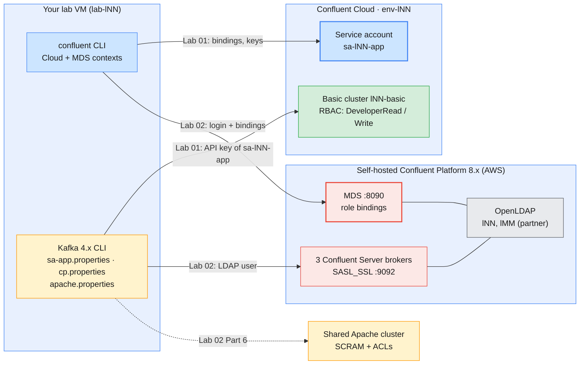

# Module 7 Labs — Administering Kafka Security

> **Course:** Apache Kafka & Confluent Kafka Administration
> **Companion guide:** [`guides/module-07-administering-kafka-security.md`](../../guides/module-07-administering-kafka-security.md)
> **Module objective:** Secure Confluent Kafka clusters using Confluent's
> administration and access-control model.

Module 6 showed you the two Confluent targets. In this module you become the
person who decides **who may do what** on them. Lab 01 runs on **Confluent
Cloud** (your environment `env-lNN`). You give an application a service account,
role bindings and an API key, prove what it can and cannot do, then rotate and
revoke its access. Lab 02 runs on the **self-hosted Confluent Platform cluster
on AWS**. There you trace TLS and LDAP authentication, delegate access as a
`ResourceOwner`, validate it with a partner's LDAP user, and compare the
result with the ACLs of the shared Apache cluster. Do the labs in order.

| # | Lab | Level | Time | What you will do |
| - | --- | ----- | ---- | ---------------- |
| 01 | [Service accounts, RBAC & API keys on Confluent Cloud](lab-01-service-accounts-rbac-api-keys-confluent-cloud.md) | Beginner | 75 min | Audit your own rights, give `sa-lNN-app` a key with no bindings, grant least-privilege roles, validate allowed and denied operations, rotate the key with no downtime, revoke by role, retire the user-owned key from Module 6 |
| 02 | [RBAC with LDAP users on self-hosted Confluent Platform](lab-02-rbac-ldap-confluent-platform-aws.md) | Intermediate → Advanced | 85 min | Read the cluster's TLS, SASL and authorizer settings, trigger an authentication failure, log in to MDS, delegate read access as `ResourceOwner`, validate it with a partner, hit the literal-vs-prefix trap, compare with Apache SASL/SCRAM and ACLs |

Estimated total: **about 2 h 40 min**, including checkpoint questions.

> **Trainers:** the shared Confluent Platform cluster on AWS is **stopped**
> between sessions to save cost. Start it at least 15 minutes before Lab 02
> (LDAP → controllers → brokers → services) and check that the quorum and
> Control Center are healthy. See
> [`infra/guides/confluent-platform-cluster-connect.md`](../../infra/guides/confluent-platform-cluster-connect.md).
> Before day 1, also agree the **partner pairs** for Lab 02 Part 4
> (l01↔l02, l03↔l04, …) and dry-run Lab 01 on `lab-l19`.

---

## Prerequisites

| Requirement | Check with | Notes |
| ----------- | ---------- | ----- |
| Module 6 completed | `confluent context list` | You need the saved Cloud login and, for Lab 02, the Platform login |
| Your Cloud topic and key from Module 6 | `confluent api-key list` | Lab 01 replaces the user-owned key with a service-account key |
| Pre-created service account `sa-lNN-app` | `confluent iam service-account list` | Created by the trainer (`infra/confluent/scripts/cc-provision.sh`), no bindings yet |
| Confluent CLI v4.x, Kafka 4.x CLI, `jq`, `openssl` | `confluent version`, `kafka-topics.sh --version` | In the VM image |
| Platform files `~/kafka/cp.properties`, `cp-ca.pem`, `confluent.env` | `ls -l ~/kafka/` | Your LDAP user over `SASL_SSL` (Lab 02) |
| Apache client file `~/kafka/apache.properties` | `ls -l ~/kafka/apache.properties` | For the comparison in Lab 02 Part 6 |
| Your LDAP password | Your credentials e-mail | `confluent login --url`, `curl`, Control Center |
| A lab partner `lMM` | Ask the trainer | Lab 02 Part 4 only; you each grant the other read access to one topic |

> **No Docker in this module.** Nothing runs locally and no ports need to be
> free. If an earlier local cluster is still running, stop it to give the VM
> its memory back.

> **Using the course AWS VMs?** Your VM (`lab-lNN`) already has the Confluent
> CLI, the Kafka CLI, `jq`, `openssl` and the prepared files under
> `~/kafka/`. Open it in the browser IDE or VS Code Remote-SSH and run the
> labs there exactly as written. See [`infra/LAB-SETUP.md`](../../infra/LAB-SETUP.md)
> §6–§7 for the full course environment.

---

## Lab environment

The targets are the same as in Module 6 (`infra/LAB-SETUP.md` §6). What is
new is the **identities** you work with.



| Target | Identity you validate with | Config file | Your administrative rights | Names used in the labs |
| ------ | -------------------------- | ----------- | -------------------------- | ---------------------- |
| **Confluent Cloud** (Lab 01) | Service account `sa-lNN-app` and its API key | `~/kafka/sa-app.properties` (`$SA_CFG`), built in Lab 01 | **EnvironmentAdmin** on `env-lNN`: you may bind roles and create keys there | Topics `$ME.cdr.voice`, `$ME.cdr.secret`; groups `$ME.billing`, `$ME.fraud` |
| **Confluent Platform on AWS** (Lab 02) | Your LDAP user `lNN` and your partner `lMM` | `~/kafka/cp.properties` (`$CFG`) | **ResourceOwner** on `Topic:lNN.` and `Group:lNN.`: you may grant access to *your* resources only | Topics `$ME.cdr.shared`, `$ME.cdr.private` |
| **Shared Apache cluster** (Lab 02 Part 6) | Your SCRAM user `lNN` | `~/kafka/apache.properties` (`$APACHE_CFG`) | Prefix ACLs; no right to grant | Read-only comparison |

### Everyday commands

In every new terminal:

```bash
# (VM)
source ~/kafka/confluent.env            # CP, MDS_URL, CP_REST, CP_CA, C3_URL (no secrets)
ME=lNN                                  # your prefix: l01 … l18
CFG=~/kafka/cp.properties               # your LDAP user on Confluent Platform (Lab 02)
SA_CFG=~/kafka/sa-app.properties        # sa-lNN-app on Confluent Cloud (built in Lab 01)

confluent context list                  # which login is current? (* marks it)
confluent iam rbac role-binding list --current-user --inclusive   # Cloud: what may I do?
```

> **Convention used in the labs**
>
> - `# (VM)`: run on **your lab VM**, against Confluent Cloud, the shared
>   Confluent Platform cluster or the shared Apache cluster, with your prefix
>   (`$ME`) and the config files above. Every command block in this module
>   uses it. `# (VM) - partner` marks a command that your **partner** runs on
>   their own VM.
> - **Browser** steps (Cloud Console, Control Center) are written as
>   numbered *Menu → Item* paths, not code blocks.
> - Secrets are typed at a `read -rsp` prompt or a password prompt, and
>   **never** written into commands, notes or these files.

---

## Troubleshooting

| Symptom | Likely cause | Fix |
| ------- | ------------ | --- |
| `TopicAuthorizationException: Not authorized to access topics: [lNN.cdr.voice]` right after `role-binding create` | Cloud role bindings take a short time to propagate | Wait 30–60 s and retry once; then check the binding with `role-binding list --principal User:$SA --inclusive` |
| `GroupAuthorizationException` while the topic is readable | The consumer group has no `DeveloperRead` binding | Bind `Group:$ME.billing` (Lab 01 Part 3) or use your own `lMM.` group (Lab 02 Part 4) |
| `SaslAuthenticationException` against Cloud | New key not ready yet, key deleted, or key belongs to another cluster | Wait 1–2 minutes after `api-key create`; `confluent api-key list --resource $LKC` |
| `api-key create --service-account` or `role-binding create` refused on Cloud | Wrong environment selected, or the command ran in the Platform context | `confluent context use <Cloud context>`; `confluent environment use $ENV_ID` |
| `SaslAuthenticationException: Authentication failed: Invalid username or password` on Platform | Wrong LDAP password in the client config | Expected in Lab 02 Part 2; otherwise ask the trainer to check your file |
| Platform `role-binding create` fails with an authorization error | You are not the owner of that resource (`other.topic`), or you asked for a cluster role | Expected in Lab 02 Part 3: a `ResourceOwner` grants only on its own prefix |
| Partner still denied after your grant | Binding created **without** `--prefix` on a prefix name, or on the wrong topic | `confluent iam rbac role-binding list --principal User:lMM --kafka-cluster $CP_ID` and check `Pattern Type` |
| `x509: certificate signed by unknown authority` / `PKIX path building failed` | The course CA is not passed | `--certificate-authority-path $CP_CA` / `curl --cacert $CP_CA` |

---

## Cleaning up after the module

Each lab ends with its own clean up. After both labs:

- **Kept on Cloud:** the topic `$ME.cdr.voice`, the service account
  `sa-lNN-app` with its read bindings, its **current** API key and
  `~/kafka/sa-app.properties`. Module 8 measures traffic from that
  application identity.
- **Removed on Cloud:** the Module 6 user-owned key, `~/kafka/ccloud.properties`,
  the topic `$ME.cdr.secret` and every rotated key.
- **Removed on Platform:** your `$ME.cdr.shared` and `$ME.cdr.private` topics and
  every role binding you granted to your partner.

To check that nothing you granted is left behind:

```bash
# (VM)
confluent context use <your Cloud context name>
confluent api-key list                                            # only the current sa-lNN-app key
confluent iam rbac role-binding list --principal User:$SA --inclusive
```

The service account, your environment and your LDAP user stay. The trainer
deletes them at the end of the course
([`infra/confluent/README.md` Part D](../../infra/confluent/README.md#part-d--teardown)).
