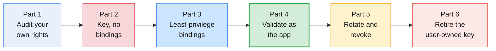
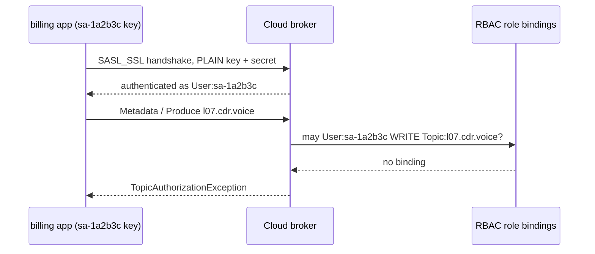
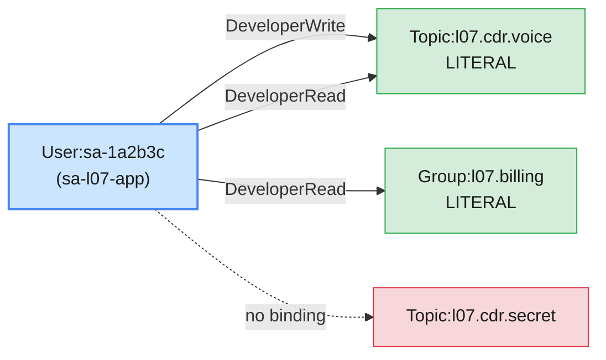

# Lab 01 — Service Accounts, RBAC & API Keys on Confluent Cloud

| | |
| --- | --- |
| **Level** | Beginner |
| **Duration** | ~75 minutes |
| **Guide sections** | §4.1 Anatomy of a role binding · §4.3 Predefined roles on Confluent Cloud · §4.4 Managing role bindings · §4.5 Least privilege · §5.1–§5.4 Service accounts, API keys, lifecycle, secrets · §8.1–§8.3 Hands-on Parts A–C · §9 Troubleshooting |
| **You will need** | Module 6 done: saved Cloud login, your environment and cluster IDs, the topic `$ME.cdr.voice`, the user-owned API key from Module 6 Lab 01; two terminals; the Cloud Console in a browser |

## Learning objectives

By the end of this lab you will be able to:

1. **Audit** who holds which role in your environment and explain why
   `EnvironmentAdmin` lets you grant access there.
2. Show from a real failure that an **API key authenticates but does not
   authorize**: a service-account key with no role bindings connects and is
   denied everything.
3. Grant **least-privilege role bindings** (`DeveloperWrite`, `DeveloperRead`
   on a topic and a consumer group) and read them back with
   `role-binding list`.
4. **Validate** access as the application: name the exception each denied
   operation produces and the binding that would allow it.
5. **Rotate** an API key with no downtime and **revoke** access by role,
   while keeping secrets out of history, files and screens.

The examples use `l07` and made-up IDs (`env-7qk3x2`, `lkc-9xw2pq`,
`sa-1a2b3c`). Your IDs and keys differ; the shapes do not.



---

## Part 1 — Audit your own rights (10 min)

Every access review starts with the person doing the granting. Before you
change anything, set your variables and confirm *which* login and *which*
cluster the next commands will hit.

```bash
# (VM)
source ~/kafka/confluent.env
ME=lNN                                  # your prefix: l01 … l18
confluent context list
```

**Expected:** your Cloud context marked with `*`. If the `*` is on the
Platform context from Module 6 Lab 03, switch now:

```bash
# (VM)
confluent context use login-<your e-mail>-https://confluent.cloud   # the Cloud row's Name
```

Select your environment and cluster as in Module 6 Lab 01 Part 3, and keep
the IDs in variables:

```bash
# (VM)
confluent environment list
ENV_ID=env-7qk3x2                       # ← your env-lNN ID
confluent environment use $ENV_ID
confluent kafka cluster list
LKC=lkc-9xw2pq                          # ← your lNN-basic cluster ID
confluent kafka cluster use $LKC
CCLOUD=$(confluent kafka cluster describe -o json | jq -r .endpoint | sed 's#SASL_SSL://##')
echo "$ENV_ID $LKC $CCLOUD"
```

**Expected:**

```
Using environment "env-7qk3x2".
Set Kafka cluster "lkc-9xw2pq" as the active cluster for environment "env-7qk3x2".
env-7qk3x2 lkc-9xw2pq pkc-xxxxx.ap-south-1.aws.confluent.cloud:9092
```

Now read your own role bindings, including the nested cluster and resource
scopes:

```bash
# (VM)
confluent iam rbac role-binding list --current-user --environment $ENV_ID --inclusive
```

**Expected:** one row: role **`EnvironmentAdmin`**, your environment ID, and
no cluster or resource.

| Your role | What it lets you do in this lab | What it does not let you do |
| --------- | ------------------------------- | --------------------------- |
| **`EnvironmentAdmin`** on `env-lNN` | Create topics; describe service accounts; create and delete role bindings and API keys for resources **inside** `env-lNN` | Anything in another learner's environment or at organization level (billing, users, other environments) |

> **What this shows:** RBAC is hierarchical (guide §4.3). One binding at the
> environment scope covers every cluster and topic below it. That is why the
> trainer needed only **one** binding per learner, and why
> `EnvironmentAdmin` must be given to few people in production.

Finally, look at the key you have used since Module 6:

```bash
# (VM)
confluent api-key list --resource $LKC
```

**Expected** (abridged):

```
  Current |       Key        |   Description    |   Owner    |        Owner Email        | Resource Type |  Resource  | Created
----------+------------------+------------------+------------+---------------------------+---------------+------------+------------
  *       | ABCDEFGH12345678 | l07 module 6 CLI | u-a1b2c3d4 | l07.learner@example.com   | kafka         | lkc-9xw2pq | …
```

The **Owner** is `u-…`, a person. If your user account were deleted
tomorrow, every client using this key would stop (guide §5.1). The rest of
this lab moves the application onto a service account.

---

## Part 2 — A service-account key with no role bindings (15 min)

### 2.1 Find the application's identity

The trainer pre-created one service account per learner, named
`sa-lNN-app`, with **no** role bindings.

```bash
# (VM)
confluent iam service-account list | grep -E "ID|sa-$ME-app"
SA=$(confluent iam service-account list -o json | jq -r --arg n "sa-$ME-app" '.[] | select(.name==$n) | .id')
echo $SA
```

**Expected:**

```
      ID     |    Name     |                 Description
  sa-1a2b3c  | sa-l07-app  | Module 7 application identity for learner l07
sa-1a2b3c
```

> **Note:** the list may also show other learners' service accounts, because
> service accounts belong to the **organization**, not to an environment.
> Seeing them is harmless: you hold no role on them and you cannot bind
> anything for them outside `env-lNN`. Use **only** `sa-$ME-app`.

```bash
# (VM)
confluent iam rbac role-binding list --principal User:$SA --inclusive
```

**Expected:** an empty table, with headers only. The account exists and can do nothing.

### 2.2 Topics the application will use

You create topics with **your** login. The application never needs the
right to create topics.

```bash
# (VM)
confluent kafka topic create $ME.cdr.voice  --partitions 6 --if-not-exists
confluent kafka topic create $ME.cdr.secret --partitions 1 --if-not-exists
confluent kafka topic list
```

**Expected:** both topics listed. `$ME.cdr.voice` may already exist from
Module 6; `--if-not-exists` keeps the command safe to re-run. Think of
`$ME.cdr.secret` as fraud-investigation data that billing must never read.

### 2.3 Create a key owned by the service account

```bash
# (VM)
confluent api-key create --resource $LKC --service-account $SA \
  --description "$ME billing app $(date +%F)"
```

**Expected:**

```
It may take a couple of minutes for the API key to be ready.
Save the API key and secret. The secret is not retrievable later.
+------------+------------------------------------------------------------------+
| API Key    | SAKEY1XXXXXXXXXX                                                 |
| API Secret | ****************************************************************|
+------------+------------------------------------------------------------------+
```

> **Administrator rule:** the secret is shown **once**. Put it into your
> password manager now. In production it goes straight into the secret store
> (Vault, AWS Secrets Manager, a Kubernetes Secret), never into a chat, a ticket or
> git (guide §5.3–§5.4).

> **Note:** if this command is refused with an authorization error, your
> `EnvironmentAdmin` binding is not active in this context: check Part 1
> again. If it is still refused, ask the trainer to create the key for you
> and continue from 2.4. Creating keys for service accounts is something
> organizations often keep for a central team.

Build the application's client config exactly as you built
`ccloud.properties` in Module 6 Lab 01 Part 5. The secret is typed at a
hidden prompt:

```bash
# (VM)
SA_KEY=SAKEY1XXXXXXXXXX                  # ← the key printed above (never the secret)
read -rsp "SA API secret: " SA_SECRET; echo
umask 077
confluent kafka client-config create java --api-key $SA_KEY --api-secret "$SA_SECRET" 2>/dev/null \
  | grep -E '^(bootstrap.servers|security.protocol|sasl.mechanism|sasl.jaas.config)=' \
  > ~/kafka/sa-app.properties
unset SA_SECRET
SA_CFG=~/kafka/sa-app.properties
sed 's/password=.*/password=<hidden>;/' $SA_CFG
ls -l $SA_CFG
```

**Expected:**

```
bootstrap.servers=pkc-xxxxx.ap-south-1.aws.confluent.cloud:9092
security.protocol=SASL_SSL
sasl.mechanism=PLAIN
sasl.jaas.config=org.apache.kafka.common.security.plain.PlainLoginModule required username='SAKEY1XXXXXXXXXX' password=<hidden>;
-rw------- 1 learner learner … /home/learner/kafka/sa-app.properties
```

### 2.4 Connect as the application

Give the key a minute to become active, then:

```bash
# (VM)
kafka-topics.sh --bootstrap-server $CCLOUD --command-config $SA_CFG --list
echo "exit code: $?"
```

**Expected:**

```
exit code: 0
```

The list is empty, and the command did **not** fail. Authentication worked:
the cluster accepted the key. Authorization then filtered out every topic,
because the owner of the key has no bindings. Now try to write:

```bash
# (VM)
echo '966500000001:{"type":"voice","dur":42}' | \
  kafka-console-producer.sh --bootstrap-server $CCLOUD --command-config $SA_CFG \
  --topic $ME.cdr.voice --reader-property parse.key=true --reader-property key.separator=:
```

**Expected** (abridged):

```
ERROR Error when sending message to topic l07.cdr.voice with key: 12 bytes, value: 25 bytes with error: (org.apache.kafka.clients.producer.internals.ErrorLoggingCallback)
org.apache.kafka.common.errors.TopicAuthorizationException: Not authorized to access topics: [l07.cdr.voice]
```



> **What this shows:** a key answers *who are you?* and nothing more
> (guide §5.2). A `SaslAuthenticationException` would mean the key itself
> was wrong; a `TopicAuthorizationException` means the key is fine and the
> **bindings** are missing. Telling those two apart is the first step of every
> security ticket (guide §9).

---

## Part 3 — Grant least-privilege role bindings (15 min)

The billing application must **write** CDRs to `$ME.cdr.voice` (it plays the
mediation role in this lab), **read** them back in the consumer group
`$ME.billing`, and nothing else.



Cloud role bindings for Kafka resources need three scope flags. Keep them in
one variable:

```bash
# (VM)
SCOPE="--environment $ENV_ID --cloud-cluster $LKC --kafka-cluster $LKC"
confluent iam rbac role-binding create --principal User:$SA --role DeveloperWrite $SCOPE --resource Topic:$ME.cdr.voice
confluent iam rbac role-binding create --principal User:$SA --role DeveloperRead  $SCOPE --resource Topic:$ME.cdr.voice
confluent iam rbac role-binding create --principal User:$SA --role DeveloperRead  $SCOPE --resource Group:$ME.billing
```

Each command prints the binding it created. Now audit the account the way a
reviewer would:

```bash
# (VM)
confluent iam rbac role-binding list --principal User:$SA --inclusive
```

**Expected** (columns abridged):

```
    Principal    |      Role      | Environment | Cloud Cluster | Cluster Type | Logical Cluster | Resource Type |      Name       | Pattern Type
-----------------+----------------+-------------+---------------+--------------+-----------------+---------------+-----------------+---------------
  User:sa-1a2b3c | DeveloperRead  | env-7qk3x2  | lkc-9xw2pq    | Kafka        |                 | Group         | l07.billing     | LITERAL
  User:sa-1a2b3c | DeveloperRead  | env-7qk3x2  | lkc-9xw2pq    | Kafka        |                 | Topic         | l07.cdr.voice   | LITERAL
  User:sa-1a2b3c | DeveloperWrite | env-7qk3x2  | lkc-9xw2pq    | Kafka        |                 | Topic         | l07.cdr.voice   | LITERAL
```

| Column | What to check in a review |
| ------ | ------------------------- |
| **Role** | The narrowest predefined role: `Developer*` for applications, never `ResourceOwner` or `CloudClusterAdmin` |
| **Resource Type / Name** | Exactly the topics and groups in the application's design |
| **Pattern Type** | `LITERAL` here. `PREFIXED` only when the naming convention is meant to grant a whole family (guide §4.4 trap) |

> **Common trap for Apache Kafka administrators:** expecting `--producer` and
> `--consumer` shortcuts. Roles are already the shortcut: `DeveloperWrite`
> expands to Write + Describe, `DeveloperRead` to Read + Describe
> (guide §7.2). There is no "Create" in either. The application cannot
> create a topic by producing to a name that does not exist yet.

---

## Part 4 — Validate access as the application (15 min)

Role bindings can take a short time to reach every broker. If the first
command still fails with an authorization error, wait 30 seconds and run it
once more before you conclude anything.

### 4.1 What must work

Use two terminals. Set `ME`, `CCLOUD` and `SA_CFG` in the second one too.

```bash
# (VM) - terminal 1
printf '%s\n' '966500000001:{"type":"voice","dur":42}' '966500000002:{"type":"voice","dur":7}' | \
  kafka-console-producer.sh --bootstrap-server $CCLOUD --command-config $SA_CFG \
  --topic $ME.cdr.voice --reader-property parse.key=true --reader-property key.separator=:
echo "exit code: $?"
```

**Expected:** `exit code: 0` and no `ERROR` lines.

```bash
# (VM) - terminal 2
kafka-console-consumer.sh --bootstrap-server $CCLOUD --command-config $SA_CFG \
  --topic $ME.cdr.voice --group $ME.billing --from-beginning \
  --formatter-property print.key=true --timeout-ms 20000
```

**Expected:** your two CDRs (plus any record left from Module 6), then:

```
966500000001	{"type":"voice","dur":42}
966500000002	{"type":"voice","dur":7}
…
Processed a total of N messages
```

```bash
# (VM) - terminal 1
kafka-topics.sh --bootstrap-server $CCLOUD --command-config $SA_CFG --list
```

**Expected:** **only** `l07.cdr.voice`. `$ME.cdr.secret` exists, but the
application cannot even see that it exists.

### 4.2 What must fail

Run each command and note the exception class. The `--timeout-ms` stops a
consumer that would otherwise wait for ever.

```bash
# (VM) - terminal 1
# (a) a topic without a binding
kafka-console-consumer.sh --bootstrap-server $CCLOUD --command-config $SA_CFG \
  --topic $ME.cdr.secret --group $ME.billing --from-beginning --max-messages 1 --timeout-ms 15000 2>&1 | grep -o '[A-Za-z]*Exception: .*' | head -1

# (b) the right topic in a group without a binding
kafka-console-consumer.sh --bootstrap-server $CCLOUD --command-config $SA_CFG \
  --topic $ME.cdr.voice --group $ME.fraud --from-beginning --max-messages 1 --timeout-ms 15000 2>&1 | grep -o '[A-Za-z]*Exception: .*' | head -1

# (c) an administrative operation on a topic it can write to
kafka-topics.sh --bootstrap-server $CCLOUD --command-config $SA_CFG \
  --delete --topic $ME.cdr.voice 2>&1 | grep -o '[A-Za-z]*Exception: .*' | head -1
```

**Expected:**

```
TopicAuthorizationException: Not authorized to access topics: [l07.cdr.secret]
GroupAuthorizationException: Not authorized to access group: l07.fraud
TopicAuthorizationException: Authorization failed.
```

Check that the failed delete really changed nothing, using **your** login:

```bash
# (VM)
confluent kafka topic describe $ME.cdr.voice | head -3
```

**Expected:** the topic is still there with 6 partitions.

Fill in this table. It is the evidence an auditor asks for:

| # | Operation as `sa-$ME-app` | Result | Exception | Binding that decides it |
| - | ------------------------- | ------ | --------- | ----------------------- |
| 1 | Produce to `$ME.cdr.voice` | Allowed | — | `DeveloperWrite` on the topic |
| 2 | Consume `$ME.cdr.voice` in `$ME.billing` | Allowed | — | `DeveloperRead` on topic **and** group |
| 3 | List topics | Filtered | — | Only topics with a binding are visible |
| 4 | Consume `$ME.cdr.secret` | Denied | `TopicAuthorizationException` | No binding on that topic |
| 5 | Consume in `$ME.fraud` | Denied | `GroupAuthorizationException` | No binding on that group |
| 6 | Delete `$ME.cdr.voice` | Denied | `TopicAuthorizationException` | `Developer*` roles have no Delete |

> **What this shows:** a consumer needs **two** permissions, one on the
> topic and one on the group (row 5). That is the most common "but I gave it
> read access!" ticket on any Kafka platform (guide §9).

---

## Part 5 — Rotate the key, then revoke by role (15 min)

### 5.1 Rotate with no downtime

Rotation means *create new → deploy → confirm → delete old*. For a few
minutes the two keys overlap, so the application never stops (guide §5.3).

```bash
# (VM)
OLD_KEY=$SA_KEY
confluent api-key create --resource $LKC --service-account $SA \
  --description "$ME billing app rotated $(date +%F)"
confluent api-key list --resource $LKC
```

**Expected** (abridged): the new key, plus **two** rows owned by `sa-…` and
your own Module 6 key owned by `u-…`:

```
  Current |       Key        |          Description           |   Owner    | … |  Resource  | …
----------+------------------+--------------------------------+------------+---+------------+---
  *       | ABCDEFGH12345678 | l07 module 6 CLI               | u-a1b2c3d4 | … | lkc-9xw2pq | …
          | SAKEY1XXXXXXXXXX | l07 billing app 2026-10-08     | sa-1a2b3c  | … | lkc-9xw2pq | …
          | SAKEY2XXXXXXXXXX | l07 billing app rotated 2026-… | sa-1a2b3c  | … | lkc-9xw2pq | …
```

"Deploy" the new key: rebuild the application's config with the same
commands as Part 2.3:

```bash
# (VM)
SA_KEY=SAKEY2XXXXXXXXXX                  # ← the NEW key
read -rsp "New SA API secret: " SA_SECRET; echo
umask 077
confluent kafka client-config create java --api-key $SA_KEY --api-secret "$SA_SECRET" 2>/dev/null \
  | grep -E '^(bootstrap.servers|security.protocol|sasl.mechanism|sasl.jaas.config)=' \
  > ~/kafka/sa-app.properties
unset SA_SECRET
grep -o "username='[^']*'" $SA_CFG
```

**Expected:** `username='SAKEY2XXXXXXXXXX'`.

Confirm the application works on the new key, **then** delete the old one:

```bash
# (VM)
echo '966500000003:{"type":"voice","dur":95}' | \
  kafka-console-producer.sh --bootstrap-server $CCLOUD --command-config $SA_CFG \
  --topic $ME.cdr.voice --reader-property parse.key=true --reader-property key.separator=:
echo "exit code: $?"
confluent api-key delete $OLD_KEY --force
```

**Expected:**

```
exit code: 0
Deleted API key "SAKEY1XXXXXXXXXX".
```

> **Warning:** in production you confirm the new key on **every** instance of
> the application before the delete, for example with the client metrics in
> Module 8. A key deleted while one pod still uses it is an outage.

### 5.2 Revoke by role

The fraud team reports that billing should only **read** CDRs from now on.
You do not touch the key; you remove the role:

```bash
# (VM)
confluent iam rbac role-binding delete --principal User:$SA --role DeveloperWrite $SCOPE --resource Topic:$ME.cdr.voice
confluent iam rbac role-binding list --principal User:$SA --inclusive
```

**Expected:** two rows left, both `DeveloperRead`: one on the topic, one on the group.

> **Note:** `role-binding delete` takes the **same** flags as the create. If
> any flag differs, for example a missing `--cloud-cluster`, the CLI finds no
> matching binding and nothing is removed. Always list afterwards.

Validate after ~30 seconds:

```bash
# (VM)
echo '966500000004:{"type":"voice","dur":1}' | \
  kafka-console-producer.sh --bootstrap-server $CCLOUD --command-config $SA_CFG \
  --topic $ME.cdr.voice --reader-property parse.key=true --reader-property key.separator=: 2>&1 \
  | grep -o '[A-Za-z]*Exception: .*' | head -1
kafka-console-consumer.sh --bootstrap-server $CCLOUD --command-config $SA_CFG \
  --topic $ME.cdr.voice --group $ME.billing --from-beginning --timeout-ms 15000 2>/dev/null | tail -1
```

**Expected:**

```
TopicAuthorizationException: Not authorized to access topics: [l07.cdr.voice]
966500000003	…
```

The producer is refused. The consumer still works and reads only the record
written since its last commit (`966500000003`), because the group kept its
offsets.

> **What this shows:** roles are **additive and independent** (guide §4.1).
> Removing one role leaves the others untouched, and the key does not
> change. That is the difference from a password: you revoke a permission
> without breaking the credential.

### 5.3 Prove the old key is dead

Build a throwaway config with the **deleted** key to show what a forgotten
instance would see. You do not need its secret: a deleted key is rejected
whatever the secret.

```bash
# (VM)
sed "s/username='[^']*' password='[^']*'/username='$OLD_KEY' password='not-the-secret'/" $SA_CFG > /tmp/$ME-old.properties
kafka-topics.sh --bootstrap-server $CCLOUD --command-config /tmp/$ME-old.properties --list 2>&1 \
  | grep -o '[A-Za-z]*Exception[^.]*' | head -1
rm -f /tmp/$ME-old.properties
```

**Expected:**

```
SaslAuthenticationException: Authentication failed
```

`SaslAuthenticationException` belongs to the **authentication** layer, while
the denials in Part 4.2 came from authorization. Compare them with guide §9's
decision tree.

---

## Part 6 — Retire the user-owned key (5 min)

The Module 6 key belongs to **you**, and nothing should depend on a person.
Remove it and the client file that used it:

> **Warning:** check the key ID in the list before you delete it. The
> service account's key must stay; Module 8 uses it.

```bash
# (VM)
confluent api-key list --resource $LKC
USER_KEY=ABCDEFGH12345678               # ← the key whose Owner is u-… (yours)
confluent api-key delete $USER_KEY --force
rm -f ~/kafka/ccloud.properties
confluent api-key list --resource $LKC
```

**Expected:** after the delete, **one** key is left, owned by `sa-…` and
described `… rotated …`.

Your own management commands still work, because they use your **login**,
not a key (Module 6 Lab 01 Part 4):

```bash
# (VM)
confluent kafka topic list
```

**Expected:** `l07.cdr.secret` and `l07.cdr.voice`.

> **Tip:** `confluent kafka topic produce` and `consume` need a key **owned
> by you** in the CLI. From now on, use the Kafka CLI with `$SA_CFG` for data,
> as a real application would, and your login for management.

| Observation | Concept | Guide |
| ----------- | ------- | ----- |
| Service-account key connects, sees no topics, cannot produce | Keys authenticate; bindings authorize | §5.2 |
| `--list` shows only bound topics | Authorization filters metadata | §2.4 |
| Topic readable, group not → `GroupAuthorizationException` | Consumers need topic **and** group bindings | §7.2 |
| Two keys for one owner during rotation | Overlap gives zero-downtime rotation | §5.3 |
| `DeveloperWrite` removed: produce fails, consume works | Roles are additive and independent | §4.1 |
| Deleted key → `SaslAuthenticationException` | Revocation happens at authentication | §5.3, §9 |

---

## Checkpoint questions

<details>
<summary>1. A developer says: "I created an API key for the cluster, so the application has access to the cluster." What do you answer, using Part 2?</summary>

The key only proves identity, and it is accepted only by the cluster in
`--resource`. What the application may do comes from the role bindings of
the key's **owner**. In Part 2 the key of `sa-lNN-app` connected without an
error, listed no topics and was denied on produce until Part 3 added
`DeveloperWrite` and `DeveloperRead`.
</details>

<details>
<summary>2. Billing reports <code>GroupAuthorizationException: Not authorized to access group: l07.billing-v2</code> after a release, although nothing changed in RBAC. What happened, and what are your two options?</summary>

The release changed `group.id` from `l07.billing` to `l07.billing-v2`, and
the service account has `DeveloperRead` only on the **literal** group
`l07.billing`. Either revert the group ID (the old group still holds its
committed offsets) or add a binding for the new group. If the team will keep
versioning groups, a `DeveloperRead` binding on `Group:l07.billing` **with
`--prefix`** covers `l07.billing*`, as a deliberate design decision.
</details>

<details>
<summary>3. Why did you create the topics with your login instead of giving the service account <code>DeveloperManage</code>?</summary>

Least privilege. A running application never needs to create or delete
topics. If its key leaks, the attacker gets exactly what the application has.
With `DeveloperManage` that would include deleting `cdr.voice`. Topic
lifecycle is a change-managed administrator task done with a human identity
(or a separate automation service account), and it shows up in the audit log
as such.
</details>

<details>
<summary>4. Your security team wants every API key rotated every 90 days. Describe the procedure, and the one command you run before the delete.</summary>

Create a second key for the same service account with a dated description,
store it in the secret store, roll it out to every instance, and confirm that
the application works on the new key (metrics or a test produce). Then run
`confluent api-key list --resource lkc-…` to confirm which key is the old
one, and delete it. The two keys overlap, so there is no outage, and the dated
descriptions show which key is due next time.
</details>

<details>
<summary>5. An employee who owned three production API keys leaves and their account is deleted. What breaks, and how does this lab's design prevent it?</summary>

Deleting a user account revokes every API key it owns, so all three
applications fail at once with `SaslAuthenticationException`. In this lab the
application's key is owned by `sa-lNN-app`, which is independent of any
person. You also deleted the user-owned key in Part 6, so no client depends on
a human account.
</details>

---

## Clean up

Keep for Module 8:

- The service account `sa-$ME-app` with its two `DeveloperRead` bindings and
  its current key in `~/kafka/sa-app.properties`.
- The topic `$ME.cdr.voice` and the group `$ME.billing`.

Remove the fraud topic, then check what is left:

```bash
# (VM)
confluent kafka topic delete $ME.cdr.secret --force
confluent kafka topic list
confluent api-key list --resource $LKC
confluent iam rbac role-binding list --principal User:$SA --inclusive
```

**Expected:** one topic (`$ME.cdr.voice`), one API key (owner `sa-…`), and
two `DeveloperRead` bindings.

Write `ENV_ID`, `LKC` and `SA` into your notes; there are no secrets in them.
Lab 02 switches to the Confluent Platform cluster on AWS.

**Next:** [Lab 02 — RBAC with LDAP users on self-hosted Confluent Platform](lab-02-rbac-ldap-confluent-platform-aws.md)
