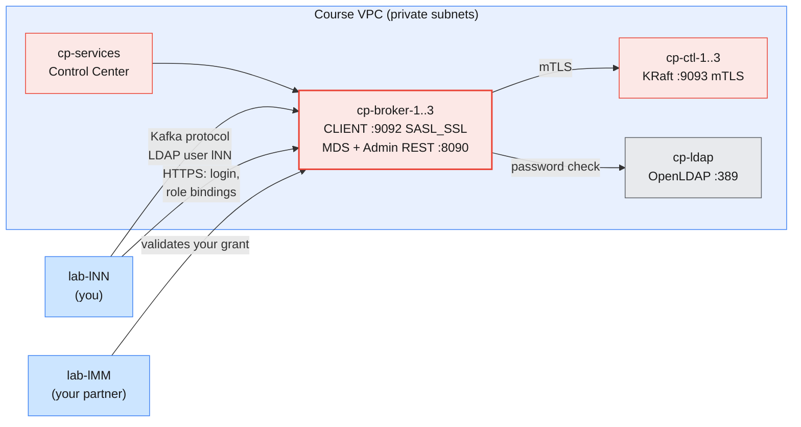
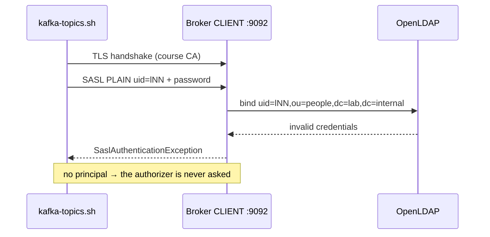
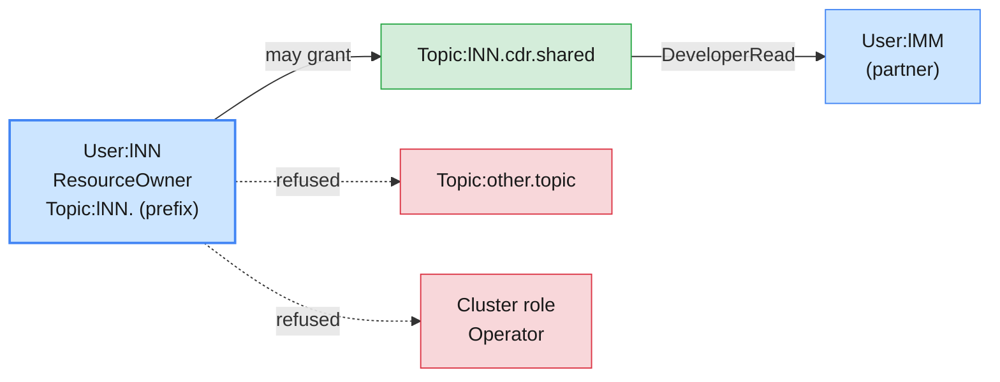

# Lab 02 — RBAC with LDAP Users on Self-Hosted Confluent Platform

| | |
| --- | --- |
| **Level** | Intermediate → Advanced |
| **Duration** | ~85 minutes |
| **Guide sections** | §2.2 Listeners and security protocols · §2.4 ACLs · §2.5 Mutual TLS · §3.1–§3.5 Confluent Platform authentication and authorization · §4.2 Predefined roles on Confluent Platform · §4.4 Managing role bindings · §6.1 Encryption in transit · §7.1–§7.2 Comparing with Apache ACLs · §8.4–§8.5 Hands-on Parts D–E · §9 Troubleshooting |
| **You will need** | Lab 01 done; the shared Confluent Platform cluster **started by the trainer**; `~/kafka/cp.properties`, `cp-ca.pem`, `confluent.env`, `apache.properties`; your LDAP password; your lab partner's ID `lMM`; two terminals; a browser for Control Center (optional) |

## Learning objectives

By the end of this lab you will be able to:

1. Read the **encryption, authentication and authorization** settings of a
   self-hosted Confluent Platform cluster from the client side: the TLS
   certificate, the listener protocols and the authorizer.
2. Tell an **authentication** failure (wrong LDAP password) from an
   **authorization** failure, from the exception alone.
3. Log in to **MDS** and audit role bindings on the Kafka cluster scope.
4. **Delegate** read access to a topic you own as a `ResourceOwner`, have it
   **validated** by another LDAP user, and revoke it.
5. Recognise and fix the **literal-vs-prefix** role-binding trap.
6. Compare Confluent RBAC with **SASL/SCRAM and ACLs** on the shared Apache
   cluster, using your own evidence.

The cluster runs on AWS, in the course VPC, and you administer access to it
from your VM. You never log in to the broker hosts: as on any real platform
team, the learners' interface is the network endpoint, MDS and the CLI.

This lab gives less step-by-step help than Lab 01. Each part states the goal
and the key commands. You read the results and fill in the tables.



---

## Before you start — variables (5 min)

```bash
# (VM)
source ~/kafka/confluent.env            # CP, MDS_URL, CP_REST, CP_CA, C3_URL
ME=lNN                                  # your prefix
PARTNER=lMM                             # your partner's ID, from the trainer
CFG=~/kafka/cp.properties               # your LDAP user on Confluent Platform
APACHE=apache-kafka.lab.internal:9092
APACHE_CFG=~/kafka/apache.properties
echo "$ME -> $PARTNER   $CP   $MDS_URL"
```

Check that the cluster is up before you start:

```bash
# (VM)
kafka-broker-api-versions.sh --bootstrap-server $CP --command-config $CFG | grep "(id:"
```

**Expected:**

```
cp-broker-1.lab.internal:9092 (id: 1 rack: null isFenced: false) -> (
cp-broker-2.lab.internal:9092 (id: 2 rack: null isFenced: false) -> (
cp-broker-3.lab.internal:9092 (id: 3 rack: null isFenced: false) -> (
```

> **Note:** if the command hangs and then times out, the cluster is still
> stopped or starting. Tell the trainer. Do not retry in a loop.

> **Administrator rule:** in this lab you touch only your own `$ME.*`
> topics, and your partner touches them only to **read** the one topic you
> grant. Never create, write to or grant on another learner's prefix.

---

## Part 1 — Read the cluster's security from the client side (15 min)

Goal: answer the three questions of guide §2.1 (*is the channel private? who
are you? may you do this?*) for this cluster, with evidence.

### 1.1 Encryption: the broker's certificate

```bash
# (VM)
openssl s_client -connect $CP -CAfile $CP_CA -verify_return_error </dev/null 2>/dev/null \
  | grep -E 'subject=|issuer=|Verify return'
```

**Expected** (the broker that answers may differ):

```
subject=CN = cp-broker-3.lab.internal
issuer=CN = …
Verify return code: 0 (ok)
```

```bash
# (VM)
openssl s_client -connect $CP -CAfile $CP_CA </dev/null 2>/dev/null \
  | openssl x509 -noout -enddate -ext subjectAltName
```

**Expected:** a `notAfter=` date about four months after the trainer set up
the cluster, and a `Subject Alternative Name` list that contains the broker's
own name **and** `cp-kafka.lab.internal`.

| Evidence | Meaning | Guide |
| -------- | ------- | ----- |
| **`Verify return code: 0 (ok)`** | The certificate chains to the course CA in `cp-ca.pem`: the channel is TLS and the broker is who it claims to be | §2.5, §6.1 |
| **`cp-kafka.lab.internal` in the SAN** | Why `bootstrap.servers=cp-kafka.lab.internal:9092` passes hostname verification although no broker is called that | §9 (`No subject alternative names…`) |
| **`notAfter`** | The day every client fails at once unless certificates are renewed with a rolling restart | §6.1 trap |

Now try without the CA:

```bash
# (VM)
openssl s_client -connect $CP -verify_return_error </dev/null 2>&1 | grep -E 'Verify return|verify error' | head -2
```

**Expected:** a `verify error` (unable to get local issuer certificate) and
a non-zero verify return code. A Java client without `ssl.truststore.*`
fails the same way, with `PKIX path building failed`.

### 1.2 Listeners and the authorizer

You hold the cluster-level `DescribeConfigs` ACL (guide §3.5), so you can
read the broker's settings:

```bash
# (VM)
kafka-configs.sh --bootstrap-server $CP --command-config $CFG --describe \
  --entity-type brokers --entity-name 1 --all \
  | grep -E "^  (listener.security.protocol.map|sasl.enabled.mechanisms|authorizer.class.name|confluent.authorizer.access.rule.providers|allow.everyone.if.no.acl.found|super.users)=" \
  | sed 's/ sensitive=.*//'
```

**Expected** (the order of the map entries may differ):

```
  allow.everyone.if.no.acl.found=false
  authorizer.class.name=io.confluent.kafka.security.authorizer.ConfluentServerAuthorizer
  confluent.authorizer.access.rule.providers=CONFLUENT,KRAFT_ACL
  listener.security.protocol.map=BROKER:SSL,CLIENT:SASL_SSL,CONTROLLER:SSL,INTERNAL:SASL_SSL
  sasl.enabled.mechanisms=…
  super.users=…
```

Fill in the table from your output and from `hosts.yml` as quoted in
guide §3.5:

| Listener | Port | Protocol | Who uses it | How they authenticate |
| -------- | ---- | -------- | ----------- | --------------------- |
| **CLIENT** | 9092 | | You, Control Center users, applications | |
| **BROKER** | 9091 | | Broker ↔ broker replication | |
| **INTERNAL** | 9071 | | Schema Registry, Connect, ksqlDB, Control Center | Tokens issued by MDS |
| **CONTROLLER** | 9093 | | Brokers ↔ KRaft controllers | |

> **What this shows:** every listener on this cluster is encrypted. Compare
> it with the shared Apache cluster (guide §2.2): `SASL_PLAINTEXT` for
> clients and a `PLAINTEXT` controller listener. Both are secure "enough"
> only because of the private subnets. Part 6 returns to this.

> **Note:** `super.users` may print as `null` or show only internal
> principals. The `mds` super user and the trainer's `SystemAdmin` are RBAC
> concepts held by MDS, not entries in this broker property.

---

## Part 2 — Authentication: LDAP passwords and MDS (10 min)

Goal: see an **authentication** failure, then log in to MDS.

### 2.1 A wrong password

Make a **temporary** copy of your client file with a wrong password. The
`sed` writes the literal word `wrong`, so no real secret is copied anywhere
new:

```bash
# (VM)
sed 's/password="[^"]*"/password="wrong"/' $CFG > /tmp/$ME-bad.properties
kafka-topics.sh --bootstrap-server $CP --command-config /tmp/$ME-bad.properties --list 2>&1 \
  | grep -o 'SaslAuthenticationException: .*' | head -1
rm -f /tmp/$ME-bad.properties
```

**Expected:**

```
SaslAuthenticationException: Authentication failed: Invalid username or password
```



The broker has no password file. It asks LDAP every time, through
`LdapAuthenticateCallbackHandler` (guide §3.2). Change a password in LDAP
and Kafka, the CLI and Control Center all follow.

### 2.2 MDS: anonymous, then you

```bash
# (VM)
curl -s --cacert $CP_CA -o /dev/null -w 'anonymous: HTTP %{http_code}\n' $MDS_URL/security/1.0/authenticate
```

**Expected:**

```
anonymous: HTTP 401
```

Log in. If Module 6 Lab 03 saved a Platform context, this refreshes it:

```bash
# (VM)
confluent login --url $MDS_URL --certificate-authority-path $CP_CA --save
confluent context list
```

**Expected:** `Logged in as "lNN".`, and two contexts with `*` on the
Platform one.

Read the cluster ID and your own role bindings:

```bash
# (VM)
CP_ID=$(confluent cluster describe --url $MDS_URL --certificate-authority-path $CP_CA -o json \
        | jq -r '.scope[] | select(.type=="kafka-cluster") | .id')
echo $CP_ID
confluent iam rbac role-binding list --principal User:$ME --kafka-cluster $CP_ID
```

**Expected** (shown for `l19`; yours shows your ID):

```
KGU0jiuWRoeoSV-5iJqXGA
  Principal |     Role      | Resource Type | Name | Pattern Type
------------+---------------+---------------+------+---------------
  User:l19  | ResourceOwner | Group         | l19. | PREFIXED
  User:l19  | ResourceOwner | Topic         | l19. | PREFIXED
```

| Question | Answer from your output |
| -------- | ----------------------- |
| Which role do you hold, and on which scope? | |
| Is it a literal or a prefixed binding? | |
| Can a `ResourceOwner` grant others access? (guide §4.2) | |

---

## Part 3 — Delegate access as a ResourceOwner (20 min)

Goal: give your partner **read-only** access to exactly one of your topics,
and find the limits of what you may grant.



### 3.1 Create the topics

```bash
# (VM)
for t in shared private; do
  confluent kafka topic create $ME.cdr.$t --url $CP_REST --certificate-authority-path $CP_CA \
    --partitions 1 --replication-factor 3 --config min.insync.replicas=2
done
printf '%s\n' '966500000011:{"type":"roaming","mcc":"424"}' '966500000012:{"type":"roaming","mcc":"602"}' | \
  kafka-console-producer.sh --bootstrap-server $CP --command-config $CFG \
  --topic $ME.cdr.shared --reader-property parse.key=true --reader-property key.separator=:
echo 'secret:{"case":"fraud-0042"}' | \
  kafka-console-producer.sh --bootstrap-server $CP --command-config $CFG \
  --topic $ME.cdr.private --reader-property parse.key=true --reader-property key.separator=:
```

**Expected:**

```
Created topic "l07.cdr.shared".
Created topic "l07.cdr.private".
```

…and no errors from the producers.

### 3.2 Grant read access to your partner

```bash
# (VM)
confluent iam rbac role-binding create --principal User:$PARTNER --role DeveloperRead \
  --kafka-cluster $CP_ID --resource Topic:$ME.cdr.shared
confluent iam rbac role-binding list --principal User:$PARTNER --kafka-cluster $CP_ID
```

**Expected:** the create succeeds. The list shows a **`DeveloperRead`** row
on `Topic` `lNN.cdr.shared` with pattern type **`LITERAL`**. Depending on
what MDS lets you see, your partner's own `ResourceOwner` rows on `lMM.` may
also be listed.

Your partner needs **no** group binding from you. They consume in their own
group `lMM.…`, which they already own (Part 2.2).

### 3.3 Find the limits

Try two grants a `ResourceOwner` must **not** be able to make:

```bash
# (VM)
# (a) a resource you do not own
confluent iam rbac role-binding create --principal User:$PARTNER --role DeveloperRead \
  --kafka-cluster $CP_ID --resource Topic:other.topic
# (b) a cluster-wide role
confluent iam rbac role-binding create --principal User:$PARTNER --role Operator \
  --kafka-cluster $CP_ID
```

**Expected:** both commands fail with an authorization error from MDS
(HTTP 403 / *Forbidden*). Nothing is created; check with the `list` from 3.2.

| Grant attempted | Result | Why |
| --------------- | ------ | --- |
| `DeveloperRead` on `Topic:lNN.cdr.shared` | | |
| `DeveloperRead` on `Topic:other.topic` | | |
| `Operator` on the cluster | | |

> **What this shows:** delegated administration with a boundary. The topic
> owner can share their own data without a ticket to the platform team, and
> cannot widen anyone's rights beyond what they own (guide §4.2, §7.2).
> Compare it with Part 6, where the Apache cluster gives no such option.

---

## Part 4 — Validate with your partner, then revoke (15 min)

Goal: prove the grant with a **different identity**. That is the
"validate access with test users" step of the module, done with a real
second LDAP user. You and your partner run Part 4.1 for each other at the
same time.

### 4.1 Your partner reads your topic

Your partner runs, on **their** VM, with **their** `cp.properties`.
`OWNER` is **your** ID:

```bash
# (VM) - partner
OWNER=lNN                               # ← the learner who granted you access
kafka-console-consumer.sh --bootstrap-server $CP --command-config $CFG \
  --topic $OWNER.cdr.shared --group $ME.reader --from-beginning \
  --formatter-property print.key=true --timeout-ms 15000
```

**Expected:**

```
966500000011	{"type":"roaming","mcc":"424"}
966500000012	{"type":"roaming","mcc":"602"}
Processed a total of 2 messages
```

Then your partner tries to **write** to your topic and to **read** your
private topic:

```bash
# (VM) - partner
echo 'x:{"forged":true}' | kafka-console-producer.sh --bootstrap-server $CP --command-config $CFG \
  --topic $OWNER.cdr.shared --reader-property parse.key=true --reader-property key.separator=: 2>&1 \
  | grep -o '[A-Za-z]*Exception: .*' | head -1
kafka-console-consumer.sh --bootstrap-server $CP --command-config $CFG \
  --topic $OWNER.cdr.private --group $ME.reader --from-beginning --max-messages 1 --timeout-ms 15000 2>&1 \
  | grep -o '[A-Za-z]*Exception: .*' | head -1
```

**Expected:**

```
TopicAuthorizationException: Not authorized to access topics: [l07.cdr.shared]
TopicAuthorizationException: Not authorized to access topics: [l07.cdr.private]
```

> **Common trap:** running the consumer **without** `--group`. The console
> consumer then invents a group called `console-consumer-NNNNN`, which your
> partner has no rights on, and the error is a `GroupAuthorizationException`.
> That error is about the group, not your grant.

**Optional (Control Center):** log in to `$C3_URL` as yourself, open
**Topics → lNN.cdr.shared**, and look for the access or role-binding view.
Your partner, logged in as themselves, sees `lNN.cdr.shared` in their topic
list but not `lNN.cdr.private`.

### 4.2 Revoke and re-validate

```bash
# (VM)
confluent iam rbac role-binding delete --principal User:$PARTNER --role DeveloperRead \
  --kafka-cluster $CP_ID --resource Topic:$ME.cdr.shared
```

Your partner re-runs the consumer from 4.1:

**Expected:** `TopicAuthorizationException: Not authorized to access topics:
[lNN.cdr.shared]`. Their group `lMM.reader` keeps its committed offset, but
an offset is no permission.

| Step | Partner's consumer on `lNN.cdr.shared` | Partner's producer |
| ---- | -------------------------------------- | ------------------ |
| Before the grant | Denied | Denied |
| After `DeveloperRead` | Allowed | Denied |
| After the delete | Denied | Denied |

---

## Part 5 — The prefix trap, and ACLs next to RBAC (10 min)

### 5.1 Literal vs prefix

Your partner now needs **every** topic of yours that starts with `lNN.cdr.`.
Make the classic mistake first:

```bash
# (VM)
confluent iam rbac role-binding create --principal User:$PARTNER --role DeveloperRead \
  --kafka-cluster $CP_ID --resource Topic:$ME.cdr.
confluent iam rbac role-binding list --principal User:$PARTNER --kafka-cluster $CP_ID
```

**Expected:** the command **succeeds**, and the row shows `Name`
`lNN.cdr.` with `Pattern Type` **`LITERAL`**. Your partner re-runs the 4.1
consumer on `lNN.cdr.shared`: still **denied**. The binding grants read on a
topic literally called `lNN.cdr.`, which does not exist.

Fix it: delete the literal binding and create the prefixed one:

```bash
# (VM)
confluent iam rbac role-binding delete --principal User:$PARTNER --role DeveloperRead \
  --kafka-cluster $CP_ID --resource Topic:$ME.cdr.
confluent iam rbac role-binding create --principal User:$PARTNER --role DeveloperRead \
  --kafka-cluster $CP_ID --resource Topic:$ME.cdr. --prefix
confluent iam rbac role-binding list --principal User:$PARTNER --kafka-cluster $CP_ID
```

**Expected:** `lNN.cdr.` with `Pattern Type` **`PREFIXED`**. Your partner
can now read **both** `lNN.cdr.shared` and `lNN.cdr.private`.

> **Administrator rule:** a prefix grant includes topics that do not exist
> yet. `lNN.cdr.private` was never meant to be shared, and the prefix
> exposed it anyway. Before you grant a prefix, list what it matches today
> and decide what it may match tomorrow. The naming convention *is* the
> security boundary (guide §4.5).

Remove the prefix grant now:

```bash
# (VM)
confluent iam rbac role-binding delete --principal User:$PARTNER --role DeveloperRead \
  --kafka-cluster $CP_ID --resource Topic:$ME.cdr. --prefix
confluent iam rbac role-binding list --principal User:$PARTNER --kafka-cluster $CP_ID | grep "$ME\." || echo "no grants from $ME left"
```

**Expected:** `no grants from lNN left`.

### 5.2 ACLs still exist

The Confluent Server Authorizer checks role bindings **and** ACLs
(`CONFLUENT,KRAFT_ACL`, Part 1.2). Look at the ACL side:

```bash
# (VM)
kafka-acls.sh --bootstrap-server $CP --command-config $CFG --list --principal User:$ME
```

**Expected:**

```
ACLs for principal `User:l07`
Current ACLs for resource `ResourcePattern(resourceType=CLUSTER, name=kafka-cluster, patternType=LITERAL)`:
 	(principal=User:l07, host=*, operation=DESCRIBE, permissionType=ALLOW)
	(principal=User:l07, host=*, operation=DESCRIBE_CONFIGS, permissionType=ALLOW)
```

Only the cluster ACL appears. Your `ResourceOwner` bindings are not ACLs.
They live in MDS (`_confluent-metadata-auth`), so `kafka-acls.sh` does not
show them, and a review that looks at only one of the two tools misses half
the picture (guide §3.4).

Now try to grant with an ACL instead of a role binding:

```bash
# (VM)
kafka-acls.sh --bootstrap-server $CP --command-config $CFG --add \
  --allow-principal User:$PARTNER --operation Read --topic $ME.cdr.shared 2>&1 \
  | grep -o '[A-Za-z]*Exception: .*' | head -1
```

**Expected:** a `ClusterAuthorizationException`. Creating ACLs needs
`Alter` on the **cluster**. Your ownership of the topic lets you grant
through RBAC, not through ACLs.

---

## Part 6 — Compare with Apache SASL/SCRAM and ACLs (10 min, advanced)

Goal: build the comparison of guide §7 from your own outputs.

```bash
# (VM)
grep -E '^(security.protocol|sasl.mechanism)=' $APACHE_CFG $CFG
kafka-acls.sh --bootstrap-server $APACHE --command-config $APACHE_CFG --list --principal User:$ME
```

**Expected** (ACL list abridged):

```
/home/learner/kafka/apache.properties:security.protocol=SASL_PLAINTEXT
/home/learner/kafka/apache.properties:sasl.mechanism=SCRAM-SHA-512
/home/learner/kafka/cp.properties:security.protocol=SASL_SSL
/home/learner/kafka/cp.properties:sasl.mechanism=PLAIN
ACLs for principal `User:l07`
Current ACLs for resource `ResourcePattern(resourceType=TOPIC, name=l07., patternType=PREFIXED)`:
 	(principal=User:l07, host=*, operation=ALL, permissionType=ALLOW)
Current ACLs for resource `ResourcePattern(resourceType=GROUP, name=l07., patternType=PREFIXED)`:
 	(principal=User:l07, host=*, operation=ALL, permissionType=ALLOW)
…
```

Then try the grant you made in Part 3.2, on the Apache cluster:

```bash
# (VM)
kafka-acls.sh --bootstrap-server $APACHE --command-config $APACHE_CFG --add \
  --allow-principal User:$PARTNER --operation Read --topic $ME.cdr.voice 2>&1 \
  | grep -o '[A-Za-z]*Exception: .*' | head -1
```

**Expected:** `ClusterAuthorizationException`, the same answer as Part 5.2.
On Apache Kafka, the person who owns a topic prefix has no way to share it
and must open a ticket with the cluster administrators.

Complete the table with **your** evidence (the part where you saw it):

| Aspect | Shared Apache cluster | Confluent Platform on AWS | Confluent Cloud (Lab 01) | Your evidence |
| ------ | --------------------- | ------------------------- | ------------------------ | ------------- |
| Wire protocol to clients | `SASL_PLAINTEXT` | `SASL_SSL` | `SASL_SSL` | Part 6 `grep`; Part 1.1 |
| Where passwords are checked | SCRAM hashes in KRaft metadata | | API key store at Confluent | Part 2.1 |
| Authorization model | ACLs only | | | Parts 2.2, 5.2 |
| Your rights expressed as | Prefix ACLs `ALL` on `lNN.` | | `EnvironmentAdmin` on `env-lNN` | |
| Can a topic owner grant read to someone else? | | Yes, on own resources (`ResourceOwner`) | Yes, as `EnvironmentAdmin` | Part 3.2, Part 6 |
| Application identity | SCRAM user | LDAP service user or certificate | Service account + API key | Lab 01 Part 2 |
| Revoking one permission without changing the credential | Remove the ACL | | | Part 4.2; Lab 01 Part 5.2 |

Then write three sentences for your security architect: which model would
you use for the operator's **on-premises** billing cluster, and which single
setting from Part 1.2 would you check first on any new cluster?

---

## Checkpoint questions

<details>
<summary>1. A mediation application on the Platform cluster fails with <code>SaslAuthenticationException</code>, and a second one fails with <code>TopicAuthorizationException</code>. Which team do you call for each, and which command do you run first?</summary>

`SaslAuthenticationException` is **authentication**: the LDAP password is wrong
or expired, or LDAP is unreachable. Check the service user with
`confluent login --url $MDS_URL` or with the directory team. `TopicAuthorizationException`
means authentication worked and **authorization** said no. Run
`confluent iam rbac role-binding list --principal User:<app> --kafka-cluster <id>`
and `kafka-acls.sh --list --principal User:<app>`, then fix the binding.
Part 2.1 and Part 4.1 showed one of each.
</details>

<details>
<summary>2. Your partner's consumer was denied after you created a binding on <code>Topic:lNN.cdr.</code>. The CLI reported success. Why, and how would you catch it in a review?</summary>

Without `--prefix` the binding is **literal**: it matches only a topic named
exactly `lNN.cdr.`, which does not exist. The create succeeded because
granting on a non-existent name is valid. In a review, read the
`Pattern Type` column of `role-binding list`: a name that ends in `.` with
pattern type `LITERAL` is almost always a mistake.
</details>

<details>
<summary>3. Why can you grant <code>DeveloperRead</code> on <code>lNN.cdr.shared</code> through MDS, but not the equivalent <code>Read</code> ACL with <code>kafka-acls.sh</code>?</summary>

They are two authorization systems with different rules for who may grant.
RBAC lets a `ResourceOwner` create bindings on the resources it owns.
Creating ACLs needs `Alter` on the **cluster**, which only administrators
hold. The Confluent Server Authorizer *evaluates* both, but your ownership
exists only on the RBAC side.
</details>

<details>
<summary>4. The broker certificates on this cluster expire in about four months. What happens on that day, and what do you put in place now?</summary>

Every TLS handshake on every listener fails: clients, brokers ↔ controllers
(mTLS), MDS and Control Center. The cluster is effectively down, even though
no process crashed. Put the `notAfter` date from Part 1.1 into monitoring
with an alert weeks ahead (Module 8). Rehearse renewal as a rolling restart
(Module 5), starting with the CA trust so that old and new certificates
overlap.
</details>

<details>
<summary>5. The fraud team asks for read access to "all CDR topics" of the billing team, now and in the future. What do you grant on Confluent Platform, and what do you check first?</summary>

`DeveloperRead` on `Topic:<billing-prefix>.cdr.` **with `--prefix`**, plus
`ResourceOwner` (or `DeveloperRead`) on the fraud team's own group prefix
for their consumers. Before granting, list what the prefix matches today and
agree what may be created under it later. Part 5.1 showed a prefix exposing
`lNN.cdr.private`, which was never meant to be shared. If a sensitive topic
must sit under the prefix, rename it or protect it with an explicit deny
ACL.
</details>

<details>
<summary>6. Compare revoking access in this lab with revoking on the Apache cluster. Which steps are the same, and what does Confluent add?</summary>

In both, you remove the authorization rule (role binding or ACL) and the
credential stays valid. The next request is denied, with no restart. Confluent
adds central management through MDS for every component (Kafka, Schema
Registry, Connect, ksqlDB), LDAP groups as principals, and delegation: the
resource owner can revoke what they granted without a cluster administrator.
On Apache Kafka every change goes through whoever holds `Alter` on the
cluster.
</details>

---

## Clean up

> **Warning:** delete only your own `$ME.*` topics, and only the bindings
> you granted to your partner. Read each command before you run it.

```bash
# (VM)
confluent iam rbac role-binding list --principal User:$PARTNER --kafka-cluster $CP_ID | grep "$ME\." \
  || echo "no grants from $ME left"
for t in shared private; do
  confluent kafka topic delete $ME.cdr.$t --url $CP_REST --certificate-authority-path $CP_CA --force
done
kafka-topics.sh --bootstrap-server $CP --command-config $CFG --list
kafka-consumer-groups.sh --bootstrap-server $CP --command-config $CFG --delete --group $ME.reader   # the group you used as a partner
confluent context use <your Cloud context name>
```

**Expected:** `no grants from lNN left`, both topics deleted, an empty topic
list (apart from topics you kept on purpose), and `*` back on your Cloud
context. The group delete removes `$ME.reader`, which you used when you read your partner's topic.

Keep your two CLI contexts and the Lab 01 service account and key: Module 8
monitors both clusters.

> **Next module:** *Module 8 — Monitoring & Performance Tuning with
> Confluent Kafka*. You watch the clusters you have just secured:
> Control Center monitoring and alerts, the Metrics API (which needs only
> `MetricsViewer`, not an admin role), throughput and latency, and consumer
> lag for the `sa-lNN-app` billing consumer you built in Lab 01.
