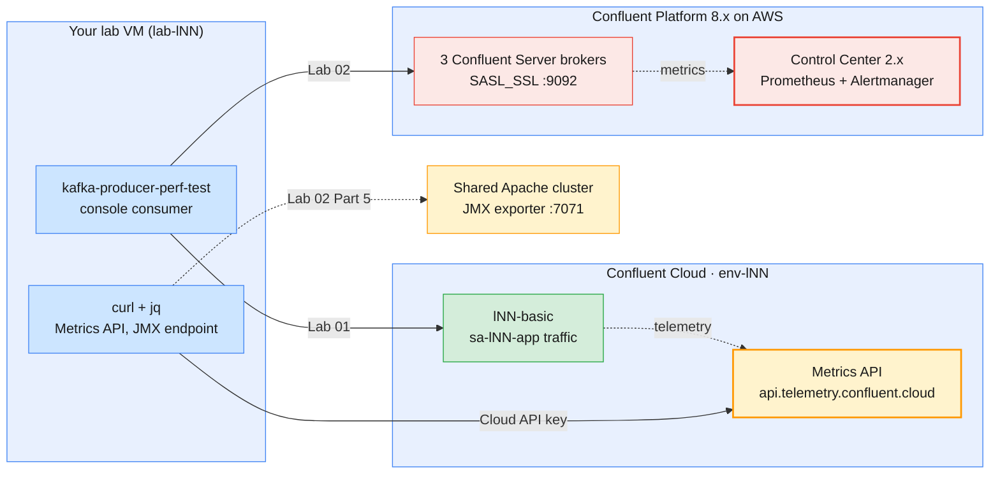

# Module 8 Labs — Monitoring & Performance Tuning with Confluent Kafka

> **Course:** Apache Kafka & Confluent Kafka Administration
> **Companion guide:** *`guides/module-08-…` is not written yet.* Until it is, the labs
> cite [Module 6 guide §6](../../guides/module-06-introducing-confluent-kafka.md#6-confluent-control-center-walkthrough)
> (Control Center), [Module 4 guide §3 and §4.5](../../guides/module-04-producing-consuming-messages.md)
> (producer tuning, consumer groups) and [Module 5 guide §5.5](../../guides/module-05-cluster-operations-replication-ha.md)
> (balancing).
> **Module objective:** Monitor and tune Confluent Kafka clusters for performance using
> Confluent's administration tooling.

Module 7 secured the two Confluent targets. In this module you **watch** them.
Lab 01 runs on **Confluent Cloud** (`env-lNN`). You give `sa-lNN-app` a
monitoring role, read throughput and consumer lag from the **Metrics API**,
measure latency at the client, tune the producer, and build a lag alert. Lab 02
runs on the **self-hosted Confluent Platform cluster on AWS**. There you
monitor a workload in **Control Center**, set up a Control Center **alert** on
consumer lag, read the raw JMX/Prometheus metrics of the shared Apache cluster
for comparison, and make scaling decisions from evidence. Do the labs in order.

| # | Lab | Level | Time | What you will do |
| - | --- | ----- | ---- | ---------------- |
| 01 | [Metrics API, throughput & consumer lag on Confluent Cloud](lab-01-metrics-api-throughput-lag-confluent-cloud.md) | Beginner | 75 min | Generate a CDR workload as `sa-lNN-app`, bind `MetricsViewer` and create a Cloud API key, query throughput and storage metrics, compare two producer tunings, build and drain consumer lag, alert on it with a Metrics API watch script |
| 02 | [Control Center monitoring, alerts & tuning on Confluent Platform](lab-02-control-center-monitoring-alerts-platform-aws.md) | Intermediate → Advanced | 85 min | Run a steady workload on the shared Platform cluster, read throughput and latency in Control Center, measure the `acks` and batching trade-off, create a consumer-lag trigger and watch it fire and resolve, compare with Apache JMX/Prometheus, decide how to scale |

Estimated total: **about 2 h 40 min**, including checkpoint questions.

> **Trainers:** both shared clusters are **stopped** between sessions. Start the
> Confluent Platform cluster (LDAP → controllers → brokers → services) and the
> Apache cluster (`infra/cluster/scripts/cluster-power.sh start`) at least
> 15 minutes before Lab 02. See
> [`infra/guides/confluent-platform-cluster-connect.md`](../../infra/guides/confluent-platform-cluster-connect.md).
> In the dry run, check two things with a learner login (`lab-l19`): whether
> `api-key create --resource cloud --service-account` works for an
> `EnvironmentAdmin` (Lab 01 Part 2 has a fallback), and whether Control Center
> lets a learner create an alert trigger (Lab 02 Part 4 has a fallback).

---

## Prerequisites

| Requirement | Check with | Notes |
| ----------- | ---------- | ----- |
| Module 7 completed | `confluent context list` | Cloud and Platform contexts both saved |
| `sa-lNN-app`, its Kafka API key and `~/kafka/sa-app.properties` from Module 7 Lab 01 | `ls -l ~/kafka/sa-app.properties` | Lab 01 produces and consumes as the application |
| Topic `$ME.cdr.voice` on Cloud | `confluent kafka topic list` | Kept at the end of Module 7 Lab 01 |
| Confluent CLI v4.x, Kafka 4.x CLI, `jq`, `curl` | `confluent version`, `kafka-producer-perf-test.sh --version` | In the VM image |
| Platform files `~/kafka/cp.properties`, `cp-ca.pem`, `confluent.env` | `ls -l ~/kafka/` | Lab 02 workload and Control Center (`$C3_URL`) |
| Your LDAP password | Your credentials e-mail | Control Center login, `confluent login --url` |
| Two or three terminals and a browser | — | Load generator, consumer and commands side by side |

> **No Docker in this module.** Nothing runs locally and no ports need to be
> free. Stop any earlier local cluster to give the VM its memory back.

> **Using the course AWS VMs?** Your VM (`lab-lNN`) already has the CLIs and
> the prepared files under `~/kafka/`. Open it in the browser IDE or VS Code
> Remote-SSH and run the labs there exactly as written. See
> [`infra/LAB-SETUP.md`](../../infra/LAB-SETUP.md) §4–§7 for the full course
> environment.

---

## Lab environment

The targets are the same as in Modules 6 and 7. What is new is **where the
numbers come from**.



| Target | Where the metrics come from | Identity | Names used in the labs |
| ------ | --------------------------- | -------- | ---------------------- |
| **Confluent Cloud** (Lab 01) | Metrics API (`/v2/metrics/cloud/query`, `/export`) | `sa-lNN-app` with `MetricsViewer` and a **Cloud** API key (`~/kafka/metrics.netrc`) | Topic `$ME.cdr.voice`, group `$ME.billing` |
| **Confluent Platform on AWS** (Lab 02) | Control Center (`$C3_URL`), backed by its own Prometheus | Your LDAP user `lNN` (`~/kafka/cp.properties`) | Topic `$ME.cdr.voice`, group `$ME.billing` |
| **Shared Apache cluster** (Lab 02 Part 5) | JMX exporter on each broker, `http://broker-11.lab.internal:7071/metrics` | None (plain HTTP inside the VPC) | Read-only comparison |

### Everyday commands

In every new terminal:

```bash
# (VM)
source ~/kafka/confluent.env            # CP, MDS_URL, CP_REST, CP_CA, C3_URL (no secrets)
ME=lNN                                  # your prefix: l01 … l18
CFG=~/kafka/cp.properties               # your LDAP user on Confluent Platform (Lab 02)
SA_CFG=~/kafka/sa-app.properties        # sa-lNN-app on Confluent Cloud (Module 7)
MAPI=https://api.telemetry.confluent.cloud/v2/metrics/cloud

kafka-consumer-groups.sh --bootstrap-server $CP --command-config $CFG --describe --group $ME.billing
curl -s --netrc-file ~/kafka/metrics.netrc $MAPI/descriptors/metrics | jq -r '.data[].name' | head
```

> **Convention used in the labs**
>
> - `# (VM)`: run on **your lab VM**, against Confluent Cloud, the shared
>   Confluent Platform cluster or the shared Apache cluster, with your prefix
>   (`$ME`). Every command block in this module uses it. `# (VM) - terminal 2`
>   marks a block that keeps running while you work in the first terminal.
> - **Browser** steps (Cloud Console, Control Center) are written as
>   numbered *Menu → Item* paths, not code blocks.
> - Secrets are typed at a `read -rsp` prompt and land only in files under
>   `~/kafka/` with mode `600`; they never appear in commands or notes.

---

## Troubleshooting

| Symptom | Likely cause | Fix |
| ------- | ------------ | --- |
| Metrics API returns `{"errors":[{"status":"401" …` | Kafka API key used instead of a **Cloud** API key, or the key is not active yet | `confluent api-key list --resource cloud`; wait 1–2 minutes after creating it |
| Metrics API returns `403` or `"data": []` for your cluster | `MetricsViewer` binding missing, or the query is for a cluster outside `env-lNN` | `confluent iam rbac role-binding list --principal User:$SA --inclusive`; check `$LKC` |
| Metrics API query returns `"data": []` right after the load | Cloud metrics arrive a few minutes late | Wait 3–5 minutes; widen the interval |
| `kafka-producer-perf-test` fails with `TopicAuthorizationException` on Cloud | `DeveloperWrite` was revoked at the end of Module 7 | Lab 01 Part 1 grants it again |
| `--describe --group` prints `Consumer group 'lNN.billing' has no active members.` | Expected when no consumer runs: lag is still shown from the committed offsets | Start the consumer to drain it |
| Control Center shows no throughput for your topic | Metrics take 1–2 minutes to appear, or the producer stopped | Check terminal 2; refresh after a minute |
| Control Center **Alerts** page hidden or **Add trigger** refused | Triggers need cluster-level rights a learner does not have | Lab 02 Part 4 fallback: the trainer creates the trigger, you make it fire |
| `curl: (7) Failed to connect to broker-11.lab.internal port 7071` | The Apache cluster is stopped | Ask the trainer to start it |

---

## Cleaning up after the module

Each lab ends with its own clean up. After both labs:

- **Kept on Cloud:** `sa-lNN-app` with its `DeveloperRead` and `MetricsViewer`
  bindings, its Kafka key in `~/kafka/sa-app.properties`, its Cloud key in
  `~/kafka/metrics.netrc`, and the topic `$ME.cdr.voice`. Module 9 uses the
  Metrics API again while troubleshooting.
- **Removed on Cloud:** the `DeveloperWrite` binding that Lab 01 adds back for the
  load test.
- **Removed on Platform:** your `$ME.cdr.voice` topic, the `$ME.billing` group and
  your Control Center trigger.

To check what is left:

```bash
# (VM)
confluent context use <your Cloud context name>
confluent iam rbac role-binding list --principal User:$SA --inclusive
confluent api-key list --service-account $SA
```

The trainer deletes the service account, its keys and your environment at the end of
the course ([`infra/confluent/README.md` Part D](../../infra/confluent/README.md#part-d--teardown)).
