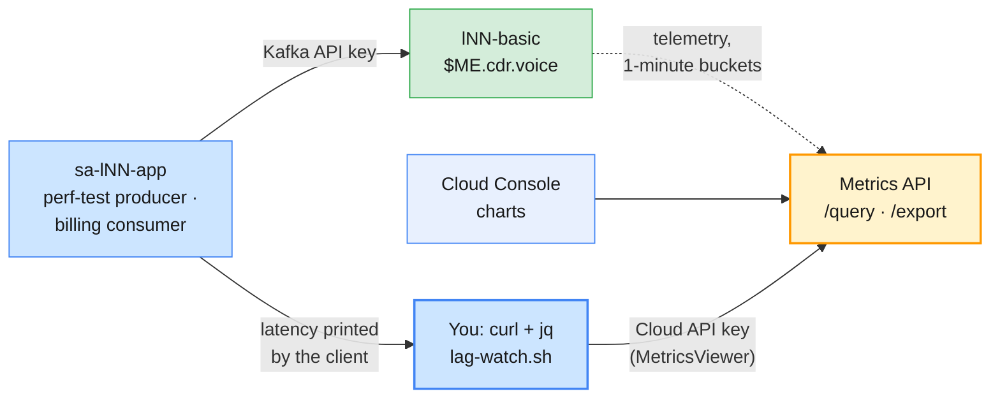
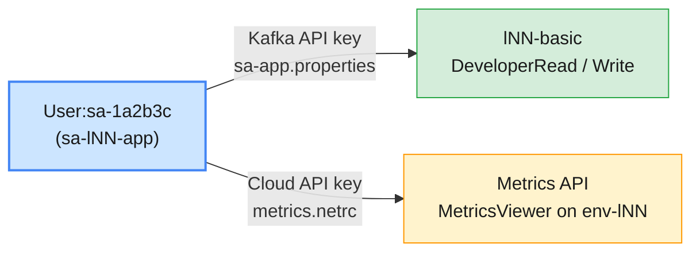
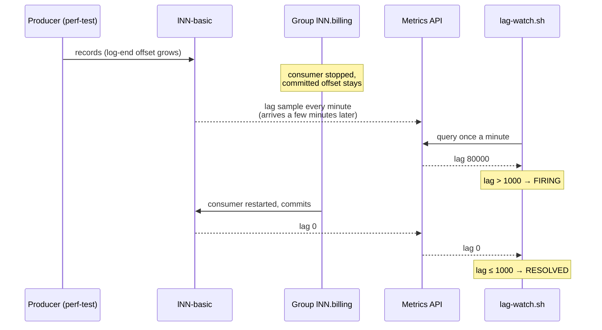

# Lab 01 — Metrics API, Throughput & Consumer Lag on Confluent Cloud

| | |
| --- | --- |
| **Level** | Beginner |
| **Duration** | ~75 minutes |
| **Guide sections** | Module 6 §6.3 The Confluent Cloud Console · Module 6 §5 (Cloud API keys) · Module 4 §3.2 Batching · Module 4 §3.6 Measuring with `kafka-producer-perf-test.sh` · Module 4 §4.5 Inspecting groups · Module 7 §4–§5 Roles and API keys |
| **You will need** | Module 7 done: `sa-lNN-app`, its key in `~/kafka/sa-app.properties`, the topic `$ME.cdr.voice` and the group `$ME.billing`; your Cloud CLI context; three terminals; a browser for the Cloud Console |

## Learning objectives

By the end of this lab you will be able to:

1. Give a monitoring identity the **`MetricsViewer`** role and a **Cloud**
   API key, and explain why it is a different key from the one clients use.
2. Discover metrics with the Metrics API **descriptors** call and query
   **throughput, storage and connections** for your cluster and topic.
3. Measure **latency at the client** with `kafka-producer-perf-test.sh` and
   compare two producer tunings with evidence from both sides.
4. Build **consumer lag**, read it with `kafka-consumer-groups.sh` and with
   the Metrics API, and explain why the two numbers do not move together.
5. Write a simple **lag alert** that fires and resolves on Metrics API data,
   and say what replaces it in production.

## Why this lab

Confluent Cloud gives you no broker to log in to and no JMX port. Everything
an operator knows about a Cloud cluster comes from three places: the **Cloud
Console** (for people), the **Metrics API** (for tools and alerts), and the
**clients** themselves (for latency). In this lab you use all three on the
billing application you secured in Module 7.



---

## Before you start — variables (5 min)

Use the IDs you wrote in your notes at the end of Module 7 Lab 01:

```bash
# (VM)
confluent context list                  # the * must be on your Cloud context
ME=lNN                                  # your prefix
ENV_ID=env-7qk3x2                       # ← your env-lNN ID
LKC=lkc-9xw2pq                          # ← your lNN-basic cluster ID
confluent environment use $ENV_ID
confluent kafka cluster use $LKC
CCLOUD=$(confluent kafka cluster describe -o json | jq -r .endpoint | sed 's#SASL_SSL://##')
SA=$(confluent iam service-account list -o json | jq -r --arg n "sa-$ME-app" '.[] | select(.name==$n) | .id')
SA_CFG=~/kafka/sa-app.properties
MAPI=https://api.telemetry.confluent.cloud/v2/metrics/cloud
echo "$ENV_ID $LKC $SA $CCLOUD"
```

**Expected:**

```
env-7qk3x2 lkc-9xw2pq sa-1a2b3c pkc-xxxxx.ap-south-1.aws.confluent.cloud:9092
```

You need these variables in **every** terminal you open in this lab. Copy the
block into terminals 2 and 3 when you open them.

---

## Part 1 — Put a workload on the cluster (10 min)

At the end of Module 7 you removed `DeveloperWrite` from the application, so
it can only read. The billing feed is back in production today: grant write
again, on the one topic.

```bash
# (VM)
SCOPE="--environment $ENV_ID --cloud-cluster $LKC --kafka-cluster $LKC"
confluent iam rbac role-binding create --principal User:$SA --role DeveloperWrite $SCOPE --resource Topic:$ME.cdr.voice
confluent iam rbac role-binding list --principal User:$SA --inclusive
```

**Expected:** three bindings: `DeveloperRead` on `Group:$ME.billing`,
`DeveloperRead` and `DeveloperWrite` on `Topic:$ME.cdr.voice`.

Start a steady producer in **terminal 2**: 200 CDRs per second for five
minutes. `client.id` names the workload, so you can recognise it later.

```bash
# (VM) - terminal 2
kafka-producer-perf-test.sh --bootstrap-server $CCLOUD --command-config $SA_CFG \
  --topic $ME.cdr.voice --num-records 60000 --record-size 200 --throughput 200 \
  --command-property client.id=$ME-mediation acks=all
```

**Expected:** one line every 5 seconds, close to 200 records/sec and
0.04 MB/sec. The lines below show the format; they come from a dry run on a
local broker at 500 records/sec, and your latencies depend on the network:

```
1002 records sent, 499.0 records/sec (0.10 MB/sec), 13.7 ms avg latency, 316.0 ms max latency.
1002 records sent, 500.2 records/sec (0.10 MB/sec), 9.7 ms avg latency, 129.0 ms max latency.
…
```

> **Note:** if the first lines show `TopicAuthorizationException`, the new
> binding has not propagated yet. Press `Ctrl+C`, wait 30 seconds and start
> again.

While it runs, open the **Cloud Console** in your browser:

1. `https://confluent.cloud` → **Environments** → `env-lNN` → `lNN-basic` →
   **Overview**. Find the **throughput** (production) chart.
2. **Topics** → `$ME.cdr.voice`. Find the production rate for the topic.
3. **Clients** (left menu). Find the producer `$ME-mediation`.

| What you look at | Your value | Matches terminal 2? |
| ---------------- | ---------- | ------------------- |
| Cluster production throughput | | ≈ 0.04 MB/s (200 × 200 B) |
| Topic production rate | | |
| Producer client ID listed | | |

> **What this shows:** the Console charts have no broker breakdown. On a
> managed cluster you are not given brokers to look at (Module 6 §6.3). You
> see the **cluster** and its **topics** and **clients**, and the same numbers
> are available to your tools through the Metrics API.

Leave terminal 2 running and go on.

---

## Part 2 — A monitoring identity: `MetricsViewer` and a Cloud API key (10 min)

The key in `sa-app.properties` is a **Kafka** API key: it authenticates to
`lNN-basic` and nothing else. The Metrics API is a Confluent Cloud service,
so it needs a **Cloud** API key (`--resource cloud`, Module 6 §5) whose owner
holds a role that may read metrics.



Bind the role on your environment only, then create the key:

```bash
# (VM)
confluent iam rbac role-binding create --principal User:$SA --role MetricsViewer --environment $ENV_ID
confluent api-key create --resource cloud --service-account $SA --description "$ME metrics viewer"
```

**Expected:** the binding, then a table with **API Key** and **API Secret**.
The secret is shown **once**.

> **If the key command is refused:** creating Cloud API keys for a service
> account may need an organization-level role that learners do not have. Then
> create a Cloud key for **yourself** instead: `confluent api-key create
> --resource cloud --description "$ME metrics viewer"`. Your
> `EnvironmentAdmin` role can read the metrics of `env-lNN`, so the rest of
> the lab works the same. Note in your table that the owner is a person.

Store the key in a **netrc** file, so it never appears on a command line or
in your shell history. Type the key, then paste the secret at the hidden
prompt:

```bash
# (VM)
read -rp  "Cloud API key: " MKEY
read -rsp "Cloud API secret: " MSECRET; echo
umask 077
printf 'machine api.telemetry.confluent.cloud\nlogin %s\npassword %s\n' "$MKEY" "$MSECRET" > ~/kafka/metrics.netrc
unset MSECRET
ls -l ~/kafka/metrics.netrc
```

**Expected:** `-rw------- 1 learner learner … /home/learner/kafka/metrics.netrc`.

Wait a minute for the key to become active, then ask the API which metrics
exist:

```bash
# (VM)
curl -s --netrc-file ~/kafka/metrics.netrc $MAPI/descriptors/metrics \
  | jq -r '.data[] | select(.name|startswith("io.confluent.kafka.server/")) | .name'
```

**Expected** (abridged; the list grows over time):

```
io.confluent.kafka.server/active_connection_count
io.confluent.kafka.server/consumer_lag_offsets
io.confluent.kafka.server/partition_count
io.confluent.kafka.server/received_bytes
io.confluent.kafka.server/received_records
io.confluent.kafka.server/request_count
io.confluent.kafka.server/retained_bytes
io.confluent.kafka.server/sent_bytes
io.confluent.kafka.server/sent_records
io.confluent.kafka.server/successful_authentication_count
…
```

> **Administrator rule:** give dashboards and alerting tools their **own**
> identity with `MetricsViewer` and nothing else. A monitoring key that can
> also write to topics turns a leaked Grafana password into a data breach.
> In this course the application account doubles as the monitoring account
> only because learners cannot create new service accounts.

---

## Part 3 — Query throughput, storage and connections (10 min)

A query names a **metric**, a **filter** (your cluster), a **granularity**
(here one-minute buckets), a time **interval**, and optionally a label to
**group by**. Build the body with `jq` and post it:

```bash
# (VM)
FROM=$(date -u -d '-15 min' +%Y-%m-%dT%H:%M:00Z); TO=$(date -u +%Y-%m-%dT%H:%M:00Z)
jq -n --arg lkc "$LKC" --arg i "$FROM/$TO" '{
  aggregations: [{metric: "io.confluent.kafka.server/received_records"}],
  filter: {field: "resource.kafka.id", op: "EQ", value: $lkc},
  granularity: "PT1M",
  intervals: [$i],
  group_by: ["metric.topic"]
}' | curl -s --netrc-file ~/kafka/metrics.netrc -H 'Content-Type: application/json' \
       -d @- $MAPI/query | jq -c '.data[]'
```

**Expected** (one line per minute; the most recent minutes may be missing):

```
{"timestamp":"2026-10-08T09:41:00Z","value":12000,"metric.topic":"l07.cdr.voice"}
{"timestamp":"2026-10-08T09:42:00Z","value":12000,"metric.topic":"l07.cdr.voice"}
…
```

12,000 records per minute is 200 per second: the same number terminal 2
reports. The last 2–3 minutes are often empty. Cloud metrics arrive a few
minutes late.

The same call works for every metric, so wrap it in a small function:

```bash
# (VM)
mq() {  # mq <metric> [group_by label]: last 15 minutes of one metric for $LKC
  local from=$(date -u -d '-15 min' +%Y-%m-%dT%H:%M:00Z) to=$(date -u +%Y-%m-%dT%H:%M:00Z)
  jq -n --arg m "io.confluent.kafka.server/$1" --arg lkc "$LKC" --arg i "$from/$to" --arg g "${2:-}" '
    {aggregations: [{metric: $m}], granularity: "PT1M", intervals: [$i],
     filter: {field: "resource.kafka.id", op: "EQ", value: $lkc}}
    + (if $g == "" then {} else {group_by: [$g]} end)' |
  curl -s --netrc-file ~/kafka/metrics.netrc -H 'Content-Type: application/json' -d @- $MAPI/query |
  jq -c '.data[-3:][]'
}
mq received_bytes metric.topic
mq retained_bytes metric.topic
mq active_connection_count
mq request_count metric.type
```

Fill in the table from the output (latest complete minute):

| Metric | What it measures | Your value | Where else you can see it |
| ------ | ---------------- | ---------- | ------------------------- |
| **`received_bytes`** | Bytes produced to the topic per minute (ingress) | | Console → Topic → production |
| **`retained_bytes`** | Bytes stored for the topic now (grows until retention deletes) | | Console → Topic → storage; `kafka-log-dirs.sh` on Platform |
| **`active_connection_count`** | Client connections open to the cluster | | Not shown by any Kafka CLI |
| **`request_count`** by `metric.type` | Produce, Fetch, Metadata… requests per minute | | Broker `RequestMetrics` JMX on Apache (Lab 02 Part 5) |

> **What this shows:** throughput on Cloud is **counted at the cluster**, per
> minute, per topic. There is no broker, disk or CPU metric to look at. Your
> capacity questions become "how close am I to the limits of my cluster
> type?" (Part 6).

---

## Part 4 — Tune the producer, measure latency at the client (15 min)

The Metrics API tells you how much went through. It does not tell you how long
one `send()` took. Latency on Cloud is measured **at the client**. When terminal 2 has
finished, run the same 30,000 records twice, **as fast as possible**, with two
tunings (Module 4 §3.5):

```bash
# (VM) - terminal 2
# Run A: Kafka 4.x defaults (linger.ms=5, batch.size=16384, no compression)
kafka-producer-perf-test.sh --bootstrap-server $CCLOUD --command-config $SA_CFG \
  --topic $ME.cdr.voice --num-records 30000 --record-size 200 --throughput -1 \
  --command-property client.id=$ME-tune-a acks=all
sleep 120
# Run B: bigger batches, more linger, lz4
kafka-producer-perf-test.sh --bootstrap-server $CCLOUD --command-config $SA_CFG \
  --topic $ME.cdr.voice --num-records 30000 --record-size 200 --throughput -1 \
  --command-property client.id=$ME-tune-b acks=all linger.ms=50 batch.size=262144 compression.type=lz4
```

**Expected:** each run ends with one summary line in this format. The numbers
below come from a dry run on a local broker; yours, over the network to
Cloud, will be lower in throughput and higher in latency:

```
30000 records sent, 58708.414873 records/sec (11.20 MB/sec), 190.62 ms avg latency, 305.00 ms max latency, 194 ms 50th, 244 ms 95th, 247 ms 99th, 248 ms 99.9th.
30000 records sent, 76142.131980 records/sec (14.52 MB/sec), 62.01 ms avg latency, 283.00 ms max latency, 61 ms 50th, 81 ms 95th, 87 ms 99th, 88 ms 99.9th.
```

| Run | records/sec | MB/sec | avg latency | p99 latency |
| --- | ----------- | ------ | ----------- | ----------- |
| **A** defaults | | | | |
| **B** `linger.ms=50`, `batch.size=262144`, `lz4` | | | | |

Two minutes later, look at the same runs from the cluster's side:

```bash
# (VM)
mq request_count metric.type
mq received_bytes metric.topic
```

Find the minute of run A and the minute of run B. Compare the **Produce**
request counts: B sends the same records in **fewer, larger** requests.

> **What this shows:** with `--throughput -1` the producer is saturated, and
> its "latency" is mostly **time waiting in the client's own queue**. Bigger
> batches drain that queue with fewer round trips, so B can win on throughput
> **and** latency. At a low, steady rate (Part 1) the opposite holds:
> `linger.ms=50` adds up to 50 ms to every record. Tune for the traffic you
> really have (Module 4 §3.2).

> **Common trap:** expecting `lz4` to shrink `received_bytes` here. The
> perf-test payload is random letters, which barely compress. A dry run
> stored 6.3 MB for run A and 6.2 MB for run B. Real CDR JSON repeats the
> same field names in every record and compresses far better. Measure with
> **your** data before you promise savings.

---

## Part 5 — Consumer lag, and an alert on it (20 min)

Lag is the number of records written to a partition that a group has not
yet committed past. You build some, watch it two ways, alert on it, and drain it.

### 5.1 Build lag

Consume part of the topic as the billing application, then stop:

```bash
# (VM)
kafka-console-consumer.sh --bootstrap-server $CCLOUD --command-config $SA_CFG \
  --topic $ME.cdr.voice --group $ME.billing --max-messages 5000 > /dev/null
kafka-consumer-groups.sh --bootstrap-server $CCLOUD --command-config $SA_CFG \
  --describe --group $ME.billing
```

**Expected** (from a dry run; your offsets differ, the shape is the same):

```
Processed a total of 5000 messages

Consumer group 'l07.billing' has no active members.

GROUP           TOPIC           PARTITION  CURRENT-OFFSET  LOG-END-OFFSET  LAG             CONSUMER-ID     HOST            CLIENT-ID
l07.billing     l07.cdr.voice   0          9860            34409           24549           -               -               -
l07.billing     l07.cdr.voice   1          5224            29809           24585           -               -               -
l07.billing     l07.cdr.voice   2          4916            35782           30866           -               -               -
```

`LAG = LOG-END-OFFSET − CURRENT-OFFSET` for each partition. The group has no
active members, yet the lag is known: it comes from the **committed offsets**
the group left behind (Module 4 §4.5). Your topic may have more partitions;
add up the `LAG` column.

### 5.2 A lag alert on the Metrics API

Write a small watch script. It asks the Metrics API for the group's lag once
a minute and prints **FIRING** when it crosses a threshold and **RESOLVED**
when it falls back:

```bash
# (VM)
cat > ~/kafka/lag-watch.sh <<'EOF'
#!/usr/bin/env bash
# lag-watch.sh <lkc> <consumer-group> <threshold>: poll consumer_lag_offsets once a minute
set -u
LKC=$1 GROUP=$2 MAX=$3 STATE=OK
MAPI=https://api.telemetry.confluent.cloud/v2/metrics/cloud
while true; do
  from=$(date -u -d '-10 min' +%Y-%m-%dT%H:%M:00Z) to=$(date -u +%Y-%m-%dT%H:%M:00Z)
  lag=$(jq -n --arg lkc "$LKC" --arg g "$GROUP" --arg i "$from/$to" '{
      aggregations: [{metric: "io.confluent.kafka.server/consumer_lag_offsets"}],
      filter: {op: "AND", filters: [
        {field: "resource.kafka.id", op: "EQ", value: $lkc},
        {field: "metric.consumer_group_id", op: "EQ", value: $g}]},
      granularity: "PT1M", intervals: [$i]}' |
    curl -s --netrc-file ~/kafka/metrics.netrc -H 'Content-Type: application/json' -d @- $MAPI/query |
    jq -r '[.data[]] | max_by(.timestamp) | .value // "none"')
  if [[ $lag != none ]] && (( ${lag%.*} > MAX )) && [[ $STATE == OK ]]; then STATE=FIRING; echo "$(date +%T) FIRING   $GROUP lag=$lag > $MAX"
  elif [[ $lag != none ]] && (( ${lag%.*} <= MAX )) && [[ $STATE == FIRING ]]; then STATE=OK; echo "$(date +%T) RESOLVED $GROUP lag=$lag"
  else echo "$(date +%T) $STATE $GROUP lag=$lag"; fi
  sleep 60
done
EOF
chmod 700 ~/kafka/lag-watch.sh
```

Start it in **terminal 3** with a threshold of 1,000 records:

```bash
# (VM) - terminal 3
~/kafka/lag-watch.sh $LKC $ME.billing 1000
```

**Expected** within 3–5 minutes (the first lines may say `lag=none` while
the metric catches up):

```
09:58:12 OK l07.billing lag=none
09:59:12 OK l07.billing lag=none
10:00:13 FIRING   l07.billing lag=80000 > 1000
10:01:13 FIRING l07.billing lag=80000
```



### 5.3 Drain the lag and watch the alert resolve

In **terminal 2**, run the billing consumer until it has nothing left to read:

```bash
# (VM) - terminal 2
kafka-console-consumer.sh --bootstrap-server $CCLOUD --command-config $SA_CFG \
  --topic $ME.cdr.voice --group $ME.billing --timeout-ms 20000 > /dev/null
kafka-consumer-groups.sh --bootstrap-server $CCLOUD --command-config $SA_CFG \
  --describe --group $ME.billing
```

**Expected:** `Processed a total of … messages` (after a
`TimeoutException` when no more records arrive), then `LAG` **0** on every partition. Terminal 3 prints
`RESOLVED` a few minutes **later**.

| Question | Your answer |
| -------- | ----------- |
| Time the CLI showed lag 0 | |
| Time `lag-watch.sh` printed `RESOLVED` | |
| Delay between the two | |

> **What this shows:** `kafka-consumer-groups.sh` asks the cluster **now**;
> the Metrics API reports **one-minute buckets, minutes later**. Use the API
> for trends and alerts, the CLI to confirm what is true at this moment.

> **Production note:** nobody runs a `while true` loop as an alerting system.
> The same query belongs in a monitoring tool: Prometheus scraping the
> `/export` endpoint (Part 6) with an Alertmanager rule, Datadog or another
> integration, or Confluent Cloud **notifications** (configured by an
> organization admin). Keep the threshold and the time window; change only
> the tool. Press `Ctrl+C` in terminal 3 now.

---

## Part 6 — Prometheus format and scaling on Cloud (5 min, advanced)

The `/export` endpoint returns the latest values in the **Prometheus text
format**, so an existing Prometheus can scrape Confluent Cloud like any other
target:

```bash
# (VM)
curl -s --netrc-file ~/kafka/metrics.netrc "$MAPI/export?resource.kafka.id=$LKC" \
  | grep -E "^confluent_kafka_server_(received_bytes|consumer_lag_offsets)" | grep $ME | head -5
```

**Expected:** lines like
`confluent_kafka_server_received_bytes{kafka_id="lkc-9xw2pq",topic="l07.cdr.voice"} 1.23E5 …`.
Lab 02 Part 5 puts these next to the JMX names of the Apache cluster.

Scaling on Confluent Cloud means **choosing or resizing the cluster type**, not adding
brokers yourself:

| If the metrics show… | On a Basic / Standard cluster | On a Dedicated cluster |
| -------------------- | ----------------------------- | ---------------------- |
| Ingress or egress near the cluster type's limit | Move to a larger cluster type | Add **CKUs** (capacity units); watch `cluster_load_percent` |
| Lag growing while throughput is far below the limits | The **consumer** is the bottleneck: add consumers, up to the partition count | Same |
| `active_connection_count` near the limit | Fix connection churn in the clients (one producer per application, not per request) | Same, then CKUs |

`cluster_load_percent` is reported only for Dedicated (and Enterprise)
clusters. On your Basic cluster, Confluent manages capacity behind the
limits. Check the current limits of each type in the Confluent Cloud
documentation (*Kafka cluster types*); they change over time.

---

## Checkpoint questions

<details>
<summary>1. A colleague puts the Kafka API key from <code>sa-app.properties</code> into Grafana's Metrics API data source and gets <code>401</code>. What is wrong, and what do you give them instead?</summary>

A Kafka API key authenticates only to one Kafka cluster. The Metrics API is
a Confluent Cloud service and needs a **Cloud** API key. Give the dashboard
its own service account with only `MetricsViewer` (environment scope is
enough), and a Cloud key for it, so a leaked dashboard key cannot read or
write topic data.
</details>

<details>
<summary>2. In Part 5 the CLI showed lag 0, but <code>lag-watch.sh</code> still printed FIRING for several minutes. Was the alert wrong?</summary>

No. The Metrics API aggregates into one-minute buckets and publishes them a
few minutes late, so the alert sees the past. That delay is fine for a lag
alert, whose job is to catch a trend that lasts minutes. To confirm the
current state during an incident, use `kafka-consumer-groups.sh --describe`.
</details>

<details>
<summary>3. Run B beat run A on both throughput and latency. Should you set <code>linger.ms=50</code> on every producer in the company?</summary>

No. Under a saturated load, bigger batches cut queueing time, so latency
improves. At a low, steady rate a record may wait up to `linger.ms` before
it is sent, so latency gets worse. Tune each producer for its own traffic
and its latency target, and compare `request_count` and the client's own
latency before and after the change.
</details>

<details>
<summary>4. The billing team says the cluster is too slow because lag keeps growing. The Metrics API shows <code>received_bytes</code> far below your cluster type's limit. What do you check next?</summary>

The cluster is not the bottleneck; the consumer is. Check
`kafka-consumer-groups.sh --describe`: how many members the group has
compared with the number of partitions, and whether one partition carries
most of the lag (a hot key). Add consumers up to the partition count, and
fix slow processing or skewed keys, before you consider a bigger cluster.
</details>

<details>
<summary>5. Why does a managed cluster's Metrics API have no broker CPU or disk metrics, and what replaces them for capacity planning?</summary>

On Confluent Cloud, Confluent operates the brokers, so their CPU and disks
are not your concern or your data. You plan capacity against the limits of
the **cluster type**: ingress, egress, connections, partitions and storage,
using `received_bytes`, `sent_bytes`, `active_connection_count`,
`partition_count` and `retained_bytes`. On Dedicated clusters,
`cluster_load_percent` adds a single utilisation figure.
</details>

---

## Clean up

The load test is over, so put the application back to least privilege:

```bash
# (VM)
SCOPE="--environment $ENV_ID --cloud-cluster $LKC --kafka-cluster $LKC"
confluent iam rbac role-binding delete --principal User:$SA --role DeveloperWrite $SCOPE --resource Topic:$ME.cdr.voice
confluent iam rbac role-binding list --principal User:$SA --inclusive
confluent api-key list --service-account $SA
```

**Expected:** bindings `DeveloperRead` on `Topic:$ME.cdr.voice` and
`Group:$ME.billing`, plus `MetricsViewer` on `env-lNN`. Two keys: the Kafka
key (resource `lkc-…`) and the Cloud key (resource `cloud`).

Keep `~/kafka/metrics.netrc` and `~/kafka/lag-watch.sh`: Module 9 uses the
Metrics API while troubleshooting. Lab 02 switches to the Confluent Platform
cluster on AWS.

**Next:** [Lab 02 — Control Center monitoring, alerts & tuning on Confluent Platform](lab-02-control-center-monitoring-alerts-platform-aws.md)
