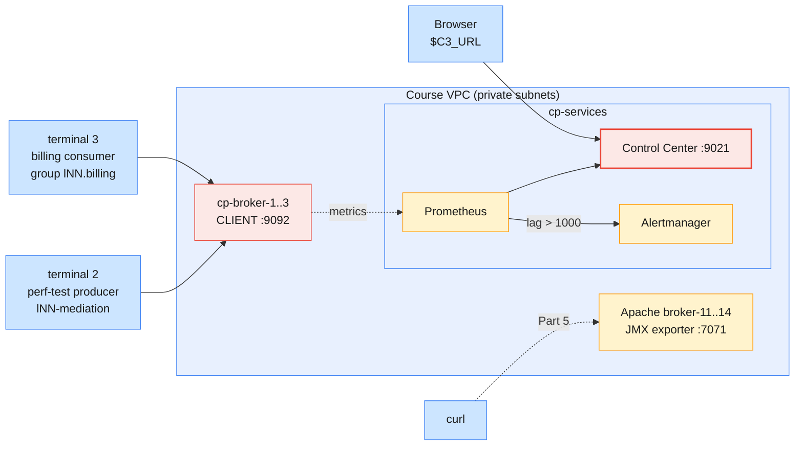
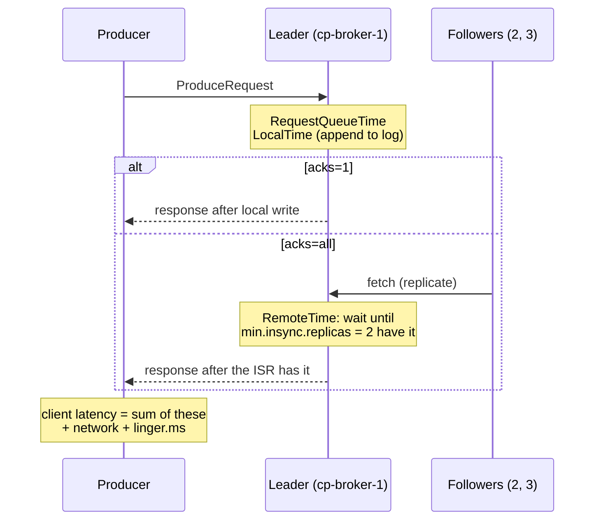

# Lab 02 — Control Center Monitoring, Alerts & Tuning on Confluent Platform

| | |
| --- | --- |
| **Level** | Intermediate → Advanced |
| **Duration** | ~85 minutes |
| **Guide sections** | Module 6 §6.1 Control Center architecture · Module 6 §6.2 A guided tour · Module 4 §3.4 `acks` from the client side · Module 4 §3.6 `kafka-producer-perf-test.sh` · Module 4 §4.5 Inspecting groups · Module 5 §5.5 Cluster balancing · `infra/LAB-SETUP.md` §4 (Apache monitoring) |
| **You will need** | Lab 01 done; the shared Confluent Platform **and** Apache clusters **started by the trainer**; `~/kafka/cp.properties`, `cp-ca.pem`, `confluent.env`; your LDAP password; three terminals; a browser for Control Center |

## Learning objectives

By the end of this lab you will be able to:

1. Monitor a running workload in **Control Center**: cluster, broker, topic
   and consumer-group views, cross-checked with the CLI.
2. Measure the **latency cost of `acks=all`** and of batching on a
   replicated cluster, and explain where the time goes inside a broker.
3. Create a **consumer-lag alert** in Control Center, make it fire, and
   resolve it.
4. **Analyse lag**: its growth rate, the consumer's real capacity, and the
   time to catch up.
5. Compare Control Center with the **JMX / Prometheus** metrics of the shared
   Apache cluster, and say what each one is missing.
6. Choose a **scaling action** from monitoring evidence.

This lab gives less step-by-step help than Lab 01. Each part states the goal
and the key commands. You read the results and fill in the tables.



> **Shared-cluster rule:** 18 learners load the same three brokers. Keep the
> rates in this lab as written (`--throughput` is never `-1` here), so that
> everyone's measurements stay meaningful.

---

## Before you start — variables (5 min)

```bash
# (VM)
source ~/kafka/confluent.env            # CP, MDS_URL, CP_REST, CP_CA, C3_URL
ME=lNN                                  # your prefix
CFG=~/kafka/cp.properties               # your LDAP user on Confluent Platform
JMX=http://broker-11.lab.internal:7071/metrics   # Apache broker 11, Part 5
echo "$ME   $CP   $C3_URL"
kafka-broker-api-versions.sh --bootstrap-server $CP --command-config $CFG | grep "(id:"
```

**Expected:** your prefix and endpoints, then one line per broker:

```
cp-broker-1.lab.internal:9092 (id: 1 rack: null isFenced: false) -> (
cp-broker-2.lab.internal:9092 (id: 2 rack: null isFenced: false) -> (
cp-broker-3.lab.internal:9092 (id: 3 rack: null isFenced: false) -> (
```

Switch the Confluent CLI to your Platform context. If the token has expired,
log in again with your LDAP password:

```bash
# (VM)
confluent login --url $MDS_URL --certificate-authority-path $CP_CA --save
confluent context list
```

**Expected:** `Logged in as "lNN".`, and the `*` on the Platform context.

Copy the variable block into terminals 2 and 3 as well.

---

## Part 1 — Start a steady workload (10 min)

Create the topic on the Platform cluster (three partitions, three replicas,
`min.insync.replicas=2`, the course defaults):

```bash
# (VM)
confluent kafka topic create $ME.cdr.voice --url $CP_REST --certificate-authority-path $CP_CA \
  --partitions 3 --replication-factor 3 --config min.insync.replicas=2
```

**Expected:** `Created topic "lNN.cdr.voice".`

Start the mediation producer in **terminal 2**: 200 CDRs per second for 15
minutes.

```bash
# (VM) - terminal 2
kafka-producer-perf-test.sh --bootstrap-server $CP --command-config $CFG \
  --topic $ME.cdr.voice --num-records 180000 --record-size 200 --throughput 200 \
  --command-property client.id=$ME-mediation acks=all
```

Start the billing consumer in **terminal 3**. It prints nothing; it reads and
commits.

```bash
# (VM) - terminal 3
kafka-console-consumer.sh --bootstrap-server $CP --command-config $CFG \
  --topic $ME.cdr.voice --group $ME.billing --from-beginning > /dev/null
```

Back in terminal 1, confirm that the group keeps up:

```bash
# (VM)
kafka-consumer-groups.sh --bootstrap-server $CP --command-config $CFG --describe --group $ME.billing
```

**Expected:** three rows, `LAG` close to 0, and a `CONSUMER-ID` and
`CLIENT-ID` on every row (one active member owns all three partitions).

---

## Part 2 — Read the workload in Control Center (15 min)

Open `$C3_URL` and log in as `lNN` with your LDAP password. Visit the pages
below in order and fill in the last column:

| # | Page | What to find | Your value |
| - | ---- | ------------ | ---------- |
| 1 | **Cluster overview** | Production and consumption throughput of the **whole** cluster (all learners) | |
| 2 | **Brokers** | Throughput per broker; **production and consumption latency** (request latency percentiles, if shown); under-replicated partitions | |
| 3 | **Topics → `lNN.cdr.voice`** | Production throughput (≈ 40 KB/s: 200 × 200 B); partitions, leaders and in-sync replicas | |
| 4 | **Consumers → `lNN.billing`** | Lag per partition, number of members | |

Cross-check pages 3 and 4 with the CLI:

```bash
# (VM)
kafka-log-dirs.sh --bootstrap-server $CP --command-config $CFG \
  --describe --topic-list $ME.cdr.voice | grep '^{' \
  | jq -r '.brokers[] | "broker \(.broker): \([.logDirs[].partitions[]] | length) replicas, \([.logDirs[].partitions[].size] | add // 0) bytes"'
kafka-consumer-groups.sh --bootstrap-server $CP --command-config $CFG --describe --group $ME.billing
```

**Expected:** `broker 1: 3 replicas, … bytes` for each of brokers 1–3 (RF 3
on three brokers puts one replica of every partition on each), and the
same lag that Control Center shows.

> **What this shows:** the cluster-wide charts include everyone's traffic,
> but the topic and consumer pages show only what your role bindings allow.
> In Control Center 2.x the charts come from the Prometheus that runs next to
> it on `cp-services` (Module 6 §6.1). The brokers send it their metrics, so
> nothing scrapes JMX ports.

> **Tip:** throughput charts are rates over a window. When you change the
> load, give them one to two minutes before you read a new value.

---

## Part 3 — The latency cost of `acks` and batching (15 min)

Goal: measure how much durability and batching cost per record on a
replicated cluster. Run three short tests, **capped at 2,000 records/s**,
from terminal 1 (terminals 2 and 3 keep running):

```bash
# (VM)
for a in "acks=1" "acks=all" "acks=all linger.ms=20 batch.size=65536"; do
  echo "== $a"
  kafka-producer-perf-test.sh --bootstrap-server $CP --command-config $CFG \
    --topic $ME.cdr.voice --num-records 20000 --record-size 200 --throughput 2000 \
    --command-property client.id=$ME-latency $a | tail -1
done
```

**Expected:** three summary lines in this format (the sample is a
50,000-record run at 2,000/s on a local broker; yours depend on the network and on the other learners):

```
== acks=1
50000 records sent, 1997.523071 records/sec (0.38 MB/sec), 9.06 ms avg latency, 410.00 ms max latency, 6 ms 50th, 22 ms 95th, 149 ms 99th, 158 ms 99.9th.
…
```

| Run | avg | p50 | p99 | Throughput reached 2,000/s? |
| --- | --- | --- | --- | --------------------------- |
| **`acks=1`** | | | | |
| **`acks=all`** | | | | |
| **`acks=all`, `linger.ms=20`, `batch.size=65536`** | | | | |

Where the extra time goes inside a broker, for one produce request:



> **What this shows:** `acks=all` adds the followers' replication round trip
> (**RemoteTime**) to every request. That is the price of not losing data
> when a broker dies (Module 4 §3.4). `linger.ms=20` adds up to 20 ms on
> purpose. At 2,000 records/s, that delay is not paid back by better
> throughput, because the producer is not saturated. Compare this with Lab 01
> Part 4, where the producer was saturated.

> **Administrator rule:** never "fix" latency by lowering `acks` on topics
> that carry billing data. Fix the cause: slow followers, disks, or
> under-replicated partitions on the Brokers page.

---

## Part 4 — A consumer-lag alert, and lag analysis (20 min)

### 4.1 Create the trigger

In Control Center, open **Alerts** and add a trigger. Field names can differ
slightly between Control Center versions:

1. **Alerts → Triggers → Add trigger** (or **+ New trigger**).
2. **Name:** `lNN-billing-lag`. **Component type:** *Consumer group*.
   **Consumer group:** `lNN.billing`.
3. **Metric:** *Consumer lag*. **Condition:** *Greater than* `1000`.
   If asked, set the evaluation or buffer time to **1 minute**.
4. Save. Skip the **action** (e-mail, Slack, PagerDuty, webhook): the course
   Alertmanager has no outgoing channel, so you watch the alert in the UI.

> **If you cannot see Alerts or the save is refused:** creating triggers needs
> cluster-level rights that a `ResourceOwner` on `lNN.` may not have. The
> trainer creates `lNN-billing-lag` for you with the values above. Do the
> rest of the part as written: you make it fire.

### 4.2 Make it fire

Stop the billing consumer: press `Ctrl+C` in **terminal 3**. The producer in
terminal 2 keeps writing 200 records per second. Measure the lag twice, one
minute apart:

```bash
# (VM)
lag() { kafka-consumer-groups.sh --bootstrap-server $CP --command-config $CFG \
          --describe --group $ME.billing 2>/dev/null | awk '$1 ~ /billing/ {s+=$6} END {print s}'; }
L1=$(lag); sleep 60; L2=$(lag); echo "lag $L1 -> $L2 : +$((L2-L1)) per minute"
```

**Expected:** about `+12000 per minute` (200 × 60): with no consumer, lag
grows exactly as fast as the producer writes.

Within a few minutes, **Alerts** shows `lNN-billing-lag` as triggered
(in the alert list or history), and **Consumers → `lNN.billing`** shows the
lag climbing on all three partitions.

### 4.3 How fast can billing catch up?

Before you restart the consumer, measure how fast **one** consumer can read.
Use a separate group, so `$ME.billing` keeps its offsets:

```bash
# (VM)
kafka-consumer-perf-test.sh --bootstrap-server $CP --command-config $CFG \
  --topic $ME.cdr.voice --group $ME.perf --num-records 50000 --timeout 30000
```

**Expected** (format from a dry run; read the `nMsg.sec` column):

```
start.time, end.time, data.consumed.in.MB, MB.sec, data.consumed.in.nMsg, nMsg.sec, rebalance.time.ms, fetch.time.ms, fetch.MB.sec, fetch.nMsg.sec
2026-10-07 18:45:03:329, 2026-10-07 18:45:06:880, 9.5682, 2.6945, 50165, 14127.0065, 3314, 237, 40.3722, 211666.6667
```

| Value | Yours |
| ----- | ----- |
| Current lag `L` (records) | |
| Consumer capacity `C` (`nMsg.sec`) | |
| Producer rate `R` (records/s) | 200 |
| Time to catch up `L / (C − R)` (seconds) | |

> **What this shows:** lag alone says little. Lag that is **stable** is a
> consumer running a bit behind. Lag that **grows by R per minute** is a dead
> or stuck consumer. Lag that grows more slowly than R means the consumer is
> too slow (`C < R`). Only the last case needs more consumers or partitions.
> The console consumer measures reading only. A real billing service does work
> per record, so its `C` is much lower. Measure it the same way.

### 4.4 Resolve it

Restart the billing consumer in **terminal 3** (same command as Part 1,
without `--from-beginning`; the group resumes from its committed offsets).
Run `lag` every 30 seconds until it is near 0 and compare with your estimate.
The trigger leaves the triggered state in Control Center after the next
evaluations.

| Question | Your answer |
| -------- | ----------- |
| Estimated catch-up time | |
| Real catch-up time | |
| Minutes between "lag 0" and the alert clearing in Control Center | |

---

## Part 5 — Compare with Apache Kafka JMX / Prometheus (10 min, advanced)

The shared Apache cluster has no Control Center. Each broker runs the
Prometheus **JMX exporter** on port 7071, which turns JMX MBeans into
Prometheus text (`infra/LAB-SETUP.md` §4). Read the raw endpoint that a
Prometheus server would scrape:

```bash
# (VM)
curl -s $JMX | grep -E '^kafka_server_brokertopicmetrics_(messagesinpersec|bytesinpersec)_oneminuterate '
curl -s $JMX | grep -E '^kafka_network_requestmetrics_(totaltimems|remotetimems)_99thpercentile\{request="Produce"'
curl -s $JMX | grep -E '^kafka_server_replicamanager_underreplicatedpartitions_value'
curl -s $JMX | grep -ci 'lag'
```

**Expected:** single metric lines, for example
`kafka_server_brokertopicmetrics_messagesinpersec_oneminuterate 12.3`; the
produce latency percentiles **split into total and remote time**, the same
parts as in the Part 3 diagram; `underreplicatedpartitions_value 0.0`; and
the last command prints a count that includes **no consumer-group lag**
metric.

| Need | Control Center (Platform) | Metrics API (Cloud) | JMX exporter + Prometheus (Apache) |
| ---- | ------------------------- | ------------------- | ---------------------------------- |
| **Throughput** | Charts per cluster, broker, topic | `received_bytes`, `sent_bytes` per topic | `BytesInPerSec` / `MessagesInPerSec` per broker, per topic |
| **Request latency** | Broker latency charts | Not exposed: measure at the client | `RequestMetrics` total / remote / queue time per request type |
| **Consumer lag** | Built in, per group and partition | `consumer_lag_offsets` | **Not a broker metric**: add a lag exporter (for example Kafka Exporter or Burrow), or the clients' `records-lag-max` |
| **Alerts** | Triggers → Alertmanager | Your tool on `/query` or `/export`; Cloud notifications | Prometheus rules → Alertmanager, all hand-written |
| **Dashboards** | Included | Console, or Grafana on `/export` | Build in Grafana yourself |
| **Who sees what** | RBAC-filtered by your login | `MetricsViewer` scope | Anyone who can reach port 7071 |

> **What this shows:** Control Center 2.x is the same stack (Prometheus and
> Alertmanager) that you would build for Apache Kafka. The difference is that
> Confluent ships it pre-wired, with lag, RBAC and a UI. On Apache Kafka you
> choose the exporters, write the rules and secure the endpoints yourself.

---

## Part 6 — Scaling decisions from evidence (10 min, advanced)

Self-managed scaling is your job: you add brokers, partitions or consumers.
First look at what this cluster does for you when it scales:

```bash
# (VM)
kafka-configs.sh --bootstrap-server $CP --command-config $CFG --describe \
  --entity-type brokers --entity-name 1 --all | grep -E "^  confluent.balancer.enable="
```

**Expected:** `confluent.balancer.enable=true …`. **Self-Balancing
Clusters** is on: when a broker is added or the load is uneven, Confluent
Server moves partitions itself. On Apache Kafka you would plan and run that
reassignment by hand (Module 5 §5.2–§5.5).

For each observation, choose the first action and justify it in one line:

| Observation (from Control Center / CLI) | First action | Why |
| --------------------------------------- | ------------ | --- |
| `lNN.billing` lag grows by 12,000/min, group has **0** members | | |
| Lag grows slowly; group has 3 members on a 3-partition topic; consumer capacity `C` < producer rate `R` | | |
| One broker shows twice the bytes in of the others; partition leaders uneven | | |
| Produce p99 rose after a broker restart; under-replicated partitions > 0 on the Brokers page | | |
| All brokers near their network limit; no skew; lag fine | | |

<details>
<summary>Suggested answers</summary>

1. **Restart or fix the consumer.** Nothing reads, so scaling does not help.
2. **Add partitions, then consumers.** A group cannot use more consumers than
   the topic has partitions. Adding partitions changes key → partition
   mapping, so agree it with the application team first.
3. **Rebalance load.** On this cluster Self-Balancing does it; check the
   balancer status before you move partitions by hand.
4. **Wait for the ISR to recover**, then check it. Followers that are catching
   up slow `acks=all` (Part 3). Do not lower `acks`.
5. **Add a broker.** Self-Balancing moves load onto it. On Confluent Cloud
   the equivalent is a bigger cluster type or more CKUs (Lab 01 Part 6).
</details>

---

## Checkpoint questions

<details>
<summary>1. The Control Center lag alert fired at 02:00 and cleared at 02:20 without anyone acting. What happened, and what do you look at in the morning?</summary>

Lag rose above the threshold and the consumer caught up by itself: a slow
batch, a rebalance or a restart. In the morning, look at the group's lag
chart for the shape (sudden jump or slow ramp), at the group's member count
around 02:00, and at the consumer's logs for rebalances. If it recurs,
raise the evaluation window or fix the rebalance cause, rather than ignoring
the alert.
</details>

<details>
<summary>2. Your <code>acks=all</code> p99 is twice the <code>acks=1</code> p99. A developer wants to switch billing to <code>acks=1</code>. What do you answer?</summary>

The difference is the replication round trip (RemoteTime) that makes a
write survive a broker failure. With `acks=1` a leader crash can lose
acknowledged CDRs, which means lost revenue. Keep `acks=all` and look for
avoidable latency instead: under-replicated partitions, slow followers, or a
`linger.ms` that does not fit the traffic.
</details>

<details>
<summary>3. Why does the Apache JMX endpoint have no consumer-lag metric, while Control Center and the Metrics API do?</summary>

Lag is the difference between a partition's log-end offset and a group's
committed offset. No single broker MBean holds that. Consumers expose their
own `records-lag-max`, but only while they run. Control Center and the Cloud
Metrics API compute lag centrally from committed offsets, so it is visible
even when the group is dead. On Apache Kafka you add a lag exporter for the
same result.
</details>

<details>
<summary>4. In Part 4 you created the consumer <code>lNN.perf</code> group to measure capacity. Why not just measure with <code>lNN.billing</code>?</summary>

A perf test with `lNN.billing` would commit offsets for the billing
application. It would "consume" records that billing never processed, and
those CDRs would never be charged. A separate group reads the same data
without moving the production group's position. Delete it afterwards.
</details>

<details>
<summary>5. Control Center shows the cluster at ease, but learners say "the cluster is slow" from their VMs. Which three facts do you collect before changing anything?</summary>

Client-side latency from the affected clients (perf test or the
application's metrics), the Brokers page latency and under-replicated
partitions for the same minutes, and the consumer groups' lag and members.
If the brokers are fast and the clients are slow, the problem is the network,
the client configuration or the client host, not the cluster.
</details>

<details>
<summary>6. Your manager asks: "Why pay for Control Center when Prometheus and Grafana are free?" Give a balanced answer.</summary>

Prometheus and Grafana can show the same broker metrics. For an equal
result, though, you build and maintain the exporters, lag tracking,
dashboards, alert rules and access control yourself. Control Center ships
these integrated with RBAC and topic management, which saves engineering time
on a licensed platform. Teams that already run Prometheus at scale often
use both: Control Center for Kafka operators, and Prometheus for company-wide
alerting.
</details>

---

## Clean up

Stop terminals 2 (if it is still running) and 3 with `Ctrl+C`. Then delete
your trigger in **Alerts → Triggers** (or ask the trainer to delete it, if
the trainer created it). Then:

> **Warning:** delete only your own `$ME.*` topic and groups. Read each
> command before you run it.

```bash
# (VM)
confluent kafka topic delete $ME.cdr.voice --url $CP_REST --certificate-authority-path $CP_CA --force
for g in billing perf; do
  kafka-consumer-groups.sh --bootstrap-server $CP --command-config $CFG --delete --group $ME.$g
done
kafka-topics.sh --bootstrap-server $CP --command-config $CFG --list
confluent context use <your Cloud context name>
```

**Expected:** the topic and both groups deleted, an empty topic list (apart
from topics you kept on purpose), and the `*` back on your Cloud context.

> **Next module:** *Module 9 — Troubleshooting & Preventing Message Loss on
> Confluent Kafka*. The trainer breaks things on purpose: connectivity
> failures, throttling, quotas and `acks` mistakes. You diagnose them with the
> tools from this module: client latency, lag analysis, Control Center and the
> Metrics API.
